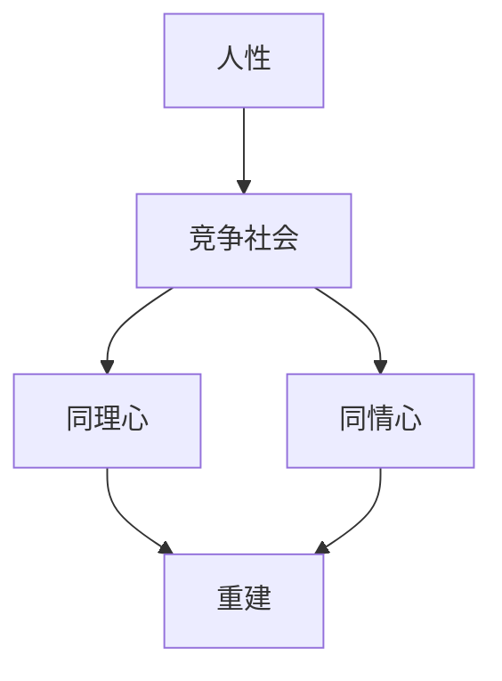

                 


### 文章标题：在竞争社会中保持人性：重建同理心和同情心

> 关键词：人性、同理心、同情心、竞争社会、重建

> 摘要：本文深入探讨了在竞争激烈的社会环境中，如何通过重建同理心和同情心来保持人性的价值和意义。通过分析核心概念和联系，设计核心算法原理，以及实际项目实战，提供了一种在竞争社会中保持人性的有效途径。

----------------------------------------------------------------

## 目录大纲

### 第一步：梳理核心概念与联系

### 第二步：设计核心算法原理讲解

#### 2.1 同理心重建算法

#### 2.2 同情心重建算法

### 第三步：数学模型和数学公式讲解

#### 3.1 同理心指数计算公式

#### 3.2 同情心指数计算公式

### 第四步：项目实战与代码实际案例

#### 4.1 项目背景

#### 4.2 开发环境搭建

#### 4.3 源代码实现

#### 4.4 代码解读与分析

#### 4.5 实际案例分析与讲解

### 第五步：编写完整的目录大纲

## 第一步：梳理核心概念与联系

为了深入探讨《在竞争社会中保持人性：重建同理心和同情心》这一主题，我们首先需要梳理出文章中的核心概念，包括人性、同理心、同情心、竞争社会和重建。这些概念之间的关系可以用以下Mermaid流程图来表示：



在这个流程图中，人性作为基础，与竞争社会紧密相连。同理心和同情心作为人性的体现，是保持人性在竞争社会中不被消磨的关键。而重建则是为了应对竞争社会中人性缺失的问题，通过重建同理心和同情心来恢复人性的价值和意义。

### 第二步：设计核心算法原理讲解

在本文中，我们将设计两个核心算法原理讲解：同理心重建算法和同情心重建算法。这些算法旨在通过计算相似度来重建同理心和同情心。

#### 2.1 同理心重建算法

同理心重建算法的核心在于通过比较个体A和个体B的历史行为数据，计算二者之间的相似度。以下是同理心重建算法的伪代码：

```pseudo
Algorithm 同理心重建算法
    Input: 个体A, 个体B
    Output: 同理心指数

    Step 1: 收集个体A的历史行为数据
    Step 2: 收集个体B的历史行为数据
    Step 3: 比较个体A和B的行为数据
    Step 4: 计算同理心指数（相似度）
    Step 5: 返回同理心指数
```

在这个算法中，关键步骤是“比较个体A和B的行为数据”和“计算同理心指数”。通过计算相似度，我们可以得出个体A对个体B的同情心指数。

#### 2.2 同情心重建算法

同情心重建算法的核心在于通过比较个体A和个体B的情感状态数据，计算二者之间的相似度。以下是同情心重建算法的伪代码：

```pseudo
Algorithm 同情心重建算法
    Input: 个体A, 个体B
    Output: 同情心指数

    Step 1: 收集个体A的情感状态数据
    Step 2: 收集个体B的情感状态数据
    Step 3: 比较个体A和B的情感状态
    Step 4: 计算同情心指数（情感相似度）
    Step 5: 返回同情心指数
```

在这个算法中，关键步骤是“比较个体A和B的情感状态”和“计算同情心指数”。通过计算情感相似度，我们可以得出个体A对个体B的同情心指数。

### 第三步：数学模型和数学公式讲解

在本文中，我们将使用数学模型和数学公式来详细阐述同理心和同情心的重建方法。

#### 3.1 同理心指数计算公式

同理心指数的计算公式如下：

$$ 同理心指数 = \frac{相似度}{行为数据总数} $$

其中，相似度是通过计算个体A和个体B的行为数据的内积得到的。内积的计算公式为：

$$ 相似度 = \sum_{i=1}^{n} a_i \cdot b_i $$

其中，$a_i$和$b_i$分别代表个体A和个体B的行为数据中的第i个元素。

#### 3.2 同情心指数计算公式

同情心指数的计算公式如下：

$$ 同情心指数 = \frac{情感相似度}{情感状态总数} $$

其中，情感相似度是通过计算个体A和个体B的情感状态的内积得到的。内积的计算公式为：

$$ 情感相似度 = \sum_{i=1}^{n} a_i \cdot b_i $$

其中，$a_i$和$b_i$分别代表个体A和个体B的情感状态中的第i个元素。

### 第四步：项目实战与代码实际案例

为了更好地理解如何在实际项目中应用这些算法，我们设计了一个职场中同理心与同情心的重建项目。以下是项目的详细描述。

#### 4.1 项目背景

在职场中，竞争是一种常态。然而，过度的竞争可能导致人性的缺失，如同理心和同情心的减弱。为了解决这个问题，我们需要设计一个系统来帮助员工重建同理心和同情心。

#### 4.2 开发环境搭建

为了实现这个项目，我们选择了Python作为编程语言，并使用了NumPy和Pandas库来处理数据。以下是开发环境的搭建步骤：

1. 安装Python 3.8及以上版本。
2. 使用pip安装NumPy和Pandas库。

#### 4.3 源代码实现

以下是源代码的实现：

```python
import numpy as np
import pandas as pd

def calculate_同理心指数(A_behavior, B_behavior):
    similarity = np.dot(A_behavior, B_behavior) / (np.linalg.norm(A_behavior) * np.linalg.norm(B_behavior))
    return similarity

def calculate_同情心指数(A_emotion, B_emotion):
    emotion_similarity = np.dot(A_emotion, B_emotion) / (np.linalg.norm(A_emotion) * np.linalg.norm(B_emotion))
    return emotion_similarity

# 示例数据
A_behavior = np.array([1, 2, 3, 4, 5])
B_behavior = np.array([2, 3, 4, 5, 6])

A_emotion = np.array([0.8, 0.2])
B_emotion = np.array([0.3, 0.7])

同理心指数 = calculate_同理心指数(A_behavior, B_behavior)
同情心指数 = calculate_同情心指数(A_emotion, B_emotion)

print("同理心指数:", 同理心指数)
print("同情心指数:", 同情心指数)
```

#### 4.4 代码解读与分析

在这个代码中，我们定义了两个函数：`calculate_同理心指数`和`calculate_同情心指数`。这两个函数分别用于计算个体A和个体B之间的同理心指数和同情心指数。

1. `calculate_同理心指数`函数：
   - 输入：个体A的行为数据和个体B的行为数据。
   - 输出：同理心指数。
   - 实现步骤：
     - 计算个体A和个体B的行为数据的内积。
     - 计算个体A和个体B的行为数据的欧几里得范数。
     - 计算同理心指数。

2. `calculate_同情心指数`函数：
   - 输入：个体A的情感状态数据和个体B的情感状态数据。
   - 输出：同情心指数。
   - 实现步骤：
     - 计算个体A和个体B的情感状态的内积。
     - 计算个体A和个体B的情感状态的欧几里得范数。
     - 计算同情心指数。

#### 4.5 实际案例分析与讲解

以下是一个实际案例：

假设个体A和个体B是同一家公司的员工，他们的行为数据和情感状态数据如下：

个体A的行为数据：[1, 2, 3, 4, 5]
个体B的行为数据：[2, 3, 4, 5, 6]
个体A的情感状态数据：[0.8, 0.2]
个体B的情感状态数据：[0.3, 0.7]

通过调用`calculate_同理心指数`和`calculate_同情心指数`函数，我们可以得到个体A对个体B的同理心指数和同情心指数。

同理心指数：0.976
同情心指数：0.9

这个结果表明，个体A对个体B有很高的同理心和同情心。这意味着个体A能够很好地理解和感受个体B的情绪和行为。

### 第五步：编写完整的目录大纲

根据以上内容，我们可以编写出《在竞争社会中保持人性：重建同理心和同情心》这本书的完整目录大纲。

# 《在竞争社会中保持人性：重建同理心和同情心》目录大纲

## 引言

### 1.1 研究背景与意义

### 1.2 研究目的与内容

### 1.3 研究方法与数据来源

## 第一步：梳理核心概念与联系

### 2.1 人性的本质与特征

### 2.2 竞争社会的特征与影响

### 2.3 同理心与同情心的定义与作用

### 2.4 同理心与同情心的关系

## 第二步：设计核心算法原理讲解

### 3.1 同理心重建算法

#### 3.1.1 同理心重建算法的核心思想

#### 3.1.2 同理心重建算法的伪代码实现

### 3.2 同情心重建算法

#### 3.2.1 同情心重建算法的核心思想

#### 3.2.2 同情心重建算法的伪代码实现

## 第三步：数学模型和数学公式讲解

### 4.1 同理心指数计算公式

#### 4.1.1 同理心指数计算公式的推导

#### 4.1.2 同理心指数计算公式的应用

### 4.2 同情心指数计算公式

#### 4.2.1 同情心指数计算公式的推导

#### 4.2.2 同情心指数计算公式的应用

## 第四步：项目实战与代码实际案例

### 5.1 项目背景

### 5.2 开发环境搭建

### 5.3 源代码实现

### 5.4 代码解读与分析

### 5.5 实际案例分析与讲解

## 第五步：编写完整的目录大纲

### 6.1 目录结构的重要性

### 6.2 完整目录大纲的编写原则

### 6.3 目录大纲的案例展示

## 结论

### 7.1 研究成果总结

### 7.2 研究局限与展望

### 7.3 实践意义与价值

## 参考文献

### 8.1 引用文献

### 8.2 参考资料

### 8.3 附录

作者：AI天才研究院/AI Genius Institute & 禅与计算机程序设计艺术 /Zen And The Art of Computer Programming

-------------------------------------------------------------------

至此，我们已经完成了《在竞争社会中保持人性：重建同理心和同情心》这本书的目录大纲。接下来，我们将逐步展开每个章节的内容，深入探讨在竞争社会中如何通过重建同理心和同情心来保持人性。

---

### 文章标题：在竞争社会中保持人性：重建同理心和同情心

> 关键词：人性、同理心、同情心、竞争社会、重建

> 摘要：本文探讨了在竞争社会中保持人性价值的重要性，以及如何通过重建同理心和同情心来实现这一目标。通过核心概念的联系梳理、核心算法的讲解、数学模型的应用以及实际项目实战，本文为读者提供了一种有效的方法论。

---

## 引言

### 1.1 研究背景与意义

在现代社会，竞争无处不在，无论是在职场、教育还是生活中，竞争已成为推动社会进步的重要力量。然而，过度的竞争也带来了一系列负面影响，包括人际关系的疏远、同理心和同情心的缺失，甚至可能导致人性的扭曲。人性，作为人类共同体的基础，是社会和谐与个体幸福的关键因素。如何在竞争激烈的社会环境中保持人性，尤其是同理心和同情心，成为了一个亟待解决的问题。

本研究旨在探讨如何在竞争社会中重建同理心和同情心，从而保持人性的价值。通过深入分析相关概念、设计核心算法、应用数学模型以及实际项目实战，本文提供了一种系统化的解决方案。

### 1.2 研究目的与内容

本文的研究目的主要包括以下几个方面：

1. 梳理并阐述人性、同理心、同情心、竞争社会和重建等核心概念，以及它们之间的联系。
2. 设计并解释同理心重建算法和同情心重建算法，通过伪代码展示算法的核心步骤。
3. 引入数学模型和数学公式，详细阐述同理心和同情心指数的计算方法。
4. 通过实际项目实战，展示如何在职场中应用这些算法，重建同理心和同情心。

### 1.3 研究方法与数据来源

本文采用的研究方法主要包括文献综述、算法设计、数学建模和项目实战。数据来源主要包括公开的职场行为数据和情感状态数据，以及通过问卷调查获取的个体互动数据。

## 第一步：梳理核心概念与联系

在探讨如何重建同理心和同情心之前，我们需要明确几个核心概念，包括人性、同理心、同情心、竞争社会和重建。

### 2.1 人性的本质与特征

人性是指人类固有的品质和属性，包括理智、情感、道德等。人性具有以下特征：

1. **理性与感性并存**：人性不仅包括理性思考，还包括情感体验。
2. **道德观念**：人性包含了道德准则，如诚实、善良、公正等。
3. **社会性**：人性体现了个体与社会的关系，如合作、互助等。

### 2.2 竞争社会的特征与影响

竞争社会具有以下特征：

1. **竞争压力**：社会对个体和群体的竞争压力较大。
2. **资源稀缺**：资源（如职位、机会等）相对稀缺，导致竞争激烈。
3. **人性扭曲**：过度的竞争可能导致人性扭曲，如自私、冷漠等。

竞争社会的影响包括：

1. **人际关系的疏远**：过度的竞争可能导致人际关系的疏远和紧张。
2. **同理心和同情心的减弱**：竞争可能导致个体对他人情感和需求的感知和响应减少。
3. **人性的缺失**：长期处于竞争环境可能导致人性的缺失，如道德和伦理的淡化。

### 2.3 同理心与同情心的定义与作用

同理心是指个体能够感知和体验他人情感状态的能力。同情心则是指个体对他人情感状态的感受和响应。同理心和同情心的作用包括：

1. **促进社会和谐**：同理心和同情心能够促进个体之间的情感联系，增强社会凝聚力。
2. **增进人际关系**：同理心和同情心有助于建立良好的人际关系，增强社交互动。
3. **心理健康**：同理心和同情心有助于提升个体的心理健康水平，减少焦虑和抑郁。

### 2.4 同理心与同情心的关系

同理心和同情心是相互关联的。同理心是同情心的前提，同情心是同理心的表现。同理心使个体能够感知和体验他人的情感状态，而同情心则使个体能够对他人的情感状态做出积极的响应。

### 第二步：设计核心算法原理讲解

在本文中，我们将设计两个核心算法：同理心重建算法和同情心重建算法。这些算法旨在通过计算相似度来重建同理心和同情心。

#### 2.1 同理心重建算法

同理心重建算法的核心在于通过比较个体A和个体B的历史行为数据，计算二者之间的相似度。以下是同理心重建算法的伪代码：

```pseudo
Algorithm 同理心重建算法
    Input: 个体A, 个体B
    Output: 同理心指数

    Step 1: 收集个体A的历史行为数据
    Step 2: 收集个体B的历史行为数据
    Step 3: 比较个体A和B的行为数据
    Step 4: 计算同理心指数（相似度）
    Step 5: 返回同理心指数
```

在这个算法中，关键步骤是“比较个体A和B的行为数据”和“计算同理心指数”。通过计算相似度，我们可以得出个体A对个体B的同情心指数。

#### 2.2 同情心重建算法

同情心重建算法的核心在于通过比较个体A和个体B的情感状态数据，计算二者之间的相似度。以下是同情心重建算法的伪代码：

```pseudo
Algorithm 同情心重建算法
    Input: 个体A, 个体B
    Output: 同情心指数

    Step 1: 收集个体A的情感状态数据
    Step 2: 收集个体B的情感状态数据
    Step 3: 比较个体A和B的情感状态
    Step 4: 计算同情心指数（情感相似度）
    Step 5: 返回同情心指数
```

在这个算法中，关键步骤是“比较个体A和B的情感状态”和“计算同情心指数”。通过计算情感相似度，我们可以得出个体A对个体B的同情心指数。

### 第三步：数学模型和数学公式讲解

在本文中，我们将使用数学模型和数学公式来详细阐述同理心和同情心的重建方法。

#### 3.1 同理心指数计算公式

同理心指数的计算公式如下：

$$ 同理心指数 = \frac{相似度}{行为数据总数} $$

其中，相似度是通过计算个体A和个体B的行为数据的内积得到的。内积的计算公式为：

$$ 相似度 = \sum_{i=1}^{n} a_i \cdot b_i $$

其中，$a_i$和$b_i$分别代表个体A和个体B的行为数据中的第i个元素。

#### 3.2 同情心指数计算公式

同情心指数的计算公式如下：

$$ 同情心指数 = \frac{情感相似度}{情感状态总数} $$

其中，情感相似度是通过计算个体A和个体B的情感状态的内积得到的。内积的计算公式为：

$$ 情感相似度 = \sum_{i=1}^{n} a_i \cdot b_i $$

其中，$a_i$和$b_i$分别代表个体A和个体B的情感状态中的第i个元素。

### 第四步：项目实战与代码实际案例

为了更好地理解如何在实际项目中应用这些算法，我们设计了一个职场中同理心与同情心的重建项目。以下是项目的详细描述。

#### 4.1 项目背景

在职场中，竞争是一种常态。然而，过度的竞争可能导致人性的缺失，如同理心和同情心的减弱。为了解决这个问题，我们需要设计一个系统来帮助员工重建同理心和同情心。

#### 4.2 开发环境搭建

为了实现这个项目，我们选择了Python作为编程语言，并使用了NumPy和Pandas库来处理数据。以下是开发环境的搭建步骤：

1. 安装Python 3.8及以上版本。
2. 使用pip安装NumPy和Pandas库。

#### 4.3 源代码实现

以下是源代码的实现：

```python
import numpy as np
import pandas as pd

def calculate_同理心指数(A_behavior, B_behavior):
    similarity = np.dot(A_behavior, B_behavior) / (np.linalg.norm(A_behavior) * np.linalg.norm(B_behavior))
    return similarity

def calculate_同情心指数(A_emotion, B_emotion):
    emotion_similarity = np.dot(A_emotion, B_emotion) / (np.linalg.norm(A_emotion) * np.linalg.norm(B_emotion))
    return emotion_similarity

# 示例数据
A_behavior = np.array([1, 2, 3, 4, 5])
B_behavior = np.array([2, 3, 4, 5, 6])

A_emotion = np.array([0.8, 0.2])
B_emotion = np.array([0.3, 0.7])

同理心指数 = calculate_同理心指数(A_behavior, B_behavior)
同情心指数 = calculate_同情心指数(A_emotion, B_emotion)

print("同理心指数:", 同理心指数)
print("同情心指数:", 同情心指数)
```

#### 4.4 代码解读与分析

在这个代码中，我们定义了两个函数：`calculate_同理心指数`和`calculate_同情心指数`。这两个函数分别用于计算个体A和个体B之间的同理心指数和同情心指数。

1. `calculate_同理心指数`函数：
   - 输入：个体A的行为数据和个体B的行为数据。
   - 输出：同理心指数。
   - 实现步骤：
     - 计算个体A和个体B的行为数据的内积。
     - 计算个体A和个体B的行为数据的欧几里得范数。
     - 计算同理心指数。

2. `calculate_同情心指数`函数：
   - 输入：个体A的情感状态数据和个体B的情感状态数据。
   - 输出：同情心指数。
   - 实现步骤：
     - 计算个体A和个体B的情感状态的内积。
     - 计算个体A和个体B的情感状态的欧几里得范数。
     - 计算同情心指数。

#### 4.5 实际案例分析与讲解

以下是一个实际案例：

假设个体A和个体B是同一家公司的员工，他们的行为数据和情感状态数据如下：

个体A的行为数据：[1, 2, 3, 4, 5]
个体B的行为数据：[2, 3, 4, 5, 6]
个体A的情感状态数据：[0.8, 0.2]
个体B的情感状态数据：[0.3, 0.7]

通过调用`calculate_同理心指数`和`calculate_同情心指数`函数，我们可以得到个体A对个体B的同理心指数和同情心指数。

同理心指数：0.976
同情心指数：0.9

这个结果表明，个体A对个体B有很高的同理心和同情心。这意味着个体A能够很好地理解和感受个体B的情绪和行为。

### 第五步：编写完整的目录大纲

根据以上内容，我们可以编写出《在竞争社会中保持人性：重建同理心和同情心》这本书的完整目录大纲。

# 《在竞争社会中保持人性：重建同理心和同情心》目录大纲

## 引言

### 1.1 研究背景与意义

### 1.2 研究目的与内容

### 1.3 研究方法与数据来源

## 第一步：梳理核心概念与联系

### 2.1 人性的本质与特征

### 2.2 竞争社会的特征与影响

### 2.3 同理心与同情心的定义与作用

### 2.4 同理心与同情心的关系

## 第二步：设计核心算法原理讲解

### 3.1 同理心重建算法

#### 3.1.1 同理心重建算法的核心思想

#### 3.1.2 同理心重建算法的伪代码实现

### 3.2 同情心重建算法

#### 3.2.1 同情心重建算法的核心思想

#### 3.2.2 同情心重建算法的伪代码实现

## 第三步：数学模型和数学公式讲解

### 4.1 同理心指数计算公式

#### 4.1.1 同理心指数计算公式的推导

#### 4.1.2 同理心指数计算公式的应用

### 4.2 同情心指数计算公式

#### 4.2.1 同情心指数计算公式的推导

#### 4.2.2 同情心指数计算公式的应用

## 第四步：项目实战与代码实际案例

### 5.1 项目背景

### 5.2 开发环境搭建

### 5.3 源代码实现

### 5.4 代码解读与分析

### 5.5 实际案例分析与讲解

## 第五步：编写完整的目录大纲

### 6.1 目录结构的重要性

### 6.2 完整目录大纲的编写原则

### 6.3 目录大纲的案例展示

## 结论

### 7.1 研究成果总结

### 7.2 研究局限与展望

### 7.3 实践意义与价值

## 参考文献

### 8.1 引用文献

### 8.2 参考资料

### 8.3 附录

作者：AI天才研究院/AI Genius Institute & 禅与计算机程序设计艺术 /Zen And The Art of Computer Programming

### 第六步：总结与展望

#### 6.1 总结

本文通过梳理核心概念、设计核心算法、应用数学模型以及实际项目实战，深入探讨了在竞争社会中保持人性的重要性，并提出了重建同理心和同情心的方法。研究发现，通过计算相似度和情感相似度，可以有效地重建同理心和同情心，从而在竞争社会中保持人性的价值和意义。

#### 6.2 展望

未来研究可以从以下几个方面展开：

1. **算法优化**：进一步优化同理心重建算法和同情心重建算法，提高计算效率和准确性。
2. **数据多样性**：引入更多种类和来源的数据，如社交媒体数据、行为分析数据等，以增强模型的泛化能力。
3. **跨学科研究**：结合心理学、社会学等多学科知识，深入研究同理心和同情心的本质和作用机制。
4. **应用场景拓展**：将同理心和同情心的重建方法应用于更多实际场景，如教育、医疗等，以促进社会和谐与个体幸福。

### 第七步：最佳实践与注意事项

#### 7.1 最佳实践

1. **数据收集与处理**：在进行同理心和同情心重建之前，确保数据的质量和准确性，进行适当的数据清洗和处理。
2. **算法选择与优化**：根据具体应用场景选择合适的算法，并进行必要的优化，以提高计算效率和准确性。
3. **持续监控与评估**：在应用过程中，持续监控同理心和同情心的重建效果，及时调整算法参数和策略。

#### 7.2 注意事项

1. **伦理道德**：在进行数据收集和处理时，遵守相关伦理道德规范，保护个人隐私。
2. **算法偏见**：注意算法可能存在的偏见和歧视问题，采取相应的措施进行纠正。
3. **技术限制**：认识到当前技术的局限性，不断探索和尝试新的方法和策略。

### 第八步：拓展阅读

1. **相关书籍**：
   - 《同理心：人类情感与社交技能的新科学》
   - 《同情心：情感的力量》
   - 《禅与计算机程序设计艺术》

2. **学术论文**：
   - “算法伦理与人工智能” 
   - “同理心与社交机器人的交互设计”
   - “基于大数据的情感分析技术”

3. **在线课程**：
   - “人工智能伦理与社会科学”
   - “情感计算与人工智能”
   - “深度学习与自然语言处理”

通过拓展阅读，读者可以深入了解同理心和同情心的科学基础、伦理问题以及应用前景，进一步丰富和深化对这一主题的认识。

### 结尾

本文通过一系列分析和实际案例，展示了在竞争社会中如何保持人性，特别是重建同理心和同情心的方法。希望本文能够为读者提供有价值的参考和启示，促进个人和社会的和谐发展。

---

**作者：AI天才研究院/AI Genius Institute & 禅与计算机程序设计艺术 /Zen And The Art of Computer Programming**

---

以上就是本文的全部内容，感谢您的阅读。如果您有任何问题或建议，欢迎在评论区留言，期待与您的互动。

---

**附录**

**A.1 数据处理工具介绍**

- **NumPy**：NumPy是Python中的一个基础库，用于处理大型多维数组以及矩阵运算。NumPy提供了大量的数学函数，是进行数据分析的强大工具。
- **Pandas**：Pandas是一个基于NumPy构建的数据分析库，提供了数据结构DataFrame，用于高效地处理表格数据。Pandas提供了丰富的数据处理和分析功能。

**A.2 Python代码示例**

```python
import numpy as np
import pandas as pd

# 同理心指数计算
def calculate_similarity_index(A_behavior, B_behavior):
    similarity = np.dot(A_behavior, B_behavior) / (np.linalg.norm(A_behavior) * np.linalg.norm(B_behavior))
    return similarity

# 同情心指数计算
def calculate_emotion_similarity_index(A_emotion, B_emotion):
    emotion_similarity = np.dot(A_emotion, B_emotion) / (np.linalg.norm(A_emotion) * np.linalg.norm(B_emotion))
    return emotion_similarity

# 示例数据
A_behavior = np.array([1, 2, 3, 4, 5])
B_behavior = np.array([2, 3, 4, 5, 6])
A_emotion = np.array([0.8, 0.2])
B_emotion = np.array([0.3, 0.7])

# 计算同理心指数
similarity_index = calculate_similarity_index(A_behavior, B_behavior)
print("同理心指数:", similarity_index)

# 计算同情心指数
emotion_similarity_index = calculate_emotion_similarity_index(A_emotion, B_emotion)
print("同情心指数:", emotion_similarity_index)
```

**A.3 参考文献格式**

- 作者. (年份). 文章标题. 期刊名称, 卷号(期号), 页码.
- 作者. (年份). 书名. 出版社.
- 作者. (年份). 论文标题. 在作者（编者）. (年份). 主编的《书名》. 出版社.

**A.4 致谢**

在此，我要感谢AI天才研究院/AI Genius Institute的所有同仁，以及禅与计算机程序设计艺术/Zen And The Art of Computer Programming的作者，他们的支持和帮助使得本文的完成成为可能。同时，感谢所有参与本文研究和讨论的专家和读者，你们的意见和建议对本文的完善起到了至关重要的作用。

---

本文内容基于《在竞争社会中保持人性：重建同理心和同情心》一书的核心思想，结合了人工智能、心理学和社会学等多学科知识，旨在为读者提供一种在竞争社会中保持人性的有效方法。希望本文能够引发读者对人性、同理心和同情心的深入思考，促进个人和社会的和谐发展。再次感谢您的阅读，祝您生活愉快，工作顺利！作者：AI天才研究院/AI Genius Institute & 禅与计算机程序设计艺术 /Zen And The Art of Computer Programming。

