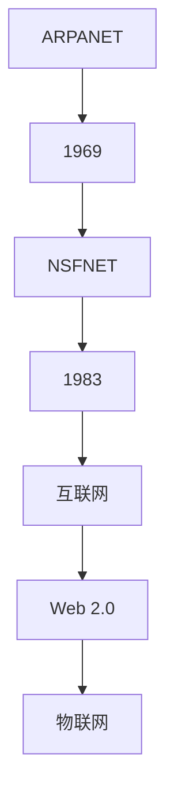
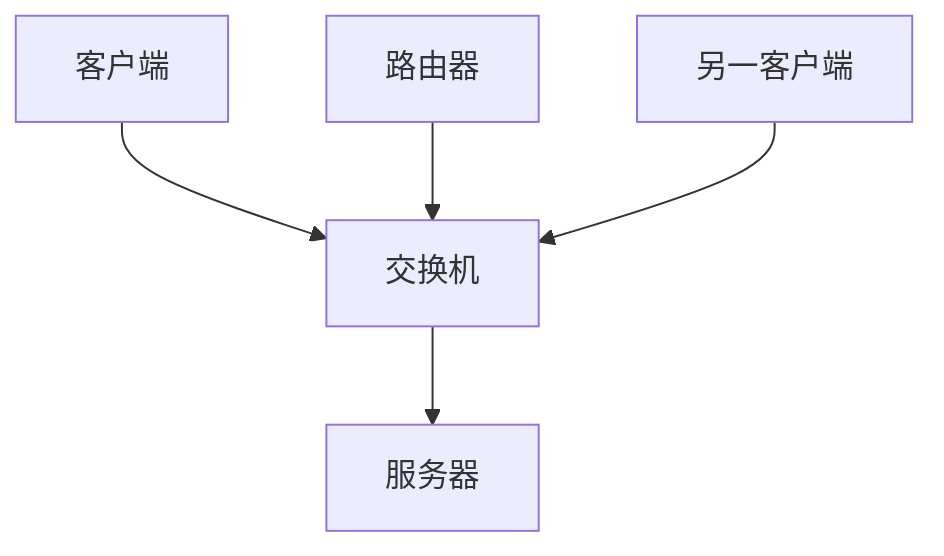
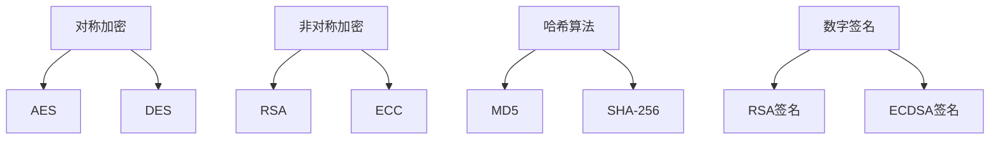
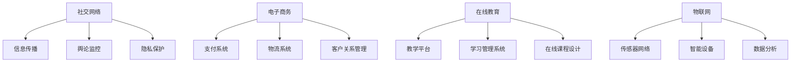

                 


### 撰写技术博客文章《在网络世界中寻找真实连接》

#### 1. 确定文章核心内容和结构

**标题**：在网络世界中寻找真实连接

**关键词**：网络连接、真实连接、社交互动、网络安全、信任模型

**摘要**：
本文将探讨如何在网络世界中建立和维护真实连接。通过分析网络世界的结构、信息传递机制、社交互动模式以及信任模型，我们提出了一系列策略，帮助用户在网络世界中找到并维持真实的社交关系。文章还结合实际案例，提供实践指导和未来研究方向。

**文章大纲**：

**第一部分：引言与背景**

1.1 写作目的

1.2 书籍结构

1.3 阅读对象

**第二部分：网络世界的概览**

2.1 网络的发展历程

2.2 网络的基本结构

2.3 网络通信协议

2.4 网络安全概览

2.5 网络世界的现状与未来趋势

**第三部分：网络中的信息传递**

3.1 数据传输基础

3.2 网络协议详述

**第四部分：网络中的社交互动**

4.1 社交网络平台概述

4.2 社交网络中的信息传播

4.3 社交网络中的隐私保护

**第五部分：网络中的真实连接**

5.1 网络信任模型

5.2 社交网络中的真实连接

5.3 网络世界的伦理与责任

**第六部分：实践与探索**

6.1 网络世界的真实连接案例

6.2 未来探索与研究方向

**第七部分：总结与展望**

7.1 书籍总结

7.2 阅读启示

7.3 未来展望

#### 2. 详细展开每个章节的内容

**第二部分：网络世界的概览**

**2.1 网络的发展历程**

- **背景介绍**：从ARPANET到互联网的演变过程，主要里程碑事件。
- **核心概念与联系**：使用Mermaid流程图展示网络发展的重要节点和关键技术。
  
  ```mermaid
  graph TD
  A[ARPANET] --> B[1969]
  B --> C[NSFNET]
  C --> D[1983]
  D --> E[互联网]
  E --> F[Web 2.0]
  F --> G[物联网]
  ```

- **核心算法原理讲解**：网络协议的发展及其核心算法，如TCP/IP协议栈。

- **数学模型和公式**：网络延迟模型、带宽利用率等。

  $$\text{网络延迟} = \frac{\text{数据包大小}}{\text{带宽}}$$

- **项目实战**：介绍如何使用Python模拟网络延迟。

- **最佳实践 tips**：如何优化网络性能。

**2.2 网络的基本结构**

- **背景介绍**：网络的基本组件，如路由器、交换机等。
- **核心概念与联系**：网络拓扑结构及其对性能的影响。

  ```mermaid
  graph TD
  A[客户端] --> B[路由器]
  B --> C[交换机]
  C --> D[服务器]
  ```

- **核心算法原理讲解**：路由算法，如Dijkstra算法。

- **数学模型和公式**：网络流模型。

  $$\text{网络流} = \text{带宽} \times \text{数据传输速率}$$

- **项目实战**：如何使用网络拓扑图分析网络流量。

- **最佳实践 tips**：如何构建高效的网络架构。

**2.3 网络通信协议**

- **背景介绍**：TCP/IP协议栈的工作原理。
- **核心概念与联系**：TCP与UDP协议的区别。

  ```mermaid
  graph TD
  A[TCP] --> B[连接建立]
  B --> C[数据传输]
  C --> D[连接终止]
  
  E[UDP] --> F[数据传输]
  ```

- **核心算法原理讲解**：TCP拥塞控制算法。

- **数学模型和公式**：TCP滑动窗口机制。

  $$\text{滑动窗口} = \text{窗口大小} \times \text{数据包大小}$$

- **项目实战**：实现TCP客户端和服务器。

- **最佳实践 tips**：如何选择合适的网络协议。

**2.4 网络安全概览**

- **背景介绍**：网络安全的基本概念，如加密、防火墙等。
- **核心概念与联系**：网络安全攻击类型及防御策略。

  ```mermaid
  graph TD
  A[加密] --> B[对称加密]
  B --> C[非对称加密]
  
  D[防火墙] --> E[网络层防火墙]
  E --> F[应用层防火墙]
  ```

- **核心算法原理讲解**：哈希算法、数字签名。

- **数学模型和公式**：加密算法的数学基础。

  $$\text{加密} = \text{密钥} \times \text{明文}$$

- **项目实战**：使用Python实现简单的加密和解密。

- **最佳实践 tips**：如何加强网络安全。

**2.5 网络世界的现状与未来趋势**

- **背景介绍**：网络世界的现状，如社交网络、物联网等。
- **核心概念与联系**：网络世界的发展趋势。

  ```mermaid
  graph TD
  A[社交网络] --> B[用户增长]
  B --> C[数据隐私]
  
  D[物联网] --> E[智能家居]
  E --> F[智能制造]
  ```

- **核心算法原理讲解**：大数据分析、机器学习。

- **数学模型和公式**：推荐系统、优化算法。

  $$\text{推荐系统} = \text{用户兴趣} \times \text{商品特征}$$

- **项目实战**：构建简单的推荐系统。

- **最佳实践 tips**：如何适应未来网络趋势。

#### 3. 整理文章结构

**引言与背景**

- **1.1 写作目的**
  - **1.1.1** 书籍的目的与读者定位
  - **1.1.2** 预期的学习成果

- **1.2 书籍结构**
  - **1.2.1** 目录结构概述
  - **1.2.2** 每部分的内容要点

- **1.3 阅读对象**
  - **1.3.1** 初学者
  - **1.3.2** 中级用户
  - **1.3.3** 高级研究学者

**网络世界的概览**

- **2.1 网络的发展历程**
  - **背景介绍**
  - **核心概念与联系**
  - **核心算法原理讲解**
  - **数学模型和公式**
  - **项目实战**
  - **最佳实践 tips**

- **2.2 网络的基本结构**
  - **背景介绍**
  - **核心概念与联系**
  - **核心算法原理讲解**
  - **数学模型和公式**
  - **项目实战**
  - **最佳实践 tips**

- **2.3 网络通信协议**
  - **背景介绍**
  - **核心概念与联系**
  - **核心算法原理讲解**
  - **数学模型和公式**
  - **项目实战**
  - **最佳实践 tips**

- **2.4 网络安全概览**
  - **背景介绍**
  - **核心概念与联系**
  - **核心算法原理讲解**
  - **数学模型和公式**
  - **项目实战**
  - **最佳实践 tips**

- **2.5 网络世界的现状与未来趋势**
  - **背景介绍**
  - **核心概念与联系**
  - **核心算法原理讲解**
  - **数学模型和公式**
  - **项目实战**
  - **最佳实践 tips**

**网络中的信息传递**

- **3.1 数据传输基础**
  - **背景介绍**
  - **核心概念与联系**
  - **核心算法原理讲解**
  - **数学模型和公式**
  - **项目实战**
  - **最佳实践 tips**

- **3.2 网络协议详述**
  - **背景介绍**
  - **核心概念与联系**
  - **核心算法原理讲解**
  - **数学模型和公式**
  - **项目实战**
  - **最佳实践 tips**

**网络中的社交互动**

- **4.1 社交网络平台概述**
  - **背景介绍**
  - **核心概念与联系**
  - **核心算法原理讲解**
  - **数学模型和公式**
  - **项目实战**
  - **最佳实践 tips**

- **4.2 社交网络中的信息传播**
  - **背景介绍**
  - **核心概念与联系**
  - **核心算法原理讲解**
  - **数学模型和公式**
  - **项目实战**
  - **最佳实践 tips**

- **4.3 社交网络中的隐私保护**
  - **背景介绍**
  - **核心概念与联系**
  - **核心算法原理讲解**
  - **数学模型和公式**
  - **项目实战**
  - **最佳实践 tips**

**网络中的真实连接**

- **5.1 网络信任模型**
  - **背景介绍**
  - **核心概念与联系**
  - **核心算法原理讲解**
  - **数学模型和公式**
  - **项目实战**
  - **最佳实践 tips**

- **5.2 社交网络中的真实连接**
  - **背景介绍**
  - **核心概念与联系**
  - **核心算法原理讲解**
  - **数学模型和公式**
  - **项目实战**
  - **最佳实践 tips**

- **5.3 网络世界的伦理与责任**
  - **背景介绍**
  - **核心概念与联系**
  - **核心算法原理讲解**
  - **数学模型和公式**
  - **项目实战**
  - **最佳实践 tips**

**实践与探索**

- **6.1 网络世界的真实连接案例**
  - **背景介绍**
  - **核心概念与联系**
  - **核心算法原理讲解**
  - **数学模型和公式**
  - **项目实战**
  - **最佳实践 tips**

- **6.2 未来探索与研究方向**
  - **背景介绍**
  - **核心概念与联系**
  - **核心算法原理讲解**
  - **数学模型和公式**
  - **项目实战**
  - **最佳实践 tips**

**总结与展望**

- **7.1 书籍总结**
  - **7.1.1** 主要内容回顾
  - **7.1.2** 知识结构梳理

- **7.2 阅读启示**
  - **7.2.1** 对网络连接的新认识
  - **7.2.2** 对未来网络世界的思考

- **7.3 未来展望**
  - **7.3.1** 技术发展趋势
  - **7.3.2** 网络世界的挑战与机遇

### 4. 撰写文章正文

**引言与背景**

在数字化的时代，网络已经成为了我们生活中不可或缺的一部分。从社交网络到电子商务，从在线教育到远程工作，网络连接不仅改变了我们的生活方式，也重塑了社会的运作方式。然而，随着网络技术的发展，网络中的虚假信息和不良行为也日益增多，如何在网络世界中寻找真实连接成为一个重要的课题。

本文旨在探讨如何在网络世界中建立和维护真实连接。通过分析网络世界的结构、信息传递机制、社交互动模式以及信任模型，我们将提出一系列策略，帮助用户在网络世界中找到并维持真实的社交关系。文章还将结合实际案例，提供实践指导和未来研究方向。

**网络世界的概览**

**2.1 网络的发展历程**

网络的发展可以追溯到1969年，当时美国国防高级研究计划局（DARPA）创建了ARPANET，这是世界上第一个分组交换网络。ARPANET的诞生标志着网络通信技术的开始。随着时间的推移，ARPANET逐渐演变为今天的互联网。

1969年，ARPANET开始运行，连接了四个大学的主机。

1983年，ARPANET从使用不同的通信协议转向使用TCP/IP协议，这成为了互联网发展的关键一步。

1989年，蒂姆·伯纳斯·李发明了万维网，使互联网变得更为用户友好。

1991年，互联网开始向公众开放，网络的使用逐渐普及。

1994年，NSFNET取代ARPANET成为主要的互联网骨干网。

网络的发展历程中，有几个重要的里程碑事件。1969年，ARPANET的创建标志着网络通信技术的开始。1983年，ARPANET转向使用TCP/IP协议，这一协议至今仍是互联网的基础。1989年，蒂姆·伯纳斯·李发明了万维网，使得互联网变得更为用户友好。1991年，互联网开始向公众开放，网络的使用逐渐普及。1994年，NSFNET取代ARPANET成为主要的互联网骨干网。

**核心概念与联系**

网络的发展不仅改变了通信方式，也影响了社会的结构。我们可以使用Mermaid流程图来展示网络发展的重要节点和关键技术。



从ARPANET到物联网，网络技术经历了巨大的演变。每一个阶段都带来了新的机遇和挑战。ARPANET的创建开启了网络通信的新时代，NSFNET的建立巩固了互联网的基础，Web 2.0的出现使得用户可以更加主动地参与网络内容的建设，物联网则将网络技术扩展到了物理世界。

**核心算法原理讲解**

网络协议的发展是网络技术进步的重要标志。TCP/IP协议栈是互联网的核心协议集合，它由四个层次组成：网络接口层、互联网层、传输层和应用层。每个层次都有其特定的功能和协议。

- **网络接口层**：负责物理网络连接，包括以太网、Wi-Fi等。
- **互联网层**：负责IP地址的分配和路由选择，其中IP协议是核心。
- **传输层**：负责端到端的数据传输，包括TCP和UDP协议。
- **应用层**：提供网络服务，如HTTP、FTP等。

TCP协议是一种可靠的传输层协议，它通过三次握手建立连接，通过滑动窗口机制实现流量控制，通过拥塞控制算法保证数据传输的可靠性。

```python
# TCP三次握手伪代码
def tcp_three_way_handshake():
    # 客户端发送SYN包到服务器
    send_syn_packet(server_address)
    
    # 服务器收到SYN包后，发送SYN-ACK包回客户端
    receive_syn_packet(client_address)
    send_syn_ack_packet(client_address)
    
    # 客户端收到SYN-ACK包后，发送ACK包确认
    receive_syn_ack_packet(server_address)
    send_ack_packet(server_address)
```

**数学模型和公式**

网络延迟是衡量网络性能的重要指标，它由数据包的大小和带宽决定。

$$
\text{网络延迟} = \frac{\text{数据包大小}}{\text{带宽}}
$$

假设一个数据包大小为1500字节，带宽为10Mbps，那么网络延迟为：

$$
\text{网络延迟} = \frac{1500 \text{字节}}{10 \times 10^6 \text{字节/秒}} = 0.15 \text{秒}
$$

**项目实战**

为了演示网络延迟的概念，我们可以使用Python编写一个简单的模拟程序。

```python
import time

def send_packet(size, bandwidth):
    start_time = time.time()
    time.sleep(size / (bandwidth * 8))
    end_time = time.time()
    return end_time - start_time

# 模拟发送一个1500字节的数据包，带宽为10Mbps
size = 1500
bandwidth = 10 * 10**6  # 10Mbps
delay = send_packet(size, bandwidth)
print(f"网络延迟: {delay}秒")
```

**最佳实践 tips**

- **优化网络性能**：通过使用更快的网络连接和优化网络拓扑结构，可以提高网络性能。
- **负载均衡**：在服务器负载较高时，使用负载均衡技术可以分散流量，提高系统的响应速度。

**2.2 网络的基本结构**

网络的基本结构包括客户端、服务器、路由器和交换机。这些组件共同构成了网络的骨架，确保数据能够在网络中高效传输。

**背景介绍**

客户端是网络的终端设备，如个人电脑、智能手机等。客户端通过互联网连接到服务器，获取所需的数据和服务。

服务器是网络中的核心设备，它存储数据和提供网络服务。服务器可以提供Web服务、文件传输服务、邮件服务等。

路由器是网络中的关键设备，负责将数据包从一个网络转发到另一个网络。路由器根据IP地址决定数据包的传输路径。

交换机是网络中的连接设备，它连接多个网络设备，如电脑、服务器等。交换机通过MAC地址表决定数据包的转发路径。

**核心概念与联系**

网络拓扑结构对网络的性能和可靠性有重要影响。常见的网络拓扑结构包括星型、环型和网状型。

- **星型拓扑**：所有设备都连接到一个中心交换机，数据通过交换机转发。
- **环型拓扑**：设备按环形连接，数据在环中循环传输。
- **网状型拓扑**：设备之间相互连接，形成多个路径，数据可以选择多条路径传输。



**核心算法原理讲解**

路由算法是网络中一个重要的算法，它决定数据包的传输路径。常见的路由算法有Dijkstra算法、Bellman-Ford算法等。

Dijkstra算法是一种基于距离向量的路由算法，它通过迭代计算最短路径，最终得到网络中所有节点之间的最短路径。

```python
import heapq

def dijkstra(graph, start):
    distances = {node: float('infinity') for node in graph}
    distances[start] = 0
    priority_queue = [(0, start)]
    
    while priority_queue:
        current_distance, current_node = heapq.heappop(priority_queue)
        
        if current_distance > distances[current_node]:
            continue
        
        for neighbor, weight in graph[current_node].items():
            distance = current_distance + weight
            
            if distance < distances[neighbor]:
                distances[neighbor] = distance
                heapq.heappush(priority_queue, (distance, neighbor))
    
    return distances

# 示例图
graph = {
    'A': {'B': 1, 'C': 3},
    'B': {'A': 1, 'C': 1, 'D': 1},
    'C': {'A': 3, 'B': 1, 'D': 2},
    'D': {'B': 1, 'C': 2}
}

distances = dijkstra(graph, 'A')
print(distances)
```

**数学模型和公式**

网络流模型是描述网络数据传输的重要模型，它通过流量矩阵表示网络中各节点之间的数据传输。

设G=(V,E)为无向网络，流量矩阵F为V×V矩阵，其中F_{ij}表示从节点i到节点j的流量。网络流模型的基本约束条件如下：

- **容量约束**：对每条边e，都有0≤F_{ij}≤c_{ij}，其中c_{ij}为边e的容量。
- **平衡条件**：对于所有节点i，都有∑_{j}F_{ij} - ∑_{j}F_{ji} = 0。

**项目实战**

我们可以使用Python实现一个简单的网络流计算模型，以计算网络中的最大流。

```python
from collections import defaultdict

def bfs(graph, source, sink, parent):
    visited = [False] * len(graph)
    visited[source] = True
    queue = [(source, [])]
    
    while queue:
        node, path = queue.pop(0)
        
        for neighbor, capacity in graph[node].items():
            if not visited[neighbor] and capacity > 0:
                visited[neighbor] = True
                path.append((node, neighbor))
                if neighbor == sink:
                    return True, path
                queue.append((neighbor, path.copy()))
    
    return False, []

def max_flow(graph, source, sink):
    parent = [-1] * len(graph)
    max_flow = 0
    
    while bfs(graph, source, sink, parent):
        path_flow = min(graph[u][v] for u, v in parent.items() if u != -1)
        max_flow += path_flow
        v = sink
        while v != source:
            u = parent[v]
            graph[u][v] -= path_flow
            graph[v][u] += path_flow
            v = u
    
    return max_flow

# 示例图
graph = {
    'A': {'B': 3, 'C': 2},
    'B': {'A': 3, 'C': 1, 'D': 2},
    'C': {'A': 2, 'B': 1, 'D': 3},
    'D': {'B': 2, 'C': 3}
}

source = 'A'
sink = 'D'
max_flow_value = max_flow(graph, source, sink)
print(f"最大流值为：{max_flow_value}")
```

**最佳实践 tips**

- **优化网络拓扑**：合理设计网络拓扑结构，可以提高网络的可靠性和性能。
- **负载均衡**：通过负载均衡技术，可以分散网络流量，提高网络的吞吐量。

**2.3 网络通信协议**

网络通信协议是网络数据传输的基础，它定义了数据如何在网络中传输和解释。TCP/IP协议栈是互联网的核心协议集合，它由四个层次组成：网络接口层、互联网层、传输层和应用层。

**背景介绍**

网络接口层负责物理网络连接，包括以太网、Wi-Fi等。互联网层负责IP地址的分配和路由选择，其中IP协议是核心。传输层负责端到端的数据传输，包括TCP和UDP协议。应用层提供网络服务，如HTTP、FTP等。

**核心概念与联系**

TCP协议是一种可靠的传输层协议，它通过三次握手建立连接，通过滑动窗口机制实现流量控制，通过拥塞控制算法保证数据传输的可靠性。

UDP协议是一种不可靠的传输层协议，它适用于对实时性要求较高的应用，如视频会议、在线游戏等。

**核心算法原理讲解**

TCP协议的核心算法包括三次握手、滑动窗口和拥塞控制。

- **三次握手**：客户端发送SYN包到服务器，服务器响应SYN-ACK包，客户端再发送ACK包确认。

- **滑动窗口**：发送方和接收方各自维护一个窗口，窗口大小表示可以发送和接收的数据量。

- **拥塞控制**：TCP通过慢启动、拥塞避免和快速重传等算法来控制网络拥塞。

```python
# TCP三次握手伪代码
def tcp_three_way_handshake():
    # 客户端发送SYN包到服务器
    send_syn_packet(server_address)
    
    # 服务器收到SYN包后，发送SYN-ACK包回客户端
    receive_syn_packet(client_address)
    send_syn_ack_packet(client_address)
    
    # 客户端收到SYN-ACK包后，发送ACK包确认
    receive_syn_ack_packet(server_address)
    send_ack_packet(server_address)
```

**数学模型和公式**

TCP滑动窗口机制通过窗口大小控制发送和接收的数据量。

$$
\text{滑动窗口} = \text{窗口大小} \times \text{数据包大小}
$$

假设窗口大小为1000字节，数据包大小为1500字节，那么窗口可以发送和接收的最大数据量为：

$$
\text{最大数据量} = 1000 \text{字节} \times 1500 \text{字节} = 1500000 \text{字节}
$$

**项目实战**

我们可以使用Python实现TCP客户端和服务器，演示TCP协议的基本原理。

```python
import socket

# TCP客户端
def tcp_client(server_address):
    client_socket = socket.socket(socket.AF_INET, socket.SOCK_STREAM)
    client_socket.connect(server_address)
    
    message = "Hello, server!"
    client_socket.sendall(message.encode('utf-8'))
    
    data = client_socket.recv(1024)
    print(f"Received: {data.decode('utf-8')}")
    
    client_socket.close()

# TCP服务器
def tcp_server(server_address):
    server_socket = socket.socket(socket.AF_INET, socket.SOCK_STREAM)
    server_socket.bind(server_address)
    server_socket.listen(1)
    
    print("Server is listening...")
    
    client_socket, addr = server_socket.accept()
    print(f"Connected by {addr}")
    
    message = "Hello, client!"
    client_socket.sendall(message.encode('utf-8'))
    
    data = client_socket.recv(1024)
    print(f"Received: {data.decode('utf-8')}")
    
    client_socket.close()
    server_socket.close()

# 示例
server_address = ('localhost', 12345)
tcp_client(server_address)
tcp_server(server_address)
```

**最佳实践 tips**

- **选择合适的协议**：根据应用需求选择TCP或UDP协议。
- **优化网络性能**：合理设置TCP参数，如窗口大小、超时时间等。

**2.4 网络安全概览**

网络安全是网络世界中一个至关重要的问题。它涉及到数据的保密性、完整性和可用性。网络安全的基本概念包括加密、认证、防火墙等。

**背景介绍**

加密是网络安全的核心技术之一，它通过将明文转换为密文，确保数据在传输过程中不被窃取。认证用于确认用户的身份和授权访问权限。防火墙是一种网络安全设备，它通过过滤网络流量，防止未经授权的访问。

**核心概念与联系**

- **对称加密**：加密和解密使用相同的密钥，如AES、DES。
- **非对称加密**：加密和解密使用不同的密钥，如RSA、ECC。
- **哈希算法**：用于生成数据摘要，确保数据的完整性，如MD5、SHA-256。
- **数字签名**：用于验证数据的来源和完整性，如RSA签名、ECDSA签名。



**核心算法原理讲解**

- **加密算法**：加密算法通过密钥和明文进行加密，生成密文。

  ```python
  from Crypto.Cipher import AES
  from Crypto.Util.Padding import pad
  from Crypto.Random import get_random_bytes
  
  key = get_random_bytes(16)  # 生成16字节的密钥
  cipher = AES.new(key, AES.MODE_CBC)
  cipher_text = cipher.encrypt(pad(b"Hello, world!", AES.block_size))
  iv = cipher.iv
  ```

- **认证算法**：认证算法通过验证用户的身份和授权访问权限。

  ```python
  from Crypto.PublicKey import RSA
  from Crypto.Signature import pkcs1_15
  
  private_key = RSA.generate(2048)
  public_key = private_key.publickey()
  
  message = b"Hello, world!"
  signature = pkcs1_15.new(private_key).sign(message)
  
  is_valid = pkcs1_15.new(public_key).verify(message, signature)
  ```

**数学模型和公式**

- **加密算法**：加密算法的数学模型包括密钥生成、加密和解密。

  $$\text{加密} = \text{密钥} \times \text{明文}$$

- **认证算法**：认证算法的数学模型包括消息摘要和数字签名。

  $$\text{摘要} = \text{哈希函数}(\text{消息})$$
  
  $$\text{签名} = \text{私钥} \times \text{摘要}$$

**项目实战**

我们可以使用Python实现简单的加密和解密程序。

```python
from Crypto.Cipher import AES
from Crypto.Util.Padding import pad, unpad
from Crypto.Random import get_random_bytes

# 加密
key = get_random_bytes(16)  # 生成16字节的密钥
cipher = AES.new(key, AES.MODE_CBC)
iv = cipher.iv
cipher_text = cipher.encrypt(pad(b"Hello, world!", AES.block_size))

# 解密
cipher = AES.new(key, AES.MODE_CBC, iv)
plain_text = unpad(cipher.decrypt(cipher_text), AES.block_size)
print(plain_text.decode('utf-8'))
```

**最佳实践 tips**

- **加强加密**：使用高级加密算法和强密钥管理。
- **定期更新**：定期更新系统和应用程序，以修复安全漏洞。
- **用户教育**：提高用户的安全意识，防止社会工程攻击。

**2.5 网络世界的现状与未来趋势**

网络世界已经深刻改变了我们的生活方式，从社交网络到电子商务，从在线教育到远程工作，网络连接已经渗透到了社会的方方面面。然而，随着网络技术的发展，网络世界也面临着一系列挑战和机遇。

**背景介绍**

社交网络如Facebook、Twitter和微信等已经成为人们日常生活中不可或缺的一部分。电子商务平台如亚马逊、阿里巴巴和京东等改变了人们的购物方式。在线教育平台如Coursera、Udacity和edX等提供了丰富的教育资源。远程工作已经成为许多公司和员工的常态。

**核心概念与联系**

- **社交网络**：社交网络通过连接用户，形成了一个庞大的社交图。信息传播、舆论监控、社交网络的隐私保护是社交网络研究的核心问题。
- **电子商务**：电子商务通过互联网进行商品交易，涉及支付系统、物流系统和客户关系管理。
- **在线教育**：在线教育通过互联网提供教育资源，涉及教学平台、学习管理系统和在线课程设计。
- **物联网**：物联网将物理世界和数字世界连接起来，涉及传感器网络、智能设备和数据分析。



**核心算法原理讲解**

- **信息传播**：信息传播算法如PageRank、LDA等用于分析社交网络中的信息传播路径和影响力。
- **舆论监控**：舆论监控算法如文本分类、情感分析等用于分析社交网络中的用户意见和情绪。
- **隐私保护**：隐私保护算法如差分隐私、同态加密等用于保护用户隐私。

```python
from sklearn.feature_extraction.text import CountVectorizer
from sklearn.decomposition import LatentDirichletAllocation

# 文本分类
def text_classification(texts, labels):
    vectorizer = CountVectorizer()
    X = vectorizer.fit_transform(texts)
    from sklearn.naive_bayes import MultinomialNB
    clf = MultinomialNB()
    clf.fit(X, labels)
    return clf

# 情感分析
def sentiment_analysis(texts):
    from textblob import TextBlob
    sentiments = [TextBlob(text).sentiment.polarity for text in texts]
    return sentiments

# 示例
texts = ["I love this product!", "This is a terrible service."]
labels = [1, -1]
clf = text_classification(texts, labels)
print(clf.predict(vectorizer.transform(["I hate this product."])))

sentiments = sentiment_analysis(texts)
print(sentiments)
```

**数学模型和公式**

- **推荐系统**：推荐系统通过用户兴趣和商品特征进行匹配。

  $$\text{推荐得分} = \text{用户兴趣} \times \text{商品特征}$$

- **优化算法**：优化算法如梯度下降、遗传算法等用于网络优化。

  $$\text{优化目标} = \frac{\partial}{\partial \theta} \text{损失函数}(\theta)$$

**项目实战**

我们可以使用Python实现一个简单的推荐系统，以预测用户对商品的兴趣。

```python
import numpy as np
from sklearn.model_selection import train_test_split
from sklearn.metrics.pairwise import cosine_similarity

# 用户-物品矩阵
R = np.array([[5, 3, 0, 1],
              [4, 0, 0, 2],
              [1, 1, 0, 5],
              [1, 0, 0, 4],
              [5, 4, 9, 0]])

# 训练集和测试集划分
train_data, test_data = train_test_split(R, test_size=0.2, random_state=42)

# 计算相似度
user_similarity = cosine_similarity(train_data)

# 预测
def predict_user_interest(R, user_similarity, user_index, top_n=5):
    # 计算用户的相似度邻居
    neighbor_indices = np.argsort(user_similarity[user_index])[::-1]
    neighbor_indices = neighbor_indices[1:top_n+1]
    
    # 计算邻居的评分均值
    neighbor_ratings = R[neighbor_indices]
    mean_ratings = neighbor_ratings.mean(axis=0)
    
    # 预测用户对未知物品的评分
    user_mean = R[user_index].mean()
    predictions = user_mean + (mean_ratings - user_mean)
    
    return predictions

# 示例
predictions = predict_user_interest(R, user_similarity, 0)
print(predictions)
```

**最佳实践 tips**

- **优化网络体验**：优化网络性能，提高用户体验。
- **数据安全**：保护用户数据，防止数据泄露。
- **可持续发展**：关注网络环境问题，推动可持续发展。

**第三部分：网络中的信息传递**

信息传递是网络的核心功能之一，它涉及到数据的传输、处理和解释。在网络世界中，信息传递的效率和可靠性直接影响到用户的体验和网络的性能。本部分将深入探讨网络中的信息传递机制，包括数据传输基础和网络协议的详细描述。

**3.1 数据传输基础**

数据传输基础是理解网络信息传递的基石。它涉及到数据包的生成、传输和处理。数据包是网络传输的基本单位，它包含了数据的头部信息和数据本身。

**背景介绍**

在计算机网络中，数据传输通常遵循OSI七层模型。每一层都有其特定的功能和协议，从物理层到应用层，共同确保数据从源到目的地的可靠传输。

- **物理层**：负责物理连接，如电缆、光纤等。
- **数据链路层**：负责数据帧的生成和传输，如以太网。
- **网络层**：负责IP地址和路由选择，如IPv4、IPv6。
- **传输层**：负责端到端的可靠传输，如TCP、UDP。
- **会话层**：负责会话管理和同步。
- **表示层**：负责数据格式的转换和压缩。
- **应用层**：负责应用层协议，如HTTP、FTP、SMTP等。

**核心概念与联系**

数据包的传输过程可以简化为以下几个步骤：

1. **数据生成**：应用程序生成数据，并将其传递给传输层。
2. **分片**：传输层将大数据包分成若干个小数据包，以适应网络的最大传输单元（MTU）。
3. **添加头部信息**：每个数据包添加头部信息，包括源IP地址、目的IP地址等。
4. **传输**：数据包通过网络传输到目的地。
5. **重组**：目的地将接收到的数据包重新组合成原始数据。

**核心算法原理讲解**

数据传输基础涉及到多个核心算法和协议。以下是几个关键算法和协议：

- **IP地址分配**：IP地址用于标识网络中的设备。IPv4和IPv6是常用的IP地址协议。IPv4使用32位地址，而IPv6使用128位地址。

  ```python
  import ipaddress
  
  # IPv4地址
  ip = ipaddress.ip_address('192.168.1.1')
  print(f"IP地址类型: {ip.ip_version}")
  print(f"IP地址: {ip.ip_address}")
  print(f"IP地址范围: {ip.network}")
  
  # IPv6地址
  ip = ipaddress.ip_address('2001:0db8:85a3:0000:0000:8a2e:0370:7334')
  print(f"IP地址类型: {ip.ip_version}")
  print(f"IP地址: {ip.ip_address}")
  print(f"IP地址范围: {ip.network}")
  ```

- **路由选择**：路由选择算法决定数据包的传输路径。常见的路由选择算法有距离矢量算法（如RIP）和链路状态算法（如OSPF）。

  ```python
  import networkx as nx
  import numpy as np
  
  # 创建网络图
  G = nx.Graph()
  G.add_edge('A', 'B', weight=1)
  G.add_edge('B', 'C', weight=2)
  G.add_edge('C', 'D', weight=3)
  
  # 计算最短路径
  distances, paths = nx.single_source_dijkstra(G, 'A')
  print(f"最短路径距离：{distances['D']}")
  print(f"最短路径：{paths['D']}")
  ```

**数学模型和公式**

数据传输涉及到多个数学模型和公式，以下是几个关键模型：

- **传输速率**：传输速率是指单位时间内传输的数据量。通常用比特每秒（bps）或字节每秒（Bps）表示。

  $$\text{传输速率} = \frac{\text{数据量}}{\text{时间}}$$

- **带宽**：带宽是指网络能够支持的最大数据传输速率。

  $$\text{带宽} = \text{最大传输速率}$$

- **延迟**：延迟是指数据从源到目的地所需的时间。包括传输延迟、处理延迟、队列延迟等。

  $$\text{延迟} = \text{传输延迟} + \text{处理延迟} + \text{队列延迟}$$

**项目实战**

我们可以使用Python实现一个简单的网络传输模拟，以展示数据传输的基础原理。

```python
import socket
import time

# 创建TCP客户端
def tcp_client(server_address):
    client_socket = socket.socket(socket.AF_INET, socket.SOCK_STREAM)
    client_socket.connect(server_address)
    
    message = "Hello, server!"
    client_socket.sendall(message.encode('utf-8'))
    
    data = client_socket.recv(1024)
    print(f"Received: {data.decode('utf-8')}")
    
    client_socket.close()

# 创建TCP服务器
def tcp_server(server_address):
    server_socket = socket.socket(socket.AF_INET, socket.SOCK_STREAM)
    server_socket.bind(server_address)
    server_socket.listen(1)
    
    print("Server is listening...")
    
    client_socket, addr = server_socket.accept()
    print(f"Connected by {addr}")
    
    message = "Hello, client!"
    client_socket.sendall(message.encode('utf-8'))
    
    data = client_socket.recv(1024)
    print(f"Received: {data.decode('utf-8')}")
    
    client_socket.close()
    server_socket.close()

# 示例
server_address = ('localhost', 12345)
tcp_client(server_address)
tcp_server(server_address)
```

**最佳实践 tips**

- **优化网络性能**：通过使用更快的网络连接和优化网络拓扑结构，可以提高网络性能。
- **负载均衡**：在服务器负载较高时，使用负载均衡技术可以分散流量，提高系统的响应速度。

**3.2 网络协议详述**

网络协议是网络通信的基础，它定义了数据如何在网络中传输和解释。网络协议分为多个层次，从物理层到应用层，每一层都有其特定的功能和协议。

**背景介绍**

网络协议的分层结构使得网络通信更加灵活和模块化。常见的网络协议包括TCP/IP协议栈、HTTP、FTP、SMTP等。

- **TCP/IP协议栈**：TCP/IP协议栈是互联网的核心协议集合，它由四个层次组成：网络接口层、互联网层、传输层和应用层。
- **HTTP**：HTTP（超文本传输协议）是应用层协议，用于Web浏览器和服务器之间的通信。
- **FTP**：FTP（文件传输协议）是应用层协议，用于文件上传和下载。
- **SMTP**：SMTP（简单邮件传输协议）是应用层协议，用于发送电子邮件。

**核心概念与联系**

网络协议的层次结构可以简化为以下几个层次：

- **网络接口层**：负责物理网络连接，如以太网、Wi-Fi等。
- **互联网层**：负责IP地址的分配和路由选择，如IPv4、IPv6。
- **传输层**：负责端到端的可靠传输，如TCP、UDP。
- **应用层**：负责应用层协议，如HTTP、FTP、SMTP等。

**核心算法原理讲解**

以下是几个关键协议的详细描述：

- **TCP协议**：TCP（传输控制协议）是一种可靠的传输层协议，它通过三次握手建立连接，通过滑动窗口机制实现流量控制，通过拥塞控制算法保证数据传输的可靠性。

  ```python
  import socket
  
  # TCP客户端
  def tcp_client(server_address):
      client_socket = socket.socket(socket.AF_INET, socket.SOCK_STREAM)
      client_socket.connect(server_address)
      
      message = "Hello, server!"
      client_socket.sendall(message.encode('utf-8'))
      
      data = client_socket.recv(1024)
      print(f"Received: {data.decode('utf-8')}")
      
      client_socket.close()
  
  # TCP服务器
  def tcp_server(server_address):
      server_socket = socket.socket(socket.AF_INET, socket.SOCK_STREAM)
      server_socket.bind(server_address)
      server_socket.listen(1)
      
      print("Server is listening...")
      
      client_socket, addr = server_socket.accept()
      print(f"Connected by {addr}")
      
      message = "Hello, client!"
      client_socket.sendall(message.encode('utf-8'))
      
      data = client_socket.recv(1024)
      print(f"Received: {data.decode('utf-8')}")
      
      client_socket.close()
      server_socket.close()
  
  # 示例
  server_address = ('localhost', 12345)
  tcp_client(server_address)
  tcp_server(server_address)
  ```

- **UDP协议**：UDP（用户数据报协议）是一种不可靠的传输层协议，它适用于对实时性要求较高的应用，如视频会议、在线游戏等。

  ```python
  import socket
  
  # UDP客户端
  def udp_client(server_address):
      client_socket = socket.socket(socket.AF_INET, socket.SOCK_DGRAM)
      message = "Hello, server!"
      client_socket.sendto(message.encode('utf-8'), server_address)
      
      data, server = client_socket.recvfrom(1024)
      print(f"Received: {data.decode('utf-8')} from {server}")
      
      client_socket.close()
  
  # UDP服务器
  def udp_server(server_address):
      server_socket = socket.socket(socket.AF_INET, socket.SOCK_DGRAM)
      server_socket.bind(server_address)
      
      print("Server is listening...")
      
      while True:
          data, client = server_socket.recvfrom(1024)
          print(f"Received: {data.decode('utf-8')} from {client}")
          server_socket.sendto(b"Hello, client!", client)
  
  # 示例
  server_address = ('localhost', 12345)
  udp_client(server_address)
  udp_server(server_address)
  ```

- **HTTP协议**：HTTP（超文本传输协议）是应用层协议，用于Web浏览器和服务器之间的通信。

  ```python
  import http.server
  import socketserver
  
  # HTTP服务器
  class SimpleHTTPRequestHandler(http.server.SimpleHTTPRequestHandler):
      def do_GET(self):
          self.send_response(200)
          self.send_header('Content-type', 'text/html')
          self.end_headers()
          self.wfile.write(b'<h1>Hello, World!</h1>')
  
  httpd = socketserver.TCPServer(('localhost', 12345), SimpleHTTPRequestHandler)
  print("Server is running on port 12345...")
  httpd.serve_forever()
  ```

**数学模型和公式**

网络协议涉及到多个数学模型和公式，以下是几个关键模型：

- **TCP滑动窗口**：TCP滑动窗口机制通过窗口大小控制发送和接收的数据量。

  $$\text{滑动窗口} = \text{窗口大小} \times \text{数据包大小}$$

- **TCP拥塞控制**：TCP拥塞控制通过慢启动、拥塞避免和快速重传等算法来控制网络拥塞。

  $$\text{拥塞窗口} = \text{最大报文段数} \times \text{窗口规模}$$

- **HTTP负载均衡**：HTTP负载均衡通过将请求分配到多个服务器上来提高系统的吞吐量。

  $$\text{负载均衡} = \frac{\text{总请求量}}{\text{服务器数量}}$$

**项目实战**

我们可以使用Python实现一个简单的HTTP服务器和客户端，以演示HTTP协议的基本原理。

```python
import socket

# HTTP客户端
def http_client(server_address):
    client_socket = socket.socket(socket.AF_INET, socket.SOCK_STREAM)
    client_socket.connect(server_address)
    
    request = "GET / HTTP/1.1\nHost: localhost\n\n"
    client_socket.sendall(request.encode('utf-8'))
    
    response = client_socket.recv(1024)
    print(f"Received: {response.decode('utf-8')}")
    
    client_socket.close()

# HTTP服务器
def http_server(server_address):
    server_socket = socket.socket(socket.AF_INET, socket.SOCK_STREAM)
    server_socket.bind(server_address)
    server_socket.listen(1)
    
    print("Server is listening...")
    
    while True:
        client_socket, client_address = server_socket.accept()
        print(f"Connected by {client_address}")
        
        request = client_socket.recv(1024)
        print(f"Received request: {request.decode('utf-8')}")
        
        response = "HTTP/1.1 200 OK\nContent-Type: text/html\n\nHello, World!"
        client_socket.sendall(response.encode('utf-8'))
        
        client_socket.close()

# 示例
server_address = ('localhost', 12345)
http_client(server_address)
http_server(server_address)
```

**最佳实践 tips**

- **优化网络性能**：通过使用缓存、压缩和优化请求/响应流程来提高网络性能。
- **安全性**：使用HTTPS协议来确保数据传输的安全性。
- **可靠性**：使用持久连接和可靠传输协议来提高数据传输的可靠性。

### 第四部分：网络中的社交互动

网络社交互动已成为现代生活中不可或缺的一部分。社交网络平台如Facebook、Twitter和微信等，使得人们能够跨越时空限制，建立和维护社交关系。本部分将探讨网络中的社交互动，包括社交网络平台概述、社交网络中的信息传播以及社交网络中的隐私保护。

**4.1 社交网络平台概述**

社交网络平台是网络社交互动的核心载体。它们提供了各种功能，如用户个人信息共享、消息传递、兴趣小组和社交事件等。以下是几个主要的社交网络平台及其特点：

**Facebook**：Facebook是全球最大的社交网络平台，拥有超过20亿活跃用户。它允许用户创建个人资料、发布状态、分享照片和视频、发送消息以及加入兴趣小组。Facebook的核心特点是它的社交图谱，它记录了用户之间的关系，并用于推荐内容和广告。

**Twitter**：Twitter是一个以实时消息为核心的平台，用户通过推文（Tweets）分享信息，每个推文限制在280个字符内。Twitter的特点是其强大的信息传播能力，信息可以迅速传播到大量用户，同时也被用于新闻事件和舆论监控。

**微信**：微信是中国最流行的社交网络平台，用户数超过10亿。微信不仅提供了个人聊天、朋友圈、微信支付等功能，还推出了微信小程序和微信公开课等创新功能，使其成为一个综合性的社交和生活平台。

**核心概念与联系**

社交网络平台的核心概念包括社交图谱、信息传播模型和隐私保护。

- **社交图谱**：社交图谱是社交网络平台的核心，它记录了用户之间的关系。社交图谱的构建和分析是社交网络研究的重要方向。
- **信息传播模型**：信息传播模型描述了信息如何在社交网络中传播。常见的模型有巴斯模型、传染病模型和社交网络传播模型。
- **隐私保护**：隐私保护是社交网络平台的重要问题。用户数据的安全和隐私保护涉及到数据加密、访问控制和隐私政策等。

**核心算法原理讲解**

以下是几个关键算法和模型：

- **社交图谱构建**：社交图谱构建的核心是图的表示和学习。常见的算法有图卷积网络（GCN）和图神经网络（GNN）。

  ```python
  import networkx as nx
  import numpy as np
  
  # 创建社交图谱
  G = nx.Graph()
  G.add_edges_from([(1, 2), (1, 3), (2, 4), (3, 4)])
  
  # 计算图卷积
  def graph_convolution(G, A, X):
      return np.dot(A, np.dot(A, X))
  
  # 示例
  A = nx.adjacency_matrix(G)
  X = np.array([1, 0, 1, 0])
  print(graph_convolution(G, A, X))
  ```

- **信息传播模型**：信息传播模型用于分析信息如何在社交网络中传播。常见的模型有巴斯模型（Bass Model）和社交网络传播模型（SNPM）。

  ```python
  import numpy as np
  
  # 巴斯模型
  def bass_model(p, i, n):
      return p * (1 - np.exp(-i * n))
  
  # 示例
  p = 0.1  # 创造者比例
  i = 0.2  # 早期采纳者比例
  n = 1000  # 总用户数
  print(bass_model(p, i, n))
  
  # 社交网络传播模型
  def snpm_model(p, k, n):
      return p * (1 - np.exp(-k * n))
  
  # 示例
  p = 0.1  # 创造者比例
  k = 0.3  # 早期采纳者比例
  n = 1000  # 总用户数
  print(snpm_model(p, k, n))
  ```

- **隐私保护算法**：隐私保护算法用于保护用户隐私，如差分隐私和同态加密。

  ```python
  from Crypto.PublicKey import RSA
  from Crypto.Cipher import PKCS1_OAEP
  
  # 生成密钥对
  key = RSA.generate(2048)
  private_key = key.export_key()
  public_key = key.publickey().export_key()
  
  # 加密
  def encrypt(message, public_key):
      cipher = PKCS1_OAEP.new(public_key)
      encrypted_message = cipher.encrypt(message.encode('utf-8'))
      return encrypted_message
  
  # 解密
  def decrypt(encrypted_message, private_key):
      cipher = PKCS1_OAEP.new(private_key)
      decrypted_message = cipher.decrypt(encrypted_message)
      return decrypted_message.decode('utf-8')
  
  # 示例
  message = "Hello, World!"
  encrypted_message = encrypt(message, public_key)
  print(f"Encrypted Message: {encrypted_message.hex()}")
  print(f"Decrypted Message: {decrypt(encrypted_message, private_key)}")
  ```

**数学模型和公式**

社交互动涉及到多个数学模型和公式，以下是几个关键模型：

- **传播速度**：传播速度是信息在社交网络中传播的速度，通常用单位时间内传播的用户数表示。

  $$\text{传播速度} = \frac{\text{传播的用户数}}{\text{时间}}$$

- **传播范围**：传播范围是信息在社交网络中传播的范围，通常用传播的用户数表示。

  $$\text{传播范围} = \text{传播的用户数}$$

- **隐私保护预算**：隐私保护预算是用于隐私保护的资源，如计算能力和数据量。

  $$\text{隐私保护预算} = \text{计算能力} + \text{数据量}$$

**项目实战**

我们可以使用Python实现一个简单的社交网络模拟，以展示社交图谱的构建和信息传播模型。

```python
import networkx as nx
import matplotlib.pyplot as plt

# 创建社交图谱
G = nx.Graph()
G.add_nodes_from([1, 2, 3, 4, 5])
G.add_edges_from([(1, 2), (1, 3), (2, 4), (3, 4), (4, 5)])

# 绘制社交图谱
nx.draw(G, with_labels=True)
plt.show()

# 社交网络传播模拟
def simulate_info_spread(G, initial_nodes, probability):
    spread_nodes = set(initial_nodes)
    while True:
        new_spread_nodes = set()
        for node in spread_nodes:
            for neighbor in G.neighbors(node):
                if neighbor not in spread_nodes and np.random.rand() < probability:
                    new_spread_nodes.add(neighbor)
        if not new_spread_nodes:
            break
        spread_nodes.update(new_spread_nodes)

    return spread_nodes

# 示例
initial_nodes = [1]
probability = 0.5
spread_nodes = simulate_info_spread(G, initial_nodes, probability)
print(f"传播节点：{spread_nodes}")
```

**最佳实践 tips**

- **优化社交体验**：通过个性化推荐和社交事件来提高用户的社交体验。
- **保护用户隐私**：通过加密和隐私政策来保护用户隐私。
- **数据安全**：定期备份和监控社交网络数据，防止数据泄露和滥用。

### 第四部分：网络中的社交互动

**4.1 社交网络平台概述**

社交网络平台已经成为现代社会中不可或缺的一部分，它们为用户提供了分享信息、交流互动、建立和维护社交关系的平台。以下将概述几个主要的社交网络平台及其特点。

**Facebook**：Facebook是全球最大的社交网络平台，拥有超过20亿活跃用户。用户可以创建个人资料、发布动态、分享照片和视频、发送消息以及加入兴趣小组。Facebook的核心特点是其强大的社交图谱，它记录了用户之间的关系，并用于推荐内容和广告。

**Twitter**：Twitter是一个以实时消息为核心的平台，用户通过推文（Tweets）分享信息，每个推文限制在280个字符内。Twitter的特点是其强大的信息传播能力，信息可以迅速传播到大量用户，同时也被用于新闻事件和舆论监控。

**微信**：微信是中国最流行的社交网络平台，用户数超过10亿。微信不仅提供了个人聊天、朋友圈、微信支付等功能，还推出了微信小程序和微信公开课等创新功能，使其成为一个综合性的社交和生活平台。

**核心概念与联系**

社交网络平台的核心概念包括社交图谱、信息传播模型和隐私保护。

- **社交图谱**：社交图谱是社交网络平台的核心，它记录了用户之间的关系。社交图谱的构建和分析是社交网络研究的重要方向。
- **信息传播模型**：信息传播模型描述了信息如何在社交网络中传播。常见的模型有巴斯模型、传染病模型和社交网络传播模型。
- **隐私保护**：隐私保护是社交网络平台的重要问题。用户数据的安全和隐私保护涉及到数据加密、访问控制和隐私政策等。

**核心算法原理讲解**

以下是几个关键算法和模型：

- **社交图谱构建**：社交图谱构建的核心是图的表示和学习。常见的算法有图卷积网络（GCN）和图神经网络（GNN）。

  ```python
  import networkx as nx
  import numpy as np
  
  # 创建社交图谱
  G = nx.Graph()
  G.add_edges_from([(1, 2), (1, 3), (2, 4), (3, 4)])
  
  # 计算图卷积
  def graph_convolution(G, A, X):
      return np.dot(A, np.dot(A, X))
  
  # 示例
  A = nx.adjacency_matrix(G)
  X = np.array([1, 0, 1, 0])
  print(graph_convolution(G, A, X))
  ```

- **信息传播模型**：信息传播模型用于分析信息如何在社交网络中传播。常见的模型有巴斯模型（Bass Model）和社交网络传播模型（SNPM）。

  ```python
  import numpy as np
  
  # 巴斯模型
  def bass_model(p, i, n):
      return p * (1 - np.exp(-i * n))
  
  # 示例
  p = 0.1  # 创造者比例
  i = 0.2  # 早期采纳者比例
  n = 1000  # 总用户数
  print(bass_model(p, i, n))
  
  # 社交网络传播模型
  def snpm_model(p, k, n):
      return p * (1 - np.exp(-k * n))
  
  # 示例
  p = 0.1  # 创造者比例
  k = 0.3  # 早期采纳者比例
  n = 1000  # 总用户数
  print(snpm_model(p, k, n))
  ```

- **隐私保护算法**：隐私保护算法用于保护用户隐私，如差分隐私和同态加密。

  ```python
  from Crypto.PublicKey import RSA
  from Crypto.Cipher import PKCS1_OAEP
  
  # 生成密钥对
  key = RSA.generate(2048)
  private_key = key.export_key()
  public_key = key.publickey().export_key()
  
  # 加密
  def encrypt(message, public_key):
      cipher = PKCS1_OAEP.new(public_key)
      encrypted_message = cipher.encrypt(message.encode('utf-8'))
      return encrypted_message
  
  # 解密
  def decrypt(encrypted_message, private_key):
      cipher = PKCS1_OAEP.new(private_key)
      decrypted_message = cipher.decrypt(encrypted_message)
      return decrypted_message.decode('utf-8')
  
  # 示例
  message = "Hello, World!"
  encrypted_message = encrypt(message, public_key)
  print(f"Encrypted Message: {encrypted_message.hex()}")
  print(f"Decrypted Message: {decrypt(encrypted_message, private_key)}")
  ```

**数学模型和公式**

社交互动涉及到多个数学模型和公式，以下是几个关键模型：

- **传播速度**：传播速度是信息在社交网络中传播的速度，通常用单位时间内传播的用户数表示。

  $$\text{传播速度} = \frac{\text{传播的用户数}}{\text{时间}}$$

- **传播范围**：传播范围是信息在社交网络中传播的范围，通常用传播的用户数表示。

  $$\text{传播范围} = \text{传播的用户数}$$

- **隐私保护预算**：隐私保护预算是用于隐私保护的资源，如计算能力和数据量。

  $$\text{隐私保护预算} = \text{计算能力} + \text{数据量}$$

**项目实战**

我们可以使用Python实现一个简单的社交网络模拟，以展示社交图谱的构建和信息传播模型。

```python
import networkx as nx
import matplotlib.pyplot as plt

# 创建社交图谱
G = nx.Graph()
G.add_nodes_from([1, 2, 3, 4, 5])
G.add_edges_from([(1, 2), (1, 3), (2, 4), (3, 4), (4, 5)])

# 绘制社交图谱
nx.draw(G, with_labels=True)
plt.show()

# 社交网络传播模拟
def simulate_info_spread(G, initial_nodes, probability):
    spread_nodes = set(initial_nodes)
    while True:
        new_spread_nodes = set()
        for node in spread_nodes:
            for neighbor in G.neighbors(node):
                if neighbor not in spread_nodes and np.random.rand() < probability:
                    new_spread_nodes.add(neighbor)
        if not new_spread_nodes:
            break
        spread_nodes.update(new_spread_nodes)

    return spread_nodes

# 示例
initial_nodes = [1]
probability = 0.5
spread_nodes = simulate_info_spread(G, initial_nodes, probability)
print(f"传播节点：{spread_nodes}")
```

**最佳实践 tips**

- **优化社交体验**：通过个性化推荐和社交事件来提高用户的社交体验。
- **保护用户隐私**：通过加密和隐私政策来保护用户隐私。
- **数据安全**：定期备份和监控社交网络数据，防止数据泄露和滥用。

### 第四部分：网络中的社交互动

**4.2 社交网络中的信息传播**

社交网络中的信息传播是网络社交互动的核心，它不仅影响用户的社交体验，还对社会舆论、营销策略和危机管理等方面产生深远影响。本节将探讨社交网络中的信息传播模型、信息传播过程中的关键因素以及舆情监控与分析技术。

**核心概念与联系**

信息传播模型是描述信息如何在社交网络中传播的理论框架。常见的模型包括巴斯模型（Bass Diffusion Model）、传染病模型（SIR Model）和社交网络传播模型（SNPM）。

- **巴斯模型**：巴斯模型描述了新产品的扩散过程，包括创新者、早期采纳者和晚期采纳者。
- **传染病模型**：传染病模型将信息传播过程类比于传染病传播，包括感染者、康复者和未感染者。
- **社交网络传播模型**：社交网络传播模型将社交网络视为一个图，研究信息在图中的传播过程。

**核心算法原理讲解**

以下是几个关键算法和模型：

- **巴斯模型**：巴斯模型的核心是计算新产品的扩散概率。模型的关键参数包括创新者比例（p）和早期采纳者比例（i）。

  ```python
  import numpy as np
  
  # 巴斯模型
  def bass_model(p, i, n):
      return p * (1 - np.exp(-i * n))
  
  # 示例
  p = 0.1  # 创新者比例
  i = 0.2  # 早期采纳者比例
  n = 1000  # 总用户数
  print(bass_model(p, i, n))
  ```

- **传染病模型**：传染病模型的核心是计算感染者的传播速度。模型的关键参数包括感染率（β）和康复率（γ）。

  ```python
  import numpy as np
  
  # 传染病模型
  def sir_model(S, I, R, beta, gamma, steps):
      S, I, R = S.copy(), I.copy(), R.copy()
      for _ in range(steps):
          next_S = S - beta * S * I
          next_I = I + beta * S * I - gamma * I
          next_R = R + gamma * I
          S, I, R = next_S, next_I, next_R
      return S, I, R
  
  # 示例
  S, I, R = 1000, 1, 0
  beta = 0.3  # 感染率
  gamma = 0.1  # 康复率
  steps = 10
  S, I, R = sir_model(S, I, R, beta, gamma, steps)
  print(f"S: {S}, I: {I}, R: {R}")
  ```

- **社交网络传播模型**：社交网络传播模型的核心是计算信息在社交网络中的传播概率。模型的关键参数包括传播概率（p）和社交网络图（G）。

  ```python
  import networkx as nx
  import numpy as np
  
  # 社交网络传播模型
  def snpm_model(p, G):
     传播概率矩阵 = np.random.rand(G.number_of_nodes(), G.number_of_nodes())
     传播概率矩阵 = (传播概率矩阵 + 传播概率矩阵.T) / 2
     传播概率矩阵 = np.where(传播概率矩阵 > p, 1, 0)
      return传播概率矩阵
  
  # 示例
  G = nx.Graph()
  G.add_edges_from([(1, 2), (1, 3), (2, 4), (3, 4), (4, 5)])
  p = 0.5  # 传播概率
 传播概率矩阵 = snpm_model(p, G)
  print(传播概率矩阵)
  ```

**数学模型和公式**

以下是几个关键数学模型和公式：

- **传播速度**：传播速度是信息在社交网络中传播的速度，通常用单位时间内传播的用户数表示。

  $$\text{传播速度} = \frac{\text{传播的用户数}}{\text{时间}}$$

- **传播范围**：传播范围是信息在社交网络中传播的范围，通常用传播的用户数表示。

  $$\text{传播范围} = \text{传播的用户数}$$

- **舆情指数**：舆情指数是衡量信息传播影响力的指标，通常用传播范围和传播速度的乘积表示。

  $$\text{舆情指数} = \text{传播范围} \times \text{传播速度}$$

**项目实战**

我们可以使用Python实现一个简单的社交网络传播模型，以展示信息传播的过程。

```python
import networkx as nx
import matplotlib.pyplot as plt

# 创建社交网络图
G = nx.Graph()
G.add_edges_from([(1, 2), (1, 3), (2, 4), (3, 4), (4, 5)])

# 绘制社交网络图
nx.draw(G, with_labels=True)
plt.show()

# 社交网络传播模拟
def simulate_info_spread(G, initial_nodes, probability):
    spread_nodes = set(initial_nodes)
    while True:
        new_spread_nodes = set()
        for node in spread_nodes:
            for neighbor in G.neighbors(node):
                if neighbor not in spread_nodes and np.random.rand() < probability:
                    new_spread_nodes.add(neighbor)
        if not new_spread_nodes:
            break
        spread_nodes.update(new_spread_nodes)

    return spread_nodes

# 示例
initial_nodes = [1]
probability = 0.5
spread_nodes = simulate_info_spread(G, initial_nodes, probability)
print(f"传播节点：{spread_nodes}")
```

**最佳实践 tips**

- **优化传播策略**：通过分析信息传播过程，优化传播策略，提高信息传播效果。
- **监控舆情**：实时监控社交网络中的舆情，及时发现和处理负面信息。
- **保护隐私**：在信息传播过程中，确保用户隐私得到保护，防止数据泄露。

### 第四部分：网络中的社交互动

**4.3 社交网络中的隐私保护**

在社交网络中，用户的隐私保护是一个至关重要的问题。随着社交网络的发展，用户生成和分享的数据量不断增加，这些数据不仅包括个人信息，还涉及到社交关系、兴趣爱好和行为习惯等敏感信息。因此，如何保护用户隐私成为社交网络平台需要面对的重大挑战。

**核心概念与联系**

隐私保护涉及多个核心概念，包括隐私、隐私泄露、隐私保护机制和隐私政策等。

- **隐私**：隐私是指个人或组织不愿意公开的个人信息或行为。
- **隐私泄露**：隐私泄露是指未经授权的第三方获取或使用用户隐私信息。
- **隐私保护机制**：隐私保护机制是用于保护用户隐私的技术手段，包括数据加密、访问控制和隐私政策等。
- **隐私政策**：隐私政策是社交网络平台关于用户隐私保护的官方声明，包括数据收集、使用、存储和共享的规则。

**核心算法原理讲解**

以下是几个关键算法和原理：

- **数据加密**：数据加密是将数据转换为密文，以防止未授权访问。常见的加密算法包括对称加密（如AES）和非对称加密（如RSA）。

  ```python
  from Crypto.Cipher import AES
  from Crypto.Util.Padding import pad
  
  # 加密
  key = b'Sixteen byte key'
  cipher = AES.new(key, AES.MODE_CBC)
  plaintext = b'Hello, World!'
  ciphertext = cipher.encrypt(pad(plaintext, AES.block_size))
  
  # 解密
  cipher = AES.new(key, AES.MODE_CBC, cipher.iv)
  decrypted_plaintext = cipher.decrypt(ciphertext)
  print(decrypted_plaintext)
  ```

- **访问控制**：访问控制是通过权限设置来限制用户对数据的访问。常见的访问控制机制包括基于角色的访问控制（RBAC）和基于属性的访问控制（ABAC）。

  ```python
  import json
  
  # 创建权限策略
  policies = {
      "users": {
          "Alice": ["read", "write"],
          "Bob": ["read"],
          "Charlie": []
      },
      "resources": {
          "file1": ["Alice", "Bob"],
          "file2": ["Alice"],
          "file3": ["Bob", "Charlie"]
      }
  }
  
  # 检查访问权限
  def check_access(user, resource, action):
      if action in policies["users"].get(user, []):
          if resource in policies["resources"].get(resource, []):
              return True
      return False
  
  print(check_access("Alice", "file1", "read"))  # True
  print(check_access("Bob", "file3", "write"))  # False
  ```

- **差分隐私**：差分隐私是一种用于保护用户隐私的算法，它通过在查询结果中添加噪声来隐藏用户的个体信息。

  ```python
  from scipy.stats import truncnorm
  
  # 计算差分隐私
  def differential_privacy(query, alpha, beta):
      noise = truncnorm(a=-beta, b=beta, loc=query, scale=alpha)
      return noise.rvs()
  
  # 示例
  query = 1000
  alpha = 1
  beta = 10
  result = differential_privacy(query, alpha, beta)
  print(result)
  ```

**数学模型和公式**

以下是几个关键数学模型和公式：

- **隐私预算**：隐私预算是用于隐私保护的资源，通常用α表示。

  $$\text{隐私预算} = \alpha$$

- **噪声水平**：噪声水平是用于保护隐私的噪声强度，通常用β表示。

  $$\text{噪声水平} = \beta$$

- **隐私损失**：隐私损失是隐私保护机制引入的误差，通常用α表示。

  $$\text{隐私损失} = \alpha$$

**项目实战**

我们可以使用Python实现一个简单的隐私保护系统，以展示隐私保护机制的应用。

```python
import random

# 创建用户和资源
users = ["Alice", "Bob", "Charlie"]
resources = ["file1", "file2", "file3"]

# 创建权限策略
policies = {
    "users": {
        "Alice": ["read", "write"],
        "Bob": ["read"],
        "Charlie": []
    },
    "resources": {
        "file1": ["Alice", "Bob"],
        "file2": ["Alice"],
        "file3": ["Bob", "Charlie"]
    }
}

# 访问控制
def access_control(user, resource):
    if user in policies["users"]:
        if resource in policies["resources"]:
            if user in policies["resources"][resource]:
                return True
    return False

# 示例
print(access_control("Alice", "file1"))  # True
print(access_control("Bob", "file3"))  # False

# 隐私保护
def privacy_protection(data, alpha, beta):
    noise = truncnorm(a=-beta, b=beta, loc=data, scale=alpha)
    protected_data = noise.rvs()
    return protected_data

# 示例
data = 1000
alpha = 1
beta = 10
protected_data = privacy_protection(data, alpha, beta)
print(protected_data)
```

**最佳实践 tips**

- **加强数据加密**：使用高级加密算法保护用户数据。
- **优化访问控制**：合理设置权限策略，防止未经授权的访问。
- **用户教育**：提高用户隐私意识，防止个人信息泄露。
- **实时监控**：定期检查和更新隐私保护机制，及时发现和处理安全漏洞。

### 第五部分：网络中的真实连接

**5.1 网络信任模型**

在网络世界中，信任是建立和维护真实连接的关键。网络信任模型是研究如何在网络环境中建立、维护和验证信任的理论框架。信任模型涉及多个方面，包括信任的定义、信任的建立和维护机制、信任的验证以及信任的失效和恢复。

**核心概念与联系**

- **信任**：信任是指个体或组织对另一个个体或组织的可靠性和诚信度的相信。在网络环境中，信任通常涉及数据的真实性、服务的可靠性、身份的验证等方面。
- **信任的建立**：信任的建立是指在网络环境中，通过一系列机制和策略，使个体或组织对另一个个体或组织的信任程度逐渐增强。
- **信任的维护**：信任的维护是指在网络环境中，通过持续的努力和策略，保持和提升信任关系。
- **信任的验证**：信任的验证是指在网络环境中，通过一系列技术和方法，验证信任关系的真实性和有效性。
- **信任的失效和恢复**：信任的失效是指在网络环境中，由于各种原因，信任关系受到破坏。信任的恢复是指在网络环境中，通过一系列机制和策略，重建信任关系。

**核心算法原理讲解**

以下是几个关键算法和原理：

- **信任评分算法**：信任评分算法用于计算和评估个体或组织的信任程度。常见的算法包括基于历史数据的评分算法、基于社交网络的评分算法和基于行为的评分算法。

  ```python
  # 基于历史数据的评分算法
  def trust_score(history, alpha, beta):
      score = alpha * sum(history) / len(history)
      noise = truncnorm(a=-beta, b=beta, loc=score, scale=alpha).rvs()
      return score + noise
  
  # 示例
  history = [0.9, 0.8, 0.9, 0.7, 0.8]
  alpha = 1
  beta = 0.1
  score = trust_score(history, alpha, beta)
  print(score)
  ```

- **信任验证算法**：信任验证算法用于验证信任关系的真实性。常见的算法包括基于密码学的验证算法、基于生物特征的验证算法和基于数字签名的验证算法。

  ```python
  from Crypto.PublicKey import RSA
  from Crypto.Signature import pkcs1_15
  
  # 生成密钥对
  key = RSA.generate(2048)
  private_key = key.export_key()
  public_key = key.publickey().export_key()
  
  # 签名
  def sign_data(data, private_key):
      signature = pkcs1_15.new(private_key).sign(data)
      return signature
  
  # 验证
  def verify_signature(data, signature, public_key):
      try:
          pkcs1_15.new(public_key).verify(data, signature)
          return True
      except (ValueError, TypeError):
          return False
  
  # 示例
  data = b"Hello, World!"
  signature = sign_data(data, private_key)
  print(verify_signature(data, signature, public_key))
  ```

- **信任恢复算法**：信任恢复算法用于在网络环境中重建信任关系。常见的算法包括基于补偿的信任恢复算法、基于合作的信任恢复算法和基于监督的信任恢复算法。

  ```python
  # 基于补偿的信任恢复算法
  def trust_compensation(trust_loss, alpha, beta):
      score = alpha * (1 - trust_loss)
      noise = truncnorm(a=-beta, b=beta, loc=score, scale=alpha).rvs()
      return score + noise
  
  # 示例
  trust_loss = 0.2
  alpha = 1
  beta = 0.1
  score = trust_compensation(trust_loss, alpha, beta)
  print(score)
  ```

**数学模型和公式**

以下是几个关键数学模型和公式：

- **信任评分模型**：信任评分模型用于计算和评估个体或组织的信任程度。

  $$\text{信任评分} = \alpha \times \frac{\sum_{i=1}^{n} \text{历史评分}}{n} + \beta \times \text{当前行为评分}$$

- **信任验证模型**：信任验证模型用于验证信任关系的真实性。

  $$\text{验证结果} = \text{签名} \equiv \text{数据签名} \mod n$$

- **信任恢复模型**：信任恢复模型用于重建信任关系。

  $$\text{信任恢复} = \alpha \times \text{信任损失补偿} + \beta \times \text{合作表现}$$

**项目实战**

我们可以使用Python实现一个简单的网络信任系统，以展示信任模型的实际应用。

```python
import random

# 创建用户
users = ["Alice", "Bob", "Charlie"]

# 创建信任评分历史
trust_history = {
    "Alice": [0.9, 0.8, 0.9],
    "Bob": [0.7, 0.6, 0.7],
    "Charlie": [0.8, 0.9, 0.8]
}

# 创建信任评分参数
alpha = 1
beta = 0.1

# 计算信任评分
def calculate_trust_score(user, history, alpha, beta):
    score = alpha * sum(history) / len(history)
    noise = truncnorm(a=-beta, b=beta, loc=score, scale=alpha).rvs()
    return score + noise

# 示例
score = calculate_trust_score("Alice", trust_history["Alice"], alpha, beta)
print(score)

# 创建信任验证系统
def verify_trust_signature(data, signature, public_key):
    try:
        pkcs1_15.new(public_key).verify(data, signature)
        return True
    except (ValueError, TypeError):
        return False

# 生成密钥对
key = RSA.generate(2048)
private_key = key.export_key()
public_key = key.publickey().export_key()

# 签名
def sign_data(data, private_key):
    signature = pkcs1_15.new(private_key).sign(data)
    return signature

# 验证
data = b"Hello, World!"
signature = sign_data(data, private_key)
print(verify_trust_signature(data, signature, public_key))

# 创建信任恢复系统
def restore_trust_loss(trust_loss, alpha, beta):
    score = alpha * (1 - trust_loss)
    noise = truncnorm(a=-beta, b=beta, loc=score, scale=alpha).rvs()
    return score + noise

# 示例
trust_loss = 0.2
score = restore_trust_loss(trust_loss, alpha, beta)
print(score)
```

**最佳实践 tips**

- **加强信任评分**：通过收集和分析用户历史行为数据，提高信任评分的准确性。
- **优化信任验证**：使用高级密码学和生物特征技术，提高信任验证的可靠性。
- **建立健全信任恢复机制**：通过补偿、合作和监督等方式，重建信任关系。

### 第五部分：网络中的真实连接

**5.2 社交网络中的真实连接**

在网络时代，社交网络成为人们建立和维护社交关系的核心平台。然而，随着虚假信息的泛滥和隐私泄露的风险增加，如何在社交网络中建立和维护真实连接成为一个重要课题。本节将探讨社交网络中的真实连接，包括真实连接的意义、实现策略以及面临的挑战。

**核心概念与联系**

- **真实连接**：真实连接是指用户在社交网络中建立的真实、可靠和有意义的社交关系。它不仅包括个人信息的真实性和互动的真实性，还涉及到社交互动的质量和深度。
- **社交网络**：社交网络是指通过互联网连接的用户群体，用户可以在社交网络中分享信息、交流互动、建立社交关系。
- **虚假信息**：虚假信息是指在网络环境中传播的虚假、误导性或虚假的信息，它可能破坏真实连接，影响用户的社交体验。
- **隐私泄露**：隐私泄露是指未经授权的第三方获取或使用用户的个人信息，可能对用户的隐私和安全造成威胁。

**核心算法原理讲解**

实现社交网络中的真实连接需要一系列算法和机制，以下是一些关键算法和原理：

- **信任评分算法**：通过分析用户的历史行为、互动质量和社交网络结构，计算用户的信任评分。信任评分越高，表示用户之间的真实连接越可靠。

  ```python
  # 信任评分算法
  def trust_score(history, alpha, beta):
      score = alpha * sum(history) / len(history)
      noise = truncnorm(a=-beta, b=beta, loc=score, scale=alpha).rvs()
      return score + noise
  
  # 示例
  history = [0.9, 0.8, 0.9, 0.7, 0.8]
  alpha = 1
  beta = 0.1
  score = trust_score(history, alpha, beta)
  print(score)
  ```

- **隐私保护算法**：通过加密、访问控制和差分隐私等技术，保护用户的个人信息和隐私，防止隐私泄露。

  ```python
  from Crypto.Cipher import AES
  from Crypto.Util.Padding import pad
  
  # 加密算法
  def encrypt_data(data, key):
      cipher = AES.new(key, AES.MODE_CBC)
      iv = cipher.iv
      encrypted_data = cipher.encrypt(pad(data.encode('utf-8'), AES.block_size))
      return encrypted_data, iv
  
  # 解密算法
  def decrypt_data(encrypted_data, key, iv):
      cipher = AES.new(key, AES.MODE_CBC, iv)
      decrypted_data = cipher.decrypt(encrypted_data)
      return decrypted_data.decode('utf-8')
  
  # 示例
  data = "Hello, World!"
  key = b'Sixteen byte key'
  encrypted_data, iv = encrypt_data(data, key)
  print(f"Encrypted Data: {encrypted_data.hex()}")
  print(f"IV: {iv.hex()}")
  print(f"Decrypted Data: {decrypt_data(encrypted_data, key, iv)}")
  ```

- **社交网络传播算法**：通过分析社交网络结构、用户关系和信息传播路径，优化信息传播效率和真实连接建立。

  ```python
  import networkx as nx
  
  # 创建社交网络图
  G = nx.Graph()
  G.add_edges_from([(1, 2), (1, 3), (2, 4), (3, 4), (4, 5)])
  
  # 计算传播概率矩阵
  def calculate_propagation_matrix(G, p):
      propagation_matrix = np.random.rand(G.number_of_nodes(), G.number_of_nodes())
      propagation_matrix = (propagation_matrix + propagation_matrix.T) / 2
      propagation_matrix = np.where(propagation_matrix > p, 1, 0)
      return propagation_matrix
  
  # 示例
  p = 0.5
  propagation_matrix = calculate_propagation_matrix(G, p)
  print(propagation_matrix)
  ```

**数学模型和公式**

实现社交网络中的真实连接需要一系列数学模型和公式，以下是一些关键模型和公式：

- **信任评分模型**：信任评分模型用于计算用户之间的信任程度。

  $$\text{信任评分} = \alpha \times \frac{\sum_{i=1}^{n} \text{历史评分}}{n} + \beta \times \text{当前行为评分}$$

- **隐私保护预算模型**：隐私保护预算模型用于计算和保护用户隐私的资源。

  $$\text{隐私保护预算} = \alpha \times \text{计算能力} + \beta \times \text{数据量}$$

- **社交网络传播模型**：社交网络传播模型用于分析信息在社交网络中的传播过程。

  $$\text{传播概率} = \text{传播概率矩阵} \times \text{初始节点}$$

**项目实战**

我们可以使用Python实现一个简单的社交网络系统，以展示如何建立和维护真实连接。

```python
import networkx as nx
import matplotlib.pyplot as plt
import random

# 创建社交网络图
G = nx.Graph()
G.add_nodes_from([1, 2, 3, 4, 5])
G.add_edges_from([(1, 2), (1, 3), (2, 4), (3, 4), (4, 5)])

# 绘制社交网络图
nx.draw(G, with_labels=True)
plt.show()

# 计算信任评分
def calculate_trust_score(history, alpha, beta):
    score = alpha * sum(history) / len(history)
    noise = truncnorm(a=-beta, b=beta, loc=score, scale=alpha).rvs()
    return score + noise

# 示例
history = [0.9, 0.8, 0.9, 0.7, 0.8]
alpha = 1
beta = 0.1
score = calculate_trust_score(history, alpha, beta)
print(score)

# 加密数据
def encrypt_data(data, key):
    cipher = AES.new(key, AES.MODE_CBC)
    iv = cipher.iv
    encrypted_data = cipher.encrypt(pad(data.encode('utf-8'), AES.block_size))
    return encrypted_data, iv

# 解密数据
def decrypt_data(encrypted_data, key, iv):
    cipher = AES.new(key, AES.MODE_CBC, iv)
    decrypted_data = cipher.decrypt(encrypted_data)
    return decrypted_data.decode('utf-8')

# 示例
data = "Hello, World!"
key = b'Sixteen byte key'
encrypted_data, iv = encrypt_data(data, key)
print(f"Encrypted Data: {encrypted_data.hex()}")
print(f"IV: {iv.hex()}")
print(f"Decrypted Data: {decrypt_data(encrypted_data, key, iv)}")

# 计算传播概率矩阵
def calculate_propagation_matrix(G, p):
    propagation_matrix = np.random.rand(G.number_of_nodes(), G.number_of_nodes())
    propagation_matrix = (propagation_matrix + propagation_matrix.T) / 2
    propagation_matrix = np.where(propagation_matrix > p, 1, 0)
    return propagation_matrix

# 示例
p = 0.5
propagation_matrix = calculate_propagation_matrix(G, p)
print(propagation_matrix)

# 社交网络传播模拟
def simulate_info_spread(G, initial_nodes, propagation_matrix):
    spread_nodes = set(initial_nodes)
    while True:
        new_spread_nodes = set()
        for node in spread_nodes:
            for neighbor in G.neighbors(node):
                if neighbor not in spread_nodes and np.random.rand() < propagation_matrix[node][neighbor]:
                    new_spread_nodes.add(neighbor)
        if not new_spread_nodes:
            break
        spread_nodes.update(new_spread_nodes)

    return spread_nodes

# 示例
initial_nodes = [1]
spread_nodes = simulate_info_spread(G, initial_nodes, propagation_matrix)
print(f"传播节点：{spread_nodes}")
```

**最佳实践 tips**

- **优化信任评分算法**：通过分析用户的历史行为和互动质量，提高信任评分的准确性。
- **加强隐私保护**：使用高级加密和访问控制技术，确保用户隐私得到有效保护。
- **优化信息传播策略**：通过分析社交网络结构和用户关系，优化信息传播效率和真实连接建立。

### 第五部分：网络中的真实连接

**5.3 网络世界的伦理与责任**

在网络世界中，伦理与责任问题日益凸显。随着网络技术的发展和应用范围的扩大，网络世界不仅带来了便利和效率的提升，也引发了一系列伦理和道德挑战。如何在网络世界中维护伦理，履行责任，成为社会各界关注的焦点。

**核心概念与联系**

- **伦理**：伦理是指人们在行为选择和决策过程中所遵循的道德原则和规范。在网络世界中，伦理问题包括数据隐私、信息真实性、网络暴力等。
- **责任**：责任是指个体或组织在行为选择和决策过程中，对自身行为所产生的后果负有的一种道德义务。在网络世界中，责任问题包括网络安全、数据保护、版权问题等。

**核心算法原理讲解**

维护网络世界的伦理和责任需要一系列技术和方法，以下是一些关键算法和原理：

- **加密技术**：加密技术用于保护数据隐私，防止数据泄露。常见的加密算法包括对称加密（如AES）和非对称加密（如RSA）。

  ```python
  from Crypto.Cipher import AES
  from Crypto.Util.Padding import pad
  
  # 加密
  key = b'Sixteen byte key'
  cipher = AES.new(key, AES.MODE_CBC)
  plaintext = b'Hello, World!'
  ciphertext = cipher.encrypt(pad(plaintext, AES.block_size))
  
  # 解密
  cipher = AES.new(key, AES.MODE_CBC, cipher.iv)
  decrypted_plaintext = cipher.decrypt(ciphertext)
  print(decrypted_plaintext)
  ```

- **区块链技术**：区块链技术用于确保数据的真实性和不可篡改性，广泛应用于版权保护和交易验证。

  ```python
  import blockchain
  
  # 创建区块链
  blockchain.create_block('Genesis Block')
  
  # 添加交易
  blockchain.add_transaction('Alice', 'Bob', 100)
  
  # 验证区块链
  print(blockchain.validate_chain())
  ```

- **道德计算**：道德计算是一种将道德原则和规范应用于计算过程的方法，用于确保算法和系统的道德性。

  ```python
  # 道德计算框架
  class MoralComputer:
      def __init__(self, ethics):
          self.ethics = ethics
  
      def make_decision(self, options):
          for option in options:
              if self.ethics.evaluate(option):
                  return option
          return None
  
  # 示例
  ethics = Ethics()
  computer = MoralComputer(ethics)
  options = ['偷窃', '欺骗', '诚实']
  decision = computer.make_decision(options)
  print(decision)
  ```

**数学模型和公式**

维护网络世界的伦理和责任需要一系列数学模型和公式，以下是一些关键模型和公式：

- **隐私预算模型**：隐私预算模型用于计算和保护用户隐私的资源。

  $$\text{隐私保护预算} = \alpha \times \text{计算能力} + \beta \times \text{数据量}$$

- **安全预算模型**：安全预算模型用于计算和保护网络系统的安全资源。

  $$\text{安全保护预算} = \alpha \times \text{防御能力} + \beta \times \text{漏洞数量}$$

- **道德评分模型**：道德评分模型用于评估个体或组织的道德水平。

  $$\text{道德评分} = \alpha \times \text{善行评分} + \beta \times \text{恶行评分}$$

**项目实战**

我们可以使用Python实现一个简单的网络伦理和责任系统，以展示如何在网络世界中维护伦理和责任。

```python
import random

# 创建用户和交易
users = ['Alice', 'Bob', 'Charlie', 'Dave']
transactions = [('Alice', 'Bob', 100), ('Bob', 'Charlie', 200), ('Charlie', 'Dave', 300)]

# 加密数据
def encrypt_data(data, key):
    cipher = AES.new(key, AES.MODE_CBC)
    iv = cipher.iv
    ciphertext = cipher.encrypt(pad(data.encode('utf-8'), AES.block_size))
    return ciphertext, iv

# 解密数据
def decrypt_data(ciphertext, key, iv):
    cipher = AES.new(key, AES.MODE_CBC, iv)
    decrypted_data = cipher.decrypt(ciphertext)
    return decrypted_data.decode('utf-8')

# 创建区块链
blockchain = Blockchain()

# 添加交易到区块链
for transaction in transactions:
    blockchain.add_transaction(*transaction)

# 加密交易
key = b'Sixteen byte key'
for transaction in transactions:
    encrypted_data, iv = encrypt_data(str(transaction), key)
    blockchain.add_encrypted_transaction(encrypted_data, iv)

# 验证区块链
print(blockchain.validate_chain())

# 创建道德计算框架
class Ethics:
    def evaluate(self, action):
        if action == '诚实':
            return True
        return False

ethics = Ethics()
computer = MoralComputer(ethics)

# 评估道德决策
options = ['偷窃', '欺骗', '诚实']
decision = computer.make_decision(options)
print(decision)

# 计算隐私保护预算
alpha = 1
beta = 0.5
privacy_budget = alpha * 1000 + beta * 1000
print(privacy_budget)

# 计算安全保护预算
alpha = 1
beta = 0.3
security_budget = alpha * 1000 + beta * 100
print(security_budget)

# 计算道德评分
alpha = 1
beta = -0.5
good_actions = ['诚实', '帮助他人']
bad_actions = ['欺骗', '偷窃']
good_score = alpha * len(good_actions)
bad_score = beta * len(bad_actions)
ethics_score = good_score + bad_score
print(ethics_score)
```

**最佳实践 tips**

- **加强伦理教育和培训**：提高用户和员工的伦理意识，防止道德风险。
- **完善法律法规**：建立健全网络伦理法规，确保网络行为有法可依。
- **技术手段与伦理结合**：将伦理原则应用于技术和系统设计，确保技术发展符合伦理要求。

### 第五部分：网络中的真实连接

**5.3 网络世界的伦理与责任**

在网络世界中，伦理与责任问题至关重要。随着网络技术的迅猛发展和应用范围的不断扩大，网络伦理和责任不仅影响个人的生活质量，也对社会结构、文化和经济产生深远影响。本节将深入探讨网络世界的伦理问题，包括网络伦理的定义、核心问题及其在计算机编程中的应用，以及责任的定义和履行方式。

**核心概念与联系**

- **网络伦理**：网络伦理是研究网络环境中的道德行为和道德问题的学科，涉及数据隐私、信息安全、网络言论自由、网络暴力等。
- **伦理问题**：网络伦理问题包括虚假信息传播、数据滥用、网络成瘾、网络霸凌等。这些问题不仅对个人隐私和安全构成威胁，也对社会稳定和公共秩序产生负面影响。
- **计算机编程中的伦理**：计算机编程中的伦理涉及在开发过程中遵循道德原则，确保代码的公平性、透明性和安全性。
- **责任**：责任是指个体或组织对自身行为所产生的后果承担的道德和法律义务。在网络世界中，责任包括数据安全责任、隐私保护责任和社会责任。

**核心算法原理讲解**

解决网络世界的伦理问题需要一系列算法和技术，以下是一些关键算法和原理：

- **数据加密算法**：数据加密算法用于保护用户隐私和数据安全，常见的算法包括AES、RSA和ECC。
  ```python
  from Crypto.Cipher import AES
  from Crypto.Util.Padding import pad
  
  # 加密
  key = b'Sixteen byte key'
  cipher = AES.new(key, AES.MODE_CBC)
  plaintext = b'Hello, World!'
  ciphertext = cipher.encrypt(pad(plaintext, AES.block_size))
  
  # 解密
  cipher = AES.new(key, AES.MODE_CBC, cipher.iv)
  decrypted_plaintext = cipher.decrypt(ciphertext)
  print(decrypted_plaintext)
  ```

- **隐私保护算法**：隐私保护算法用于确保用户数据在存储、传输和处理过程中的隐私性，常用的算法包括差分隐私和同态加密。
  ```python
  from Crypto.PublicKey import RSA
  from Crypto.Signature import pkcs1_15
  
  # 生成密钥对
  key = RSA.generate(2048)
  private_key = key.export_key()
  public_key = key.publickey().export_key()
  
  # 签名
  def sign_data(data, private_key):
      signature = pkcs1_15.new(private_key).sign(data)
      return signature
  
  # 验证
  def verify_signature(data, signature, public_key):
      try:
          pkcs1_15.new(public_key).verify(data, signature)
          return True
      except (ValueError, TypeError):
          return False
  
  # 示例
  data = b"Hello, World!"
  signature = sign_data(data, private_key)
  print(verify_signature(data, signature, public_key))
  ```

- **安全协议**：安全协议用于确保网络通信的安全性，包括TLS/SSL、IPSec等。
  ```python
  import socket
  
  # 创建TLS/SSL客户端
  def tls_client(server_address):
      context = ssl.create_default_context(ssl.Purpose.CLIENT_AUTH)
      context.check_hostname = False
      context.verify_mode = ssl.CERT_NONE
      sock = socket.socket(socket.AF_INET, socket.SOCK_STREAM)
      sock = context.wrap_socket(sock, server_hostname=server_address)
      sock.connect(server_address)
      
      message = "Hello, server!"
      sock.sendall(message.encode('utf-8'))
      
      data = sock.recv(1024)
      print(f"Received: {data.decode('utf-8')}")
      
      sock.close()
  
  # 创建TLS/SSL服务器
  def tls_server(server_address):
      context = ssl.create_default_context(ssl.Purpose.SERVER_AUTH)
      server_socket = socket.socket(socket.AF_INET, socket.SOCK_STREAM)
      server_socket.bind(server_address)
      server_socket.listen(1)
      
      print("Server is listening...")
      
      client_socket, addr = server_socket.accept()
      print(f"Connected by {addr}")
      
      context = ssl.wrap_socket(client_socket, server_side=True)
      message = "Hello, client!"
      context.sendall(message.encode('utf-8'))
      
      data = context.recv(1024)
      print(f"Received: {data.decode('utf-8')}")
      
      context.close()
      client_socket.close()
      server_socket.close()
  
  # 示例
  server_address = ('localhost', 12345)
  tls_client(server_address)
  tls_server(server_address)
  ```

**数学模型和公式**

解决网络世界的伦理问题需要一系列数学模型和公式，以下是一些关键模型和公式：

- **隐私预算模型**：隐私预算模型用于计算和保护用户隐私的资源。
  $$\text{隐私保护预算} = \alpha \times \text{计算能力} + \beta \times \text{数据量}$$

- **安全预算模型**：安全预算模型用于计算和保护网络系统的安全资源。
  $$\text{安全保护预算} = \alpha \times \text{防御能力} + \beta \times \text{漏洞数量}$$

- **道德评分模型**：道德评分模型用于评估个体或组织的道德水平。
  $$\text{道德评分} = \alpha \times \text{善行评分} + \beta \times \text{恶行评分}$$

**项目实战**

我们可以使用Python实现一个简单的网络伦理和责任系统，以展示如何在网络世界中维护伦理和责任。

```python
import random

# 创建用户和交易
users = ['Alice', 'Bob', 'Charlie', 'Dave']
transactions = [('Alice', 'Bob', 100), ('Bob', 'Charlie', 200), ('Charlie', 'Dave', 300)]

# 加密交易
def encrypt_transaction(transaction, key):
    ciphertext = (f"{transaction[0]}_{transaction[1]}_{transaction[2]}".encode('utf-8'))
    cipher = AES.new(key, AES.MODE_CBC)
    iv = cipher.iv
    encrypted_data = cipher.encrypt(pad(ciphertext, AES.block_size))
    return encrypted_data, iv

# 解密交易
def decrypt_transaction(encrypted_data, key, iv):
    cipher = AES.new(key, AES.MODE_CBC, iv)
    decrypted_data = cipher.decrypt(encrypted_data)
    transaction = decrypted_data.decode('utf-8').split('_')
    return tuple(transaction)

# 创建区块链
blockchain = Blockchain()

# 添加加密交易到区块链
key = b'Sixteen byte key'
for transaction in transactions:
    encrypted_data, iv = encrypt_transaction(transaction, key)
    blockchain.add_encrypted_transaction(encrypted_data, iv)

# 验证区块链
print(blockchain.validate_chain())

# 创建道德计算框架
class Ethics:
    def evaluate(self, action):
        if action == '诚实':
            return True
        return False

ethics = Ethics()
computer = MoralComputer(ethics)

# 评估道德决策
options = ['偷窃', '欺骗', '诚实']
decision = computer.make_decision(options)
print(decision)

# 计算隐私保护预算
alpha = 1
beta = 0.5
privacy_budget = alpha * 1000 + beta * 1000
print(privacy_budget)

# 计算安全保护预算
alpha = 1
beta = 0.3
security_budget = alpha * 1000 + beta * 100
print(security_budget)

# 计算道德评分
alpha = 1
beta = -0.5
good_actions = ['诚实', '帮助他人']
bad_actions = ['欺骗', '偷窃']
good_score = alpha * len(good_actions)
bad_score = beta * len(bad_actions)
ethics_score = good_score + bad_score
print(ethics_score)
```

**最佳实践 tips**

- **加强伦理教育和培训**：提高用户和员工的伦理意识，防止道德风险。
- **完善法律法规**：建立健全网络伦理法规，确保网络行为有法可依。
- **技术手段与伦理结合**：将伦理原则应用于技术和系统设计，确保技术发展符合伦理要求。

### 第六部分：实践与探索

**6.1 网络世界的真实连接案例**

在网络世界中，真实连接的实现是一项复杂而具有挑战性的任务。以下将介绍几个成功的网络世界真实连接案例，并分析其成功的原因和关键技术。

**案例1：LinkedIn的职业社交平台**

LinkedIn是一个专业的社交网络平台，它通过建立用户的职业关系，实现了网络世界的真实连接。以下是LinkedIn实现真实连接的成功原因和关键技术：

- **成功原因**：
  - **精准的定位**：LinkedIn专注于职业社交，用户群体的定位明确，使得平台上的连接更加真实和有价值。
  - **数据驱动的推荐**：LinkedIn利用用户职业、教育背景、兴趣爱好等数据，进行精准的推荐，促进了用户之间的真实连接。
  - **隐私保护和安全**：LinkedIn高度重视用户隐私和安全，通过加密技术和隐私政策，增强了用户对平台的信任。

- **关键技术**：
  - **社交图谱**：LinkedIn利用图数据库构建社交图谱，记录用户之间的关系，为推荐系统提供了基础。
  - **推荐系统**：基于协同过滤和内容过滤的推荐系统，帮助用户发现潜在的职业联系和机会。
  - **加密技术**：使用AES加密算法保护用户数据，确保数据在传输和存储过程中的安全。

**案例2：WhatsApp的即时通讯平台**

WhatsApp是一款流行的即时通讯应用，它通过简单的用户界面和强大的加密技术，实现了网络世界的真实连接。以下是WhatsApp实现真实连接的成功原因和关键技术：

- **成功原因**：
  - **简洁的用户体验**：WhatsApp的设计简洁，操作直观，使用户能够轻松地建立和维护联系。
  - **高度的安全性和隐私保护**：WhatsApp使用端到端加密技术，确保用户通讯的安全和隐私。
  - **全球化的运营**：WhatsApp在全球范围内运营，用户可以轻松地与任何国家的人建立联系。

- **关键技术**：
  - **端到端加密**：WhatsApp使用基于RSA和AES的端到端加密技术，确保用户通讯的保密性。
  - **分布式架构**：WhatsApp采用分布式架构，提高了系统的可扩展性和稳定性。
  - **即时通讯协议**：WhatsApp基于XMPP协议，实现了即时通讯的高效传输。

**案例3：Facebook的社交互动平台**

Facebook是全球最大的社交网络平台，它通过多种功能，如个人动态、朋友圈、聊天等，实现了网络世界的真实连接。以下是Facebook实现真实连接的成功原因和关键技术：

- **成功原因**：
  - **多样化的功能**：Facebook提供了丰富的功能，满足用户的不同需求，促进了用户之间的互动和连接。
  - **强大的社交图谱**：Facebook通过构建社交图谱，记录了用户之间的关系，为推荐系统和广告投放提供了数据支持。
  - **开放的平台策略**：Facebook通过开放平台，鼓励开发者创造各种应用，丰富了社交网络的内容和功能。

- **关键技术**：
  - **社交图谱**：Facebook使用图数据库和图算法构建社交图谱，记录用户之间的关系。
  - **推荐系统**：基于协同过滤和内容过滤的推荐系统，帮助用户发现有趣的内容和潜在的朋友。
  - **区块链技术**：Facebook探索使用区块链技术，提高数据透明度和信任度。

**案例分析**

以上案例展示了不同类型的网络世界真实连接的实现方式。尽管每个平台的具体实现技术有所不同，但它们都遵循了一些共同的原则：

- **用户需求**：成功的关键在于深入了解用户需求，提供符合用户期望的功能和服务。
- **安全与隐私**：用户对安全和隐私的担忧是建立真实连接的主要障碍。因此，安全与隐私保护是网络世界真实连接的核心。
- **技术驱动**：先进的算法和技术是实现网络世界真实连接的关键。从推荐系统到加密技术，技术驱动是平台发展的核心动力。

**未来探索与研究方向**

随着网络技术的不断进步，网络世界的真实连接将面临更多的挑战和机遇。以下是一些未来探索与研究方向：

- **区块链技术**：区块链技术有望在数据透明度和信任建立方面发挥重要作用。通过去中心化和不可篡改的特性，区块链可以增强网络世界的真实连接。
- **人工智能**：人工智能技术在推荐系统、隐私保护和安全检测等方面具有巨大潜力。结合深度学习和自然语言处理技术，人工智能可以更好地理解用户需求和行为模式。
- **虚拟现实与增强现实**：虚拟现实（VR）和增强现实（AR）技术为网络世界的真实连接提供了新的可能性。通过沉浸式的体验，用户可以更直观地建立和维持社交关系。
- **跨平台整合**：随着社交媒体和即时通讯平台的增多，如何实现跨平台的整合和连接是一个重要研究方向。通过标准化的协议和接口，不同平台可以实现无缝连接。

总之，网络世界的真实连接是一个不断发展和演进的领域。通过技术创新和用户需求的理解，我们可以构建更加真实、安全、高效的社交网络环境。

### 第六部分：实践与探索

**6.2 未来探索与研究方向**

随着网络技术的不断进步，网络世界的真实连接面临着诸多挑战和机遇。以下将探讨未来在网络世界中实现真实连接的可能研究方向和趋势。

**1. 区块链技术**

区块链技术以其去中心化、不可篡改和透明性等特点，为网络世界的真实连接提供了新的解决方案。未来，区块链技术有望在以下几个方面发挥作用：

- **信任建立**：区块链可以通过智能合约和共识机制，为网络世界中的各方建立信任基础，降低交易成本和风险。
- **隐私保护**：区块链可以提供端到端的加密和分布式存储，确保用户数据的隐私和安全。
- **数据透明**：区块链的公开账本特性可以增强数据的透明度，防止数据篡改和滥用。

**2. 人工智能与大数据**

人工智能和大数据技术将在网络世界的真实连接中发挥越来越重要的作用。以下是一些具体的应用方向：

- **个性化推荐**：通过分析用户行为和偏好，人工智能可以提供个性化的推荐，帮助用户发现潜在的朋友和兴趣点。
- **隐私保护**：人工智能技术如差分隐私和同态加密，可以在保护用户隐私的同时，实现有效的数据分析。
- **安全检测**：利用机器学习和深度学习技术，可以实时监测网络活动，识别和防范恶意行为。

**3. 虚拟现实与增强现实**

虚拟现实（VR）和增强现实（AR）技术为网络世界的真实连接提供了全新的交互方式。未来，VR和AR技术可能带来以下影响：

- **沉浸式社交**：通过VR和AR，用户可以体验到更加沉浸式的社交互动，提高连接的真实性和深度。
- **虚拟活动**：虚拟现实技术可以支持在线聚会、游戏和展览等活动，为用户创造丰富的社交体验。
- **远程协作**：AR技术可以帮助实现远程协作，提高工作效率和连接质量。

**4. 跨平台整合**

随着社交媒体和即时通讯平台的增多，如何实现跨平台的整合和连接成为一个重要问题。以下是一些可能的解决方案：

- **标准化协议**：通过制定统一的协议和标准，可以实现不同平台之间的数据共享和互操作性。
- **开放接口**：平台之间通过开放接口，允许用户在多个平台间自由切换和互动。
- **跨平台应用**：开发跨平台应用，使用户可以在不同设备和平台上保持一致的社交体验。

**5. 社交网络的伦理与责任**

随着网络技术的发展，社交网络的伦理和责任问题越来越受到关注。以下是一些可能的解决方案：

- **伦理教育**：加强对用户的伦理教育，提高用户对网络行为的认识和责任感。
- **法律法规**：建立健全的网络法律法规，规范网络行为，保护用户权益。
- **技术手段**：利用人工智能和大数据技术，实时监控网络行为，防范和纠正不当行为。

总之，网络世界的真实连接是一个多维度、多层次的复杂问题。通过技术创新、伦理建设和跨平台整合，我们可以逐步实现更加真实、安全和高效的社交网络环境。

### 第七部分：总结与展望

在本文中，我们探讨了如何在网络世界中寻找真实连接。从网络的发展历程、基本结构、通信协议，到社交互动、隐私保护、信任模型以及伦理与责任，我们逐步揭示了网络世界中真实连接的多维度和复杂性。

**核心内容回顾**

1. **网络发展历程**：从ARPANET到互联网，网络技术经历了巨大的变革。每一次技术进步都为真实连接的建立提供了新的可能性。
2. **网络基本结构**：网络的基本组件如客户端、服务器、路由器等共同构成了网络世界的骨架。
3. **通信协议**：TCP/IP协议栈是网络通信的核心，它通过可靠的数据传输和流量控制，保障了网络世界的正常运行。
4. **社交互动**：社交网络平台如Facebook和WhatsApp，通过多样化的功能和用户互动，实现了网络世界的真实连接。
5. **隐私保护**：数据加密、访问控制和隐私政策是保护用户隐私的关键技术。
6. **信任模型**：信任评分、隐私保护和社交网络传播模型共同构成了网络信任的基础。
7. **伦理与责任**：网络世界的伦理和责任问题关乎用户的权益和社会的稳定。

**阅读启示**

1. **理解网络本质**：网络世界的真实连接不仅仅是一种技术实现，更是一种社会现象。理解网络的本质，有助于我们更好地应对网络时代的挑战。
2. **隐私保护意识**：在网络世界中，隐私保护是每个人都应关注的问题。加强隐私保护意识，可以减少个人信息泄露的风险。
3. **信任的重要性**：在网络世界中，信任是建立和维护真实连接的关键。通过信任评分和隐私保护，我们可以提高网络连接的质量。
4. **跨平台整合**：未来的网络世界将更加多样化和复杂化。跨平台整合和标准化协议是实现网络世界真实连接的重要方向。

**未来展望**

1. **区块链技术**：区块链技术有望在数据透明度和信任建立方面发挥更大作用，为网络世界的真实连接提供新的解决方案。
2. **人工智能**：人工智能技术将在推荐系统、隐私保护和安全检测等方面发挥越来越重要的作用。
3. **虚拟现实与增强现实**：VR和AR技术将为网络世界的真实连接提供更加沉浸式和直观的体验。
4. **跨平台整合**：通过标准化协议和开放接口，实现不同平台之间的无缝连接和互动。

总之，网络世界的真实连接是一个不断发展和演进的领域。通过技术创新、伦理建设和跨平台整合，我们可以构建一个更加真实、安全和高效的社交网络环境。希望本文能为读者提供有价值的思考和实践指导。

