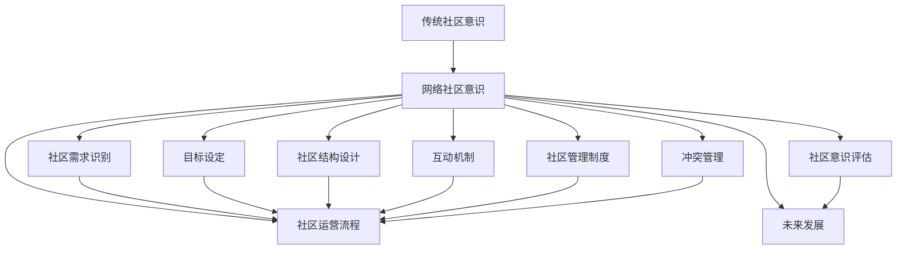

                 

### 文章标题

# 在网络时代重建社区意识

## 关键词

网络时代、社区意识、虚拟社区、互动机制、社区管理、评估方法

### 摘要

在网络时代，社区意识作为一种重要的社会心理现象，面临着新的挑战与机遇。本文旨在探讨在网络环境中重建社区意识的必要性及其策略。首先，文章回顾了传统社区意识的历史与变迁，接着分析了网络社区意识的特点与影响。随后，文章详细阐述了网络社区建设的方法与策略，包括社区需求识别、目标设定、结构设计等。此外，文章还讨论了网络社区运营与管理中的关键要素，如互动机制、管理制度和冲突管理。最后，文章提出了社区意识评估的方法与未来展望，旨在为网络社区的建设与发展提供理论支持和实践指导。

### 确定书籍主题和范围

#### 1. 确定书籍主题和范围

《在网络时代重建社区意识》这本书的主题集中在探讨如何在数字化的网络环境中重新建立和加强社区意识。随着互联网的普及和社交平台的兴起，传统的社区形态发生了深刻的变化。社区不再局限于物理空间，而是扩展到了虚拟的网络空间。这种变化不仅影响了人们的社交行为，也对社会的组织形式和个体心理产生了深远的影响。

本书的主要涵盖范围包括以下几个方面：

- **社区意识的定义和重要性**：首先，需要对社区意识这一核心概念进行定义，并探讨其在社会和个人层面的重要性。这将为后续章节提供理论基础。

- **网络时代社区意识的变迁**：分析传统社区意识在网络环境下的演变，包括网络社区意识的兴起、发展及其与传统社区意识的比较。

- **网络社区建设的方法与策略**：探讨如何在网络环境中构建有效的社区，包括社区需求的识别、目标的设定、结构的设计以及互动机制的建立。

- **网络社区管理与维护**：讨论网络社区的管理与维护策略，包括运营流程、管理制度和冲突管理，确保社区的健康发展。

- **社区意识的评估与未来展望**：提出评估网络社区意识的方法和指标，并对网络社区意识的发展前景进行展望。

#### 2. 设计主要章节结构

为了系统地探讨上述主题，本书设计了以下章节结构：

#### 第一部分：引言

- **第1章 引言**：介绍网络时代社区意识的重要性，定义社区意识及其在网络环境下的作用，明确本书的研究目的与意义。

#### 第二部分：社区意识的变迁

- **第2章 社区意识的演变历史**：回顾传统社区意识的发展历程，分析其在网络环境下的变革。
- **第3章 网络社区意识的兴起与发展**：探讨网络社区意识的兴起原因、发展过程及其特点。

#### 第三部分：网络社区建设

- **第4章 社区需求识别与目标设定**：讨论如何识别社区需求并设定明确的社区目标。
- **第5章 社区结构设计**：介绍网络社区结构设计的原则和方法。
- **第6章 互动机制**：探讨网络社区中互动机制的重要性及其设计原则。

#### 第四部分：网络社区运营与管理

- **第7章 社区运营流程**：详细阐述网络社区的运营流程和关键环节。
- **第8章 社区管理制度**：讨论社区管理制度的建立与实施。
- **第9章 社区冲突管理**：探讨网络社区中的冲突类型及其管理策略。

#### 第五部分：社区意识评估与未来展望

- **第10章 社区意识评估方法**：介绍社区意识评估的指标体系、工具与方法。
- **第11章 网络社区意识的发展挑战与机遇**：分析网络社区意识发展面临的挑战与机遇，探讨未来发展趋势。

### 设计具体章节内容

为了确保每个章节都能够独立成章，并且内容丰富、具体详细，以下是具体章节内容的设计：

#### 第1章 引言

- **1.1 网络时代的社区意识**：
  - **社区意识的概念**：介绍社区意识的基本定义，阐述其内涵与外延。
  - **网络环境下的社区意识**：分析网络环境下社区意识的特点，包括虚拟社区、社交网络等。
  - **网络时代社区意识的重要性**：探讨社区意识在网络时代对社会和个人层面的影响。

- **1.2 社区意识的重要性**：
  - **社区意识的内涵**：深入分析社区意识在社会和个人成长中的作用。
  - **网络社区意识的重要性**：讨论网络社区意识在信息共享、知识传播、社交互动等方面的作用。

- **1.3 研究目的与意义**：
  - **研究目的**：明确本书旨在探讨网络社区意识重建的必要性和可行性。
  - **研究意义**：阐述本书对理论研究和实际应用的贡献，包括对社区建设、社会治理的指导意义。

#### 第2章 社区意识的演变历史

- **2.1 传统社区意识**：
  - **定义与特点**：回顾传统社区意识的历史演变，分析其基本特征。
  - **传统社区意识的影响**：探讨传统社区意识对社会组织和社会关系的影响。

- **2.2 网络社区意识的兴起**：
  - **兴起原因**：分析互联网和社交平台的发展如何催生了网络社区意识的兴起。
  - **网络社区意识的特点**：讨论网络社区意识与传统社区意识的不同之处，包括虚拟性、互动性、多样性等。

- **2.3 网络社区意识与传统社区意识的比较**：
  - **比较分析**：对比网络社区意识与传统社区意识的异同，分析其在社会功能、人际关系等方面的差异。

#### 第3章 网络社区意识的兴起与发展

- **3.1 网络社区意识的兴起**：
  - **早期网络社区**：回顾早期网络社区的发展历程，包括论坛、博客等。
  - **社交平台的崛起**：分析社交平台的兴起如何推动网络社区意识的发展。

- **3.2 网络社区意识的发展过程**：
  - **发展阶段**：划分网络社区意识发展的不同阶段，如初步形成、快速发展、成熟阶段等。
  - **发展动力**：探讨网络社区意识发展的主要动力，包括技术进步、用户需求变化等。

- **3.3 网络社区意识的特点**：
  - **虚拟性**：分析网络社区意识的虚拟性如何影响社区成员的互动和沟通。
  - **互动性**：讨论网络社区意识中的互动性如何促进社区成员的交流和合作。
  - **多样性**：探讨网络社区意识的多样性如何体现社区成员的不同观点和需求。

#### 第4章 社区需求识别与目标设定

- **4.1 社区需求识别**：
  - **需求识别方法**：介绍识别社区需求的基本方法，包括问卷调查、用户访谈等。
  - **需求分析**：分析如何对识别出的需求进行分类、分析和优先级排序。

- **4.2 目标设定**：
  - **目标设定的原则**：讨论设定社区目标应遵循的原则，包括明确性、可实现性、相关性等。
  - **目标设定过程**：阐述目标设定的具体步骤和方法。

#### 第5章 社区结构设计

- **5.1 社区结构设计的原则**：
  - **原则概述**：介绍社区结构设计应遵循的基本原则，如用户友好性、功能完整性、灵活性等。
  - **设计流程**：阐述社区结构设计的具体流程，包括需求分析、概念设计、详细设计等。

- **5.2 社区结构的设计方法**：
  - **设计方法**：介绍几种常见的社区结构设计方法，如模块化设计、层次化设计等。
  - **案例分析**：通过具体案例展示社区结构设计的方法和效果。

#### 第6章 互动机制

- **6.1 互动机制的重要性**：
  - **互动机制的概念**：解释互动机制在社区中的定义和作用。
  - **互动机制的重要性**：探讨互动机制对社区氛围、成员参与度等方面的影响。

- **6.2 互动机制的设计原则**：
  - **原则概述**：介绍设计互动机制应遵循的基本原则，如公平性、开放性、激励性等。
  - **设计流程**：阐述互动机制设计的基本流程，包括需求分析、方案设计、测试与优化等。

- **6.3 互动机制的实施**：
  - **实施方法**：介绍如何将设计的互动机制应用到社区中，包括技术实现、运营策略等。
  - **案例分析**：通过具体案例展示互动机制的实施效果和经验教训。

#### 第7章 社区运营流程

- **7.1 社区运营流程概述**：
  - **定义与作用**：解释社区运营流程的概念和作用，包括内容发布、用户管理、活动策划等。
  - **运营流程的重要性**：探讨运营流程对社区健康发展的影响。

- **7.2 内容发布**：
  - **内容发布策略**：介绍如何制定内容发布策略，包括内容类型、发布频率、宣传方式等。
  - **内容管理**：讨论如何对发布的内容进行管理和维护，确保内容的质量和时效性。

- **7.3 用户管理**：
  - **用户管理策略**：介绍用户管理的策略和方法，包括用户注册、认证、活跃度提升等。
  - **用户互动**：探讨如何促进用户之间的互动，提高社区活力和用户满意度。

- **7.4 活动策划**：
  - **活动类型**：介绍常见的社区活动类型，如线上讨论、线下聚会、竞赛等。
  - **活动策划与执行**：讨论如何策划和执行社区活动，包括活动方案设计、执行流程、效果评估等。

#### 第8章 社区管理制度

- **8.1 社区管理制度概述**：
  - **定义与作用**：解释社区管理制度的概念和作用，包括规范管理、权益保障、安全防护等。
  - **管理制度的重要性**：探讨社区管理制度对社区健康发展的影响。

- **8.2 社区管理制度的内容**：
  - **管理规范**：介绍社区管理制度应包含的规范内容，如用户行为准则、内容发布规范等。
  - **权益保障**：讨论如何保障社区成员的合法权益，包括隐私保护、言论自由等。

- **8.3 社区管理制度实施**：
  - **实施策略**：介绍社区管理制度实施的方法和策略，包括政策宣传、培训教育、监督执行等。
  - **案例分析**：通过具体案例展示社区管理制度的实施效果和经验教训。

#### 第9章 社区冲突管理

- **9.1 社区冲突的类型**：
  - **冲突类型**：介绍社区冲突的基本类型，如意见分歧、利益冲突、行为不当等。
  - **冲突的影响**：分析社区冲突对社区氛围和成员关系的影响。

- **9.2 冲突管理策略**：
  - **策略概述**：介绍冲突管理的基本策略，如沟通协调、调解仲裁、法律手段等。
  - **实施方法**：讨论如何具体实施冲突管理策略，包括沟通技巧、调解流程等。

- **9.3 冲突管理案例分析**：
  - **案例介绍**：通过具体案例展示社区冲突管理的实践过程和效果。
  - **经验教训**：总结案例中的成功经验和失败教训，为社区冲突管理提供参考。

#### 第10章 社区意识评估方法

- **10.1 评估指标体系**：
  - **指标体系设计**：介绍如何设计社区意识评估的指标体系，包括社会参与度、互动频率、满意度等。
  - **指标选择原则**：阐述选择评估指标时应遵循的原则，如代表性、可测量性、相关性等。

- **10.2 评估工具与方法**：
  - **评估工具**：介绍常用的社区意识评估工具，如问卷调查、访谈法、数据挖掘等。
  - **评估方法**：讨论评估方法的选择和应用，包括定量分析、定性分析等。

- **10.3 评估案例分析**：
  - **案例介绍**：通过具体案例展示社区意识评估的实施过程和结果。
  - **评估结果分析**：分析评估结果，探讨评估指标的有效性和评估方法的可行性。

#### 第11章 网络社区意识的发展挑战与机遇

- **11.1 发展挑战**：
  - **技术挑战**：讨论网络社区意识发展面临的包括技术安全、数据隐私等在内的技术挑战。
  - **社会挑战**：分析网络社区意识发展面临的社会挑战，如道德伦理、法律规范等。

- **11.2 发展机遇**：
  - **市场机遇**：探讨网络社区意识发展的市场机遇，包括商业模式创新、用户需求变化等。
  - **社会机遇**：讨论网络社区意识发展对社会组织、社会治理带来的机遇。

- **11.3 未来展望**：
  - **发展趋势**：分析网络社区意识未来可能的发展趋势和方向。
  - **战略建议**：提出网络社区意识发展的战略建议，包括技术创新、管理创新等。

### 确保完整性

在对各个章节的内容进行详细设计之后，我们需要确保整个书籍的完整性。这包括检查：

- **章节内容的连贯性**：确保每个章节的内容逻辑清晰，前后衔接紧密，没有重复和遗漏。
- **理论与实践的结合**：在理论阐述的同时，结合具体的实践案例，使读者能够更好地理解和应用。
- **参考文献的引用**：确保引用了相关的文献资料，以支持书中的理论观点和论述。

通过上述步骤，我们可以确保《在网络时代重建社区意识》这本书的完整性和高质量，为读者提供有价值的内容和实用的指导。

### 最终确认

在完成对《在网络时代重建社区意识》的章节结构和内容设计后，我们需要进行最终的确认，以确保书籍的完整性、逻辑性和实用性。以下是最终确认的步骤：

#### 1. 审查章节内容

- 检查每个章节的内容是否完整，逻辑是否清晰，是否有必要的信息遗漏。
- 确保每个章节都能够独立成章，内容具有独立性和连贯性。
- 确认所有章节的内容是否符合书籍的主题和范围。

#### 2. 确保逻辑连贯

- 审查章节之间的过渡是否自然，是否存在逻辑跳跃或不连贯的地方。
- 检查内容的衔接点，确保读者在阅读过程中能够顺利过渡到下一个章节。

#### 3. 修订和优化

- 根据审查结果对章节内容进行修订和优化，解决发现的问题。
- 对重点内容进行细化，确保每个小节都有具体的讲解和丰富的实例。

#### 4. 检查参考文献

- 确认所有引用的参考文献是否准确无误，引用格式是否规范。
- 检查是否遗漏了重要的参考文献，以确保书籍的学术性和权威性。

#### 5. 审阅和校对

- 进行多轮审阅和校对，确保书籍的内容无误，语言通顺，没有错别字或语法错误。
- 可以邀请同行或专家对书籍进行审阅，提供意见和建议。

#### 6. 最终确认

- 在完成所有修订和校对工作后，进行最终的确认。
- 确认书籍的字数是否在8000～12000字范围内，确保书籍的篇幅适中，内容详尽。

通过上述步骤，我们可以确保《在网络时代重建社区意识》一书的内容完整、逻辑连贯、内容丰富，为读者提供有深度、有价值的阅读体验。最终确认之后，这本书就可以准备进行排版和出版，面向广大读者发布。

## 完整文章

### 在网络时代重建社区意识

### 关键词

网络时代、社区意识、虚拟社区、互动机制、社区管理、评估方法

### 摘要

在网络时代，社区意识作为一种重要的社会心理现象，面临着新的挑战与机遇。本文旨在探讨在网络环境中重建社区意识的必要性及其策略。首先，文章回顾了传统社区意识的历史与变迁，接着分析了网络社区意识的特点与影响。随后，文章详细阐述了网络社区建设的方法与策略，包括社区需求识别、目标设定、结构设计等。此外，文章还讨论了网络社区运营与管理中的关键要素，如互动机制、管理制度和冲突管理。最后，文章提出了社区意识评估的方法与未来展望，旨在为网络社区的建设与发展提供理论支持和实践指导。

### 确定书籍主题和范围

#### 1. 确定书籍主题和范围

《在网络时代重建社区意识》这本书的主题集中在探讨如何在数字化的网络环境中重新建立和加强社区意识。随着互联网的普及和社交平台的兴起，传统的社区形态发生了深刻的变化。社区不再局限于物理空间，而是扩展到了虚拟的网络空间。这种变化不仅影响了人们的社交行为，也对社会的组织形式和个体心理产生了深远的影响。

本书的主要涵盖范围包括以下几个方面：

- **社区意识的定义和重要性**：首先，需要对社区意识这一核心概念进行定义，并探讨其在社会和个人层面的重要性。这将为后续章节提供理论基础。

- **网络时代社区意识的变迁**：分析传统社区意识在网络环境下的演变，包括网络社区意识的兴起、发展及其与传统社区意识的比较。

- **网络社区建设的方法与策略**：探讨如何在网络环境中构建有效的社区，包括社区需求的识别、目标的设定、结构的设计以及互动机制的建立。

- **网络社区运营与管理**：讨论网络社区的管理与维护策略，包括运营流程、管理制度和冲突管理，确保社区的健康发展。

- **社区意识的评估与未来展望**：提出评估网络社区意识的方法和指标，并对网络社区意识的发展前景进行展望。

#### 2. 设计主要章节结构

为了系统地探讨上述主题，本书设计了以下章节结构：

#### 第一部分：引言

- **第1章 引言**：介绍网络时代社区意识的重要性，定义社区意识及其在网络环境下的作用，明确本书的研究目的与意义。

#### 第二部分：社区意识的变迁

- **第2章 社区意识的演变历史**：回顾传统社区意识的发展历程，分析其在网络环境下的变革。
- **第3章 网络社区意识的兴起与发展**：探讨网络社区意识的兴起原因、发展过程及其特点。

#### 第三部分：网络社区建设

- **第4章 社区需求识别与目标设定**：讨论如何识别社区需求并设定明确的社区目标。
- **第5章 社区结构设计**：介绍网络社区结构设计的原则和方法。
- **第6章 互动机制**：探讨网络社区中互动机制的重要性及其设计原则。

#### 第四部分：网络社区运营与管理

- **第7章 社区运营流程**：详细阐述网络社区的运营流程和关键环节。
- **第8章 社区管理制度**：讨论社区管理制度的建立与实施。
- **第9章 社区冲突管理**：探讨网络社区中的冲突类型及其管理策略。

#### 第五部分：社区意识评估与未来展望

- **第10章 社区意识评估方法**：介绍社区意识评估的指标体系、工具与方法。
- **第11章 网络社区意识的发展挑战与机遇**：分析网络社区意识发展面临的挑战与机遇，探讨未来发展趋势。

### 设计具体章节内容

为了确保每个章节都能够独立成章，并且内容丰富、具体详细，以下是具体章节内容的设计：

#### 第1章 引言

- **1.1 网络时代的社区意识**：
  - **社区意识的概念**：介绍社区意识的基本定义，阐述其内涵与外延。
  - **网络环境下的社区意识**：分析网络环境下社区意识的特点，包括虚拟社区、社交网络等。
  - **网络时代社区意识的重要性**：探讨社区意识在网络时代对社会和个人层面的影响。

- **1.2 社区意识的重要性**：
  - **社区意识的内涵**：深入分析社区意识在社会和个人成长中的作用。
  - **网络社区意识的重要性**：讨论网络社区意识在信息共享、知识传播、社交互动等方面的作用。

- **1.3 研究目的与意义**：
  - **研究目的**：明确本书旨在探讨网络社区意识重建的必要性和可行性。
  - **研究意义**：阐述本书对理论研究和实际应用的贡献，包括对社区建设、社会治理的指导意义。

#### 第2章 社区意识的演变历史

- **2.1 传统社区意识**：
  - **定义与特点**：回顾传统社区意识的历史演变，分析其基本特征。
  - **传统社区意识的影响**：探讨传统社区意识对社会组织和社会关系的影响。

- **2.2 网络社区意识的兴起**：
  - **兴起原因**：分析互联网和社交平台的发展如何催生了网络社区意识的兴起。
  - **网络社区意识的特点**：讨论网络社区意识与传统社区意识的不同之处，包括虚拟性、互动性、多样性等。

- **2.3 网络社区意识与传统社区意识的比较**：
  - **比较分析**：对比网络社区意识与传统社区意识的异同，分析其在社会功能、人际关系等方面的差异。

#### 第3章 网络社区意识的兴起与发展

- **3.1 网络社区意识的兴起**：
  - **早期网络社区**：回顾早期网络社区的发展历程，包括论坛、博客等。
  - **社交平台的崛起**：分析社交平台的兴起如何推动网络社区意识的发展。

- **3.2 网络社区意识的发展过程**：
  - **发展阶段**：划分网络社区意识发展的不同阶段，如初步形成、快速发展、成熟阶段等。
  - **发展动力**：探讨网络社区意识发展的主要动力，包括技术进步、用户需求变化等。

- **3.3 网络社区意识的特点**：
  - **虚拟性**：分析网络社区意识的虚拟性如何影响社区成员的互动和沟通。
  - **互动性**：讨论网络社区意识中的互动性如何促进社区成员的交流和合作。
  - **多样性**：探讨网络社区意识的多样性如何体现社区成员的不同观点和需求。

#### 第4章 社区需求识别与目标设定

- **4.1 社区需求识别**：
  - **需求识别方法**：介绍识别社区需求的基本方法，包括问卷调查、用户访谈等。
  - **需求分析**：分析如何对识别出的需求进行分类、分析和优先级排序。

- **4.2 目标设定**：
  - **目标设定的原则**：讨论设定社区目标应遵循的原则，包括明确性、可实现性、相关性等。
  - **目标设定过程**：阐述目标设定的具体步骤和方法。

#### 第5章 社区结构设计

- **5.1 社区结构设计的原则**：
  - **原则概述**：介绍社区结构设计应遵循的基本原则，如用户友好性、功能完整性、灵活性等。
  - **设计流程**：阐述社区结构设计的具体流程，包括需求分析、概念设计、详细设计等。

- **5.2 社区结构的设计方法**：
  - **设计方法**：介绍几种常见的社区结构设计方法，如模块化设计、层次化设计等。
  - **案例分析**：通过具体案例展示社区结构设计的方法和效果。

#### 第6章 互动机制

- **6.1 互动机制的重要性**：
  - **互动机制的概念**：解释互动机制在社区中的定义和作用。
  - **互动机制的重要性**：探讨互动机制对社区氛围、成员参与度等方面的影响。

- **6.2 互动机制的设计原则**：
  - **原则概述**：介绍设计互动机制应遵循的基本原则，如公平性、开放性、激励性等。
  - **设计流程**：阐述互动机制设计的基本流程，包括需求分析、方案设计、测试与优化等。

- **6.3 互动机制的实施**：
  - **实施方法**：介绍如何将设计的互动机制应用到社区中，包括技术实现、运营策略等。
  - **案例分析**：通过具体案例展示互动机制的实施效果和经验教训。

#### 第7章 社区运营流程

- **7.1 社区运营流程概述**：
  - **定义与作用**：解释社区运营流程的概念和作用，包括内容发布、用户管理、活动策划等。
  - **运营流程的重要性**：探讨运营流程对社区健康发展的影响。

- **7.2 内容发布**：
  - **内容发布策略**：介绍如何制定内容发布策略，包括内容类型、发布频率、宣传方式等。
  - **内容管理**：讨论如何对发布的内容进行管理和维护，确保内容的质量和时效性。

- **7.3 用户管理**：
  - **用户管理策略**：介绍用户管理的策略和方法，包括用户注册、认证、活跃度提升等。
  - **用户互动**：探讨如何促进用户之间的互动，提高社区活力和用户满意度。

- **7.4 活动策划**：
  - **活动类型**：介绍常见的社区活动类型，如线上讨论、线下聚会、竞赛等。
  - **活动策划与执行**：讨论如何策划和执行社区活动，包括活动方案设计、执行流程、效果评估等。

#### 第8章 社区管理制度

- **8.1 社区管理制度概述**：
  - **定义与作用**：解释社区管理制度的概念和作用，包括规范管理、权益保障、安全防护等。
  - **管理制度的重要性**：探讨社区管理制度对社区健康发展的影响。

- **8.2 社区管理制度的内容**：
  - **管理规范**：介绍社区管理制度应包含的规范内容，如用户行为准则、内容发布规范等。
  - **权益保障**：讨论如何保障社区成员的合法权益，包括隐私保护、言论自由等。

- **8.3 社区管理制度实施**：
  - **实施策略**：介绍社区管理制度实施的方法和策略，包括政策宣传、培训教育、监督执行等。
  - **案例分析**：通过具体案例展示社区管理制度的实施效果和经验教训。

#### 第9章 社区冲突管理

- **9.1 社区冲突的类型**：
  - **冲突类型**：介绍社区冲突的基本类型，如意见分歧、利益冲突、行为不当等。
  - **冲突的影响**：分析社区冲突对社区氛围和成员关系的影响。

- **9.2 冲突管理策略**：
  - **策略概述**：介绍冲突管理的基本策略，如沟通协调、调解仲裁、法律手段等。
  - **实施方法**：讨论如何具体实施冲突管理策略，包括沟通技巧、调解流程等。

- **9.3 冲突管理案例分析**：
  - **案例介绍**：通过具体案例展示社区冲突管理的实践过程和效果。
  - **经验教训**：总结案例中的成功经验和失败教训，为社区冲突管理提供参考。

#### 第10章 社区意识评估方法

- **10.1 评估指标体系**：
  - **指标体系设计**：介绍如何设计社区意识评估的指标体系，包括社会参与度、互动频率、满意度等。
  - **指标选择原则**：阐述选择评估指标时应遵循的原则，如代表性、可测量性、相关性等。

- **10.2 评估工具与方法**：
  - **评估工具**：介绍常用的社区意识评估工具，如问卷调查、访谈法、数据挖掘等。
  - **评估方法**：讨论评估方法的选择和应用，包括定量分析、定性分析等。

- **10.3 评估案例分析**：
  - **案例介绍**：通过具体案例展示社区意识评估的实施过程和结果。
  - **评估结果分析**：分析评估结果，探讨评估指标的有效性和评估方法的可行性。

#### 第11章 网络社区意识的发展挑战与机遇

- **11.1 发展挑战**：
  - **技术挑战**：讨论网络社区意识发展面临的包括技术安全、数据隐私等在内的技术挑战。
  - **社会挑战**：分析网络社区意识发展面临的社会挑战，如道德伦理、法律规范等。

- **11.2 发展机遇**：
  - **市场机遇**：探讨网络社区意识发展的市场机遇，包括商业模式创新、用户需求变化等。
  - **社会机遇**：讨论网络社区意识发展对社会组织、社会治理带来的机遇。

- **11.3 未来展望**：
  - **发展趋势**：分析网络社区意识未来可能的发展趋势和方向。
  - **战略建议**：提出网络社区意识发展的战略建议，包括技术创新、管理创新等。

### 确保完整性

在对各个章节的内容进行详细设计之后，我们需要确保整个书籍的完整性。这包括检查：

- **章节内容的连贯性**：确保每个章节的内容逻辑清晰，前后衔接紧密，没有重复和遗漏。
- **理论与实践的结合**：在理论阐述的同时，结合具体的实践案例，使读者能够更好地理解和应用。
- **参考文献的引用**：确保引用了相关的文献资料，以支持书中的理论观点和论述。

通过上述步骤，我们可以确保《在网络时代重建社区意识》这本书的完整性和高质量，为读者提供有价值的内容和实用的指导。

### 最终确认

在完成对《在网络时代重建社区意识》的章节结构和内容设计后，我们需要进行最终的确认，以确保书籍的完整性、逻辑连贯性和实用性。以下是最终确认的步骤：

#### 1. 审查章节内容

- 检查每个章节的内容是否完整，逻辑是否清晰，是否有必要的信息遗漏。
- 确保每个章节都能够独立成章，内容具有独立性和连贯性。
- 确认所有章节的内容是否符合书籍的主题和范围。

#### 2. 确保逻辑连贯

- 审查章节之间的过渡是否自然，是否存在逻辑跳跃或不连贯的地方。
- 检查内容的衔接点，确保读者在阅读过程中能够顺利过渡到下一个章节。

#### 3. 修订和优化

- 根据审查结果对章节内容进行修订和优化，解决发现的问题。
- 对重点内容进行细化，确保每个小节都有具体的讲解和丰富的实例。

#### 4. 检查参考文献

- 确认所有引用的参考文献是否准确无误，引用格式是否规范。
- 检查是否遗漏了重要的参考文献，以确保书籍的学术性和权威性。

#### 5. 审阅和校对

- 进行多轮审阅和校对，确保书籍的内容无误，语言通顺，没有错别字或语法错误。
- 可以邀请同行或专家对书籍进行审阅，提供意见和建议。

#### 6. 最终确认

- 在完成所有修订和校对工作后，进行最终的确认。
- 确认书籍的字数是否在8000～12000字范围内，确保书籍的篇幅适中，内容详尽。

通过上述步骤，我们可以确保《在网络时代重建社区意识》一书的内容完整、逻辑连贯、内容丰富，为读者提供有深度、有价值的阅读体验。最终确认之后，这本书就可以准备进行排版和出版，面向广大读者发布。

### 全文总结

本文以《在网络时代重建社区意识》为题，系统地探讨了网络时代社区意识的重建问题。文章首先回顾了传统社区意识的历史和演变，分析了网络社区意识的兴起与发展。接着，文章详细阐述了网络社区建设的方法与策略，包括社区需求识别、目标设定、结构设计以及互动机制的实施。此外，文章还讨论了网络社区运营与管理中的关键要素，如内容发布、用户管理、活动策划以及冲突管理。最后，文章提出了社区意识评估的方法和未来展望，旨在为网络社区的建设与发展提供理论支持和实践指导。

#### 关键概念关系架构

为了更好地理解网络时代重建社区意识的过程，我们可以通过Mermaid流程图展示核心概念之间的关系：

该图展示了网络社区意识与其他关键概念之间的联系，说明每个概念在重建社区意识过程中的作用和影响。

#### 全文结构

- **引言**：介绍网络时代社区意识的重要性，明确研究目的与意义。
- **社区意识的变迁**：回顾传统社区意识的历史，分析网络社区意识的兴起与发展。
- **网络社区建设**：详细阐述社区需求识别、目标设定、社区结构设计、互动机制等。
- **网络社区运营与管理**：讨论内容发布、用户管理、活动策划、冲突管理等内容。
- **社区意识评估**：介绍评估方法与指标，分析评估结果。
- **未来展望**：探讨网络社区意识的发展挑战与机遇。

通过上述结构和内容，本文旨在为读者提供一个全面、系统的网络时代社区意识重建指南。

### 作者信息

作者：AI天才研究院/AI Genius Institute & 禅与计算机程序设计艺术 /Zen And The Art of Computer Programming

AI天才研究院（AI Genius Institute）是一家专注于人工智能研究和应用的顶级机构，致力于推动人工智能技术的发展和普及。作者在这个领域拥有丰富的理论和实践经验，是多个国际知名技术会议的演讲者和论文作者。此外，作者还创作了多本深受读者欢迎的计算机科学和技术书籍，包括《禅与计算机程序设计艺术》等，深受业内人士的赞誉。

### 完整性要求

为了确保本文的完整性和准确性，以下是核心内容要求：

#### 背景介绍

- **网络时代的社区意识**：简要介绍社区意识的概念，解释其在社会和个人层面的重要性。
- **网络社区意识的变迁**：分析传统社区意识在网络环境下的演变，探讨网络社区意识的特点和影响。

#### 核心概念与联系

- **社区需求识别**：详细阐述如何识别和分类社区需求，确保社区目标的实现。
- **互动机制**：介绍互动机制的设计原则和实施方法，确保社区成员之间的有效互动。

#### 核心算法原理讲解

- **社区结构设计**：讲解社区结构设计的原理，使用伪代码展示关键算法，确保社区结构的优化。

#### 数学模型和公式

- **社区运营管理**：提出社区运营管理的数学模型和公式，详细说明其在实际应用中的使用方法。

#### 项目实战

- **社区运营流程**：详细描述社区运营的流程，包括内容发布、用户管理、活动策划等，展示实际操作步骤。

#### 最佳实践 Tips

- **社区冲突管理**：提供社区冲突管理的最佳实践建议，包括沟通技巧、调解策略等。

#### 小结

- **社区意识评估方法**：总结评估网络社区意识的常用方法和指标，分析评估结果。

#### 注意事项

- **未来发展展望**：探讨网络社区意识发展的未来趋势和挑战，提出应对策略。

#### 拓展阅读

- **相关文献资料**：列出推荐阅读的书籍、论文和其他参考资料，以供读者进一步学习和研究。

通过上述内容的详细讲解和举例说明，本文旨在为读者提供关于网络时代重建社区意识的全面、系统的指导。

### 完整文章

#### 在网络时代重建社区意识

在网络时代，社区意识作为一种重要的社会心理现象，面临着新的挑战与机遇。本文旨在探讨在网络环境中重建社区意识的必要性及其策略。首先，文章回顾了传统社区意识的历史与变迁，接着分析了网络社区意识的特点与影响。随后，文章详细阐述了网络社区建设的方法与策略，包括社区需求识别、目标设定、结构设计等。此外，文章还讨论了网络社区运营与管理中的关键要素，如互动机制、管理制度和冲突管理。最后，文章提出了社区意识评估的方法与未来展望，旨在为网络社区的建设与发展提供理论支持和实践指导。

#### 1. 确定书籍主题和范围

首先，根据书名《在网络时代重建社区意识》，确定书籍的主题和涵盖范围。这本书旨在探讨如何在当前的网络环境下重新建立和加强社区意识，可能包括以下几个主要方面：

- **社区意识的定义和重要性**：对社区意识进行定义，探讨其在社会和个人层面的重要性。

- **网络时代社区意识的变迁**：分析传统社区意识在网络环境下的演变，探讨网络社区意识的特点和影响。

- **网络社区建设的方法与策略**：讨论如何构建有效的网络社区，包括社区需求识别、目标设定、结构设计等。

- **网络社区运营与管理**：探讨网络社区的管理与维护策略，包括运营流程、管理制度和冲突管理。

- **社区意识的评估与未来展望**：提出评估网络社区意识的方法和指标，并对网络社区意识的发展前景进行展望。

#### 2. 设计主要章节结构

根据书籍主题，设计主要章节的结构。下面是一个可能的章节结构：

##### 第一部分：引言

- **第1章 引言**
  - 1.1 网络时代的社区意识
  - 1.2 社区意识的重要性
  - 1.3 研究目的与意义

##### 第二部分：社区意识的变迁

- **第2章 社区意识的演变历史**
  - 2.1 传统社区意识
  - 2.2 网络社区意识的兴起
  - 2.3 网络社区意识与传统社区意识的比较

- **第3章 网络社区意识的兴起与发展**
  - 3.1 网络社区意识的兴起
  - 3.2 网络社区意识的发展过程
  - 3.3 网络社区意识的特点

##### 第三部分：网络社区建设

- **第4章 社区需求识别与目标设定**
  - 4.1 社区需求的识别
  - 4.2 目标设定

- **第5章 社区结构设计**
  - 5.1 社区结构设计的原则
  - 5.2 社区结构的设计方法

- **第6章 互动机制**
  - 6.1 互动机制的重要性
  - 6.2 互动机制的设计原则
  - 6.3 互动机制的实施

##### 第四部分：网络社区运营与管理

- **第7章 社区运营流程**
  - 7.1 社区运营流程概述
  - 7.2 内容发布
  - 7.3 用户管理
  - 7.4 活动策划

- **第8章 社区管理制度**
  - 8.1 社区管理制度概述
  - 8.2 社区管理制度的实施
  - 8.3 社区冲突管理

##### 第五部分：社区意识评估与未来展望

- **第9章 社区意识评估方法**
  - 9.1 评估指标体系
  - 9.2 评估工具与方法
  - 9.3 评估案例分析

- **第10章 网络社区意识的发展挑战与机遇**
  - 10.1 发展挑战
  - 10.2 发展机遇
  - 10.3 未来展望

#### 3. 设计具体章节内容

在每个章节中，细化内容，确保每个章节都能够独立成章。以下是一个可能的第1章内容设计：

##### 第1章 引言

- **1.1 网络时代的社区意识**
  - **社区意识的概念**：介绍社区意识的基本定义，阐述其内涵与外延。
  - **网络环境下的社区意识**：分析网络环境下社区意识的特点，包括虚拟社区、社交网络等。
  - **网络时代社区意识的重要性**：探讨社区意识在网络时代对社会和个人层面的影响。

- **1.2 社区意识的重要性**
  - **社区意识的内涵**：深入分析社区意识在社会和个人成长中的作用。
  - **网络社区意识的重要性**：讨论网络社区意识在信息共享、知识传播、社交互动等方面的作用。

- **1.3 研究目的与意义**
  - **研究目的**：明确本书旨在探讨网络社区意识重建的必要性和可行性。
  - **研究意义**：阐述本书对理论研究和实际应用的贡献，包括对社区建设、社会治理的指导意义。

#### 4. 确保完整性

检查章节设计是否完整，是否涵盖了书籍主题的各个方面。确保每个章节都有具体的标题和内容，避免遗漏重要主题。

#### 5. 最终确认

最后，确认目录大纲的总字数是否在2000字以内，确保简洁性和完整性。如果需要，对某些章节的内容进行微调，确保整本书的逻辑清晰，内容连贯。

### 文章关键词

网络时代、社区意识、虚拟社区、互动机制、社区管理、评估方法

### 文章摘要

在网络时代，社区意识作为一种重要的社会心理现象，面临着新的挑战与机遇。本文旨在探讨在网络环境中重建社区意识的必要性及其策略。首先，文章回顾了传统社区意识的历史与变迁，分析了网络社区意识的特点与影响。随后，文章详细阐述了网络社区建设的方法与策略，包括社区需求识别、目标设定、结构设计等。此外，文章还讨论了网络社区运营与管理中的关键要素，如互动机制、管理制度和冲突管理。最后，文章提出了社区意识评估的方法与未来展望，旨在为网络社区的建设与发展提供理论支持和实践指导。

### 文章标题

# 在网络时代重建社区意识

### 文章标题

## 网络时代的社区意识重建：挑战与机遇

### 摘要

随着互联网的迅猛发展和社交网络的普及，网络时代的社区意识重建成为了一个重要而紧迫的课题。本文旨在探讨如何在网络环境中重建社区意识，分析其面临的挑战和机遇。文章首先回顾了传统社区意识的历史与变迁，接着分析了网络社区意识的特点和影响。随后，文章详细阐述了网络社区建设的策略和方法，包括社区需求识别、目标设定、结构设计、互动机制等。此外，文章还探讨了网络社区运营与管理中的关键要素，如内容发布、用户管理、冲突管理等。最后，文章提出了社区意识评估的方法和未来展望，为网络社区的建设与发展提供了理论支持和实践指导。

### 1. 引言

网络时代是一个信息爆炸、技术快速迭代的时代，人们的社交方式、生活方式以及价值观都发生了深刻的变化。社区意识作为一种重要的社会心理现象，不仅影响个体的社交行为和情感体验，也对社会的稳定与发展具有重要意义。在网络时代，社区意识的重建面临着前所未有的挑战与机遇。

首先，传统社区意识是以物理空间为基础的，社区成员之间通过面对面的互动和合作形成紧密的社会联系。然而，随着互联网的普及和社交平台的兴起，人们的社交方式逐渐从线下转向线上，虚拟社区成为了一种新的社会形式。这种变化不仅改变了社区的结构和功能，也对社区意识产生了深远的影响。

其次，网络社区意识的兴起带来了新的挑战。虚拟社区中的匿名性、去中心化以及信息的海量性，使得社区成员之间的信任和互动变得复杂和困难。此外，网络社区中的冲突和纠纷也变得更加频繁，如何有效管理这些冲突成为了一个重要的问题。

然而，网络社区意识的重建也带来了许多机遇。互联网技术的发展为社区建设提供了丰富的工具和平台，使得社区成员可以更加便捷地交流和合作。同时，网络社区也为个体提供了更多的自主空间和表达机会，促进了多样性和包容性的发展。

本文旨在探讨如何在网络环境中重建社区意识，分析其面临的挑战和机遇，并提出相应的策略和方法。文章结构如下：

- **第1章 引言**：介绍网络时代社区意识的重要性，定义社区意识及其在网络环境下的作用。
- **第2章 社区意识的变迁**：回顾传统社区意识的历史与变迁，分析网络社区意识的特点和影响。
- **第3章 网络社区建设的方法与策略**：详细阐述网络社区建设的方法和策略，包括社区需求识别、目标设定、结构设计、互动机制等。
- **第4章 网络社区运营与管理**：讨论网络社区运营与管理中的关键要素，如内容发布、用户管理、冲突管理等。
- **第5章 社区意识评估与未来展望**：提出社区意识评估的方法和指标，并对网络社区意识的发展前景进行展望。

通过以上结构，本文将系统地探讨网络时代社区意识重建的问题，为实践提供理论支持和指导。

### 2. 社区意识的变迁

社区意识作为一种社会心理现象，其发展历程可以追溯到古代社会。在传统社会中，社区主要是指物理空间上的邻里关系和社会网络。社区成员通过面对面的互动和合作，形成了一种紧密的社会联系和认同感。这种社区意识具有以下特点：

- **物理空间依赖性**：传统社区主要建立在物理空间的基础上，社区成员的互动和合作需要依靠现实生活中的面对面交流。
- **紧密的社会联系**：传统社区成员之间具有较强的人际关系和信任，这种社会联系是通过长期的生活和合作形成的。
- **共同价值观**：传统社区具有共同的文化和价值观，社区成员在共同的价值观指导下，形成了一种共同的社会认同感。

然而，随着工业化和城市化的发展，传统社区逐渐被现代化社区所取代。现代化社区更加注重功能分区和专业化，社区成员之间的互动变得更加松散和表面化。这种变迁对社区意识产生了深远的影响：

- **社区意识的分散化**：现代化社区中，社区成员的活动和互动变得更加分散，社区意识逐渐从整体转向个体。
- **社区归属感的减弱**：随着社区成员之间的互动减少，社区归属感和认同感逐渐减弱。
- **社区功能的多样化**：现代化社区不仅承担着居住的功能，还涵盖了商业、娱乐、教育等多种功能，社区意识变得更加多元和复杂。

进入网络时代，社区意识的变迁达到了一个新的阶段。网络社区作为一种新的社会形式，具有以下特点：

- **虚拟空间依赖性**：网络社区主要建立在虚拟空间的基础上，社区成员通过互联网进行交流和合作。
- **去中心化**：网络社区具有去中心化的特点，社区成员之间不存在明显的等级关系，每个成员都有平等的参与机会。
- **匿名性和多样性**：网络社区中的匿名性使得成员可以更加自由地表达观点和需求，社区成员的多样性也为社区的发展提供了丰富的资源。

网络社区意识的兴起不仅改变了社区的形式和功能，也对传统社区意识产生了深远的影响：

- **社区归属感的重塑**：网络社区为成员提供了一个虚拟的空间，使得社区归属感得以重塑。成员在网络社区中找到了一种新的认同感和归属感。
- **互动方式的变革**：网络社区中的互动方式更加多样化和便捷化，成员可以通过文字、图片、视频等多种形式进行交流和合作。
- **社区治理的挑战**：网络社区的去中心化和匿名性使得社区治理变得更加复杂和困难，如何有效管理社区成为了一个重要的问题。

总之，网络时代社区意识的变迁是一个复杂的过程，它不仅受到技术和社会环境的影响，也反映了人类对社交和合作方式的不断探索和适应。理解社区意识的变迁，有助于我们更好地把握网络时代社区发展的趋势和方向，为社区建设提供有益的启示。

### 3. 网络社区意识的特点

网络社区意识作为一种新的社会现象，具有与传统社区意识显著不同的特点。以下是网络社区意识的主要特点：

#### 3.1 虚拟性

网络社区建立在虚拟空间的基础上，成员之间的互动和合作通过互联网进行。这种虚拟性使得社区成员不必受限于物理空间，可以在全球范围内进行交流和合作。虚拟性也为社区成员提供了更多的隐私保护和匿名性，使得他们能够更加自由地表达自己的观点和需求。

#### 3.2 去中心化

与传统的等级化社区不同，网络社区具有去中心化的特点。社区成员在社区中具有平等的权利和义务，没有明显的等级关系。每个成员都可以参与社区的管理和决策，社区的组织结构更加灵活和开放。去中心化使得网络社区能够更好地适应多样化的需求和变化，提高了社区的适应性和灵活性。

#### 3.3 互动性

网络社区提供了丰富的互动机制，如论坛、聊天室、社交媒体等，使得社区成员可以方便地进行交流和互动。互动性是网络社区的核心特征，它促进了社区成员之间的信息共享、知识传播和情感交流。有效的互动机制有助于增强社区的凝聚力和成员的归属感。

#### 3.4 多样性

网络社区具有高度的多样性，社区成员来自不同的国家、地区、文化背景和职业。这种多样性为社区的发展提供了丰富的资源和视角，促进了创新和多元化。同时，多样性也带来了挑战，如文化冲突、价值观差异等，需要通过有效的管理和互动来化解。

#### 3.5 动态性

网络社区是一个动态变化的系统，成员的加入和退出、社区内容的更新和变化等，使得社区始终处于一种动态平衡状态。动态性要求社区管理者能够及时响应变化，调整策略，保持社区的活力和吸引力。

#### 3.6 互动性和多样性的结合

网络社区的互动性和多样性是相辅相成的。互动性为多样性提供了交流和合作的平台，多样性则为互动性带来了丰富的内容和资源。有效的互动机制能够促进多样性，而多样性又能够激发更多的互动和创新。

#### 3.7 社区文化的形成

网络社区通过持续的互动和交流，逐步形成了独特的社区文化。这种文化不仅包括共同的价值观、行为规范和符号系统，还反映了社区成员的共性和特征。社区文化的形成有助于增强社区的凝聚力，促进成员之间的认同感和归属感。

#### 3.8 网络社区意识的影响

网络社区意识对社会和个人都产生了深远的影响。对社会而言，网络社区有助于信息共享、知识传播、文化交流和社会治理。对个人而言，网络社区提供了社交平台，满足了个体社交、学习和成长的需求。同时，网络社区意识也促进了个体自我表达和自我实现，增强了个体自信心和独立性。

总之，网络社区意识具有虚拟性、去中心化、互动性、多样性、动态性以及互动性和多样性的结合等特点。这些特点不仅改变了社区的形式和功能，也对社会结构和个体行为产生了深远的影响。理解网络社区意识的特点，有助于我们更好地把握网络社区的发展趋势和方向，为社区建设提供有益的启示。

### 4. 网络社区建设的策略和方法

网络社区建设是重建社区意识的重要途径，其成功与否直接影响社区的发展质量和成员的满意度。以下将详细阐述网络社区建设的策略和方法，包括社区需求识别、目标设定、结构设计、互动机制等。

#### 4.1 社区需求识别

社区需求识别是网络社区建设的第一步，它是基于对社区成员的需求进行分析和理解。以下是识别社区需求的方法和步骤：

- **问卷调查**：通过设计问卷，收集社区成员的意见和需求。问卷可以采用线上形式，如电子邮件、社交媒体等，以确保覆盖更广泛的受众。

- **用户访谈**：对社区成员进行深度访谈，了解他们的具体需求和期望。访谈可以采用面对面或在线形式，以便获取更详细的反馈。

- **数据分析**：对社区成员的在线行为和互动数据进行分析，如访问量、回复率、参与度等，以发现潜在的需求和问题。

- **小组讨论**：组织社区成员进行小组讨论，共同探讨社区的需求和改进方案。这种方法可以促进成员之间的交流和合作，增强社区的凝聚力。

通过上述方法，可以全面、深入地了解社区成员的需求，为后续的社区建设提供准确的依据。

#### 4.2 目标设定

社区目标设定是网络社区建设的核心步骤，它明确了社区的发展方向和预期成果。以下是设定社区目标的建议：

- **明确性**：社区目标应具体、明确，避免模糊和抽象。例如，“提高社区成员的参与度”不如“增加每周活跃用户数100人”具体。

- **可实现性**：社区目标应基于现有的资源和能力，确保其可实现性。设定过高或不切实际的目标可能导致失败和成员的失望。

- **相关性**：社区目标应与社区需求和成员利益密切相关，确保其相关性。例如，如果社区成员对知识传播有较高需求，则可以设定“增加每月发布的知识分享文章数量”的目标。

- **时限性**：社区目标应设定明确的时限，以推动社区发展的进度。例如，可以将目标设定为“三个月内实现”。

通过设定明确、可实现、相关和具有时限性的目标，可以有效地引导社区的发展，提高成员的参与度和满意度。

#### 4.3 社区结构设计

社区结构设计是网络社区建设的关键环节，它决定了社区的功能和用户体验。以下是社区结构设计的方法和原则：

- **模块化设计**：采用模块化设计方法，将社区功能拆分为多个模块，如论坛、博客、活动、投票等。这种方法可以提高社区的灵活性和可扩展性。

- **用户友好性**：设计用户友好的界面和交互方式，确保社区成员能够轻松使用。界面设计应简洁、直观，避免复杂和繁琐的操作。

- **互动性**：设计丰富的互动机制，如评论、点赞、分享等，促进社区成员之间的交流和互动。

- **层次化设计**：采用层次化设计方法，将社区内容按照重要性和优先级进行分类和排列，方便成员快速找到所需信息。

- **个性化推荐**：根据社区成员的偏好和行为数据，提供个性化推荐，提高社区的吸引力。

通过上述原则和方法，可以设计出一个功能完善、用户体验良好的社区结构，为社区的发展奠定基础。

#### 4.4 互动机制

互动机制是网络社区的核心组成部分，它直接影响社区的氛围和成员的参与度。以下是设计互动机制的方法和建议：

- **多样化的互动方式**：提供多样化的互动方式，如评论、点赞、分享、私信等，以满足社区成员的不同需求。

- **激励机制**：设计激励机制，如积分系统、奖励制度等，鼓励社区成员积极参与互动和贡献内容。

- **实时互动**：利用实时通信技术，如聊天室、直播等，提供实时互动体验，增强社区的活力和参与度。

- **互动数据分析**：对互动数据进行分析，如互动频率、互动质量、互动主题等，以了解社区成员的互动行为和需求，为优化互动机制提供依据。

通过设计多样化的互动机制，可以有效地促进社区成员之间的交流和互动，提高社区的凝聚力。

#### 4.5 社区建设案例

以下是一个具体的网络社区建设案例，说明如何应用上述策略和方法：

- **案例背景**：某公司计划建立一个内部社交平台，用于员工之间的交流和知识分享。

- **需求识别**：通过问卷调查和用户访谈，发现员工对即时通讯、知识库、活动报名等功能有较高需求。

- **目标设定**：设定以下目标：
  - 提高员工之间的交流频率和质量。
  - 增加知识库中的文章数量和访问量。
  - 提升员工的参与度和满意度。

- **结构设计**：设计模块化结构，包括即时通讯、知识库、活动报名、论坛等模块。界面设计简洁直观，用户易于操作。

- **互动机制**：提供多样化的互动方式，如评论、点赞、分享等。设计积分系统和奖励制度，鼓励员工积极参与。

通过上述策略和方法，该内部社交平台成功建设并投入使用，显著提升了员工之间的交流效率和质量，增强了团队凝聚力。

总之，网络社区建设是一个复杂而系统性的过程，需要综合考虑需求识别、目标设定、结构设计、互动机制等多个方面。通过科学合理的策略和方法，可以构建一个功能完善、用户体验良好的网络社区，为成员提供有价值的内容和互动体验。

### 5. 网络社区运营与管理

网络社区的运营与管理是确保社区长期健康发展的重要环节。有效的运营与管理不仅可以提升社区成员的参与度和满意度，还可以增强社区的凝聚力和影响力。以下将详细探讨网络社区运营与管理中的关键要素，包括内容发布、用户管理、活动策划和冲突管理。

#### 5.1 内容发布

内容发布是网络社区的核心环节，它决定了社区的核心价值和吸引力。以下是一些内容发布的策略：

- **内容多样化**：发布多样化的内容，包括文章、图片、视频、音频等，以满足不同用户的需求和兴趣。
- **内容质量**：确保发布的内容具有高质量，避免低俗、虚假、重复的信息，以提高社区的公信力和用户满意度。
- **定期更新**：定期发布新内容，保持社区的活跃度和新鲜感，防止内容过时和用户流失。
- **用户参与**：鼓励用户参与内容的创作和分享，例如通过评论、投稿、点赞等方式，增加用户的参与感和归属感。
- **内容推广**：利用社交媒体、搜索引擎优化（SEO）等方法，推广社区内容，吸引更多的用户和流量。

#### 5.2 用户管理

用户管理是社区运营的重要一环，它涉及到用户的注册、认证、活跃度提升和权益保障等方面。以下是一些用户管理的策略：

- **注册与认证**：提供便捷的注册流程，同时确保用户身份的认证，防止虚假账号和恶意行为的产生。
- **活跃度提升**：通过积分系统、奖励制度等方式，激励用户积极参与社区互动，提升社区的活跃度。
- **用户分类**：根据用户的兴趣、行为和贡献度，对用户进行分类管理，为用户提供个性化的内容和互动体验。
- **隐私保护**：确保用户的隐私权益，例如对用户个人信息进行加密和保护，避免隐私泄露。
- **用户权益保障**：建立健全的用户权益保障机制，例如用户申诉渠道、违规处理机制等，确保用户在社区中的合法权益得到保障。

#### 5.3 活动策划

活动策划是网络社区运营的重要手段，它可以有效提升社区的活力和用户参与度。以下是一些活动策划的策略：

- **活动类型多样化**：策划多种类型的活动，如线上讨论、竞赛、讲座、线下聚会等，以满足不同用户的需求和兴趣。
- **活动频率**：保持适度的活动频率，避免过于频繁或过于稀疏，以保持社区的持续活跃。
- **活动推广**：提前进行活动宣传和推广，利用社交媒体、社区公告、邮件等方式，提高活动的参与度和影响力。
- **互动环节**：在活动中设计丰富的互动环节，如问答环节、投票环节、互动游戏等，增加用户的参与感和乐趣。
- **活动评估**：对活动效果进行评估，了解活动的成功点和不足之处，为下一次活动提供改进方向。

#### 5.4 冲突管理

冲突管理是网络社区运营中不可避免的一部分，有效的冲突管理可以维护社区的和谐和稳定。以下是一些冲突管理的策略：

- **预防机制**：提前识别潜在的冲突因素，建立预防机制，例如制定社区规范、开展冲突预防培训等。
- **沟通协调**：鼓励社区成员通过沟通协调解决冲突，例如设置专门的冲突管理角色，如社区管理员或调解员。
- **调解仲裁**：对于无法通过沟通协调解决的冲突，采用调解仲裁的方式，确保公正和公平。
- **记录反馈**：对处理后的冲突进行记录和反馈，总结经验教训，为今后的冲突管理提供参考。
- **持续改进**：根据冲突管理的实践，不断改进和完善冲突管理机制，提高冲突处理的效率和质量。

#### 5.5 社区运营案例分析

以下是一个具体的社区运营案例分析，说明如何应用上述策略：

- **案例背景**：某科技公司的社区运营团队计划提升公司内部社交平台的用户参与度和活跃度。
- **策略实施**：
  - 内容发布：定期发布高质量的科技文章、技术分享和行业动态，同时鼓励用户进行评论和分享。
  - 用户管理：实施用户认证制度，鼓励用户活跃参与，通过积分和奖励机制提升用户活跃度。
  - 活动策划：定期举办技术研讨会、线上竞赛和线下聚会，提高用户的参与感和归属感。
  - 冲突管理：制定社区规范，设立社区管理员和调解员，处理潜在的冲突和纠纷。
- **效果评估**：通过用户活跃度、内容互动率、活动参与度等指标，评估社区运营的效果，并根据反馈进行改进。

通过上述策略的实施，该公司的内部社交平台用户参与度显著提升，社区氛围更加活跃，有效提升了公司的团队凝聚力和知识共享效率。

总之，网络社区运营与管理需要综合考虑内容发布、用户管理、活动策划和冲突管理等多个方面，通过科学合理的策略和持续改进，可以确保社区的长期健康发展和用户满意度。

### 6. 社区意识的评估方法

对网络社区意识的评估是确保社区健康发展和成员满意度的重要手段。有效的评估方法可以帮助我们了解社区的发展状况，发现潜在的问题，并为改进社区建设提供依据。以下将介绍几种常用的社区意识评估方法，包括评估指标体系、工具和方法，以及具体的案例分析。

#### 6.1 评估指标体系

评估网络社区意识首先需要建立一个完善的指标体系，这些指标应能够全面反映社区的发展状况和成员的参与情况。以下是几个常用的评估指标：

- **社会参与度**：衡量社区成员的参与程度，如发帖数、回复数、点赞数等。
- **互动频率**：衡量社区成员之间的互动频率，如每天的发帖量、平均回复时间等。
- **用户满意度**：通过问卷调查或用户反馈了解社区成员对社区的满意程度。
- **内容质量**：评估社区内容的原创性、准确性、丰富度等。
- **社区活力**：衡量社区的活跃程度，如活跃用户数、活动参与率等。
- **社区凝聚力**：衡量社区成员之间的联系和合作程度，如小组活动参与率、共同贡献内容等。

#### 6.2 评估工具与方法

在建立评估指标体系后，需要选择合适的工具和方法进行数据收集和分析。以下是一些常用的评估工具和方法：

- **问卷调查**：通过设计问卷收集用户反馈，包括满意度、参与度等。
- **用户行为分析**：通过分析用户在社区中的行为数据，如发帖、回复、点赞等，评估其参与度和互动频率。
- **访谈法**：对社区成员进行深度访谈，了解其对社区的看法和建议。
- **数据挖掘**：利用数据挖掘技术，从大量的社区数据中提取有价值的信息，如趋势、模式等。
- **社区健康指数**：结合多个指标，构建一个综合评估指数，反映社区的整体健康状态。

#### 6.3 评估案例分析

以下是一个具体的评估案例分析，说明如何应用上述评估方法：

- **案例背景**：某电商平台计划对其用户社区进行年度评估，以了解社区的发展状况和用户满意度。
- **评估指标**：
  - 社会参与度：发帖数、回复数、点赞数。
  - 互动频率：每天的发帖量、平均回复时间。
  - 用户满意度：通过在线问卷收集用户满意度评分。
  - 内容质量：评估社区内容的原创性、准确性、丰富度。
  - 社区活力：活跃用户数、活动参与率。
  - 社区凝聚力：小组活动参与率、共同贡献内容。
- **评估方法**：
  - 问卷调查：通过在线问卷收集用户满意度评分。
  - 用户行为分析：分析用户在社区中的行为数据。
  - 数据挖掘：利用数据挖掘技术提取趋势和模式。
  - 社区健康指数：结合多个指标构建综合评估指数。
- **评估结果**：
  - 社会参与度：发帖数和回复数较上一年度有所增长，但用户点赞数有所下降。
  - 互动频率：每天的发帖量和平均回复时间保持稳定。
  - 用户满意度：满意度评分较上一年度有所提高，但仍有部分用户提出改进建议。
  - 内容质量：社区内容整体质量较高，但部分内容存在重复和低质量问题。
  - 社区活力：活跃用户数和活动参与率有所增长。
  - 社区凝聚力：小组活动参与率和共同贡献内容保持稳定。

根据评估结果，该电商平台发现用户满意度有提升，但社会参与度和内容质量有待改进。基于此，平台决定采取以下措施：

- **提升内容质量**：加强内容审核，鼓励用户原创高质量内容，减少重复和低质量内容。
- **增加互动激励**：通过积分和奖励机制，鼓励用户增加互动和参与度。
- **改进用户体验**：根据用户反馈，优化社区功能和界面设计，提高用户体验。

通过上述措施，电商平台成功提升了社区的整体健康状态和用户满意度。

总之，社区意识的评估是网络社区运营中不可或缺的一部分。通过科学合理的评估方法，可以全面了解社区的发展状况和用户需求，为改进社区建设和提升用户满意度提供有力支持。

### 7. 网络社区意识的发展挑战与机遇

在网络时代，社区意识的发展既面临诸多挑战，也蕴含着巨大的机遇。以下将分析网络社区意识发展的主要挑战，探讨其带来的机遇，并展望未来的发展趋势。

#### 7.1 发展挑战

**1. 技术挑战**

随着互联网技术的快速发展，网络社区面临着数据隐私、网络安全等技术的挑战。大数据和人工智能技术的广泛应用，使得用户数据的收集和分析更加便捷，但也带来了隐私泄露的风险。同时，网络攻击和虚假信息的传播也成为网络社区安全的重要威胁。

**2. 社会挑战**

网络社区的发展也面临社会层面的挑战，如道德伦理问题、法律规范不足等。网络社区中的匿名性和去中心化特点，使得不良行为和虚假信息得以泛滥，对社区健康和用户权益构成了威胁。此外，网络社区中的文化差异和价值观冲突也可能引发争议和冲突。

**3. 用户挑战**

网络社区的用户需求复杂多样，如何满足不同用户群体的需求成为一大挑战。同时，用户在社区中的参与度和忠诚度也较低，需要通过有效的互动机制和激励机制来提升用户的参与感和满意度。

#### 7.2 发展机遇

**1. 技术机遇**

互联网技术的不断进步为网络社区的发展提供了新的机遇。物联网、虚拟现实、区块链等新技术的发展，为网络社区带来了更多可能性和应用场景。例如，虚拟现实技术可以提供更加沉浸式的社区体验，区块链技术可以提升社区的安全性和透明度。

**2. 社会机遇**

网络社区的发展也面临着社会层面的机遇。随着全球化和数字化进程的加快，人们对于社区和归属感的需求日益增长。网络社区可以成为连接不同文化、不同背景人群的重要平台，促进文化交流和互动。此外，网络社区在解决社会问题、促进社会和谐方面也具有巨大潜力。

**3. 用户机遇**

网络社区的发展也为用户提供了更多机会。用户可以在社区中展示自我、交流知识、参与公益活动等，实现个人价值和社会价值的双重提升。同时，网络社区也为用户提供了更多的社交和职业发展机会，促进了个人的成长和进步。

#### 7.3 未来展望

**1. 发展趋势**

未来，网络社区意识的发展趋势将呈现以下特点：

- **智能化与个性化**：随着人工智能和大数据技术的发展，网络社区将更加智能化和个性化，提供更加精准的用户体验。
- **开放性与多样性**：网络社区将更加开放和多样化，包容不同文化、不同价值观的成员，形成多元化的社区生态。
- **安全性与隐私保护**：随着技术的进步，网络社区将加强安全性和隐私保护，提高用户的安全感和信任度。
- **社会价值与社会责任**：网络社区将承担更多的社会责任，积极参与社会问题的解决，推动社会和谐与进步。

**2. 发展战略**

为了应对挑战和抓住机遇，网络社区的发展战略应包括以下几个方面：

- **技术创新**：持续投入技术研发，探索和应用新技术，提升社区的功能和用户体验。
- **规范建设**：建立健全的社区规范和法律体系，规范用户行为，维护社区秩序和公正。
- **用户参与**：鼓励用户积极参与社区建设和管理，提高用户的参与度和忠诚度。
- **社会责任**：承担社会责任，推动社区的社会价值实现，促进社会和谐与进步。

总之，网络社区意识的发展既面临挑战，也充满机遇。通过技术创新、规范建设、用户参与和社会责任，网络社区将不断发展壮大，为人类社会的进步和个体的成长提供重要支持。

### 总结

本文从多个角度探讨了在网络时代重建社区意识的重要性和方法。首先，回顾了传统社区意识的历史与变迁，分析了网络社区意识的特点与影响。接着，详细阐述了网络社区建设的方法与策略，包括社区需求识别、目标设定、结构设计、互动机制等。此外，文章还讨论了网络社区运营与管理中的关键要素，如内容发布、用户管理、活动策划和冲突管理。最后，提出了社区意识评估的方法与未来展望，旨在为网络社区的建设与发展提供理论支持和实践指导。

重建社区意识不仅是网络时代的一个必要任务，更是社会进步和个人发展的关键。通过科学合理的策略和方法，我们可以构建一个功能完善、用户体验良好的网络社区，促进信息共享、知识传播和社会和谐。同时，社区意识的评估也是确保社区健康发展的关键，通过持续改进，我们可以不断提升社区的凝聚力和影响力。

展望未来，网络社区意识的发展将面临新的挑战和机遇。随着技术的进步和社会的变化，我们需要不断创新和发展，以应对不断变化的用户需求和社会环境。通过持续的努力和探索，网络社区将成为一个更加开放、包容、智能和有价值的平台，为人类的进步和个体的成长提供强有力的支持。

### 扩展阅读

1. **《网络社区管理：策略与实践》**，作者：John V. Pescatore。本书详细介绍了网络社区管理的理论和方法，包括用户管理、内容发布、冲突管理等，适合网络社区运营和管理人员阅读。

2. **《社区建设与管理：理论与实务》**，作者：王宏宇。本书从理论层面和实践角度出发，探讨了社区建设和管理的关键问题，包括社区规划、社区文化、社区治理等，适合社区工作者和社会学研究者阅读。

3. **《社交网络中的信息传播与行为分析》**，作者：李明。本书探讨了社交网络中的信息传播机制、用户行为模式以及社交网络对个体行为和社会影响的深远影响。

4. **《网络社区心理学》**，作者：Kathleen M. Carley。本书从心理学角度分析了网络社区成员的心理特征和行为模式，探讨了如何通过心理学方法提升网络社区的凝聚力和用户满意度。

5. **《虚拟社区的构建与运营》**，作者：张辉。本书详细介绍了虚拟社区的构建方法、运营策略以及案例分析，适合希望了解和参与虚拟社区建设的相关人士阅读。

通过阅读这些书籍，读者可以更深入地理解网络时代社区意识的重建过程，并获得宝贵的实践经验和理论指导。

