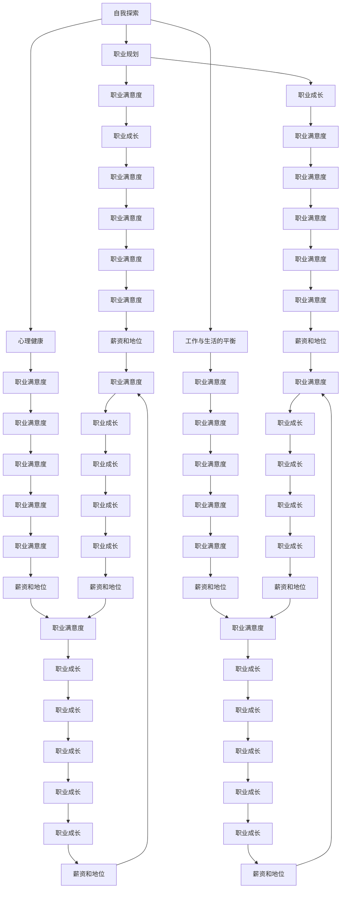

                 

### 引言

在职场中，每个人都面临着追求目标的问题。传统观念中，薪资和地位常常被视为衡量职业成功的唯一标准。然而，随着社会的发展和人们对生活质量的追求，越来越多的人开始意识到，职场中的意义远不止于此。薪资和地位虽然可以带来物质上的满足，但它们并不能完全填补人们内心深处的空虚。在职场中寻找真正的意义，追求内心的满足和成长，已经成为当代职场人士的共同课题。

本文旨在探讨如何在职场中寻找并实现个人意义，超越单纯的薪资和地位追求。我们将通过系统的分析和推理，帮助读者认识到职场意义的重要性，并找到适合自己的职业路径。本文将分为以下几个部分进行探讨：

1. **核心概念与联系**：首先，我们将介绍本文的核心概念，包括自我探索、职业规划、心理健康、工作与生活的平衡等，并通过 Mermaid 流程图展示这些概念之间的联系。
2. **自我探索**：这一部分将重点探讨如何了解自己的价值观、兴趣和职业倾向，并提供具体的方法和工具。
3. **职业规划**：我们将讨论如何设定职业目标，规划职业路径，并解决职业规划中常见的问题。
4. **心理健康**：职场压力是每个人都可能面临的问题，我们将提供有效的压力管理和心理调适方法，帮助读者维护心理健康。
5. **工作与生活的平衡**：最后，我们将分享如何在职场和生活中找到平衡，实现个人成长。

通过本文的探讨，我们希望读者能够认识到职场中的意义不仅仅是薪资和地位的追求，更是一场内心的修行和成长之旅。让我们一步一步地分析推理，共同寻找属于自己的职场意义。

### 关键词

- 职场意义
- 自我探索
- 职业规划
- 心理健康
- 工作与生活的平衡
- 薪资与地位
- 内心满足

### 摘要

本文旨在探讨职场中寻找意义的重要性，以及如何超越薪资和地位的追求，实现个人成长和内心满足。通过系统分析和推理，文章首先介绍了核心概念及其联系，包括自我探索、职业规划、心理健康、工作与生活的平衡。接着，文章详细探讨了如何通过自我探索找到个人价值观、兴趣和职业倾向，并设定明确的职业目标。此外，文章还提供了有效的心理健康管理和工作与生活的平衡策略。最后，通过案例分析，展示了成功实现职场意义的实际案例，为读者提供了可行的实践指南。

## 核心概念与联系

在探讨如何寻找职场中的意义时，首先需要明确几个核心概念，并理解它们之间的内在联系。以下是本文中的几个关键概念及其相互关系：

### 1. 自我探索

自我探索是指通过深入了解自己的价值观、兴趣、职业倾向和个人特质，从而找到符合自己内心期望的职业路径。自我探索是整个过程中的基础，决定了个体对职业选择的满意度。

### 2. 职业规划

职业规划是基于自我探索的结果，制定明确的职业目标和路径，包括短期和长期的目标。职业规划不仅有助于实现职业发展，还能提高工作效率和职业满意度。

### 3. 心理健康

心理健康是职场成功的重要保障。在高压的职场环境中，保持良好的心理健康有助于应对工作压力，提高工作效率，减少职业倦怠。

### 4. 工作与生活的平衡

工作与生活的平衡是现代职场人士追求的重要目标。平衡工作与生活不仅能够提高生活质量，还能促进职业发展和个人成长。

### 5. 薪资和地位

虽然薪资和地位是职场中的重要因素，但它们并非衡量职业成功的唯一标准。薪资和地位可以提供物质上的满足，但无法替代职场中的意义和满足感。

### 6. 职业满意度

职业满意度是指个体对职业选择的满意程度，它受到多个因素的影响，包括自我实现、工作与生活的平衡、职业发展等。

### 7. 职业成长

职业成长是指个体在职业发展过程中不断学习和提升，从而实现自我价值的提升。职业成长与自我探索和职业规划紧密相关。

### 关系架构

为了更清晰地展示这些概念之间的联系，我们可以使用 Mermaid 流程图来表示。以下是核心概念与联系的基本框架：



通过上述 Mermaid 流程图，我们可以清晰地看到这些概念之间的相互关系。自我探索是整个过程的起点，它直接影响职业规划、心理健康和工作与生活的平衡。职业规划和心理健康则共同决定了职业满意度和职业成长，而薪资和地位虽然重要，但它们并非直接决定因素。通过理解这些概念和它们之间的联系，我们可以更好地在职场中寻找并实现个人的意义。

### 自我探索

自我探索是职场中寻找意义的基石，它涉及对个人价值观、兴趣和职业倾向的深入了解。通过自我探索，个体能够明确自己的目标，从而更好地规划职业路径，提高职业满意度和幸福感。

#### 1. 价值观分析

价值观是人们判断行为是否正确或重要的信念和标准。在职场中，了解自己的价值观有助于选择适合自己的职业，并在工作中保持动力和满足感。以下是一种用于分析价值观的方法：

- **写下你的核心价值观**：首先，列出你认为最重要的五个价值观，如诚信、创新、责任感、团队精神和成长。
- **优先排序**：对这些价值观进行排序，确定哪些对你的职业选择影响最大。
- **反思和调整**：通过反思和与他人交流，调整并最终确定自己的核心价值观。

**伪代码示例**：

```python
# 输入：用户的核心价值观列表
values = ["诚信", "创新", "责任感", "团队精神", "成长"]

# 输出：排序后的核心价值观
sorted_values = sorted(values, key=lambda v: int(input(f"请为'{v}'打分(1-5):")))

# 打印排序后的核心价值观
for value in sorted_values:
    print(f"我的核心价值观：{value}")
```

#### 2. 兴趣探索

兴趣是人们热衷于参与的活动或领域。了解自己的兴趣有助于发现潜在的职业方向，并提高工作满意度。以下是一种用于探索兴趣的方法：

- **列出你的兴趣**：首先，列出你目前和过去感兴趣的活动、学科和领域。
- **分析与职业的联系**：分析这些兴趣与哪些职业相关，了解相关职业的工作内容和职责。
- **拓展兴趣**：通过阅读、实践和社交活动，拓展和深化自己的兴趣。

**伪代码示例**：

```python
# 输入：用户的兴趣列表
interests = ["编程", "艺术", "音乐", "旅行", "阅读"]

# 输出：与职业相关的兴趣
related_interests = []

for interest in interests:
    if "编程" in interest:
        related_interests.append("软件工程师")
    elif "艺术" in interest:
        related_interests.append("艺术家")
    elif "音乐" in interest:
        related_interests.append("音乐教师")
    elif "旅行" in interest:
        related_interests.append("旅游咨询师")
    elif "阅读" in interest:
        related_interests.append("编辑")

# 打印与职业相关的兴趣
for interest, job in zip(interests, related_interests):
    print(f"{interest} 与职业 {job} 相关")
```

#### 3. 职业倾向评估

职业倾向是指个体在特定职业环境中展现出的偏好和适应能力。通过职业倾向评估，个体可以更好地了解自己在哪些职业领域可能更有优势。以下是一种简单的职业倾向评估方法：

- **职业倾向测试**：使用职业倾向测试工具，如 MBTI（迈尔斯-布里格斯类型指标）或 Holland 职业兴趣量表，评估自己的职业倾向。
- **结果解读**：根据测试结果，分析自己的职业倾向，了解哪些职业类型更适合自己的个性。

**伪代码示例**：

```python
# 输入：用户的职业倾向测试结果
test_results = ["ISTJ", "ENFP"]

# 输出：职业建议
career_advice = []

for result in test_results:
    if result.startswith("I"):
        career_advice.append("内倾型职业：如会计、工程师")
    elif result.startswith("E"):
        career_advice.append("外倾型职业：如市场营销、人力资源管理")

# 打印职业建议
for result, advice in zip(test_results, career_advice):
    print(f"测试结果 {result}：职业建议 {advice}")
```

通过以上方法，个体可以更好地了解自己的价值观、兴趣和职业倾向，为职业规划奠定基础。自我探索是一个持续的过程，需要个体不断地反思和调整。通过自我探索，我们能够更清楚地认识自己，找到属于自己的职场意义。

### 职业规划

职业规划是实现职场意义的重要步骤，它帮助个体设定清晰的职业目标，规划可行的职业路径，并应对职业发展中的各种挑战。以下是如何进行职业规划的具体方法：

#### 1. 设定职业目标

职业目标是职业规划的核心，它为个体提供了明确的奋斗方向。以下是设定职业目标的基本原则：

- **SMART 原则**：SMART 是一种常用的目标设定方法，它要求目标具体（Specific）、可衡量（Measurable）、可实现（Achievable）、相关（Relevant）和有时限（Time-bound）。
- **目标类型**：职业目标可以分为短期目标、中期目标和长期目标。短期目标通常在1年以内，如获得某个证书或提升技能；中期目标在1-5年，如晋升为经理或进入特定行业；长期目标通常在5年以上，如成为某一领域的专家或创业者。
- **目标设定步骤**：
  - **明确愿望**：思考你希望在职业生涯中实现什么，设定一个初始目标。
  - **细化目标**：将初始目标分解为具体、可衡量的目标，并设定时间期限。
  - **评估和调整**：评估设定的目标是否合理，并根据实际情况进行调整。

**伪代码示例**：

```python
# 输入：用户的目标愿望
goal_wish = "成为AI领域的专家"

# 输出：具体、可衡量的职业目标
def set_specific_goal(wish):
    # 解析愿望，生成具体目标
    specific_goal = wish.replace("成为", "").replace("领域的", "").lower()
    # 设置时间期限
    time_bound = "5年内"
    # 返回目标
    return f"{specific_goal}，{time_bound}"

# 打印具体目标
print(set_specific_goal(goal_wish))
```

#### 2. 规划职业路径

职业路径规划是指为实现职业目标制定一系列具体的行动步骤。以下是职业路径规划的基本方法：

- **评估当前状况**：了解自己的技能、经验和资源，评估当前的职业基础。
- **分析职业机会**：研究目标职业的市场需求和趋势，分析潜在的晋升路径和机会。
- **制定行动步骤**：
  - **基础技能提升**：根据目标职业的要求，提升相关的基础技能。
  - **专业知识和经验积累**：通过学习、实习、项目经验等方式积累专业知识和经验。
  - **职业网络建设**：参加行业会议、社交活动，建立和维护职业网络。
- **定期评估和调整**：根据职业目标的进展，定期评估行动步骤的成效，并适时进行调整。

**伪代码示例**：

```python
# 输入：用户当前的职业状况
current_status = "具备基本的编程技能，有1年的工作经验"

# 输出：职业路径规划
def plan_career_path(status):
    # 分析当前状况，生成职业路径规划
    if "编程技能" in status:
        path_steps = [
            "学习高级编程语言（如Python、Java）",
            "参与开源项目，提升实际编程能力",
            "寻找实习机会，积累项目经验"
        ]
    else:
        path_steps = [
            "参加编程培训课程，获得编程证书",
            "寻找入门级编程工作，积累基础经验",
            "参加技术分享会，了解行业动态"
        ]
    # 返回职业路径规划
    return f"当前职业状况：{status}\n职业路径规划：{'；'.join(path_steps)}"

# 打印职业路径规划
print(plan_career_path(current_status))
```

#### 3. 应对职业发展中的挑战

在职业规划过程中，个体可能会面临各种挑战，如职业瓶颈、工作压力和职业转换等。以下是一些应对策略：

- **职业瓶颈**：当感到职业发展停滞时，可以通过学习新技能、参与不同类型的项目或申请新的职位来突破瓶颈。
- **工作压力**：通过时间管理、健康生活方式和心理调适方法来应对工作压力。此外，寻求同事、朋友和专业人士的支持也是有效的策略。
- **职业转换**：在考虑职业转换时，首先要进行充分的自我分析和市场调研，然后制定详细的转换计划，并逐步实施。

**伪代码示例**：

```python
# 输入：用户面临的职业挑战
challenge = "感觉职业发展停滞，对现有工作感到不满意"

# 输出：应对策略
def handle_career_challenges(challenge):
    if "职业发展停滞" in challenge:
        strategies = [
            "学习新技能，提升职业竞争力",
            "寻求晋升机会，改变工作内容",
            "考虑转换职业方向，寻找新的机会"
        ]
    elif "工作压力" in challenge:
        strategies = [
            "制定工作计划，提高工作效率",
            "保持健康生活方式，缓解压力",
            "参加压力管理课程，学习应对策略"
        ]
    else:
        strategies = [
            "进行职业规划，明确转换目标",
            "调研市场需求，了解目标职业",
            "逐步过渡，避免突兀转换"
        ]
    # 返回应对策略
    return f"面临的挑战：{challenge}\n应对策略：{'；'.join(strategies)}"

# 打印应对策略
print(handle_career_challenges(challenge))
```

通过以上方法，个体可以更系统地规划自己的职业发展路径，并有效应对职业发展中的各种挑战。职业规划是一个持续的过程，需要个体不断地反思、调整和优化。通过科学的职业规划，我们能够更好地实现职业目标，找到职场中的真正意义。

### 心理健康

在职场中，心理健康是保持高效工作和实现职业目标的关键。高压的环境、不断变化的工作需求以及人际关系的复杂性，都可能对个体的心理健康产生负面影响。因此，理解和应对职场压力、进行心理调适和自我成长，对于维护心理健康至关重要。

#### 1. 压力管理

职场压力是每个人都可能面临的问题。以下是一些有效的压力管理策略：

- **认识压力源**：首先，需要明确压力的来源，如工作负荷、人际关系、职业不确定性等。
- **时间管理**：合理安排工作时间，避免过度劳累。使用时间管理工具，如任务列表、优先级排序等，提高工作效率。
- **情绪调节**：学会调节情绪，如通过深呼吸、冥想或运动等方式缓解紧张情绪。
- **社交支持**：寻求家人、朋友或同事的支持，分享工作中的压力和困惑。

**伪代码示例**：

```python
# 输入：用户的压力情况
stress_level = "高"

# 输出：压力管理建议
def manage_stress(stress_level):
    if stress_level == "高":
        suggestions = [
            "定期进行放松训练，如深呼吸、冥想",
            "每天保持一定的运动时间，如散步、跑步",
            "安排与家人、朋友的休闲时间，缓解工作压力",
            "寻求专业人士的帮助，如心理咨询师"
        ]
    else:
        suggestions = [
            "保持良好的工作节奏，避免过度劳累",
            "利用休息时间进行兴趣爱好活动，如阅读、绘画",
            "定期参加社交活动，增进人际交往"
        ]
    return f"当前压力水平：{stress_level}\n压力管理建议：{'；'.join(suggestions)}"

# 打印压力管理建议
print(manage_stress(stress_level))
```

#### 2. 心理调适

心理调适是指通过改变思维方式、行为习惯来适应职场环境，提高心理健康水平。以下是一些心理调适的方法：

- **积极心态**：培养积极的心态，面对困难和挑战时，采取解决问题的态度，而不是逃避或抱怨。
- **自我反思**：定期进行自我反思，了解自己的情绪、需求和期望，调整心态和行为。
- **情绪表达**：学会合理表达情绪，通过书面、口头或艺术等方式释放压力。
- **认知重构**：通过认知重构技术，改变对事件的负面认知，提高心理弹性。

**伪代码示例**：

```python
# 输入：用户的情绪状态
emotion_state = "焦虑"

# 输出：心理调适建议
def adjust_mindset(emotion_state):
    if emotion_state == "焦虑":
        suggestions = [
            "尝试认知重构，重新评估事件的影响",
            "通过冥想、瑜伽等方式放松身心",
            "与信任的人交流，分享情绪和感受",
            "制定可行的应对计划，减少不确定性"
        ]
    else:
        suggestions = [
            "保持积极心态，关注工作中的成就",
            "定期进行自我反思，调整目标和方法",
            "培养兴趣爱好，丰富生活内容",
            "参加心理成长课程，提升心理素质"
        ]
    return f"当前情绪状态：{emotion_state}\n心理调适建议：{'；'.join(suggestions)}"

# 打印心理调适建议
print(adjust_mindset(emotion_state))
```

#### 3. 自我成长

自我成长是指通过不断学习和提升，实现个人价值和职业发展的过程。以下是自我成长的一些方法：

- **终身学习**：保持学习的态度，通过在线课程、读书会、工作坊等方式，不断提升知识和技能。
- **实践应用**：将所学知识应用到实际工作中，通过项目实践和问题解决，提升实际能力。
- **反思总结**：定期进行反思和总结，分析学习过程和成果，调整学习方法和目标。
- **拓展视野**：通过阅读、旅行、参加国际会议等方式，拓宽视野，了解不同文化背景下的工作方式和思维模式。

**伪代码示例**：

```python
# 输入：用户的学习目标
learning_goal = "提升编程技能"

# 输出：自我成长计划
def plan_for_growth(goal):
    if goal == "提升编程技能":
        steps = [
            "参加在线编程课程，学习新语言和框架",
            "参与开源项目，提升实际编程能力",
            "定期进行编程练习，巩固所学知识",
            "阅读相关书籍和博客，了解最新技术动态"
        ]
    else:
        steps = [
            "报名参加职业培训课程，提升专业素质",
            "参加行业研讨会，了解市场趋势",
            "进行职业规划，明确职业发展目标",
            "参加跨文化交流活动，提升国际视野"
        ]
    return f"学习目标：{goal}\n自我成长计划：{'；'.join(steps)}"

# 打印自我成长计划
print(plan_for_growth(learning_goal))
```

通过有效的压力管理、心理调适和自我成长，个体能够在职场中更好地应对挑战，维护心理健康，实现职业目标。心理健康不仅是职场成功的基础，也是个人幸福的重要组成部分。让我们共同努力，关注心理健康，实现职业与个人的全面发展。

### 工作与生活的平衡

在现代社会，工作与生活的平衡已经成为职场人士普遍关心的问题。如何在工作与生活之间找到平衡，不仅关系到个人的身心健康，也直接影响职业发展和生活质量。以下是一些方法，帮助读者实现工作与生活的平衡：

#### 1. 设定明确的工作与生活界限

明确的工作与生活界限有助于减少工作对个人生活的侵扰，提高工作效率和生活质量。以下是一些设定界限的方法：

- **固定工作时间**：设定固定的办公时间和下班时间，避免工作时间无限延长。
- **工作区域隔离**：在家工作或办公时，设置一个独立的工作区域，与家庭生活区域明确区分。
- **设定优先级**：合理安排工作任务，将重要和紧急的任务优先处理，避免因工作堆积而影响生活。
- **沟通与协商**：与家人和朋友沟通，明确工作与生活的界限，并协商解决潜在的工作与生活冲突。

**伪代码示例**：

```python
# 输入：用户的工作时间
work_time = "每天上午9点到下午6点"

# 输出：设定工作与生活界限的建议
def set界限界限(work_time):
    suggestions = [
        f"设定固定工作时间：{work_time}",
        "在家工作或办公时，设置独立工作区域",
        "设定优先级，合理安排工作任务",
        "与家人和朋友沟通，明确工作与生活界限"
    ]
    return f"设定工作与生活界限的建议：{'；'.join(suggestions)}"

# 打印建议
print(set界限界限(work_time))
```

#### 2. 提高工作效率

提高工作效率不仅可以减少工作压力，也为个人生活留出更多时间。以下是一些提高工作效率的方法：

- **时间管理**：使用时间管理工具，如待办事项列表、时间块管理等，合理安排工作时间，减少无效时间。
- **自动化与工具化**：利用自动化工具和办公软件，减少重复性工作，提高工作效率。
- **任务分解**：将复杂任务分解为多个简单步骤，逐一完成，避免因任务复杂而拖延。
- **休息与恢复**：合理安排休息时间，进行短暂的放松和恢复，提高后续工作的效率。

**伪代码示例**：

```python
# 输入：用户的时间管理工具
time_management_tools = ["待办事项列表", "时间块管理"]

# 输出：提高工作效率的建议
def improve_efficiency(tools):
    suggestions = [
        f"使用时间管理工具：{'、'.join(tools)}",
        "利用自动化工具和办公软件，减少重复性工作",
        "将复杂任务分解为简单步骤，逐一完成",
        "合理安排休息时间，进行短暂的放松和恢复"
    ]
    return f"提高工作效率的建议：{'；'.join(suggestions)}"

# 打印建议
print(improve_efficiency(time_management_tools))
```

#### 3. 家庭与工作的平衡

家庭与工作的平衡是现代职场人士面临的另一个重要问题。以下是一些实现家庭与工作平衡的方法：

- **设定家庭时间**：在日程安排中预留家庭时间，确保与家人共度质量时光。
- **沟通与理解**：与家人沟通工作需求和压力，争取他们的理解和支持。
- **共同参与**：鼓励家人参与家庭事务，共同分担家务，减轻个人负担。
- **灵活工作安排**：与雇主协商灵活的工作安排，如弹性工作时间、远程工作等，更好地适应家庭需求。

**伪代码示例**：

```python
# 输入：用户的家庭需求
family_needs = ["照顾孩子", "参与家庭活动"]

# 输出：家庭与工作平衡的建议
def balance_family_and_work(needs):
    suggestions = [
        "设定家庭时间，预留与家人共度时光",
        "与家人沟通工作需求和压力，争取理解和支持",
        "鼓励家人参与家庭事务，共同分担家务",
        "与雇主协商灵活的工作安排，如弹性工作时间、远程工作"
    ]
    for need in needs:
        if need == "照顾孩子":
            suggestions.append("安排可靠的家教或保姆，确保孩子得到良好照顾")
        elif need == "参与家庭活动":
            suggestions.append("合理安排工作计划，确保参加重要的家庭活动")
    return f"家庭与工作平衡的建议：{'；'.join(suggestions)}"

# 打印建议
print(balance_family_and_work(family_needs))
```

通过设定明确的工作与生活界限、提高工作效率以及平衡家庭与工作，读者可以更好地实现工作与生活的平衡，提高生活质量。工作与生活的平衡不仅有助于个人的身心健康，也是实现职业目标的重要保障。让我们共同努力，找到属于自己的工作与生活平衡点。

### 案例研究

在本部分，我们将通过分析几个职场中成功寻找意义的案例，探讨如何在现实中实现个人意义。这些案例涉及不同行业和背景的个体，但都展示了他们在职业发展中如何找到并实现内心的满足。

#### 案例一：从程序员到创业者的转型

**背景**：
李华是一名资深程序员，有10年的工作经验。在最初的工作中，李华因薪资和地位而选择了编程行业，但他逐渐感到自己的工作缺乏意义，每天只是重复写代码。为了寻找新的意义，他决定转型成为创业者。

**职业目标的设定**：
李华的目标是创建一个能够帮助程序员提高工作效率的工具。他通过市场调研和用户反馈，确定了产品方向，并设定了一个明确的愿景：让每一个程序员都能在高效、有意义的编程工作中找到快乐。

**职业路径规划**：
- **基础技能提升**：李华通过学习产品管理、市场营销和创业相关课程，提升自己的综合素质。
- **组建团队**：李华利用自己的网络资源，组建了一个包含技术、市场和运营的创业团队。
- **实际操作**：李华带领团队开发了第一个产品版本，并开始了市场推广。

**结果与启示**：
李华的创业项目获得了用户的好评，并且逐渐在市场上站稳了脚跟。这个案例表明，通过明确的职业目标和合理的职业路径规划，个人可以在职场中找到新的意义。同时，转型并不意味着放弃过去的经验和技能，而是一个重新发现和利用自己能力的过程。

#### 案例二：职场中的心理健康建设

**背景**：
张三是一名软件工程师，工作压力大且经常加班。长时间的工作压力导致他感到身心俱疲，甚至出现了焦虑和抑郁的症状。为了改善心理健康，张三决定采取积极的措施。

**职业目标的设定**：
张三的目标是保持心理健康，提高工作效率。他希望通过健康的生活方式和心理调适方法，实现工作与生活的平衡。

**职业路径规划**：
- **压力管理**：张三学习了时间管理和压力管理的方法，合理安排工作和休息时间。
- **运动与健康**：张三每天坚持运动，如跑步和瑜伽，以保持身体健康。
- **心理调适**：张三参加了心理健康课程，学习了情绪调节和认知重构的方法。

**结果与启示**：
通过积极的压力管理和心理调适，张三的身心健康得到了显著改善。他不仅工作效率提高了，还增强了心理韧性，能够更好地应对职场挑战。这个案例说明，心理健康是职场成功的重要保障，通过科学的方法，个体可以有效地维护心理健康。

#### 案例三：跨行业职业转换

**背景**：
陈女士是一名财务分析师，对当前的工作感到不满意，希望尝试新的职业领域。她通过自我探索，发现自己对教育领域充满热情，决定转型成为一名教育顾问。

**职业目标的设定**：
陈女士的目标是在教育领域找到自己的位置，为学生的职业发展提供帮助。她希望自己的工作不仅能够带来经济收益，还能为社会做出贡献。

**职业路径规划**：
- **职业倾向评估**：陈女士通过职业倾向测试，确认了教育顾问的职业方向。
- **技能提升**：陈女士参加了教育学和心理学相关课程，提升了自己的教育专业知识。
- **实际操作**：陈女士在一家教育机构实习，积累了实际工作经验。

**结果与启示**：
陈女士的转型获得了成功，她在新的职业领域中找到了满足感和成就感。这个案例表明，跨行业职业转换需要坚定的决心和合理的规划，通过不断学习和实践，个体可以在新的领域中找到属于自己的意义。

### 案例总结与启示

以上案例展示了不同背景的个体如何在职场中寻找并实现个人意义。这些案例的共同点是：

1. **明确职业目标**：通过设定清晰的职业目标，个体能够找到前进的方向，并为之努力。
2. **科学职业规划**：合理的职业路径规划有助于实现职业目标，提高职业满意度。
3. **心理健康重视**：维护心理健康是职场成功的重要保障，通过有效的压力管理和心理调适，个体能够更好地应对职场挑战。
4. **持续学习与成长**：不断学习和提升自我，不仅有助于实现职业目标，还能增强个体的竞争力和自信心。

通过这些案例，我们可以得出以下启示：

- **职业意义不仅仅在于薪资和地位，更在于内心的满足感和成就感。**
- **职业规划需要根据个人兴趣和价值观，结合市场需求进行合理设定。**
- **心理健康是职场成功的基础，需要个体和雇主共同关注。**
- **跨行业职业转换和自我探索是寻找职场意义的重要途径。**

让我们从这些成功案例中汲取经验，找到属于自己的职场意义，实现职业与个人的全面发展。

### 实践指南

为了在职场中找到并实现个人意义，以下是一些具体可行的行动指南和最佳实践，帮助您在职场中取得成功：

#### 1. 自我探索

- **定期反思**：每隔一段时间，花时间反思自己的价值观、兴趣和职业倾向。通过写作、绘画或其他形式记录自己的思考和感受，深入了解自己。
- **职业倾向测试**：使用职业倾向测试工具，如 MBTI、Holland 职业兴趣量表等，评估自己的职业倾向，了解自己更适合哪些类型的职业。
- **模拟工作场景**：通过参与模拟工作场景或实习，了解不同职业的实际工作内容和要求，帮助自己做出更明智的职业选择。

#### 2. 职业规划

- **设定明确目标**：使用 SMART 原则（具体、可衡量、可实现、相关、有时限）设定职业目标，确保目标具有可行性和指导性。
- **制定行动步骤**：将职业目标分解为具体的行动步骤，并为每个步骤设定时间期限。定期评估进展，根据实际情况进行调整。
- **持续学习**：保持终身学习的态度，通过在线课程、工作坊、读书会等方式不断提升自己的技能和知识。

#### 3. 心理健康

- **时间管理**：合理安排工作和休息时间，避免过度劳累。使用时间管理工具，如待办事项列表和时间块管理，提高工作效率。
- **情绪调节**：学会情绪调节方法，如深呼吸、冥想、运动等。通过定期进行情绪调节，缓解工作压力。
- **寻求支持**：与家人、朋友或专业人士交流，分享自己的压力和困惑。寻求他们的支持和建议，增强心理韧性。

#### 4. 工作与生活的平衡

- **设定界限**：明确工作时间和生活时间的界限，避免工作侵入个人生活。在家工作时，设立独立的工作区域，提高工作效率。
- **提高工作效率**：通过任务分解、自动化工具和优先级管理，提高工作效率。避免因工作拖延而影响个人生活。
- **设定家庭时间**：预留与家人共度的时间，确保与家人保持紧密联系。通过沟通和协商，解决家庭与工作之间的冲突。

#### 5. 跨行业探索

- **广泛涉猎**：保持对新领域和新技术的兴趣，通过阅读、参加行业会议和交流等方式，了解不同行业的发展趋势。
- **积极尝试**：在职业初期，可以尝试不同的工作类型，了解自己的兴趣和优势。通过实践和反馈，找到最适合自己的职业路径。
- **跨界合作**：在职场中，积极参与跨界项目和团队合作，拓宽视野，提升综合能力。

### 小结

通过以上实践指南，您可以在职场中找到并实现个人意义。自我探索、职业规划、心理健康、工作与生活的平衡以及跨行业探索都是实现职场意义的重要步骤。请记住，职场中的意义不仅仅是薪资和地位的追求，更是一场内心的修行和成长之旅。让我们一起努力，找到属于自己的职场意义，实现个人和职业的全面发展。

### 注意事项

在职场中寻找并实现个人意义的过程中，需要注意以下几个方面，以确保目标的实现和职业发展的顺利进行：

1. **持续学习**：职场环境和技能要求不断变化，持续学习是保持竞争力的关键。无论是通过在线课程、工作坊还是行业会议，都应该积极提升自己的知识和技能。

2. **心理健康**：职场压力可能对心理健康造成影响。定期进行心理调适，寻求专业帮助，保持良好的生活作息，都是维护心理健康的重要措施。

3. **职业规划**：职业规划应结合个人兴趣和市场需求，确保目标的可实现性和实际意义。同时，需要根据实际情况及时调整规划，保持灵活性。

4. **工作与生活平衡**：工作与生活的平衡不仅有助于提高生活质量，还能提高工作效率。设定明确的界限，合理安排时间和资源，避免工作侵入个人生活。

5. **跨行业探索**：保持开放的心态，尝试不同领域的工作，可以帮助自己发现新的兴趣和潜力。但在跨行业转换时，要确保自己的能力和经验与目标职业相匹配。

6. **实际案例借鉴**：通过学习成功案例，了解他们在实现职场意义过程中的经验和策略，有助于自己少走弯路，更加高效地实现目标。

通过关注这些注意事项，我们可以在职场中更好地寻找和实现个人意义，实现职业和个人的全面发展。

### 拓展阅读

对于希望进一步探索职场意义和个人成长的读者，以下推荐几本经典书籍和资源，供您参考：

1. **《斯坦福大学人生设计课》** - 迈克尔·程（Michael Cheng）
   - 本书提供了一种全新的职业发展方法，通过人生设计帮助读者找到并实现个人意义。

2. **《活出生命的意义》** - 维克多·弗兰克尔（Viktor Frankl）
   - 本书讲述了在极端环境下的生命意义探索，对理解职场中的意义有深刻启示。

3. **《精进：如何成为一个很厉害的人》** - 采铜
   - 介绍了如何通过精进方法论，不断提升自己的能力和实现职业目标。

4. **《深度工作》** - 卡尔·纽波特（Cal Newport）
   - 提供了关于如何在高干扰环境中保持专注，提高工作效率的方法。

5. **《影响力》** - 罗伯特·西奥迪尼（Robert B. Cialdini）
   - 探讨了影响力和说服力的心理学原理，对于职业发展和人际关系都有重要指导意义。

6. **《代码大全》** - 史蒂夫·迈克康奈尔（Steve McConnell）
   - 一本关于软件工程最佳实践的指南，帮助开发者提升编程技能和职业素养。

通过阅读这些书籍和资源，读者可以进一步深化对职场意义和个人成长的理解，找到属于自己的职业发展路径。同时，这些资源也为实际操作提供了丰富的案例和实用的技巧。

### 总结与展望

通过本文的探讨，我们系统地分析了如何在职场中寻找并实现个人意义。首先，我们介绍了核心概念与联系，包括自我探索、职业规划、心理健康、工作与生活的平衡等。接着，我们详细探讨了如何通过自我探索、职业规划、心理健康管理、工作与生活平衡以及跨行业探索，找到并实现个人意义。此外，通过案例研究，我们展示了成功实现职场意义的实际案例，为读者提供了可行的实践指南。

总之，职场中的意义远不止于薪资和地位，更是一场内心的修行和成长之旅。通过不断自我探索、设定明确的职业目标、维护心理健康、实现工作与生活的平衡以及勇于尝试新领域，每个人都可以在职场中找到属于自己的意义，实现个人与职业的双重发展。

展望未来，随着社会的发展和技术的进步，职场环境将变得更加复杂和多元化。作为职场人士，我们需要不断提升自我，适应变化，勇于创新。通过持续学习和实践，我们不仅能够在职业上取得成功，还能在精神层面上获得满足和成长。

让我们行动起来，关注自己的内心需求，找到并实现职场中的意义，共同迈向更加充实和有意义的人生旅程。在这个过程中，无论遇到什么挑战，都保持积极的心态，勇敢面对，不断前行。愿我们每个人都能在职场中找到属于自己的光亮，实现真正的自我价值。

