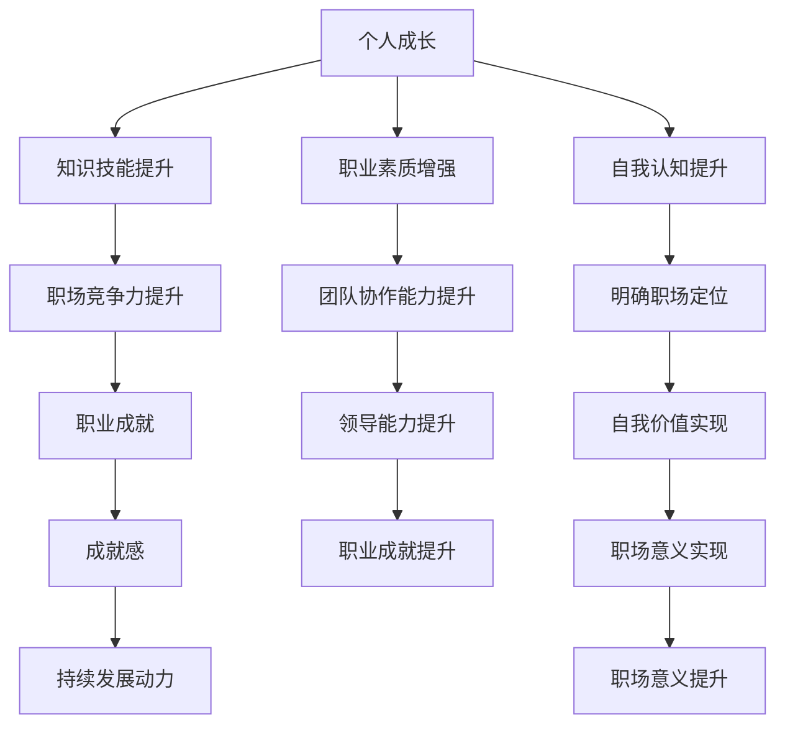
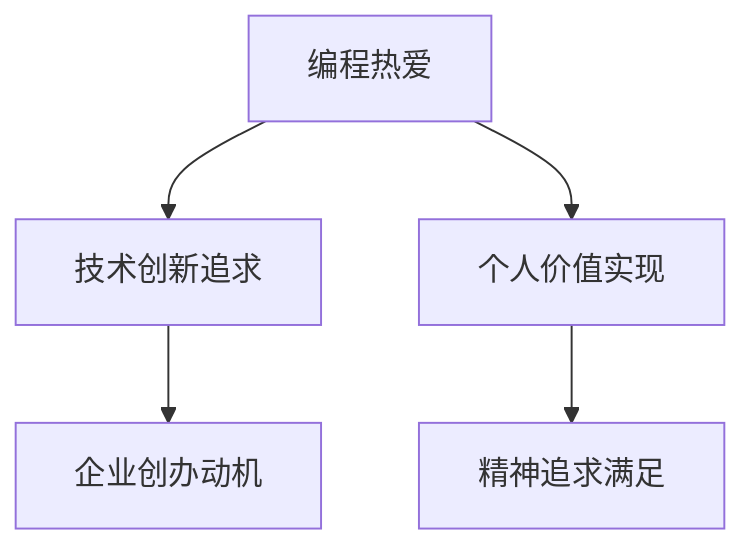
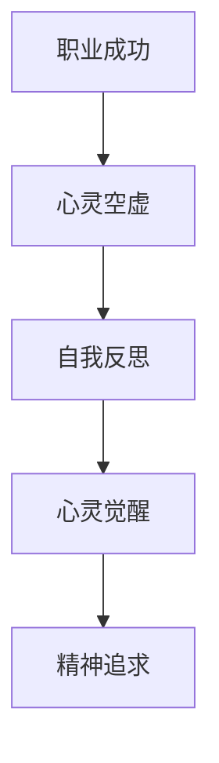
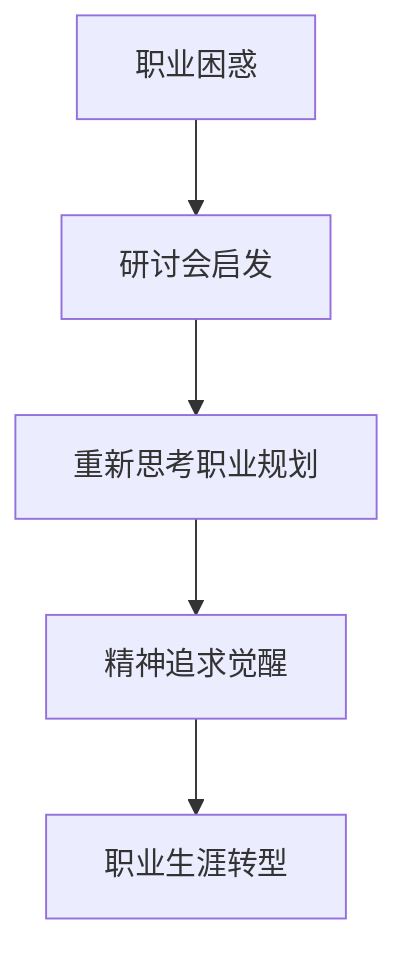

                 


### 引言：书籍的宗旨与意义

在现代社会中，职场生活占据了我们大量时间和精力。然而，许多人发现，尽管他们在职业上取得了成功，但在精神层面上仍然感到空虚和迷茫。这引发了一个重要的课题：如何寻找到职场中的更高意义？本书旨在探讨这一课题，引导读者超越传统的薪资和地位观念，从精神层面寻找更深层次的满足感。

首先，我们需要理解什么是“职场意义”。职场意义不仅仅指在工作中获得经济收入和社会地位，更重要的是在工作中找到个人价值实现和自我成长的路径。它涉及以下几个方面：

1. **个人成长**：职场应当成为个人不断学习和进步的平台，通过不断积累知识和技能，提升自身综合素质。
2. **价值观实现**：个人在职场中应当追求与自身价值观相符的目标，使得工作不仅成为一种生计手段，更成为实现人生价值的途径。
3. **心理健康**：工作压力和职业发展往往是职场人士面临的主要挑战，找到职场意义有助于提升心理健康，减少职业倦怠。

本书的目的在于引导读者：

1. **重新审视职场意义**：通过深入分析职场意义的内涵和外延，使读者认识到职场不仅仅是赚钱和提升社会地位的场所，更是一个实现个人价值和成长的重要平台。
2. **探索精神追求的方法**：在理解职场意义的基础上，本书将介绍多种精神追求的方法，帮助读者在职场中找到更深层次的精神满足。
3. **提供实践案例**：通过实际案例的分享和分析，本书将展示职场中精神追求的具体实践，为读者提供可行的参考。

总之，本书的目标是帮助读者在职场中寻找到更高意义，实现精神追求，从而获得更加充实和有意义的人生。

### 职场意义与个人成长的关系

在职场中，个人成长是一个不可忽视的重要方面。这不仅关系到个体的职业发展，更与职场意义的实现息息相关。理解个人成长与职场意义的相互作用，有助于我们更加清晰地认识到职场中的发展方向和目标。

首先，个人成长是职场意义实现的基础。在职场中，个人成长通常体现在以下几个方面：

1. **知识和技能的提升**：通过不断学习和实践，个人能够积累更多的知识和技能，从而在职场中具备更强的竞争力。这种竞争不仅体现在个人绩效的提升，还体现在对团队和组织的贡献。
2. **职业素质的增强**：个人成长不仅仅是知识和技能的积累，还包括职业素质的提升，如沟通能力、团队协作能力、领导能力等。这些素质的提升使得个人能够在职场中更好地适应环境，实现自身价值。
3. **自我认知的提升**：个人成长的过程也是自我认知不断提升的过程。通过不断地反思和总结，个人能够更加清晰地认识到自己的优点和不足，从而更加明确自己在职场中的角色和定位。

其次，职场意义的实现离不开个人成长。职场意义不仅仅是个体在职业上的成功，更是一种精神上的满足和成就感。这种满足和成就感来源于个人在职场中的成长和进步。具体来说，个人成长与职场意义的实现之间存在以下几方面的关系：

1. **自我价值的实现**：通过个人成长，个体能够在职场中实现自我价值。当一个人在职业上取得成功，同时感到自己的工作有意义、有价值时，他们往往会感到一种深深的满足感。这种满足感是职场意义的重要组成部分。
2. **职业成就的成就感**：个人成长不仅能够带来职业成就，还能够带来成就感。成就感是个人在职场中追求更高目标的重要动力，它促使个人不断挑战自我，追求卓越。
3. **持续发展的动力**：个人成长是职场意义实现的重要保障。当个人在职场中实现了一定程度的成长后，他们会更有动力去追求更高的目标，不断突破自我。这种持续发展的动力使得个人能够在职场中保持积极向上的态度，不断前进。

为了更好地理解个人成长与职场意义的相互作用，我们可以通过以下Mermaid流程图来展示它们之间的关系：



通过上述流程图，我们可以清晰地看到个人成长与职场意义之间的密切关系。个人成长不仅能够提升个体的职业素质和竞争力，还能够实现自我价值，带来职业成就和成就感，从而推动职场意义的实现。

总之，个人成长是职场意义实现的重要基础，而职场意义的实现也为个人成长提供了动力和方向。在职场中，我们应该重视个人成长，不断追求更高的目标和成就，从而实现更深层次的职场意义。

### 精神追求的哲学基础

在职场中追求精神层面的满足，并非现代人的独特需求，而是人类历史长河中始终存在的主题。不同文化背景下，哲学和思想体系为我们提供了丰富的理论资源，帮助我们理解精神追求的重要性及其实现路径。

#### 东方哲学的启示

东方哲学，尤其是儒家、道家和佛家思想，为我们提供了深刻的哲学基础，指导我们在职场中追求精神层面的满足。

1. **儒家思想**：儒家强调“仁爱”和“修身齐家治国平天下”的理念。在职场中，这表现为注重人际关系，追求团队合作和共同成长。儒家思想教导我们，通过不断提升自我修养，实现个人价值的同时，也为社会做出贡献。

    **核心概念关系架构**：
    ```mermaid
    graph TD
        A[仁爱] --> B[人际关系]
        A --> C[团队合作]
        B --> D[共同成长]
        C --> E[个人价值实现]
        D --> F[社会贡献]
    ```

2. **道家思想**：道家主张“无为而治”，追求内心的平静与自然。在职场中，这启示我们应减少功利心，保持内心的宁静，从而在纷繁复杂的职场环境中找到自己的平衡点。

    **核心概念关系架构**：
    ```mermaid
    graph TD
        A[无为而治] --> B[减少功利心]
        A --> C[内心平静]
        B --> D[自我平衡]
        C --> E[应对职场压力]
    ```

3. **佛家思想**：佛家强调“苦海无边，回头是岸”，通过修行达到心灵的解脱。在职场中，这鼓励我们反思自己的行为和动机，追求心灵的净化和成长。

    **核心概念关系架构**：
    ```mermaid
    graph TD
        A[苦海无边] --> B[反思行为]
        A --> C[修行成长]
        B --> D[心灵净化]
        C --> E[精神追求]
    ```

#### 西方哲学的探讨

西方哲学，尤其是古希腊哲学和现代哲学，为我们提供了不同的视角，探讨精神追求的本质和实现途径。

1. **古希腊哲学**：苏格拉底、柏拉图和亚里士多德等哲学家，探讨了知识与真理的关系，认为追求智慧是实现精神满足的重要途径。在职场中，这启示我们应追求真理，通过持续学习和思考，提升自我。

    **核心概念关系架构**：
    ```mermaid
    graph TD
        A[苏格拉底] --> B[知识追求]
        A --> C[真理探索]
        B --> D[持续学习]
        C --> E[智慧提升]
    ```

2. **现代哲学**：尼采和海德格尔等哲学家，探讨了存在主义和生命意义的哲学。他们认为，生命的意义在于个人对生命的自由选择和自我实现。在职场中，这启示我们应追求自我实现，通过创造和贡献，赋予生命意义。

    **核心概念关系架构**：
    ```mermaid
    graph TD
        A[尼采] --> B[自我实现]
        A --> C[自由选择]
        B --> D[生命意义]
        C --> E[职场贡献]
    ```

#### 跨文化视角下的精神追求

跨文化视角下的精神追求，强调了不同文化背景下，精神追求的多样性和共同性。通过比较不同文化中的哲学和思想，我们可以更全面地理解精神追求的内涵和实现路径。

1. **文化多样性**：不同文化对精神追求的理解和表达方式各异，但都强调了个体在职场中实现自我价值的重要性。例如，在儒家文化中，精神追求与道德修养紧密相连；而在西方文化中，精神追求则更多地与个人自由和自我实现相关。

2. **共同性**：尽管文化背景不同，但不同文化中的哲学和思想都关注个体内心的成长和精神层面的满足。这种共同性为我们提供了一个全球化的视角，帮助我们在职场中寻找更高意义。

综上所述，东方哲学和西方哲学为我们提供了丰富的哲学基础，指导我们在职场中追求精神层面的满足。通过理解不同哲学思想的核心概念和关系架构，我们可以更深入地探讨精神追求的本质，找到适合自己的实现路径。

### 精神追求的具体方法

在职场中追求精神层面的满足，需要具体的方法和策略。以下是一些有效的方法，帮助我们在职场中实现精神追求：

#### 1. 内在动机的激发

内在动机是指由个人内心深处的兴趣、价值观和目标驱动的动机。激发内在动机，是我们在职场中追求精神满足的重要途径。以下是一些具体的方法：

1. **发现个人兴趣和优势**：了解自己的兴趣和优势，可以帮助我们找到工作中的乐趣。例如，如果一个人对编程充满热情，那么在编程工作中，他们更有可能体验到内在动机的满足。
   
   **伪代码示例**：
   ```python
   def discover_interests_and_advantages():
       interests = ["编程", "设计", "创新"]
       advantages = ["逻辑思维", "创造力", "团队协作"]
       return interests, advantages
   ```

2. **设定有意义的目标**：设定与个人价值观和兴趣相符的目标，可以激发内在动机。例如，一个关注社会责任的程序员，可以选择参与开源项目，通过解决社会问题来实现自我价值。

   **伪代码示例**：
   ```python
   def set_meaningful_goals(values, interests):
       goals = [
           {"name": "开源项目", "description": "解决社会问题"},
           {"name": "技术创新", "description": "推动行业发展"}
       ]
       return goals
   ```

3. **不断反思和调整**：通过定期反思和调整目标，我们可以更好地激发内在动机。例如，每月进行一次反思，了解自己在实现目标过程中的进步和不足，从而进行必要的调整。

   **伪代码示例**：
   ```python
   def reflect_and_adjust_goals(goals):
       progress = {"completed": 2, "in_progress": 3, "not_started": 1}
       adjustments = {
           "completed": ["庆祝成就"],
           "in_progress": ["寻求支持"],
           "not_started": ["重新设定目标"]
       }
       return adjustments
   ```

#### 2. 精神追求的具体实践

精神追求不仅需要内在动机的激发，还需要具体的实践方法。以下是一些实践方法，帮助我们在职场中实现精神追求：

1. **终身学习**：不断学习新的知识和技能，可以帮助我们保持思维的活跃，实现精神上的成长。例如，参加在线课程、阅读专业书籍、参加研讨会等。

   **伪代码示例**：
   ```python
   def lifelong_learningtopics = ["人工智能", "区块链", "云计算"]
   resources = ["在线课程", "专业书籍", "研讨会"]
   return topics, resources
   ```

2. **自我反思**：定期进行自我反思，了解自己在职场中的行为和动机，有助于我们找到精神追求的方向。例如，每周进行一次反思，记录自己的行为、感受和思考。

   **伪代码示例**：
   ```python
   def self_reflection():
       entries = [
           {"date": "2023-04-01", "entry": "今天解决了项目中的一大难题，感到非常满足"},
           {"date": "2023-04-08", "entry": "发现自己在团队协作中存在沟通不足的问题，需要改进"}
       ]
       return entries
   ```

3. **参与社区活动**：参与行业社区和公益活动，可以帮助我们扩大视野，实现精神上的交流与成长。例如，参加技术沙龙、志愿者活动、慈善捐款等。

   **伪代码示例**：
   ```python
   def community_involvement(events):
       activities = [
           {"name": "技术沙龙", "description": "与同行交流新技术"},
           {"name": "志愿者活动", "description": "为社区提供帮助"}
       ]
       return activities
   ```

#### 3. 精神追求在职场中的挑战与应对

在职场中追求精神追求，往往面临各种挑战。以下是一些常见的挑战及其应对策略：

1. **工作压力**：工作压力是职场人士常见的问题。为了应对工作压力，可以采取以下策略：
   - **合理规划时间**：合理安排工作和休息时间，避免过度劳累。
   - **调整工作心态**：保持积极的心态，对待工作更加从容。
   - **寻求支持**：与同事和领导沟通，寻求帮助和支持。

   **伪代码示例**：
   ```python
   def manage_work_pressure():
       strategies = [
           {"name": "时间管理", "description": "合理规划工作与休息时间"},
           {"name": "积极心态", "description": "保持乐观积极的态度"},
           {"name": "寻求支持", "description": "与同事领导沟通，寻求帮助"}
       ]
       return strategies
   ```

2. **职业发展瓶颈**：当面临职业发展瓶颈时，可以采取以下策略：
   - **拓宽视野**：通过学习新的知识和技能，提升自身的综合素质。
   - **寻求挑战**：主动承担更具挑战性的任务，提升自身的职业能力。
   - **职业转型**：在适当的时候，可以考虑进行职业转型，寻找新的发展方向。

   **伪代码示例**：
   ```python
   def overcome_career_plateau():
       strategies = [
           {"name": "知识学习", "description": "学习新的知识和技能"},
           {"name": "寻求挑战", "description": "承担更具挑战性的任务"},
           {"name": "职业转型", "description": "寻找新的职业发展方向"}
       ]
       return strategies
   ```

通过以上方法和策略，我们可以在职场中有效地追求精神层面的满足。这不仅能提升个人的心理健康，还能为职场生活带来更多的意义和乐趣。

### 职场故事与案例研究

为了更深入地理解精神追求在职场中的实际应用，我们通过几个具体的案例来探讨职场中精神追求的实践与成效。

#### 案例一：从普通员工到企业家的精神追求

张伟是一名普通的软件开发工程师，他的职业生涯始于一家小型互联网公司。在初入职场时，张伟的目标是获得一份稳定的工作，实现经济上的独立。然而，随着时间的推移，张伟逐渐发现，他对于编程的热爱和对技术创新的追求远远超出了单纯的薪资和职位。

**核心概念与联系架构**：



张伟在业余时间不断学习新的编程技术，参加各种技术社区和开源项目。通过这些努力，他不仅提升了自身的技术能力，还在社区中建立了良好的声誉。这些经历激发了张伟创办自己公司的梦想。他开始思考如何将自己的技术专长转化为实际的产品和服务，以实现更大的社会价值。

张伟最终创办了自己的软件开发公司，专注于提供高质量的技术解决方案。他的公司不仅获得了市场的认可，还为社会创造了大量的就业机会。在这个过程中，张伟实现了从普通员工到企业家的转变，同时也找到了更深层次的精神满足。

**伪代码示例**：

```python
class SoftwareEngineer:
    def __init__(self, name, skills):
        self.name = name
        self.skills = skills

    def learn_new_skills(self, skills_to_learn):
        self.skills.extend(skills_to_learn)

    def start_own_business(self, business_idea):
        # 初始化公司
        company = {
            "name": "张伟技术公司",
            "idea": business_idea
        }
        return company

# 张伟的学习与创业过程
zhangwei = SoftwareEngineer("张伟", ["Python", "Java"])
zhangwei.learn_new_skills(["Django", "Blockchain"])
zhangwei.start_own_business("提供高质量技术解决方案")
```

#### 案例二：职场中的心灵觉醒

李婷是一名市场营销经理，她的职业生涯一直顺风顺水。然而，随着时间的推移，李婷开始感到内心深处的不安和空虚。她意识到，尽管在职业上取得了成功，但她的生活缺乏真正的意义和目的。

**核心概念与联系架构**：



在经历了内心的挣扎后，李婷决定进行深刻的自我反思。她开始思考自己的价值观和人生目标，并意识到她真正追求的是帮助他人实现梦想和改变社会。她决定辞去高薪的市场营销职位，投身于非营利组织，致力于推广教育和公益事业。

通过这段经历，李婷找到了内心的平静和满足感。她不仅实现了自己的精神追求，还帮助了更多的人实现了他们的梦想。这个过程让她深刻体会到，职场中的精神追求不仅仅是个人的成长，更是一种社会责任和使命感。

**伪代码示例**：

```python
class MarketingManager:
    def __init__(self, name, career_success):
        self.name = name
        self.career_success = career_success

    def reflect_on_life(self):
        self.realization = "追求真正的意义和目的"

    def change_career_path(self, new_path):
        self.new_path = new_path

# 李婷的职业转变与心灵觉醒
liting = MarketingManager("李婷", True)
liting.reflect_on_life()
liting.change_career_path("非营利组织")
```

#### 案例三：精神追求带来的职业生涯转型

王强是一名项目经理，他的职业生涯经历了多个阶段，但每次都感到缺乏真正的成就感。他开始怀疑，是不是自己的职业选择出了问题。在一次偶然的机会中，王强参加了一场关于职业规划和工作意义的研讨会，他开始重新思考自己的职业生涯。

**核心概念与联系架构**：



经过深思熟虑，王强决定放弃现有的项目经理职位，转型成为职业咨询师。他利用自己丰富的项目管理经验，帮助那些在职业道路上迷茫的人找到方向和目标。这个转变不仅让王强找到了新的职业激情，还实现了他的精神追求。

通过这个案例，我们可以看到，精神追求不仅仅是为了个人的满足，更是一种对社会的贡献。王强的转型不仅改变了他自己的职业生涯，也影响了更多的人，让他们在职场中找到了更高的意义。

**伪代码示例**：

```python
class ProjectManager:
    def __init__(self, name, career_stage):
        self.name = name
        self.career_stage = career_stage

    def attend_seminar(self, seminar_topic):
        self-insight = "关于职业规划和工作意义"

    def change_career_path(self, new_path):
        self.new_path = new_path

# 王强的职业转型与精神追求
wangqiang = ProjectManager("王强", "项目经理")
wangqiang.attend_seminar("职业规划与工作意义")
wangqiang.change_career_path("职业咨询师")
```

通过以上案例，我们可以看到，精神追求在职场中的实际应用是多样而深刻的。无论是在创业、心灵觉醒还是职业转型中，精神追求都为职场人士提供了方向和动力，帮助他们实现更高层次的人生价值。

### 精神追求的成果评估

在职场中，精神追求的成果不仅体现在个人的满足感和成就感上，还反映在职业生涯的各个方面。对精神追求成果进行科学评估，有助于我们更好地理解其价值，并持续推动个人成长。

#### 成果的类型与评估标准

1. **职业发展**：精神追求的成果之一是职业发展的提升。这包括职位晋升、薪资增长、职业机会的增多等。评估职业发展成果的标准可以是：
   - **职位晋升频率**：衡量个人在职场中职位提升的频率和速度。
   - **薪资增长率**：比较个人在不同时间段内的薪资水平，评估薪资增长的幅度。
   - **职业机会**：分析个人在职场中获得的职业机会，如项目参与机会、跨部门调动机会等。

2. **心理健康**：精神追求有助于提升心理健康，减少职业倦怠。评估心理健康成果的标准可以是：
   - **工作满意度**：通过问卷调查或访谈，了解个人对当前工作的满意度。
   - **职业倦怠度**：使用职业倦怠量表，评估个人在职场中的压力和疲劳程度。
   - **心理韧性**：衡量个人在面对挑战和压力时的适应能力和恢复能力。

3. **人际关系**：在精神追求过程中，个人的人际关系也会得到改善，包括与同事、上级和下属的关系。评估人际关系成果的标准可以是：
   - **沟通能力**：通过观察和评估，了解个人在沟通中的表现，如表达能力、倾听能力和反馈能力。
   - **团队合作**：评估个人在团队中的合作表现，包括贡献度、协调能力和团队氛围。
   - **领导能力**：对于有管理职责的个体，评估其领导能力，如决策能力、团队激励能力和领导风格。

4. **个人成长**：精神追求促进了个人在知识和技能上的提升，以及对自身认知的深化。评估个人成长成果的标准可以是：
   - **知识积累**：通过学习记录、项目经验和证书等，评估个人在知识和技能上的积累。
   - **自我认知**：通过自我反思报告和他人反馈，评估个人对自身优劣势的认知程度。
   - **职业素养**：评估个人在职业道德、职业态度和职业行为上的表现。

#### 成果对个人与企业的贡献

精神追求的成果不仅对个人有深远的影响，也对企业和组织产生了积极的作用。

1. **对个人的贡献**：
   - **职业成就感**：精神追求的实现使得个人在职业上获得更大的成就感和满足感，提升了职业幸福指数。
   - **心理健康**：通过精神追求，个人能够更好地应对职场压力，减少职业倦怠，保持良好的心理健康状态。
   - **职业发展**：精神追求促进了个人的职业成长和晋升，提高了职业竞争力和市场价值。
   - **个人成长**：精神追求促使个人不断学习和进步，提升综合素质和职业素养。

2. **对企业的贡献**：
   - **员工满意度**：精神追求提升了员工的满意度和忠诚度，减少了员工流失率，提高了企业的稳定性。
   - **团队协作**：精神追求促进了团队成员之间的沟通和协作，增强了团队的凝聚力和效率。
   - **创新能力**：精神追求激发了员工对创新的热情和动力，推动了企业的创新能力和竞争力。
   - **企业文化**：精神追求有助于塑造积极向上的企业文化，提升企业的社会形象和品牌价值。

#### 成果的可持续性与长期影响

精神追求的成果具有可持续性和长期影响，能够为个人和企业带来持续的价值。

1. **个人层面的可持续性**：
   - **持续成长**：精神追求培养了个人持续学习和成长的习惯，使其能够在职业生涯中不断进步。
   - **心理健康**：通过精神追求，个人建立了良好的心理健康模式，能够在面对挑战时保持积极和乐观的心态。
   - **职业素养**：精神追求提升了个人的职业素养，使其能够在职场中保持良好的职业道德和行为规范。

2. **企业层面的可持续性**：
   - **企业文化**：精神追求有助于建立积极向上的企业文化，推动企业长期发展。
   - **创新能力**：精神追求激发了员工的创新意识，推动了企业的持续创新和竞争优势。
   - **员工管理**：精神追求有助于企业建立有效的员工管理体系，提升员工满意度和工作效率。

综上所述，对精神追求成果的评估应从多个维度进行，既关注个人的职业发展、心理健康和个人成长，也关注企业层面的员工满意度、团队协作和创新能力。通过科学的评估，我们可以更好地理解和应用精神追求，实现个人和企业的长期可持续发展。

### 薪资与地位的局限

在职场中，薪资和地位常常被视为成功的重要标志。然而，随着职业生涯的深入，许多专业人士逐渐发现，这些外在的成就虽然能带来短期的满足感，但在长期中，它们往往存在诸多局限。

首先，薪资和地位容易导致“工具化”现象。员工可能因为追求高薪和提升地位而变得过于功利，忽视了工作本身的乐趣和价值。这种工具化的心态可能导致员工对工作缺乏热情，无法充分发挥自身的潜力和创造力。

其次，薪资和地位往往无法满足个人的精神需求。尽管经济收入和社会地位能够提供物质保障和社交认同，但它们并不能解决内心的空虚和焦虑。许多人在高薪和显赫职位中仍然感到孤独、迷茫，缺乏深层次的精神满足。

此外，薪资和地位容易引发社会比较和竞争。在职场上，人们常常通过薪资和地位来衡量自己的成功和价值，这种比较往往会导致嫉妒和不满，影响个人的心理健康和职场关系。

最后，薪资和地位的不稳定性和不可持续性也是一个重要问题。许多行业和职位面临着技术变革和市场波动，薪资和地位可能随之波动，甚至不保。相比之下，精神追求如个人成长、价值观实现和心理健康等，往往更为稳定和持久。

因此，在职场中，我们应超越对薪资和地位的追求，关注更深层次的精神满足。这不仅有助于个人的心理健康和职业生涯，也能为企业和社会带来更大的价值。

### 精神追求的价值体现

精神追求在职场中的价值不可忽视，它不仅提升了个人素质，还对企业和社会产生了深远的影响。首先，从个人层面来看，精神追求有助于提升多个方面的能力：

1. **综合素质**：通过精神追求，个人能够不断学习新知识，提升综合素质。这不仅包括专业技能的提升，还包括沟通能力、领导能力和团队合作能力的培养。
2. **心理健康**：精神追求能够帮助个人更好地应对职场压力，减少焦虑和抑郁，提升心理健康水平。
3. **职业认同**：当个人在职场中追求精神满足时，他们往往能找到工作与个人价值观的契合点，增强对职业的认同感和归属感。
4. **创新能力**：精神追求激发了个人的创新意识，推动了个人在技术和业务上的创新，为企业和行业的发展提供了新动力。

其次，从企业层面来看，精神追求的价值体现在以下几个方面：

1. **员工满意度**：精神追求提升了员工的满意度和忠诚度，减少了员工流失率，为企业稳定发展提供了保障。
2. **团队协作**：精神追求有助于营造积极向上的团队氛围，增强团队协作能力，提升工作效率和项目质量。
3. **企业文化**：精神追求有助于塑造积极向上的企业文化，提升企业的社会形象和品牌价值，增强企业的竞争力。
4. **创新能力**：精神追求激发了员工的创新意识和创造力，推动了企业的技术创新和业务模式创新，为企业的持续发展提供了动力。

最后，从社会层面来看，精神追求的价值体现在以下几个方面：

1. **社会责任**：精神追求促使个人和企业关注社会问题，积极参与公益事业，推动社会的进步和发展。
2. **行业创新**：精神追求促进了行业内的技术创新和模式创新，推动了整个行业的发展。
3. **人才培养**：精神追求为个人提供了成长和发展的平台，为社会的整体人才素质提升做出了贡献。

总之，精神追求在职场中的价值不仅体现在个人成长和企业发展上，还对社会产生了积极的影响。通过重视精神追求，我们能够实现个人价值、企业价值和 societal value 的有机结合，推动整个社会向着更加和谐和进步的方向发展。

### 未来职场人的建议

在未来的职场中，精神追求将成为不可或缺的元素，帮助职场人实现全面的发展和成长。以下是一些具体建议，帮助未来职场人在追求精神满足的同时，实现职业生涯的卓越：

#### 1. 保持终身学习的态度

在快速变化的技术时代，终身学习是保持竞争力的关键。未来职场人应主动学习新知识、新技能，不断提升自身综合素质。以下是一些实践策略：

- **时间管理**：合理规划时间，每天安排一定时间用于学习，如每天晚上阅读一本专业书籍或参加在线课程。
- **多元化学习**：不仅学习专业技能，还要关注跨学科的知识，如心理学、哲学、艺术等，以拓宽视野。
- **实践应用**：将学到的知识应用于实际工作中，通过实践来深化理解，提升应用能力。

#### 2. 建立个人价值观和目标

在追求精神满足的过程中，明确个人价值观和目标是至关重要的。以下是一些实践步骤：

- **自我反思**：定期进行自我反思，了解自己的兴趣、优点和不足，明确自己的核心价值观。
- **设定目标**：根据个人价值观，设定短期和长期的目标，如提升某项专业技能、参与某个重要项目等。
- **持续调整**：定期评估目标实现情况，根据实际情况进行调整，确保目标始终与个人价值观一致。

#### 3. 激发内在动机

内在动机是精神追求的重要驱动力。以下是一些激发内在动机的方法：

- **兴趣驱动**：找到自己真正感兴趣的事情，将其作为职业发展的方向，保持工作热情。
- **价值观驱动**：在工作中寻找与个人价值观相符的目标和任务，通过实现这些目标来获得满足感。
- **成就感驱动**：设定具有挑战性的目标，通过不断克服困难和实现目标，获得成就感。

#### 4. 培养积极的心态

积极的心态是应对职场挑战的重要保障。以下是一些培养积极心态的方法：

- **正面思考**：在面对困难和挫折时，保持正面思考，寻找解决问题的方法。
- **感恩心态**：对生活中的每一个细节保持感恩，培养感恩的心态，提升幸福感。
- **情绪管理**：学会管理情绪，通过冥想、运动等方式缓解压力，保持心理平衡。

#### 5. 寻求支持和指导

在追求精神满足的过程中，寻求支持和指导是至关重要的。以下是一些建议：

- **导师指导**：寻找一位经验丰富的导师，从他们那里获取职业发展的建议和指导。
- **同行交流**：积极参与行业社群，与同行交流经验，互相学习和支持。
- **心理辅导**：在遇到职业瓶颈或心理问题时，寻求专业的心理辅导，帮助自己走出困境。

#### 6. 关注身心健康

身心健康是精神追求的基础。以下是一些关注身心健康的方法：

- **合理作息**：保持规律的作息，确保充足的睡眠，提高工作效率。
- **运动锻炼**：定期进行运动锻炼，增强身体素质，提升精神状态。
- **健康饮食**：保持健康饮食习惯，多吃蔬菜和水果，少吃油腻和高热量食物。

通过以上建议，未来职场人可以更好地在职场中追求精神满足，实现个人和职业生涯的双重成功。

### 未来的研究方向

尽管本书已对职场中精神追求的重要性及其实现路径进行了详细探讨，但仍有许多尚未深入的研究领域值得进一步探索。以下是一些未来研究方向：

1. **跨文化精神追求差异**：不同文化背景下的职场人士在精神追求上有何不同？这些差异如何影响职场行为和绩效？通过跨文化比较研究，可以更好地理解全球职场中的精神追求模式。

2. **精神追求与心理健康的关系**：探讨精神追求对心理健康的具体影响机制，如精神追求如何减轻职场压力、提升心理韧性等。这有助于制定更有效的心理健康干预策略。

3. **技术手段在精神追求中的应用**：随着人工智能、虚拟现实等技术的发展，如何利用这些技术工具支持职场人士的精神追求？例如，通过虚拟现实技术创造更具沉浸感的培训体验，提升学习效果。

4. **组织层面精神追求的培养**：探讨如何从组织层面推动员工的精神追求，如设计更具激励性的企业文化、提供职业发展路径等。这有助于企业提升整体绩效和员工满意度。

5. **长期精神追求的可持续性**：研究精神追求的长期效应，如精神追求对职业生涯中后期的影响，以及如何保持持续的精神追求动力。

通过这些研究，我们可以更全面地理解职场中精神追求的多维度影响，为职场人士提供更科学、有效的指导。

