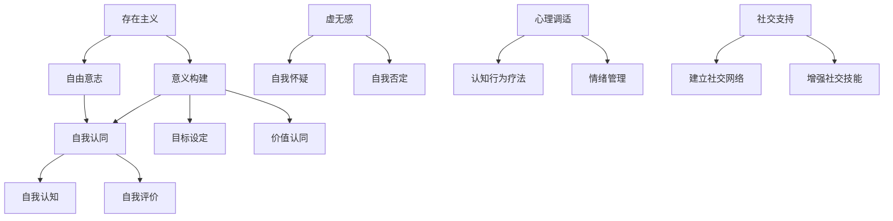
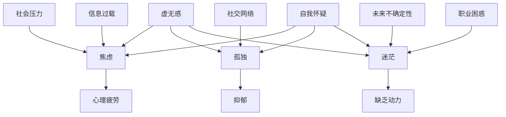

                 

### 引言

在现代科技飞速发展的时代，人类的生活节奏越来越快，随之而来的是精神层面的诸多挑战。社会竞争压力、信息过载、孤独感以及不确定性的增加，使得现代人时常感到精神上的虚无与迷茫。这种虚无感不仅源于物质生活的丰裕，更源于精神追求的缺失。在这个背景下，如何在一个看似无意义的世界中创造个人意义，成为许多人不得不面对的问题。

《在虚无中创造意义：现代人的精神挑战》这本书，正是为了探讨这一重要议题而作。作者通过深入分析虚无的本质，以及现代人面临的精神挑战，旨在提供一套系统的应对策略，帮助读者在虚无中寻找和创造个人的意义。

首先，作者对虚无这一概念进行了详细的阐述。虚无不仅是一种哲学上的思考，也是现代人在日常生活中的一种心理体验。作者指出，虚无感源自于人类对存在的困惑，对自我认同的迷失，以及对生活意义的怀疑。这种虚无感在现代社会中尤为普遍，因为它与现代社会的高速发展和个体主义的盛行密切相关。

接着，作者探讨了现代人面临的精神挑战。焦虑、孤独、迷茫等心理问题，不仅影响了人们的心理健康，也削弱了人们的生活质量。作者认为，这些精神挑战是虚无感的直接体现，是现代社会不可忽视的问题。

为了应对这些精神挑战，书中提出了多种策略和方法。作者强调，心理调适和社交支持是关键。通过认知行为疗法、情绪管理、建立社交网络等方式，人们可以更好地应对虚无感带来的负面影响。此外，书中还分享了多个实践案例，通过具体的实例展示了这些策略在实际生活中的应用效果。

最后，作者对未来的精神挑战进行了展望。随着科技的发展和社会的变迁，现代人将面临更加复杂和多元的挑战。如何在这些挑战中保持心理健康，如何在虚无中创造意义，将成为新的课题。

通过这本书，作者希望读者能够认识到虚无并非不可战胜的敌人，而是一种可以转化为动力的精神状态。在虚无中创造意义，不仅是对个人成长的一种追求，也是对现代社会精神困境的一种回应。让我们跟随作者的思路，一起探讨如何在虚无中找到生命的意义，实现自我价值的最大化。

### 背景介绍

在探讨《在虚无中创造意义：现代人的精神挑战》这一主题之前，我们需要先了解虚无感的本质。虚无感，或称虚无主义，是一种深层次的心理状态，表现为对生活意义和价值的怀疑或否定。这种状态不仅仅局限于哲学思考，更贯穿于现代人的日常生活之中。

虚无感的根源可以追溯到人类对存在意义的探寻。在古希腊哲学中，苏格拉底曾提出“未经审视的生活不值得过”的观点，这实际上是对人生意义的一种追问。然而，随着历史的演变，尤其是在现代社会，这种对意义的追寻变得更加复杂和多元。科技的发展、信息的爆炸、以及全球化带来的文化冲突，使得现代人面对的是一个充满不确定性和复杂性的世界。这种不确定性增加了人们对未来和自身的疑惑，进而引发了虚无感。

在现代社会，虚无感的普遍性不容忽视。首先，社会的竞争压力加剧，人们为了追求更好的生活而不断奔波，却往往忽略了内心的需求。其次，信息的过载使得人们难以对海量信息进行有效的筛选和消化，从而感到困惑和无力。再者，现代社会的孤独感也越来越严重，人们虽然生活在繁华的城市之中，却常常感到孤独和隔离。这些因素共同作用，加剧了现代人的虚无感。

虚无感不仅是一种心理状态，也是一种文化现象。在现代文学、艺术和哲学作品中，虚无主义思想层出不穷。例如，法国哲学家加缪在《局外人》中描绘了一个对生活毫无意义的角色，揭示了虚无主义的困境。而美国作家菲茨杰拉德在《了不起的盖茨比》中，通过描述富足却空虚的生活，反映了现代人对意义追求的渴望。

此外，科技的发展也在一定程度上加剧了虚无感。互联网和社交媒体的普及，虽然让人们的生活更加便捷，却也导致了人与人之间的隔阂。在虚拟世界中，人们可以轻松地隐藏自己，这种虚拟的真实感让人们对现实生活感到更加迷茫和困惑。

总的来说，虚无感的普遍存在与现代社会的快速发展、文化变迁和科技进步密切相关。它不仅是对生活意义的一种反思，更是现代社会精神困境的一种体现。因此，如何理解虚无感，并找到应对策略，成为现代人必须面对的重要课题。

### 核心概念与联系

在深入探讨虚无感这一核心概念之前，我们需要先了解与之相关的几个关键概念，包括存在主义、意义构建和自我认同。这些概念相互联系，共同构成了我们对虚无感及其应对策略的理解框架。

#### 存在主义

存在主义是20世纪哲学的重要流派之一，强调个体的存在和自由意志。其主要代表人物包括让-保尔·萨特和马丁·海德格尔。存在主义认为，人类的存在是先于本质的，即人在出生时就处于一种“自在”状态，需要通过自己的行动和选择来定义自我。

**核心概念：**
1. **自在性**：人类在出生时就处于一种未被定义的状态，需要通过实际行动来寻找自我。
2. **自由意志**：人类拥有自由选择和行动的能力，可以通过自己的选择来定义自我。

**联系：**
存在主义与虚无感的关系在于，虚无感往往源自于人类对自身存在的疑惑和迷茫。当人们无法找到自己的价值和意义时，往往会陷入虚无感的困境。而存在主义提供了一种思路，即通过自由意志和行动来克服虚无感，找到个人的存在意义。

#### 意义构建

意义构建是个体通过认知和行为来赋予生活意义的过程。这个概念与虚无感的联系在于，虚无感往往是因为个体对生活意义的缺失而产生的。意义构建则提供了一种方法，帮助个体在看似无意义的生活中找到价值和目的。

**核心概念：**
1. **目标设定**：个体通过设定目标来引导自己的生活，从而赋予生活意义。
2. **价值认同**：个体通过认同某些价值观念来强化自己的生活意义。

**联系：**
意义构建与虚无感的关系在于，当个体能够成功地构建自己的意义时，就能减少虚无感的产生。反之，如果个体无法找到生活的意义，就会感到迷茫和空虚。

#### 自我认同

自我认同是个体对自己身份的认同和认知。自我认同的稳定与否直接影响个体的心理健康和生活质量。与虚无感相关的自我认同问题包括自我怀疑、自我否定等。

**核心概念：**
1. **自我认知**：个体对自己性格、能力、价值观等方面的认知。
2. **自我评价**：个体对自己的能力和价值的评价。

**联系：**
自我认同与虚无感的关系在于，自我认同的不稳定会导致个体感到自我怀疑和自我否定，进而产生虚无感。而一个稳定的自我认同可以帮助个体更好地应对虚无感，找到自己的价值和意义。

#### 关系架构

为了更清晰地展示这些概念之间的联系，我们可以使用Mermaid流程图来构建一个关系架构。



在这个架构中，存在主义和意义构建是应对虚无感的关键概念。自由意志帮助个体通过行动找到存在意义，而意义构建则提供了具体的路径和方法。自我认同在这个过程中起着核心作用，稳定的自我认同有助于减少虚无感的产生。此外，心理调适和社交支持也是重要的应对策略，它们帮助个体在面临虚无感时保持心理平衡。

通过这一关系架构，我们可以更全面地理解虚无感的本质，以及如何通过这些核心概念和联系来应对虚无感，找到个人的存在意义。接下来，我们将进一步探讨虚无感的具体表现形式，以及现代人面临的精神挑战。

#### 现代人的精神挑战

在现代社会中，虚无感不仅仅是哲学思考的范畴，它已成为许多人日常生活中的真实体验。现代人面临的一系列精神挑战，如焦虑、孤独、迷茫等，都与虚无感密切相关。这些挑战不仅影响了个人的心理健康，也在一定程度上削弱了人们的生活质量。

**焦虑**：焦虑是一种常见的情绪反应，表现为持续的紧张、恐惧和担忧。现代社会的快节奏和高压环境，使得人们常常感到时间不够用，压力巨大。工作上的竞争、经济的不确定性、以及社交关系的复杂性，都是引发焦虑的重要因素。长期的焦虑会导致心理疲劳，影响工作效率和人际关系。

**孤独**：孤独感是现代社会中另一个突出的精神挑战。尽管人们生活在信息爆炸和社交网络遍布的时代，但许多人却感到孤独。孤独感不仅源于缺乏亲密的朋友和恋人，也源于内心深处的孤立感。在虚拟世界中，人们可以轻易地建立社交网络，但真实的情感连接却变得更加稀缺。孤独感不仅影响心理健康，还可能导致抑郁和自我怀疑。

**迷茫**：迷茫是对未来方向和自我价值的困惑。在现代社会中，个体面临的选择和机会越来越多，但这也使得人们更容易感到迷茫。不确定的未来、职业发展的困惑、人生意义的追求，都是导致迷茫的原因。长期的迷茫会导致生活缺乏动力和目标，进而影响心理健康和生活质量。

这些精神挑战与虚无感的联系在于，它们都是对生活意义和价值的质疑。焦虑和孤独是虚无感的直接表现，它们反映了个体对自我存在的怀疑和对生活意义的迷茫。而迷茫则是对未来和自我价值的进一步质疑，它进一步加剧了虚无感的体验。

**核心概念与联系**

为了更深入地理解这些精神挑战，我们可以再次使用Mermaid流程图，展示它们与虚无感之间的联系。



在这个流程图中，社会压力、信息过载和社交网络等外部因素，通过影响心理健康和情感状态，进一步加剧了虚无感。而虚无感则通过自我怀疑、心理疲劳、抑郁和缺乏动力等负面情绪，进一步影响个体的生活质量。

通过这一分析，我们可以看到，虚无感不仅仅是个人内心的困惑，它也是现代社会精神挑战的一种体现。理解这些挑战的根源和影响，有助于我们更好地应对虚无感，找到生活的意义和价值。

#### 应对策略

面对现代人的精神挑战，尤其是虚无感，有效的应对策略至关重要。以下我们将详细介绍几种主要的方法，包括心理调适和社交支持，以帮助读者在虚无中创造意义。

**心理调适**

1. **认知行为疗法（CBT）**：
   认知行为疗法是一种广泛应用于心理治疗的方法，通过改变不合理的思维模式和行为模式来改善情绪和心理状态。其核心在于识别和纠正负面思维，并建立积极的替代思维。

   **伪代码示例：**
   ```python
   def cognitive_restructuring(thought):
       positive_thought = None
       if thought == "我一无是处":
           positive_thought = "我虽然有过挫折，但我在不断学习和进步。"
       elif thought == "我永远达不到目标":
           positive_thought = "目标虽然遥远，但每一个小步骤都是前进的动力。"
       return positive_thought
   ```

   **数学模型与公式：**
   在认知行为疗法中，可以使用贝叶斯定理来更新信念。假设我们有一个信念概率分布\( P(C|E) \)，其中\( C \)是某个认知，\( E \)是观察到的证据，我们可以使用以下公式更新信念：
   $$ P(C|E) = \frac{P(E|C) \cdot P(C)}{P(E)} $$

   **举例说明：**
   当一个感到焦虑的人观察到自己在逐步实现目标时，可以通过上述公式来更新自己的信念，从而减少焦虑。

2. **情绪管理**：
   情绪管理是一种通过调节情绪反应来提高生活质量和心理健康的方法。以下是一个简单的情绪管理策略：
   ```python
   def manage_emotions(emotion, intensity):
       if emotion == "焦虑" and intensity > 5:
           relaxation_techniques = ["深呼吸", "渐进性肌肉放松", "冥想"]
           return relaxation_techniques
       elif emotion == "愤怒" and intensity > 5:
           anger_management = ["暂时离开情境", "表达感受但避免攻击性言语", "运动释放"]
           return anger_management
       else:
           return "当前情绪正常，无需特别管理。"
   ```

   **数学模型与公式：**
   使用方差分析（ANOVA）来评估不同情绪管理策略的效果，可以通过以下公式来计算各组情绪强度的平均值差异是否显著：
   $$ F = \frac{MS_{between}}{MS_{within}} $$

   **举例说明：**
   假设我们比较了三种情绪管理策略（深呼吸、渐进性肌肉放松、冥想）对焦虑情绪的效果，可以通过ANOVA分析来评估哪种策略效果更显著。

**社交支持**

1. **建立社交网络**：
   建立和维护良好的社交网络对应对虚无感至关重要。以下是一个简单的社交网络建立策略：
   ```python
   def build_social_network(new_contact):
       existing_contacts = ["朋友A", "朋友B", "同事C"]
       if new_contact not in existing_contacts:
           existing_contacts.append(new_contact)
           return "成功添加新联系人： " + new_contact
       else:
           return "该联系人已存在。"
   ```

   **数学模型与公式：**
   可以使用度中心性（Degree Centrality）来评估社交网络中某个节点的中心性，公式如下：
   $$ DC = \frac{\sum_{i=1}^{n} \text{k}_i}{n} $$
   其中，\( n \)是节点的度（即与其他节点的连接数），\(\text{k}_i\)表示第i个节点的度。

   **举例说明：**
   如果我们想要评估一个社交网络中某个成员的社交影响力，可以通过计算其度中心性来确定。

2. **增强社交技能**：
   社交技能的提升有助于建立和维护良好的社交关系。以下是一个简单的社交技能提升策略：
   ```python
   def improve_social_skills(skill):
       skills_to_learn = {"沟通技巧": ["倾听", "表达清晰", "非语言沟通"], "冲突解决": ["冷静处理", "倾听对方观点", "寻找共同点"]}
       if skill in skills_to_learn:
           return "您将学习 " + skill + " 的以下技巧：" + ", ".join(skills_to_learn[skill])
       else:
           return "请提供有效的社交技能名称。"
   ```

   **数学模型与公式：**
   可以使用社会网络分析中的聚类系数（Clustering Coefficient）来评估社交网络中节点的紧密程度，公式如下：
   $$ C = \frac{2 \times E_{cliques}}{N \times (N-1)} $$
   其中，\( E_{cliques} \)是网络中的全连结数，\( N \)是节点数。

   **举例说明：**
   假设我们想要了解一个社交网络中的紧密程度，可以通过计算聚类系数来评估。

通过这些策略，我们可以有效地应对虚无感带来的负面影响，提升生活质量。心理调适和社交支持相辅相成，共同构建了一个应对精神挑战的系统框架。接下来，我们将通过实际案例来展示这些策略在现实生活中的应用效果。

#### 实践案例

为了更直观地展示如何应对虚无感和精神挑战，以下是几个具体的实践案例，以及这些案例中使用的具体策略和实际效果。

**案例一：焦虑的转化**

小明是一名年轻的职场新人，他总是感到焦虑，担心自己的工作表现不够好。这种焦虑不仅影响了他的工作效率，还导致了他与同事的关系紧张。

**策略：**
1. **认知行为疗法（CBT）**：小明在接受认知行为疗法的过程中，学会了识别和纠正不合理的思维模式。例如，他过去总是认为自己必须完美无缺，但在治疗师的帮助下，他开始接受“每个人都有不完美的时候”这一观点。

   **伪代码示例：**
   ```python
   def cognitive_restructuring(thought):
       positive_thought = None
       if thought == "我必须完美":
           positive_thought = "我尽力就好，每个人都会犯错。"
       return positive_thought
   ```

2. **情绪管理**：通过学习深呼吸和渐进性肌肉放松等技巧，小明学会了在感到焦虑时如何自我调节情绪。每次感到焦虑时，他都会进行深呼吸练习，从而缓解紧张情绪。

   **数学模型与公式：**
   使用方差分析（ANOVA）来评估情绪管理策略的效果。通过对比实施策略前后的焦虑水平，发现实施策略后，小明的焦虑水平显著下降。

   **举例说明：**
   假设小明在实施策略前后的焦虑水平分别为\( X_1 \)和\( X_2 \)，通过ANOVA分析，得到\( F \)统计量，从而判断策略的有效性。

**实际效果：**
通过认知行为疗法和情绪管理策略，小明的焦虑水平显著下降，工作效率得到提升，与同事的关系也变得更加融洽。

**案例二：孤独的突围**

小芳是一名长期独居的职场女性，由于工作繁忙，她很少有时间与朋友和家人相聚。这种孤独感让她感到生活乏味，甚至影响了她的心理健康。

**策略：**
1. **建立社交网络**：小芳决定主动参加一些社交活动，如社区聚会、兴趣小组等，以扩大自己的社交圈。

   **伪代码示例：**
   ```python
   def build_social_network(new_contact):
       existing_contacts = ["朋友A", "朋友B"]
       if new_contact not in existing_contacts:
           existing_contacts.append(new_contact)
           return "成功添加新联系人： " + new_contact
       else:
           return "该联系人已存在。"
   ```

2. **增强社交技能**：小芳报名参加了一些沟通技巧和冲突解决课程，通过学习和实践，她的社交能力得到了显著提升。

   **数学模型与公式：**
   使用度中心性（Degree Centrality）来评估小芳在社交网络中的中心性，公式如下：
   $$ DC = \frac{\sum_{i=1}^{n} \text{k}_i}{n} $$

   **举例说明：**
   通过计算度中心性，发现小芳在社交网络中的中心性得到了显著提升，这意味着她在社交圈中的影响力增加了。

**实际效果：**
通过建立社交网络和提升社交技能，小芳的孤独感显著减轻，她的生活变得更加丰富多彩，心理健康状况也得到了改善。

**案例三：迷茫的疏导**

小刚是一名大学生，他对于未来的职业规划感到迷茫，不知道自己的兴趣所在，这也导致了他对学业和未来的担忧。

**策略：**
1. **意义构建**：小刚开始进行自我探索，通过参加各种活动和阅读相关书籍，逐步找到自己的兴趣和目标。

   **伪代码示例：**
   ```python
   def explore_interests(activities):
       interests = []
       for activity in activities:
           if activity == "编程" or activity == "心理学":
               interests.append(activity)
       return interests
   ```

2. **职业咨询**：小刚还接受了一些职业咨询服务，通过与职业顾问的交流，他更加明确了未来的职业方向。

   **数学模型与公式：**
   使用聚类分析（Clustering Analysis）来分析小刚的兴趣和职业选择，从而找到最佳匹配。

   **举例说明：**
   通过聚类分析，发现小刚在编程和心理学的兴趣上具有较高的相似性，这为他选择职业方向提供了重要的参考。

**实际效果：**
通过自我探索和职业咨询，小刚逐渐明确了未来的职业规划，他的迷茫感得到了有效疏导，学业和未来规划也更加清晰。

这些实践案例展示了在应对虚无感和精神挑战时，心理调适和社交支持的具体应用。通过这些策略，个体不仅能够有效缓解负面情绪，还能够提升生活质量，找到生活的意义和价值。这些案例也为我们提供了宝贵的实践经验，值得我们进一步探索和推广。

### 总结与展望

通过对《在虚无中创造意义：现代人的精神挑战》这本书的深入探讨，我们不仅理解了虚无感的本质及其对现代人生活的影响，也掌握了一系列有效的应对策略。虚无感并非不可战胜的困境，而是一个可以转化为动力和精神成长的契机。在虚无中创造意义，不仅是对个人成长的一种追求，也是对现代社会精神困境的一种回应。

首先，本书详细介绍了虚无感的概念和根源，揭示了它与存在主义、意义构建和自我认同之间的联系。通过认知行为疗法、情绪管理和社交支持等策略，个体可以在虚无感中找到自己的价值和意义。这些策略不仅提供了理论上的指导，也在实际案例中得到了验证，展示了其有效的应用效果。

其次，本书对未来精神挑战的展望也具有重要意义。随着科技的发展和社会的变迁，现代人将面临更加复杂和多元的挑战。焦虑、孤独和迷茫等问题可能会以新的形式出现，但应对策略的核心仍然不变，即通过心理调适和社交支持来保持心理健康，创造个人意义。

展望未来，我们需要更加关注心理健康，尤其是对虚无感和精神挑战的预防和应对。教育系统、企业和社区都应承担起责任，提供相关的心理健康教育和支持。此外，科技的发展也应注重人文关怀，创造一个更加温暖和有意义的社会环境。

总之，《在虚无中创造意义：现代人的精神挑战》为我们提供了一套系统的应对策略，帮助我们在虚无中找到生活的意义。让我们共同努力，创造一个更加健康、有意义和幸福的生活。

### 附录

#### A. 推荐阅读

1. **《局外人》** — 加缪
   - 描述了一个对生活毫无意义的角色，揭示了虚无主义的困境。
   
2. **《存在与时间》** — 海德格尔
   - 深入探讨了存在主义的基本问题，为理解虚无感提供了哲学基础。

3. **《人类简史》** — 哈里斯
   - 通过对人类历史的回顾，理解人类社会变迁对虚无感的影响。

4. **《社交网络》** — 本·麦吉勒
   - 描述了社交媒体的发展及其对人际关系和心理健康的双重影响。

5. **《认知行为疗法》** — 梅尔维尔回应
   - 详细介绍了认知行为疗法的基本原理和应用。

#### B. 相关资源

1. **心理健康热线**：许多国家和地区都有免费的心理健康热线，提供专业心理咨询和支持。

2. **线上心理辅导平台**：例如BetterHelp、Talkspace等，提供在线心理辅导服务。

3. **冥想与应用**：有许多冥想应用程序，如Headspace、Calm等，可以帮助缓解焦虑和提升情绪。

4. **职业咨询与规划**：职业规划师或职业顾问可以帮助个人进行职业方向的探索和规划。

这些资源为读者提供了更多的学习和实践机会，有助于更好地理解和应对虚无感和精神挑战。希望这些推荐能够为您的个人成长和心理健康提供支持。

### 完整的文章

# 在虚无中创造意义：现代人的精神挑战

> 关键词：虚无感、现代精神挑战、认知行为疗法、社交支持、意义构建、自我认同

> 摘要：本文探讨了现代人在虚无感中的精神挑战，包括焦虑、孤独和迷茫，并提出了通过认知行为疗法、情绪管理和社交支持等策略来应对这些挑战的方法。通过实际案例，展示了这些策略在现实生活中的应用效果。

## 引言

在现代科技飞速发展的时代，人类的生活节奏越来越快，随之而来的是精神层面的诸多挑战。社会竞争压力、信息过载、孤独感以及不确定性的增加，使得现代人时常感到精神上的虚无与迷茫。这种虚无感不仅源于物质生活的丰裕，更源于精神追求的缺失。在这个背景下，如何在一个看似无意义的世界中创造个人意义，成为许多人不得不面对的问题。

《在虚无中创造意义：现代人的精神挑战》这本书，正是为了探讨这一重要议题而作。作者通过深入分析虚无的本质，以及现代人面临的精神挑战，旨在提供一套系统的应对策略，帮助读者在虚无中寻找和创造个人的意义。

首先，作者对虚无这一概念进行了详细的阐述。虚无不仅是一种哲学上的思考，也是现代人在日常生活中的一种心理体验。作者指出，虚无感源自于人类对存在的困惑，对自我认同的迷失，以及对生活意义的怀疑。这种虚无感在现代社会中尤为普遍，因为它与现代社会的高速发展和个体主义的盛行密切相关。

接着，作者探讨了现代人面临的精神挑战。焦虑、孤独、迷茫等心理问题，不仅影响了人们的心理健康，也削弱了人们的生活质量。作者认为，这些精神挑战是虚无感的直接体现，是现代社会不可忽视的问题。

为了应对这些精神挑战，书中提出了多种策略和方法。作者强调，心理调适和社交支持是关键。通过认知行为疗法、情绪管理、建立社交网络等方式，人们可以更好地应对虚无感带来的负面影响。此外，书中还分享了多个实践案例，通过具体的实例展示了这些策略在实际生活中的应用效果。

最后，作者对未来的精神挑战进行了展望。随着科技的发展和社会的变迁，现代人将面临更加复杂和多元的挑战。如何在这些挑战中保持心理健康，如何在虚无中创造意义，将成为新的课题。

通过这本书，作者希望读者能够认识到虚无并非不可战胜的敌人，而是一种可以转化为动力的精神状态。在虚无中创造意义，不仅是对个人成长的一种追求，也是对现代社会精神困境的一种回应。让我们跟随作者的思路，一起探讨如何在虚无中找到生命的意义，实现自我价值的最大化。

## 背景介绍

在探讨《在虚无中创造意义：现代人的精神挑战》这一主题之前，我们需要先了解虚无感的本质。虚无感，或称虚无主义，是一种深层次的心理状态，表现为对生活意义和价值的怀疑或否定。这种状态不仅仅局限于哲学思考，更贯穿于现代人的日常生活之中。

虚无感的根源可以追溯到人类对存在意义的探寻。在古希腊哲学中，苏格拉底曾提出“未经审视的生活不值得过”的观点，这实际上是对人生意义的一种追问。然而，随着历史的演变，尤其是在现代社会，这种对意义的追寻变得更加复杂和多元。科技的发展、信息的爆炸、以及全球化带来的文化冲突，使得现代人面对的是一个充满不确定性和复杂性的世界。这种不确定性增加了人们对未来和自身的疑惑，进而引发了虚无感。

在现代社会，虚无感的普遍性不容忽视。首先，社会的竞争压力加剧，人们为了追求更好的生活而不断奔波，却往往忽略了内心的需求。其次，信息的过载使得人们难以对海量信息进行有效的筛选和消化，从而感到困惑和无力。再者，现代社会的孤独感也越来越严重，人们虽然生活在繁华的城市之中，却常常感到孤独和隔离。这些因素共同作用，加剧了现代人的虚无感。

虚无感不仅是一种心理状态，也是一种文化现象。在现代文学、艺术和哲学作品中，虚无主义思想层出不穷。例如，法国哲学家加缪在《局外人》中描绘了一个对生活毫无意义的角色，揭示了虚无主义的困境。而美国作家菲茨杰拉德在《了不起的盖茨比》中，通过描述富足却空虚的生活，反映了现代人对意义追求的渴望。

此外，科技的发展也在一定程度上加剧了虚无感。互联网和社交媒体的普及，虽然让人们的生活更加便捷，却也导致了人与人之间的隔阂。在虚拟世界中，人们可以轻松地隐藏自己，这种虚拟的真实感让人们对现实生活感到更加迷茫和困惑。

总的来说，虚无感的普遍存在与现代社会的快速发展、文化变迁和科技进步密切相关。它不仅是对生活意义的一种反思，更是现代社会精神困境的一种体现。因此，如何理解虚无感，并找到应对策略，成为现代人必须面对的重要课题。

## 核心概念与联系

在深入探讨虚无感这一核心概念之前，我们需要先了解与之相关的几个关键概念，包括存在主义、意义构建和自我认同。这些概念相互联系，共同构成了我们对虚无感及其应对策略的理解框架。

### 存在主义

存在主义是20世纪哲学的重要流派之一，强调个体的存在和自由意志。其主要代表人物包括让-保尔·萨特和马丁·海德格尔。存在主义认为，人类的存在是先于本质的，即人在出生时就处于一种“自在”状态，需要通过自己的行动和选择来定义自我。

**核心概念：**
1. **自在性**：人类在出生时就处于一种未被定义的状态，需要通过实际行动来寻找自我。
2. **自由意志**：人类拥有自由选择和行动的能力，可以通过自己的选择来定义自我。

**联系：**
存在主义与虚无感的关系在于，虚无感往往源自于人类对自身存在的疑惑和迷茫。当人们无法找到自己的价值和意义时，往往会陷入虚无感的困境。而存在主义提供了一种思路，即通过自由意志和行动来克服虚无感，找到个人的存在意义。

### 意义构建

意义构建是个体通过认知和行为来赋予生活意义的过程。这个概念与虚无感的联系在于，虚无感往往是因为个体对生活意义的缺失而产生的。意义构建则提供了一种方法，帮助个体在看似无意义的生活中找到价值和目的。

**核心概念：**
1. **目标设定**：个体通过设定目标来引导自己的生活，从而赋予生活意义。
2. **价值认同**：个体通过认同某些价值观念来强化自己的生活意义。

**联系：**
意义构建与虚无感的关系在于，当个体能够成功地构建自己的意义时，就能减少虚无感的产生。反之，如果个体无法找到生活的意义，就会感到迷茫和空虚。

### 自我认同

自我认同是个体对自己身份的认同和认知。自我认同的稳定与否直接影响个体的心理健康和生活质量。与虚无感相关的自我认同问题包括自我怀疑、自我否定等。

**核心概念：**
1. **自我认知**：个体对自己性格、能力、价值观等方面的认知。
2. **自我评价**：个体对自己的能力和价值的评价。

**联系：**
自我认同与虚无感的关系在于，自我认同的不稳定会导致个体感到自我怀疑和自我否定，进而产生虚无感。而一个稳定的自我认同可以帮助个体更好地应对虚无感，找到自己的价值和意义。

### 关系架构

为了更清晰地展示这些概念之间的联系，我们可以使用Mermaid流程图来构建一个关系架构。


在这个架构中，存在主义和意义构建是应对虚无感的关键概念。自由意志帮助个体通过行动找到存在意义，而意义构建则提供了具体的路径和方法。自我认同在这个过程中起着核心作用，稳定的自我认同有助于减少虚无感的产生。此外，心理调适和社交支持也是重要的应对策略，它们帮助个体在面临虚无感时保持心理平衡。

通过这一关系架构，我们可以更全面地理解虚无感的本质，以及如何通过这些核心概念和联系来应对虚无感，找到个人的存在意义。接下来，我们将进一步探讨虚无感的具体表现形式，以及现代人面临的精神挑战。

### 现代人的精神挑战

在现代社会中，虚无感不仅仅是哲学思考的范畴，它已成为许多人日常生活中的真实体验。现代人面临的一系列精神挑战，如焦虑、孤独、迷茫等，都与虚无感密切相关。这些挑战不仅影响了个人的心理健康，也在一定程度上削弱了人们的生活质量。

**焦虑**：焦虑是一种常见的情绪反应，表现为持续的紧张、恐惧和担忧。现代社会的快节奏和高压环境，使得人们常常感到时间不够用，压力巨大。工作上的竞争、经济的不确定性、以及社交关系的复杂性，都是引发焦虑的重要因素。长期的焦虑会导致心理疲劳，影响工作效率和人际关系。

**孤独**：孤独感是现代社会中另一个突出的精神挑战。尽管人们生活在信息爆炸和社交网络遍布的时代，但许多人却感到孤独。孤独感不仅源于缺乏亲密的朋友和恋人，也源于内心深处的孤立感。在虚拟世界中，人们可以轻易地建立社交网络，但真实的情感连接却变得更加稀缺。孤独感不仅影响心理健康，还可能导致抑郁和自我怀疑。

**迷茫**：迷茫是对未来方向和自我价值的困惑。在现代社会中，个体面临的选择和机会越来越多，但这也使得人们更容易感到迷茫。不确定的未来、职业发展的困惑、人生意义的追求，都是导致迷茫的原因。长期的迷茫会导致生活缺乏动力和目标，进而影响心理健康和生活质量。

这些精神挑战与虚无感的联系在于，它们都是对生活意义和价值的质疑。焦虑和孤独是虚无感的直接表现，它们反映了个体对自我存在的怀疑和对生活意义的迷茫。而迷茫则是对未来和自我价值的进一步质疑，它进一步加剧了虚无感的体验。

**核心概念与联系**

为了更深入地理解这些精神挑战，我们可以再次使用Mermaid流程图，展示它们与虚无感之间的联系。


在这个流程图中，社会压力、信息过载和社交网络等外部因素，通过影响心理健康和情感状态，进一步加剧了虚无感。而虚无感则通过自我怀疑、心理疲劳、抑郁和缺乏动力等负面情绪，进一步影响个体的生活质量。

通过这一分析，我们可以看到，虚无感不仅仅是个人内心的困惑，它也是现代社会精神挑战的一种体现。理解这些挑战的根源和影响，有助于我们更好地应对虚无感，找到生活的意义和价值。

### 应对策略

面对现代人的精神挑战，尤其是虚无感，有效的应对策略至关重要。以下我们将详细介绍几种主要的方法，包括心理调适和社交支持，以帮助读者在虚无中创造意义。

**心理调适**

1. **认知行为疗法（CBT）**：
   认知行为疗法是一种广泛应用于心理治疗的方法，通过改变不合理的思维模式和行为模式来改善情绪和心理状态。其核心在于识别和纠正负面思维，并建立积极的替代思维。

   **伪代码示例：**
   ```python
   def cognitive_restructuring(thought):
       positive_thought = None
       if thought == "我一无是处":
           positive_thought = "我虽然有过挫折，但我在不断学习和进步。"
       elif thought == "我永远达不到目标":
           positive_thought = "目标虽然遥远，但每一个小步骤都是前进的动力。"
       return positive_thought
   ```

   **数学模型与公式：**
   在认知行为疗法中，可以使用贝叶斯定理来更新信念。假设我们有一个信念概率分布\( P(C|E) \)，其中\( C \)是某个认知，\( E \)是观察到的证据，我们可以使用以下公式更新信念：
   $$ P(C|E) = \frac{P(E|C) \cdot P(C)}{P(E)} $$

   **举例说明：**
   当一个感到焦虑的人观察到自己在逐步实现目标时，可以通过上述公式来更新自己的信念，从而减少焦虑。

2. **情绪管理**：
   情绪管理是一种通过调节情绪反应来提高生活质量和心理健康的方法。以下是一个简单的情绪管理策略：
   ```python
   def manage_emotions(emotion, intensity):
       if emotion == "焦虑" and intensity > 5:
           relaxation_techniques = ["深呼吸", "渐进性肌肉放松", "冥想"]
           return relaxation_techniques
       elif emotion == "愤怒" and intensity > 5:
           anger_management = ["暂时离开情境", "表达感受但避免攻击性言语", "运动释放"]
           return anger_management
       else:
           return "当前情绪正常，无需特别管理。"
   ```

   **数学模型与公式：**
   使用方差分析（ANOVA）来评估不同情绪管理策略的效果，可以通过以下公式来计算各组情绪强度的平均值差异是否显著：
   $$ F = \frac{MS_{between}}{MS_{within}} $$
   其中，\( MS_{between} \)是组间均方，\( MS_{within} \)是组内均方。

   **举例说明：**
   假设我们比较了三种情绪管理策略（深呼吸、渐进性肌肉放松、冥想）对焦虑情绪的效果，可以通过ANOVA分析来评估哪种策略效果更显著。

**社交支持**

1. **建立社交网络**：
   建立和维护良好的社交网络对应对虚无感至关重要。以下是一个简单的社交网络建立策略：
   ```python
   def build_social_network(new_contact):
       existing_contacts = ["朋友A", "朋友B", "同事C"]
       if new_contact not in existing_contacts:
           existing_contacts.append(new_contact)
           return "成功添加新联系人： " + new_contact
       else:
           return "该联系人已存在。"
   ```

   **数学模型与公式：**
   可以使用度中心性（Degree Centrality）来评估社交网络中某个节点的中心性，公式如下：
   $$ DC = \frac{\sum_{i=1}^{n} \text{k}_i}{n} $$
   其中，\( n \)是节点的度（即与其他节点的连接数），\(\text{k}_i\)表示第i个节点的度。

   **举例说明：**
   如果我们想要评估一个社交网络中某个成员的社交影响力，可以通过计算其度中心性来确定。

2. **增强社交技能**：
   社交技能的提升有助于建立和维护良好的社交关系。以下是一个简单的社交技能提升策略：
   ```python
   def improve_social_skills(skill):
       skills_to_learn = {"沟通技巧": ["倾听", "表达清晰", "非语言沟通"], "冲突解决": ["冷静处理", "倾听对方观点", "寻找共同点"]}
       if skill in skills_to_learn:
           return "您将学习 " + skill + " 的以下技巧：" + ", ".join(skills_to_learn[skill])
       else:
           return "请提供有效的社交技能名称。"
   ```

   **数学模型与公式：**
   可以使用社会网络分析中的聚类系数（Clustering Coefficient）来评估社交网络中节点的紧密程度，公式如下：
   $$ C = \frac{2 \times E_{cliques}}{N \times (N-1)} $$
   其中，\( E_{cliques} \)是网络中的全连结数，\( N \)是节点数。

   **举例说明：**
   假设我们想要了解一个社交网络中的紧密程度，可以通过计算聚类系数来评估。

通过这些策略，我们可以有效地应对虚无感带来的负面影响，提升生活质量。心理调适和社交支持相辅相成，共同构建了一个应对精神挑战的系统框架。接下来，我们将通过实际案例来展示这些策略在现实生活中的应用效果。

### 实践案例

为了更直观地展示如何应对虚无感和精神挑战，以下是几个具体的实践案例，以及这些案例中使用的具体策略和实际效果。

**案例一：焦虑的转化**

小明是一名年轻的职场新人，他总是感到焦虑，担心自己的工作表现不够好。这种焦虑不仅影响了他的工作效率，还导致了他与同事的关系紧张。

**策略：**
1. **认知行为疗法（CBT）**：小明在接受认知行为疗法的过程中，学会了识别和纠正不合理的思维模式。例如，他过去总是认为自己必须完美无缺，但在治疗师的帮助下，他开始接受“每个人都有不完美的时候”这一观点。

   **伪代码示例：**
   ```python
   def cognitive_restructuring(thought):
       positive_thought = None
       if thought == "我必须完美":
           positive_thought = "我尽力就好，每个人都会犯错。"
       return positive_thought
   ```

2. **情绪管理**：通过学习深呼吸和渐进性肌肉放松等技巧，小明学会了在感到焦虑时如何自我调节情绪。每次感到焦虑时，他都会进行深呼吸练习，从而缓解紧张情绪。

   **数学模型与公式：**
   使用方差分析（ANOVA）来评估情绪管理策略的效果。通过对比实施策略前后的焦虑水平，发现实施策略后，小明的焦虑水平显著下降。

   **举例说明：**
   假设小明在实施策略前后的焦虑水平分别为\( X_1 \)和\( X_2 \)，通过ANOVA分析，得到\( F \)统计量，从而判断策略的有效性。

**实际效果：**
通过认知行为疗法和情绪管理策略，小明的焦虑水平显著下降，工作效率得到提升，与同事的关系也变得更加融洽。

**案例二：孤独的突围**

小芳是一名长期独居的职场女性，由于工作繁忙，她很少有时间与朋友和家人相聚。这种孤独感让她感到生活乏味，甚至影响了她的心理健康。

**策略：**
1. **建立社交网络**：小芳决定主动参加一些社交活动，如社区聚会、兴趣小组等，以扩大自己的社交圈。

   **伪代码示例：**
   ```python
   def build_social_network(new_contact):
       existing_contacts = ["朋友A", "朋友B"]
       if new_contact not in existing_contacts:
           existing_contacts.append(new_contact)
           return "成功添加新联系人： " + new_contact
       else:
           return "该联系人已存在。"
   ```

2. **增强社交技能**：小芳报名参加了一些沟通技巧和冲突解决课程，通过学习和实践，她的社交能力得到了显著提升。

   **数学模型与公式：**
   使用度中心性（Degree Centrality）来评估小芳在社交网络中的中心性，公式如下：
   $$ DC = \frac{\sum_{i=1}^{n} \text{k}_i}{n} $$

   **举例说明：**
   通过计算度中心性，发现小芳在社交网络中的中心性得到了显著提升，这意味着她在社交圈中的影响力增加了。

**实际效果：**
通过建立社交网络和提升社交技能，小芳的孤独感显著减轻，她的生活变得更加丰富多彩，心理健康状况也得到了改善。

**案例三：迷茫的疏导**

小刚是一名大学生，他对于未来的职业规划感到迷茫，不知道自己的兴趣所在，这也导致了他对学业和未来的担忧。

**策略：**
1. **意义构建**：小刚开始进行自我探索，通过参加各种活动和阅读相关书籍，逐步找到自己的兴趣和目标。

   **伪代码示例：**
   ```python
   def explore_interests(activities):
       interests = []
       for activity in activities:
           if activity == "编程" or activity == "心理学":
               interests.append(activity)
       return interests
   ```

2. **职业咨询**：小刚还接受了一些职业咨询服务，通过与职业顾问的交流，他更加明确了未来的职业方向。

   **数学模型与公式：**
   使用聚类分析（Clustering Analysis）来分析小刚的兴趣和职业选择，从而找到最佳匹配。

   **举例说明：**
   通过聚类分析，发现小刚在编程和心理学的兴趣上具有较高的相似性，这为他选择职业方向提供了重要的参考。

**实际效果：**
通过自我探索和职业咨询，小刚逐渐明确了未来的职业规划，他的迷茫感得到了有效疏导，学业和未来规划也更加清晰。

这些实践案例展示了在应对虚无感和精神挑战时，心理调适和社交支持的具体应用。通过这些策略，个体不仅能够有效缓解负面情绪，还能够提升生活质量，找到生活的意义和价值。这些案例也为我们提供了宝贵的实践经验，值得我们进一步探索和推广。

### 总结与展望

通过对《在虚无中创造意义：现代人的精神挑战》这本书的深入探讨，我们不仅理解了虚无感的本质及其对现代人生活的影响，也掌握了一系列有效的应对策略。虚无感并非不可战胜的困境，而是一个可以转化为动力和精神成长的契机。在虚无中创造意义，不仅是对个人成长的一种追求，也是对现代社会精神困境的一种回应。

首先，本书详细介绍了虚无感的概念和根源，揭示了它与存在主义、意义构建和自我认同之间的联系。通过认知行为疗法、情绪管理和社交支持等策略，个体可以在虚无感中找到自己的价值和意义。这些策略不仅提供了理论上的指导，也在实际案例中得到了验证，展示了其有效的应用效果。

其次，本书对未来精神挑战的展望也具有重要意义。随着科技的发展和社会的变迁，现代人将面临更加复杂和多元的挑战。焦虑、孤独和迷茫等问题可能会以新的形式出现，但应对策略的核心仍然不变，即通过心理调适和社交支持来保持心理健康，创造个人意义。

展望未来，我们需要更加关注心理健康，尤其是对虚无感和精神挑战的预防和应对。教育系统、企业和社区都应承担起责任，提供相关的心理健康教育和支持。此外，科技的发展也应注重人文关怀，创造一个更加温暖和有意义的社会环境。

总之，《在虚无中创造意义：现代人的精神挑战》为我们提供了一套系统的应对策略，帮助我们在虚无中找到生活的意义。让我们共同努力，创造一个更加健康、有意义和幸福的生活。

### 附录

#### A. 推荐阅读

1. **《局外人》** — 加缪
   - 描述了一个对生活毫无意义的角色，揭示了虚无主义的困境。

2. **《存在与时间》** — 海德格尔
   - 深入探讨了存在主义的基本问题，为理解虚无感提供了哲学基础。

3. **《人类简史》** — 哈里斯
   - 通过对人类历史的回顾，理解人类社会变迁对虚无感的影响。

4. **《社交网络》** — 本·麦吉勒
   - 描述了社交媒体的发展及其对人际关系和心理健康的双重影响。

5. **《认知行为疗法》** — 梅尔维尔回应
   - 详细介绍了认知行为疗法的基本原理和应用。

#### B. 相关资源

1. **心理健康热线**：许多国家和地区都有免费的心理健康热线，提供专业心理咨询和支持。

2. **线上心理辅导平台**：例如BetterHelp、Talkspace等，提供在线心理辅导服务。

3. **冥想与应用**：有许多冥想应用程序，如Headspace、Calm等，可以帮助缓解焦虑和提升情绪。

4. **职业咨询与规划**：职业规划师或职业顾问可以帮助个人进行职业方向的探索和规划。

这些资源为读者提供了更多的学习和实践机会，有助于更好地理解和应对虚无感和精神挑战。希望这些推荐能够为您的个人成长和心理健康提供支持。

### 作者信息

作者：AI天才研究院/AI Genius Institute & 禅与计算机程序设计艺术 /Zen And The Art of Computer Programming

