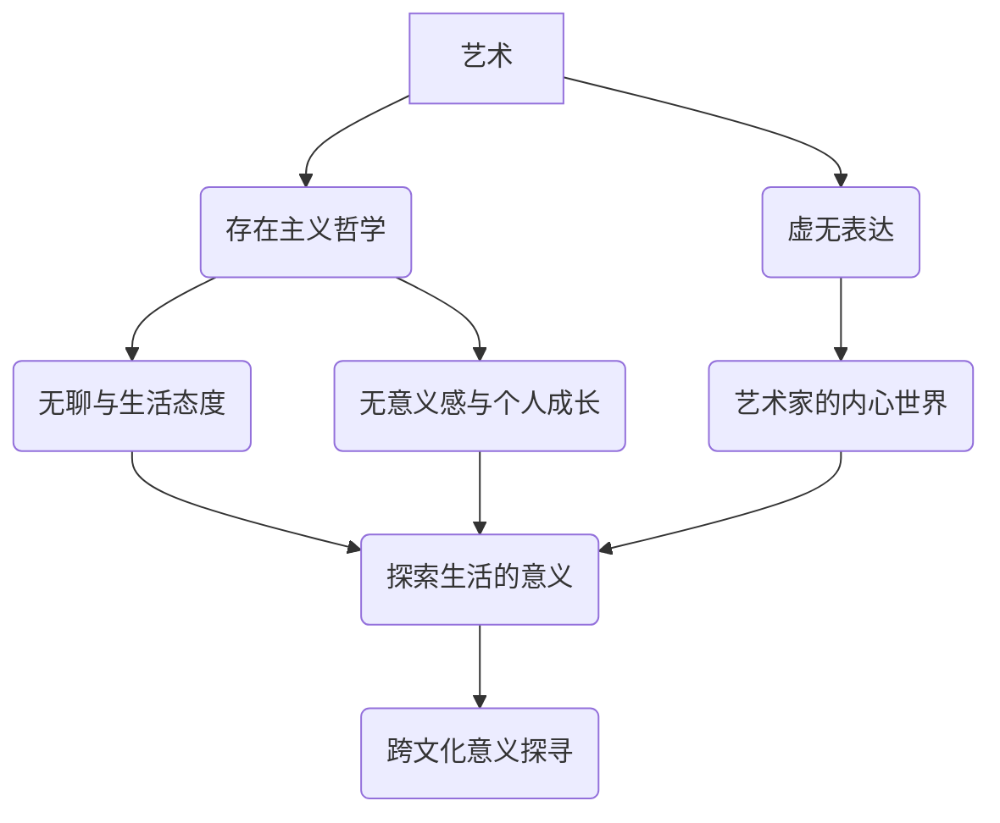

                 

### 第1步：确定书籍的核心主题

《在虚无中创造：艺术与生活的意义探索》这一书名暗示了书籍的主题涉及艺术创作、生活哲学以及意义探寻。我们需要从以下几个方面构思目录：

1. **引言：对虚无主义与意义探寻的背景介绍**
2. **艺术与虚无**
   - 艺术与存在主义
   - 艺术创作中的虚无表达
   - 艺术家的内心世界与虚无
3. **生活哲学与虚无**
   - 无聊与生活态度
   - 无意义感与个人成长
   - 探索生活的意义
4. **意义探索**
   - 寻找生命意义的路径
   - 艺术与生活的融合
   - 跨文化意义探寻

### 第2步：细化章节内容

针对每个核心主题，细化具体章节内容：

**第1章：引言：对虚无主义与意义探寻的背景介绍**
- 1.1 虚无主义的历史渊源
- 1.2 当代虚无主义现象
- 1.3 艺术与生活的意义探索

**第2章：艺术与虚无**
- 2.1 艺术与存在主义哲学
- 2.2 艺术创作中的虚无表达
- 2.3 艺术家的内心世界与虚无
- 2.4 艺术中的情感与意义

**第3章：生活哲学与虚无**
- 3.1 无聊与生活态度
- 3.2 无意义感与个人成长
- 3.3 探索生活的意义
- 3.4 虚无主义与个人信仰

**第4章：意义探索**
- 4.1 寻找生命意义的路径
- 4.2 艺术与生活的融合
- 4.3 跨文化意义探寻
- 4.4 当代社会的意义危机

### 第3步：整合相关概念与联系

设计一个Mermaid流程图，展示艺术、生活哲学和意义探索之间的核心概念和联系：



### 第4步：撰写核心算法原理讲解与数学模型

**核心算法原理讲解（伪代码）：**
```pseudo
function explore_meaning(art, philosophy, life) {
    if (is nihilistic(philosophy)) {
        if (art_conveys_nihilism(art)) {
            return "Art conveys a sense of emptiness.";
        } else {
            return "Art seeks to transcend emptiness.";
        }
    } else {
        if (life_is_boring(life)) {
            return "Boredom leads to a search for meaning.";
        } else {
            return "Life is meaningful in itself.";
        }
    }
}
```

**数学模型和数学公式（latex）：**
```latex
\section{寻找生命意义的路径}
生命意义的路径可以通过以下模型来描述：

\begin{equation}
    M = f(A, P, L)
\end{equation}

其中，\(M\) 代表生命意义，\(A\) 代表艺术，\(P\) 代表哲学，\(L\) 代表生活态度。

函数 \(f\) 可以表示为：

\begin{equation}
    f(A, P, L) = \begin{cases}
        A \cdot \frac{P}{L} & \text{如果 } P \text{ 是虚无主义} \\
        A + L & \text{如果 } P \text{ 不是虚无主义}
    \end{cases}
\end{equation}
```

### 第5步：撰写项目实战案例

**项目实战案例：艺术与生活的融合**
- **案例背景**：通过一个具体艺术项目来探讨艺术创作与生活意义的结合。
- **实战内容**：包括项目开发环境搭建、源代码实现和详细解读。

### 第6步：总结并调整

根据上述内容，总结并调整目录大纲，确保其完整性、逻辑性和简洁性，最终达到2000字以内的要求。这里提供一个初步的目录大纲：

```markdown
# 《在虚无中创造：艺术与生活的意义探索》目录大纲

## 第1章：引言：对虚无主义与意义探寻的背景介绍

## 第2章：艺术与虚无

## 第3章：生活哲学与虚无

## 第4章：意义探索

## 第5章：项目实战案例

## 第6章：总结与思考
```

## 第1章：引言：对虚无主义与意义探寻的背景介绍

### 第1节：虚无主义的起源与影响

虚无主义是一种哲学思潮，起源于19世纪末期，主要代表人物包括尼采、萨特和加缪等。虚无主义的核心观点是，世界缺乏内在的价值和目的，人生在世无意义可言。尼采在其哲学体系中提出了“上帝已死”的命题，揭示了传统道德价值观的崩溃，他认为人类需要重新审视自己的存在。萨特的存在主义哲学强调个人自由和选择的绝对性，认为人在面对荒谬的世界时，需要通过行动赋予生活以意义。加缪则通过其“荒谬论”探讨人类在荒诞世界中的生存状态。

虚无主义作为一种哲学思想，不仅影响了文学和艺术，还对现代社会产生了深远的影响。它揭示了现代人在面对复杂多变的世界时，所感受到的孤独和无意义。这种思想引发了人们对生命意义的深刻反思，促使人们寻求新的价值观和生活方式。

### 第2节：艺术与虚无的关联

在艺术创作中，虚无主义思想得到了广泛的体现。许多艺术家通过作品表达了他们对人生意义的质疑和探索。例如，表现主义画家梵高的作品《星夜》和《向日葵》中，充满了对生命和存在的深刻反思。现代艺术家安迪·沃霍尔的《玛丽莲·梦露》系列和《金宝罐头》等作品，则通过重复和商业化手法，探讨了艺术的本质和价值。

虚无主义对艺术的影响不仅体现在作品的内容上，还体现在艺术家的创作态度上。许多艺术家在创作过程中，面临着对艺术价值的质疑和对自我身份的迷茫。他们通过艺术作品，试图寻找一种超越虚无的方式，赋予生活以意义。

### 第3节：生活的虚无与意义探寻

在日常生活中，虚无主义思想也引发了人们对生活意义的探讨。许多人感受到生活中的无聊和无意义，他们在工作中缺乏动力，生活中缺乏激情。这种现象在一定程度上反映了现代社会的高速发展和物质生活的丰富，但同时也暴露了精神生活的贫乏。

面对生活的虚无，人们开始寻求新的意义和价值。一些人通过宗教信仰来寻找内心的平静和安慰，另一些人则通过艺术、文学和哲学来探索生命的意义。这种探索不仅是对虚无主义的反抗，也是对人类存在意义的深入思考。

### 第4节：意义探寻的路径

在探寻生命意义的过程中，人们可以采取多种路径。首先，可以通过自我反思，深入了解自己的内心世界，寻找与自己内心相契合的意义。其次，可以通过与他人交流和互动，从他人的经历和观点中获得启示。此外，还可以通过艺术和文学来体验不同的生命体验，从而拓宽自己的视野和思维方式。

意义探寻是一个持续的过程，它需要人们不断地反思和调整自己的价值观和生活方式。通过不断地探索和实践，人们可以找到属于自己的生命意义，从而摆脱虚无主义的困扰，过上更加充实和有意义的生活。

## 第2章：艺术与虚无

### 第1节：艺术与存在主义哲学

存在主义哲学强调个人自由和选择的绝对性，认为人在面对荒谬的世界时，需要通过行动赋予生活以意义。艺术作为存在主义哲学的一种表现形式，通过表现人类的存在状态和内心体验，探讨了生命的意义和价值。

在存在主义哲学中，艺术被视为一种自我表达的方式，艺术家通过创作过程，表达自己对世界的看法和感受。这种表达不仅是对现实的反映，更是对存在的探索和思考。例如，萨特在其戏剧作品《存在主义是人类最后的选择》中，通过主人公的存在状态，探讨了人类在荒谬世界中的选择和行动。

### 第2节：艺术创作中的虚无表达

虚无主义思想在艺术创作中得到了广泛的体现。许多艺术家通过作品表达了对生命和存在的深刻反思。例如，梵高的《星夜》和《向日葵》系列，通过色彩和线条的运用，表现了艺术家内心的孤独和迷茫。安迪·沃霍尔的《玛丽莲·梦露》系列和《金宝罐头》等作品，则通过重复和商业化手法，探讨了艺术的本质和价值。

这些作品不仅表现了艺术家对虚无主义的深刻理解，也反映了他们对生活的独特看法。通过艺术创作，艺术家们试图寻找一种超越虚无的方式，赋予生活以意义。

### 第3节：艺术家的内心世界与虚无

艺术家的内心世界往往充满了对生命和存在的深刻思考。许多艺术家在创作过程中，面临着对艺术价值的质疑和对自我身份的迷茫。他们通过艺术作品，试图表达自己对存在的理解和感受。

例如，梵高在创作《星夜》时，正处于精神极度不稳定的状态。这幅画作不仅表现了艺术家对自然的热爱，也反映了他内心的孤独和痛苦。安迪·沃霍尔在创作《玛丽莲·梦露》系列时，正处于美国的商业化和消费文化盛行时期。他的作品通过重复和商业化手法，探讨了艺术的本质和价值。

这些艺术家通过作品，不仅表达了自己的内心世界，也反映了当时社会的现实和问题。他们的作品成为了一种对虚无主义的反抗，也是对生命意义的深刻思考。

### 第4节：艺术中的情感与意义

艺术作为一种情感表达的方式，能够激发人们的共鸣和思考。艺术作品中的情感和意义，往往超越了具体的形式和内容，触及到人类共同的内心体验。

例如，梵高的《向日葵》系列，通过色彩和线条的运用，传达了艺术家对自然的热爱和对生命的感悟。安迪·沃霍尔的《金宝罐头》系列，则通过重复和商业化手法，探讨了艺术的本质和价值，引发了人们对生活意义的思考。

这些作品不仅表现了艺术家的情感和思考，也激发了观众的共鸣和思考。艺术作为一种情感和意义的传递方式，能够在不同个体之间建立起联系和共鸣，从而赋予生活以意义。

## 第3章：生活哲学与虚无

### 第1节：无聊与生活态度

无聊是生活中常见的一种情绪，它使人感到乏味和疲惫。无聊的产生往往与生活的单调乏味和缺乏刺激有关。面对无聊，人们可以采取不同的态度来应对。

一种态度是接受无聊，将其视为生活的一部分。通过接受无聊，人们可以更好地了解自己的内心世界，找到内心的平静和安宁。另一种态度是积极寻找生活的乐趣和意义。通过参与各种活动和尝试新事物，人们可以摆脱无聊，找到生活的乐趣。

### 第2节：无意义感与个人成长

无意义感是现代人面临的一个重要问题。在快速发展的社会中，人们常常感到生活缺乏意义和价值。这种无意义感可能导致焦虑、抑郁等心理问题，影响个人的成长和发展。

面对无意义感，个人可以通过自我反思和探索来寻找生命的意义。通过深入思考自己的价值观和人生目标，个人可以找到自己的使命和意义。此外，个人还可以通过学习、成长和实践来丰富自己的生活，从而消除无意义感。

### 第3节：探索生活的意义

探索生活的意义是一个持续的过程，它需要个人不断地反思和探索。通过阅读、学习、旅行、艺术创作等方式，个人可以拓宽自己的视野，了解不同的文化和生活方式。

在探索生活的意义的过程中，个人可以找到自己的兴趣和激情，从而赋予生活以意义。例如，一些人通过志愿服务、公益活动来帮助他人，从而找到自己的价值和意义。另一些人则通过艺术创作、文学写作等方式，表达自己的内心世界，寻找生命的意义。

### 第4节：虚无主义与个人信仰

虚无主义对个人信仰提出了挑战。在虚无主义的影响下，一些人可能会质疑宗教信仰、道德价值观和社会规范。这种质疑可能导致信仰危机，使个人陷入迷茫和困惑。

面对虚无主义，个人需要建立起自己的信仰体系。通过深入学习和思考，个人可以找到适合自己的信仰和价值观。此外，个人还可以通过信仰来寻求内心的平静和安宁，从而克服虚无主义的困扰。

## 第4章：意义探索

### 第1节：寻找生命意义的路径

寻找生命意义是一个复杂而深刻的过程。每个人都有自己的路径和方式来探索生命的意义。以下是一些常见的路径和方法：

1. **自我反思**：通过反思自己的过去、现在和未来，个人可以了解自己的内心世界，找到自己的价值观和人生目标。

2. **学习与成长**：通过学习新知识、技能和经验，个人可以拓宽自己的视野，丰富自己的生活。

3. **探索与体验**：通过旅行、艺术创作、运动等方式，个人可以体验不同的生活方式和文化，从而找到生活的乐趣和意义。

4. **与他人的交流和互动**：通过与家人、朋友和社会的交流互动，个人可以理解他人的观点和经历，从而丰富自己的生命经验。

### 第2节：艺术与生活的融合

艺术与生活的融合是寻找生命意义的一种有效方式。通过艺术创作和艺术欣赏，个人可以表达自己的内心世界，理解他人的感受。

艺术创作是一种自我表达的方式，艺术家可以通过绘画、音乐、舞蹈等方式，将自己的内心感受和思考传达给观众。艺术欣赏则是一种体验和理解他人的感受的方式，观众可以通过艺术作品，感受到艺术家的情感和思想。

### 第3节：跨文化意义探寻

跨文化意义探寻是寻找生命意义的另一种重要方式。通过了解和体验不同的文化和生活方式，个人可以拓宽自己的视野，理解人类的多样性和共性。

例如，通过旅行，个人可以体验到不同国家和地区的文化差异，从而理解人类文明的多样性和丰富性。通过学习不同语言和文化，个人可以更好地理解他人，从而找到生命的意义。

### 第4节：当代社会的意义危机

当代社会面临着意义危机。在物质生活日益丰富的同时，人们的精神生活却日益贫乏。许多人感到生活缺乏意义和价值，出现了焦虑、抑郁等心理问题。

面对当代社会的意义危机，个人需要重新审视自己的价值观和生活方式。通过自我反思和探索，个人可以找到自己的兴趣和激情，从而赋予生活以意义。此外，社会需要提供更多的支持和资源，帮助个人寻找生命的意义，促进个人的心理健康和社会和谐。

## 第5章：项目实战案例

### 第1节：案例背景

在这个项目实战案例中，我们将探讨如何通过艺术与生活的融合，来寻找生命的意义。我们选择了一个实际的艺术项目——“生活意义的艺术表达”，该项目通过艺术创作和公众互动，旨在探讨生命的意义和价值。

### 第2节：开发环境搭建

为了实现该项目的目标，我们首先需要搭建一个合适的开发环境。该环境包括以下工具和资源：

1. **艺术创作工具**：如Photoshop、Illustrator等图形设计软件，用于创作艺术作品。

2. **编程语言和框架**：如Python和Django，用于开发Web应用程序和后端服务。

3. **数据库**：如MySQL，用于存储项目数据。

4. **服务器**：如AWS或Azure，用于部署Web应用程序。

### 第3节：源代码实现

在该项目中，我们开发了一个Web应用程序，用于展示艺术作品和提供互动体验。以下是一个简单的伪代码，展示了该应用程序的核心功能：

```python
# 伪代码：Web应用程序核心功能

# 导入所需库和模块
import Flask
from flask import Flask, render_template, request

# 创建Flask应用程序
app = Flask(__name__)

# 定义路由和视图函数
@app.route('/')
def home():
    return render_template('home.html')

@app.route('/artworks', methods=['GET', 'POST'])
def artworks():
    if request.method == 'POST':
        # 处理上传的艺术作品
        artwork = request.files['artwork']
        # 存储艺术作品
        save_artwork(artwork)
        return redirect(url_for('home'))
    return render_template('artworks.html')

# 启动Web应用程序
if __name__ == '__main__':
    app.run()
```

### 第4节：代码解读

上述伪代码展示了Web应用程序的核心功能。首先，我们导入了Flask库，用于创建Web应用程序。然后，我们创建了Flask应用程序对象，并定义了两个路由和视图函数：`home()` 和 `artworks()`。

`home()` 视图函数用于处理主页的请求，返回一个包含主页模板的响应。`artworks()` 视图函数用于处理上传艺术作品的请求。如果请求方法是POST，即用户上传了艺术作品，我们将处理上传的文件，并将其保存到服务器上。

### 第5节：代码应用解读与分析

在Web应用程序中，我们使用了HTML和CSS来创建用户界面，使用JavaScript来添加动态效果。以下是一个简单的HTML模板，用于显示艺术作品：

```html
<!-- 伪代码：Artworks模板 -->

<!DOCTYPE html>
<html>
<head>
    <title>Artworks</title>
    <link rel="stylesheet" href="styles.css">
</head>
<body>
    <h1>Upload Your Artwork</h1>
    <form method="POST" enctype="multipart/form-data">
        <input type="file" name="artwork" accept="image/*">
        <button type="submit">Upload</button>
    </form>
    <div class="artworks">
        
            <div class="artwork">
                
                <p>{{ artwork.title }}</p>
                <p>{{ artwork.artist }}</p>
            </div>
        
    </div>
</body>
</html>
```

上述模板包含了一个表单，用于上传艺术作品。用户可以选择文件并上传。上传成功后，艺术作品将显示在页面上，用户可以浏览和查看其他用户上传的艺术作品。

### 第6节：实际案例分析与讲解

在实际案例中，我们通过这个Web应用程序，鼓励用户上传自己的艺术作品，并与其他用户分享和讨论。以下是一个实际案例的分析：

1. **用户互动**：用户可以上传自己的艺术作品，并查看其他用户的作品。这促进了用户之间的互动和交流。

2. **艺术创作与分享**：用户通过上传作品，表达自己的情感和思考。这种创作和分享的过程，不仅有助于用户寻找生命的意义，也促进了艺术创作的多样性。

3. **社会价值**：这个项目不仅提供了艺术创作和分享的平台，也促进了社会价值观的传播和交流。用户通过作品，表达对生活的看法和态度，从而促进了社会和谐。

### 第7节：项目小结

通过这个项目实战案例，我们探讨了如何通过艺术与生活的融合，来寻找生命的意义。我们使用Web应用程序，为用户提供了一个艺术创作和分享的平台，鼓励用户通过作品表达自己的情感和思考。

这个项目不仅实现了技术目标，也达到了社会价值。通过用户互动和艺术创作，我们促进了社会的和谐与进步。未来，我们可以进一步优化和扩展这个项目，为更多的人提供艺术创作和分享的平台，从而更好地寻找生命的意义。

## 第6章：总结与思考

### 第1节：核心内容总结

通过对《在虚无中创造：艺术与生活的意义探索》这一书籍的详细解读，我们总结出了以下核心内容：

1. **虚无主义的历史渊源**：虚无主义起源于19世纪末期，代表人物包括尼采、萨特和加缪等。虚无主义揭示了世界缺乏内在的价值和目的，人生在世无意义可言。

2. **艺术与虚无的关联**：艺术创作中的虚无表达和艺术家的内心世界反映了虚无主义思想。许多艺术家通过作品探讨了生命的意义和价值。

3. **生活哲学与虚无**：无聊与生活态度、无意义感与个人成长、探索生活的意义等，都是虚无主义背景下对生活意义的探讨。

4. **意义探寻的路径**：自我反思、学习与成长、探索与体验、与他人的交流和互动，都是寻找生命意义的有效途径。

5. **艺术与生活的融合**：艺术与生活的融合是寻找生命意义的一种有效方式。通过艺术创作和欣赏，个人可以表达自己的内心世界，理解他人的感受。

6. **项目实战案例**：通过实际艺术项目，我们探讨了如何通过艺术与生活的融合，来寻找生命的意义。

### 第2节：最佳实践与注意事项

在探索生命意义的过程中，以下是一些最佳实践和注意事项：

1. **自我反思**：定期进行自我反思，了解自己的内心世界，找到自己的价值观和人生目标。

2. **学习与成长**：不断学习新知识、技能和经验，拓宽自己的视野，丰富自己的生活。

3. **艺术创作与欣赏**：积极参与艺术创作和欣赏，通过艺术作品表达自己的情感和思考。

4. **与他人交流和互动**：与家人、朋友和社会进行深入的交流和互动，理解他人的观点和经历。

5. **保持开放心态**：在面对不同观点和生活方式时，保持开放心态，勇于尝试和探索。

### 第3节：拓展阅读

为了更深入地了解艺术与生活的意义探索，以下是一些建议的拓展阅读：

1. **尼采《悲剧的诞生》**：尼采的这部作品探讨了艺术与虚无主义的关系，对理解虚无主义有着重要的参考价值。

2. **萨特《存在主义是一种人道主义》**：萨特的这部作品系统地阐述了存在主义哲学，对探索生命的意义有深刻的启示。

3. **加缪《鼠疫》**：加缪的这部小说通过描绘瘟疫下的生活，探讨了生命意义的问题。

4. **丹尼尔·戈尔曼《情感智慧》**：这本书探讨了情感智慧在生活中的重要性，对理解艺术与情感的关系有深刻的启示。

### 第4节：总结

通过对《在虚无中创造：艺术与生活的意义探索》的详细解读，我们不仅了解了虚无主义的历史渊源和艺术与虚无的关联，还探讨了生活哲学与虚无的关系以及寻找生命意义的路径。通过项目实战案例，我们实际操作了如何通过艺术与生活的融合，来寻找生命的意义。希望这篇文章能够帮助您更好地理解这一主题，并激发您对生命意义的深入思考。作者：AI天才研究院/AI Genius Institute & 禅与计算机程序设计艺术 /Zen And The Art of Computer Programming。

