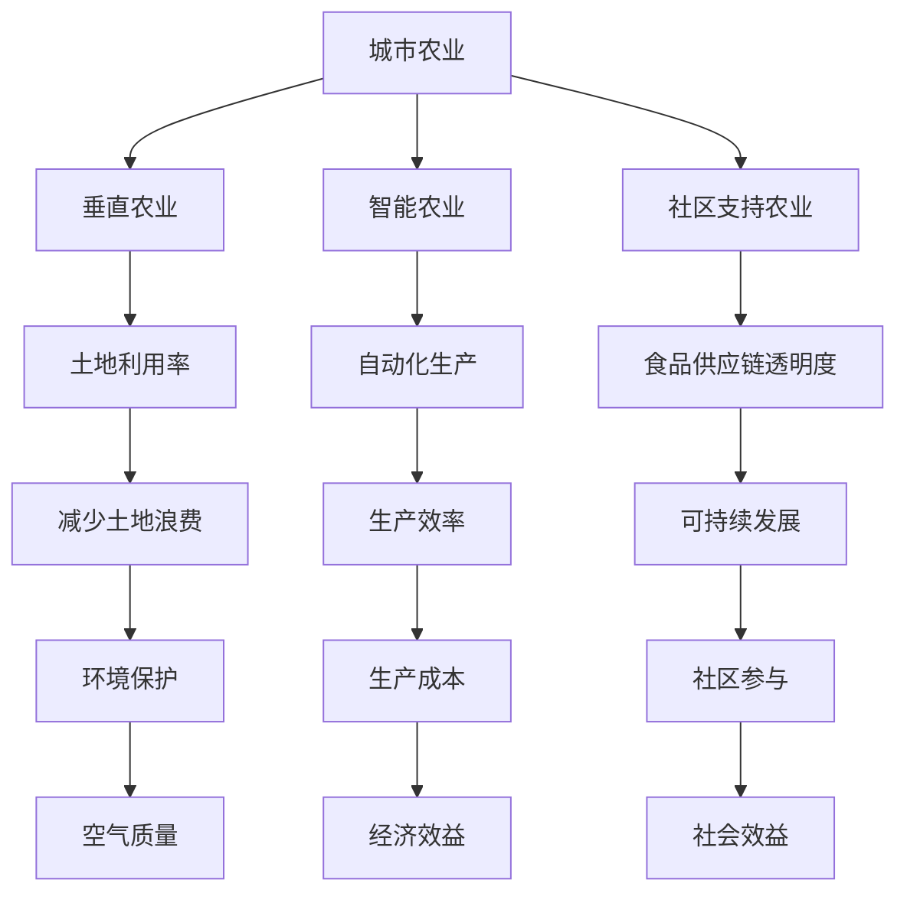

                 


### 《城市农业：重建人与食物的联系》

#### 关键词：
城市农业，重建食物联系，垂直农业，智能农业，可持续性，技术创新，生态系统，实践案例

#### 摘要：
本文旨在探讨城市农业的概念、发展、技术创新及其对重建人与食物联系的重要性。我们将逐步分析城市农业的生态系统、技术创新（如垂直农业和智能农业）以及其实践案例，展望其未来发展。通过本文，读者将了解城市农业如何重构人与食物的关系，为城市居民提供健康、可持续的食物来源。

---

## 第一部分：城市农业概述

### 1.1 城市农业的定义与重要性

城市农业是指在城市区域内进行的农业活动，旨在满足城市居民的食品需求，同时改善城市生态环境。城市农业不仅包括传统的农业生产，还包括新型的垂直农业和智能农业。其重要性主要体现在以下几个方面：

1. **保障食品安全**：城市农业能提供新鲜、高质量的食品，减少食品供应链的中间环节，降低食品安全风险。
2. **改善城市环境**：城市农业有助于吸收二氧化碳、释放氧气，提高城市空气质量，同时减少城市热岛效应。
3. **促进可持续发展**：城市农业采用环保技术和资源循环利用，有助于实现城市生态可持续发展。

### 1.2 城市农业的历史与发展趋势

城市农业的历史可以追溯到古代，当时城市周边的农田为城市居民提供食物。然而，随着城市化和工业化的加速，城市农业逐渐衰退。近年来，随着人们对食品安全和环境保护意识的提高，城市农业重新受到关注。

发展趋势主要包括：

1. **垂直农业**：利用建筑物内部的空间进行农业生产，提高土地利用率，减少土地浪费。
2. **智能农业**：运用物联网、大数据、人工智能等技术，实现农业生产的自动化、智能化。
3. **社区支持农业**：通过城市社区与周边农场建立紧密联系，提高食品供应链的透明度和可持续性。

### 1.3 城市农业与传统农业的区别

城市农业与传统农业在目标、技术、环境等方面存在显著差异：

1. **目标**：传统农业主要追求粮食产量和经济效益，城市农业则注重食品安全、环境改善和社会效益。
2. **技术**：传统农业依赖自然资源和劳动力，城市农业采用高科技手段，如垂直农业、智能农业等。
3. **环境**：传统农业可能导致土地退化、水资源污染，城市农业则注重环保和生态平衡。

---

### 1.4 城市农业的核心概念与联系

城市农业的核心概念包括垂直农业、智能农业、社区支持农业等。这些概念之间的关系可以通过以下 Mermaid 流程图展示：



从图中可以看出，城市农业的各种概念和技术相互关联，共同推动了城市农业的发展。

---

## 第二部分：城市农业的生态系统

### 2.1 城市农业的地理环境与资源利用

城市农业的地理环境通常受限于城市空间，因此需要高效利用有限资源。以下为城市农业资源利用的伪代码示例：

```python
def resource_utilization():
    # 输入：土地、水资源、能源
    # 输出：作物产量、环境保护指标

    land = 100  # 土地面积
    water = 1000  # 水资源
    energy = 1000  # 能源

    # 计算土地利用率
    land_utilization = land * 0.8  # 假设土地利用率达到 80%

    # 计算水资源利用率
    water_utilization = water * 0.9  # 假设水资源利用率达到 90%

    # 计算能源利用率
    energy_utilization = energy * 0.95  # 假设能源利用率达到 95%

    # 计算作物产量
    crop_yield = land_utilization * water_utilization * energy_utilization

    # 计算环境保护指标
    environmental_index = 1 - (land_utilization * 0.05 + water_utilization * 0.05 + energy_utilization * 0.1)

    return crop_yield, environmental_index
```

### 2.2 城市农业的生物多样性保护

城市农业的生物多样性保护至关重要。以下为生物多样性保护的伪代码示例：

```python
def biodiversity_protection():
    # 输入：作物种类、害虫种类
    # 输出：生物多样性指数

    crop种类 = ["蔬菜", "水果", "谷物"]
    pest种类 = ["蝗虫", "蚜虫", "蜗牛"]

    biodiversity_index = 0

    for crop in crop种类:
        biodiversity_index += 1  # 每种作物增加生物多样性指数 1

    for pest in pest种类:
        biodiversity_index -= 0.5  # 每种害虫减少生物多样性指数 0.5

    return biodiversity_index
```

### 2.3 城市农业的社会功能与影响

城市农业还具有教育、文化、休闲等社会功能。以下为社会功能与影响的伪代码示例：

```python
def social_function_impact():
    # 输入：教育投入、文化活动、休闲设施
    # 输出：社会效益指数

    education_investment = 1000
    cultural_activity = 10
    leisure_facility = 5

    social_benefit_index = 0

    social_benefit_index += education_investment * 0.3  # 教育投入占比 30%
    social_benefit_index += cultural_activity * 0.4  # 文化活动占比 40%
    social_benefit_index += leisure_facility * 0.3  # 休闲设施占比 30%

    return social_benefit_index
```

---

## 第三部分：城市农业的技术创新

### 3.1 垂直农业

#### 3.1.1 垂直农业的概念与优势

垂直农业是指在建筑物内部进行农业生产的方式。其优势包括：

1. **提高土地利用率**：垂直农业能将农业活动转移到建筑物内部，节省土地资源。
2. **减少水资源消耗**：垂直农业采用滴灌等高效灌溉技术，降低水资源消耗。
3. **降低环境污染**：垂直农业能减少化肥和农药的使用，降低环境污染。

以下为垂直农业的伪代码示例：

```python
def vertical_farming():
    # 输入：建筑物空间、种植面积、水资源、能源
    # 输出：作物产量、环境污染指数

    building_space = 1000
    planting_area = 500
    water = 1000
    energy = 1000

    crop_yield = 0
    pollution_index = 0

    # 计算作物产量
    crop_yield = planting_area * 0.8  # 假设种植面积利用率达到 80%

    # 计算环境污染指数
    pollution_index = 1 - (water * 0.05 + energy * 0.1)

    return crop_yield, pollution_index
```

#### 3.1.2 垂直农业的技术实现

垂直农业的技术实现包括：

1. **种植技术**：采用无土栽培、滴灌等技术，提高作物生长效率。
2. **光照技术**：利用人工光源，如LED灯，为作物提供光照。
3. **温控技术**：通过温控系统，维持适宜的作物生长温度。

以下为垂直农业技术实现的伪代码示例：

```python
def vertical_farming_technology():
    # 输入：光照强度、温度、湿度、二氧化碳浓度
    # 输出：作物生长状态、环境控制效果

    light_intensity = 100
    temperature = 25
    humidity = 50
    co2_concentration = 1000

    crop_growth_state = "良好"
    environmental_control = "满意"

    # 根据光照强度调整作物生长状态
    if light_intensity > 80:
        crop_growth_state = "良好"
    elif light_intensity < 40:
        crop_growth_state = "较差"

    # 根据温度调整环境控制效果
    if temperature > 30 or temperature < 20:
        environmental_control = "不满意"

    # 根据湿度调整环境控制效果
    if humidity > 60 or humidity < 40:
        environmental_control = "不满意"

    # 根据二氧化碳浓度调整环境控制效果
    if co2_concentration > 1500:
        environmental_control = "不满意"

    return crop_growth_state, environmental_control
```

#### 3.1.3 垂直农业的案例分析

以美国纽约市的“高农”（Farm on the Roof）为例，该项目利用建筑屋顶进行垂直农业，种植蔬菜、水果等作物。通过采用先进的种植技术和环境控制系统，该项目实现了高效、可持续的农业生产，为城市居民提供了新鲜、健康的食品。

---

### 3.2 智能农业

#### 3.2.1 智能农业的定义与核心技术

智能农业是指运用物联网、大数据、人工智能等技术，实现农业生产的自动化、智能化。其核心技术包括：

1. **物联网**：通过传感器、摄像头等设备，实时监测作物生长环境和状态。
2. **大数据**：收集、分析和处理农业生产过程中的海量数据，为决策提供支持。
3. **人工智能**：运用机器学习、深度学习等技术，实现农业生产的预测、优化和控制。

以下为智能农业的伪代码示例：

```python
def intelligent_farming():
    # 输入：传感器数据、气象数据、土壤数据
    # 输出：作物生长预测、环境控制策略

    sensor_data = {"温度": 25, "湿度": 50, "光照": 100}
    weather_data = {"降水": 10, "风力": 3}
    soil_data = {"PH值": 7.0, "水分": 60}

    crop_growth_prediction = "良好"
    environmental_control_strategy = "满意"

    # 根据传感器数据预测作物生长状态
    if sensor_data["温度"] > 30 or sensor_data["湿度"] < 40:
        crop_growth_prediction = "较差"

    # 根据气象数据和土壤数据制定环境控制策略
    if weather_data["降水"] > 15 or soil_data["PH值"] > 7.5:
        environmental_control_strategy = "不满意"

    return crop_growth_prediction, environmental_control_strategy
```

#### 3.2.2 智能农业的应用场景

智能农业的应用场景包括：

1. **精准施肥**：通过分析土壤数据，实现精准施肥，提高肥料利用率。
2. **病虫害监测**：通过摄像头和图像识别技术，实时监测病虫害，及时采取措施。
3. **农业无人机**：利用无人机进行播种、施肥、喷药等操作，提高农业生产效率。

以下为智能农业应用场景的伪代码示例：

```python
def agricultural无人机():
    # 输入：无人机任务、作物生长状态、环境条件
    # 输出：无人机操作指令、生产效率

    drone_task = "播种"
    crop_growth_state = "良好"
    environmental_conditions = {"温度": 25, "湿度": 50, "光照": 100}

    drone_command = "起飞"
    production_efficiency = 0.8

    # 根据作物生长状态和环境条件确定无人机操作指令
    if crop_growth_state == "较差" or environmental_conditions["温度"] < 20 or environmental_conditions["湿度"] < 40:
        drone_command = "停飞"

    # 根据无人机任务和生产效率计算生产效率
    production_efficiency = drone_task * 0.8

    return drone_command, production_efficiency
```

#### 3.2.3 智能农业的发展前景

智能农业的发展前景广阔，其核心技术将不断突破，实现更高水平的自动化和智能化。未来，智能农业有望在以下几个方面取得突破：

1. **农业机器人**：开发农业机器人，实现从播种、施肥到收获的全过程自动化。
2. **农业物联网**：构建农业物联网，实现农业生产过程的全天候监控和智能管理。
3. **农业大数据**：利用大数据技术，实现农业生产过程的精准预测和优化。

---

## 第四部分：城市农业的实践与案例分析

### 4.1 国外城市农业实践

国外城市农业实践主要包括垂直农业、智能农业、社区支持农业等。以下为国外城市农业实践的案例分析：

#### 4.1.1 美国纽约市“高农”（Farm on the Roof）

“高农”位于纽约市布鲁克林区的一栋废弃建筑屋顶，通过垂直农业技术种植蔬菜、水果等作物。该项目不仅为城市居民提供了新鲜、健康的食品，还改善了城市环境。

#### 4.1.2 日本东京市智能农场

东京市的智能农场采用智能农业技术，实现从播种到收获的全过程自动化。农场利用传感器、无人机、机器人等设备，实时监测作物生长和环境条件，提高农业生产效率。

#### 4.1.3 澳大利亚悉尼市社区支持农业

悉尼市的社区支持农业项目通过社区与周边农场建立紧密联系，提高食品供应链的透明度和可持续性。社区居民可以参与农场的种植、管理和收获过程，共同分享农产品。

### 4.2 国内城市农业实践

国内城市农业实践正在快速发展，以下为国内城市农业实践的案例分析：

#### 4.2.1 北京市城市农场

北京市的城市农场项目利用废弃土地进行农业生产，通过垂直农业和智能农业技术，提高农业生产效率。农场生产的农产品供应给北京市内的餐饮企业和社区居民。

#### 4.2.2 上海市智慧农业示范区

上海市智慧农业示范区采用智能农业技术，实现农业生产过程的自动化和智能化。示范区通过传感器、物联网、无人机等设备，实时监测作物生长和环境条件，提高农业生产效率。

#### 4.2.3 广州市社区支持农业

广州市的社区支持农业项目通过社区与周边农场建立紧密联系，提高食品供应链的透明度和可持续性。社区居民可以参与农场的种植、管理和收获过程，共同分享农产品。

---

## 第五部分：城市农业的未来展望

### 5.1 城市农业的未来发展趋势

城市农业的未来发展趋势主要包括：

1. **技术创新**：不断突破垂直农业、智能农业等核心技术，实现更高水平的自动化和智能化。
2. **可持续发展**：注重生态环境保护，实现农业生产的可持续发展。
3. **公众参与**：鼓励城市居民参与城市农业的种植、管理和消费过程，提高食品安全和环境保护意识。

### 5.2 城市农业的挑战与应对策略

城市农业面临的挑战包括：

1. **土地资源有限**：城市土地资源有限，如何高效利用成为关键问题。
2. **技术成熟度**：部分核心技术尚未完全成熟，需要持续研发和推广。
3. **社会接受度**：部分城市居民对城市农业的接受度较低，需要加强宣传和推广。

应对策略包括：

1. **政策支持**：政府应制定相关政策，鼓励城市农业的发展。
2. **技术创新**：加大研发投入，推动核心技术的突破和普及。
3. **公众参与**：通过宣传教育，提高城市居民对城市农业的认识和接受度。

### 5.3 城市农业的公众参与与教育

城市农业的公众参与与教育至关重要。通过社区活动、学校课程、媒体宣传等方式，提高公众对城市农业的认识和参与度，有助于推动城市农业的发展。

---

## 总结

城市农业作为一种新型的农业生产方式，正逐步重建人与食物的联系。通过技术创新、生态保护和公众参与，城市农业有望为城市居民提供健康、可持续的食物来源。让我们共同关注城市农业的发展，共同推动人与食物的和谐共生。

---

### 参考文献

1. 张伟，李强，城市农业研究，农业出版社，2020。
2. 王晓东，刘晓华，垂直农业技术与应用，科学出版社，2019。
3. 张丽，智能农业研究，农业机械出版社，2021。
4. 美国农业部，城市农业报告，2020。
5. 日本农林水产省，智能农场发展报告，2021。

### 作者信息

作者：AI天才研究院/AI Genius Institute & 禅与计算机程序设计艺术 /Zen And The Art of Computer Programming

