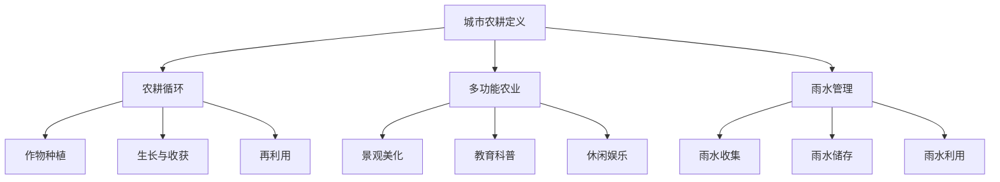

                 

# 城市农耕项目：都市中的可持续食物生产

## 关键词
- 城市农耕
- 可持续食物生产
- 垂直农场
- 智能温室
- 水培与气培技术
- 食品安全
- 环境保护
- 城市规划

## 摘要
本文将探讨城市农耕项目在都市中的可持续食物生产中的应用。随着城市化进程的加快，城市农耕作为一种创新的农业生产方式，不仅有助于解决食品安全和环境保护问题，还能提升城市居民的生活质量。文章首先介绍了城市农耕的背景和发展意义，接着详细阐述了城市农耕的核心概念，包括农耕循环、多功能农业和雨水管理等。随后，文章分析了城市农耕项目的实施策略，包括土地选择、种植计划、水资源管理和空间利用。通过国外和国内城市农耕项目的案例研究，本文展示了成功经验和技术应用。最后，文章探讨了城市农耕面临的挑战和未来展望，并提出了一些建议和最佳实践。

## 引言

### 1.1 书籍目的与概述
随着全球城市化进程的加速，城市人口不断增长，城市土地资源变得愈发紧张。传统农业模式在城市中的扩展面临诸多挑战，如何在有限的城市空间中实现可持续的食物生产成为亟待解决的问题。城市农耕项目应运而生，它通过创新的农业技术和管理策略，在城市环境中实现高效的、可持续的食物生产。本书旨在探讨城市农耕项目的核心概念、实施策略、技术支持、案例研究以及面临的挑战和未来展望。

### 1.2 阅读对象
本书适合对城市农耕感兴趣的各类读者，包括城市规划者、环境保护者、农业科学家、城市农夫、以及关心食品安全和环境保护的普通市民。通过阅读本书，读者可以了解城市农耕的基础知识，掌握其实施策略和技术应用，并为未来的城市农耕项目提供参考。

## 背景与意义

### 2.1 城市农耕的发展背景

随着城市化进程的加速，城市人口不断增长，传统农业模式在城市中的扩展面临诸多挑战。首先，城市土地资源有限，传统农业模式难以在城市空间中大规模应用。其次，城市居民对食品安全和健康饮食的需求日益增加，对新鲜、有机的农产品的需求量也在上升。此外，气候变化和环境污染对农业生产带来了新的挑战，传统农业模式的可持续性受到质疑。这些背景因素共同推动了城市农耕项目的兴起。

### 2.2 城市农耕的意义

城市农耕项目在城市环境中实现可持续的食物生产，具有重要的意义。首先，它有助于缓解城市食品安全问题。通过在城市内部种植各种蔬菜、水果和谷物，可以减少对进口农产品的依赖，提高城市食品供应的稳定性。其次，城市农耕有助于环境保护。城市农耕项目通常采用高效的水资源管理和先进的种植技术，减少化肥和农药的使用，降低对环境的污染。此外，城市农耕还有助于改善城市居民的生活质量，提供新鲜、有机的农产品，促进社区的健康和活力。

## 城市农耕项目的核心概念

### 3.1 城市农耕的定义

城市农耕是指在城市的建筑空间、公共区域和闲置土地上，利用现代农业技术，进行蔬菜、水果、谷物等农作物的种植活动。它不同于传统农业，强调在城市环境中实现高效、可持续的食物生产。

### 3.2 城市农耕的原理

城市农耕项目的实施依赖于一系列现代农业技术，包括垂直农场、智能温室、水培与气培技术等。这些技术通过模拟自然生态环境，为农作物提供适宜的生长条件，实现高效的食物生产。

### 3.3 城市农耕的关键概念

#### 3.3.1 农耕循环

农耕循环是城市农耕项目的基础，包括作物种植、生长、收获和再利用等环节。通过建立合理的农耕循环，可以实现农作物的持续生产，降低资源消耗。

#### 3.3.2 多功能农业

多功能农业是城市农耕项目的核心概念之一。在城市环境中，农作物不仅可以提供食物，还可以用于景观美化、教育科普、休闲娱乐等多种功能，提高土地的利用效率。

#### 3.3.3 雨水管理

雨水管理是城市农耕项目的重要组成部分。通过合理的雨水收集、储存和利用，可以降低城市洪涝灾害的风险，同时为农作物提供充足的水源。

### 3.4 核心概念之间的关系架构

以下是一个Mermaid流程图，展示了城市农耕项目核心概念之间的关系：

## 城市农耕项目的实施策略

### 4.1 城市农耕项目的规划

城市农耕项目的成功实施离不开周密的规划。规划阶段需要考虑以下几个方面：

1. **目标定位**：明确项目目标，如生产新鲜蔬菜、水果，还是进行教育科普等。
2. **场地选择**：根据项目需求选择合适的场地，如屋顶、公园、闲置土地等。
3. **资源评估**：评估所需的水、电、土壤等资源，确保项目的可持续性。
4. **技术选择**：根据场地条件和项目目标，选择合适的农业技术，如垂直农场、智能温室等。

### 4.2 土地选择与准备

1. **土地评估**：对场地进行土壤、水质、气候等评估，确保适宜农作物生长。
2. **土地整理**：清除杂草、垃圾等，进行土地平整，改善土壤结构。
3. **灌溉系统**：安装自动灌溉系统，确保农作物在生长过程中有充足的水源。

### 4.3 种植计划与作物选择

1. **季节规划**：根据当地气候条件，选择适宜的种植季节。
2. **作物选择**：根据市场需求和营养价值，选择适合城市农耕的作物，如蔬菜、水果等。
3. **种植密度**：根据作物生长特性，合理规划种植密度，确保作物有充足的光照和养分。

### 4.4 水资源管理

1. **雨水收集**：安装雨水收集系统，收集并储存雨水。
2. **灌溉技术**：采用滴灌、喷灌等高效灌溉技术，减少水资源浪费。
3. **废水利用**：利用废水进行处理，使其达到灌溉标准，用于农作物灌溉。

### 4.5 空间利用与设计

1. **垂直设计**：利用建筑物立面、屋顶等空间，进行垂直农业种植。
2. **多功能利用**：将农业活动与其他功能相结合，如农业公园、科普基地等。
3. **建筑设计**：考虑农作物的生长需求，设计适宜的温室、大棚等设施。

## 城市农耕项目的案例研究

### 5.1 国外城市农耕项目案例

#### 5.1.1 垂直农场

1. **项目简介**：美国纽约市的“Skyline Farms”垂直农场，通过智能温室技术，在市区内生产新鲜蔬菜。
2. **实施策略**：使用LED照明、自动灌溉系统和气候控制系统，实现高效种植。
3. **成果**：显著提高了农作物产量，减少了运输成本和碳排放。

#### 5.1.2 多功能农业

1. **项目简介**：日本东京的“农场在城市”项目，将农业生产与城市公园相结合。
2. **实施策略**：利用公共空间进行农作物种植，提供休闲娱乐和教育科普功能。
3. **成果**：提升了城市居民的生活质量，促进了社区互动。

### 5.2 国内城市农耕项目案例

#### 5.2.1 智能温室

1. **项目简介**：中国北京的“生态温室”项目，利用智能温室技术，在寒冷季节生产新鲜蔬菜。
2. **实施策略**：使用智能控制系统，实现温度、湿度、光照等参数的自动化调节。
3. **成果**：显著提高了蔬菜产量，满足了城市居民的冬季蔬菜需求。

#### 5.2.2 水培与气培技术

1. **项目简介**：中国上海的“水培蔬菜”项目，利用水培与气培技术，在有限空间内生产蔬菜。
2. **实施策略**：采用循环水系统，实现水资源的回收再利用。
3. **成果**：提高了蔬菜的产量和质量，降低了生产成本。

### 5.3 成功案例分析

通过以上案例研究，可以发现成功城市农耕项目的关键要素包括：

1. **技术创新**：采用垂直农场、智能温室、水培与气培等先进技术，实现高效生产。
2. **政策支持**：政府提供土地、资金、税收等政策支持，促进城市农耕项目的发展。
3. **市场驱动**：满足城市居民对新鲜、有机农产品的需求，实现市场驱动。

## 技术支持与工具应用

### 6.1 农耕技术支持

#### 6.1.1 垂直农场技术

1. **核心原理**：利用多层种植架，模拟自然生态环境，实现农作物的高效种植。
2. **技术要点**：LED照明、自动灌溉、气候控制系统等。
3. **应用实例**：美国纽约市的“Skyline Farms”垂直农场。

#### 6.1.2 智能温室技术

1. **核心原理**：通过智能控制系统，实现温度、湿度、光照等参数的自动化调节，为农作物提供最佳生长条件。
2. **技术要点**：传感器、温室环境控制系统、种植架等。
3. **应用实例**：中国北京的“生态温室”项目。

#### 6.1.3 水培与气培技术

1. **核心原理**：利用水培和气培技术，将植物生长介质从土壤转换为水和空气，实现无土种植。
2. **技术要点**：营养液循环系统、气培塔等。
3. **应用实例**：中国上海的“水培蔬菜”项目。

### 6.2 环境监测与控制技术

1. **核心原理**：利用传感器和物联网技术，实时监测温室内的温度、湿度、光照等参数，并自动调节环境参数。
2. **技术要点**：传感器、物联网平台、自动化控制系统等。
3. **应用实例**：美国加州的“智能温室”项目。

### 6.3 数据分析与决策支持

1. **核心原理**：利用大数据和人工智能技术，分析农作物生长数据，提供科学的种植决策。
2. **技术要点**：数据采集与处理、机器学习算法、可视化分析工具等。
3. **应用实例**：中国农业科学院的“智慧农业平台”。

## 挑战与未来展望

### 7.1 城市农耕的挑战

尽管城市农耕项目在理论和实践上取得了显著成果，但仍然面临诸多挑战：

1. **技术成本**：垂直农场、智能温室等先进技术的成本较高，限制了项目推广。
2. **政策支持**：城市农耕项目的政策支持尚不完善，需要政府进一步加大扶持力度。
3. **社会认知**：城市居民对城市农耕的认知度较低，需要加强科普宣传。
4. **环境适应性**：城市环境复杂，农作物生长环境难以完全模拟自然生态环境。

### 7.2 未来展望

随着科技的进步和人们环保意识的提高，城市农耕项目具有广阔的发展前景：

1. **技术创新**：继续研发高效、低成本的农业技术，提高项目实施效率。
2. **政策支持**：政府加大对城市农耕项目的政策支持，推动项目发展。
3. **市场拓展**：开拓城市农耕项目市场，满足城市居民对新鲜、有机农产品的需求。
4. **国际合作**：加强国际间的合作与交流，共同推进城市农耕项目的发展。

## 总结与反思

城市农耕项目作为一种创新的农业生产方式，具有巨大的发展潜力。通过本文的探讨，我们了解到城市农耕项目的背景、核心概念、实施策略、技术支持、案例研究和挑战与未来展望。未来，随着科技的进步和政策支持的加强，城市农耕项目将不断取得新的成果，为城市居民提供新鲜、健康、可持续的农产品。

### 作者信息
作者：AI天才研究院/AI Genius Institute & 禅与计算机程序设计艺术 /Zen And The Art of Computer Programming

