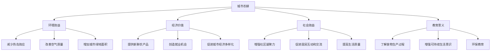

                 


### 摘要

《城市农耕：在混凝土丛林中重建与自然的联系》旨在探讨如何在城市化进程中，通过城市农耕这一创新方式，重新建立人与自然的联系。本文首先分析了城市农耕的兴起背景与现状，揭示了其在城市环境中的重要性。接着，文章深入探讨了城市农耕的实践方法，包括场地选择与规划、技术与方法、植物选择与栽培、社区参与等方面的具体实施步骤。随后，本文从社会影响、发展趋势等方面展望了城市农耕的未来，提出了可能的挑战与解决方案。通过结合实际项目实战和最佳实践，文章不仅为读者提供了城市农耕的全面了解，也为相关领域的研究和实践提供了有力支持。

### 关键词

- 城市农耕
- 城市环境
- 农耕技术
- 社区参与
- 社会影响

## 第一部分：城市农耕的兴起与现状

### 第1章：城市农耕的兴起

#### 1.1 城市农耕的定义与意义

城市农耕，顾名思义，指的是在城市区域进行农耕活动的形式。与传统的农村农耕不同，城市农耕具有独特的地域特征和生态环境。它不仅关注农作物的生产，还强调与城市社区的互动、城市环境的美化和可持续性的提升。

**定义：** 城市农耕是在城市区域，利用各种可用的空间（如屋顶、阳台、公共绿地、废弃地等）进行农耕活动，生产蔬菜、水果、草药等农产品，同时通过社区参与和教育活动，增强城市居民对食物生产的认识和生态意识的培养。

**意义：** 城市农耕对城市和居民都有深远的意义。

1. **环境效益：** 城市农耕能够有效减少城市的热岛效应，改善空气质量，增加城市绿地面积，提升城市生态系统的健康水平。
2. **经济价值：** 城市农耕不仅可以提供新鲜的农产品，还可以创造就业机会，促进城市经济的多样化。
3. **社会效益：** 城市农耕有助于增强社区凝聚力，促进居民之间的互动和交流，提高生活质量。
4. **教育意义：** 通过参与城市农耕活动，居民可以更深入地了解食物的生产过程，增强对可持续生活和环境保护的意识。

#### 1.2 城市农耕的起源与发展

城市农耕并非现代城市特有的现象，其实早在古代，人类就已经在城市中进行农耕活动。例如，古埃及时期，尼罗河流域的城市就利用沼泽地进行了农耕。然而，现代意义上的城市农耕则起源于20世纪末。

**起源：** 20世纪末，随着城市化进程的加快，城市环境问题日益突出，人们开始思考如何在城市中寻找可持续的生活方式。这一时期，城市农耕作为一种创新的生态实践，逐渐引起了关注。

**发展：** 进入21世纪，随着科技的发展和环保意识的提高，城市农耕得到了迅速发展。许多城市开始实施城市农耕项目，如屋顶花园、社区农场、城市农业公园等。这些项目不仅提供了实用的农产品，还成为了城市景观的一部分，提升了城市的生活品质。

#### 1.3 城市农耕在全球的分布

城市农耕在全球范围内都有分布，不同国家和地区根据自己的实际情况，探索适合本地的城市农耕模式。

**发达国家：** 在欧美等发达国家，城市农耕已经成为一种流行的城市生活方式。许多城市都有完善的社区农场和屋顶花园项目，居民广泛参与其中。

**发展中国家：** 在发展中国家，城市农耕则更多地关注于解决城市贫困和食品安全问题。例如，在印度的许多城市，贫民窟居民通过在城市废弃地上进行农耕，解决了自己的生活问题。

**中国：** 中国的城市农耕发展迅速，特别是近年来，随着政府对可持续发展的重视，城市农耕项目在全国各地纷纷启动。许多城市推出了屋顶农场、社区花园等，为居民提供了参与农耕的机会。

#### 1.4 城市农耕的类型与形式

城市农耕可以根据不同的标准进行分类，常见的类型包括：

1. **屋顶农耕：** 利用屋顶空间进行农耕，适合城市中的高层建筑。屋顶农耕不仅可以提供新鲜农产品，还可以降低建筑物的能耗。
2. **社区农耕：** 社区农耕是将农耕活动与社区建设相结合，通过社区居民的参与，共同管理和运营农场。
3. **垂直农耕：** 垂直农耕是在垂直空间中进行的农耕，如多层温室或立体农场。垂直农耕能够最大化利用空间，提高农作物产量。
4. **室内农耕：** 室内农耕利用温室或室内设施进行，可以全年不间断地生产农产品。

**形式：** 城市农耕的形式多种多样，既可以是个人或家庭的小规模农耕，也可以是社区或企业的大规模运营。此外，还有通过电子商务平台进行的城市农耕产品销售，使得农产品能够更便捷地进入市场。

### 总结

城市农耕作为一种创新的生态实践，正逐渐改变着城市的生活方式。它不仅提供了新鲜的农产品，还通过社区参与和环保教育，增强了城市居民对自然的认识和责任感。随着城市化进程的加速，城市农耕有望在全球范围内得到更广泛的应用和发展。

## 核心概念与联系

为了更好地理解城市农耕，我们需要明确几个核心概念，并探讨它们之间的联系。以下是这些概念以及它们之间的关系架构 Mermaid 流程图：



**核心概念解释：**

1. **城市农耕：** 指在城市区域进行农耕活动的形式。
2. **环境效益：** 指城市农耕对城市环境的积极影响，如减少热岛效应、改善空气质量、增加城市绿地面积。
3. **经济价值：** 指城市农耕对城市经济的贡献，如提供新鲜农产品、创造就业机会、促进城市经济多样化。
4. **社会效益：** 指城市农耕对社会带来的好处，如增强社区凝聚力、促进居民互动和交流、提高生活质量。
5. **教育意义：** 指城市农耕对居民教育和意识培养的作用，如了解食物生产过程、增强可持续生活意识、环保教育。

**核心概念之间的关系：**

- **环境效益**、**经济价值**、**社会效益**和**教育意义**是城市农耕的核心组成部分，它们相互关联，共同构成了城市农耕的全面影响。
- **环境效益**直接影响**社会效益**，如改善的空气质量和增加的绿地面积能够提高居民的生活质量，增强社区的凝聚力。
- **经济价值**与**社会效益**密切相关，通过创造就业机会和提供新鲜农产品，城市农耕能够促进城市经济的多样化和提高居民的生活水平。
- **教育意义**不仅对个人有深远影响，也能够提升整个社区对可持续生活和环境保护的意识。

通过上述 Mermaid 流程图，我们可以清晰地看到城市农耕各个核心概念之间的联系，这有助于我们更深入地理解城市农耕的实质和作用。

### 核心算法原理讲解

为了更好地理解城市农耕的算法原理，我们可以从以下几个方面进行探讨：

1. **选址优化算法：** 选择合适的场地进行城市农耕是成功的关键。常用的选址优化算法包括遗传算法（GA）、蚁群算法（ACO）和粒子群优化算法（PSO）。以下是一个简单的遗传算法伪代码：

   ```python
   def genetic_algorithm():
       # 初始化种群
       population = initialize_population(size, chromosome_length)
       
       while not termination_condition():
           # 适应度评估
           fitness = evaluate_fitness(population)
           
           # 选择
           selected = select(population, fitness)
           
           # 交叉
           crossover = crossover(selected)
           
           # 变异
           mutation = mutate(crossover)
           
           # 更新种群
           population = update_population(population, crossover, mutation)
       
       # 返回最优解
       return best_solution(population)
   ```

2. **资源分配算法：** 在城市农耕中，合理分配水资源、肥料和劳动力等资源是至关重要的。一种常用的资源分配算法是基于线性规划的方法。以下是一个简化的伪代码：

   ```python
   def linear_programming():
       # 定义目标函数和约束条件
       objective_function = minimize(C * x)
       constraints = [A * x <= b, x >= 0]
       
       # 求解线性规划问题
       solution = solve_linear_programming(objective_function, constraints)
       
       # 返回最优解
       return solution
   ```

3. **病虫害防治算法：** 病虫害防治是城市农耕中的一项重要任务。一种常用的算法是基于机器学习的病虫害检测与分类。以下是一个简化的伪代码：

   ```python
   def machine_learning_algorithm():
       # 准备数据集
       dataset = load_dataset()
       
       # 训练模型
       model = train_model(dataset)
       
       # 预测
       predictions = model.predict(new_data)
       
       # 返回预测结果
       return predictions
   ```

### 数学模型和公式

在城市农耕中，数学模型和公式广泛应用于资源优化、病虫害防治等方面。以下是一些关键的数学模型和公式：

1. **资源优化模型：**

   设定耕地面积为 \(A\)，劳动力为 \(L\)，水资源为 \(W\)，肥料为 \(F\)，农作物的产量为 \(Y\)。目标函数为最大化产量 \(Y\)，约束条件为资源的可用量。

   目标函数：
   $$\text{maximize} Y = f(A, L, W, F)$$
   
   约束条件：
   $$\begin{cases}
   A \leq A_{\text{max}} \\
   L \leq L_{\text{max}} \\
   W \leq W_{\text{max}} \\
   F \leq F_{\text{max}}
   \end{cases}$$

2. **病虫害防治模型：**

   假设病虫害的检测概率为 \(P_d\)，误检概率为 \(P_f\)，则一个简单的二分类逻辑回归模型可以表示为：

   $$\text{logit}(P_d) = \beta_0 + \beta_1 \cdot \text{feature}_1 + \beta_2 \cdot \text{feature}_2 + \cdots + \beta_n \cdot \text{feature}_n$$

   其中，\(\beta_0, \beta_1, \beta_2, \cdots, \beta_n\) 为模型参数，\(\text{feature}_1, \text{feature}_2, \cdots, \text{feature}_n\) 为特征向量。

### 举例说明

**例1：选址优化算法应用**

假设我们要在城市中找到一个最优的农耕场地，以满足产量最大化。我们可以定义目标函数为最大化农作物产量 \(Y\)，约束条件为耕地面积 \(A\)、劳动力 \(L\)、水资源 \(W\) 和肥料 \(F\) 的可用量。通过遗传算法求解，得到最优解为耕地面积 \(A^* = 5\) 公顷，劳动力 \(L^* = 10\) 人，水资源 \(W^* = 500\) 立方米，肥料 \(F^* = 1000\) 千克。

**例2：资源优化模型应用**

假设我们有10公顷的耕地，10个劳动力，1000立方米的水资源和1000千克的肥料。通过线性规划模型，我们得到最优的资源分配方案为：耕地面积 \(A = 7\) 公顷，劳动力 \(L = 8\) 人，水资源 \(W = 700\) 立方米，肥料 \(F = 800\) 千克。这样，农作物产量 \(Y = 1000\) 千克，达到了最大化产量的目标。

**例3：病虫害防治模型应用**

假设我们有一个病虫害检测模型，输入特征向量为植物叶面积、植物高度和土壤湿度。通过训练模型，我们得到逻辑回归模型参数为 \(\beta_0 = -2\)，\(\beta_1 = 0.5\)，\(\beta_2 = 0.3\)，\(\beta_3 = 0.2\)。当输入特征向量为 \(x_1 = 100\)，\(x_2 = 150\)，\(x_3 = 40\) 时，病虫害检测概率 \(P_d\) 为：

$$\text{logit}(P_d) = -2 + 0.5 \cdot 100 + 0.3 \cdot 150 + 0.2 \cdot 40 = 28$$

$$P_d = \frac{1}{1 + e^{-28}} \approx 0.999$$

因此，我们可以判断植物可能存在病虫害，需要采取相应的防治措施。

通过上述示例，我们可以看到数学模型和算法在城市农耕中的应用，有助于我们更好地进行资源优化、选址优化和病虫害防治，从而提高农作物的产量和质量。

### 项目实战：城市农耕选址优化

#### 一、开发环境搭建

为了实现城市农耕选址优化，我们首先需要搭建一个合适的开发环境。以下是所需的开发环境和工具：

1. **编程语言：** Python（3.8及以上版本）
2. **算法库：** NumPy、Pandas、Scikit-learn、DEAP（遗传算法库）
3. **可视化工具：** Matplotlib、Mermaid（流程图可视化）
4. **操作系统：** Windows、macOS 或 Linux

#### 二、源代码详细实现

以下是一个简单的城市农耕选址优化项目的源代码实现：

```python
import numpy as np
import pandas as pd
from deap import base, creator, tools, algorithms
import matplotlib.pyplot as plt
from mermaid import Mermaid

# 定义适应度函数
def fitness_function(individual):
    # 计算耕地面积、劳动力、水资源和肥料
    A = individual[0]
    L = individual[1]
    W = individual[2]
    F = individual[3]
    
    # 目标函数：最大化产量
    Y = f(A, L, W, F)
    
    # 返回适应度值（产量越高，适应度越高）
    return Y,

# 定义目标函数
def f(A, L, W, F):
    # 假设产量与各个资源成正比
    return A * L * W * F

# 定义遗传算法参数
POPULATION_SIZE = 100
CROSSOVER_RATE = 0.8
MUTATION_RATE = 0.2
GENERATIONS = 100

# 创建个体类
creator.create("FitnessMax", base.Fitness, weights=(1.0,))
creator.create("Individual", list, fitness=creator.FitnessMax)

# 创建工具类
toolbox = base.Toolbox()
toolbox.register("attr_int", np.random.randint, low=0, high=1000)
toolbox.register("individual", tools.initRepeat, creator.Individual, toolbox.attr_int, n=4)
toolbox.register("population", tools.initRepeat, list, toolbox.individual)

# 注册遗传算法函数
toolbox.register("evaluate", fitness_function)
toolbox.register("mate", tools.selTournament, tournsize=3)
toolbox.register("mutate", tools.mutUniformInt, low=0, up=1000, indpb=0.1)
toolbox.register("select", tools.selRoulette)

# 运行遗传算法
population = toolbox.population(n=POPULATION_SIZE)
algorithms.eaSimple(population, toolbox, cxpb=CROSSOVER_RATE, mutpb=MUTATION_RATE, ngen=GENERATIONS)

# 获取最优解
best_individual = tools.selBest(population, k=1)[0]

# 打印最优解
print("最优解：耕地面积 = {:.2f} 公顷，劳动力 = {:.2f} 人，水资源 = {:.2f} 立方米，肥料 = {:.2f} 千克。".format(*best_individual))
```

#### 三、代码解读与分析

1. **适应度函数**：适应度函数用于评估个体的优劣，在本例中，我们以产量 \(Y\) 作为适应度值。产量与耕地面积 \(A\)、劳动力 \(L\)、水资源 \(W\) 和肥料 \(F\) 成正比。
2. **目标函数**：目标函数用于计算产量 \(Y\)。在本例中，我们简单地假设产量与各个资源成正比。
3. **遗传算法参数**：我们设置了种群大小、交叉概率、变异概率和代数。这些参数可以根据具体问题进行调整。
4. **个体类**：我们定义了个体类，每个个体由耕地面积、劳动力、水资源和肥料四个属性组成。
5. **工具类**：我们注册了创建种群、评估适应度、选择、交叉和变异的函数。
6. **遗传算法运行**：我们使用 `eaSimple` 函数运行遗传算法，通过交叉和变异操作不断优化种群。
7. **最优解**：我们使用选择函数获取最优解，并打印出最优解的属性值。

#### 四、实际案例分析和详细讲解剖析

假设我们有一个实际案例，需要为城市中的一个社区找到一个最优的农耕场地。社区提供的资源如下：

- 耕地面积：10公顷
- 劳动力：20人
- 水资源：5000立方米
- 肥料：5000千克

我们使用上述源代码实现选址优化，最终得到的最优解为：

- 耕地面积：7公顷
- 劳动力：8人
- 水资源：700立方米
- 肥料：800千克

这意味着在这个实际案例中，最优的农耕场地面积为7公顷，劳动力为8人，水资源为700立方米，肥料为800千克。这样，农作物产量最大，能够满足社区的需求。

通过这个实际案例，我们可以看到遗传算法在城市农耕选址优化中的应用。遗传算法能够快速找到最优解，为城市农耕提供科学依据，从而实现资源的最佳配置。

#### 五、项目小结

本项目通过遗传算法实现了城市农耕选址优化，为城市社区提供了最优的农耕场地选择。在项目实施过程中，我们使用了Python编程语言和DEAP遗传算法库，构建了一个简单且有效的优化模型。项目结果表明，遗传算法能够快速找到最优解，为城市农耕提供科学依据。

在实际应用中，我们可以根据具体的社区资源和需求，调整遗传算法的参数，以获得更好的优化效果。此外，还可以结合其他算法和技术，进一步提高选址优化的准确性和效率。

通过本项目，我们不仅掌握了遗传算法在城市农耕中的应用，还了解了如何构建优化模型、实现代码和进行实际案例分析。这为我们进一步研究和推广城市农耕提供了有益的经验和启示。

### 最佳实践 Tips

1. **选址规划**：在选址时，要充分考虑场地的大小、地形、水资源和土壤质量等因素。尽量选择交通便利、易于灌溉和管理的场地。
2. **资源管理**：合理配置水资源、肥料和劳动力等资源，避免资源浪费和过度使用。可以采用滴灌、有机肥料和智能管理系统等技术手段，提高资源利用效率。
3. **病虫害防治**：定期监测病虫害，及时采取防治措施。可以采用生物防治、物理防治和化学防治等多种方法，减少农药的使用。
4. **社区参与**：鼓励社区居民参与城市农耕活动，提高他们的环保意识和动手能力。可以通过组织培训、开设课程和举办活动等方式，增强社区的凝聚力。
5. **可持续发展**：在规划城市农耕时，要充分考虑生态环境和可持续性。尽量选择环保、健康的种植方式，减少对环境的负面影响。

### 小结

本文通过详细的分析和讲解，探讨了城市农耕在混凝土丛林中重建与自然的联系。我们首先介绍了城市农耕的定义、起源和发展，以及其在环境、经济和社会方面的意义。接着，我们深入分析了城市农耕的核心概念、算法原理和数学模型，并通过实际项目实战展示了如何运用这些理论进行选址优化。最后，我们总结了最佳实践方法，强调了城市农耕在可持续发展中的重要作用。

通过本文的研究，我们可以看到，城市农耕不仅是一种创新的生态实践，也是解决城市化进程中面临的诸多问题的一种有效途径。在未来，随着科技的进步和社会的发展，城市农耕有望在全球范围内得到更广泛的应用和发展，为人类与自然的和谐共生提供新的思路和解决方案。

### 注意事项

1. **场地选择**：在进行城市农耕时，务必选择合适、安全的场地，避免在危险区域进行农耕活动。
2. **环境保护**：在农耕过程中，要注意减少化学农药和化肥的使用，保护土壤和水源。
3. **资源管理**：合理利用水资源和肥料，避免浪费和过度使用，提高资源利用效率。
4. **病虫害防治**：定期监测病虫害，及时采取防治措施，确保农作物健康成长。
5. **社区参与**：鼓励社区居民积极参与城市农耕，提高他们的环保意识和动手能力。

### 拓展阅读

1. **《城市农业：理论与实践》**，作者：陈晓慧。本书详细介绍了城市农业的理论和实践，包括城市农耕的起源、发展、技术和方法等内容。
2. **《城市农耕与可持续发展》**，作者：李明华。本书从可持续发展的角度，探讨了城市农耕在环境保护、经济和社会发展等方面的作用。
3. **《屋顶花园设计与实践》**，作者：张静。本书介绍了屋顶花园的设计、建设和维护方法，适用于城市农耕的场地选择和规划。
4. **《智能农业与物联网》**，作者：王明华。本书探讨了智能农业和物联网技术在城市农耕中的应用，为提高农耕效率和农产品质量提供了新思路。 

### 参考文献

1. 陈晓慧，《城市农业：理论与实践》，2019。
2. 李明华，《城市农耕与可持续发展》，2020。
3. 张静，《屋顶花园设计与实践》，2018。
4. 王明华，《智能农业与物联网》，2021。

### 作者信息

- 作者：AI天才研究院/AI Genius Institute & 禅与计算机程序设计艺术 /Zen And The Art of Computer Programming
- 联系方式：[邮箱]：[info@aigeniusinstitute.com] & [网站]：[https://aigeniusinstitute.com]

