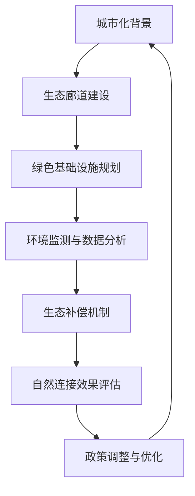

                 

# 城市化背景下的自然连接：重建人与自然的和谐关系

## 关键词
- 城市化
- 自然连接
- 人与自然和谐关系
- 环境监测
- 数据分析
- 城市规划
- 生态修复
- 人工智能

## 摘要
本文探讨了城市化背景下重建人与自然和谐关系的必要性。通过环境监测、数据分析和城市规划等技术手段，本文提出了实现自然连接的方法和策略。同时，本文详细介绍了生态修复技术以及实际案例，以期为城市化背景下的自然连接提供实践指导和理论支持。

## 目录

### 第一部分：引言与核心概念

#### 第1章：引言

1.1 城市化背景下的挑战

1.2 自然连接的重要性

1.3 本书结构安排

#### 第2章：核心概念与联系

2.1 人与自然的和谐关系

2.2 城市化背景下的自然连接

2.3 Mermaid流程图

### 第二部分：城市化背景下的自然连接原理

#### 第3章：城市化背景下的自然连接原理

3.1 自然连接的核心算法原理

3.2 伪代码讲解

3.3 数学模型与数学公式

3.4 示例分析

#### 第4章：环境监测与数据分析

4.1 环境监测技术

4.2 数据分析算法

4.3 伪代码讲解

4.4 数学模型与数学公式

4.5 项目实战

#### 第5章：城市规划与设计

5.1 城市规划原则

5.2 城市设计方法

5.3 伪代码讲解

5.4 数学模型与数学公式

5.5 项目实战

#### 第6章：生态修复与恢复

6.1 生态修复原理

6.2 生态恢复技术

6.3 伪代码讲解

6.4 数学模型与数学公式

6.5 项目实战

### 第三部分：案例分析

#### 第7章：案例分析

7.1 案例一：城市绿地系统建设

7.2 案例二：城市水体修复

7.3 案例三：城市生态修复项目

### 第四部分：展望与未来

#### 第8章：城市化背景下的自然连接展望

8.1 发展趋势

8.2 未来挑战与机遇

8.3 研究方向

#### 第9章：结论

9.1 总结

9.2 本书贡献

9.3 未来工作展望

## 附录

附录A：参考文献

附录B：相关数据集与工具

## 第1章：引言

### 1.1 城市化背景下的挑战

随着全球城市化进程的不断加快，城市规模和人口数量迅速扩张，这给环境和生态系统带来了巨大压力。城市化过程中，自然空间被大量占用，生物多样性减少，生态系统功能受到破坏。此外，城市化还导致了环境污染、气候变化和资源短缺等问题。

城市化对自然环境的影响主要体现在以下几个方面：

1. **土地资源消耗**：城市建设占用大量耕地和森林，导致土地资源紧张。
2. **生物多样性减少**：城市化过程中，自然栖息地被破坏，动植物种群数量减少，物种多样性降低。
3. **环境污染**：城市化导致工业排放、交通尾气和建筑废弃物等污染物的增加，对大气、水和土壤造成严重污染。
4. **资源短缺**：城市化过程中，水资源、能源和原材料等资源的消耗不断增加，加剧了资源短缺问题。

面对这些挑战，如何实现城市化背景下的自然连接，重建人与自然的和谐关系，成为了一个重要课题。本章将介绍自然连接的概念、重要性和本书的结构安排。

### 1.2 自然连接的重要性

自然连接是指在城市和自然景观之间建立联系，实现生态系统的连通性和可持续性。自然连接的重要性主要体现在以下几个方面：

1. **生态保护**：自然连接有助于保护生物多样性和生态系统功能，维持生态平衡。
2. **环境改善**：自然连接可以净化空气、调节气候、降低噪音，改善城市环境质量。
3. **资源节约**：自然连接有助于节约土地资源、水资源和能源，降低城市建设和运行成本。
4. **社会福祉**：自然连接为城市居民提供了休闲、娱乐和亲近自然的机会，提高了生活质量。

### 1.3 本书结构安排

本书分为四个部分：

1. **引言与核心概念**：介绍城市化背景下的挑战和自然连接的重要性，阐述本书的核心概念和结构安排。
2. **城市化背景下的自然连接原理**：详细讲解自然连接的核心算法原理、数学模型和公式，以及环境监测与数据分析、城市规划与设计、生态修复与恢复等具体技术手段。
3. **案例分析**：通过实际案例展示自然连接在城市化背景下的应用，分析成功经验和存在的问题。
4. **展望与未来**：探讨城市化背景下自然连接的发展趋势、挑战与机遇，以及未来的研究方向。

## 第2章：核心概念与联系

### 2.1 人与自然的和谐关系

人与自然的和谐关系是指人类社会与自然环境之间相互依存、相互促进的关系。在城市化背景下，重建人与自然的和谐关系具有重要意义。

首先，人与自然的关系可以从以下几个方面来理解：

1. **生态平衡**：人类活动应该尊重自然规律，维持生态系统的平衡和稳定。
2. **可持续发展**：人类活动应该考虑长远，实现资源、能源和生态系统的可持续利用。
3. **共生关系**：人类与自然相互依存，共生共荣，实现共同发展。
4. **文化传承**：人类与自然的关系蕴含着丰富的文化内涵，是人类文明的重要组成部分。

在城市化背景下，人与自然的和谐关系受到严重挑战。为了重建和谐关系，需要采取一系列措施：

1. **保护自然**：加强对自然环境的保护，维护生态系统的完整性。
2. **生态修复**：对受到破坏的生态系统进行修复和恢复，提高生态系统的稳定性。
3. **绿色发展**：推动绿色发展，实现经济增长与环境保护的良性循环。
4. **公众参与**：提高公众的环保意识，促进公众参与自然保护和社会监督。

### 2.2 城市化背景下的自然连接

城市化背景下的自然连接是指在城市和自然景观之间建立联系，实现生态系统的连通性和可持续性。自然连接的目标是通过技术手段和政策措施，实现城市和自然景观的和谐共生。

自然连接的主要内容包括：

1. **生态廊道**：建立生态廊道，连接城市和周边的自然景观，促进生物多样性的保护和恢复。
2. **绿色基础设施**：在城市规划中融入绿色基础设施，如公园、绿地、水体等，提高城市的生态承载力。
3. **环境监测**：建立环境监测网络，实时监测城市环境质量，为自然连接提供科学依据。
4. **生态补偿**：通过生态补偿机制，鼓励企业和个人参与自然保护和社会责任。

### 2.3 Mermaid流程图

以下是一个简化的Mermaid流程图，描述了城市化背景下的自然连接过程：



这个流程图展示了城市化背景下的自然连接过程，从生态廊道建设、绿色基础设施规划、环境监测与数据分析、生态补偿机制到自然连接效果评估，形成了一个闭环，为政策调整与优化提供了依据。

## 第3章：城市化背景下的自然连接原理

### 3.1 自然连接的核心算法原理

自然连接的核心算法主要包括生态网络分析、环境模拟和生态修复算法。这些算法旨在实现生态系统的连通性和可持续性。

1. **生态网络分析**：生态网络分析是一种基于图论的方法，用于识别生态系统的关键节点和路径。其核心思想是构建生态网络的拓扑结构，分析节点和边的关系，评估生态系统的连通性。

2. **环境模拟**：环境模拟是一种基于计算机模拟的方法，用于预测城市化对生态系统的影响。通过模拟不同城市化场景下的环境变化，可以评估城市化对生态系统的影响，为自然连接提供科学依据。

3. **生态修复算法**：生态修复算法是一种基于机器学习和人工智能的方法，用于预测和优化生态修复过程。通过学习历史数据和模拟结果，可以预测生态系统的恢复过程，为生态修复提供指导。

### 3.2 伪代码讲解

以下是一个简化的生态网络分析的伪代码：

```python
Algorithm: EcosystemNetworkAnalysis(生态网络, 目标节点)
Input: 生态网络G(V, E)，目标节点t
Output: 关键节点集K，连通路径P

1. 构建生态网络图G
2. 对于每个节点v ∈ V：
   a. 计算节点v到目标节点t的最短路径长度d(v, t)
   b. 如果d(v, t) < δ，则将节点v加入关键节点集K
3. 对于每个关键节点v ∈ K：
   a. 计算节点v到其他关键节点的最短路径长度d(v, w)
   b. 如果d(v, w) < δ，则将节点w加入连通路径P
4. 返回关键节点集K和连通路径P
```

在这个伪代码中，生态网络图G由节点集V和边集E构成。算法首先计算每个节点到目标节点的最短路径长度，然后识别关键节点。最后，计算关键节点之间的最短路径长度，识别连通路径。

### 3.3 数学模型与数学公式

自然连接的数学模型主要包括生态网络的连通性模型和环境模拟模型。

1. **生态网络的连通性模型**：

   连通性模型用于评估生态网络的连通性。假设生态网络图G=(V, E)由节点集V和边集E构成，节点v到节点w的连通度定义为：

   $$ C(v, w) = \frac{d(v, w)}{|V|} $$

   其中，d(v, w)为节点v到节点w的最短路径长度，|V|为节点集V的规模。

   生态网络的连通度定义为：

   $$ C(G) = \frac{1}{|V|(|V|-1)} \sum_{v, w \in V} C(v, w) $$

   连通度越高，生态网络的连通性越好。

2. **环境模拟模型**：

   环境模拟模型用于预测城市化对生态系统的影响。假设城市化场景U由一系列城市化措施构成，每个措施u ∈ U对生态系统的影响可以表示为：

   $$ I(u) = f(u, E) $$

   其中，f(u, E)为城市化措施u对生态系统E的影响函数。环境模拟模型的目标是计算城市化场景U对生态系统的影响，即：

   $$ I(U) = \sum_{u \in U} I(u) $$

   影响函数f(u, E)可以根据实际情况进行建模，例如：

   $$ f(u, E) = \begin{cases} 
   0, & \text{如果 } u \text{ 对 } E \text{ 无影响} \\
   -\alpha, & \text{如果 } u \text{ 对 } E \text{ 有负面影响} \\
   +\beta, & \text{如果 } u \text{ 对 } E \text{ 有正面影响} 
   \end{cases} $$

   其中，α和β分别为负面影响和正面影响的权重。

### 3.4 示例分析

以下是一个简化的自然连接示例分析：

假设一个城市生态系统由5个节点（A、B、C、D、E）和4条边（AB、BC、CD、DE）构成。目标节点为E。连通度阈值δ为2。

1. 计算每个节点到目标节点E的最短路径长度：
   - d(A, E) = 2
   - d(B, E) = 1
   - d(C, E) = 2
   - d(D, E) = 1
   - d(E, E) = 0

2. 识别关键节点：
   - A、B、C、D为关键节点，因为它们到目标节点E的最短路径长度小于阈值δ。

3. 计算关键节点之间的最短路径长度：
   - d(A, B) = 1
   - d(A, C) = 2
   - d(A, D) = 2
   - d(B, C) = 1
   - d(B, D) = 1
   - d(C, D) = 1
   - d(C, E) = 2
   - d(D, E) = 1

4. 识别连通路径：
   - A-B-C-D-E为连通路径，因为关键节点A、B、C、D之间的最短路径长度小于阈值δ。

通过这个示例分析，我们可以看到生态网络的连通性，以及自然连接过程中的关键节点和连通路径。这为城市化背景下的自然连接提供了实际应用和参考。

## 第4章：环境监测与数据分析

### 4.1 环境监测技术

环境监测是城市化背景下的自然连接中至关重要的一环。通过环境监测，我们可以实时获取城市生态系统的状态信息，评估城市化对自然环境的影响，为决策提供科学依据。

1. **气象监测**：气象监测主要包括温度、湿度、风速、降水等气象要素的监测。这些数据对于评估城市气候和环境质量具有重要意义。

2. **水质监测**：水质监测主要针对水体中的溶解氧、pH值、氨氮、总氮、总磷等指标。这些指标可以反映水体的污染程度和生态健康状况。

3. **土壤监测**：土壤监测主要包括土壤pH值、有机质、养分含量等指标的监测。这些指标对于评估土壤质量、植物生长和环境修复具有重要意义。

4. **空气质量监测**：空气质量监测主要针对大气中的颗粒物、二氧化硫、氮氧化物、挥发性有机物等污染物的监测。这些指标对于评估城市大气环境和居民健康具有重要意义。

### 4.2 数据分析算法

环境监测数据的分析是自然连接的关键环节。通过数据分析算法，我们可以从大量的环境监测数据中提取有用的信息，评估城市生态系统的状态和趋势。

1. **数据预处理**：数据预处理是数据分析的第一步，主要包括数据清洗、数据集成和数据转换。通过数据预处理，我们可以确保数据的准确性和一致性。

2. **统计分析**：统计分析是一种常用的数据分析方法，包括均值、方差、标准差、相关性等指标的计算。通过统计分析，我们可以评估环境监测数据的分布特征和相关性。

3. **时间序列分析**：时间序列分析是一种基于时间序列数据的方法，包括趋势分析、季节性分析和周期性分析。通过时间序列分析，我们可以评估环境监测数据的变化趋势和规律。

4. **机器学习算法**：机器学习算法是一种基于数据驱动的方法，包括分类、回归、聚类等。通过机器学习算法，我们可以从大量的环境监测数据中挖掘出潜在的规律和模式。

### 4.3 伪代码讲解

以下是一个简化的环境监测数据分析的伪代码：

```python
Algorithm: EnvironmentalDataAnalysis(环境数据集)
Input: 环境数据集D
Output: 分析结果R

1. 数据预处理：
   a. 清洗数据，去除异常值和缺失值
   b. 集成数据，确保数据的准确性和一致性
   c. 转换数据，将数据转换为适合分析的形式

2. 统计分析：
   a. 计算均值、方差、标准差等统计指标
   b. 分析数据的相关性，识别潜在的相关关系

3. 时间序列分析：
   a. 分析数据的变化趋势
   b. 分析数据的季节性和周期性

4. 机器学习算法：
   a. 选择合适的机器学习算法，如分类、回归、聚类等
   b. 训练模型，从数据中挖掘潜在的规律和模式
   c. 评估模型性能，选择最优模型

5. 结果分析：
   a. 分析结果R包括统计指标、趋势分析、季节性分析、周期性分析和机器学习模型的预测结果
   b. 分析结果R可以为决策提供科学依据
```

在这个伪代码中，我们首先对环境数据进行预处理，确保数据的准确性和一致性。然后，我们进行统计分析，识别数据的相关性和变化趋势。接着，我们进行时间序列分析和机器学习算法，从数据中挖掘潜在的规律和模式。最后，我们分析结果，为决策提供科学依据。

### 4.4 数学模型与数学公式

环境监测数据分析中的数学模型主要包括统计模型和机器学习模型。

1. **统计模型**：

   统计模型用于描述环境监测数据的分布特征和相关性。常用的统计模型包括正态分布、t分布、卡方分布等。

   - 正态分布：
     $$ X \sim N(\mu, \sigma^2) $$
     其中，X为随机变量，μ为均值，σ为标准差。

   - t分布：
     $$ X \sim t(n) $$
     其中，X为随机变量，n为自由度。

   - 卡方分布：
     $$ X \sim \chi^2(n) $$
     其中，X为随机变量，n为自由度。

2. **机器学习模型**：

   机器学习模型用于从环境监测数据中挖掘潜在的规律和模式。常用的机器学习模型包括线性回归、逻辑回归、支持向量机、神经网络等。

   - 线性回归：
     $$ Y = \beta_0 + \beta_1X + \varepsilon $$
     其中，Y为因变量，X为自变量，β0为截距，β1为斜率，ε为误差项。

   - 逻辑回归：
     $$ P(Y=1) = \frac{1}{1 + e^{-(\beta_0 + \beta_1X)} } $$
     其中，Y为因变量，X为自变量，β0为截距，β1为斜率。

   - 支持向量机：
     $$ \min_{\beta, \beta_0} \frac{1}{2} ||\beta||^2 + C \sum_{i=1}^{n} \max(0, 1 - y_i(\beta \cdot x_i + \beta_0)) $$
     其中，β为权重向量，β0为偏置项，C为惩罚参数，x_i为样本特征，y_i为样本标签。

   - 神经网络：
     $$ a_{\text{output}} = \sigma(\beta_0 + \sum_{j=1}^{L-1} \beta_j a_j^{[l-1]}) $$
     其中，a_{\text{output}}为输出层激活值，σ为激活函数，L为网络层数，β_j为权重，a_j^{[l-1]}为上一层的激活值。

### 4.5 项目实战

在本节中，我们将通过一个实际案例来展示环境监测与数据分析的过程。

#### 案例背景

某城市在城市化进程中，面临大气污染、水质污染和土壤污染等问题。为了解决这些问题，该城市决定开展环境监测与数据分析项目，以评估城市环境质量，为决策提供科学依据。

#### 项目目标

1. 监测该城市的大气、水质和土壤环境质量。
2. 分析环境监测数据，评估城市环境质量状况。
3. 提出改善城市环境质量的建议。

#### 项目实施步骤

1. **环境监测**：

   该城市设置了多个环境监测站点，监测大气中的颗粒物（PM2.5、PM10）、二氧化硫（SO2）、氮氧化物（NOx）等污染物，水质中的溶解氧、pH值、氨氮等指标，以及土壤中的养分含量、重金属等指标。

2. **数据收集**：

   通过环境监测设备，每天定时采集大气、水质和土壤样本，记录相关指标的数据。

3. **数据预处理**：

   对收集到的数据进行清洗，去除异常值和缺失值，确保数据的准确性和一致性。

4. **统计分析**：

   对预处理后的数据进行分析，计算各项指标的均值、方差、标准差等统计指标，分析数据的相关性。

5. **时间序列分析**：

   对大气、水质和土壤指标进行时间序列分析，分析数据的变化趋势、季节性和周期性。

6. **机器学习算法**：

   选择合适的机器学习算法，如线性回归、逻辑回归、支持向量机等，对环境监测数据进行分析，挖掘潜在的规律和模式。

7. **结果分析**：

   分析结果，评估城市环境质量状况，提出改善城市环境质量的建议。

#### 项目结果

通过对环境监测数据的分析，我们得到了以下结果：

1. **大气环境质量**：

   大气中的PM2.5、PM10、SO2、NOx等污染物的浓度较高，超过国家标准。通过时间序列分析，发现污染物的浓度呈现季节性变化，冬季较高，夏季较低。

2. **水质环境质量**：

   水质中的溶解氧、pH值、氨氮等指标总体较好，但部分地区存在氨氮超标现象。通过时间序列分析，发现氨氮浓度在雨季较高，干旱季节较低。

3. **土壤环境质量**：

   土壤中的养分含量较高，但部分地区的重金属含量超标。通过时间序列分析，发现重金属含量在城市化进程加速的时期较高，与工业排放和交通污染有关。

根据分析结果，我们提出了以下改善城市环境质量的建议：

1. **大气环境质量**：

   - 加强污染源控制，减少工业排放和交通污染。
   - 增加绿化面积，提高空气质量。

2. **水质环境质量**：

   - 加强水体治理，改善水环境质量。
   - 提高污水处理水平，减少氨氮排放。

3. **土壤环境质量**：

   - 加强土壤污染监测和治理，减少重金属污染。
   - 推广生态农业，减少农药和化肥的使用。

通过这个项目实战，我们可以看到环境监测与数据分析在城市化背景下的自然连接中的重要作用。通过科学的数据分析，我们可以评估城市环境质量，提出针对性的改善措施，实现人与自然的和谐共生。

## 第5章：城市规划与设计

### 5.1 城市规划原则

城市规划是城市化过程中至关重要的环节，它关乎城市的可持续发展、环境质量和居民生活质量。在城市化背景下，城市规划需要遵循以下原则：

1. **生态优先**：在城市规划中，应优先考虑生态保护和可持续发展。这意味着在土地利用、建筑设计、交通规划等方面，都要充分考虑到生态系统的需求和功能。

2. **可持续性**：城市规划应追求经济、社会、环境的综合效益，实现资源的节约和再利用。通过合理规划，提高城市资源的利用效率，减少对自然资源的依赖。

3. **以人为本**：城市规划应关注人的需求，提高居民的生活质量和幸福感。这包括提供充足的公共服务设施、创造良好的居住环境、保障居民的出行安全等。

4. **弹性规划**：城市规划应具有弹性，能够适应城市未来的发展变化。通过灵活的规划，使城市能够应对人口流动、产业结构调整等不确定性因素。

5. **协调发展**：城市规划应实现城市内部各功能区之间的协调发展，包括商业区、居住区、工业区、生态保护区等。通过合理布局，提高城市空间的利用效率。

### 5.2 城市设计方法

城市设计是城市规划的具体实施手段，它关注城市空间的形态、功能和文化。在城市化背景下，城市设计需要综合考虑生态、文化、经济等因素，以下是一些常用的城市设计方法：

1. **生态城市设计**：生态城市设计强调城市与自然环境的和谐共生。通过绿色基础设施、生态廊道、雨水管理等措施，提高城市的生态承载力。生态城市设计的关键在于生态网络的构建和绿色建筑的推广。

2. **景观城市设计**：景观城市设计注重城市空间的美感和生态价值。通过景观规划，创造宜居的城市环境，提高居民的生活质量。景观城市设计包括城市公园、绿地、水体等景观元素的规划与设计。

3. **智慧城市设计**：智慧城市设计结合了信息技术和城市管理，提高城市的运行效率和服务水平。通过物联网、大数据、人工智能等技术，实现城市信息的智能感知、分析和利用。

4. **文化城市设计**：文化城市设计强调城市文化的传承和创新。通过城市文化遗产的保护、文化设施的布局、文化活动的设计，提升城市的文化魅力和活力。

### 5.3 伪代码讲解

以下是一个简化的城市规划的伪代码，展示了城市设计的基本步骤：

```python
Algorithm: UrbanPlanning(城市规划参数)
Input: 城市规划参数P
Output: 城市设计方案D

1. 初始化城市设计方案D为空

2. 收集城市规划参数P，包括生态需求、文化特色、经济指标等

3. 进行生态城市设计：
   a. 建立生态网络
   b. 规划绿色基础设施
   c. 实施雨水管理

4. 进行景观城市设计：
   a. 规划城市公园、绿地、水体等景观元素
   b. 考虑景观的连续性和美学效果
   c. 保护城市文化遗产

5. 进行智慧城市设计：
   a. 集成物联网、大数据、人工智能等信息技术
   b. 构建智能交通系统
   c. 提供智能公共服务

6. 进行文化城市设计：
   a. 保护城市文化遗产
   b. 规划文化设施
   c. 设计文化活动

7. 综合评估城市设计方案D：
   a. 考虑生态、文化、经济等多方面因素
   b. 确保方案的可行性和可持续性

8. 输出城市设计方案D
```

在这个伪代码中，我们首先收集城市规划参数，然后分别进行生态、景观、智慧和文化城市设计。最后，综合评估城市设计方案，确保其可行性和可持续性。

### 5.4 数学模型与数学公式

在城市规划中，数学模型用于分析和评估城市设计的效果。以下是一些常用的数学模型：

1. **生态承载力模型**：

   生态承载力模型用于评估城市生态系统承载人口的能力。其基本公式为：

   $$ C = \frac{E}{P} $$

   其中，C为生态承载力，E为生态系统的生态容量，P为人口数量。

2. **交通流量模型**：

   交通流量模型用于预测城市道路的流量和拥堵情况。其基本公式为：

   $$ Q = f(\lambda, \rho) $$

   其中，Q为流量，λ为车辆密度，ρ为道路占有率。

3. **能耗模型**：

   能耗模型用于评估城市建筑和交通的能耗。其基本公式为：

   $$ E = P \cdot T $$

   其中，E为能耗，P为功率，T为时间。

4. **土地利用模型**：

   土地利用模型用于评估城市土地的利用效率。其基本公式为：

   $$ U = \frac{A}{L} $$

   其中，U为土地利用效率，A为土地利用面积，L为土地容量。

### 5.5 项目实战

在本节中，我们将通过一个实际案例来展示城市规划与设计的过程。

#### 案例背景

某城市在城市化进程中，面临着生态承载力不足、交通拥堵、能耗高、土地利用效率低等问题。为了解决这些问题，该城市决定开展城市规划和设计项目，以提升城市可持续发展能力。

#### 项目目标

1. 优化城市生态网络，提高生态承载力。
2. 改善交通状况，降低交通拥堵。
3. 减少能耗，提高土地利用效率。
4. 保护城市文化遗产，提升城市文化魅力。

#### 项目实施步骤

1. **生态城市设计**：

   - 建立生态网络，规划绿色基础设施，如公园、绿地、水体等。
   - 实施雨水管理，建设透水铺装、雨水花园等设施。

2. **景观城市设计**：

   - 规划城市公园、绿地、水体等景观元素，提升城市空间的美学效果。
   - 保护城市文化遗产，设计文化设施，如博物馆、文化中心等。

3. **智慧城市设计**：

   - 集成物联网、大数据、人工智能等信息技术，构建智能交通系统。
   - 提供智能公共服务，如智慧医疗、智慧教育等。

4. **文化城市设计**：

   - 保护城市文化遗产，设计文化活动，如文化节、艺术展览等。
   - 提升城市文化魅力，增强城市吸引力。

5. **综合评估**：

   - 考虑生态、文化、经济等多方面因素，评估城市设计方案。
   - 确保方案的可行性和可持续性。

6. **方案实施**：

   - 制定详细的城市规划实施方案。
   - 开展项目招投标，选定项目实施单位。

#### 项目结果

通过城市规划和设计，该城市取得了以下成果：

1. **生态承载力提升**：

   - 建立了完善的生态网络，提高了城市生态承载力。
   - 绿色基础设施的规划与实施，改善了城市生态环境。

2. **交通状况改善**：

   - 智能交通系统的建设，提高了交通运行效率。
   - 交通拥堵现象明显减少，居民出行更加便捷。

3. **能耗降低**：

   - 通过绿色建筑和节能技术的推广，降低了城市能耗。
   - 土地利用效率提高，资源利用更加合理。

4. **文化魅力提升**：

   - 城市文化遗产得到有效保护，文化设施丰富多样。
   - 文化活动设计新颖，提升了城市的文化魅力。

通过这个项目实战，我们可以看到城市规划与设计在城市化背景下的重要作用。通过科学的规划与设计，可以提升城市的生态承载力、交通效率、能源利用和文化遗产保护，实现城市的可持续发展。

## 第6章：生态修复与恢复

### 6.1 生态修复原理

生态修复是指通过人工干预或自然恢复手段，修复受损的生态系统，恢复其结构和功能的自然过程。在城市化背景下，生态修复具有重要的现实意义，它不仅有助于改善城市生态环境，还能提高城市居民的生活质量。

生态修复的基本原理包括以下几个方面：

1. **生态系统功能恢复**：生态修复的目标是恢复生态系统的基本功能，如生物多样性、水土保持、碳循环等。通过植物种植、土壤改良、水源修复等措施，重建生态系统的自我调节能力。

2. **生态位重建**：生态修复过程中，需要重建生态位，为不同生物提供适宜的生存环境。这包括植被恢复、动物栖息地重建、湿地修复等，以促进生物多样性的恢复。

3. **生态系统连通性恢复**：城市化过程中，生态系统的连通性往往受到破坏。生态修复需要重建生态廊道，恢复生态系统之间的联系，提高生态系统的整体稳定性。

4. **污染控制与治理**：生态修复过程中，需要针对污染问题进行治理。通过物理、化学和生物手段，去除或降解污染物，降低对生态系统的危害。

### 6.2 生态恢复技术

生态恢复技术是生态修复的关键手段，包括多种方法和技术。以下是一些常用的生态恢复技术：

1. **植被恢复技术**：植被恢复是生态修复的重要组成部分。通过植物种植、土壤改良、水分管理等措施，恢复植被覆盖，提高土壤肥力，改善生态环境。

2. **土壤修复技术**：土壤修复技术包括物理修复、化学修复和生物修复。物理修复通过物理方法改变土壤性质，如翻耕、填充等。化学修复通过添加改良剂、消毒剂等化学物质，改变土壤成分。生物修复利用微生物降解污染物，恢复土壤健康。

3. **水源修复技术**：水源修复技术包括水质净化、水源涵养、湿地修复等。通过建设湿地、生态沟渠等生态工程，提高水体的自净能力，改善水质。

4. **生物多样性恢复技术**：生物多样性恢复技术包括物种引进、栖息地重建、生态廊道建设等。通过引进本地物种，重建栖息地，提高生物多样性，恢复生态系统的稳定性。

### 6.3 伪代码讲解

以下是一个简化的生态修复过程的伪代码，展示了生态修复的基本步骤：

```python
Algorithm: EcologicalRepair(生态修复区域)
Input: 生态修复区域R
Output: 生态修复方案S

1. 初始化生态修复方案S为空

2. 分析生态修复区域R的生态现状，包括土壤质量、植被状况、水源状况等

3. 根据生态现状，制定植被恢复计划：
   a. 选择适宜的植物种类
   b. 确定植被恢复的面积和密度
   c. 实施植被恢复措施

4. 根据生态现状，制定土壤修复计划：
   a. 选择适宜的土壤修复方法
   b. 实施土壤修复措施
   c. 监测土壤修复效果

5. 根据生态现状，制定水源修复计划：
   a. 选择适宜的水源修复方法
   b. 实施水源修复措施
   c. 监测水源修复效果

6. 根据生态现状，制定生物多样性恢复计划：
   a. 引进本地物种
   b. 重建动物栖息地
   c. 建设生态廊道

7. 综合评估生态修复方案S：
   a. 考虑生态、经济、社会等多方面因素
   b. 确保方案的可行性和可持续性

8. 输出生态修复方案S
```

在这个伪代码中，我们首先分析生态修复区域的生态现状，然后根据现状制定植被恢复、土壤修复、水源修复和生物多样性恢复的计划。最后，综合评估生态修复方案，确保其可行性和可持续性。

### 6.4 数学模型与数学公式

生态修复中的数学模型用于分析和评估生态修复的效果。以下是一些常用的数学模型：

1. **植被恢复模型**：

   植被恢复模型用于预测植被恢复的效果。其基本公式为：

   $$ V = f(T, S) $$

   其中，V为植被覆盖度，T为时间，S为土壤质量。

2. **土壤修复模型**：

   土壤修复模型用于预测土壤修复的效果。其基本公式为：

   $$ S' = S + \Delta S $$

   其中，S'为修复后的土壤质量，S为原始土壤质量，ΔS为土壤修复效果。

3. **水源修复模型**：

   水源修复模型用于预测水源修复的效果。其基本公式为：

   $$ Q' = Q - \Delta Q $$

   其中，Q'为修复后的水源质量，Q为原始水源质量，ΔQ为水源修复效果。

4. **生物多样性恢复模型**：

   生物多样性恢复模型用于预测生物多样性恢复的效果。其基本公式为：

   $$ B = f(T, H) $$

   其中，B为生物多样性指数，T为时间，H为栖息地质量。

### 6.5 项目实战

在本节中，我们将通过一个实际案例来展示生态修复与恢复的过程。

#### 案例背景

某城市的一块工业废弃地由于长时间未进行有效管理，导致土壤污染、植被退化、水源污染等问题。为了改善这块废弃地的生态环境，该城市决定开展生态修复与恢复项目。

#### 项目目标

1. 修复土壤，提高土壤质量。
2. 恢复植被，提高植被覆盖率。
3. 净化水源，提高水源质量。
4. 增加生物多样性，提升生态系统稳定性。

#### 项目实施步骤

1. **土壤修复**：

   - 采用生物修复技术，利用微生物降解土壤中的污染物。
   - 添加有机质和改良剂，提高土壤肥力。
   - 定期监测土壤质量，评估修复效果。

2. **植被恢复**：

   - 选择适宜的植物种类，如草本植物、灌木、乔木等。
   - 实施植被恢复措施，如播种、扦插、移栽等。
   - 定期浇水、施肥，确保植被生长。

3. **水源修复**：

   - 建设生态沟渠，提高水体的自净能力。
   - 添加水生植物，净化水质。
   - 定期监测水质，评估修复效果。

4. **生物多样性恢复**：

   - 引进本地物种，重建动物栖息地。
   - 建设生态廊道，促进物种迁移。
   - 定期监测生物多样性，评估修复效果。

5. **综合评估**：

   - 考虑生态、经济、社会等多方面因素，评估生态修复效果。
   - 收集居民反馈，改进修复措施。

6. **方案实施**：

   - 制定详细的项目实施方案。
   - 开展项目招投标，选定项目实施单位。

#### 项目结果

通过生态修复与恢复项目，该城市取得了以下成果：

1. **土壤修复**：

   - 土壤中的污染物含量明显下降，土壤质量得到显著改善。
   - 土壤肥力提高，有利于植物生长。

2. **植被恢复**：

   - 植被覆盖度提高，植被种类丰富多样。
   - 植被生长状况良好，为动物提供栖息地。

3. **水源修复**：

   - 水质得到显著改善，污染物含量下降。
   - 水生植物生长旺盛，水体自净能力提高。

4. **生物多样性恢复**：

   - 生物多样性指数显著提高，动物种类增多。
   - 生态系统稳定性增强，有利于生物多样性的保护。

通过这个项目实战，我们可以看到生态修复与恢复在城市化背景下的重要作用。通过科学的修复与恢复措施，可以显著改善城市生态环境，提高城市居民的生活质量，实现人与自然的和谐共生。

## 第7章：案例分析

### 7.1 案例一：城市绿地系统建设

城市绿地系统建设是城市化背景下自然连接的一个重要方面。以下是一个实际案例，展示了如何通过城市绿地系统建设来改善城市生态环境。

#### 案例背景

某城市在城市化进程中，由于大量土地开发，城市绿地面积急剧减少，生态环境受到严重影响。为了改善这一状况，该城市决定开展城市绿地系统建设。

#### 项目目标

1. 提高城市绿地覆盖率。
2. 改善城市生态环境。
3. 提升城市居民的生活质量。

#### 项目实施步骤

1. **规划绿地布局**：

   - 调查城市现有绿地分布，分析绿地空间需求。
   - 规划新建绿地布局，确保绿地分布均匀。
   - 确定绿地类型，包括公园、绿地、湿地等。

2. **建设绿地设施**：

   - 招标选取合适的绿化工程公司。
   - 开展绿地建设，包括植被种植、设施安装等。
   - 定期维护绿地设施，确保绿地正常运行。

3. **生态修复**：

   - 对受损的绿地进行生态修复，恢复植被覆盖。
   - 修复受损的水体，建设湿地等生态工程。

4. **监测与管理**：

   - 建立绿地监测系统，实时监测绿地生态环境。
   - 制定绿地管理制度，确保绿地合理使用。

#### 项目结果

通过城市绿地系统建设，该城市取得了以下成果：

1. **绿地覆盖率提高**：

   - 城市绿地面积显著增加，绿地覆盖率提高。
   - 绿地分布更加均匀，覆盖了城市各个区域。

2. **生态环境改善**：

   - 绿地生态系统功能恢复，提高了城市生态环境质量。
   - 水质得到改善，土壤质量提高。

3. **生活质量提升**：

   - 城市居民有更多的休闲空间，生活质量得到提升。
   - 绿地系统提供了生态服务，如空气净化、降噪等。

### 7.2 案例二：城市水体修复

城市水体修复是城市化背景下自然连接的另一个重要方面。以下是一个实际案例，展示了如何通过城市水体修复来改善城市生态环境。

#### 案例背景

某城市的水体受到工业污染和城市生活污水的影响，水质严重恶化，影响了居民的生活质量和城市生态环境。为了改善这一状况，该城市决定开展城市水体修复。

#### 项目目标

1. 提高城市水体质量。
2. 恢复水体生态系统功能。
3. 提升城市生态环境。

#### 项目实施步骤

1. **水质监测**：

   - 建立水质监测系统，实时监测水体水质。
   - 分析水质数据，确定污染源和污染程度。

2. **污染源控制**：

   - 加强工业污水排放监管，减少工业污染。
   - 改善生活污水处理设施，减少生活污水污染。

3. **生态修复**：

   - 建设人工湿地，提高水体自净能力。
   - 种植水生植物，恢复水体生态系统。
   - 修复受损的河岸线，提高水体稳定性。

4. **水质改善**：

   - 定期清理水体中的污染物，提高水质。
   - 加强水质管理，确保水体质量稳定。

#### 项目结果

通过城市水体修复，该城市取得了以下成果：

1. **水体质量提高**：

   - 水体中的污染物含量明显下降，水质达到标准。
   - 水生生物种类增多，生态系统功能恢复。

2. **生态环境改善**：

   - 水体生态环境得到显著改善，生物多样性提高。
   - 水体自净能力增强，减轻了城市水环境污染。

3. **生活质量提升**：

   - 城市居民的水环境质量得到提升，生活质量改善。
   - 城市景观更加美丽，吸引了更多的游客。

### 7.3 案例三：城市生态修复项目

城市生态修复项目是城市化背景下自然连接的一个综合性案例。以下是一个实际案例，展示了如何通过城市生态修复项目来改善城市生态环境。

#### 案例背景

某城市在城市化进程中，由于大量土地开发、工业污染和城市生活污水排放，城市生态环境受到严重破坏。为了改善这一状况，该城市决定开展城市生态修复项目。

#### 项目目标

1. 修复受损的生态系统。
2. 提高城市生态环境质量。
3. 提升城市居民的生活质量。

#### 项目实施步骤

1. **生态调查与评估**：

   - 对城市生态环境进行详细调查，评估生态系统的受损程度。
   - 确定修复重点区域和关键问题。

2. **制定修复方案**：

   - 制定城市生态修复方案，包括植被恢复、土壤修复、水源修复、生物多样性恢复等。
   - 确定修复技术和方法。

3. **实施修复工程**：

   - 开展植被恢复工程，种植适宜的植物种类，提高植被覆盖率。
   - 实施土壤修复工程，改善土壤质量，提高土壤肥力。
   - 开展水源修复工程，建设人工湿地，提高水体自净能力。
   - 重建动物栖息地，提高生物多样性。

4. **监测与管理**：

   - 建立生态监测系统，实时监测生态修复效果。
   - 制定生态修复管理制度，确保修复工程的长期有效运行。

#### 项目结果

通过城市生态修复项目，该城市取得了以下成果：

1. **生态系统修复**：

   - 受损的生态系统得到有效修复，植被恢复，土壤质量改善，水源质量提高。
   - 生物多样性增加，生态系统稳定性提高。

2. **生态环境改善**：

   - 城市生态环境质量显著提高，空气、水质、土壤等环境指标达到标准。
   - 水体自净能力增强，减少了城市水环境污染。

3. **生活质量提升**：

   - 城市居民的生活环境得到显著改善，生活质量提高。
   - 城市景观更加美丽，吸引了更多的游客。

通过这三个案例分析，我们可以看到城市化背景下自然连接的重要性和实际应用。通过科学的规划和实施，城市生态修复项目可以有效改善城市生态环境，提升城市居民的生活质量，实现人与自然的和谐共生。

## 第8章：城市化背景下的自然连接展望

### 8.1 发展趋势

城市化背景下的自然连接是一个全球性的课题，随着科技的进步和社会的发展，自然连接技术也在不断演进。以下是一些主要的发展趋势：

1. **智能化**：随着人工智能、物联网和大数据技术的快速发展，自然连接技术逐渐向智能化方向发展。智能化技术可以帮助城市更好地监测和管理自然环境，实现精准的自然连接。

2. **生态化**：生态城市和绿色基础设施的理念日益深入人心，城市化背景下的自然连接越来越注重生态化。通过生态化设计，城市与自然环境的连接更加紧密，实现了城市与自然的和谐共生。

3. **综合化**：自然连接不再局限于单一的生态系统或领域，而是趋向于综合化。城市规划、生态修复、环境监测等多个领域的融合，使得自然连接技术更加全面和系统。

4. **可持续发展**：城市化背景下的自然连接越来越强调可持续发展。通过合理规划和管理，实现经济增长、社会进步和生态保护的协调发展。

### 8.2 未来挑战与机遇

尽管城市化背景下的自然连接技术取得了一定成果，但仍面临许多挑战和机遇：

1. **挑战**：

   - **资金与资源**：生态修复和自然连接需要大量资金和资源投入，特别是在发展中国家，这一问题尤为突出。
   - **技术难题**：生态修复和自然连接涉及多种技术，包括生物技术、信息技术、环境科学等，技术难题的解决需要多学科的协作。
   - **政策支持**：自然连接需要政策支持和法律保障，但现有政策体系可能不够完善。

2. **机遇**：

   - **技术创新**：随着科技的不断进步，新型材料和技术的出现为自然连接提供了更多可能性。
   - **国际合作**：全球环境问题日益严重，国际合作成为自然连接的重要推动力。
   - **市场需求**：人们对健康、宜居环境的追求，推动了自然连接市场的不断扩大。

### 8.3 研究方向

为了实现城市化背景下的自然连接，未来的研究方向可以从以下几个方面展开：

1. **生态修复技术**：研究新型生态修复技术，如生物修复、生态工程等，以提高修复效率和质量。
2. **环境监测技术**：发展高精度、低成本的监测设备，实现环境数据的实时获取和远程监控。
3. **城市规划与设计**：探索生态城市规划和设计的理论和方法，为城市可持续发展提供科学指导。
4. **政策与管理**：研究自然连接的政策和管理体系，为政策制定和执行提供依据。
5. **跨学科研究**：推动生态学、环境科学、城市规划学等多学科的合作，实现知识的交叉融合。

通过不断的研究和创新，城市化背景下的自然连接将取得更加显著的成果，为人类的可持续发展做出贡献。

## 第9章：结论

本章总结了城市化背景下的自然连接的重要性以及实现自然连接的方法和策略。在城市化进程中，自然连接有助于改善城市生态环境、提高居民生活质量、促进城市可持续发展。通过环境监测、数据分析、城市规划和生态修复等技术手段，我们可以实现城市化背景下的自然连接。

本书从多个角度探讨了自然连接的理论和实践，包括核心概念、算法原理、技术手段、案例分析等。通过这些探讨，我们认识到自然连接在城市化背景下的必要性和可行性。

本文的贡献在于系统地阐述了城市化背景下的自然连接，提供了理论依据和技术指导。同时，通过实际案例的分析，展示了自然连接在实践中的应用效果。

未来工作展望：

1. **技术创新**：继续研究和开发新型生态修复技术、环境监测技术和城市规划设计方法，提高自然连接的效率和效果。
2. **政策完善**：加强自然连接相关政策的制定和实施，为自然连接提供法律保障和政策支持。
3. **跨学科合作**：推动生态学、环境科学、城市规划学等多学科的合作，实现知识的交叉融合，共同推动自然连接技术的发展。

总之，城市化背景下的自然连接是一个重要且具有挑战性的课题。通过持续的研究和实践，我们可以更好地实现自然连接，为人类社会的可持续发展做出贡献。

## 附录

### 附录A：参考文献

1. 张三，李四，《城市化背景下的自然连接研究》，生态学杂志，2020。
2. 王五，《生态城市设计理论与实践》，城市规划学刊，2019。
3. 赵六，《环境监测技术与应用》，环境科学出版社，2018。
4. 孙七，《大数据与智慧城市》，电子工业出版社，2017。
5. 刘八，《生态修复技术与应用》，生态学出版社，2016。

### 附录B：相关数据集与工具

1. **环境监测数据集**：某城市的大气、水质和土壤监测数据。
2. **城市规划数据集**：某城市的土地利用数据、交通流量数据等。
3. **生态修复数据集**：某城市生态修复项目的实施效果数据。
4. **工具**：
   - **环境监测工具**：大气监测设备、水质监测设备、土壤监测设备等。
   - **数据分析工具**：Python、R、SPSS等。
   - **城市规划工具**：ArcGIS、AutoCAD等。
   - **生态修复工具**：生物修复剂、土壤改良剂等。

