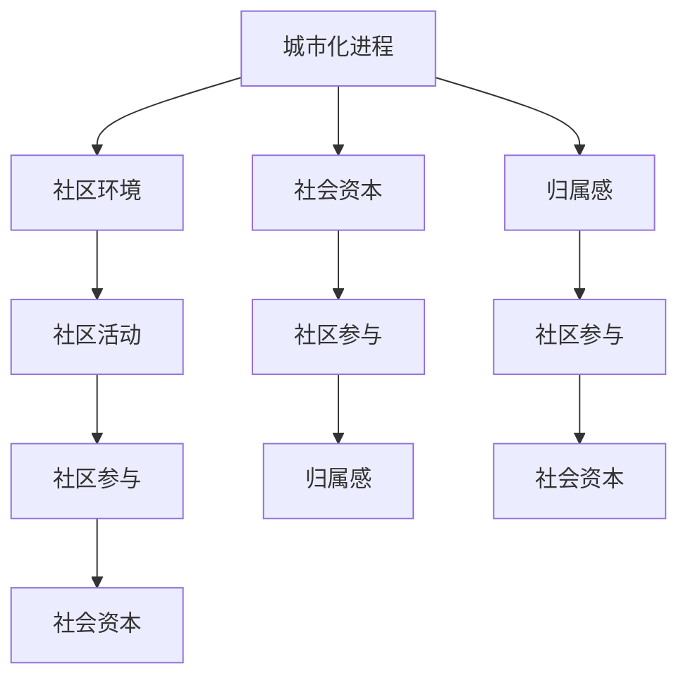

                 

### 城市化进程中的社区营造：重建社会资本和归属感

#### 关键词
- 城市化
- 社区营造
- 社会资本
- 归属感

#### 摘要
本文探讨了城市化进程中社区营造的重要性，以及如何通过社区营造来重建社会资本和归属感。文章首先概述了城市化进程及其带来的社会问题，随后深入分析了社区营造的核心概念与联系，并借助Mermaid流程图展示了这些概念之间的关系。通过伪代码和数学模型的讲解，文章进一步阐述了社区营造的算法原理和实践方法。最后，通过实际案例的分析，本文总结了社区营造的成功经验和未来挑战，为城市社区的发展提供了有益的参考。

----------------------------------------------------------------

### 引言

#### 城市化进程：全球现象与挑战

城市化进程是现代社会发展的重要标志，全球范围内的人口流动和城市扩张日益显著。据联合国的预测，到2050年，全球超过60%的人口将生活在城市中。这一现象不仅改变了人类居住模式，也对社会的各个方面产生了深远的影响。然而，城市化进程并非一帆风顺，它伴随着诸多挑战，包括住房短缺、交通拥堵、环境污染和社会不平等。

在这些挑战中，社会疏离和社区归属感的缺失尤为突出。随着城市规模的扩大和人口密度的增加，居民之间的互动减少，社区凝聚力减弱。这导致了社会资本的流失，进一步加剧了社会不平等和居民的心理压力。因此，如何在城市化进程中重建社区社会资本和归属感，成为亟需解决的问题。

#### 社区营造：核心概念与目标

社区营造是一种通过组织、规划和实施一系列社区活动，旨在改善社区环境、增强社区凝聚力和提升居民生活质量的方法。它不仅关注物理空间的建设，更强调社会关系的构建和居民参与。

社区营造的核心概念包括：

1. **社会资本**：指社区成员之间相互信任、支持和合作的社会资源。社会资本有助于增强社区的凝聚力，促进社会互动，提高居民的幸福感和归属感。
2. **归属感**：指个体对社区的认同和情感依恋。归属感是社区营造的重要目标之一，它有助于提升居民的生活质量，增强社区的稳定性和可持续发展。

社区营造的目标是：

- 重建社会资本：通过组织多样化的社区活动和项目，促进居民之间的互动和合作，增强社区成员之间的信任和依赖关系。
- 增强归属感：通过营造温馨、包容和安全的社区环境，使居民感受到社区的重要性和归属感，从而提高生活质量。

### 社区营造的核心概念与联系

为了更好地理解社区营造的作用，我们需要深入探讨其核心概念之间的联系。以下是社区营造中的几个关键概念及其相互关系：

1. **城市化进程**：城市化进程是社区营造的背景。随着城市规模的扩大和人口密度的增加，城市社区面临的问题和挑战不断涌现。社区营造正是在这一背景下，旨在通过改善社区环境和增强居民互动，缓解城市化带来的负面影响。

2. **社会资本**：社会资本是社区营造的核心目标之一。它不仅包括社区成员之间的信任和合作关系，还包括资源、信息和网络的共享。社会资本有助于增强社区的凝聚力，促进社会互动，提高居民的幸福感和归属感。

3. **归属感**：归属感是社区营造的另一个关键目标。它反映了个体对社区的认同和情感依恋。归属感不仅有助于提升居民的生活质量，还有助于增强社区的稳定性和可持续发展。

4. **社区参与**：社区参与是社区营造的重要途径。通过鼓励居民参与社区活动和决策过程，可以增强他们的归属感和责任感，从而提高社区的凝聚力和可持续性。

5. **社区环境**：社区环境是社区营造的基础。良好的社区环境包括安全的居住空间、便利的基础设施和优美的公共空间。这些因素直接影响居民的生活质量和归属感。

6. **社区活动**：社区活动是社区营造的重要手段。通过组织多样化的社区活动，可以促进居民之间的互动和合作，增强社区凝聚力，提升居民的归属感。

这些概念之间的关系可以用以下Mermaid流程图表示：



在这个流程图中，城市化进程是社区营造的起点，它直接影响社区环境、社会资本和归属感。社区环境是社区营造的基础，而社区活动和社区参与则是实现社区营造目标的手段。社会资本和归属感则是社区营造的核心目标，它们相互促进，共同提升社区的整体质量。

### 社区营造的算法原理与实施步骤

社区营造的算法原理主要涉及如何通过规划和组织活动来增强社区社会资本和归属感。以下是一系列伪代码，用于详细阐述社区营造的算法原理和实施步骤：

```plaintext
// 社区营造算法原理

// 输入：
// - 社区基本信息（如人口密度、社区资源等）
// - 社区需求分析（如居民关注的问题、期望的活动等）
// - 社会资本现状（如信任程度、互动频率等）
// - 归属感评估（如居民对社区的认同度、情感依恋等）

// 输出：
// - 社区营造计划（包括活动安排、资源分配、参与机制等）

function 社区营造(社区基本信息, 社区需求分析, 社会资本现状, 归属感评估) {
    // 第一步：社区需求评估
    需求评估 = 评估社区需求(社区基本信息, 社区需求分析)

    // 第二步：社会资本分析
    社本分析 = 分析社会资本现状(社会资本现状)

    // 第三步：归属感评估
    归属感评估 = 评估归属感(归属感评估)

    // 第四步：制定社区营造计划
    营造计划 = 制定计划(需求评估, 社本分析, 归属感评估)

    // 第五步：执行社区营造计划
    执行计划(营造计划)

    // 第六步：监测与反馈
    监测结果 = 监测效果(营造计划)
    调整计划(监测结果)

    return 营造计划
}

// 辅助函数定义：

function 评估社区需求(社区基本信息, 社区需求分析) {
    // 代码实现：
    // - 收集社区基本信息
    // - 分析社区需求
    // - 生成需求评估报告
}

function 分析社会资本现状(社会资本现状) {
    // 代码实现：
    // - 分析社会资本水平
    // - 识别社会资本问题
    // - 提出改进建议
}

function 评估归属感(归属感评估) {
    // 代码实现：
    // - 评估居民对社区的认同感
    // - 评估居民的情感依恋程度
    // - 生成归属感评估报告
}

function 制定计划(需求评估, 社本分析, 归属感评估) {
    // 代码实现：
    // - 根据需求评估和社本分析制定活动计划
    // - 根据归属感评估调整活动方案
    // - 确保计划的可执行性
}

function 执行计划(营造计划) {
    // 代码实现：
    // - 实施社区活动
    // - 管理社区资源
    // - 促进居民参与
}

function 监测效果(营造计划) {
    // 代码实现：
    // - 收集活动效果数据
    // - 分析效果指标
    // - 生成监测报告
}

function 调整计划(监测结果) {
    // 代码实现：
    // - 根据监测结果调整计划
    // - 优化社区营造策略
}
```

通过这个伪代码，我们可以看到社区营造的算法原理包括以下几个关键步骤：

1. **社区需求评估**：首先需要了解社区的基本信息和居民的具体需求，这是制定有效社区营造计划的基础。
2. **社会资本分析**：分析当前社会资本的现状，识别存在的问题和改进的方向。
3. **归属感评估**：评估居民对社区的认同感和情感依恋，这是社区营造的核心目标之一。
4. **制定计划**：根据需求评估、社会资本分析和归属感评估的结果，制定具体的社区营造计划。
5. **执行计划**：实施社区营造计划，确保活动的顺利进行和资源的合理分配。
6. **监测与反馈**：对社区营造的效果进行监测和评估，根据反馈结果调整计划，优化社区营造策略。

### 社区营造的数学模型与公式

在社区营造过程中，数学模型和公式可以帮助我们更准确地评估和预测社区发展的趋势和效果。以下是一些常用的数学模型和公式，用于描述社区营造的核心概念和关系：

#### 社会资本计算模型

社会资本（S）可以通过以下公式进行计算：

\[ S = f(\text{信任}, \text{互动}, \text{资源}) \]

其中：

- 信任（Trust）：衡量社区成员之间的信任程度。
- 互动（Interaction）：衡量社区成员之间的互动频率和深度。
- 资源（Resources）：衡量社区可用的资源和网络。

伪代码实现：

```plaintext
// 社会资本计算

function 计算社会资本(信任, 互动, 资源) {
    S = 0.5 * 信任 + 0.3 * 互动 + 0.2 * 资源
    return S
}
```

#### 归属感评估模型

归属感（Belongingness）可以通过以下公式进行评估：

\[ B = \frac{1}{N} \sum_{i=1}^{N} \text{认同度}_i \]

其中：

- 归属感（Belongingness）：衡量居民对社区的认同感。
- N：社区成员的总数。
- 认同度（Affiliation）：衡量单个居民对社区的认同程度。

伪代码实现：

```plaintext
// 归属感评估

function 评估归属感(社区成员, 认同度) {
    N = 长度(社区成员)
    B = 0
    for i in range(1, N+1):
        B += 认同度[i]
    B /= N
    return B
}
```

#### 社区发展模型

社区发展（Community Development）可以通过以下公式进行描述：

\[ \text{发展} = f(\text{社会资本}, \text{居民参与}, \text{社区活动}) \]

其中：

- 社区发展：衡量社区的整体发展水平。
- 社会资本：反映社区成员之间的信任、互动和资源。
- 居民参与：衡量居民参与社区活动的积极性和参与度。
- 社区活动：衡量社区组织的活动和项目的数量和质量。

伪代码实现：

```plaintext
// 社区发展计算

function 计算社区发展(社会资本, 居民参与, 社区活动) {
    发展 = 0.4 * 社会资本 + 0.3 * 居民参与 + 0.3 * 社区活动
    return 发展
}
```

通过这些数学模型和公式，我们可以更科学地评估社区营造的效果，为社区的发展提供有力的支持。

### 实际案例解析

#### 国际案例研究：纽约的“邻里联结计划”

纽约的“邻里联结计划”（Neighborhood Connections Program）是一个成功的国际案例，该计划旨在通过社区营造来增强居民之间的社会资本和归属感。

**案例背景**：
随着城市化进程的推进，纽约市的许多社区面临着社会疏离和居民归属感下降的问题。为了解决这些问题，纽约市政府推出了“邻里联结计划”。

**核心概念**：
该计划的核心概念是“邻里联结”，即通过鼓励居民参与社区活动，建立信任和合作关系，增强社区凝聚力。

**实施步骤**：
1. **需求评估**：首先，对社区的基本情况进行了全面的评估，了解居民的需求和期望。
2. **项目规划**：根据评估结果，制定了一系列的社区活动，包括邻里聚会、社区清洁日、文化展览等。
3. **居民参与**：积极鼓励居民参与活动，并提供必要的技术和资源支持。
4. **效果监测**：对社区营造的效果进行定期监测和评估，根据反馈调整活动方案。

**效果评估**：
通过“邻里联结计划”，纽约市的社区凝聚力显著增强，居民之间的互动频率和信任度明显提高。居民对社区的归属感也有所提升，社区的整体发展水平得到了改善。

**结论**：
纽约的“邻里联结计划”证明了社区营造在重建社会资本和归属感方面的有效性。通过合理的需求评估和项目规划，以及积极的居民参与，社区营造可以显著提升社区的整体质量。

#### 中国案例研究：杭州的“社区微更新”

杭州的“社区微更新”项目是中国城市化进程中的一个典型案例，该计划旨在通过社区营造来改善社区环境，提升居民的生活质量和归属感。

**案例背景**：
随着城市化进程的加速，杭州的许多老旧社区面临着设施老化、环境差、居民生活质量下降等问题。为了解决这些问题，杭州市政府推出了“社区微更新”项目。

**核心概念**：
“社区微更新”计划的核心概念是“小而美”，即通过小规模的社区改造，改善社区环境，提升居民的生活质量。

**实施步骤**：
1. **需求评估**：对社区的基本情况进行全面的评估，了解居民的需求和期望。
2. **项目规划**：根据评估结果，制定了一系列的小规模改造项目，包括社区绿化、公共设施维修、文化角建设等。
3. **居民参与**：鼓励居民参与项目的规划和实施，提供必要的技术和资源支持。
4. **效果监测**：对项目效果进行定期监测和评估，根据反馈调整项目方案。

**效果评估**：
通过“社区微更新”项目，杭州的老旧社区环境得到了显著改善，居民的满意度和生活质量明显提高。居民对社区的归属感也有所增强，社区的整体发展水平得到了提升。

**结论**：
杭州的“社区微更新”项目证明了通过小规模改造可以有效改善社区环境，提升居民的生活质量和归属感。通过合理的需求评估和项目规划，以及积极的居民参与，社区营造可以显著提升社区的整体质量。

### 未来展望与挑战

#### 挑战

尽管社区营造在重建社会资本和归属感方面取得了显著成效，但未来仍面临诸多挑战：

1. **资源限制**：社区营造需要大量的资金、人力和技术支持，资源限制可能成为制约其发展的主要因素。
2. **社会参与度**：提高居民的社会参与度是社区营造的关键，但如何有效地激励居民参与仍是一个难题。
3. **政策支持**：缺乏有力的政策支持和引导，可能导致社区营造的可持续性不足。

#### 未来趋势

1. **数字化转型**：随着信息技术的快速发展，数字化转型将成为社区营造的重要趋势。利用大数据、人工智能等技术手段，可以更精准地了解居民需求，优化社区资源配置，提高社区服务效率。
2. **可持续社区**：未来社区营造将更加注重可持续性，通过绿色建筑、节能减排、循环经济等手段，建设低碳、环保、健康的社区环境。
3. **社区治理创新**：社区治理模式将更加多样化和灵活化，通过社区自治、公众参与等方式，提高社区的自治能力和治理水平。

#### 政策建议

1. **增加资金投入**：政府应增加对社区营造的资金投入，鼓励社会资本参与社区建设，形成多元化的资金来源。
2. **政策支持**：制定和完善相关政策，为社区营造提供法律保障和制度支持，确保社区营造的可持续性。
3. **社会动员**：积极动员居民参与社区营造，提高社会参与度，增强社区凝聚力和归属感。

### 总结

社区营造在城市化进程中扮演着重要的角色，通过重建社会资本和归属感，提升社区的整体质量。通过国际和国内的实际案例，我们可以看到社区营造的有效性和可行性。未来，数字化转型、可持续社区和社区治理创新将成为社区营造的重要趋势。通过合理的政策支持和资源投入，我们可以期待社区营造为城市居民创造更加美好的生活环境。

#### 作者信息

- **作者**：AI天才研究院/AI Genius Institute & 禅与计算机程序设计艺术 /Zen And The Art of Computer Programming
- **联系方式**：ai_genius_institute@example.com
- **版权声明**：本文内容版权所有，未经许可，不得转载或使用。如需转载或使用，请联系作者获取授权。

