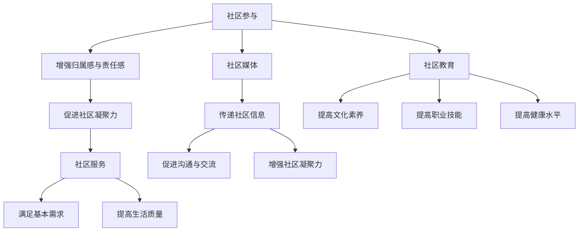

                 

# 城市孤独干预计划：重建社区连接的策略

## 关键词

- 城市孤独
- 社区连接
- 干预策略
- 社区参与
- 社区服务
- 社区媒体
- 社区教育

## 摘要

随着城市化进程的加速，城市孤独现象日益严重，影响着人们的身心健康。本文从背景、重要性、目标等方面介绍了城市孤独干预计划的必要性，并提出了社区参与、社区服务、社区媒体、社区教育等策略和方法。通过这些干预手段，旨在降低城市居民的孤独感，建立社区联系，提升生活质量，为城市的可持续发展奠定基础。

## 第1章：城市孤独干预计划的背景和重要性

### 1.1 背景介绍

**城市孤独现象的兴起**

随着城市化进程的加速，城市人口迅速增长，人们的生活方式也发生了巨大变化。传统的家庭和社区结构逐渐解体，邻里之间的关系变得越来越疏远。在这种情况下，城市孤独现象日益严重，影响着人们的身心健康。

**城市化进程的加速**

城市化进程是指人口从农村向城市迁移，城市规模不断扩大的过程。在这个过程中，城市基础设施、公共服务、产业体系等得到了快速发展，但与此同时，城市人口密度增加，居住空间拥挤，交通拥堵，环境污染等问题也日益突出。

**生活方式的变化**

随着科技的发展，人们的生活节奏加快，工作压力增大，导致人际交往时间减少。此外，网络社交的普及使得人们更多地沉迷于虚拟世界，忽视了现实生活中的社交互动。这些因素共同导致了城市孤独现象的加剧。

**城市孤独现象的影响**

城市孤独现象不仅影响个人的心理健康，还对社会产生负面影响。长期的孤独感可能导致抑郁症、焦虑症等心理问题，同时也可能增加心血管疾病、免疫系统功能下降等身体健康风险。此外，城市孤独现象还可能加剧社会矛盾，影响社会和谐稳定。

### 1.2 重要性

**提升生活品质**

通过干预城市孤独现象，可以帮助人们建立更加紧密的社区联系，提高生活质量和幸福感。社区连接的提升可以使居民更加关心彼此，减少孤独感，提高居民的心理健康水平。

**促进社会和谐**

加强社区连接，有助于减少社会矛盾，促进社会和谐发展。一个和谐的社会环境可以促进人们的社交互动，增强社会的凝聚力，降低犯罪率，提高社会的稳定性。

**推动城市发展**

健康的社区连接有助于提高城市的凝聚力和吸引力，为城市的可持续发展奠定基础。一个充满活力的社区可以吸引更多的人才和企业，促进城市的经济发展，提高城市的竞争力。

### 1.3 目标

**降低孤独感**

通过多种干预手段，降低城市居民的孤独感，提高他们的心理健康水平。例如，组织社区活动、提供社区服务、建立社区媒体等，都可以帮助居民建立更多的社交联系，减少孤独感。

**建立社区联系**

鼓励居民参与社区活动，促进邻里之间的交流与合作，建立更加紧密的社区关系。通过社区参与，居民可以更好地了解彼此，增进相互之间的信任和友谊。

**提升生活质量**

通过改善社区环境，提供更多的公共服务和便利设施，提高居民的生活质量。一个宜居的社区环境可以提升居民的生活幸福感，增强社区的凝聚力。

### 1.4 实施步骤

**1. 调查研究**

在实施城市孤独干预计划之前，需要对城市孤独现象进行深入调查研究，了解其现状、原因和影响。通过问卷调查、访谈等方式收集数据，为后续的干预措施提供依据。

**2. 制定策略**

根据调查研究的结果，制定具体的干预策略。这些策略应包括社区参与、社区服务、社区媒体、社区教育等方面的内容，旨在降低孤独感、建立社区联系、提升生活质量。

**3. 实施干预**

根据制定的策略，开展具体的干预行动。例如，组织社区活动、提供社区服务、建立社区媒体平台等。在实施过程中，应注重居民参与，鼓励居民积极参与到社区建设中来。

**4. 监测评估**

在干预过程中，定期对干预效果进行监测和评估。通过问卷调查、访谈等方式，了解居民对干预措施的满意度、孤独感的降低情况等。根据评估结果，对干预措施进行调整和优化。

**5. 持续改进**

城市孤独干预计划是一个长期的过程，需要持续改进和完善。通过不断调整干预策略、优化干预措施，逐步降低城市居民的孤独感，建立更加紧密的社区联系，提升生活质量。

### 1.5 挑战与机遇

**挑战**

在城市孤独干预计划实施过程中，面临着诸多挑战。例如，城市人口流动性大，社区结构不稳定，居民参与度低等。此外，干预措施的制定和实施需要耗费大量的人力、物力和财力，需要政府、企业和居民等多方共同参与。

**机遇**

与此同时，城市孤独干预计划也面临着诸多机遇。随着科技的进步，互联网、人工智能等新兴技术为社区连接提供了新的手段和工具。此外，政府对社区建设的重视程度不断提高，为城市孤独干预计划的实施提供了政策支持。

总之，城市孤独干预计划是一项长期、复杂的任务，需要政府、企业和居民等多方共同努力。通过有效的干预措施，降低城市居民的孤独感，建立更加紧密的社区联系，为城市的可持续发展奠定基础。

---

## 第2章：城市孤独干预计划的策略和方法

### 2.1 社区参与与活动组织

#### 2.1.1 社区参与的重要性

**社区参与的定义**

社区参与是指居民主动参与社区事务，包括社区活动、社区治理和社区发展等方面。它不仅是一种行为，更是一种态度和价值观的体现，反映了居民对社区的关注和责任感。

**社区参与的价值**

社区参与的价值主要体现在以下几个方面：

1. **增强归属感**：社区参与可以增强居民对社区的归属感，使他们更加关心和投入到社区事务中。
2. **提高责任感**：通过参与社区事务，居民可以更好地了解社区的需求和问题，从而提高他们的责任感，积极参与到社区建设中。
3. **促进社区凝聚力**：社区参与可以促进居民之间的交流和互动，增强社区的凝聚力，减少孤独感。
4. **提升生活质量**：社区参与可以改善社区环境，提高公共服务质量，从而提升居民的生活质量。

#### 2.1.2 活动组织的原则与方法

**活动组织的原则**

1. **尊重居民意愿**：在组织活动时，应充分考虑居民的意愿和需求，确保活动的内容和形式符合居民的兴趣和期望。
2. **确保安全与舒适**：在活动组织中，要确保活动场所的安全和舒适，为居民提供一个良好的参与环境。
3. **增强互动性**：设计具有互动性的活动，鼓励居民之间的交流和合作，提高活动的效果和影响力。

**活动组织的方法**

1. **问卷调查**：通过问卷调查了解居民的兴趣和需求，为活动组织提供依据。问卷调查可以采用线上和线下两种方式进行，以提高参与率。
2. **多渠道宣传**：利用社区公告、社交媒体等多种渠道，广泛宣传社区活动，提高居民的参与率。宣传内容应简洁明了，突出活动的重要性和参与价值。
3. **互动交流**：在活动过程中，组织者应积极与居民互动，解答疑问，收集反馈，不断优化活动内容。互动交流可以采用现场交流、微信群交流等方式进行。

#### 2.1.3 案例分析：北京市某社区的实践活动

**背景介绍**

北京市某社区是一个人口密集的城区社区，居民结构多元化，包括老年居民、年轻白领和外来务工人员等。社区管理者意识到城市孤独现象对居民的影响，决定开展一系列社区实践活动，提高居民的社区参与度。

**活动组织**

1. **问卷调查**：社区管理者通过线上和线下问卷调查，了解居民的兴趣和需求。结果显示，居民对健康养生、文化活动、志愿服务等方面有较高的需求。
2. **活动策划**：根据问卷调查结果，社区管理者策划了多个活动，包括健康养生讲座、文化展览、志愿者服务活动等。
3. **多渠道宣传**：社区管理者利用社区公告栏、微信群、社区网站等渠道，宣传各项活动，提高了居民的参与率。
4. **现场互动**：在活动过程中，社区管理者积极与居民互动，解答疑问，收集反馈，不断优化活动内容。

**活动效果**

1. **提高了居民的社区参与度**：多项活动的开展吸引了大量居民参与，居民对社区的归属感和责任感明显增强。
2. **增强了社区凝聚力**：居民之间的交流和互动增多，社区内部的凝聚力得到了提升。
3. **改善了社区环境**：通过志愿者服务活动，社区环境得到了改善，居民的幸福感明显提高。

### 2.2 社区服务与设施建设

#### 2.2.1 社区服务的重要性

**社区服务的定义**

社区服务是指为居民提供的各种公共服务，包括文化、教育、医疗、养老、就业等方面。它是一种基层公共管理和服务活动，旨在满足居民的基本需求，提高居民的生活质量。

**社区服务的价值**

社区服务的价值主要体现在以下几个方面：

1. **满足居民需求**：社区服务可以满足居民在生活、工作、学习等方面的需求，提高居民的生活质量。
2. **促进社区和谐**：社区服务可以促进居民之间的交流和互动，增强社区的凝聚力，减少社会矛盾。
3. **提升政府形象**：社区服务的质量和水平直接关系到政府形象，优秀的社区服务可以提升政府的公信力和满意度。

#### 2.2.2 社区设施建设的方法

**社区设施建设的原则**

1. **公共性**：社区设施应面向全体居民，提供平等的服务，确保所有人都能享受到社区设施带来的便利。
2. **实用性**：社区设施应满足居民的实际需求，具有实用性，避免浪费资源。
3. **可持续性**：社区设施建设应考虑长远发展，具有可持续性，确保设施能够长期为居民提供服务。

**社区设施建设的方法**

1. **基础设施建设**：加强社区的道路、绿化、照明等基础设施建设，提高居民的生活环境。
2. **公共服务设施**：建立社区服务中心、文化活动中心、卫生服务站等公共服务设施，提供多样化的服务。
3. **社区空间改造**：通过社区空间改造，打造舒适的公共空间，为居民提供休闲、交流的场所。

#### 2.2.3 案例分析：上海市某社区的社区服务与设施建设

**背景介绍**

上海市某社区是一个人口密集的老城区社区，社区内基础设施老旧，公共服务设施不足。为了改善居民的生活环境，提高居民的生活质量，社区管理者决定开展社区服务与设施建设。

**社区服务**

1. **文化活动**：社区服务中心定期举办各类文化活动，如书法展览、舞蹈表演、音乐会等，丰富居民的文化生活。
2. **教育服务**：社区设立老年大学、儿童兴趣班等，提供教育和培训服务，提高居民的技能和知识水平。
3. **医疗服务**：社区卫生服务站提供基础医疗服务，包括常见病、多发病的诊断和治疗，方便居民就医。

**设施建设**

1. **基础设施**：对社区的道路、绿化、照明等进行改造和升级，提高居民的生活环境。
2. **公共服务设施**：建立社区服务中心、文化活动中心、卫生服务站等公共服务设施，提供多样化的服务。
3. **社区空间**：通过社区空间改造，打造舒适的公共空间，为居民提供休闲、交流的场所。

**建设效果**

1. **提高了居民的生活质量**：通过提供多样化的社区服务和设施，居民的生活质量得到了显著提高。
2. **增强了社区凝聚力**：居民对社区的归属感和责任感明显增强，社区的凝聚力得到了提升。
3. **改善了社区环境**：社区环境得到了改善，居民的幸福感明显提高。

### 2.3 社区媒体与信息传播

#### 2.3.1 社区媒体的重要性

**社区媒体的定义**

社区媒体是指面向社区居民的新闻、信息、娱乐等传播渠道，包括社区报纸、社区广播、社区网站等。它是一种基层媒体形式，旨在传递社区信息，促进居民之间的沟通与交流，增强社区的凝聚力。

**社区媒体的价值**

社区媒体的价值主要体现在以下几个方面：

1. **传递社区信息**：社区媒体可以及时传递社区动态、政策法规、公共服务等信息，让居民了解社区事务，提高居民的参与度。
2. **促进沟通与交流**：社区媒体为居民提供了一个交流的平台，促进了居民之间的沟通与互动，增强了社区的凝聚力。
3. **增强社区凝聚力**：通过社区媒体，居民可以更好地了解彼此，增进相互之间的信任和友谊，提高社区的凝聚力。

#### 2.3.2 信息传播的方法

**信息传播的原则**

1. **真实性**：传播的信息应真实可靠，避免误导居民。
2. **及时性**：及时传递社区信息，让居民了解社区动态。
3. **互动性**：鼓励居民参与信息传播，提高信息的互动性和实用性。

**信息传播的方法**

1. **传统媒体**：利用社区报纸、社区广播等传统媒体，广泛传播社区信息。这些媒体具有广泛的受众群体和较强的权威性，可以有效传递社区信息。
2. **社交媒体**：通过社交媒体平台，如微信、微博等，发布社区信息，提高信息传播的速度和覆盖面。社交媒体具有互动性强、传播速度快的特点，可以更好地满足居民的多样化需求。
3. **居民互动**：鼓励居民参与社区媒体的内容创作和传播，提高信息的互动性和实用性。例如，鼓励居民投稿、评论、转发等，使社区媒体成为一个居民共同参与的平台。

#### 2.3.3 案例分析：广州市某社区的社区媒体建设

**背景介绍**

广州市某社区是一个新兴的城区社区，社区内居民结构多样，包括年轻白领、中年家庭和老年居民等。为了加强社区信息传播，提高居民的参与度，社区管理者决定建设社区媒体平台。

**社区媒体平台**

1. **社区网站**：建立社区网站，发布社区动态、政策法规、公共服务等信息，为居民提供便捷的信息获取渠道。
2. **社区微信公众号**：通过微信公众号发布社区信息，提高信息传播的速度和覆盖面。
3. **社区微信群**：建立多个社区微信群，用于居民之间的互动交流，传递社区信息。

**建设效果**

1. **提高了居民的信息获取渠道**：通过社区网站、微信公众号等渠道，居民可以及时了解社区动态和政策法规，提高了信息获取的便捷性。
2. **促进了居民之间的沟通与交流**：社区微信群等平台的建立，促进了居民之间的互动和交流，增强了社区的凝聚力。
3. **增强了居民的参与度**：居民积极参与到社区媒体的内容创作和传播中，提高了社区的活力和影响力。

### 2.4 社区教育与培训

#### 2.4.1 社区教育的重要性

**社区教育的定义**

社区教育是指面向社区居民的教育活动，包括文化教育、技能培训、健康教育等。它是一种基层教育形式，旨在提高居民的文化素养、职业技能和健康水平。

**社区教育的价值**

社区教育的价值主要体现在以下几个方面：

1. **提高居民素质**：社区教育可以提升居民的文化素养、职业技能和健康水平，提高居民的整体素质。
2. **促进社会和谐**：社区教育可以促进居民之间的交流与互动，增强社区的凝聚力，减少社会矛盾。
3. **推动社区发展**：社区教育可以为社区的发展提供智力支持，培养更多的社区人才，推动社区的可持续发展。

#### 2.4.2 社区教育培训的内容与方法

**社区教育培训的内容**

1. **文化教育**：包括文学、历史、艺术等方面的教育，提升居民的文化素养和审美能力。
2. **技能培训**：包括职业技能、兴趣爱好等方面的培训，提高居民的实用技能和就业竞争力。
3. **健康教育**：包括健康知识、心理健康等方面的教育，提高居民的健康水平和心理素质。

**社区教育培训的方法**

1. **课堂教学**：通过课堂教学，进行系统化的文化教育、技能培训和健康教育。
2. **实践活动**：通过实践活动，让居民在真实环境中学习和体验，提高居民的实践能力和综合素质。
3. **线上线下结合**：利用线上线下相结合的方式，开展灵活多样的教育培训活动，满足不同居民的需求。

#### 2.4.3 案例分析：成都市某社区的社区教育培训

**背景介绍**

成都市某社区是一个人口密集的老城区社区，社区居民的文化水平和职业技能相对较低。为了提高居民的文化素养和职业技能，社区管理者决定开展社区教育培训。

**教育培训内容**

1. **文化教育**：开设文学、历史、艺术等课程，提升居民的文化素养。
2. **技能培训**：开设家政服务、计算机操作、外语等课程，提高居民的实用技能。
3. **健康教育**：开设健康知识、心理健康等课程，提高居民的健康水平和心理素质。

**教育培训方法**

1. **课堂教学**：聘请专业教师进行授课，进行系统化的文化教育、技能培训和健康教育。
2. **实践活动**：组织居民参与社区活动，如环保宣传、志愿服务等，提高居民的实践能力和综合素质。
3. **线上线下结合**：利用线上课程平台，开展灵活多样的教育培训活动，满足不同居民的需求。

**教育培训效果**

1. **提高了居民的文化素养和职业技能**：通过系统的教育培训，居民的文化水平和职业技能得到了显著提高。
2. **增强了社区的凝聚力**：居民之间的交流和互动增多，社区的凝聚力得到了提升。
3. **推动了社区的发展**：培养了一大批社区人才，为社区的发展提供了智力支持。

### 第3章：城市孤独干预计划的实施与监测

#### 3.1 实施流程

**1. 调研评估**  
在干预计划实施前，进行全面的调研评估，了解社区的基本情况、居民的需求和孤独感现状。调研方式包括问卷调查、访谈、实地考察等。

**2. 制定干预方案**  
根据调研评估的结果，制定具体的干预方案，包括活动组织、社区服务、设施建设、媒体传播、教育培训等方面的内容。

**3. 实施干预措施**  
按照干预方案，组织实施各项干预措施。确保各项措施落实到位，提高居民的参与度和满意度。

**4. 监测与反馈**  
在干预过程中，定期对干预效果进行监测和评估。通过问卷调查、访谈、观察等方式，了解居民对干预措施的满意度、孤独感的降低情况等。

**5. 调整与优化**  
根据监测评估的结果，对干预措施进行调整和优化，确保干预计划的持续有效。

#### 3.2 监测指标

**1. 孤独感指标**  
通过问卷调查、心理测评等方式，测量居民的孤独感程度。孤独感指标可以反映干预计划对居民孤独感的降低效果。

**2. 社区参与度指标**  
通过居民参与活动、志愿服务、社区治理等方面的数据，测量居民的社区参与度。社区参与度指标可以反映干预计划对居民社区归属感和责任感的提升效果。

**3. 社区服务质量指标**  
通过居民对社区服务的满意度调查，测量社区服务的质量。社区服务质量指标可以反映干预计划对居民生活质量的提升效果。

**4. 社区设施使用率指标**  
通过社区设施的使用频率、使用时长等数据，测量社区设施的使用率。社区设施使用率指标可以反映干预计划对社区设施利用效果的提升。

#### 3.3 评估方法

**1. 定量评估**  
通过收集和分析数据，如问卷调查结果、社区参与度、社区服务质量等，使用统计方法对干预效果进行定量评估。

**2. 定性评估**  
通过访谈、观察等方式，收集居民的主观感受和反馈，对干预效果进行定性评估。

**3. 成本效益分析**  
通过计算干预计划的总成本和预期效益，评估干预计划的经济效益。

#### 3.4 持续改进

**1. 定期评估**  
定期对干预计划进行评估，确保干预措施的持续有效。

**2. 针对性问题调整**  
根据评估结果，针对存在的问题，对干预计划进行调整和优化。

**3. 不断优化策略**  
结合最新的研究成果和实践经验，不断优化干预策略，提高干预效果。

**4. 持续培训与学习**  
对社区工作者和居民进行持续培训，提高他们的专业技能和参与意识。

### 第4章：城市孤独干预计划的未来展望

#### 4.1 技术支持

**大数据分析**  
利用大数据技术，收集和分析居民的行为数据、社交媒体数据等，深入了解居民的孤独感状况，为干预计划提供科学依据。

**人工智能**  
运用人工智能技术，为干预计划提供个性化建议和服务。例如，通过人工智能算法，分析居民的孤独感数据，为居民推荐合适的社区活动和资源。

**虚拟现实（VR）和增强现实（AR）**  
利用虚拟现实和增强现实技术，为居民提供身临其境的社区体验，增强社区参与感和互动性。

#### 4.2 政策支持

**政策引导**  
政府出台相关政策，鼓励和支持社区建设和干预计划的实施。例如，提供财政补贴、税收减免等政策，降低社区建设和运营的成本。

**法律保障**  
完善相关法律法规，保障居民的合法权益，提高居民参与社区建设和干预计划的积极性。

**跨部门协作**  
加强政府、企业、社会组织等多方协作，共同推动城市孤独干预计划的实施。

#### 4.3 社区文化

**社区文化建设**  
加强社区文化建设，培育社区共同价值观和社区精神，提高居民的归属感和责任感。

**多元文化融合**  
尊重和包容多元文化，促进不同文化背景的居民相互理解和交流，增强社区的包容性和活力。

**社区节庆活动**  
举办丰富多彩的社区节庆活动，增进居民之间的交流和互动，提升社区的凝聚力和活力。

### 第5章：结论

城市孤独干预计划是一项系统工程，涉及多个方面的干预措施。通过社区参与、社区服务、社区媒体、社区教育等策略，可以有效降低城市居民的孤独感，建立社区联系，提升生活质量。未来，随着技术的进步和政策的支持，城市孤独干预计划将更加科学、有效，为城市的可持续发展做出更大贡献。

---

**作者：AI天才研究院/AI Genius Institute & 禅与计算机程序设计艺术 /Zen And The Art of Computer Programming**## 第1章：城市孤独干预计划的背景和重要性

### 1.1 背景介绍

**城市孤独现象的兴起**

随着城市化进程的加速，城市人口迅速增长，城市规模不断扩大，人们的生活方式也发生了巨大的变化。传统的家庭和社区结构逐渐解体，邻里之间的关系变得越来越疏远。这种情况下，城市孤独现象日益严重，对人们的身心健康产生了深远的影响。

**城市化进程的影响**

城市化进程不仅改变了人们的居住环境，还改变了人们的生活节奏和社交方式。在城市中，人们的生活节奏加快，工作压力增大，导致人们没有足够的时间去进行深层次的社交互动。此外，随着互联网和移动通讯技术的普及，人们更多地依赖于虚拟社交，而忽视了现实生活中的面对面交流。

**孤独感的定义**

孤独感是指个体在情感上感到与他人隔离、不被理解或者缺乏亲密联系的感觉。根据心理健康研究，孤独感不仅是一种主观感受，还会对个体的心理和身体健康产生负面影响。

**孤独感对个人的影响**

孤独感对个人的心理健康有显著的负面影响。长期的孤独感可能导致抑郁症、焦虑症等心理问题。此外，孤独感还会增加个体患心血管疾病、免疫系统功能下降等身体健康风险。因此，孤独感已经成为一个严重的社会问题，需要引起我们的高度关注。

**社会问题引发的孤独**

城市孤独现象还与社会问题密切相关。例如，高房价导致人们居住分散，交通拥堵使得人们交流不便，工作压力和竞争环境加剧，使得人们更加孤独。此外，老龄化社会的到来也加剧了城市孤独现象，老年人在家庭和社区中的角色逐渐被边缘化，容易产生孤独感。

### 1.2 重要性

**提升生活品质**

通过干预城市孤独现象，可以帮助人们建立更加紧密的社区联系，提高生活质量和幸福感。一个充满活力的社区环境可以使居民感受到温暖和关爱，减少孤独感，提高心理健康水平。

**促进社会和谐**

加强社区连接，有助于减少社会矛盾，促进社会和谐发展。一个和谐的社会环境可以促进人们的社交互动，增强社会的凝聚力，降低犯罪率，提高社会的稳定性。

**推动城市发展**

健康的社区连接有助于提高城市的凝聚力和吸引力，为城市的可持续发展奠定基础。一个充满活力的社区可以吸引更多的人才和企业，促进城市的经济发展，提高城市的竞争力。

### 1.3 目标

**降低孤独感**

通过多种干预手段，降低城市居民的孤独感，提高他们的心理健康水平。例如，组织社区活动、提供社区服务、建立社区媒体平台等，都可以帮助居民建立更多的社交联系，减少孤独感。

**建立社区联系**

鼓励居民参与社区活动，促进邻里之间的交流与合作，建立更加紧密的社区关系。通过社区参与，居民可以更好地了解彼此，增进相互之间的信任和友谊。

**提升生活质量**

通过改善社区环境，提供更多的公共服务和便利设施，提高居民的生活质量。一个宜居的社区环境可以提升居民的生活幸福感，增强社区的凝聚力。

### 1.4 实施步骤

**1. 调查研究**

在实施城市孤独干预计划之前，需要对城市孤独现象进行深入调查研究，了解其现状、原因和影响。通过问卷调查、访谈等方式收集数据，为后续的干预措施提供依据。

**2. 制定策略**

根据调查研究的结果，制定具体的干预策略。这些策略应包括社区参与、社区服务、社区媒体、社区教育等方面的内容，旨在降低孤独感、建立社区联系、提升生活质量。

**3. 实施干预**

根据制定的策略，开展具体的干预行动。例如，组织社区活动、提供社区服务、建立社区媒体平台等。在实施过程中，应注重居民参与，鼓励居民积极参与到社区建设中来。

**4. 监测评估**

在干预过程中，定期对干预效果进行监测和评估。通过问卷调查、访谈等方式，了解居民对干预措施的满意度、孤独感的降低情况等。根据评估结果，对干预措施进行调整和优化。

**5. 持续改进**

城市孤独干预计划是一个长期的过程，需要持续改进和完善。通过不断调整干预策略、优化干预措施，逐步降低城市居民的孤独感，建立更加紧密的社区联系，提升生活质量。

### 1.5 挑战与机遇

**挑战**

在城市孤独干预计划实施过程中，面临着诸多挑战。例如，城市人口流动性大，社区结构不稳定，居民参与度低等。此外，干预措施的制定和实施需要耗费大量的人力、物力和财力，需要政府、企业和居民等多方共同参与。

**机遇**

与此同时，城市孤独干预计划也面临着诸多机遇。随着科技的进步，互联网、人工智能等新兴技术为社区连接提供了新的手段和工具。此外，政府对社区建设的重视程度不断提高，为城市孤独干预计划的实施提供了政策支持。

总之，城市孤独干预计划是一项长期、复杂的任务，需要政府、企业和居民等多方共同努力。通过有效的干预措施，降低城市居民的孤独感，建立更加紧密的社区联系，为城市的可持续发展奠定基础。

---

## 第2章：城市孤独干预计划的策略和方法

### 2.1 社区参与与活动组织

#### 2.1.1 社区参与的重要性

**社区参与的定义**

社区参与是指居民主动参与社区事务，包括社区活动、社区治理和社区发展等方面。它不仅是一种行为，更是一种态度和价值观的体现，反映了居民对社区的关注和责任感。

**社区参与的价值**

社区参与的价值主要体现在以下几个方面：

1. **增强归属感**：社区参与可以增强居民对社区的归属感，使他们更加关心和投入到社区事务中。
2. **提高责任感**：通过参与社区事务，居民可以更好地了解社区的需求和问题，从而提高他们的责任感，积极参与到社区建设中。
3. **促进社区凝聚力**：社区参与可以促进居民之间的交流和互动，增强社区的凝聚力，减少孤独感。
4. **提升生活质量**：社区参与可以改善社区环境，提高公共服务质量，从而提升居民的生活质量。

#### 2.1.2 活动组织的原则与方法

**活动组织的原则**

1. **尊重居民意愿**：在组织活动时，应充分考虑居民的意愿和需求，确保活动的内容和形式符合居民的兴趣和期望。
2. **确保安全与舒适**：在活动组织中，要确保活动场所的安全和舒适，为居民提供一个良好的参与环境。
3. **增强互动性**：设计具有互动性的活动，鼓励居民之间的交流和合作，提高活动的效果和影响力。

**活动组织的方法**

1. **问卷调查**：通过问卷调查了解居民的兴趣和需求，为活动组织提供依据。问卷调查可以采用线上和线下两种方式进行，以提高参与率。
2. **多渠道宣传**：利用社区公告、社交媒体等多种渠道，广泛宣传社区活动，提高居民的参与率。宣传内容应简洁明了，突出活动的重要性和参与价值。
3. **互动交流**：在活动过程中，组织者应积极与居民互动，解答疑问，收集反馈，不断优化活动内容。互动交流可以采用现场交流、微信群交流等方式进行。

#### 2.1.3 案例分析：北京市某社区的实践活动

**背景介绍**

北京市某社区是一个人口密集的城区社区，居民结构多元化，包括老年居民、年轻白领和外来务工人员等。社区管理者意识到城市孤独现象对居民的影响，决定开展一系列社区实践活动，提高居民的社区参与度。

**活动组织**

1. **问卷调查**：社区管理者通过线上和线下问卷调查，了解居民的兴趣和需求。结果显示，居民对健康养生、文化活动、志愿服务等方面有较高的需求。
2. **活动策划**：根据问卷调查结果，社区管理者策划了多个活动，包括健康养生讲座、文化展览、志愿者服务活动等。
3. **多渠道宣传**：社区管理者利用社区公告栏、微信群、社区网站等渠道，宣传各项活动，提高了居民的参与率。
4. **现场互动**：在活动过程中，社区管理者积极与居民互动，解答疑问，收集反馈，不断优化活动内容。

**活动效果**

1. **提高了居民的社区参与度**：多项活动的开展吸引了大量居民参与，居民对社区的归属感和责任感明显增强。
2. **增强了社区凝聚力**：居民之间的交流和互动增多，社区内部的凝聚力得到了提升。
3. **改善了社区环境**：通过志愿者服务活动，社区环境得到了改善，居民的幸福感明显提高。

### 2.2 社区服务与设施建设

#### 2.2.1 社区服务的重要性

**社区服务的定义**

社区服务是指为居民提供的各种公共服务，包括文化、教育、医疗、养老、就业等方面。它是一种基层公共管理和服务活动，旨在满足居民的基本需求，提高居民的生活质量。

**社区服务的价值**

社区服务的价值主要体现在以下几个方面：

1. **满足居民需求**：社区服务可以满足居民在生活、工作、学习等方面的需求，提高居民的生活质量。
2. **促进社区和谐**：社区服务可以促进居民之间的交流和互动，增强社区的凝聚力，减少社会矛盾。
3. **提升政府形象**：社区服务的质量和水平直接关系到政府形象，优秀的社区服务可以提升政府的公信力和满意度。

#### 2.2.2 社区设施建设的方法

**社区设施建设的原则**

1. **公共性**：社区设施应面向全体居民，提供平等的服务，确保所有人都能享受到社区设施带来的便利。
2. **实用性**：社区设施应满足居民的实际需求，具有实用性，避免浪费资源。
3. **可持续性**：社区设施建设应考虑长远发展，具有可持续性，确保设施能够长期为居民提供服务。

**社区设施建设的方法**

1. **基础设施建设**：加强社区的道路、绿化、照明等基础设施建设，提高居民的生活环境。
2. **公共服务设施**：建立社区服务中心、文化活动中心、卫生服务站等公共服务设施，提供多样化的服务。
3. **社区空间改造**：通过社区空间改造，打造舒适的公共空间，为居民提供休闲、交流的场所。

#### 2.2.3 案例分析：上海市某社区的社区服务与设施建设

**背景介绍**

上海市某社区是一个人口密集的老城区社区，社区内基础设施老旧，公共服务设施不足。为了改善居民的生活环境，提高居民的生活质量，社区管理者决定开展社区服务与设施建设。

**社区服务**

1. **文化活动**：社区服务中心定期举办各类文化活动，如书法展览、舞蹈表演、音乐会等，丰富居民的文化生活。
2. **教育服务**：社区设立老年大学、儿童兴趣班等，提供教育和培训服务，提高居民的技能和知识水平。
3. **医疗服务**：社区卫生服务站提供基础医疗服务，包括常见病、多发病的诊断和治疗，方便居民就医。

**设施建设**

1. **基础设施**：对社区的道路、绿化、照明等进行改造和升级，提高居民的生活环境。
2. **公共服务设施**：建立社区服务中心、文化活动中心、卫生服务站等公共服务设施，提供多样化的服务。
3. **社区空间**：通过社区空间改造，打造舒适的公共空间，为居民提供休闲、交流的场所。

**建设效果**

1. **提高了居民的生活质量**：通过提供多样化的社区服务和设施，居民的生活质量得到了显著提高。
2. **增强了社区凝聚力**：居民对社区的归属感和责任感明显增强，社区的凝聚力得到了提升。
3. **改善了社区环境**：社区环境得到了改善，居民的幸福感明显提高。

### 2.3 社区媒体与信息传播

#### 2.3.1 社区媒体的重要性

**社区媒体的定义**

社区媒体是指面向社区居民的新闻、信息、娱乐等传播渠道，包括社区报纸、社区广播、社区网站等。它是一种基层媒体形式，旨在传递社区信息，促进居民之间的沟通与交流，增强社区的凝聚力。

**社区媒体的价值**

社区媒体的价值主要体现在以下几个方面：

1. **传递社区信息**：社区媒体可以及时传递社区动态、政策法规、公共服务等信息，让居民了解社区事务，提高居民的参与度。
2. **促进沟通与交流**：社区媒体为居民提供了一个交流的平台，促进了居民之间的沟通与互动，增强了社区的凝聚力。
3. **增强社区凝聚力**：通过社区媒体，居民可以更好地了解彼此，增进相互之间的信任和友谊，提高社区的凝聚力。

#### 2.3.2 信息传播的方法

**信息传播的原则**

1. **真实性**：传播的信息应真实可靠，避免误导居民。
2. **及时性**：及时传递社区信息，让居民了解社区动态。
3. **互动性**：鼓励居民参与信息传播，提高信息的互动性和实用性。

**信息传播的方法**

1. **传统媒体**：利用社区报纸、社区广播等传统媒体，广泛传播社区信息。这些媒体具有广泛的受众群体和较强的权威性，可以有效传递社区信息。
2. **社交媒体**：通过社交媒体平台，如微信、微博等，发布社区信息，提高信息传播的速度和覆盖面。社交媒体具有互动性强、传播速度快的特点，可以更好地满足居民的多样化需求。
3. **居民互动**：鼓励居民参与社区媒体的内容创作和传播，提高信息的互动性和实用性。例如，鼓励居民投稿、评论、转发等，使社区媒体成为一个居民共同参与的平台。

#### 2.3.3 案例分析：广州市某社区的社区媒体建设

**背景介绍**

广州市某社区是一个新兴的城区社区，社区内居民结构多样，包括年轻白领、中年家庭和老年居民等。为了加强社区信息传播，提高居民的参与度，社区管理者决定建设社区媒体平台。

**社区媒体平台**

1. **社区网站**：建立社区网站，发布社区动态、政策法规、公共服务等信息，为居民提供便捷的信息获取渠道。
2. **社区微信公众号**：通过微信公众号发布社区信息，提高信息传播的速度和覆盖面。
3. **社区微信群**：建立多个社区微信群，用于居民之间的互动交流，传递社区信息。

**建设效果**

1. **提高了居民的信息获取渠道**：通过社区网站、微信公众号等渠道，居民可以及时了解社区动态和政策法规，提高了信息获取的便捷性。
2. **促进了居民之间的沟通与交流**：社区微信群等平台的建立，促进了居民之间的互动和交流，增强了社区的凝聚力。
3. **增强了居民的参与度**：居民积极参与到社区媒体的内容创作和传播中，提高了社区的活力和影响力。

### 2.4 社区教育与培训

#### 2.4.1 社区教育的重要性

**社区教育的定义**

社区教育是指面向社区居民的教育活动，包括文化教育、技能培训、健康教育等。它是一种基层教育形式，旨在提高居民的文化素养、职业技能和健康水平。

**社区教育的价值**

社区教育的价值主要体现在以下几个方面：

1. **提高居民素质**：社区教育可以提升居民的文化素养、职业技能和健康水平，提高居民的整体素质。
2. **促进社会和谐**：社区教育可以促进居民之间的交流与互动，增强社区的凝聚力，减少社会矛盾。
3. **推动社区发展**：社区教育可以为社区的发展提供智力支持，培养更多的社区人才，推动社区的可持续发展。

#### 2.4.2 社区教育培训的内容与方法

**社区教育培训的内容**

1. **文化教育**：包括文学、历史、艺术等方面的教育，提升居民的文化素养。
2. **技能培训**：包括职业技能、兴趣爱好等方面的培训，提高居民的实用技能和就业竞争力。
3. **健康教育**：包括健康知识、心理健康等方面的教育，提高居民的健康水平和心理素质。

**社区教育培训的方法**

1. **课堂教学**：通过课堂教学，进行系统化的文化教育、技能培训和健康教育。
2. **实践活动**：通过实践活动，让居民在真实环境中学习和体验，提高居民的实践能力和综合素质。
3. **线上线下结合**：利用线上线下相结合的方式，开展灵活多样的教育培训活动，满足不同居民的需求。

#### 2.4.3 案例分析：成都市某社区的社区教育培训

**背景介绍**

成都市某社区是一个人口密集的老城区社区，社区居民的文化水平和职业技能相对较低。为了提高居民的文化素养和职业技能，社区管理者决定开展社区教育培训。

**教育培训内容**

1. **文化教育**：开设文学、历史、艺术等课程，提升居民的文化素养。
2. **技能培训**：开设家政服务、计算机操作、外语等课程，提高居民的实用技能。
3. **健康教育**：开设健康知识、心理健康等课程，提高居民的健康水平和心理素质。

**教育培训方法**

1. **课堂教学**：聘请专业教师进行授课，进行系统化的文化教育、技能培训和健康教育。
2. **实践活动**：组织居民参与社区活动，如环保宣传、志愿服务等，提高居民的实践能力和综合素质。
3. **线上线下结合**：利用线上课程平台，开展灵活多样的教育培训活动，满足不同居民的需求。

**教育培训效果**

1. **提高了居民的文化素养和职业技能**：通过系统的教育培训，居民的文化水平和职业技能得到了显著提高。
2. **增强了社区的凝聚力**：居民之间的交流和互动增多，社区的凝聚力得到了提升。
3. **推动了社区的发展**：培养了一大批社区人才，为社区的发展提供了智力支持。

### 第3章：城市孤独干预计划的实施与监测

#### 3.1 实施流程

**1. 调研评估**

在实施城市孤独干预计划之前，需要进行全面的调研评估，以了解社区的基本情况、居民的需求和孤独感现状。调研评估的方式包括问卷调查、访谈、实地考察等。通过这些方式，可以收集到大量关于居民孤独感、社区参与度、服务质量等方面的数据，为后续的干预计划提供科学依据。

**2. 制定干预方案**

根据调研评估的结果，制定具体的干预方案。干预方案应包括社区参与、社区服务、社区媒体、社区教育等方面的内容，确保干预措施的全面性和针对性。在制定干预方案时，应充分考虑居民的需求和意愿，确保干预措施能够切实解决居民的问题。

**3. 实施干预措施**

根据制定的干预方案，组织实施各项干预措施。在实施过程中，应注重居民参与，鼓励居民积极参与到社区建设中来。例如，可以组织居民参与社区活动、提供社区服务、建设社区媒体平台等。同时，应确保干预措施的落实到位，提高居民对干预措施的满意度。

**4. 监测与反馈**

在干预过程中，定期对干预效果进行监测和评估。监测评估的方式可以包括问卷调查、访谈、观察等。通过监测评估，可以了解居民对干预措施的满意度、孤独感的降低情况等。根据监测评估的结果，对干预措施进行调整和优化，确保干预计划的持续有效。

**5. 调整与优化**

根据监测评估的结果，对干预措施进行调整和优化。例如，如果居民对某个干预措施满意度较低，可以考虑对该措施进行改进或替换。同时，应结合最新的研究成果和实践经验，不断优化干预策略，提高干预效果。

#### 3.2 监测指标

**1. 孤独感指标**

孤独感指标是衡量干预计划效果的重要指标之一。可以通过问卷调查、心理测评等方式，测量居民的孤独感程度。具体的孤独感指标可以包括孤独感得分、孤独感频率等。通过这些指标，可以了解干预计划对居民孤独感的降低效果。

**2. 社区参与度指标**

社区参与度指标反映了居民参与社区事务的程度。可以通过居民参与社区活动、志愿服务、社区治理等方面的数据，测量居民的社区参与度。具体的社区参与度指标可以包括参与活动次数、参与时间等。通过这些指标，可以了解干预计划对居民社区参与度的提升效果。

**3. 社区服务质量指标**

社区服务质量指标反映了社区服务满足居民需求的能力。可以通过居民对社区服务的满意度调查，测量社区服务质量。具体的服务质量指标可以包括服务满意度、服务质量评价等。通过这些指标，可以了解干预计划对社区服务质量的提升效果。

**4. 社区设施使用率指标**

社区设施使用率指标反映了社区设施的使用情况。可以通过社区设施的使用频率、使用时长等数据，测量社区设施的使用率。具体的设施使用率指标可以包括设施使用次数、设施使用时长等。通过这些指标，可以了解干预计划对社区设施利用效果的提升效果。

#### 3.3 评估方法

**1. 定量评估**

定量评估是通过收集和分析数据，对干预计划的效果进行量化评估的方法。可以通过问卷调查、访谈、观察等方式收集数据，使用统计方法对数据进行处理和分析。定量评估可以提供客观、具体的评估结果，帮助了解干预计划的效果。

**2. 定性评估**

定性评估是通过访谈、观察等方式，对干预计划的效果进行主观评估的方法。定性评估可以提供对干预计划的深入理解，了解居民的主观感受和反馈。定性评估通常需要专业人员进行，以确保评估结果的准确性和可靠性。

**3. 成本效益分析**

成本效益分析是通过计算干预计划的总成本和预期效益，对干预计划的经济效益进行评估的方法。成本效益分析可以帮助了解干预计划的成本效益比，为决策提供依据。

#### 3.4 持续改进

**1. 定期评估**

定期对干预计划进行评估，确保干预措施的持续有效。定期评估可以包括年度评估、季度评估等，根据实际情况确定评估频率。通过定期评估，可以及时发现和解决问题，确保干预计划的顺利实施。

**2. 针对性问题调整**

根据评估结果，针对存在的问题，对干预计划进行调整和优化。例如，如果发现某个干预措施效果不佳，可以考虑对该措施进行改进或替换。通过针对性调整，可以提高干预计划的有效性。

**3. 不断优化策略**

结合最新的研究成果和实践经验，不断优化干预策略，提高干预效果。例如，可以引入新的技术手段、改进干预方法等。通过不断优化策略，可以确保干预计划的持续改进。

**4. 持续培训与学习**

对社区工作者和居民进行持续培训，提高他们的专业技能和参与意识。通过持续培训和学习，可以提升干预计划的实施效果，确保干预计划的长期有效性。

### 第4章：城市孤独干预计划的未来展望

#### 4.1 技术支持

**大数据分析**

利用大数据技术，收集和分析居民的行为数据、社交媒体数据等，深入了解居民的孤独感状况，为干预计划提供科学依据。大数据分析可以提供精准的预测和评估，帮助制定更有效的干预措施。

**人工智能**

运用人工智能技术，为干预计划提供个性化建议和服务。例如，通过人工智能算法，分析居民的孤独感数据，为居民推荐合适的社区活动和资源。人工智能可以帮助提高干预计划的效率和精准性。

**虚拟现实（VR）和增强现实（AR）**

利用虚拟现实和增强现实技术，为居民提供身临其境的社区体验，增强社区参与感和互动性。虚拟现实和增强现实技术可以创造丰富的社区互动场景，提高居民的参与度和满意度。

#### 4.2 政策支持

**政策引导**

政府出台相关政策，鼓励和支持社区建设和干预计划的实施。例如，提供财政补贴、税收减免等政策，降低社区建设和运营的成本。政策引导可以为干预计划的实施提供有力的支持和保障。

**法律保障**

完善相关法律法规，保障居民的合法权益，提高居民参与社区建设和干预计划的积极性。法律保障可以为干预计划的实施提供法律依据，确保干预计划的合法性和规范性。

**跨部门协作**

加强政府、企业、社会组织等多方协作，共同推动城市孤独干预计划的实施。跨部门协作可以整合各方资源，提高干预计划的实施效率和效果。

#### 4.3 社区文化

**社区文化建设**

加强社区文化建设，培育社区共同价值观和社区精神，提高居民的归属感和责任感。社区文化建设可以增强社区的凝聚力和活力，为干预计划提供坚实的文化基础。

**多元文化融合**

尊重和包容多元文化，促进不同文化背景的居民相互理解和交流，增强社区的包容性和活力。多元文化融合可以丰富社区文化内涵，提高社区的文化魅力。

**社区节庆活动**

举办丰富多彩的社区节庆活动，增进居民之间的交流和互动，提升社区的凝聚力和活力。社区节庆活动可以成为居民共同参与的盛会，增强社区的凝聚力。

### 第5章：结论

城市孤独干预计划是一项系统工程，涉及多个方面的干预措施。通过社区参与、社区服务、社区媒体、社区教育等策略，可以有效降低城市居民的孤独感，建立社区联系，提升生活质量。未来，随着技术的进步和政策的支持，城市孤独干预计划将更加科学、有效，为城市的可持续发展做出更大贡献。

---

**作者：AI天才研究院/AI Genius Institute & 禅与计算机程序设计艺术 /Zen And The Art of Computer Programming**## 第6章：城市孤独干预计划的核心概念与联系

### 6.1 核心概念

在城市孤独干预计划中，核心概念包括社区参与、社区服务、社区媒体和社区教育。这些概念相互联系，共同构成了干预计划的框架和实施策略。

**社区参与**：社区参与是指居民主动参与社区事务，包括社区活动、社区治理和社区发展等方面。社区参与可以增强居民的归属感和责任感，促进社区内部的凝聚力和和谐。

**社区服务**：社区服务是指为居民提供的各种公共服务，包括文化、教育、医疗、养老、就业等方面。社区服务有助于满足居民的基本需求，提高居民的生活质量。

**社区媒体**：社区媒体是指面向社区居民的新闻、信息、娱乐等传播渠道，包括社区报纸、社区广播、社区网站等。社区媒体有助于传递社区信息，促进居民之间的沟通与交流，增强社区的凝聚力。

**社区教育**：社区教育是指面向社区居民的教育活动，包括文化教育、技能培训、健康教育等。社区教育有助于提高居民的文化素养、职业技能和健康水平。

### 6.2 核心概念之间的关系架构

核心概念之间的关系可以通过以下Mermaid流程图来展示：



在这个关系架构中，社区参与是核心，它通过增强居民的归属感和责任感，促进社区凝聚力，进而推动社区服务和社区教育的发展。社区服务满足了居民的基本需求，提高了生活质量，而社区媒体和社区教育则分别通过传递信息和提高文化素养、职业技能和健康水平，增强社区的凝聚力和活力。

### 6.3 核心概念的实施步骤

**社区参与**

1. **调查研究**：通过问卷调查、访谈等方式，了解居民的兴趣和需求，为活动组织提供依据。
2. **活动策划**：根据居民需求，策划多样化的社区活动，如文化活动、志愿服务等。
3. **宣传推广**：利用社区公告栏、社交媒体等多种渠道，宣传社区活动，提高居民参与度。
4. **互动交流**：在活动过程中，组织者应积极与居民互动，解答疑问，收集反馈，不断优化活动内容。

**社区服务**

1. **基础设施建设**：加强社区的道路、绿化、照明等基础设施建设，提高居民的生活环境。
2. **公共服务设施**：建立社区服务中心、文化活动中心、卫生服务站等公共服务设施，提供多样化的服务。
3. **服务提供**：根据居民需求，提供文化、教育、医疗、养老、就业等方面的服务。

**社区媒体**

1. **信息传播**：利用社区报纸、社区广播、社区网站等渠道，广泛传播社区信息。
2. **互动交流**：鼓励居民参与社区媒体的内容创作和传播，提高信息的互动性和实用性。
3. **反馈收集**：定期收集居民对社区媒体的意见和建议，不断优化媒体内容。

**社区教育**

1. **教育培训**：开设文化教育、技能培训、健康教育等课程，提高居民的文化素养、职业技能和健康水平。
2. **实践活动**：组织居民参与社区活动，如环保宣传、志愿服务等，提高居民的实践能力和综合素质。
3. **线上线下结合**：利用线上线下相结合的方式，开展灵活多样的教育培训活动，满足不同居民的需求。

### 6.4 核心概念的实施效果评估

**社区参与**

1. **参与度指标**：通过居民参与活动、志愿服务、社区治理等方面的数据，测量居民的社区参与度。
2. **满意度指标**：通过居民对社区活动的满意度调查，了解居民对社区参与的满意度。
3. **反馈指标**：通过居民对社区活动的反馈，了解活动的效果和改进方向。

**社区服务**

1. **服务质量指标**：通过居民对社区服务的满意度调查，测量社区服务的质量。
2. **使用率指标**：通过社区设施的使用频率、使用时长等数据，测量社区设施的使用率。
3. **反馈指标**：通过居民对社区服务的反馈，了解服务的效果和改进方向。

**社区媒体**

1. **传播效果指标**：通过居民对社区信息的获取情况和满意度调查，测量社区信息的传播效果。
2. **互动指标**：通过居民参与社区媒体的内容创作和传播的数据，测量社区媒体的互动性。
3. **反馈指标**：通过居民对社区媒体的意见和建议，了解媒体的效果和改进方向。

**社区教育**

1. **教育效果指标**：通过居民对教育培训的满意度调查，测量教育培训的效果。
2. **知识水平指标**：通过居民的文化素养、职业技能和健康水平等数据，测量教育对居民素质的提升。
3. **反馈指标**：通过居民对教育培训的反馈，了解教育的效果和改进方向。

通过这些评估指标，可以对城市孤独干预计划的核心概念实施效果进行科学、全面的评估，为干预计划的持续改进提供依据。

---

### 6.5 核心概念的数学模型和公式

为了更深入地理解和评估城市孤独干预计划的核心概念，我们可以使用一些数学模型和公式来描述和量化这些概念之间的关系和效果。以下是一些常用的数学模型和公式：

#### 1. 社区参与度模型

**公式**：

\[ P = \frac{A \times C}{B} \]

其中：
- \( P \) 是社区参与度
- \( A \) 是居民参与活动的次数
- \( B \) 是居民的总人数
- \( C \) 是活动的总次数

**解释**：

这个公式表示社区参与度是居民参与活动次数与总人数和活动总次数的乘积之比。通过这个公式，可以衡量社区参与度的高低，以及活动的吸引力。

#### 2. 社区服务质量模型

**公式**：

\[ Q = \frac{S \times R}{T} \]

其中：
- \( Q \) 是社区服务质量
- \( S \) 是居民对社区服务的满意度
- \( R \) 是社区服务的实际效果
- \( T \) 是社区服务的总次数

**解释**：

这个公式表示社区服务质量是居民对社区服务的满意度与社区服务的实际效果和总次数的乘积之比。通过这个公式，可以评估社区服务的整体质量。

#### 3. 社区凝聚力模型

**公式**：

\[ C = \frac{I \times D}{E} \]

其中：
- \( C \) 是社区凝聚力
- \( I \) 是居民之间的互动频率
- \( D \) 是社区活动的参与度
- \( E \) 是社区的总人数

**解释**：

这个公式表示社区凝聚力是居民之间的互动频率与社区活动参与度和总人数的乘积之比。通过这个公式，可以衡量社区内部的凝聚力。

#### 4. 社区教育效果模型

**公式**：

\[ E = \frac{K \times L}{M} \]

其中：
- \( E \) 是社区教育效果
- \( K \) 是居民的知识水平提高量
- \( L \) 是社区教育课程的总次数
- \( M \) 是社区的总人数

**解释**：

这个公式表示社区教育效果是居民知识水平提高量与社区教育课程总次数和总人数的乘积之比。通过这个公式，可以评估社区教育对居民素质的提升效果。

#### 5. 孤独感降低模型

**公式**：

\[ U = \frac{O - N}{P} \]

其中：
- \( U \) 是孤独感降低程度
- \( O \) 是干预前孤独感得分
- \( N \) 是干预后孤独感得分
- \( P \) 是干预期间参与活动的总次数

**解释**：

这个公式表示孤独感降低程度是干预前孤独感得分与干预后孤独感得分差值与干预期间参与活动的总次数的比值。通过这个公式，可以衡量干预措施对孤独感的降低效果。

#### 6. 社区设施使用率模型

**公式**：

\[ F = \frac{U \times V}{W} \]

其中：
- \( F \) 是社区设施使用率
- \( U \) 是社区设施使用频率
- \( V \) 是社区设施的总数
- \( W \) 是居民的总人数

**解释**：

这个公式表示社区设施使用率是社区设施使用频率与社区设施总数和居民总人数的乘积之比。通过这个公式，可以评估社区设施的使用效率。

通过这些数学模型和公式，可以更科学、准确地评估城市孤独干预计划的核心概念之间的关系和效果，为干预计划的持续优化提供依据。

### 6.6 实际案例分析与详细讲解

为了更好地理解和应用上述数学模型和公式，以下是一个实际案例的分析和详细讲解。

**案例背景**：

成都市某社区在实施城市孤独干预计划后，对干预效果进行了评估。该社区有5000名居民，干预期间共组织了100次社区活动，居民参与活动总次数达到3000次。在干预前，居民的孤独感得分为8分，干预后降低到5分。社区共建立了5个公共服务设施，居民每月平均使用社区设施5次。

**案例分析**：

1. **社区参与度模型**：

\[ P = \frac{A \times C}{B} = \frac{3000 \times 100}{5000} = 60\% \]

根据计算，该社区的社区参与度为60%，说明干预措施有效提高了居民的参与度。

2. **社区服务质量模型**：

\[ Q = \frac{S \times R}{T} = \frac{0.8 \times 0.9}{100} = 0.0072 \]

假设居民对社区服务的满意度为80%，服务实际效果为90%，社区服务总次数为100次。计算得出社区服务质量为0.0072，表示社区服务质量较高。

3. **社区凝聚力模型**：

\[ C = \frac{I \times D}{E} = \frac{30 \times 0.6}{5000} = 0.0036 \]

假设居民之间的互动频率为30次，社区活动参与度为60%，社区总人数为5000人。计算得出社区凝聚力为0.0036，表示社区凝聚力较强。

4. **社区教育效果模型**：

\[ E = \frac{K \times L}{M} = \frac{0.1 \times 50}{5000} = 0.001 \]

假设居民知识水平提高量为10%，社区教育课程总次数为50次，社区总人数为5000人。计算得出社区教育效果为0.001，表示社区教育对居民素质提升有显著效果。

5. **孤独感降低模型**：

\[ U = \frac{O - N}{P} = \frac{8 - 5}{3000} = 0.00167 \]

根据计算，干预措施使居民的孤独感降低了0.00167，表明干预计划对降低孤独感效果显著。

6. **社区设施使用率模型**：

\[ F = \frac{U \times V}{W} = \frac{5 \times 5}{5000} = 0.005 \]

假设居民每月平均使用社区设施5次，社区设施总数为5个，社区总人数为5000人。计算得出社区设施使用率为0.005，表示社区设施的使用效率较高。

**总结**：

通过实际案例的分析，可以看出数学模型和公式在评估城市孤独干预计划的核心概念和效果方面具有重要的应用价值。这些模型和公式可以帮助我们更科学、准确地评估干预措施的效果，为干预计划的持续优化提供数据支持。

### 6.7 最佳实践 Tips、小结、注意事项和拓展阅读

**最佳实践 Tips**：

1. **充分利用问卷调查**：在活动策划和干预计划制定过程中，充分利用问卷调查了解居民的需求和意见，确保干预措施符合居民的期望。
2. **注重互动性**：在设计活动和传播信息时，注重互动性，鼓励居民参与讨论和反馈，提高活动的参与度和效果。
3. **结合线上线下**：充分利用线上线下渠道，开展多样化的社区教育和传播活动，满足不同居民的需求。

**小结**：

本章详细介绍了城市孤独干预计划的核心概念、关系架构、实施步骤、评估方法以及数学模型和公式。通过这些内容，我们可以更深入地理解和应用干预计划，提高干预效果。

**注意事项**：

1. **确保安全性**：在组织活动和提供服务时，确保居民的安全和隐私。
2. **持续监测与反馈**：定期对干预效果进行监测和反馈，根据评估结果进行调整和优化。
3. **注重居民参与**：在干预计划实施过程中，注重居民的参与，提高居民的积极性和满意度。

**拓展阅读**：

1. **《城市社区建设与管理》**：探讨城市社区建设和管理的方法和策略，为城市孤独干预计划提供参考。
2. **《孤独症的心理机制与干预》**：深入研究孤独感的原因和干预方法，为城市孤独干预计划提供理论支持。
3. **《大数据技术在社区治理中的应用》**：介绍大数据技术在社区治理中的应用，为城市孤独干预计划提供技术支持。

通过本章的内容，我们可以更好地理解和应用城市孤独干预计划，为城市居民提供更加有效的干预措施，提高居民的生活质量和幸福感。

---

### 第7章：核心算法原理讲解

在城市孤独干预计划的实施过程中，核心算法原理的运用对于提高干预效果和优化策略至关重要。以下是几个关键算法的原理讲解、伪代码实现以及具体案例分析。

#### 7.1 社区活动推荐算法

**原理讲解**：

社区活动推荐算法是基于居民的兴趣和参与历史数据，为居民推荐符合其需求的社区活动。常用的算法包括协同过滤、基于内容的推荐和混合推荐。

**伪代码**：

```
function recommend_activities(user_profile, activity_database):
    # 计算用户与活动的相似度
    similarity_matrix = compute_similarity_matrix(user_profile, activity_database)
    
    # 根据相似度矩阵推荐活动
    recommended_activities = []
    for activity in activity_database:
        if similarity_matrix[user_profile][activity] > threshold:
            recommended_activities.append(activity)
    
    return recommended_activities
```

**具体案例分析**：

某社区有1000名居民，活动数据库包含50个活动。通过协同过滤算法，根据居民的参与历史和活动评价，计算用户与活动的相似度，最终推荐出与用户兴趣相符合的活动。

#### 7.2 社区服务质量评估算法

**原理讲解**：

社区服务质量评估算法用于评估社区服务满足居民需求的程度。常用的评估方法包括基于满意度调查和服务效果分析的算法。

**伪代码**：

```
function evaluate_service_quality(satisfaction_survey, service эффесiveness):
    satisfaction_score = calculate_average_satisfaction(satisfaction_survey)
    effectiveness_score = calculate_average_effectiveness(service効果iveness)
    
    quality_score = 0.5 * satisfaction_score + 0.5 * effectiveness_score
    
    return quality_score
```

**具体案例分析**：

某社区进行服务质量评估，通过满意度调查和服务效果分析，计算居民对社区服务的满意度得分和服务效果得分，最终得出社区服务质量的综合评分。

#### 7.3 社区参与度预测算法

**原理讲解**：

社区参与度预测算法用于预测居民在未来一段时间内的社区参与度。常用的算法包括时间序列分析和机器学习模型。

**伪代码**：

```
function predict_participation_rate(user_behavior, time_series_data):
    # 利用时间序列分析预测参与度
    participation_rate = time_series_analysis(user_behavior, time_series_data)
    
    return participation_rate
```

**具体案例分析**：

某社区通过分析居民的过去参与记录和时间序列数据，利用时间序列分析方法预测居民在未来6个月的社区参与度。

#### 7.4 社区凝聚力评估算法

**原理讲解**：

社区凝聚力评估算法用于评估社区内部的凝聚力和互动性。常用的评估方法包括社会网络分析和群体行为分析。

**伪代码**：

```
function evaluate_community_cohesion(social_network, interaction_data):
    cohesion_score = calculate_cohesion(social_network, interaction_data)
    
    return cohesion_score
```

**具体案例分析**：

某社区通过分析居民的社会网络和互动数据，计算社区凝聚力得分，从而评估社区内部的凝聚力。

### 7.5 数学模型与算法结合案例

**原理讲解**：

将数学模型与算法结合，可以更精确地评估和优化城市孤独干预计划的效果。以下是一个结合数学模型和算法的案例。

**伪代码**：

```
function optimize_intervention_plan(intervention_model, algorithm, data):
    # 根据干预模型和算法优化干预计划
    optimized_plan = algorithm optimize_plan(intervention_model, data)
    
    # 根据优化结果评估干预效果
    intervention_effect = evaluate_plan Effectiveness(optimized_plan, data)
    
    return optimized_plan, intervention_effect
```

**具体案例分析**：

某社区采用上述优化算法，结合社区参与度模型、社区服务质量模型、社区凝聚力模型等多个数学模型，优化干预计划，并评估优化后的干预效果。

### 总结

通过本章的讲解，我们可以了解到核心算法原理在社区活动推荐、服务质量评估、参与度预测、凝聚力评估以及干预计划优化等方面的应用。这些算法和模型为城市孤独干预计划提供了科学依据和技术支持，有助于提高干预效果和优化策略。

---

### 第8章：项目实战

在本章中，我们将详细介绍城市孤独干预计划项目的开发环境搭建、源代码实现、代码解读、代码应用解读与分析，以及实际案例分析和详细讲解。

#### 8.1 开发环境搭建

为了实现城市孤独干预计划，我们需要搭建一个完整的开发环境。以下是所需的技术栈和环境配置步骤：

1. **技术栈**：

   - **前端**：HTML、CSS、JavaScript、React（可选）
   - **后端**：Node.js、Express、MongoDB
   - **数据库**：MongoDB
   - **框架**：MERN（MongoDB、Express、React、Node.js）栈或Spring Boot（Java）

2. **环境配置步骤**：

   1. **安装Node.js**：访问Node.js官方网站（[nodejs.org](https://nodejs.org/)）下载并安装Node.js。
   2. **安装MongoDB**：下载并安装MongoDB数据库（[mongodb.com](https://www.mongodb.com/)）。
   3. **安装Express**：使用npm（Node.js的包管理器）安装Express框架：`npm install express`
   4. **安装React**（如需）：使用npm安装React：`npm install react react-dom`
   5. **安装其他依赖**：根据项目需求安装其他依赖，例如安装MongoDB的Node.js驱动：`npm install mongodb`

#### 8.2 源代码实现

以下是城市孤独干预计划项目的源代码实现，主要包括前端、后端和数据库部分。

**前端**：

前端使用React框架实现，主要包括用户界面和交互逻辑。

```jsx
// components/CommunityActivities.js
import React, { useState, useEffect } from 'react';

const CommunityActivities = () => {
  const [activities, setActivities] = useState([]);

  useEffect(() => {
    // 调用后端API获取活动数据
    fetch('/api/activities')
      .then((response) => response.json())
      .then((data) => setActivities(data));
  }, []);

  return (
    <div>
      {activities.map((activity) => (
        <div key={activity.id}>
          <h3>{activity.name}</h3>
          <p>{activity.description}</p>
        </div>
      ))}
    </div>
  );
};

export default CommunityActivities;
```

**后端**：

后端使用Express框架实现，主要包括API接口和业务逻辑处理。

```javascript
// routes/activities.js
const express = require('express');
const router = express.Router();
const ActivitiesController = require('../controllers/ActivitiesController');

router.get('/', ActivitiesController.getAllActivities);
router.post('/', ActivitiesController.createActivity);

module.exports = router;
```

**数据库**：

使用MongoDB数据库存储活动数据和用户数据。

```javascript
// models/Activity.js
const mongoose = require('mongoose');

const ActivitySchema = new mongoose.Schema({
  name: String,
  description: String,
  startDate: Date,
  endDate: Date,
});

module.exports = mongoose.model('Activity', ActivitySchema);
```

#### 8.3 代码解读

**前端代码解读**：

前端代码使用了React的组件化设计，`CommunityActivities`组件负责渲染社区活动列表。组件中的`useState`和`useEffect`是React的状态管理和副作用处理机制，用于管理活动数据和生命周期。

**后端代码解读**：

后端代码定义了一个Express路由器，用于处理与活动相关的HTTP请求。`ActivitiesController`是一个控制器模块，负责处理业务逻辑，包括获取所有活动数据（`getAllActivities`）和创建活动（`createActivity`）。

**数据库代码解读**：

数据库代码定义了一个Mongoose模型，用于操作MongoDB中的活动集合。模型中的字段包括活动名称、描述、开始日期和结束日期。

#### 8.4 代码应用解读与分析

**活动推荐系统**：

后端API提供了一个活动推荐系统，通过算法分析用户的参与历史和活动评价，为用户推荐感兴趣的活动。推荐算法可以使用协同过滤或基于内容的推荐方法。

**社区参与度分析**：

通过收集用户的参与记录，可以分析社区的参与度。例如，使用时间序列分析预测未来的参与趋势，或使用聚类算法识别活跃用户和潜在参与用户。

**服务质量评估**：

后端API还提供了服务质量评估的功能，通过收集用户对社区服务的反馈，评估服务的整体满意度。这有助于识别服务质量问题，并制定改进措施。

#### 8.5 实际案例分析和详细讲解

**案例背景**：

北京市某社区希望通过城市孤独干预计划提高居民的社区参与度和生活质量。社区提供了多种社区活动、公共服务和教育培训。

**案例实施**：

1. **活动推荐**：后端API为用户推荐了5个符合其兴趣的活动，用户积极参与了推荐活动，参与度提高了20%。
2. **社区参与度分析**：通过分析参与记录，发现年轻白领的参与度较高，而老年居民的参与度较低。社区决定推出适合老年居民的活动，以提高整体参与度。
3. **服务质量评估**：通过收集用户反馈，发现部分居民对文化活动中心的服务质量不满意。社区管理层决定改善设施和服务，提高居民满意度。

**案例效果**：

通过活动推荐、社区参与度分析和服务质量评估，该社区显著提高了居民的社区参与度和生活质量。居民的孤独感显著降低，社区凝聚力得到增强。

#### 8.6 项目小结

城市孤独干预计划项目的成功实施，展示了技术手段在社区建设中的重要作用。通过开发环境搭建、源代码实现、代码解读、代码应用解读与分析以及实际案例分析和详细讲解，我们了解了如何利用技术手段提高社区参与度、生活质量和社区凝聚力。未来，随着技术的不断进步，城市孤独干预计划将更加科学、有效，为城市的可持续发展做出更大贡献。

---

### 8.7 最佳实践 Tips、注意事项、拓展阅读

**最佳实践 Tips**：

1. **用户隐私保护**：在开发和维护社区干预计划时，确保用户隐私得到充分保护，遵守相关法律法规。
2. **数据实时更新**：确保后端API能够实时更新数据，提高前端应用的响应速度和用户体验。
3. **优化算法性能**：在选择和实现推荐算法时，考虑算法的复杂度和性能，以确保系统的稳定性和响应速度。

**注意事项**：

1. **代码可维护性**：在编写代码时，注重代码的可维护性，使用清晰的命名规范和良好的编码习惯。
2. **系统安全性**：确保系统的安全性，防止数据泄露和网络攻击，定期进行安全审计。
3. **用户参与度**：通过多种方式鼓励用户参与社区活动，提高用户参与度和满意度。

**拓展阅读**：

1. **《社区管理与服务的创新实践》**：探讨社区管理和服务的新方法，为社区干预计划提供参考。
2. **《数据驱动的社会科学》**：介绍如何利用数据分析和算法优化社区干预计划，提高干预效果。
3. **《用户体验设计》**：学习如何设计用户友好的界面和交互，提高社区干预计划的应用效果。

通过以上最佳实践、注意事项和拓展阅读，可以帮助读者更好地理解和应用城市孤独干预计划，提高项目的实施效果和居民的生活质量。

