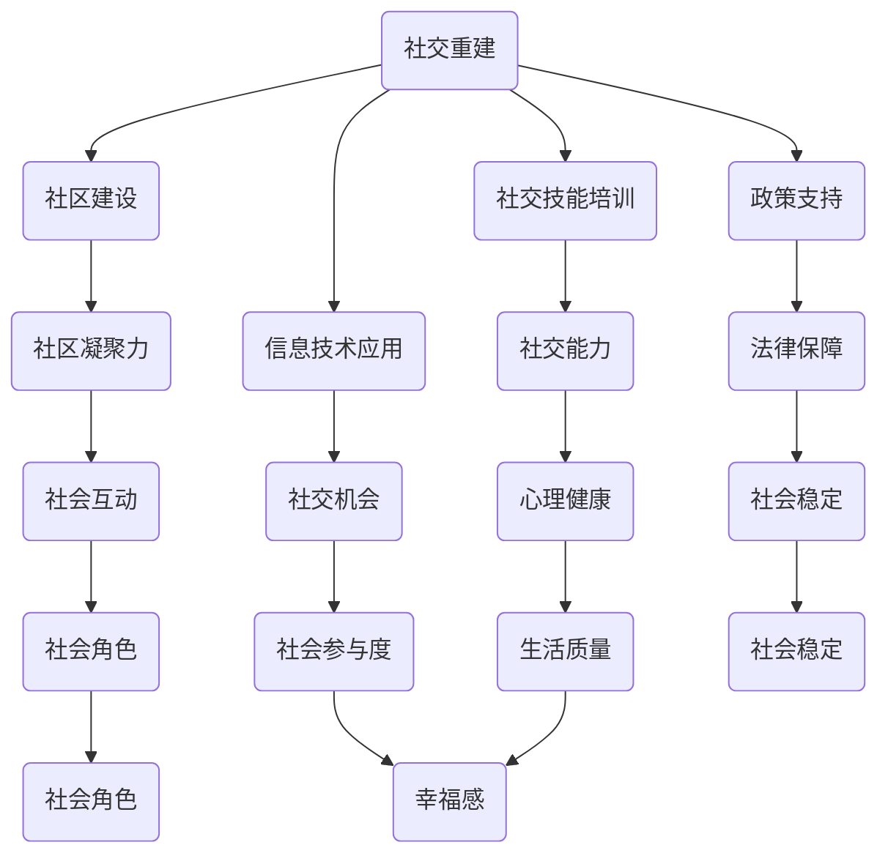

                 

### 城市孤独干预：Metropolis中的社交重建

#### 关键词：
- 城市孤独
- 社交重建
- metropolis
- 心理健康
- 社会工程

#### 摘要：
随着城市化进程的加快，城市孤独已成为现代社会的一大难题。本文以Metropolis为背景，探讨了城市孤独干预中的社交重建策略。通过深入分析城市孤独的背景、核心概念、实践方法、技术应用、政策影响以及案例分析，本文旨在为应对城市孤独提供系统化、全面化的解决方案，推动城市社会的和谐发展。

## 第1章：引言

### 1.1 城市孤独的定义与背景

城市孤独，又称城市隔离，指的是在城市化进程中，个体由于社交隔离、情感疏离、生活节奏快等原因，所产生的一种深刻的孤独感和无助感。这种孤独不仅影响个体的心理健康，还可能引发一系列社会问题。

城市化进程的加快，使得人们从农村向城市迁移，人口密度增加，但与此同时，邻里关系的疏离、工作压力的增大、生活节奏的加快，都加剧了城市孤独的发生。据研究，城市孤独已成为全球范围内普遍存在的问题，影响范围广泛，尤其在中老年人和年轻人中表现尤为明显。

### 1.2 城市孤独的影响

城市孤独对个体和社会都会产生深远的影响。对个体而言，城市孤独可能导致心理健康问题，如抑郁、焦虑、睡眠障碍等。长期的城市孤独还会影响个体的生活质量，降低幸福感和满足感。对社会而言，城市孤独可能引发社会不稳定因素，如犯罪率上升、社会凝聚力下降等。

### 1.3 Metropolis中的社交重建概念

Metropolis作为典型的现代化大都市，其城市孤独问题尤为突出。社交重建，即通过一系列策略和措施，重构城市社会中的社交网络，提高个体的社交参与度和幸福感。社交重建的核心在于重新构建人与人之间的联系，增强社区凝聚力，从而缓解城市孤独。

### 1.4 书籍结构概述

本文将从以下章节对城市孤独干预中的社交重建进行详细探讨：

- 第2章：城市孤独的现状
- 第3章：社交重建的核心概念
- 第4章：Metropolis中的社交重建实践
- 第5章：技术与社交重建
- 第6章：政策与社交重建
- 第7章：案例分析
- 第8章：未来展望

通过这些章节，本文旨在为城市孤独干预提供系统化的理论支持和实践指导。

### 第2章：城市孤独的现状

#### 2.1 城市孤独的历史与发展

城市孤独并不是一个新出现的问题，它随着城市化进程的推进而逐渐凸显。在工业化初期，由于人口的大量涌入城市，工作和生活的压力增大，社交网络的断裂导致了城市孤独现象的出现。随着时间的推移，随着科技的发展和社会结构的变迁，城市孤独问题逐渐复杂化。

在20世纪末和21世纪初，随着信息技术的迅猛发展，互联网和社交媒体的普及，城市孤独问题得到了更多的关注。尽管这些技术提供了更多的社交机会，但同时也导致了“虚拟社交”的泛滥，使得个体在现实生活中的社交能力下降，加剧了城市孤独。

#### 2.2 城市孤独的类型与特点

城市孤独可以分为几种类型，包括情感孤独、社交孤独和物理孤独。

- **情感孤独**：个体在情感上感到与他人隔离，缺乏亲密的朋友和家庭成员的支持。
- **社交孤独**：个体在社交活动中的参与度低，感到被排斥或无法融入社会群体。
- **物理孤独**：个体在空间上与他人隔离，缺乏面对面交流的机会。

这些类型的孤独往往相互交织，共同影响个体的心理健康和生活质量。

城市孤独的特点包括：

- **隐蔽性**：城市孤独不易被察觉，个体可能不愿意或不知道寻求帮助。
- **普遍性**：城市孤独在城市人口中普遍存在，尤其是中老年人和年轻人。
- **长期性**：城市孤独的影响往往是长期的，难以在短时间内得到缓解。

#### 2.3 城市孤独的统计数据

据世界卫生组织（WHO）统计，全球有超过3亿人受到孤独症的困扰，其中大部分是城市居民。在中国，随着城市化进程的加快，城市孤独问题也日益突出。据《中国城市孤独指数报告》显示，我国城市孤独人群比例高达46%，其中35-45岁的人群孤独感最为强烈。

这些统计数据表明，城市孤独已成为一个全球性的社会问题，亟需采取有效的干预措施。了解城市孤独的现状和特点，是实施社交重建策略的前提。

### 第3章：社交重建的核心概念

#### 3.1 社交重建的定义与目标

社交重建是指通过一系列策略和措施，重构城市社会中的社交网络，提高个体的社交参与度和幸福感。其核心目标是缓解城市孤独，增强社会凝聚力，促进个体和社区的和谐发展。

社交重建的定义可以从以下几个方面进行阐述：

- **社会层面**：通过改善社交环境，增强社会互动，提高社区凝聚力。
- **个体层面**：通过提高个体的社交技能和参与度，改善心理健康状况。
- **技术层面**：利用信息技术和社交媒体，提供更多的社交机会和平台。

#### 3.2 社交重建的理论基础

社交重建的理论基础主要包括以下几个方面的理论：

- **社会支持理论**：强调社会支持在缓解孤独感和提高心理健康中的作用。
- **社会互动理论**：认为社交互动是维持个体社会角色和身份的重要途径。
- **生态系统理论**：强调个体与环境的相互作用，认为环境因素对个体的社交行为和心理状态具有重要影响。

这些理论为社交重建提供了理论支持，指导实践中的具体操作。

#### 3.3 社交重建的策略与方法

社交重建的策略与方法主要包括以下几个方面：

- **社区建设**：通过改善社区环境和组织社区活动，增强居民的归属感和参与度。
- **社交技能培训**：提供社交技能培训，帮助个体提高社交能力，增强社交信心。
- **信息技术应用**：利用社交媒体和在线平台，提供更多的社交机会和社交支持。
- **政策支持**：通过制定和实施相关政策，为社交重建提供法律和制度保障。

这些策略和方法相互结合，共同推动社交重建的进程。

#### 社交重建的核心概念关系架构

下面是一个社交重建的核心概念关系架构的Mermaid流程图：

这个关系架构展示了社交重建的核心概念之间的相互作用和影响，为理解社交重建提供了直观的视角。

### 第4章：Metropolis中的社交重建实践

#### 4.1 社交空间的设计与建设

在Metropolis中，社交空间的设计与建设是社交重建的重要一环。设计一个功能多样、氛围友好、易于使用的社交空间，可以吸引居民参与，提高社交互动的质量。

**设计原则**：

- **多功能性**：社交空间应具备多种功能，如休闲、娱乐、教育等，以满足不同居民的需求。
- **舒适性**：空间布局应注重舒适性和私密性，提供安静的阅读区、放松的休息区等。
- **易达性**：社交空间应易于到达，方便居民日常使用。

**建设实践**：

- **公共图书馆**：作为知识的源泉，公共图书馆不仅是学习的好地方，也是居民交流的场所。
- **社区中心**：社区中心可以举办各种活动，如艺术展览、讲座、社团聚会等，促进居民之间的互动。
- **城市广场**：城市广场不仅是休闲的好去处，也是居民进行日常社交的场所。

#### 4.2 社交活动的策划与组织

社交活动的策划与组织是社交重建的重要手段。通过定期举办各类活动，可以激发居民的参与热情，增强社区的凝聚力。

**活动类型**：

- **文化类活动**：如音乐会、戏剧表演、艺术展览等，可以丰富居民的文化生活，提高艺术素养。
- **教育类活动**：如讲座、培训课程、工作坊等，可以帮助居民提升职业技能，增进知识交流。
- **体育类活动**：如运动会、健身课程、徒步旅行等，可以促进居民的身体健康，增强社交互动。

**组织实践**：

- **社区志愿者**：鼓励居民参与志愿者活动，组织社区服务项目，增强居民的归属感和责任感。
- **社区论坛**：定期举办社区论坛，让居民就社区事务发表意见，提高社区的民主参与度。
- **节日庆祝**：在重要节日举办庆祝活动，增强居民的集体认同感和节日氛围。

#### 4.3 社交服务的提供与推广

社交服务的提供与推广是社交重建的保障。通过提供多样化的社交服务，可以帮助居民克服社交障碍，提高社交技能，增强社交信心。

**服务内容**：

- **社交辅导**：为有社交障碍的居民提供专业的社交辅导，帮助他们提高社交能力。
- **社交培训**：开展社交技能培训，教授居民如何与他人建立联系、沟通和维系关系。
- **社交网络**：建立线上线下相结合的社交网络平台，为居民提供交流互动的机会。

**推广实践**：

- **社区宣传**：通过社区公告栏、社交媒体、宣传册等渠道，宣传社交服务的内容和重要性，提高居民的知晓率和参与度。
- **社区合作**：与学校、企业、社会组织等合作，共同推广社交服务，扩大服务覆盖面。
- **试点项目**：在社区中试点推广社交服务，积累经验，逐步扩大服务范围。

通过社交空间的设计与建设、社交活动的策划与组织、以及社交服务的提供与推广，Metropolis可以逐步实现社交重建，缓解城市孤独问题。

### 第5章：技术与社交重建

#### 5.1 社交技术在城市孤独干预中的应用

随着信息技术的飞速发展，社交技术（Social Technology）在城市孤独干预中扮演着越来越重要的角色。这些技术不仅为城市居民提供了更多的社交机会，还通过数据分析、智能推荐等方式，提高了社交互动的质量和效率。

**社交媒体**：社交媒体平台如Facebook、Twitter、微信等，已经成为城市居民日常生活的一部分。它们不仅提供了即时沟通的工具，还通过好友推荐、兴趣标签等功能，帮助用户发现和建立新的社交联系。

**在线社区**：在线社区（如Reddit、知乎等）为用户提供了讨论和分享的场所，用户可以在这些平台上就共同兴趣展开深入交流，从而缓解社交孤独。

**虚拟现实（VR）社交**：虚拟现实技术为用户提供了沉浸式的社交体验。用户可以在虚拟环境中与他人互动，参加活动，甚至一起游戏，这种体验有助于提高社交参与感和互动质量。

#### 5.2 社交网络分析

社交网络分析（Social Network Analysis, SNA）是一种研究社交网络结构和关系的分析方法。通过社交网络分析，我们可以了解社交网络的密度、中心性、凝聚力等特性，从而为社交重建提供数据支持。

**密度分析**：社交网络密度是指网络中实际存在的连接数与可能存在的最大连接数之比。高密度的社交网络有助于信息的快速传播和社交关系的建立。

**中心性分析**：社交网络中心性是指个体在网络中的连接程度和影响力。中心性高的个体往往是社交网络的枢纽，对网络的稳定性和信息流动具有重要作用。

**凝聚力分析**：社交网络凝聚力是指网络内部成员之间的紧密程度。高凝聚力的社交网络能够更好地维持社交关系，减少社交断裂。

**案例分析**：以Metropolis中的某个社区为例，通过社交网络分析，可以发现社区中社交网络的薄弱环节，如社交断层、社交孤立等。针对这些薄弱环节，可以采取相应的干预措施，如组织社区活动、提供社交培训等，以增强社区的社交凝聚力。

#### 5.3 数据分析与社交重建

数据分析在社交重建中发挥着至关重要的作用。通过对大数据的收集和分析，我们可以了解居民的社交行为、需求偏好，从而制定更精准的社交重建策略。

**用户行为分析**：通过分析用户在社交媒体、在线社区等平台的行为数据，我们可以了解用户的社交活跃度、互动频率、话题偏好等，从而为社交活动的设计和组织提供参考。

**需求预测**：通过分析居民的需求和行为数据，可以预测哪些社交活动、服务和资源会受到用户的欢迎，从而更好地满足居民的需求。

**案例研究**：在某社区实施社交重建项目时，通过数据收集和分析，发现社区中老年人对于健康咨询和娱乐活动有较高的需求。因此，社区中心组织了针对老年人的健康讲座和兴趣小组活动，得到了居民的高度参与和好评。

**数据可视化**：通过数据可视化技术，我们可以将复杂的社交网络结构和数据分析结果以图形化的形式呈现，使决策者和社会大众更容易理解，从而提高决策的科学性和有效性。

#### 社交重建技术与方法的整合

社交重建技术的应用需要多种方法的整合，包括社交空间设计、社交活动策划、社交服务提供等。通过将这些技术与方法有机结合起来，可以形成一套完整的社交重建体系。

- **线上线下结合**：在线社交平台和线下社交空间相互补充，为居民提供多元化的社交渠道。
- **数据分析与反馈**：通过数据分析了解社交活动的效果，及时调整策略，提高活动的针对性和效果。
- **多方参与**：鼓励政府、企业、社会组织和居民共同参与，形成多元化的社交重建力量。

通过技术与方法的整合，可以更有效地应对城市孤独问题，实现社交重建的目标。

### 第6章：政策与社交重建

#### 6.1 政策在社交重建中的作用

政策在社交重建中起着至关重要的作用。通过制定和实施相关政策，政府可以为社交重建提供法律和制度保障，推动社会的和谐发展。

**政策目标**：

- **缓解城市孤独**：通过政策干预，降低城市孤独的发生率，提高居民的生活质量和幸福感。
- **增强社会凝聚力**：通过政策引导，增强社区凝聚力，减少社会分裂和冲突。
- **促进公平与包容**：通过政策支持，保障弱势群体的权益，实现社会的公平与包容。

**政策手段**：

- **财政支持**：政府可以通过财政拨款，支持社区建设和社交活动的举办，提供必要的物质保障。
- **税收优惠**：对涉及社交重建的企业和社会组织提供税收优惠，鼓励更多资源投入到社交重建中。
- **法律法规**：通过制定相关法律法规，规范社交空间的建设和管理，保障居民的社交权益。

#### 6.2 政策制定与执行

政策制定与执行是社交重建的关键环节。一个有效的政策体系需要明确的目标、科学的制定方法和严格的执行机制。

**制定过程**：

- **需求调研**：通过调研了解居民的需求和问题，确定政策制定的方向和目标。
- **专家咨询**：邀请相关领域的专家参与政策制定，提供科学依据和专业建议。
- **公众参与**：通过公众参与，征求居民的意见和建议，确保政策的民主性和科学性。

**执行机制**：

- **明确责任**：明确各级政府和部门的职责，确保政策执行的有序进行。
- **监督评估**：建立监督机制，对政策执行情况进行定期评估，确保政策目标的实现。
- **反馈调整**：根据评估结果，及时调整政策内容和方法，提高政策的实效性。

#### 6.3 政策评估与反馈

政策评估与反馈是政策执行的重要组成部分。通过评估和反馈，可以及时发现政策执行中的问题，进行调整和优化，提高政策的实效性。

**评估方法**：

- **定量评估**：通过数据分析，评估政策实施的效果和影响，如居民满意度、参与度等。
- **定性评估**：通过问卷调查、访谈等方式，了解居民的反馈和意见，分析政策执行中的问题和挑战。

**反馈机制**：

- **公开反馈**：通过政府网站、社交媒体等渠道，公开政策执行的反馈信息，增加政策透明度。
- **持续改进**：根据评估和反馈结果，对政策进行持续改进，提高政策的实效性和适应性。

通过政策评估与反馈，可以确保社交重建政策的科学性和有效性，为城市孤独干预提供有力的制度保障。

### 第7章：案例研究

#### 7.1 案例一：纽约市的社交重建项目

纽约市作为全球知名的大都市，其城市孤独问题尤为突出。为了应对这一问题，纽约市实施了一系列社交重建项目，取得了显著成效。

**项目背景**：

- **城市孤独问题突出**：纽约市人口众多，生活节奏快，社交隔离现象严重，城市孤独问题突出。
- **政策支持**：纽约市政府高度重视城市孤独问题，通过制定相关政策，为社交重建提供资金和资源支持。

**项目内容**：

- **社交空间建设**：在社区中心、公园等公共场所增设社交空间，提供舒适的交流环境。
- **社交活动策划**：定期举办各种社交活动，如舞蹈课、烹饪课、音乐会等，吸引居民参与。
- **社交服务提供**：提供社交辅导、心理健康咨询等服务，帮助居民克服社交障碍。

**效果评估**：

- **居民参与度提高**：社交活动参与度显著提高，社区居民的社交网络得到重建。
- **心理健康改善**：居民的心理健康状况得到改善，抑郁和焦虑症状减轻。
- **社区凝聚力增强**：社区凝聚力增强，居民之间的互动增加，社区氛围更加和谐。

**经验总结**：

- **政策支持**：政策支持是社交重建项目成功的关键。
- **多元化活动**：多元化的社交活动能够满足不同居民的需求，提高参与度。
- **专业服务**：提供专业的社交服务和心理健康支持，有助于解决居民的社交问题。

#### 7.2 案例二：东京的社交空间创新

东京作为亚洲最大的都市，其城市孤独问题也引起了广泛关注。东京市政府通过创新社交空间建设，推动了社交重建的进程。

**项目背景**：

- **高人口密度**：东京人口密度高，城市空间有限，传统的社交空间建设面临挑战。
- **技术优势**：东京在信息技术领域具有先进的技术优势，为社交空间创新提供了可能。

**项目内容**：

- **虚拟社交空间**：通过虚拟现实（VR）技术，创建虚拟社交空间，为居民提供沉浸式的社交体验。
- **线上社区**：建立线上社区平台，提供多种社交活动，如线上聚会、讨论小组等。
- **智能推荐**：利用大数据和人工智能技术，为居民推荐感兴趣的活动和社交对象，提高社交互动质量。

**效果评估**：

- **社交参与度提高**：虚拟社交空间和线上社区吸引了大量居民参与，社交参与度显著提高。
- **互动质量提升**：智能推荐系统提高了社交互动的质量，居民更容易找到志同道合的伙伴。
- **心理健康改善**：居民的社交参与和互动质量提升，心理健康状况得到改善。

**经验总结**：

- **技术创新**：利用先进技术，创新社交空间建设，提高了社交互动的质量和效率。
- **线上线下结合**：线上线下相结合的社交模式，为居民提供了多元化的社交渠道。
- **智能推荐**：智能推荐系统能够提高社交互动的匹配度，有助于构建高质量的社交网络。

#### 7.3 案例三：新加坡的社区建设策略

新加坡作为全球知名的花园城市，其社区建设策略在社交重建中发挥了重要作用。

**项目背景**：

- **社区意识强**：新加坡居民社区意识强，积极参与社区建设和活动。
- **政策支持**：新加坡政府通过一系列政策，鼓励社区建设和社交活动。

**项目内容**：

- **邻里中心**：在每个社区设立邻里中心，提供社交、文化、教育等服务。
- **社区活动**：定期举办社区活动，如节日庆典、文化活动、运动比赛等，增强居民之间的互动。
- **社区志愿者**：鼓励居民参与志愿者活动，提供社区服务和互助支持。

**效果评估**：

- **社区凝聚力增强**：社区活动和邻里中心的建立，增强了居民之间的凝聚力，社区氛围更加和谐。
- **居民满意度提高**：居民对社区建设和服务的满意度显著提高，生活质量得到提升。
- **社会凝聚力增强**：通过社区建设和社交活动，新加坡的社会凝聚力得到增强，社会和谐稳定。

**经验总结**：

- **政策支持**：政策支持是社区建设成功的关键，政府需提供充分的资源和政策保障。
- **居民参与**：居民的积极参与是社区建设成功的基础，通过社区活动和志愿者活动，提高居民的参与度和归属感。
- **多元化服务**：提供多元化的社区服务和活动，满足不同居民的需求，增强社区的包容性。

通过以上三个案例，我们可以看到，不同的城市和地区在应对城市孤独问题时，采取了不同的社交重建策略，但都取得了显著的成效。这些案例为其他城市和地区提供了宝贵的经验和借鉴。

### 第8章：未来展望

#### 8.1 社交重建的挑战与机遇

在未来的发展中，社交重建面临着一系列挑战和机遇。随着城市化进程的加快和科技的发展，城市孤独问题将变得更加复杂和多样化，社交重建也需要不断适应和应对。

**挑战**：

- **技术发展带来的挑战**：尽管信息技术为社交重建提供了更多可能性，但同时也可能导致虚拟社交的泛滥，加剧现实社交的疏离。
- **社会结构变化**：随着人口老龄化和少子化趋势，社交重建需要面对更复杂的社会结构和多样化的需求。
- **资源分配不均**：不同地区和社区的资源分配不均，可能影响社交重建的均衡发展。

**机遇**：

- **政策支持**：随着对城市孤独问题的日益重视，政府将提供更多的政策和资源支持，为社交重建提供良好的环境。
- **技术创新**：人工智能、大数据等新技术的发展，将为社交重建提供更多的工具和手段。
- **社会意识提升**：随着公众对心理健康问题的关注增加，社交重建将得到更广泛的社会支持和参与。

#### 8.2 社交重建的可持续发展

社交重建的可持续发展是确保其长期效果和广泛影响力的关键。为了实现可持续发展，需要从以下几个方面进行努力：

**政策持续支持**：政府需要制定长期的政策规划，确保对社交重建的支持持续且有效。

**社区自主发展**：社区需要建立起自我管理和发展的机制，培养居民的参与意识和自治能力。

**技术持续创新**：不断探索和应用新技术，提高社交重建的效率和质量。

**社会共同努力**：鼓励政府、企业、社会组织和居民的共同努力，形成多元化的社交重建力量。

#### 8.3 社交重建的未来趋势

未来的社交重建将呈现出以下趋势：

- **线上线下融合**：线上线下社交方式将更加融合，提供多元化的社交渠道和体验。
- **智能化与个性化**：利用人工智能和大数据技术，实现社交互动的智能化和个性化。
- **社区导向**：社交重建将更加注重社区的作用和需求，推动社区层面的可持续发展。
- **心理健康关注**：心理健康将成为社交重建的重要内容，注重个体的心理健康和社交能力的提升。

通过不断适应和应对挑战，抓住机遇，社交重建将在未来发挥更加重要的作用，为城市社会的和谐发展提供坚实支持。

### 附录

#### 附录A：参考文献

1. World Health Organization. (2019). **Social Determinants of Health: The Solid Facts**.
2. Cacioppo, J. T., & Patrick, W. (2002). **Loneliness**.
3. Putnam, R. D. (2000). ** Bowling Alone: The Collapse and Revival of American Community**.
4. Lin, N. (2001). **Social Capital: A Theory of Social Structure and Action**.
5. Schwartz, B., & Heerwig, J. (2014). **Creating Connected Communities: The Role of Placemaking**.
6. Fukuyama, F. (1995). **Trust: The Social Virtues and the Creation of Prosperity**.

#### 附录B：社交重建工具与资源列表

- **社交媒体平台**：Facebook, Twitter, LinkedIn, 微信, 知乎
- **在线社区平台**：Reddit, Discourse, 豆瓣
- **虚拟现实社交平台**：AltspaceVR, VRChat, Rec Room
- **社区活动管理工具**：Meetup, Eventbrite, Trello
- **社交技能培训资源**：Coursera, edX, Udemy
- **心理健康支持平台**：Talkspace, BetterHelp, 7 Cups

### 作者信息

**作者：AI天才研究院/AI Genius Institute & 禅与计算机程序设计艺术 /Zen And The Art of Computer Programming**

