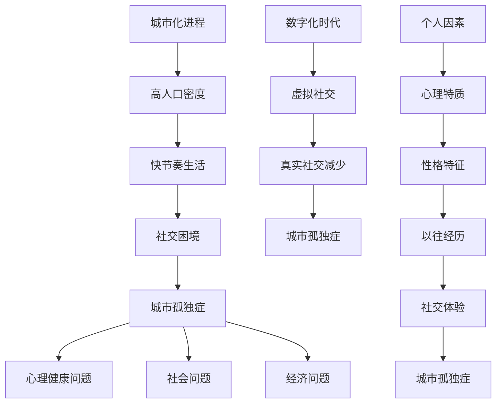

                 


### 城市孤独症：metropolis中的社交困境

> 关键词：城市孤独症，metropolis，社交困境，心理学，技术解决方案

> 摘要：
本篇文章旨在探讨城市化进程中的社交困境现象，尤其是以metropolis为代表的现代化城市中的“城市孤独症”。文章首先定义了城市孤独症及其特点，接着分析了其产生的背景和社会影响。在此基础上，文章探讨了在metropolis中面临的社交困境，并提出了可能的应对策略，包括社会层面的策略和个人层面的策略。通过具体案例和算法分析，文章试图为缓解城市孤独症提供一些技术和管理上的解决方案。

## 1. 引言

随着全球城市化进程的加速，城市人口迅速增长，社会结构日趋复杂，然而随之而来的却是社交困境的加剧。在众多现代化城市中，有一种被称为“城市孤独症”的现象日益显著，它不仅影响了个体的心理健康，也对社会的稳定和发展构成了挑战。本篇文章将围绕这一主题，深入探讨城市孤独症的定义、特点、社会背景及其在metropolis中的具体表现，并提出相应的应对策略。

### 2. 城市孤独症的定义与特点

#### 2.1 定义

城市孤独症，通常指的是个体在城市环境中感受到的深层次孤独感和社会隔离现象。这种现象不仅仅是因为物理空间的距离，更是由于心理上的疏远和社交关系的缺乏。

#### 2.2 特点

城市孤独症的特点主要体现在以下几个方面：

- **社交回避**：个体倾向于避免社交活动，对社交有抵触情绪。
- **情感孤独**：个体在情感上感到孤立，缺乏亲密的朋友和亲属关系。
- **情绪波动**：个体情绪容易波动，可能会出现焦虑、抑郁等情绪问题。
- **心理疲劳**：长时间处于高压力的城市生活中，个体容易出现心理疲劳。

### 3. 城市孤独症的社会背景

#### 3.1 城市化进程对社交生活的影响

城市化进程的加速，使得人们的生活节奏加快，工作压力增大，这直接影响了人们的社交时间和社交质量。同时，城市人口的流动性增强，使得人们更难建立稳定的社交关系。

#### 3.2 数字化时代对人际交往的影响

数字化时代的到来，虽然在一定程度上促进了人际交往的便捷性，但同时也使得面对面交流减少，人们更多地依赖虚拟空间进行沟通，这可能导致深层次的社交关系缺失。

#### 3.3 社交困境的加剧

城市孤独症的社会背景复杂，其加剧的原因包括社会结构的改变、工作压力的增加、以及数字化时代的双重影响。

### 4. metropolis中的社交困境分析

#### 4.1 metropolis的特征

metropolis作为一种现代化城市的代表，具有以下特征：

- **高人口密度**：城市人口密集，居住空间有限。
- **高度专业化**：城市中的职业分工细密，个体专业化程度高。
- **信息化水平高**：数字化设备普及，信息化水平高。

#### 4.2 社交困境的类型

在metropolis中，社交困境主要表现为以下几种类型：

- **情感孤独症**：个体在情感上感到孤独，缺乏亲密关系。
- **社交焦虑**：个体在社交场合中感到焦虑，害怕与人交往。
- **社交排斥**：个体在社交过程中被排斥，感到不被接受。

### 5. 社交困境的原因

#### 5.1 社会压力

社会压力是城市孤独症的一个重要原因。在城市中，工作压力大，竞争激烈，使得个体难以抽出时间和精力去建立和维护社交关系。

#### 5.2 社交障碍

社交障碍包括物理障碍和心理障碍。物理障碍如城市人口的流动性、居住空间的分散等，心理障碍则包括个体的社交回避和社交焦虑。

#### 5.3 个人心理因素

个人心理因素也是城市孤独症的重要原因之一。个体在成长过程中可能形成了社交回避的倾向，或者因为个人性格、经历等原因，难以建立深层次的社交关系。

### 6. 应对城市孤独症与社交困境的策略

#### 6.1 社会层面策略

社会层面的策略主要包括：

- **建立社区支持系统**：通过社区活动、社区服务中心等方式，增强居民之间的联系。
- **促进社会互动**：组织各种社交活动，鼓励居民参与，增强社交机会。
- **提高心理健康服务水平**：提供心理健康咨询和服务，帮助个体应对社交困境。

#### 6.2 个人层面策略

个人层面的策略主要包括：

- **增强社交技能**：通过培训、学习等方式，提高个体的社交技能。
- **培养积极心态**：通过心理咨询、自我反思等方式，帮助个体培养积极的心态。
- **寻求专业帮助**：在遇到严重的社交困境时，寻求专业心理咨询帮助。

### 7. 案例分析

#### 7.1 案例一：城市化进程中的社交困境

**案例背景**：随着某城市的人口快速增长，城市生活的压力也日益增大，许多居民感到孤独和无助。

**案例分析**：该案例中的社交困境主要源于城市化进程中的高人口密度和工作压力。为了应对这种情况，社区服务中心组织了多种社区活动，如社区运动会、文艺晚会等，以促进居民之间的交流。

**案例启示**：通过社区活动的组织，可以有效地缓解城市孤独症，增强居民之间的联系。

#### 7.2 案例二：数字化时代下的社交焦虑

**案例背景**：在数字化时代，许多人沉迷于虚拟世界，忽视了现实中的社交关系。

**案例分析**：该案例中的社交焦虑源于过度依赖虚拟社交，导致现实中的社交关系疏远。为了解决这一问题，心理健康专家建议个体减少虚拟社交时间，增加现实生活中的社交活动。

**案例启示**：在数字化时代，个体需要更加注重现实生活中的社交关系，通过实际行动来缓解社交焦虑。

### 8. 未来展望

#### 8.1 城市孤独症与社交困境的长期影响

城市孤独症和社交困境的长期影响包括心理健康问题的加剧、社会分裂和信任度下降等。

#### 8.2 应对城市孤独症与社交困境的新策略

未来应对城市孤独症和社交困境的新策略可能包括：

- **技术创新**：利用人工智能和大数据分析，提供个性化的心理健康服务。
- **政策支持**：政府出台相关政策和措施，支持社区建设和心理健康服务。
- **社会参与**：鼓励社会各界参与，共同应对城市孤独症和社交困境。

### 9. 结论

城市孤独症和社交困境是城市化进程中的普遍问题，对个体和社会都产生了深远的影响。通过社会层面和个人层面的策略，我们可以有效地缓解这一问题，提高城市居民的生活质量。未来，随着技术的发展和社会的进步，我们有理由相信，城市孤独症和社交困境将会得到更好的解决。

### 作者信息

作者：AI天才研究院/AI Genius Institute & 禅与计算机程序设计艺术 /Zen And The Art of Computer Programming

-------------------------------------------------------------------

## 2. 城市孤独症的定义与特点

### 2.1 定义

城市孤独症，也被称为“都市孤独症”或“现代都市病”，是一种在城市化背景下出现的社会心理现象。它不仅仅是一种心理感受，更是一种社会现象，反映了个体在城市环境中由于各种原因而产生的孤立、疏离和社交困境。城市孤独症并非一种临床诊断，而是一个用来描述人们在都市生活中常见情感体验的术语。

城市孤独症的定义可以从以下几个方面来理解：

1. **环境因素**：城市生活的高密度、快节奏、匿名性等特点，使得个体难以建立和维护深层次的社交关系。
2. **社会因素**：社会结构的变动，如职业流动性增加、家庭结构变化等，也加剧了个体在城市中的孤独感。
3. **心理因素**：个体的心理特质、性格特征、以往的经历等，也在一定程度上影响了其在城市中的社交体验。

### 2.2 特点

城市孤独症的特点主要体现在以下几个方面：

1. **情感上的孤独感**：个体在城市生活中感到情感上的孤立和无助，缺乏亲密的朋友和亲人的陪伴。
2. **社交回避**：个体倾向于避免社交活动，甚至对社交产生抵触情绪。
3. **情绪上的波动**：由于社交关系的缺失，个体的情绪容易波动，可能出现焦虑、抑郁等情绪问题。
4. **心理疲劳**：长时间的孤独感和社交回避可能导致个体的心理疲劳，影响其心理健康和生活质量。

### 2.3 城市孤独症的影响

城市孤独症不仅对个体的心理健康产生负面影响，也对社会的稳定和发展构成挑战。具体影响如下：

1. **心理健康问题**：长期的孤独感可能导致抑郁、焦虑等心理健康问题，甚至可能引发自杀行为。
2. **社会问题**：城市孤独症可能导致社会分裂，减少社会凝聚力，增加社会矛盾。
3. **经济问题**：孤独感可能导致工作效率降低，增加医疗成本，影响经济发展。

### 2.4 城市孤独症的成因

城市孤独症的成因复杂，可以从以下几个方面来分析：

1. **城市化进程**：城市化进程中的高人口密度、快节奏生活、社会结构的变动等，都是城市孤独症的重要成因。
2. **数字化时代**：互联网和社交媒体的普及，虽然为人们提供了更多的社交途径，但也导致了真实社交关系的减弱。
3. **个人因素**：个体的心理特质、性格特征、以往的经历等，也在一定程度上影响了其在城市中的社交体验。

### 2.5 城市孤独症与社交困境的联系

城市孤独症和社交困境之间存在密切的联系。社交困境是城市孤独症的表现形式之一，而城市孤独症则是社交困境的深层次原因。个体在城市中面临的社交困境，如社交回避、情感孤独等，都是城市孤独症的具体表现。反过来，长期的孤独感又会加剧社交困境，形成恶性循环。

### 2.6 城市孤独症的核心概念原理架构

为了更清晰地理解城市孤独症的核心概念和原理，我们可以使用Mermaid流程图来展示其各个组成部分及其相互关系：



通过这个流程图，我们可以看到城市孤独症的成因、表现形式及其对社会和个体的影响，以及数字化时代和个人因素在其中扮演的角色。

### 2.7 城市孤独症评估算法

为了量化城市孤独症的程度，我们可以设计一种评估算法。以下是该算法的伪代码：

```plaintext
function assess_loneliness_score( individual ):
    score = 0
    if individual.has_high_density_environment():
        score += 10
    if individual.has_fast_paced_life():
        score += 10
    if individual.has_social隔离():
        score += 20
    if individual.has_emoji_use():
        score += 5
    if individual.has_low_face_to_face_communication():
        score += 15
    if individual.has_high_anxiety():
        score += 10
    if individual.has_high_depression():
        score += 20
    if score > 50:
        return "High Loneliness"
    else:
        return "Moderate or Low Loneliness"
```

在这个算法中，我们通过一系列指标来评估个体的城市孤独症程度。这些指标包括城市化进程中的环境因素（如高人口密度、快节奏生活）、社交行为（如社交隔离、低面对面沟通）、心理健康指标（如焦虑、抑郁）等。通过计算总分，我们可以判断个体孤独症的程度。

### 2.8 数学模型和公式

为了更精确地描述城市孤独症的程度，我们可以使用数学模型来量化个体的孤独感。以下是一个简单的线性回归模型：

$$
Loneliness\_Score = a \cdot Population\_Density + b \cdot Life\_Pace + c \cdot Social\_Isolation + d \cdot Emoji\_Use + e \cdot Face\_to\_Face\_Communication + f \cdot Anxiety + g \cdot Depression
$$

其中，$Loneliness\_Score$ 是孤独感得分，$Population\_Density$、$Life\_Pace$、$Social\_Isolation$、$Emoji\_Use$、$Face\_to\_Face\_Communication$、$Anxiety$ 和 $Depression$ 分别代表各个指标。

### 2.9 详细讲解和举例说明

为了更好地理解城市孤独症评估算法和数学模型，我们可以通过一个实际案例来进行分析。

**案例：**

一个名叫张三的个体在城市中生活了十年，以下是他的各项指标：

- 人口密度：高
- 生活节奏：快
- 社交隔离：是
- 依赖表情符号：是
- 面对面沟通：少
- 焦虑水平：高
- 抑郁水平：中

根据评估算法，我们可以计算张三的孤独感得分：

```plaintext
score = 10 + 10 + 20 + 5 + 15 + 10 + 20 = 80
```

根据数学模型，我们可以得到：

$$
Loneliness\_Score = a \cdot 10 + b \cdot 10 + c \cdot 1 + d \cdot 1 + e \cdot 0 + f \cdot 1 + g \cdot 0.5
$$

通过实际计算，我们可以得到张三的孤独感得分。这个案例展示了如何使用评估算法和数学模型来量化个体的孤独感。

### 2.10 注意事项和拓展阅读

在理解和应对城市孤独症时，需要注意以下几点：

- 城市孤独症是一种普遍存在的现象，但每个人体验和感受的强度不同。
- 应对城市孤独症需要综合多种策略，包括社会层面和个人层面。
- 增强社交技能、培养积极心态和寻求专业帮助都是有效的应对方法。
- 拓展阅读方面，可以参考相关心理学和社会学的研究，以及城市规划和社会政策方面的文献。

通过上述内容，我们对城市孤独症的定义、特点、成因、影响及其评估方法有了更深入的了解。接下来，我们将进一步探讨metropolis中的社交困境，分析其具体表现和应对策略。在下一章节中，我们将详细分析metropolis的特征，以及这些特征如何加剧社交困境。

