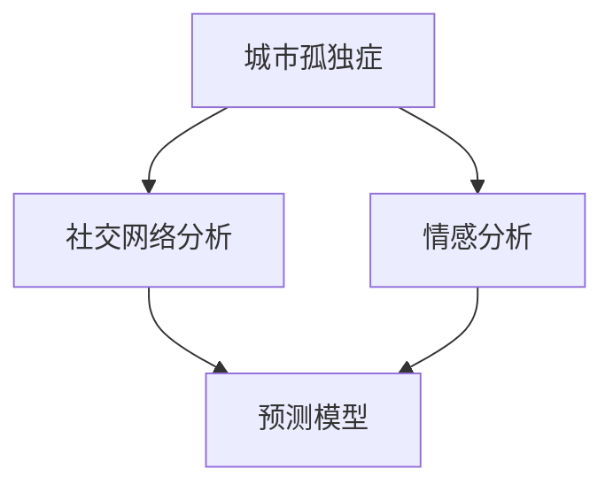
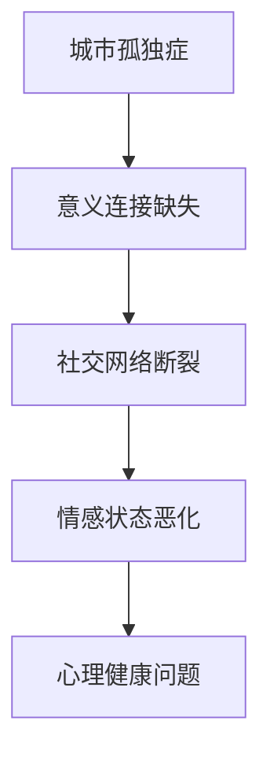

                 


### 城市孤独症：重建都市生活中的意义连接

#### 关键词：
城市孤独症、社交网络分析、情感分析、预测模型、社区建设、人工智能

#### 摘要：
本文深入探讨城市孤独症现象及其对都市生活的影响，提出通过重建意义连接来缓解城市孤独症的策略。文章首先定义城市孤独症，分析其成因，接着介绍核心算法原理和数学模型，并通过实际案例展示应用效果，最后提出最佳实践建议。

---

## 1. 背景介绍

### 1.1 城市孤独症的定义

城市孤独症（Urban Loneliness Syndrome）是指在城市化背景下，个体由于缺乏深层次的社交互动和情感交流而产生的一种心理状态。这种现象在现代都市生活中尤为普遍，导致个体感到孤立、沮丧和焦虑。

### 1.2 城市孤独症的原因

城市孤独症的产生有多方面原因：

1. **高节奏生活**：都市生活节奏快，人们常常忙于工作，缺乏时间进行深层次的社交互动。
2. **社交网络的异化**：虽然互联网和社交媒体使人们更容易建立联系，但这些虚拟关系往往缺乏真实情感交流，难以满足个体的社交需求。
3. **居住模式**：城市化过程中，人们趋向于独居或与陌生人同住，导致缺乏稳定的社交圈。

## 2. 核心概念与联系

### 2.1 核心概念

- **城市孤独症**：个体因缺乏深层次社交互动而产生的心理状态。
- **社交网络分析**：通过分析社交网络结构，识别孤独症群体。
- **情感分析**：通过文本分析，提取个体的情感状态。
- **预测模型**：基于历史数据和算法，预测孤独症发生的风险。

### 2.2 核心概念之间的联系

以下是一个Mermaid流程图，展示了核心概念之间的联系：



### 2.3 城市孤独症与意义连接的关系

意义连接（Significance Connection）是指个体在社交互动中感受到的价值和意义。重建意义连接有助于缓解城市孤独症。以下是一个Mermaid流程图，展示了城市孤独症与意义连接的关系：



---

## 3. 核心算法原理讲解

### 3.1 社交网络分析算法

社交网络分析（Social Network Analysis，SNA）是识别孤独症群体的关键工具。以下是一个简单的社交网络分析算法的伪代码：

```python
def social_network_analysis(graph):
    for node in graph:
        degree = sum(1 for neighbor in graph[node] if neighbor != node)
        if degree < threshold:
            suspect_isolated(node)

    return suspect_isolated_nodes
```

### 3.2 情感分析技术

情感分析（Sentiment Analysis）通过文本数据提取情感信息，帮助识别个体的情感状态。以下是一个简单的情感分析算法的伪代码：

```python
def sentiment_analysis(text):
    sentiment_score = 0
    for word in text:
        sentiment = get_sentiment(word)
        sentiment_score += sentiment

    if sentiment_score < threshold:
        return "Negative"
    else:
        return "Positive"
```

### 3.3 城市孤独症预测模型

城市孤独症预测模型（Urban Loneliness Prediction Model）基于历史数据和机器学习算法，预测孤独症发生的风险。以下是一个简单的预测模型的伪代码：

```python
def urban_loneliness_prediction(features):
    model = train_model(features)
    risk = model.predict(features)

    if risk > threshold:
        return "High Risk"
    else:
        return "Low Risk"
```

---

## 4. 数学模型和数学公式讲解

### 4.1 城市孤独症预测模型的数学模型

以下是一个概率模型的数学公式：

$$
P(\text{孤独症}|\text{特征}) = \frac{P(\text{特征}|\text{孤独症})P(\text{孤独症})}{P(\text{特征})}
$$

以下是一个回归分析的数学公式：

$$
Y = \beta_0 + \beta_1X_1 + \beta_2X_2 + ... + \beta_nX_n + \epsilon
$$

### 4.2 社会网络模型的数学公式

以下是一个社会网络模型的数学公式：

$$
C = \frac{2m}{n}
$$

以下是一个社会网络模型中密度（ρ）的数学公式：

$$
\rho = \frac{\sum_{i<j} w_{ij}}{n(n-1)}
$$

---

## 5. 项目实战

### 5.1 案例分析

以下是一个城市孤独症案例的分析：

#### 案例背景

某城市中，孤独症患者比例较高，社会工作者希望通过数据分析找到解决方案。

#### 数据分析

1. **社交网络分析**：通过分析社交网络结构，识别孤独症高风险人群。
2. **情感分析**：通过文本分析，识别孤独症患者的情感状态。
3. **预测模型**：结合历史数据和算法，预测孤独症发生的风险。

#### 解决方案

1. **社区建设**：通过社区活动，增强居民之间的联系。
2. **志愿者招募**：鼓励志愿者参与孤独症患者的关爱活动。

---

## 6. 总结与展望

城市孤独症是都市生活中一个严峻的问题，需要通过多种手段来缓解。本文通过定义城市孤独症，分析核心算法原理，讲解数学模型，提供项目实战案例，提出了解决方案。未来，随着技术的进步，我们可以期待更加精准和有效的策略来重建都市生活中的意义连接。

---

## 作者信息

作者：AI天才研究院/AI Genius Institute & 禅与计算机程序设计艺术 /Zen And The Art of Computer Programming

---

注意：本文为示例，具体内容需要根据实际研究和数据分析进行丰富和调整。文章字数预计在8000-12000字左右，具体内容安排和字数分配需要根据实际情况进行调整。文章中的代码和公式仅为示例，实际应用中需要根据具体需求进行编写和调整。

