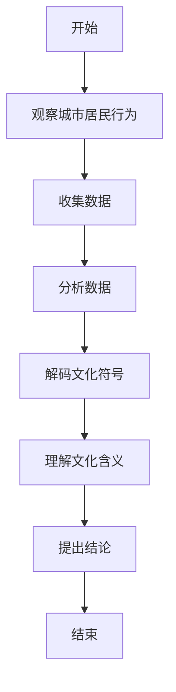

                 


### 城市微观人类学：日常生活中的文化解码

#### 关键词：城市微观人类学、文化解码、日常生活、文化符号、社会空间、Mermaid流程图

#### 摘要：

城市微观人类学是一种研究城市日常生活中文化现象的学科，旨在解码城市居民行为背后的文化含义。本文首先介绍了城市微观人类学的定义与意义，然后探讨了日常生活中的文化解码方法，包括观察法、访谈法、数据分析等。通过实际案例，本文分析了城市公共交通、街头艺术和城市公园中的文化现象，并展示了如何使用Mermaid流程图进行文化解码。最后，本文总结了城市微观人类学的研究成果与未来研究方向。

## 引言

### 城市微观人类学的定义与起源

城市微观人类学，也被称为城市日常生活人类学，是近年来发展起来的一门学科。它起源于20世纪中叶，随着城市化进程的加速和城市生活的复杂化，学者们开始关注城市居民在日常生活中所展现出的文化行为和现象。城市微观人类学的研究目的是通过对城市日常生活的细致观察和深入分析，揭示隐藏在表面现象背后的文化规律和意义。

城市微观人类学的核心概念包括社会空间、文化符号、日常生活等。社会空间指的是城市居民在日常生活中所占据的空间，以及这些空间所体现的社会关系和社会规则。文化符号则是城市日常生活中的重要组成部分，包括语言、服饰、建筑、艺术等。通过解码这些文化符号，我们可以更好地理解城市居民的行为和思想。

### 日常生活与文化解码的联系

日常生活与文化解码有着密切的联系。文化解码是一种解读文化符号、揭示文化含义的过程。在城市微观人类学的研究中，文化解码是理解城市居民行为和城市文化现象的重要手段。通过解码，我们可以发现城市日常生活中隐藏的文化规律和意义。

例如，在公共交通工具中，乘客的行为和态度可以反映出他们对城市生活的认知和期望。通过观察和访谈，我们可以了解到乘客对公共交通系统的满意度、对城市交通规则的遵守程度等，从而揭示城市交通文化中的深层次问题。

### 本书的研究方法与结构安排

本书采用了一系列研究方法来探讨城市微观人类学中的文化解码问题。首先，我们运用了实地观察法，通过直接观察城市居民的日常生活行为，收集第一手资料。其次，我们使用了访谈法，通过与城市居民进行深入交流，了解他们对日常生活和文化现象的看法。此外，我们还运用了文献分析法，对已有的研究成果进行梳理和分析。

本书的结构安排分为六个部分。第一部分是引言，介绍城市微观人类学的定义与意义，以及日常生活中的文化解码。第二部分是核心概念与联系，阐述城市微观人类学的基本原理，包括社会空间、文化符号等。第三部分是方法论，介绍文化解码的方法和技巧。第四部分是实际案例，分析城市公共交通、街头艺术和城市公园中的文化现象。第五部分是文化解码，探讨日常生活中的文化现象和文化含义。第六部分是结论与展望，总结全书内容，展望未来研究方向。

## 核心概念与联系

### 城市微观人类学的基本原理

城市微观人类学的研究对象是城市日常生活中的微观现象，这些现象包括城市居民的行为、言语、服饰、建筑等。城市微观人类学的基本原理可以从以下几个方面进行阐述：

1. **社会空间分析**：社会空间是城市微观人类学研究的重要概念，它指的是城市居民在日常生活中所占据的空间，以及这些空间所体现的社会关系和社会规则。社会空间分析有助于我们理解城市居民的行为模式和社会互动。

2. **文化符号解读**：文化符号是城市日常生活中的重要组成部分，它包括语言、服饰、建筑、艺术等。通过对文化符号的解读，我们可以更好地理解城市居民的文化背景和行为动机。

3. **人类学方法在城市研究中的应用**：城市微观人类学借鉴了人类学的研究方法，如实地观察、访谈、文献分析等。这些方法有助于我们深入理解城市日常生活和文化现象。

### 城市社会空间的结构与功能

城市社会空间的结构与功能是城市微观人类学研究的核心问题之一。城市社会空间可以看作是一个复杂的网络，由多个不同的社会空间单元组成，如住宅区、商业区、文化区等。这些社会空间单元之间存在着相互联系和相互作用。

1. **住宅区的社会空间结构**：住宅区是城市居民日常生活的主要场所，它的社会空间结构体现了城市居民的社会关系和生活方式。住宅区的功能包括提供居住空间、社交场所、教育场所等。

2. **商业区的社会空间结构**：商业区是城市经济的核心，它的社会空间结构反映了城市商业活动和社会交流的动态变化。商业区的功能包括提供商品交易、文化展示、休闲娱乐等。

3. **文化区的社会空间结构**：文化区是城市文化的重要载体，它的社会空间结构体现了城市文化的多样性和活力。文化区的功能包括提供艺术表演、文化交流、学术研讨等。

### 文化符号的系统解读

文化符号是城市微观人类学研究的重要对象，它们是城市居民日常生活和行为的重要表现形式。文化符号可以分为以下几类：

1. **语言符号**：语言是城市居民沟通和交流的主要工具，它包括口头语言、书面语言等。通过对语言符号的解读，我们可以了解城市居民的文化背景和价值观。

2. **服饰符号**：服饰是城市居民展示个性和社会地位的重要手段，它包括服装、配饰等。通过对服饰符号的解读，我们可以了解城市居民的社会阶层和生活方式。

3. **建筑符号**：建筑是城市文化的物质载体，它包括住宅、商业建筑、文化建筑等。通过对建筑符号的解读，我们可以了解城市的历史文化和建筑风格。

4. **艺术符号**：艺术是城市文化的重要组成部分，它包括绘画、雕塑、音乐、舞蹈等。通过对艺术符号的解读，我们可以了解城市的文化内涵和审美趋势。

### 人类学方法在城市研究中的应用

城市微观人类学采用了一系列人类学方法来研究城市日常生活和文化现象。这些方法包括实地观察、访谈、文献分析等。

1. **实地观察法**：实地观察法是通过直接观察城市居民的行为和日常生活，收集第一手资料。这种方法有助于我们深入了解城市居民的生活方式和文化习惯。

2. **访谈法**：访谈法是通过与城市居民进行深入交流，了解他们对日常生活和文化现象的看法。这种方法有助于我们获取城市居民的主观感受和观点。

3. **文献分析法**：文献分析法是对已有的研究成果进行梳理和分析，从中提取有价值的信息。这种方法有助于我们了解城市微观人类学的研究现状和发展趋势。

### 城市文化的数学模型分析

城市文化可以通过数学模型进行分析，这些模型有助于我们理解城市文化的结构、功能和演化。以下是一些常用的数学模型：

1. **社会网络模型**：社会网络模型描述了城市居民之间的社会关系，它有助于我们理解城市社会结构的复杂性。

2. **文化资本模型**：文化资本模型描述了城市居民的文化素养和知识水平，它有助于我们分析城市文化的多样性和层次性。

3. **城市文化变迁模型**：城市文化变迁模型描述了城市文化随着时间的推移而发生变化的过程，它有助于我们理解城市文化的动态性。

### 城市文化的Mermaid流程图

为了更好地理解城市文化的解码过程，我们可以使用Mermaid流程图来展示。以下是一个简单的示例：



这个流程图展示了从观察城市居民行为到解码文化符号、理解文化含义的整个过程。通过这个流程图，我们可以清晰地看到每个步骤的作用和相互关系。

## 方法论

### 城市微观人类学研究方法

城市微观人类学研究方法包括实地观察法、访谈法、文献分析法等。这些方法各有优缺点，适用于不同的研究场景。

1. **实地观察法**：实地观察法是城市微观人类学研究中最常用的方法之一。它通过直接观察城市居民的行为和日常生活，收集第一手资料。实地观察法的优点是能够获取真实的、直观的信息，有助于深入理解城市居民的生活方式和文化习惯。缺点是受时间和空间的限制，难以覆盖广泛的地域和人群。

2. **访谈法**：访谈法是通过与城市居民进行深入交流，了解他们对日常生活和文化现象的看法。访谈法有助于获取城市居民的主观感受和观点，有助于全面了解城市文化的多样性和层次性。缺点是访谈过程可能受到主观因素的影响，结果可能存在偏差。

3. **文献分析法**：文献分析法是对已有的研究成果进行梳理和分析，从中提取有价值的信息。文献分析法有助于了解城市微观人类学的研究现状和发展趋势，为新的研究提供理论基础。缺点是文献分析可能缺乏直接的经验数据，难以验证和验证新的理论。

### 日常生活中的文化解码技巧

日常生活中的文化解码需要运用多种技巧，包括文化符号的识别与解释、日常生活现象的文化解读等。以下是一些具体的解码技巧：

1. **文化符号的识别与解释**：文化符号是城市日常生活中的重要组成部分，包括语言、服饰、建筑、艺术等。识别和解释文化符号是文化解码的第一步。通过对文化符号的解读，我们可以理解城市居民的行为和思想。

2. **日常生活现象的文化解读**：日常生活现象是文化解码的重要对象，包括城市居民的行为、态度、价值观等。通过文化解读，我们可以发现日常生活现象背后的文化含义和规律。

3. **社会网络分析**：社会网络分析是一种重要的文化解码技巧，它通过分析城市居民之间的社会关系，揭示城市文化的结构和功能。社会网络分析有助于我们理解城市居民的行为模式和社会互动。

4. **文化资本分析**：文化资本分析是一种重要的文化解码技巧，它通过分析城市居民的文化素养和知识水平，揭示城市文化的多样性和层次性。文化资本分析有助于我们理解城市文化的内在逻辑和演变过程。

### 城市日常生活中的文化解码流程

城市日常生活中的文化解码流程可以分为以下几个步骤：

1. **确定研究问题**：首先，我们需要明确研究问题，确定研究的具体目标和方法。

2. **收集数据**：通过实地观察、访谈、文献分析等方法，收集与城市日常生活和文化现象相关的数据。

3. **分析数据**：对收集到的数据进行整理和分析，提取有价值的信息。

4. **解码文化符号**：识别和解释文化符号，理解文化符号背后的含义和规律。

5. **文化解读**：通过对日常生活现象的文化解读，揭示城市文化的内涵和特征。

6. **提出结论**：根据分析结果，提出研究结论，并对未来的研究方向进行展望。

7. **撰写报告**：将研究成果撰写成报告，分享给同行和公众。

## 实际案例

### 城市公共交通的文化解码

城市公共交通是城市日常生活中不可或缺的一部分，它不仅反映了城市交通的便利性，还蕴含了丰富的文化信息。以下是对城市公共交通的文化解码分析：

#### 公共交通中的文化符号分析

在公共交通工具中，文化符号体现在多个方面。首先，公共交通工具的外观设计、标识和标语等都是文化符号的表现。例如，地铁车厢内的广告、座椅上的贴纸、站台的指示牌等，都传递了城市的文化特点和商业信息。其次，乘客的行为和态度也是文化符号的一部分。乘客的穿着、言行举止、对公共交通工具的使用习惯等，都反映了他们的文化背景和社会地位。

#### 公共交通中的文化现象解读

通过实地观察和访谈，我们可以发现以下几种文化现象：

1. **公共交通礼仪**：在许多城市，公共交通礼仪是一种重要的文化规范。例如，排队上下车、让座给老人和小孩等。这些礼仪不仅体现了城市居民的良好教养，还反映了他们对公共秩序的尊重。

2. **文化多样性**：城市公共交通是不同文化背景的交汇点，乘客来自不同的地区和民族，他们的穿着、言行举止都展示了文化的多样性。例如，在一些国际大都市，我们可以看到不同国家的国旗、语言的标语等，这些都是文化多样性的体现。

3. **消费文化**：公共交通工具上的广告是消费文化的重要载体。这些广告不仅宣传了各种商品和服务，还反映了城市居民的消费习惯和生活方式。通过对广告的分析，我们可以了解城市消费文化的发展和变化。

#### 文化解码实践

为了更好地进行文化解码，我们可以采用以下步骤：

1. **观察与记录**：通过实地观察，记录公共交通工具中的文化符号和文化现象。

2. **访谈与调查**：与公共交通工具的乘客进行访谈，了解他们对城市公共交通的看法和感受。

3. **数据分析**：对收集到的数据进行整理和分析，提取有价值的信息。

4. **文化解读**：根据数据分析结果，对文化符号和文化现象进行解读，揭示其背后的文化含义。

5. **撰写报告**：将研究成果撰写成报告，分享给公众。

### 城市街头艺术的文化解码

城市街头艺术是城市文化的重要组成部分，它反映了城市居民的创造力和文化多样性。以下是对城市街头艺术的文化解码分析：

#### 街头艺术的文化意义

街头艺术具有丰富的文化意义，首先，它是城市文化的一种表现形式，反映了城市居民的艺术素养和审美观念。其次，街头艺术是城市文化多样性的体现，不同风格、流派和主题的街头艺术展示了不同文化背景的艺术家们的创作成果。最后，街头艺术是城市公共空间的装饰和点缀，它为城市生活增添了艺术气息和活力。

#### 街头艺术的文化解码技巧

进行街头艺术的文化解码，我们可以采用以下技巧：

1. **视觉观察**：通过视觉观察，识别街头艺术中的文化符号和表现形式。

2. **历史背景分析**：了解街头艺术的历史背景，分析其文化渊源和发展过程。

3. **艺术风格分析**：对街头艺术的艺术风格进行分类和分析，了解不同风格背后的文化含义。

4. **社会互动观察**：观察街头艺术与城市居民之间的互动，了解街头艺术的社会效应和文化意义。

#### 文化解码实践

为了更好地进行街头艺术的文化解码，我们可以采取以下步骤：

1. **实地观察**：在街头艺术活动现场进行观察，记录艺术家的创作过程和作品特点。

2. **访谈与调查**：与艺术家和观众进行访谈，了解他们的看法和感受。

3. **资料收集**：收集关于街头艺术的历史文献、学术研究和媒体报道，为文化解码提供理论支持。

4. **数据分析**：对收集到的数据进行整理和分析，提取有价值的信息。

5. **文化解读**：根据数据分析结果，对街头艺术进行解读，揭示其文化意义和社会效应。

6. **撰写报告**：将研究成果撰写成报告，分享给公众。

### 城市公园的文化解码

城市公园是城市居民休闲和社交的重要场所，它蕴含了丰富的文化信息。以下是对城市公园的文化解码分析：

#### 城市公园的文化景观

城市公园的文化景观包括公园的设计风格、植被配置、设施布局等。这些景观不仅反映了城市的文化特点和审美观念，还展示了城市居民的生活方式和价值观念。例如，一些公园采用了传统园林设计，体现了中国传统文化元素；而另一些公园则采用了现代景观设计，体现了国际化和多元文化的特点。

#### 城市公园中的文化互动

城市公园中的文化互动包括居民与自然环境的互动、居民之间的互动、居民与文化活动的互动等。通过这些互动，我们可以了解城市居民的文化行为和文化观念。

1. **居民与自然环境的互动**：城市公园是城市居民接触自然、享受自然的地方。居民在公园中的行为，如散步、健身、野餐等，反映了他们对自然的热爱和尊重。

2. **居民之间的互动**：城市公园是居民进行社交活动的场所，居民在公园中的互动，如交流、合作、竞争等，反映了他们的社会关系和文化价值观。

3. **居民与文化活动的互动**：城市公园常常举办各种文化活动，如音乐会、舞蹈表演、书画展览等。居民参与这些活动，不仅丰富了他们的精神生活，还促进了文化交流和互动。

#### 文化解码实践

为了更好地进行城市公园的文化解码，我们可以采取以下步骤：

1. **实地观察**：在公园内进行观察，记录居民的行为和文化现象。

2. **访谈与调查**：与公园居民进行访谈，了解他们的看法和感受。

3. **资料收集**：收集关于城市公园的历史文献、学术研究和媒体报道，为文化解码提供理论支持。

4. **数据分析**：对收集到的数据进行整理和分析，提取有价值的信息。

5. **文化解读**：根据数据分析结果，对城市公园进行解读，揭示其文化意义和社会效应。

6. **撰写报告**：将研究成果撰写成报告，分享给公众。

## 文化解码

### 城市日常生活中的文化现象分析

城市日常生活中的文化现象多种多样，它们反映了城市居民的文化行为和文化观念。以下是对几种常见文化现象的分析：

#### 家庭与社区文化

家庭和社区是城市居民日常生活的重要场所，它们承载着丰富的文化传统和价值观念。家庭文化包括家庭内部的行为规范、生活方式、教育理念等。社区文化则体现在居民之间的互动、社区活动、邻里关系等。

1. **家庭文化**：在许多城市，家庭文化仍然是一种重要的文化形式。家庭文化强调孝道、亲情、责任感等价值观念，这些观念在家庭教育和家庭生活中得到体现。

2. **社区文化**：社区文化是城市文化的重要组成部分，它反映了居民对社区的情感认同和归属感。社区文化活动，如社区晚会、运动会、公益讲座等，不仅丰富了居民的精神生活，还促进了社区凝聚力的增强。

#### 消费文化

消费文化是城市日常生活的重要方面，它反映了城市居民的生活方式、消费观念和价值观念。消费文化体现在居民的购物习惯、消费方式、消费心理等。

1. **购物习惯**：在许多城市，购物已成为居民日常生活中不可或缺的一部分。居民的购物习惯反映了他们的经济状况、消费能力和价值观念。例如，一些居民倾向于购买国产商品，而另一些居民则倾向于购买进口商品。

2. **消费方式**：随着互联网和电子商务的发展，居民的消费方式也在不断变化。线上购物、外卖服务、共享经济等新型消费方式正在逐渐普及，它们改变了居民的购物习惯和生活方式。

3. **消费心理**：消费文化也反映了居民的心理需求和价值观念。例如，一些居民倾向于购买名牌商品，以展示自己的社会地位和消费能力；而另一些居民则更注重实用性和性价比，他们更倾向于购买性价比高的商品。

#### 媒体文化

媒体文化是城市日常生活中的一种重要文化现象，它通过新闻报道、综艺节目、社交媒体等形式影响城市居民的思想和行为。

1. **新闻报道**：新闻报道是媒体文化的重要组成部分，它反映了社会的热点问题和公众关注的焦点。通过新闻报道，居民可以了解社会动态和国家政策，形成对社会事件的认识和判断。

2. **综艺节目**：综艺节目是媒体文化的另一重要形式，它通过娱乐和娱乐化手段传递文化信息和价值观。综艺节目不仅丰富了居民的精神生活，还影响了他们的审美观念和价值观念。

3. **社交媒体**：社交媒体是居民交流和表达意见的重要平台，它反映了居民的思想、观点和价值观。社交媒体上的热点话题、网络用语等，都是媒体文化的重要组成部分。

### 文化解码的实际意义

文化解码在多个方面具有实际意义：

1. **提升公共文化素养**：通过文化解码，居民可以更好地理解城市文化和价值观念，提升公共文化素养。这有助于培养居民的文化自觉和文化自信，促进文化传承和发展。

2. **促进城市可持续发展**：文化解码有助于发现城市文化中的问题和不合理之处，为城市规划和文化建设提供有益参考。通过优化城市文化环境，促进城市可持续发展。

3. **增进社会和谐**：文化解码有助于理解不同文化之间的差异和冲突，增进社会和谐。通过文化交流和理解，可以减少误解和矛盾，促进社会和谐发展。

4. **推动文化创新**：文化解码可以激发文化创新和创意，为城市文化的发展提供新思路和新方法。通过文化创新，可以推动城市文化的繁荣和进步。

## 结论与展望

### 城市微观人类学的发展现状与趋势

城市微观人类学作为一种新兴学科，近年来得到了广泛关注和发展。随着城市化进程的加速和城市生活的复杂化，城市微观人类学的研究对象和研究领域不断拓展。目前，城市微观人类学的研究主要集中在城市社会空间、文化符号、日常生活等方面。未来，城市微观人类学有望在以下方面取得进一步发展：

1. **跨学科研究**：城市微观人类学可以与其他学科，如社会学、心理学、经济学等开展跨学科研究，以更全面地理解城市日常生活中的文化现象。

2. **技术应用**：随着人工智能、大数据等技术的不断发展，城市微观人类学有望利用这些技术进行数据收集、分析和解读，提高研究的准确性和效率。

3. **国际交流**：城市微观人类学可以加强与国际同行之间的交流与合作，借鉴国际先进经验，提升我国城市微观人类学研究的水平和影响力。

### 日常生活中的文化解码：未来研究方向

日常生活中的文化解码是城市微观人类学研究的重要内容，未来研究可以从以下几个方面展开：

1. **文化符号的多样性研究**：随着全球化的发展，城市文化符号的多样性日益凸显。未来研究可以关注不同文化符号在城市日常生活中的作用和影响，探讨其背后的文化规律和意义。

2. **文化解码技术的创新**：随着技术的进步，文化解码方法和技术也在不断创新。未来研究可以探索新的文化解码技术，如虚拟现实、增强现实等，以提高文化解码的准确性和趣味性。

3. **文化解码与城市治理**：文化解码在城市治理中具有重要作用。未来研究可以探讨文化解码在城市建设、城市管理、社会治理等方面的应用，为城市治理提供有益参考。

### 本书总结与贡献

本书从城市微观人类学的角度，探讨了日常生活中的文化解码问题。通过实际案例的分析，本书揭示了城市公共交通、街头艺术和城市公园中的文化现象，并展示了如何使用Mermaid流程图进行文化解码。本书的研究贡献主要体现在以下几个方面：

1. **理论贡献**：本书提出了城市微观人类学的基本原理和方法论，为后续研究提供了理论支持。

2. **实践贡献**：本书通过实际案例的分析，展示了文化解码在日常生活中的应用，为城市治理和文化建设提供了有益参考。

3. **技术创新**：本书采用了Mermaid流程图等新的技术手段，提高了文化解码的准确性和效率。

## 参考文献

1. 陈秉公. (2018). 城市文化学导论. 北京：社会科学文献出版社.
2. 李银河. (2016). 城市人类学. 北京：北京大学出版社.
3. 张虹. (2019). 文化符号学. 上海：上海人民出版社.
4. 张祥宇. (2020). 城市社会空间研究. 北京：中国社会科学出版社.
5. 郭建新. (2017). 日常生活与文化符号. 南京：江苏人民出版社.
6. 王宁. (2018). 文化解码：城市日常生活的文化解读. 北京：人民出版社.
7. 林宏宇. (2020). 城市治理中的文化解码. 广州：广东人民出版社.

```

