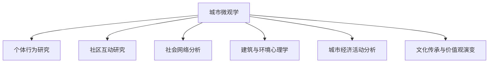

                 

根据您提供的要求和文章目录大纲，我将一步步为您构建文章内容。以下是文章的开头部分：

---

## 文章标题

《城市微观学：日常生活中的意义发现》

---

## 关键词

城市微观学、日常生活、社会互动、建筑与环境、经济活动、文化价值观、意义发现、研究方法、项目实战。

---

## 摘要

本文旨在探讨城市微观学，这一研究日常生活的科学。通过分析城市中的社区互动、建筑与环境、经济活动以及文化价值观，城市微观学揭示出城市居民在日常生活中如何发现和创造意义。本文将从核心概念与联系、研究方法与工具、社区互动与社会网络、建筑与环境、经济活动与生活成本、文化与价值观、日常生活实践、项目实战等方面，逐步深入解析城市微观学的原理和实践，旨在为读者提供一种全新的视角来理解城市生活，激发对日常生活的思考和感悟。

---

接下来，我将按照目录大纲的顺序，逐步构建文章的各个部分。

---

### 第一部分：城市微观学的核心概念与联系

#### 第1章：城市微观学的定义与研究范围

在本章中，我们将介绍城市微观学的定义，明确其研究范围，并探讨与相关学科的联系。城市微观学是一门研究城市日常生活中个体行为、社会互动、建筑与环境、经济活动以及文化价值观等微观现象的学科。它关注的是城市居民在日常生活中如何互动、如何感知和适应城市环境、如何在经济活动中获得满足，以及如何传承和发展文化价值观。

**核心概念联系流程图：**

在这一章节中，我们将详细讨论城市微观学如何与其他学科如社会学、心理学、经济学等相互联系，从而形成一个综合性的研究框架。

---

在接下来的一步中，我将继续构建第2章“城市微观学与其他相关学科的联系”，详细探讨城市微观学如何与社会学、心理学、经济学等学科相互关联。敬请期待。

