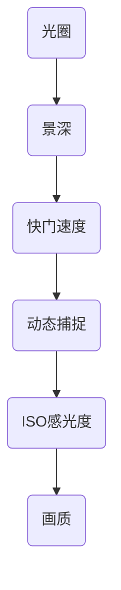
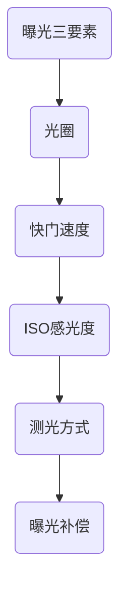
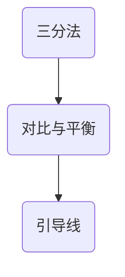
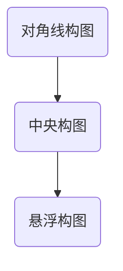

                 

# 城市微观摄影：日常生活中的美学发现

## 关键词

- 城市微观摄影
- 美学发现
- 摄影基础
- 构图技巧
- 建筑摄影
- 人物摄影

## 摘要

本文旨在探讨城市微观摄影这一独特的摄影领域，通过深入分析摄影基础、城市微景观、以及城市生活的拍摄技巧，帮助读者发现日常生活中隐藏的美学。文章从摄影的基本操作、构图原则，到具体拍摄技巧，再到色彩与光影的处理，全方位展现了城市微观摄影的魅力。通过阅读本文，读者将能够掌握摄影的基本技能，提升自己的摄影水平，记录下城市生活中的美好瞬间。

## 第一部分：摄影入门

### 第1章：摄影基础

#### 1.1 相机基本操作

摄影始于相机的基本操作。首先，我们需要了解相机的不同部分和它们的功能。相机的主要组成部分包括镜头、快门、光圈、ISO等。以下是一个简单的相机操作流程：

**相机使用：**选择合适的相机类型，如单反、微单或手机。不同类型的相机适用于不同的拍摄场景。

**模式选择：**相机的模式包括自动模式、手动模式、景深优先模式等。根据拍摄需求选择合适的模式。

**镜头和滤镜：**了解不同镜头的功能，如广角镜头、长焦镜头等。滤镜则可以用于调整光线和色彩。

#### 1.2 光圈、快门、ISO

**光圈与景深：**光圈的大小决定了照片的景深。较小的光圈（如f/16）会产生较大的景深，适用于风景摄影。较大的光圈（如f/2.8）则会产生较小的景深，适用于人像摄影。

**快门速度与动态捕捉：**快门速度决定了照片的清晰度。较慢的快门速度（如1/30秒）适合拍摄动态场景，而较快的快门速度（如1/500秒）则适合拍摄静态场景。

**ISO感光度与画质：**ISO感光度越高，照片的画质越差。通常，在低光环境下，需要提高ISO感光度来获得更好的曝光效果。

#### 1.3 曝光与测光

**曝光三要素：**曝光主要由光圈、快门速度和ISO感光度决定。正确曝光可以使照片更加清晰、真实。

**测光方式：**相机的测光方式包括平均测光、中心测光、点测光等。根据拍摄场景选择合适的测光方式。

**曝光补偿：**在特定情况下，可以通过曝光补偿调整曝光量，以获得更好的拍摄效果。

### 第2章：构图基础

#### 2.1 基本构图原则

**三分法：**将画面分为九宫格，将被摄主体放置在交叉点上，以获得平衡和吸引力的效果。

**对比与平衡：**通过对比和平衡，使画面更具层次感和吸引力。

**引导线：**利用引导线将观众的视线引导到被摄主体，增强画面的视觉冲击力。

#### 2.2 特殊构图技巧

**对角线构图：**通过将主体放置在对角线上，增加画面的动感和力量感。

**中央构图：**将主体放置在画面的中心，适合表现稳定和正式的氛围。

**悬浮构图：**通过虚化背景，使主体似乎悬浮在空中，增加神秘感和视觉冲击力。

#### 2.3 构图实战

**实景拍摄练习：**通过实际拍摄练习，掌握各种构图技巧。

**拍摄案例分析：**分析优秀摄影作品，学习构图技巧。

## 第二部分：城市微景观

### 第3章：街头艺术

#### 3.1 街头摄影的特点

**纪录性：**街头摄影通过记录现实生活中的瞬间，展现社会的多样性和变化。

**反映社会现状：**街头摄影反映了城市生活的真实面貌，传达了摄影师的观察和思考。

**创意表达：**街头摄影不仅记录现实，更通过创意手法表达摄影师的独特视角。

#### 3.2 街头摄影技巧

**人像拍摄：**在人像拍摄中，了解被摄者的心理，捕捉自然的表情和姿态。

**动态捕捉：**在动态场景中，选择合适的快门速度，捕捉瞬间动作。

**景深控制：**通过调整光圈，控制景深，突出被摄主体。

#### 3.3 街头摄影案例

**摄影师访谈：**通过访谈街头摄影师，了解他们的创作理念和拍摄技巧。

**拍摄地点推荐：**推荐一些适合街头摄影的地点，如市井小巷、繁华街区等。

### 第4章：城市建筑

#### 4.1 建筑摄影的基本要素

**建筑线条：**通过捕捉建筑的结构和线条，展现建筑的美感。

**光影效果：**利用光影的变化，增强建筑的表现力。

**色彩对比：**通过对比不同色彩的运用，突出建筑的特色。

#### 4.2 建筑摄影技巧

**逆光拍摄：**逆光拍摄可以使建筑在阴影中呈现出独特的轮廓，增加立体感。

**广角镜头的使用：**广角镜头可以捕捉到更多的建筑细节，增强视觉冲击力。

**超焦距拍摄：**超焦距拍摄可以保证画面从前景到背景的清晰度。

#### 4.3 建筑摄影案例

**城市地标拍摄：**通过拍摄城市地标，展现城市的独特魅力。

**古建筑摄影：**通过拍摄古建筑，记录历史文化的精髓。

## 第三部分：城市生活

### 第5章：人物摄影

#### 5.1 人像摄影的构图与用光

**构图要点：**掌握人像摄影的构图原则，如三分法、中央构图等，增强画面的吸引力。

**用光技巧：**了解不同光线条件下的拍摄技巧，如自然光和人造光的使用。

**模特引导：**与模特建立良好的沟通，捕捉自然、生动的瞬间。

#### 5.2 环境人像

**环境背景的运用：**通过选择合适的背景，增强人像的表现力。

**拍摄环境的选择：**根据拍摄主题选择合适的拍摄环境，如公园、咖啡馆等。

**自然光与人造光结合：**结合使用自然光和人造光，创造出独特的光影效果。

#### 5.3 人像摄影案例

**街头人像：**通过街头人像拍摄，记录下城市生活中的点滴。

**生活纪实：**通过生活纪实摄影，展现人物的日常生活和情感。

### 第6章：日常场景

#### 6.1 城市生活瞬间

**日常生活的捕捉：**通过捕捉日常生活中的细节，展现城市生活的丰富多样。

**纪录与故事性：**通过摄影记录生活，讲述故事，传递情感。

#### 6.2 食物摄影

**食物的光影与色彩：**通过光影和色彩的运用，展现食物的美感和质感。

**独特的角度和构图：**通过独特的角度和构图，增强食物的视觉吸引力。

**后期处理技巧：**通过后期处理，调整色彩、对比度等，提升照片的整体效果。

#### 6.3 日常场景案例

**街头小吃：**通过拍摄街头小吃，记录下城市的美食文化。

**咖啡馆时光：**通过拍摄咖啡馆时光，展现城市生活中的悠闲与舒适。

## 第四部分：美学提升

### 第7章：色彩与光影

#### 7.1 色彩理论

**色彩的三要素：**色彩的三要素包括色相、饱和度和明度。了解色彩的三要素，有助于在拍摄中更好地运用色彩。

**色彩的搭配与运用：**学习色彩的搭配原则，如互补色、邻近色等，以增强画面的视觉效果。

#### 7.2 光影效果

**自然光与人造光：**了解自然光和人造光的特点，掌握在不同光线条件下的拍摄技巧。

**光影对比与氛围营造：**通过光影的对比，营造特定的氛围，增强照片的表现力。

#### 7.3 色彩与光影实战

**拍摄练习：**通过实际拍摄练习，掌握色彩与光影的运用技巧。

**案例分析：**分析优秀摄影作品，学习色彩与光影的处理技巧。

### 第8章：构图与创意

#### 8.1 构图的创意思维

**视觉冲击力：**通过独特的构图，增强照片的视觉冲击力。

**超越常规的构图方式：**尝试超越常规的构图方式，创造独特的视觉效果。

#### 8.2 创意摄影技巧

**特殊镜头的使用：**了解特殊镜头的功能，如鱼眼镜头、长焦镜头等，创造出独特的视觉效果。

**数字暗房技术：**通过数字暗房技术，调整照片的色彩、对比度等，创造出独特的视觉效果。

#### 8.3 创意摄影案例

**艺术作品展示：**展示优秀的创意摄影作品，分析其创作理念。

**创作理念解读：**解读创意摄影作品背后的创作理念，启发读者的创作灵感。

## 附录

### 第9章：摄影工具与资源

#### 9.1 摄影器材介绍

**相机推荐：**推荐适合城市微观摄影的相机型号和特点。

**镜头选择：**介绍不同类型的镜头及其适用场景。

**配件配置：**推荐必要的摄影配件，如三脚架、滤镜等。

#### 9.2 摄影后期处理软件

**Lightroom：**介绍Lightroom的基本功能和使用方法。

**Photoshop：**介绍Photoshop的高级处理技巧。

**Capture One：**介绍Capture One的专业特点和优势。

#### 9.3 摄影资源推荐

**在线课程：**推荐一些优秀的在线摄影课程。

**书籍推荐：**推荐一些经典的摄影书籍。

**摄影社区：**介绍一些活跃的摄影社区，便于交流和学习。

## 目录大纲总结

本书的目录大纲旨在为读者提供系统化的城市微观摄影学习路径，从基础摄影知识到实际拍摄技巧，再到美学提升与创意表达，全面覆盖了城市微观摄影的各个方面。通过本书，读者可以了解城市生活中的美学发现，提升摄影技巧，记录下日常生活中的美好瞬间。附录部分则为读者提供了实用的摄影工具与资源，助力摄影实践与学习。

作者：AI天才研究院/AI Genius Institute & 禅与计算机程序设计艺术/Zen And The Art of Computer Programming

