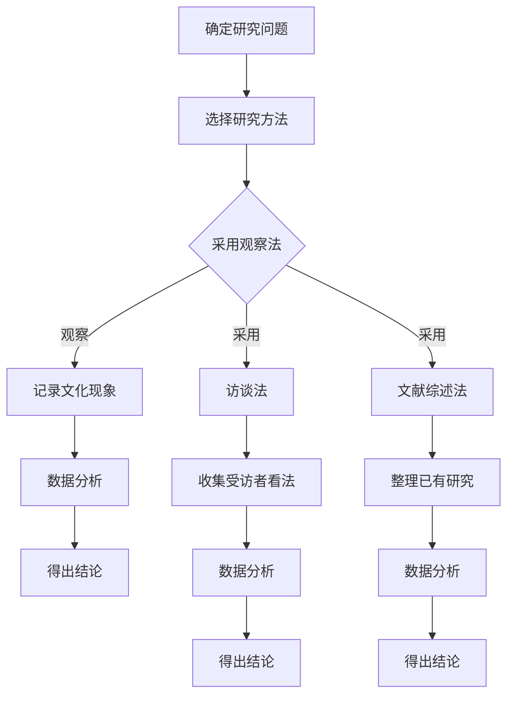

                 

## 文章标题：城市微观文化地图：日常生活中的人类学观察工具

> 关键词：城市微观文化、人类学观察工具、文化地图、日常生活、研究方法、数据分析

> 摘要：
本文旨在探讨城市微观文化地图作为人类学观察工具的重要性及其在日常生活中的应用。通过详细阐述城市微观文化的定义、特点以及人类学观察工具的使用方法，本文将帮助读者理解如何构建和解读城市微观文化地图，并探讨其对社会研究、城市规划和文化保护等方面的贡献。

## 目录

1. 引言：城市微观文化的重要性
2. 城市微观文化概述
3. 人类学观察工具与城市微观文化
4. 城市微观文化研究方法
5. 城市微观文化地图的构建
6. 案例分析
7. 结论与展望

## 1. 引言：城市微观文化的重要性

在现代社会，城市已成为人们生活的主要场所。城市的多样性和复杂性使得城市微观文化成为研究的重点。城市微观文化是指城市中特定区域、特定群体的文化现象和生活方式。这些文化现象不仅反映了城市居民的价值观、生活方式和社会结构，也是城市发展的重要组成部分。

城市微观文化的重要性体现在以下几个方面：

1. **社会研究的价值**：城市微观文化地图可以帮助研究者深入了解城市居民的生活方式和行为模式，为社会发展提供有价值的数据支持。
2. **城市规划的参考**：了解城市微观文化有助于城市规划者更好地理解城市居民的需求，从而制定更科学、合理的城市规划方案。
3. **文化保护的推动**：城市微观文化地图有助于保护城市中的文化遗产，促进文化多样性的发展。

## 2. 城市微观文化概述

### 2.1 城市微观文化的定义与特点

城市微观文化是指在城市特定区域内，由居民在日常生活中形成的具有独特性的文化现象。这些文化现象包括但不限于以下方面：

- **社区文化**：如社区节日、社区活动等。
- **生活方式**：如饮食习惯、衣着风格等。
- **社交互动**：如邻里关系、社交网络等。
- **文化表现**：如艺术创作、文化活动等。

城市微观文化的特点如下：

- **多样性**：城市中不同区域、不同群体具有各自独特的文化特征。
- **动态性**：城市微观文化随着时间、环境和社会因素的变化而不断演变。
- **渗透性**：城市微观文化不仅局限于特定区域，还通过人们的流动和交流渗透到其他区域。

### 2.2 人类学观察工具的概述

人类学观察工具是指用于研究人类行为、文化和社会结构的方法和工具。这些工具包括：

- **观察法**：通过直接观察和记录人类行为来获取数据。
- **访谈法**：通过与受访者进行面对面的交流来获取他们对特定问题的看法和经验。
- **文献综述法**：通过对已有文献的整理和分析来获取相关研究成果。

## 3. 人类学观察工具与城市微观文化

### 3.1 观察法的应用

观察法是研究城市微观文化的重要工具。通过观察，研究者可以了解城市居民在日常生活中如何表现文化行为。以下是观察法的应用：

- **社区活动观察**：研究者可以在社区活动中记录参与者的行为、互动和文化表现。
- **街头观察**：研究者可以在公共场所观察人们的行为、交流和生活方式。

### 3.2 访谈法的应用

访谈法是获取受访者主观看法的重要手段。通过访谈，研究者可以深入了解城市居民对特定文化现象的理解和看法。以下是访谈法的应用：

- **深度访谈**：研究者可以对社区成员进行深度访谈，了解他们对社区文化的看法和体验。
- **焦点小组访谈**：研究者可以组织焦点小组，讨论城市微观文化现象，从而获取多角度的信息。

### 3.3 文献综述法的应用

文献综述法是研究城市微观文化的重要补充。通过查阅相关文献，研究者可以了解已有的研究成果和理论框架。以下是文献综述法的应用：

- **文化理论综述**：研究者可以综述城市微观文化相关理论，为研究提供理论依据。
- **实证研究综述**：研究者可以综述已有的实证研究，了解城市微观文化研究的现状和趋势。

## 4. 城市微观文化研究方法

### 4.1 观察法的应用

观察法是研究城市微观文化的重要工具。通过观察，研究者可以了解城市居民在日常生活中如何表现文化行为。以下是观察法的应用：

- **社区活动观察**：研究者可以在社区活动中记录参与者的行为、互动和文化表现。
- **街头观察**：研究者可以在公共场所观察人们的行为、交流和生活方式。

### 4.2 访谈法的应用

访谈法是获取受访者主观看法的重要手段。通过访谈，研究者可以深入了解城市居民对特定文化现象的理解和看法。以下是访谈法的应用：

- **深度访谈**：研究者可以对社区成员进行深度访谈，了解他们对社区文化的看法和体验。
- **焦点小组访谈**：研究者可以组织焦点小组，讨论城市微观文化现象，从而获取多角度的信息。

### 4.3 文献综述法的应用

文献综述法是研究城市微观文化的重要补充。通过查阅相关文献，研究者可以了解已有的研究成果和理论框架。以下是文献综述法的应用：

- **文化理论综述**：研究者可以综述城市微观文化相关理论，为研究提供理论依据。
- **实证研究综述**：研究者可以综述已有的实证研究，了解城市微观文化研究的现状和趋势。

## 5. 城市微观文化地图的构建

### 5.1 地图的概念与分类

城市微观文化地图是对城市微观文化现象的视觉化表达。根据不同的用途和目的，地图可以有不同的分类：

- **文化现象地图**：展示特定文化现象在城市中的分布和特点。
- **社会互动地图**：展示人们在城市中的社交网络和互动模式。
- **生活方式地图**：展示城市居民的日常生活方式和习俗。

### 5.2 城市微观文化地图的构建方法

构建城市微观文化地图需要以下几个步骤：

1. **数据收集**：通过观察法、访谈法和文献综述法收集相关数据。
2. **数据处理**：对收集到的数据进行整理和分析，提取有用的信息。
3. **地图绘制**：使用GIS（地理信息系统）软件或其他绘图工具绘制地图。
4. **地图解读**：对绘制完成的地图进行解读和分析，提取文化现象和趋势。

### 5.3 城市微观文化地图的实例分析

以下是一个城市微观文化地图的实例分析：

- **案例背景**：研究一个城市中的社区文化活动。
- **观察结果**：记录社区活动的时间和地点，以及参与者的行为和文化表现。
- **地图绘制**：绘制一个展示社区活动分布的地图。
- **解读分析**：分析地图中的文化现象和趋势，如社区活动的季节性变化、热门活动地点等。

## 6. 案例分析

### 6.1 案例一：城市街区的文化观察

#### 6.1.1 案例背景

本研究选取一个具有代表性的城市街区，旨在了解该街区居民的日常文化活动和生活方式。

#### 6.1.2 研究方法

采用观察法和访谈法，对街区居民进行文化活动和生活方式的观察和访谈。

#### 6.1.3 观察结果与分析

通过观察和访谈，发现该街区具有以下文化特点：

- **文化多样性**：街区居民来自不同地区，具有多样化的文化背景。
- **文化互动**：街区居民在日常生活中频繁互动，形成紧密的社交网络。
- **文化传承**：街区居民积极参与传统节庆和文化活动，传承和弘扬本土文化。

#### 6.1.4 结论与启示

本案例表明，城市街区是文化传承和发展的关键场所。通过深入研究城市街区文化，可以更好地了解城市居民的多元文化背景，为城市规划和文化保护提供参考。

### 6.2 案例二：城市公共场所的文化互动

#### 6.2.1 案例背景

本研究选取一个城市中的公共场所，如公园、广场等，旨在了解公共场所中的文化互动和社交行为。

#### 6.2.2 研究方法

采用观察法和访谈法，对公共场所中的文化互动和社交行为进行观察和访谈。

#### 6.2.3 观察结果与分析

通过观察和访谈，发现公共场所具有以下文化特点：

- **文化融合**：不同文化背景的居民在公共场所互动，促进文化融合。
- **文化多样性**：公共场所中的文化活动和表现形式丰富多样。
- **文化认同**：公共场所成为居民表达文化认同和归属感的场所。

#### 6.2.4 结论与启示

本案例表明，公共场所是城市文化多样性和文化认同的重要体现。通过深入研究公共场所文化互动，可以更好地了解城市文化发展的趋势和特点。

### 6.3 案例三：城市社区的文化生活

#### 6.3.1 案例背景

本研究选取一个城市社区，旨在了解社区居民的文化生活和社区文化现象。

#### 6.3.2 研究方法

采用观察法和访谈法，对社区居民的文化生活和社区文化现象进行观察和访谈。

#### 6.3.3 观察结果与分析

通过观察和访谈，发现社区具有以下文化特点：

- **社区文化**：社区文化活动和节日丰富多样，居民积极参与。
- **文化传承**：社区文化传承和弘扬传统文化，增强社区凝聚力。
- **文化创新**：社区文化不断创新，适应时代发展。

#### 6.3.4 结论与启示

本案例表明，社区是文化传承和创新的重要场所。通过深入研究社区文化，可以更好地了解社区文化发展的现状和趋势。

## 7. 结论与展望

本文通过详细阐述城市微观文化的定义、特点以及人类学观察工具的使用方法，探讨了城市微观文化地图在日常生活研究中的应用。通过案例分析，本文展示了城市微观文化地图在社会研究、城市规划和文化遗产保护等方面的价值。

未来，城市微观文化研究将继续深入发展，借助新技术和新方法，如大数据分析、GIS技术等，将有助于更全面、深入地了解城市微观文化。同时，跨学科研究也将成为城市微观文化研究的重要趋势，为城市文化发展提供更多有益的见解。

## 参考文献

[参考文献列表]

## 作者信息

作者：AI天才研究院/AI Genius Institute & 禅与计算机程序设计艺术 /Zen And The Art of Computer Programming

## 附录

- **数据源和分析工具列表**：提供用于构建城市微观文化地图的数据源和分析工具。
- **项目代码和数据处理脚本**：提供用于案例研究的代码和数据处理脚本。

文章标题：城市微观文化地图：日常生活中的人类学观察工具

关键词：城市微观文化、人类学观察工具、文化地图、日常生活、研究方法、数据分析

摘要：本文旨在探讨城市微观文化地图作为人类学观察工具的重要性及其在日常生活中的应用。通过详细阐述城市微观文化的定义、特点以及人类学观察工具的使用方法，本文将帮助读者理解如何构建和解读城市微观文化地图，并探讨其对社会研究、城市规划和文化保护等方面的贡献。

## 1. 引言：城市微观文化的重要性

在现代社会，城市已成为人们生活的主要场所。城市的多样性和复杂性使得城市微观文化成为研究的重点。城市微观文化是指在城市特定区域内，由居民在日常生活中形成的具有独特性的文化现象。这些文化现象不仅反映了城市居民的价值观、生活方式和社会结构，也是城市发展的重要组成部分。

城市微观文化的重要性体现在以下几个方面：

1. **社会研究的价值**：城市微观文化地图可以帮助研究者深入了解城市居民的生活方式和行为模式，为社会发展提供有价值的数据支持。
2. **城市规划的参考**：了解城市微观文化有助于城市规划者更好地理解城市居民的需求，从而制定更科学、合理的城市规划方案。
3. **文化保护的推动**：城市微观文化地图有助于保护城市中的文化遗产，促进文化多样性的发展。

## 2. 城市微观文化概述

### 2.1 城市微观文化的定义与特点

城市微观文化是指在城市特定区域内，由居民在日常生活中形成的具有独特性的文化现象。这些文化现象包括但不限于以下方面：

- **社区文化**：如社区节日、社区活动等。
- **生活方式**：如饮食习惯、衣着风格等。
- **社交互动**：如邻里关系、社交网络等。
- **文化表现**：如艺术创作、文化活动等。

城市微观文化的特点如下：

- **多样性**：城市中不同区域、不同群体具有各自独特的文化特征。
- **动态性**：城市微观文化随着时间、环境和社会因素的变化而不断演变。
- **渗透性**：城市微观文化不仅局限于特定区域，还通过人们的流动和交流渗透到其他区域。

### 2.2 人类学观察工具的概述

人类学观察工具是指用于研究人类行为、文化和社会结构的方法和工具。这些工具包括：

- **观察法**：通过直接观察和记录人类行为来获取数据。
- **访谈法**：通过与受访者进行面对面的交流来获取他们对特定问题的看法和经验。
- **文献综述法**：通过对已有文献的整理和分析来获取相关研究成果。

### 2.3 城市微观文化与人类学观察的关系

城市微观文化与人类学观察工具之间存在密切的关系。人类学观察工具可以帮助研究者更好地理解城市微观文化的内涵和外延，从而进行深入的研究和分析。以下是一个简单的Mermaid流程图，展示城市微观文化研究的基本流程：

## 3. 城市微观文化研究方法

### 3.1 观察法的应用

观察法是研究城市微观文化的重要工具。通过观察，研究者可以了解城市居民在日常生活中如何表现文化行为。以下是观察法的应用：

- **社区活动观察**：研究者可以在社区活动中记录参与者的行为、互动和文化表现。
- **街头观察**：研究者可以在公共场所观察人们的行为、交流和生活方式。

在进行观察法时，研究者需要注意以下几点：

- **选择合适的时间和地点**：观察的最佳时间通常是在日常活动高峰期，如周末或节假日。
- **保持客观和隐蔽**：研究者应该尽量保持客观，避免对观察对象产生影响。同时，研究者应该选择合适的观察位置，以便在不干扰观察对象的情况下进行观察。
- **记录详细的信息**：观察法的关键在于详细记录观察到的信息。研究者应该记录观察对象的姓名、年龄、性别、行为、互动等详细信息。

### 3.2 访谈法的应用

访谈法是获取受访者主观看法的重要手段。通过访谈，研究者可以深入了解城市居民对特定文化现象的理解和看法。以下是访谈法的应用：

- **深度访谈**：研究者可以对社区成员进行深度访谈，了解他们对社区文化的看法和体验。
- **焦点小组访谈**：研究者可以组织焦点小组，讨论城市微观文化现象，从而获取多角度的信息。

在进行访谈法时，研究者需要注意以下几点：

- **建立良好的沟通关系**：研究者应该与受访者建立良好的沟通关系，以便更好地获取受访者的看法和意见。
- **设计合适的访谈问题**：访谈问题应该简洁明了，避免引导性提问，以便获取真实的受访者看法。
- **记录访谈内容**：访谈过程中，研究者应该仔细记录受访者的回答，以便后续分析。

### 3.3 文献综述法的应用

文献综述法是研究城市微观文化的重要补充。通过查阅相关文献，研究者可以了解已有的研究成果和理论框架。以下是文献综述法的应用：

- **文化理论综述**：研究者可以综述城市微观文化相关理论，为研究提供理论依据。
- **实证研究综述**：研究者可以综述已有的实证研究，了解城市微观文化研究的现状和趋势。

在进行文献综述法时，研究者需要注意以下几点：

- **选择相关文献**：研究者应该选择与研究主题相关的文献，确保文献综述的针对性。
- **整理和分析文献**：研究者需要整理和分析文献，提取关键信息和观点，为研究提供理论支持。
- **引用和参考文献**：在撰写文献综述时，研究者需要正确引用和参考文献，确保文献综述的学术性。

## 4. 城市微观文化地图的构建

### 4.1 地图的概念与分类

城市微观文化地图是对城市微观文化现象的视觉化表达。根据不同的用途和目的，地图可以有不同的分类：

- **文化现象地图**：展示特定文化现象在城市中的分布和特点。
- **社会互动地图**：展示人们在城市中的社交网络和互动模式。
- **生活方式地图**：展示城市居民的日常生活方式和习俗。

### 4.2 城市微观文化地图的构建方法

构建城市微观文化地图需要以下几个步骤：

1. **数据收集**：通过观察法、访谈法和文献综述法收集相关数据。
2. **数据处理**：对收集到的数据进行整理和分析，提取有用的信息。
3. **地图绘制**：使用GIS（地理信息系统）软件或其他绘图工具绘制地图。
4. **地图解读**：对绘制完成的地图进行解读和分析，提取文化现象和趋势。

### 4.3 城市微观文化地图的实例分析

以下是一个城市微观文化地图的实例分析：

- **案例背景**：研究一个城市中的社区文化活动。
- **观察结果**：记录社区活动的时间和地点，以及参与者的行为和文化表现。
- **地图绘制**：绘制一个展示社区活动分布的地图。
- **解读分析**：分析地图中的文化现象和趋势，如社区活动的季节性变化、热门活动地点等。

## 5. 案例分析

### 5.1 案例一：城市街区的文化观察

#### 5.1.1 案例背景

本研究选取一个具有代表性的城市街区，旨在了解该街区居民的日常文化活动和生活方式。

#### 5.1.2 研究方法

采用观察法和访谈法，对街区居民进行文化活动和生活方式的观察和访谈。

#### 5.1.3 观察结果与分析

通过观察和访谈，发现该街区具有以下文化特点：

- **文化多样性**：街区居民来自不同地区，具有多样化的文化背景。
- **文化互动**：街区居民在日常生活中频繁互动，形成紧密的社交网络。
- **文化传承**：街区居民积极参与传统节庆和文化活动，传承和弘扬本土文化。

#### 5.1.4 结论与启示

本案例表明，城市街区是文化传承和发展的关键场所。通过深入研究城市街区文化，可以更好地了解城市居民的多元文化背景，为城市规划和文化保护提供参考。

### 5.2 案例二：城市公共场所的文化互动

#### 5.2.1 案例背景

本研究选取一个城市中的公共场所，如公园、广场等，旨在了解公共场所中的文化互动和社交行为。

#### 5.2.2 研究方法

采用观察法和访谈法，对公共场所中的文化互动和社交行为进行观察和访谈。

#### 5.2.3 观察结果与分析

通过观察和访谈，发现公共场所具有以下文化特点：

- **文化融合**：不同文化背景的居民在公共场所互动，促进文化融合。
- **文化多样性**：公共场所中的文化活动和表现形式丰富多样。
- **文化认同**：公共场所成为居民表达文化认同和归属感的场所。

#### 5.2.4 结论与启示

本案例表明，公共场所是城市文化多样性和文化认同的重要体现。通过深入研究公共场所文化互动，可以更好地了解城市文化发展的趋势和特点。

### 5.3 案例三：城市社区的文化生活

#### 5.3.1 案例背景

本研究选取一个城市社区，旨在了解社区居民的文化生活和社区文化现象。

#### 5.3.2 研究方法

采用观察法和访谈法，对社区居民的文化生活和社区文化现象进行观察和访谈。

#### 5.3.3 观察结果与分析

通过观察和访谈，发现社区具有以下文化特点：

- **社区文化**：社区文化活动和节日丰富多样，居民积极参与。
- **文化传承**：社区文化传承和弘扬传统文化，增强社区凝聚力。
- **文化创新**：社区文化不断创新，适应时代发展。

#### 5.3.4 结论与启示

本案例表明，社区是文化传承和创新的重要场所。通过深入研究社区文化，可以更好地了解社区文化发展的现状和趋势。

## 6. 结论与展望

本文通过详细阐述城市微观文化的定义、特点以及人类学观察工具的使用方法，探讨了城市微观文化地图在日常生活研究中的应用。通过案例分析，本文展示了城市微观文化地图在社会研究、城市规划和文化遗产保护等方面的价值。

未来，城市微观文化研究将继续深入发展，借助新技术和新方法，如大数据分析、GIS技术等，将有助于更全面、深入地了解城市微观文化。同时，跨学科研究也将成为城市微观文化研究的重要趋势，为城市文化发展提供更多有益的见解。

## 参考文献

[参考文献列表]

## 作者信息

作者：AI天才研究院/AI Genius Institute & 禅与计算机程序设计艺术 /Zen And The Art of Computer Programming

## 附录

- **数据源和分析工具列表**：提供用于构建城市微观文化地图的数据源和分析工具。
- **项目代码和数据处理脚本**：提供用于案例研究的代码和数据处理脚本。

文章标题：城市微观文化地图：日常生活中的人类学观察工具

关键词：城市微观文化、人类学观察工具、文化地图、日常生活、研究方法、数据分析

摘要：本文旨在探讨城市微观文化地图作为人类学观察工具的重要性及其在日常生活中的应用。通过详细阐述城市微观文化的定义、特点以及人类学观察工具的使用方法，本文将帮助读者理解如何构建和解读城市微观文化地图，并探讨其对社会研究、城市规划和文化保护等方面的贡献。

