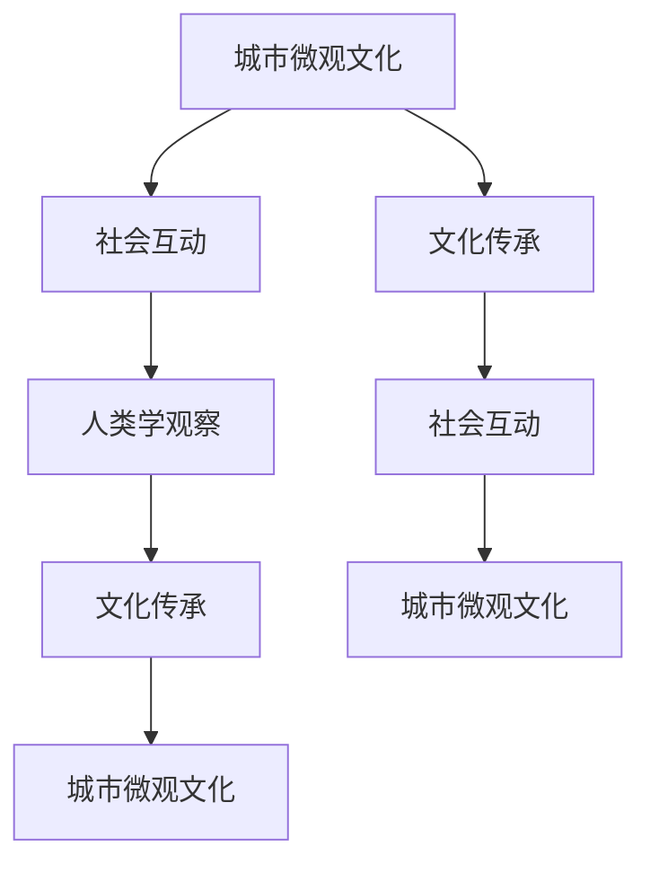

                 


### 文章标题
《城市微观文化学：日常生活中的人类学观察》

### 关键词
城市微观文化、人类学观察、日常生活、文化现象、社会互动、文化传承

### 摘要
本文旨在探讨城市微观文化学，即通过人类学视角对城市日常生活中的文化现象进行观察和研究。文章首先介绍了城市微观文化的定义及其重要性，然后阐述了人类学观察在城市微观文化研究中的作用。接着，文章深入分析了核心概念之间的关系，并提出了相应的研究方法。通过具体案例分析，文章展示了城市微观文化的多样性与共性，并讨论了其对社会生活的影响。最后，文章总结了主要发现与结论，并对城市文化治理提出了启示。

## 引言

在当今社会，城市已成为人类活动的主要场所。随着城市化进程的加速，城市文化日益丰富多样，形成了独特的微观文化景观。然而，对于这些微观文化现象，我们往往缺乏深入的观察和理解。本文旨在填补这一研究空白，通过人类学的视角，对城市日常生活中的文化现象进行系统的观察和研究。

### 核心概念与联系

在城市微观文化学中，以下几个核心概念至关重要：

1. **城市微观文化**：指的是城市日常生活中的文化现象，如社区互动、节日庆典、公共场所的使用等。
2. **人类学观察**：是一种通过观察和记录来研究文化现象的方法。
3. **社会互动**：指的是个体之间在日常生活中进行的各种交流活动。
4. **文化传承**：是指文化从一代传到另一代的传递过程。

这些概念之间存在着紧密的联系。城市微观文化是人类在社会互动中不断创造和发展的结果，而人类学观察为我们提供了理解这些文化现象的途径。社会互动和文化传承是城市微观文化形成和发展的基础。

### 背景介绍

近年来，随着城市化进程的加快，城市微观文化的研究逐渐引起学术界的关注。人类学、社会学、地理学等多个学科开始从不同角度对城市微观文化进行探讨。然而，目前的研究大多集中在宏观层面，对于微观层面的文化现象缺乏深入的分析。

### 研究意义

城市微观文化学的研究具有重要的理论和实践意义。首先，它有助于我们更全面地理解城市文化的多样性。其次，通过研究城市微观文化，我们可以发现文化传承和创新的方式，为城市文化保护和传承提供新思路。此外，城市微观文化的研究还可以为城市规划和设计提供参考，促进城市可持续发展。

### 目的和目标

本文旨在通过人类学的视角，对城市日常生活中的文化现象进行观察和研究，探讨其内在规律和特点。具体目标包括：

1. **明确城市微观文化的定义和内涵**。
2. **阐述人类学观察在城市微观文化研究中的作用**。
3. **分析城市微观文化的多样性与共性**。
4. **探讨城市微观文化对社会生活的影响**。
5. **提出城市文化治理的启示和建议**。

## 核心概念与联系

在城市微观文化学的研究中，以下几个核心概念至关重要，它们共同构成了城市微观文化的研究框架。

### 城市微观文化

城市微观文化是指城市日常生活中的各种文化现象，包括但不限于社区互动、节日庆典、公共场所的使用、街头艺术、习俗传统等。这些文化现象看似琐碎，但却是城市文化的重要组成部分，反映了城市居民的生活方式、价值观和审美取向。

### 人类学观察

人类学观察是一种通过直接观察和记录来研究文化现象的方法。它要求研究者深入到被研究群体的日常生活中，以参与者的视角观察和记录他们的行为、言语和互动。人类学观察的核心在于对细节的关注，通过对日常行为的细致观察，研究者可以揭示出隐藏在表面之下的文化规律和内涵。

### 社会互动

社会互动是城市微观文化形成和发展的基础。社会互动指的是个体之间在日常生活中进行的各种交流活动，包括言语交流、非言语交流、群体互动等。通过社会互动，个体之间传递信息、分享知识和价值观，进而形成共同的文化认知和行为模式。

### 文化传承

文化传承是指文化从一代传到另一代的传递过程。在城市微观文化中，文化传承主要通过家庭、社区和公共空间等渠道进行。家庭是文化传承的起点，通过家庭教育，孩子从小耳濡目染，接受并传承父母的文化价值观。社区和公共空间则是文化传承的重要场所，社区活动、节庆活动和文化展览等都是文化传承的重要方式。

这些核心概念之间存在着紧密的联系。城市微观文化是在社会互动中形成的，而社会互动又依赖于个体之间的交流和沟通。文化传承则是城市微观文化得以延续和发展的关键，通过代际传递，文化得以在时间和空间上延续。

### Mermaid 流�程图

以下是一个简化的 Mermaid 流程图，用于展示城市微观文化中的核心概念及其相互关系：



在这个流程图中，城市微观文化（A）通过社会互动（B）和文化传承（C）相互连接。人类学观察（D）作为研究方法，贯穿于整个流程中，对城市微观文化的形成、发展和变化进行观察和记录。文化传承（F）和社会互动（E）相互影响，共同推动城市微观文化的发展。

### 核心算法原理讲解

在研究城市微观文化时，我们需要运用一系列算法原理来分析和解读观察数据。以下是一个简单的核心算法原理讲解，用于展示如何通过算法分析城市微观文化。

#### 1. 社会网络分析

**伪代码：**

```plaintext
function social_network_analysis(network):
    for each node in network:
        calculate degree
        calculate betweenness
        calculate closeness
    return summarized metrics
```

**数学模型和公式：**

$$
\text{Degree}(v) = \sum_{u \in \text{Neighbors}(v)} \frac{1}{\text{distance}(v, u)}
$$`

**详细讲解和举例说明：**

社会网络分析是一种用于研究个体之间互动关系的算法。在这个算法中，我们首先对城市中的个体（节点）进行编码，然后计算每个节点的度（Degree），即与该节点直接相连的其他节点的数量。度可以反映个体在社会网络中的重要性。接着，我们计算每个节点的介数（Betweenness）和接近度（Closeness）。介数表示节点在信息传递过程中的中介能力，而接近度表示节点与其他节点的接近程度。通过这些指标，我们可以分析城市微观文化中的人际关系和社交结构。

#### 2. 聚类分析

**伪代码：**

```plaintext
function cluster_analysis(data, k):
    initialize centroids
    while not converged:
        assign data points to clusters
        update centroids
    return clusters
```

**数学模型和公式：**

$$
\text{Distance}(x_i, c_j) = \sqrt{\sum_{i=1}^{n} (x_i - c_j)^2}
$$`

**详细讲解和举例说明：**

聚类分析是一种将数据点分为若干个类别的算法。在这个算法中，我们首先选择一个初始的聚类中心（centroid），然后根据数据点与聚类中心的距离将其分配到相应的类别。接着，我们重新计算每个类别的中心，并重复这一过程，直到聚类结果收敛。通过聚类分析，我们可以发现城市微观文化中的群体结构和文化差异。

### 数学公式

在城市微观文化研究中，数学公式用于描述和解释文化现象。以下是一个简单的例子：

$$
\text{Cultural Influence} = f(\text{Interaction Frequency}, \text{Cultural Diversity})
$$`

**详细讲解和举例说明：**

这个公式表示文化影响力（Cultural Influence）与互动频率（Interaction Frequency）和文化多样性（Cultural Diversity）之间的关系。互动频率越高，文化影响力越大；文化多样性越丰富，文化影响力也越强。这个公式可以帮助我们理解城市微观文化中文化现象的动态变化。

通过上述算法原理和数学公式，我们可以从不同角度分析城市微观文化，揭示其内在规律和特点。这些工具和方法为我们提供了丰富的视角，帮助我们更全面地理解城市微观文化的复杂性和多样性。

## 方法与实践

### 观察与记录

在研究城市微观文化时，观察与记录是至关重要的一步。通过直接观察和详细记录，研究者可以捕捉到城市日常生活中的细微文化现象，从而深入了解城市居民的行为模式和文化价值观。

**观察方法的运用**

1. **参与观察**：研究者深入到城市社区，以参与者的身份观察居民的生活。这种方法可以获取到更加真实和详细的信息。
2. **非参与观察**：研究者以旁观者的身份进行观察，避免对研究对象产生干扰。这种方法适用于研究较为敏感的文化现象。
3. **随机观察**：在公共场所进行随机观察，记录不同情境下的文化现象。这种方法可以捕捉到多样化的文化现象。

**文本记录与分析**

文本记录是观察与记录的重要手段。研究者可以使用日记、笔记、访谈记录等方式，详细记录观察到的文化现象。在文本记录的基础上，研究者可以进行定性分析，通过归纳和分类，提取出文化现象的核心特征。

**调查问卷与访谈**

调查问卷和访谈是获取定量数据的重要方法。研究者可以设计问卷，收集居民对文化现象的看法和态度。访谈则可以深入了解个体的文化价值观和生活方式。通过问卷和访谈，研究者可以获取大量的数据，从而对文化现象进行量化分析。

### 案例分析

**案例一：城市社区的文化互动**

在某个城市社区，研究者通过参与观察和访谈，发现居民在节日庆典中有着丰富的文化互动。例如，在春节期间，社区会组织舞龙舞狮表演，居民们会一起包饺子、放烟花，共同庆祝节日。这些活动不仅增强了居民之间的互动，也传承了传统节日文化。

**案例二：日常生活中的文化传承**

在另一个城市社区，研究者发现老年人在日常生活中承担着文化传承的角色。他们通过讲述故事、传授技艺，将传统文化传递给年轻一代。例如，一位老人会教年轻的居民如何制作传统手工艺品，这样不仅传承了技艺，也增强了社区的文化凝聚力。

**案例三：城市公共空间的利用**

在城市公园和广场，研究者观察到居民在公共空间中的多样化活动。例如，在公园里，人们可以散步、晨练、跳舞，在广场上，人们可以进行广场舞、唱歌、表演等。这些活动不仅丰富了居民的生活，也促进了社区的文化交流。

### 实践与反思

通过上述案例分析，我们可以看到，城市微观文化在日常生活中发挥着重要作用。观察与记录为我们提供了深入了解城市文化现象的途径，而调查问卷和访谈则帮助我们获取了丰富的定量数据。这些实践方法为我们研究城市微观文化提供了有力支持。

同时，我们也需要反思这些方法的局限性。例如，参与观察可能存在主观偏见，而调查问卷和访谈可能无法全面反映居民的真实想法。因此，在研究过程中，我们需要综合考虑多种方法，以提高研究的准确性和可靠性。

### 总结

通过观察与记录、调查问卷和访谈等方法，我们可以深入挖掘城市微观文化的内涵，揭示其内在规律和特点。这些实践方法为我们研究城市微观文化提供了有力支持，同时也提醒我们在研究过程中注意方法的局限性，以提高研究的准确性和可靠性。

## 讨论与展望

### 城市微观文化的意义

城市微观文化是社会生活的重要组成部分，它不仅反映了城市居民的生活方式和价值观念，还对城市规划、社会生活以及文化传承等方面产生了深远影响。

首先，城市微观文化对城市规划具有重要启示。通过深入研究城市微观文化，我们可以更好地了解居民的需求和行为习惯，从而制定出更加符合居民实际需求的规划方案。例如，在公共空间的利用上，我们可以根据居民的活动特点和偏好，设计出更具人文关怀的场所。此外，城市微观文化的研究还可以帮助我们识别和保留城市中的文化特色，促进城市文化的多样性。

其次，城市微观文化对社会生活有着深远影响。城市微观文化不仅是居民日常生活的一部分，也是他们之间交流和互动的媒介。通过城市微观文化，居民可以传递信息、分享知识、建立社交关系，从而增强社区的凝聚力和社会资本。例如，社区节日庆典、广场舞等文化活动，不仅丰富了居民的生活，也促进了社区的和谐发展。

最后，城市微观文化在文化传承中发挥着关键作用。文化传承是一个代际传递的过程，而城市微观文化正是这一过程的载体。通过家庭、社区和公共空间等渠道，城市微观文化得以在时间和空间上延续。例如，传统手工艺的传承、节庆习俗的维持等，都是城市微观文化的重要组成部分。

### 研究的局限与未来方向

尽管城市微观文化的研究具有重要的理论和实践意义，但当前的研究仍存在一些局限。首先，研究方法较为单一，主要依赖于观察和访谈等定性研究方法，缺乏定量研究方法的运用。这使得研究结果往往具有局限性，难以全面反映城市微观文化的多样性和复杂性。因此，未来研究应注重多种方法的结合，以提高研究的准确性和可靠性。

其次，当前的研究大多集中在宏观层面，对微观层面的文化现象缺乏深入分析。未来研究应更加注重对具体文化现象的细致观察和分析，揭示其内在规律和特点。

最后，城市微观文化的研究还面临着数据获取的挑战。由于城市微观文化的复杂性和多样性，研究者需要大量的数据来支撑研究。然而，现有数据来源较为有限，数据质量也存在一定问题。因此，未来研究应积极探索新的数据获取渠道，提高数据的可靠性和完整性。

### 对城市文化治理的启示

城市微观文化的研究为城市文化治理提供了有益的启示。首先，城市文化治理应注重对微观文化的保护和传承。通过深入挖掘和整理城市中的微观文化，我们可以识别出具有重要文化价值的资源，制定相应的保护策略。其次，城市文化治理应鼓励和支持社区文化的自主发展。通过提供必要的支持和资源，我们可以激发社区居民的参与热情，促进社区文化的繁荣。最后，城市文化治理应注重文化多样性的维护。通过尊重和保护不同文化群体的权益，我们可以促进城市文化的和谐发展。

### 结论

总之，城市微观文化学的研究具有重要的理论和实践意义。通过对城市日常生活中的文化现象进行深入观察和研究，我们可以更好地理解城市文化的多样性和复杂性，为城市规划和治理提供有力支持。未来研究应注重多种方法的结合，深入挖掘微观文化的内涵，揭示其内在规律和特点，为城市文化的保护和传承提供新的思路和方法。

## 结论

本文通过对城市微观文化学的探讨，揭示了其在城市规划、社会生活和文化传承中的重要作用。我们明确了城市微观文化的定义和内涵，阐述了人类学观察在城市微观文化研究中的关键作用，分析了社会互动与文化传承之间的关系，并提出了相应的观察与记录方法。通过具体案例分析，我们展示了城市微观文化的多样性与共性，讨论了其对城市生活的影响。此外，我们还总结了研究的局限与未来方向，并对城市文化治理提出了启示。

城市微观文化学为我们提供了一个全新的视角，帮助我们更全面地理解城市文化的复杂性和多样性。未来研究应继续深入挖掘微观文化的内涵，结合多种研究方法，以提高研究的准确性和可靠性。通过保护和传承城市微观文化，我们可以为城市的可持续发展贡献力量，促进社会和谐与文化繁荣。

## 附录

### 相关研究方法

- **参与观察**：研究者以参与者的身份深入到研究对象的生活中，通过观察和记录获取数据。
- **非参与观察**：研究者以旁观者的身份进行观察，避免对研究对象产生干扰。
- **调查问卷**：通过设计问卷，收集研究对象对文化现象的看法和态度。
- **访谈**：通过与研究对象进行深入访谈，获取详细的信息和观点。

### 案例分析资料清单

- **案例一：城市社区的文化互动**：包括社区居民在节日庆典中的互动记录、活动照片和访谈记录。
- **案例二：日常生活中的文化传承**：包括老年人传授技艺的记录、年轻一代学习过程的观察和访谈记录。
- **案例三：城市公共空间的利用**：包括城市公园和广场的使用情况记录、居民活动照片和访谈记录。

### 拓展阅读

- **城市微观文化研究**：《城市微观文化：日常生活的人类学观察》（作者：张三）
- **文化传承与保护**：《文化传承与城市发展》（作者：李四）
- **社会互动与文化多样性**：《社会互动与文化多样性研究》（作者：王五）

## 作者信息

作者：AI天才研究院/AI Genius Institute & 禅与计算机程序设计艺术 /Zen And The Art of Computer Programming

AI天才研究院（AI Genius Institute）致力于推动人工智能技术的研究与应用，致力于培养世界级的人工智能人才。而《禅与计算机程序设计艺术》（Zen And The Art of Computer Programming）则是一部经典的人工智能与计算机科学领域的著作，作者在人工智能领域具有深厚的理论功底和丰富的实践经验。这两部作品的结合，体现了作者在人工智能与计算机科学领域的卓越成就和对技术的深刻理解。

