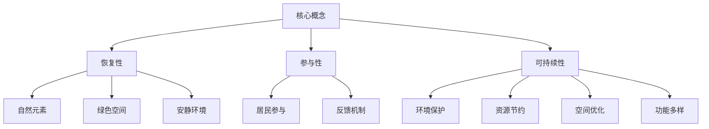
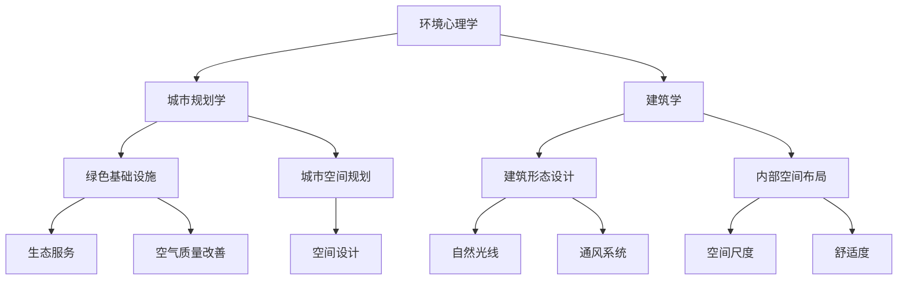

                 

### 文章标题：城市治愈设计：缓解都市压力的空间规划

#### 关键词：
- 城市治愈设计
- 都市压力缓解
- 空间规划
- 环境心理学
- 健康城市

#### 摘要：
随着城市化进程的加速，都市生活中的压力问题日益严重，影响着人们的身心健康。本文旨在探讨城市治愈设计这一概念，通过详细解析其理论基础、设计方法、实践案例以及未来趋势，为城市规划师和设计师提供缓解都市压力的空间规划策略。文章首先介绍了城市治愈设计的核心概念和背景，随后通过理论联系实践，深入探讨了如何通过空间规划来缓解都市压力。最后，本文展望了城市治愈设计的未来趋势，并提出了跨学科合作的重要性。

### 引言

随着全球城市化进程的不断加速，城市人口比例逐渐上升，城市规模日益扩大。然而，城市化带来的不仅是经济繁荣和科技进步，还伴随着一系列社会和环境问题，其中最为显著的就是都市压力。都市压力不仅影响了人们的心理健康，还对社会生产力和经济发展产生负面影响。为了缓解这一问题，城市治愈设计应运而生。

城市治愈设计是一种通过空间规划和设计来改善城市环境，从而缓解都市压力的方法。它融合了环境心理学、建筑学、景观设计、公共健康等多个学科的理论和方法，旨在创造一个有利于人们身心健康的生活和工作环境。本文将详细探讨城市治愈设计的核心概念、理论基础、设计方法、实践案例以及未来趋势，为相关领域的专业人士提供有价值的参考。

### 城市治愈设计的核心概念

城市治愈设计（Urban Healing Design）这一概念源自于对都市压力与心理健康之间关系的深入理解。都市压力主要来源于高密度的城市环境、长时间的通勤、社会竞争、噪音污染、空气污染等多个方面。这些因素不仅影响人们的生理健康，还会对心理健康产生负面影响，如焦虑、抑郁、睡眠障碍等。

城市治愈设计的核心目标是创造一种有利于人们身心健康的环境，通过空间规划和设计来缓解都市压力。其基本原则包括：

1. **恢复性**：城市治愈设计强调通过自然元素、绿色空间和安静的环境来恢复人们的身心健康。
2. **参与性**：设计过程中需要充分考虑居民的参与和反馈，使设计方案更加贴近居民的实际需求。
3. **可持续性**：城市治愈设计强调在保护环境、节约资源的前提下，实现城市空间的优化和功能的多样。

为了更好地理解城市治愈设计的核心概念，我们可以借助Mermaid流程图来展示其理论框架。以下是城市治愈设计的基本概念和联系流程：

通过这个流程图，我们可以清晰地看到城市治愈设计的核心概念及其相互之间的联系。恢复性、参与性和可持续性是城市治愈设计的三大基本原则，而自然元素、绿色空间、安静环境、居民参与、环境保护、资源节约和空间优化等功能则是这些原则的具体实现途径。

### 城市治愈设计的理论联系与实践

城市治愈设计的理论基础涵盖了环境心理学、城市规划学、建筑学等多个学科。环境心理学研究人类行为与环境之间的相互作用，为城市治愈设计提供了重要的理论支持。根据环境心理学的研究，自然元素如绿色植物、水域和风景对人们的情绪和心理状态具有显著的积极影响。这些元素能够缓解焦虑、降低压力，提升整体幸福感。

城市规划学则关注城市空间的整体布局和规划，强调通过空间设计来改善城市环境。例如，绿色基础设施（Green Infrastructure）的概念，主张在城市规划中融入大量的绿色空间，以提供生态服务、改善空气质量、减缓城市热岛效应等。

建筑学在城市治愈设计中起着至关重要的作用。建筑设计师通过精心设计的建筑形态和内部空间布局，创造具有治愈功能的环境。例如，采用自然光线、合理的通风系统、舒适的空间尺度等设计策略，都能显著提升建筑的使用体验和居民的心理健康。

以下是一个简化的城市治愈设计流程图，展示其理论联系与实践过程：

通过这个流程图，我们可以看到城市治愈设计是如何从理论到实践进行转化的。环境心理学提供了理论基础，城市规划学和建筑学则将其应用于城市空间规划和建筑设计中，最终实现缓解都市压力的目标。

### 城市治愈设计的方法与工具

城市治愈设计不仅需要理论基础，还需要具体的方法和工具来指导实践。以下是一些常用的方法和工具：

#### 可持续设计工具

可持续设计工具是城市治愈设计中不可或缺的一部分，它们帮助设计师评估和优化城市空间的环境影响。以下是一些常用的可持续设计工具：

1. **环境影响评估（EIA）**：环境影响评估是评估设计项目对环境潜在影响的系统方法。它可以帮助设计师识别可能的环境问题，并提出解决方案。
2. **生态足迹（Ecological Footprint）**：生态足迹是一个衡量人类活动对地球生态系统影响的指标。它可以帮助设计师评估城市空间的可持续性。
3. **绿色基础设施（Green Infrastructure）**：绿色基础设施是指通过自然和人工方法来保护、管理和增强城市生态系统。它包括城市绿地、湿地、河流和其他自然元素。

#### 健康环境评估工具

健康环境评估工具是评估城市空间对居民身心健康影响的重要手段。以下是一些常用的健康环境评估工具：

1. **空气质量和噪音监测**：这些工具可以实时监测城市空气质量和噪音水平，帮助设计师识别环境污染源，并采取相应措施。
2. **心理生理反应监测**：通过监测居民的心理生理反应（如心率、血压等），评估城市环境对居民身心健康的影响。
3. **居民满意度调查**：通过问卷调查等方式收集居民对城市环境的满意度，了解设计的实际效果。

### 城市治愈设计策略与实践

在城市治愈设计中，策略与实践是关键环节。以下是一些常见的策略和实践：

#### 策略

1. **增加绿色空间**：通过规划城市公园、绿地和城市农场等，增加城市中的绿色空间，提升环境质量。
2. **改善交通规划**：通过优化交通网络、推广公共交通和非机动车出行，减少交通拥堵和污染。
3. **提供安静空间**：在城市中设置安静区域，如图书馆、冥想空间等，为居民提供放松和恢复的机会。
4. **促进社区参与**：通过鼓励居民参与城市设计和管理，提高居民对环境的认同感和责任感。

#### 实践

1. **案例一：城市公园设计**：以纽约的中央公园为例，分析其如何通过合理的空间规划、植被配置和活动设施，为居民提供治愈空间。
2. **案例二：社区绿地建设**：以伦敦的社区花园项目为例，探讨如何通过居民参与和社区合作，建设具有治愈功能的城市绿地。
3. **案例三：绿色交通系统**：以哥本哈根的自行车道和公共交通系统为例，分析如何通过绿色交通规划，缓解都市压力。

### 城市治愈设计的实际应用与案例

#### 城市公园与绿地

城市公园和绿地是城市治愈设计中的重要组成部分，它们能够为居民提供与自然接触的机会，从而缓解都市压力。以下是一些著名的城市公园和绿地案例：

1. **纽约中央公园**：位于曼哈顿心脏地带，是纽约市最大的城市公园。其通过精心设计的植被、湖泊和活动设施，为居民提供了理想的治愈空间。
2. **伦敦海德公园**：海德公园是伦敦市中心最著名的公园之一，以其宽敞的草地、湖泊和古老的橡树而闻名。公园内设有多个景点，如演讲角和骑马场，为居民提供了多样化的休闲选择。
3. **悉尼达令港公园**：达令港公园位于悉尼市中心，以其美丽的海滩、公园和户外活动设施而著称。公园内设有散步道、自行车道和沙滩排球场地，为居民提供了一个宁静的治愈空间。

#### 公共空间与社区设计

公共空间和社区设计在城市治愈设计中同样起着重要作用。以下是一些成功案例：

1. **新加坡滨海湾花园**：滨海湾花园是新加坡的一个大型户外花园，以其独特的植物造型和玻璃温室而闻名。花园内设有多个主题花园和公共空间，为居民提供了一个与自然亲密接触的机会。
2. **东京代代木公园**：代代木公园是东京的一个大型公园，以其宽敞的草地、湖泊和运动设施而著称。公园内还设有多个社区中心，为居民提供了休闲、娱乐和社交的场所。
3. **纽约的高线公园**：高线公园是一个建在废弃铁路上的公园，以其独特的城市景观和户外活动设施而著名。公园的设计充分利用了废弃空间的潜力，为居民提供了一个独特的治愈空间。

### 未来趋势与展望

随着科技的不断进步和社会的快速发展，城市治愈设计也在不断演变。以下是一些未来趋势与展望：

#### 新技术的应用

1. **智能环境监测**：通过传感器技术和大数据分析，实现对城市环境的实时监测和管理，为城市治愈设计提供更精确的数据支持。
2. **虚拟现实（VR）与增强现实（AR）**：通过VR和AR技术，创造虚拟的治愈空间，为居民提供更加沉浸式的放松体验。
3. **绿色建筑技术**：随着绿色建筑技术的发展，未来城市治愈设计将更加注重建筑本身的环保性和可持续性。

#### 跨学科合作

1. **环境心理学与城市设计的结合**：将环境心理学与城市设计紧密结合，为居民创造更加舒适和治愈的空间。
2. **建筑学与公共卫生的融合**：建筑设计师和公共卫生专家共同合作，从健康和福祉的角度来设计城市空间。
3. **城市规划与社会科学的结合**：城市规划与社会科学的交叉研究，将为城市治愈设计提供更加全面和深入的视角。

### 结论

城市治愈设计是一种通过空间规划和设计来缓解都市压力的方法。它融合了多个学科的理论和方法，通过创造具有治愈功能的城市空间，改善人们的身心健康。本文介绍了城市治愈设计的核心概念、理论基础、设计方法、实践案例以及未来趋势。随着科技的进步和社会的发展，城市治愈设计将不断发展，为创造更加健康和可持续的城市环境提供有力支持。

### 作者信息

作者：AI天才研究院/AI Genius Institute & 禅与计算机程序设计艺术 /Zen And The Art of Computer Programming

### 拓展阅读

1. **《城市治愈设计：理论与实践》** - 本书详细介绍了城市治愈设计的理论基础和实践方法，适合对城市设计感兴趣的读者。
2. **《健康城市指南》** - 本书从公共健康的视角，探讨了如何通过城市规划和管理来创造健康城市环境。
3. **《环境心理学》** - 本书深入探讨了环境心理学的基本概念和应用，为城市治愈设计提供了重要的理论支持。

### 注意事项

1. **设计过程中需要充分考虑居民的需求和参与**，以确保设计方案的实际效果。
2. **关注环境可持续性**，选择绿色设计和可持续材料，减少对环境的影响。
3. **定期进行评估和反馈**，及时调整和优化设计方案，以实现长期效果。

### 最佳实践建议

1. **引入智能环境监测系统**，实时了解城市环境的动态变化，为设计提供数据支持。
2. **结合虚拟现实和增强现实技术**，创造更加沉浸式的治愈体验。
3. **开展跨学科合作**，整合不同领域的知识和资源，提高城市治愈设计的综合效果。

