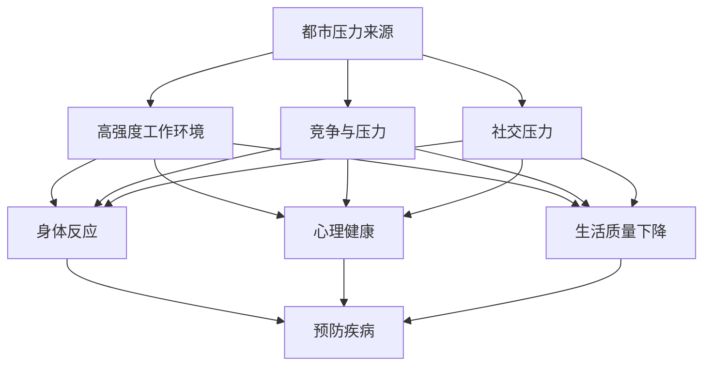
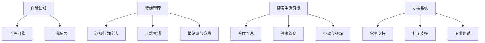
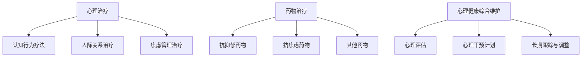
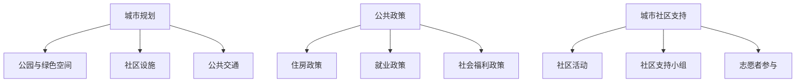
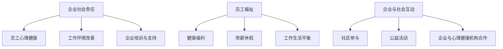
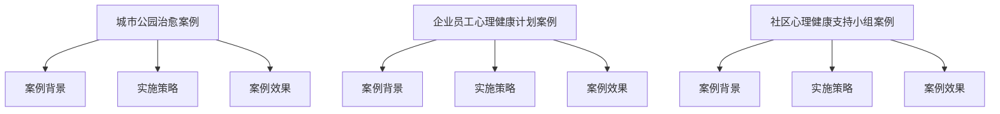
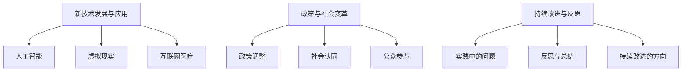

                 

## 文章标题：城市治愈：都市压力的自我修复

### 关键词：都市压力、自我修复、心理健康、城市规划、企业社会责任

> 摘要：本文从都市生活的压力来源、影响及管理策略入手，探讨了都市压力对身心健康的影响，并提出了一系列自我修复的方法。同时，文章分析了城市规划与公共政策对心理健康的作用，以及企业社会责任在员工福祉方面的实践。通过成功案例的剖析，为城市治愈提供了可行的路径和策略。

---

### 第一部分：都市生活的压力解析

#### 第1章：都市压力的来源与影响

##### 1.1 都市生活的压力源

都市生活的压力源多种多样，主要包括以下几方面：

- **高强度工作环境**：都市白领普遍面临高强度的工作压力，长时间的加班和繁重的工作任务导致身心疲惫。

- **竞争与压力**：都市生活竞争激烈，人们为了生活品质和社会地位不断努力，这种竞争带来的压力不容忽视。

- **社交压力**：都市生活的社交圈较为复杂，社交活动频繁，人们常常感到社交压力，担心自己被孤立或被他人评判。

##### 1.2 压力的健康影响

压力对身心健康的影响是多方面的：

- **身体反应**：长期压力会导致免疫力下降，引发各种身体疾病，如高血压、心脏病等。

- **心理健康**：压力会引起焦虑、抑郁等心理问题，严重影响生活质量。

- **生活质量下降**：长期处于压力状态，人们的生活质量会显著下降，影响家庭关系、工作表现等。

##### 1.3 压力的社会文化因素

都市压力的产生也与社会文化因素密切相关：

- **工作文化**：都市的工作文化普遍强调高效率、快节奏，这加剧了人们的压力。

- **社会期望**：社会对个人的期望值较高，人们为了满足这些期望，往往需要付出更多的努力。

- **教育与成长环境**：个人的成长环境和教育背景也会影响其对压力的应对能力。

##### 1.4 压力管理的必要性

压力管理的必要性体现在以下几个方面：

- **预防疾病**：通过有效的压力管理，可以降低患病风险，提高身体健康水平。

- **提高工作效率**：缓解压力，使人们更加专注和高效地工作。

- **促进人际关系**：良好的压力管理有助于改善人际关系，建立更和谐的社会关系。

##### 1.5 城市治愈的愿景

城市治愈的愿景包括：

- **城市生活的改善**：通过改善都市生活环境，降低生活压力，提升居民生活质量。

- **心理健康的提升**：通过心理支持和治疗，提升居民心理健康水平。

- **社会文化的改变**：通过教育和宣传，改变社会文化，倡导健康的生活方式和价值观。

#### Mermaid 流程图：都市压力来源与影响关系架构

---

### 第二部分：自我修复的策略与方法

#### 第2章：自我认知与情绪管理

##### 2.1 自我认知的重要性

自我认知是指对自己的认识和理解。自我认知的重要性体现在：

- **了解自我**：通过自我认知，人们可以更好地了解自己的性格、兴趣、价值观等，从而更好地规划自己的人生。

- **自我反思**：自我反思有助于人们认识到自己的不足，从而调整自己的行为，提升自我。

##### 2.2 情绪管理的技巧

情绪管理是指如何处理和应对情绪。情绪管理的技巧包括：

- **认知行为疗法**：通过改变负面的思维模式，调整情绪和行为。

- **正念冥想**：通过冥想和专注练习，培养对情绪的觉察和掌控能力。

- **情绪调节策略**：如深呼吸、放松训练等，帮助人们快速缓解情绪。

##### 2.3 建立健康的生活习惯

建立健康的生活习惯对自我修复至关重要，包括：

- **合理作息**：保证充足的睡眠，避免熬夜。

- **健康饮食**：均衡饮食，避免过量摄入高热量、高脂肪的食物。

- **运动与锻炼**：定期进行体育锻炼，增强体质。

##### 2.4 建立支持系统

建立支持系统有助于缓解压力，包括：

- **家庭支持**：家庭是人们最重要的支持系统，家庭关系的和谐对心理健康至关重要。

- **社交支持**：建立良好的社交关系，寻求朋友和同事的帮助。

- **专业帮助**：当个人难以应对压力时，寻求专业心理咨询和治疗。

#### Mermaid 流�程图：自我修复策略关系架构

---

### 第三部分：城市环境的改善与支持

#### 第3章：心理治疗与药物干预

##### 3.1 心理治疗的选择

心理治疗是缓解压力和改善心理健康的重要手段。常见的心理治疗包括：

- **认知行为疗法**：通过改变负面思维模式，改善情绪和行为。

- **人际关系治疗**：通过改善人际关系，提升心理健康。

- **焦虑管理治疗**：专门针对焦虑症状进行的治疗。

##### 3.2 药物治疗的作用

药物治疗在缓解压力和改善心理健康方面也有重要作用，常见的药物包括：

- **抗抑郁药物**：用于治疗抑郁症。

- **抗焦虑药物**：用于治疗焦虑症。

- **其他药物**：如镇静剂、抗精神病药等。

##### 3.3 心理健康的综合维护

心理健康的综合维护包括：

- **心理评估**：评估心理健康状况，制定干预计划。

- **心理干预计划**：根据评估结果，制定个性化的心理干预计划。

- **长期跟踪与调整**：对心理干预效果进行跟踪，根据需要调整干预计划。

#### Mermaid 流程图：心理治疗与药物干预关系架构

---

### 第四部分：实践与反思

#### 第4章：城市规划与公共政策的调整

##### 4.1 城市规划对心理健康的影响

城市规划对心理健康的影响主要体现在以下几个方面：

- **公园与绿色空间**：公园和绿色空间为居民提供了休闲和放松的场所，有助于缓解压力。

- **社区设施**：完善的社区设施，如健身房、图书馆等，有助于居民保持健康的生活习惯。

- **公共交通**：便捷的公共交通系统有助于减少交通压力，提高居民的生活质量。

##### 4.2 公共政策的作用

公共政策在改善心理健康方面具有重要作用，主要包括：

- **住房政策**：合理的住房政策有助于提高居民的生活质量，减轻生活压力。

- **就业政策**：就业政策有助于提高居民的就业机会，降低失业率，缓解生活压力。

- **社会福利政策**：社会福利政策为居民提供了保障，有助于缓解生活压力。

##### 4.3 城市社区的支持

城市社区的支持主要体现在以下几个方面：

- **社区活动**：通过组织社区活动，增强居民之间的互动，提高社区的凝聚力。

- **社区支持小组**：建立社区支持小组，为居民提供心理支持和帮助。

- **志愿者参与**：鼓励志愿者参与社区服务，为居民提供更多的支持。

#### Mermaid 流程图：城市规划与公共政策对心理健康的影响

---

### 第5章：企业社会责任与员工福祉

##### 5.1 企业社会责任的视角

企业社会责任在员工福祉方面的实践包括：

- **员工心理健康**：企业提供心理咨询服务，关注员工的身心健康。

- **工作环境改善**：改善工作环境，提高员工的舒适度和工作效率。

- **企业培训与支持**：提供培训机会，提升员工的专业技能和心理素质。

##### 5.2 员工福祉的实践

员工福祉的实践包括：

- **健康福利**：提供健康体检、医疗保险等福利，保障员工的身体健康。

- **带薪休假**：提供充足的带薪休假，让员工有足够的时间休息和充电。

- **工作生活平衡**：通过灵活的工作安排，帮助员工实现工作与生活的平衡。

##### 5.3 企业与社会的互动

企业与社会互动的实践包括：

- **社区参与**：企业积极参与社区活动，为社区的发展贡献力量。

- **公益活动**：企业组织公益活动，关注社会问题，履行社会责任。

- **企业与心理健康机构的合作**：与心理健康机构合作，共同推动心理健康事业的发展。

#### Mermaid 流程图：企业社会责任与员工福祉关系架构

---

### 第五部分：实践与反思

#### 第6章：城市治愈的成功案例

##### 6.1 案例研究一：城市公园的治愈作用

**案例背景**：某城市在市中心修建了一座大型城市公园，旨在为居民提供休闲和放松的场所。

**实施策略**：通过合理规划公园设施，提供各类休闲娱乐活动，吸引居民前来使用。

**案例效果**：公园的修建大大提升了居民的生活质量，居民的心理健康状况得到了明显改善。

##### 6.2 案例研究二：企业员工心理健康计划

**案例背景**：某大型企业在员工福利方面推出了心理健康计划。

**实施策略**：提供心理咨询服务，组织心理健康讲座，关注员工的心理健康。

**案例效果**：员工的心理健康状况得到了显著改善，工作效率和生活质量都有所提升。

##### 6.3 案例研究三：社区心理健康支持小组

**案例背景**：某社区成立了心理健康支持小组，为居民提供心理支持和帮助。

**实施策略**：组织心理健康讲座、心理辅导、社区活动等，增进居民之间的互动和交流。

**案例效果**：社区居民的心理健康水平得到了提升，社区凝聚力显著增强。

#### Mermaid 流程图：城市治愈成功案例关系架构

---

### 第7章：城市治愈的未来展望

##### 7.1 新技术的发展与应用

新技术的发展为城市治愈带来了新的可能：

- **人工智能**：人工智能技术在心理治疗、心理健康评估等方面有广泛应用，有助于提高治疗效果。

- **虚拟现实**：虚拟现实技术可以模拟各种环境，为心理治疗提供新的手段。

- **互联网医疗**：互联网医疗平台为心理健康服务提供了便捷的渠道，有助于提高心理健康服务的覆盖率和效率。

##### 7.2 政策与社会变革

政策与社会变革对城市治愈有着重要影响：

- **政策调整**：政府通过政策调整，加大对心理健康事业的投入，推动心理健康服务的普及。

- **社会认同**：社会对心理健康的重视程度逐渐提高，心理健康服务逐渐得到社会的认可。

- **公众参与**：公众对心理健康问题的关注度提高，积极参与心理健康活动，推动心理健康事业的发展。

##### 7.3 持续改进与反思

城市治愈需要持续改进与反思：

- **实践中的问题**：在实践中，需要不断发现和解决各种问题，优化治愈策略。

- **反思与总结**：通过反思和总结，吸取经验教训，不断改进和完善治愈方法。

- **持续改进的方向**：根据新的研究成果和实践经验，持续改进城市治愈的方法和策略。

#### Mermaid 流程图：城市治愈未来展望关系架构

---

## 文章小结

本文从都市生活的压力来源、自我修复策略、城市环境的改善、企业社会责任以及未来展望等方面，探讨了都市压力的自我修复问题。通过理论与实践的结合，为城市治愈提供了有益的思路和策略。城市治愈不仅关乎个人心理健康，也关乎整个社会的和谐与发展。我们期待通过持续的努力，实现城市生活的美好愿景。

## 注意事项

- **心理健康的重要性**：重视心理健康，及时识别和干预心理问题，是城市治愈的关键。

- **自我认知与情绪管理**：自我认知和情绪管理是自我修复的基础，需要长期坚持和实践。

- **企业社会责任**：企业应关注员工福祉，提供心理支持和帮助，共同创造健康的工作环境。

- **政策支持**：政府应加大对心理健康事业的投入，制定相关政策和措施，推动心理健康服务的普及。

- **公众参与**：公众应积极参与心理健康活动，提高对心理健康的认识和重视。

## 拓展阅读

- **《都市心理健康指南》**：提供详细的都市心理健康知识和自我修复方法。

- **《城市规划与心理健康》**：探讨城市规划对心理健康的影响和作用。

- **《企业社会责任与员工福祉》**：介绍企业如何履行社会责任，提升员工福祉。

- **《心理治疗与药物干预》**：介绍心理治疗和药物治疗的方法和应用。

作者：AI天才研究院/AI Genius Institute & 禅与计算机程序设计艺术 /Zen And The Art of Computer Programming

