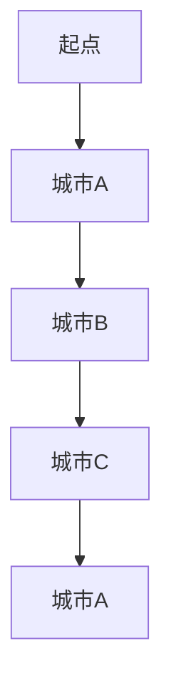
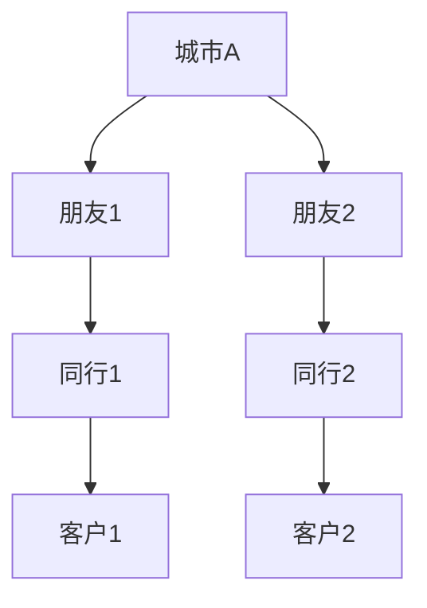
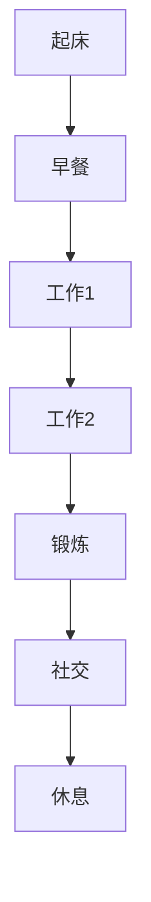
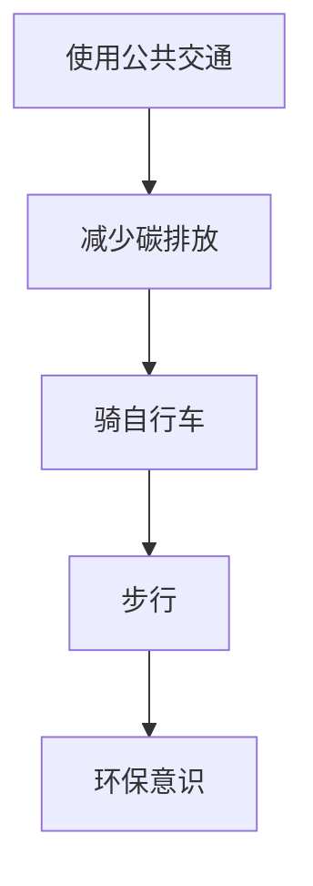
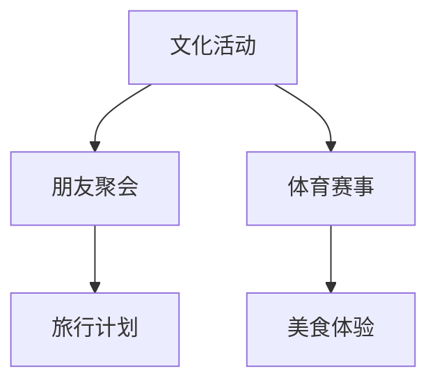
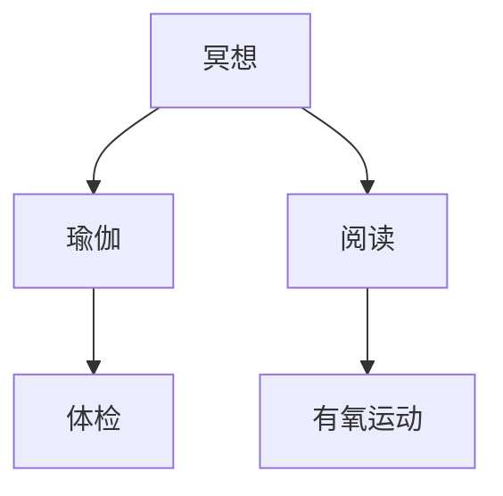
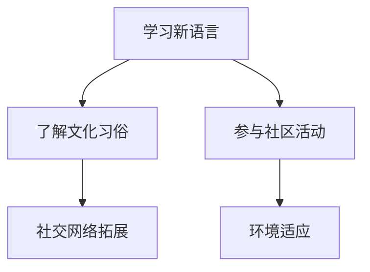
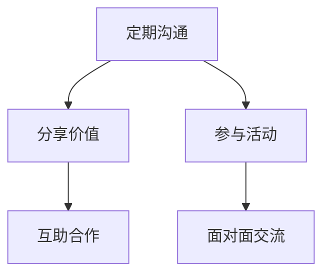
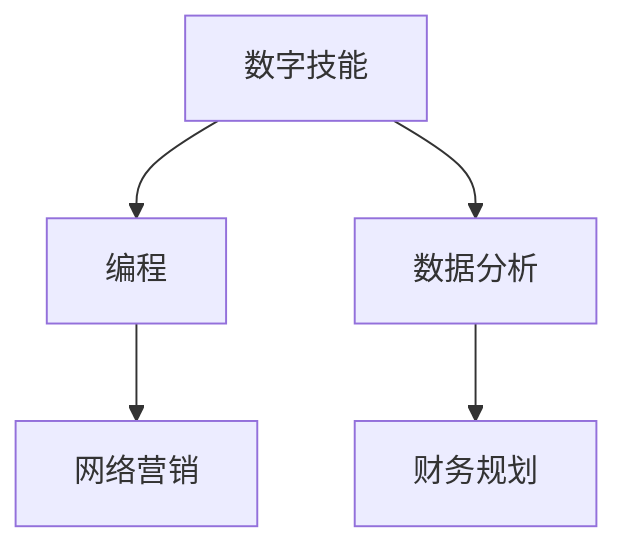
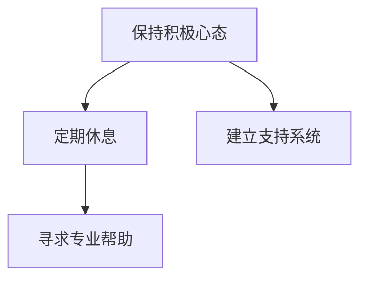

                 

### 文章标题

# 城市游牧主义：现代游民的生活方式

### 关键词

- 城市游牧主义
- 现代游民
- 生活方式
- 社会学原理
- 经济学原理
- 环境学原理

### 摘要

本文将深入探讨城市游牧主义这一现代生活方式的概念、特征及其背后的原理。我们将分析城市游牧主义的起源与发展，解析其与社会、经济和环境之间的关系。此外，本文还将探讨如何成为一名城市游牧者，以及他们所面临的各种挑战。通过案例分析，我们将了解城市游牧者的成功经验，并展望城市游牧主义未来的发展趋势。

----------------------------------------------------------------

## 引言

在当今快速变化的世界，城市游牧主义作为一种新兴的生活方式逐渐引起了人们的关注。所谓城市游牧主义，是指一种以城市为基地，通过移动和灵活性来实现生活方式多样化、社交网络扩大以及职业发展的现象。这种生活方式的兴起，不仅反映了现代社会对自由、独立和多元价值的追求，也体现了城市生活多样性和复杂性的增加。

城市游牧主义并非简单的流浪或漂泊，它有着更加明确的目的和意义。一方面，城市游牧者通过频繁的移动和居住地变化，实现了对城市文化的深入体验和了解。另一方面，这种生活方式也为他们提供了更多的职业机会和发展空间。例如，许多自由职业者、远程工作者以及创业者通过城市游牧，成功地实现了个人职业目标。

本文旨在系统地探讨城市游牧主义的概念、特征及其背后的原理。我们将通过分析城市游牧主义的起源与发展，探讨其与社会、经济和环境之间的关系。此外，本文还将提供实践建议，帮助有志于成为城市游牧者的人士了解和适应这种生活方式。最后，通过案例分析，我们将了解城市游牧者的成功经验，并展望城市游牧主义未来的发展趋势。

本文的结构如下：

1. **城市游牧主义概念**：介绍城市游牧主义的定义、起源和发展。
2. **现代游民的生活方式**：探讨现代游民的生活形态、日常活动以及社交网络。
3. **实践与建议**：提供成为城市游牧者的准备、技能与知识，以及心理调适的方法。
4. **案例分析**：分析成功城市游牧者的案例，总结其成功经验与教训。
5. **未来展望**：探讨城市游牧主义的发展趋势及其对社会的影响。

通过本文的深入探讨，我们希望读者能够对城市游牧主义有更全面、深刻的理解，从而为未来的生活和工作做出更有益的决策。

## 第一部分：城市游牧主义概念

### 第1章：城市游牧主义的定义

城市游牧主义是一种以城市为基地，通过频繁移动和灵活居住来实现生活方式多样化、社交网络扩大以及职业发展的现象。这种生活方式的核心理念是自由、独立和多样性。城市游牧者不仅追求个人自由，还通过不断探索和体验不同的城市和文化，实现个人成长和职业发展。

城市游牧主义与传统的流浪或漂泊有所不同。流浪者通常没有固定的居住地，生活状态不稳定，而城市游牧者则通过计划性的移动和选择，实现生活和工作的高效管理。城市游牧主义强调的是移动过程中的目的性和灵活性，而不是盲目的流浪。

城市游牧主义的定义可以从以下几个方面来理解：

1. **居住地变化**：城市游牧者会在不同的城市或地区居住，以适应工作和生活的需求。这种居住地的变化不是随机的，而是有目的的、计划性的。

2. **生活方式多样化**：城市游牧者通过在不同城市居住，体验不同的生活方式和文化，实现个人兴趣和爱好。

3. **职业发展**：城市游牧者通过在多个城市工作和学习，拓展职业网络，提升职业技能，实现职业发展的多样性。

4. **社交网络扩大**：城市游牧者通过在多个城市建立社交网络，拓展人脉，提升社交能力。

5. **经济独立性**：城市游牧者通常具有独立的经济能力，通过自由职业、远程工作或创业实现自我价值。

### 城市游牧主义的起源

城市游牧主义的起源可以追溯到20世纪后期，特别是信息技术和互联网的快速发展，为人们提供了更多的移动和工作机会。以下是一些关键事件：

1. **远程工作的兴起**：随着信息技术的发展，远程工作成为可能，人们不再需要固定在一个地方工作。

2. **自由职业者的崛起**：自由职业者通过互联网平台，如Upwork和Fiverr，可以获得来自全球的客户，实现了工作地点的自由选择。

3. **创业的普及**：互联网的普及降低了创业的门槛，越来越多的人选择成为创业者，通过移动和灵活性来实现职业目标。

4. **生活方式的改变**：随着人们对生活质量的追求，越来越多的人开始关注生活方式的多样性和自由，城市游牧主义应运而生。

### 城市游牧主义的特征

城市游牧主义具有以下几个特征：

1. **高流动性**：城市游牧者频繁在不同城市或地区居住，适应工作和生活的需求。

2. **独立性**：城市游牧者通常具有独立的经济能力和生活方式，不依赖于固定的雇主或居住地。

3. **灵活性**：城市游牧者能够根据个人需求和目标，灵活选择居住地和工作方式。

4. **多样化**：城市游牧者通过在不同城市居住，体验多样的生活方式和文化。

5. **社交网络**：城市游牧者通过在多个城市建立社交网络，拓展人脉，提升社交能力。

6. **自我管理**：城市游牧者需要自我管理时间、工作和生活，以实现高效的工作和生活平衡。

### 城市游牧主义与流浪者的区别

城市游牧主义与流浪者有以下几点区别：

1. **目的性**：城市游牧者的移动是有目的的，为了实现个人成长和职业发展，而流浪者通常是出于生活所迫。

2. **稳定性**：城市游牧者通过计划和灵活性，实现居住和工作的高效管理，而流浪者生活状态通常不稳定。

3. **独立性**：城市游牧者具有独立的经济能力，而流浪者通常缺乏稳定的经济来源。

4. **生活方式**：城市游牧者追求多样化的生活方式，而流浪者通常面临生活困难。

通过以上分析，我们可以看到城市游牧主义是一种具有独特特征和意义的生活方式，它不仅反映了现代社会对自由、独立和多样性的追求，也为人们提供了更多的机会和可能性。

### 第2章：城市游牧主义的原理

城市游牧主义作为一种独特的现代生活方式，其背后有着复杂而深刻的经济学、社会学和环境学原理。这些原理共同作用，为城市游牧者提供了实现个人目标和社会价值的可能性。下面，我们将逐一探讨这些原理。

#### 2.1 城市游牧主义的经济学原理

经济学原理是城市游牧主义的基础之一。首先，城市游牧主义促进了劳动市场的灵活性。由于互联网和信息技术的发展，人们可以在任何有网络连接的地方工作，这大大降低了劳动力的地理限制。城市游牧者通过在不同城市寻找工作机会，能够最大化个人职业发展潜力。

1. **劳动市场的灵活性**：城市游牧者能够根据市场需求和个人兴趣，灵活选择工作地点。这种灵活性不仅提高了个人的就业机会，也促进了劳动市场的动态平衡。
   
2. **职业发展的多样性**：通过在不同城市工作，城市游牧者可以接触到不同的行业和职业，从而拓展职业视野，提升职业技能。

3. **收入来源的多样性**：城市游牧者通常拥有多元化的收入来源。除了传统的工资收入，他们还可以通过自由职业、远程工作或创业获得收入。

4. **经济独立性**：城市游牧者依靠自身技能和知识，实现了经济独立性。这种独立性使得他们能够更好地规划个人生活和职业发展。

#### 2.2 城市游牧主义的社会学原理

社会学原理强调了社会互动和社会网络在城市游牧主义中的重要性。城市游牧者通过在不同城市建立和维持社交网络，能够实现社会价值和自我价值的双重提升。

1. **社会网络的建立**：城市游牧者通过参加各种社交活动、专业会议和社群，建立和维护广泛的社会网络。这些网络不仅提供了职业机会，也丰富了他们的社交生活。

2. **社会互动的多样性**：在不同城市居住，城市游牧者有机会与不同背景的人交往，拓宽了他们的视野和思维方式。

3. **社会角色的多样化**：城市游牧者不仅作为职业人士参与社会活动，还可以作为文化使者，推动不同城市之间的文化交流和融合。

4. **社会价值的实现**：通过积极参与社会活动，城市游牧者不仅实现了个人价值，也为社会带来了创新和多样性。

#### 2.3 城市游牧主义的环境学原理

环境学原理关注城市游牧主义对环境的影响，以及如何通过可持续的生活方式减少对环境的负面影响。

1. **资源利用的效率**：城市游牧者通常采用共享经济模式，如共享住宿、共享办公和共享交通，提高了资源利用效率，减少了浪费。

2. **环境保护的意识**：城市游牧者更加关注环境保护，倾向于选择绿色出行方式，如骑自行车、步行或使用公共交通工具。

3. **生态足迹的减少**：通过减少不必要的旅行和居住地变化，城市游牧者能够减少生态足迹，降低对环境的压力。

4. **可持续生活方式的倡导**：城市游牧者通过自己的生活方式，倡导可持续发展的理念，激励更多人关注环境保护。

通过以上分析，我们可以看到，城市游牧主义不仅仅是一种生活方式，更是一种深层次的社会、经济和环境互动。这些原理共同作用，为城市游牧者提供了丰富的机会和可能性，同时也对社会的可持续发展产生了积极影响。

### 第二部分：现代游民的生活方式

#### 第3章：现代游民的生活形态

现代游民，也称为城市游牧者，他们以城市为基地，通过移动和灵活性来实现个人成长、职业发展和生活方式的多样化。现代游民的生活形态具有以下几个显著特征：

#### 1. 移动性与灵活性

移动性和灵活性是现代游民生活的核心。他们不会固定在一个城市或地区，而是根据工作和生活的需求，在不同城市或地区之间频繁移动。这种生活方式使他们能够更好地适应各种环境和机会。

**流程图**：



在这个流程图中，A表示起点，B、C、D分别代表不同的城市，E表示回到起点。现代游民会在这些城市之间移动，实现工作和生活的平衡。

#### 2. 自主性与独立性

现代游民具有高度的自主性和独立性。他们通常不是传统意义上的雇员，而是自由职业者、远程工作者或创业者。这种独立性使他们能够自主决定工作内容、工作时间和工作地点。

**伪代码示例**：

```python
def work_as_a.freelancer():
    while true:
        receive_task()
        complete_task()
        earn_income()
```

在这个伪代码中，`receive_task()` 表示接受工作任务，`complete_task()` 表示完成任务，`earn_income()` 表示获得收入。现代游民通过这样的方式，实现自主工作。

#### 3. 多元化的社交网络

现代游民通过在不同城市居住和活动，建立了多元化的社交网络。这些社交网络不仅包括同事和客户，还包括志同道合的朋友和同行。

**Mermaid 社交网络图示例**：



在这个社交网络图中，A表示城市A，B、C表示朋友，D、E表示同行，F、G表示客户。现代游民通过这样的社交网络，实现职业发展和社交互动。

#### 4. 高效的时间管理

现代游民通常采用高效的时间管理方法，如时间块（time blocking）和优先级排序（priority sorting），以确保工作和生活的高效管理。

**Mermaid 时间管理流程图示例**：



在这个时间管理流程图中，A表示起床，B表示早餐，C、D表示工作，E表示锻炼，F表示社交，G表示休息。现代游民通过这样的方式，实现高效的时间管理。

#### 5. 绿色生活方式

现代游民注重环保，倾向于采用绿色生活方式。他们通过使用公共交通、骑自行车或步行等方式，减少碳排放，保护环境。

**Mermaid 环保生活方式图示例**：



在这个环保生活方式图中，A表示使用公共交通，B表示减少碳排放，C表示骑自行车，D表示步行，E表示环保意识。现代游民通过这样的方式，实现绿色生活方式。

通过以上分析，我们可以看到，现代游民的生活形态具有高度移动性、独立性、多元化社交网络、高效时间管理和绿色生活方式等特点。这些特点不仅使现代游民能够更好地适应现代社会的变化，也为他们的个人发展和职业成功提供了有力支持。

### 第4章：现代游民的日常活动

现代游民的日常活动充满了多样性和灵活性，这与他们追求自由和独立的生活方式紧密相关。以下是现代游民的日常活动及其对生活质量的影响。

#### 1. 工作与学习

现代游民的工作和学习活动通常具有高度灵活性。他们可能是一名自由职业者、远程工作者或创业者，通过互联网和各种在线工具进行工作。例如，他们可能会在咖啡馆、图书馆或共享办公空间工作，利用这些场所提供的便利设施和社交机会。

**伪代码示例**：

```python
def work_remotely():
    while true:
        log_in_to_project_management_tool()
        attend_video_conference()
        complete_project_tasks()
        submit_progress_reports()
```

在这个伪代码中，`log_in_to_project_management_tool()` 表示登录项目管理工具，`attend_video_conference()` 表示参加视频会议，`complete_project_tasks()` 表示完成项目任务，`submit_progress_reports()` 表示提交进度报告。这种灵活的工作方式使现代游民能够自主安排工作时间，提高工作效率。

#### 2. 社交与娱乐

现代游民注重社交和娱乐活动，以丰富他们的生活体验。他们可能会参加各种社交活动、文化活动或体育赛事，以结识新朋友和扩展社交网络。

**Mermaid 社交活动图示例**：



在这个社交活动图中，A表示文化活动，B表示朋友聚会，C表示体育赛事，D表示旅行计划，E表示美食体验。通过这些活动，现代游民不仅丰富了个人生活，还提升了社交能力。

#### 3. 精神养护与身心健康

现代游民重视精神养护和身心健康，他们会通过冥想、瑜伽、阅读等方式来放松身心。此外，他们还可能会定期进行体检、健身或有氧运动，以保持身体健康。

**Mermaid 身心健康活动图示例**：



在这个身心健康活动图中，A表示冥想，B表示瑜伽，C表示阅读，D表示体检，E表示有氧运动。这些活动有助于现代游民保持良好的精神状态和身体健康。

#### 4. 环境适应与探索

现代游民经常需要适应不同的环境和文化，这要求他们具备较强的适应能力和探索精神。他们会学习新语言、了解当地文化习俗，积极参与社区活动，以更好地融入当地社区。

**Mermaid 环境适应图示例**：



在这个环境适应图中，A表示学习新语言，B表示了解文化习俗，C表示参与社区活动，D表示社交网络拓展，E表示环境适应。通过这些活动，现代游民不仅提高了自己的适应能力，还丰富了生活体验。

#### 5. 财务管理

现代游民通常需要自我管理财务，确保收支平衡和资金安全。他们会制定预算计划、投资理财，以及规划长期财务目标。

**伪代码示例**：

```python
def manage_finances():
    while true:
        create_budget_plan()
        monitor_expenses()
        invest_in_financial_products()
        review_financial_progress()
```

在这个伪代码中，`create_budget_plan()` 表示制定预算计划，`monitor_expenses()` 表示监控支出，`invest_in_financial_products()` 表示投资理财产品，`review_financial_progress()` 表示审查财务进度。通过这些方式，现代游民能够有效地管理个人财务。

通过以上分析，我们可以看到，现代游民的日常活动不仅丰富多样，而且充满了自我管理和探索的精神。这些活动不仅提升了他们的生活质量，也为他们的个人成长和职业发展提供了有力支持。

### 第5章：现代游民的社交网络

在现代游民的生活中，社交网络扮演着至关重要的角色。他们通过建立和维护多样化的社交网络，不仅实现了个人成长，还提高了职业成功的机会。以下是现代游民如何建立、维持和利用社交网络的具体方法：

#### 1. 建立社交网络

现代游民通常通过以下几种方式建立社交网络：

- **在线社交平台**：利用LinkedIn、Facebook、Twitter等在线社交平台，与同行、潜在客户和行业专家建立联系。
- **专业社群**：加入专业社群和论坛，如Reddit、Quora、Slack社群等，参与讨论和分享经验。
- **线下活动**：参加各类线下活动，如行业会议、研讨会、社交聚会等，结识新朋友。
- **线上教育平台**：通过Coursera、Udemy等在线教育平台，结交志同道合的学习伙伴。

**伪代码示例**：

```python
def build_social_network():
    while true:
        connect_on_linkedin()
        join_forum_on_reddit()
        attend_conference()
        join_coursera_course()
```

在这个伪代码中，`connect_on_linkedin()` 表示在LinkedIn上建立联系，`join_forum_on_reddit()` 表示加入Reddit论坛，`attend_conference()` 表示参加行业会议，`join_coursera_course()` 表示加入在线课程。

#### 2. 维护社交网络

建立社交网络只是第一步，如何维持和扩展这些关系同样重要。现代游民通常会采取以下措施：

- **定期沟通**：定期与社交网络中的成员保持联系，通过电子邮件、社交媒体或即时通讯工具发送问候或更新。
- **分享价值**：在社交网络中分享有价值的见解、资源和经验，帮助他人解决问题，增加互动和信任。
- **参与活动**：积极参与社交网络组织的活动和会议，增加面对面交流的机会。
- **互助合作**：与他人建立互利合作的关系，共同实现目标。

**Mermaid 社交网络维护图示例**：



在这个社交网络维护图中，A表示定期沟通，B表示分享价值，C表示参与活动，D表示互助合作，E表示面对面交流。

#### 3. 利用社交网络

建立和维护社交网络的目的在于利用这些网络实现个人和职业目标。现代游民通常会采取以下几种方法：

- **职业机会**：通过社交网络，现代游民可以获取更多的职业机会，如工作邀请、项目合作或兼职机会。
- **资源获取**：利用社交网络，现代游民可以获取各种资源，如信息、工具、技术支持和资金。
- **知识共享**：通过社交网络，现代游民可以分享知识和经验，学习新技能，不断提升个人能力。
- **品牌推广**：通过社交网络，现代游民可以推广自己的品牌，提高知名度和影响力。

**伪代码示例**：

```python
def utilize_social_network():
    while true:
        apply_for_job()
        seek_collaboration()
        share_knowledge()
        promote 个人品牌()
```

在这个伪代码中，`apply_for_job()` 表示申请工作，`seek_collaboration()` 表示寻求合作，`share_knowledge()` 表示分享知识，`promote 个人品牌()` 表示推广个人品牌。

通过以上分析，我们可以看到，现代游民的社交网络不仅丰富了他们的生活，也为他们的职业成功提供了强有力的支持。通过有效建立、维持和利用社交网络，现代游民能够更好地实现个人和职业目标。

### 第6章：如何成为城市游牧者

成为城市游牧者不仅需要明确的目标和计划，还需要一系列准备工作、技能与知识的积累，以及心理调适。以下是如何成为城市游牧者的详细步骤。

#### 1. 制定目标与计划

首先，你需要明确自己的目标，这些目标可以是职业发展的、个人成长的，或是生活方式的改变。以下是制定目标和计划的步骤：

- **自我评估**：了解自己的兴趣、优势和价值观，明确自己想要实现的目标。
- **设定短期和长期目标**：将目标分为短期和长期，制定具体的行动计划和时间表。
- **制定预算**：根据目标，制定预算计划，确保在实现目标的过程中有足够的资金支持。

**伪代码示例**：

```python
def set_goals_and_plans():
    self_evaluation()
    set_short_term_goals()
    set_long_term_goals()
    create_budget_plan()
```

在这个伪代码中，`self_evaluation()` 表示自我评估，`set_short_term_goals()` 表示设定短期目标，`set_long_term_goals()` 表示设定长期目标，`create_budget_plan()` 表示制定预算计划。

#### 2. 准备工作

在制定目标和计划后，你需要进行一系列准备工作，以确保能够顺利成为城市游牧者。以下是一些准备工作：

- **积累资金**：确保有足够的资金支持你的城市游牧生活，包括日常开销、旅行费用和紧急备用资金。
- **准备装备**：购买或租赁必要的装备，如笔记本电脑、移动硬盘、便携式Wi-Fi设备等。
- **备份重要资料**：备份重要资料，如工作文件、个人文件和电子邮件，确保在任何地方都能访问。
- **学习新技能**：根据目标，学习必要的技能，如编程、外语、项目管理等。

**伪代码示例**：

```python
def prepare_work():
    accumulate_funds()
    purchase_equipment()
    backup_important_data()
    learn_new_skills()
```

在这个伪代码中，`accumulate_funds()` 表示积累资金，`purchase_equipment()` 表示购买装备，`backup_important_data()` 表示备份重要资料，`learn_new_skills()` 表示学习新技能。

#### 3. 技能与知识积累

成为城市游牧者需要具备一系列技能与知识，这些技能与知识将帮助你更好地适应城市游牧生活。以下是一些建议：

- **数字技能**：掌握数字技能，如编程、数据分析、网络营销等，这些技能将帮助你远程工作和创业。
- **语言能力**：学习一门或多门外语，这有助于你更好地融入不同城市和文化。
- **时间管理**：学会高效管理时间，确保工作和生活之间的平衡。
- **财务规划**：学会财务规划，确保你的财务状况稳定和可持续。

**Mermaid 技能与知识图示例**：



在这个技能与知识图中，A表示数字技能，B表示编程，C表示数据分析，D表示网络营销，E表示财务规划。

#### 4. 心理调适

城市游牧生活可能会带来一些心理压力，因此心理调适非常重要。以下是一些建议：

- **保持积极心态**：保持积极的心态，面对挑战和变化时保持乐观。
- **定期休息**：合理安排休息时间，确保身心健康。
- **建立支持系统**：与家人、朋友和同事保持联系，建立支持系统，互相鼓励和支持。
- **寻求专业帮助**：如果你感到压力过大，不妨寻求专业心理咨询师的帮助。

**Mermaid 心理调适图示例**：



在这个心理调适图中，A表示保持积极心态，B表示定期休息，C表示建立支持系统，D表示寻求专业帮助。

通过以上步骤，你可以逐步实现成为城市游牧者的目标。记住，成功需要时间和努力，但只要坚持不懈，你一定能够实现自己的梦想。

### 第7章：城市游牧者面临的挑战

尽管城市游牧主义具有许多优点，但成为一名城市游牧者也面临着一系列挑战。以下是一些常见挑战及其应对策略：

#### 1. 生活稳定性

城市游牧者的生活稳定性是一个重大挑战。频繁的搬迁和不确定的居住地可能导致生活不稳定，影响个人和职业发展。

**应对策略**：

- **建立稳定网络**：建立和维护稳定的社交网络，获得职业和生活上的支持。
- **灵活就业**：选择灵活的工作方式，如远程工作、自由职业或临时职位，以应对居住地的不确定性。
- **短期租赁**：选择短期租赁的居住地，以减少搬迁成本和时间。

#### 2. 财务规划

城市游牧者的财务规划也是一个挑战。由于收入来源的不稳定性，制定有效的财务计划至关重要。

**应对策略**：

- **预算管理**：制定详细的预算计划，确保收支平衡，并留出应急资金。
- **多元化收入**：通过多种途径增加收入来源，如自由职业、兼职工作和投资。
- **储蓄习惯**：培养良好的储蓄习惯，为未来的不确定情况做好准备。

#### 3. 社交压力

城市游牧者可能会面临社交压力，尤其是在新城市中建立社交网络时。

**应对策略**：

- **积极参与社交活动**：参加各类社交活动和社区活动，结识新朋友。
- **利用在线工具**：利用社交媒体和网络平台，拓展社交网络。
- **培养兴趣爱好**：培养共同兴趣爱好，与他人建立更深厚的友谊。

#### 4. 时间管理

城市游牧者需要高效管理时间，以平衡工作和生活。

**应对策略**：

- **制定时间表**：制定详细的时间表，合理安排工作和休息时间。
- **利用技术工具**：利用各种时间管理工具，如时间块、待办事项列表等，提高工作效率。
- **设定优先级**：明确工作优先级，确保重要任务得到优先处理。

#### 5. 精神健康

频繁的搬迁和生活变化可能对精神健康产生负面影响。

**应对策略**：

- **定期休息**：确保定期休息，避免过度劳累。
- **保持健康生活方式**：保持健康的饮食习惯、适量的锻炼和充足的睡眠。
- **寻求专业帮助**：如果感到精神压力过大，不妨寻求专业心理咨询师的帮助。

通过以上策略，城市游牧者可以更好地应对面临的挑战，实现个人和职业目标。

### 第8章：城市游牧者的成功案例

在本章中，我们将探讨几位成功城市游牧者的案例，了解他们的生活方式、职业发展以及如何克服挑战，为其他有志于成为城市游牧者的人提供宝贵的经验和教训。

#### 案例一：国外成功城市游牧者 - 玛丽亚

**生活方式**：玛丽亚是一位来自西班牙的自由职业者，她通过远程工作，成为了一名全球化的城市游牧者。她曾在欧洲、亚洲和美洲的多个城市居住，每住一段时间就会搬到新的地方。

**职业发展**：玛丽亚在数字营销领域拥有丰富的经验，通过自己的公司为全球客户提供服务。她善于利用社交媒体和在线工具，拓展客户资源和业务领域。

**挑战与解决方案**：

- **挑战**：在新的城市建立社交网络和客户资源。
- **解决方案**：玛丽亚积极参加当地的活动和社区，通过参加专业会议和社交聚会，结识新的同行和潜在客户。

**经验与教训**：玛丽亚的经验表明，积极参与当地活动是建立社交网络和拓展业务的关键。此外，保持灵活性和适应能力，能够更好地应对不同的环境和挑战。

#### 案例二：国内成功城市游牧者 - 张伟

**生活方式**：张伟是一位中国的软件工程师，他通过远程工作，成为了一名城市游牧者。他曾在多个城市居住，以获取不同的工作经验和职业机会。

**职业发展**：张伟在技术领域拥有扎实的功底，他通过远程工作和兼职项目，积累了丰富的实践经验。他还经常参加技术会议和开源项目，提升自己的技术能力。

**挑战与解决方案**：

- **挑战**：管理好远程工作和生活的时间。
- **解决方案**：张伟制定了详细的时间表，确保工作和休息时间的平衡。他还利用各种在线工具，如Trello和Asana，来管理任务和项目。

**经验与教训**：张伟的经验表明，时间管理和任务管理是远程工作的关键。保持高效的工作习惯，能够更好地实现个人和职业目标。

#### 案例三：国内成功城市游牧者 - 李婷

**生活方式**：李婷是一位中国的数字营销专家，她通过自由职业，成为了一名城市游牧者。她曾在多个城市居住，为客户提供数字营销和社交媒体管理服务。

**职业发展**：李婷在数字营销领域拥有丰富的经验，她通过自己的公司，为客户提供定制化的营销解决方案。她还积极参与各种线上和线下的营销活动，拓展业务。

**挑战与解决方案**：

- **挑战**：平衡工作和生活的压力。
- **解决方案**：李婷注重身心健康，定期锻炼和休息。她还学会了放松和减压的方法，如冥想和瑜伽。

**经验与教训**：李婷的经验表明，保持身心健康是城市游牧者成功的关键。学会管理压力，能够更好地应对工作和生活的挑战。

#### 案例四：国外成功城市游牧者 - 马克

**生活方式**：马克是一位来自美国的创业者，他通过在线教育和电商业务，成为了一名全球城市游牧者。他曾在多个国家居住，通过互联网连接全球市场。

**职业发展**：马克在电商和在线教育领域取得了显著成就，他的公司为全球客户提供产品和服务。他还积极参与各种创业活动和投资，拓展业务。

**挑战与解决方案**：

- **挑战**：适应不同的文化和环境。
- **解决方案**：马克注重文化交流和适应，他学会了多种语言，并深入了解当地的文化和习俗。

**经验与教训**：马克的经验表明，文化交流和适应能力是成功城市游牧者的重要素质。学会适应不同的环境和文化，能够更好地实现个人和职业目标。

通过以上案例，我们可以看到，成功城市游牧者通过灵活的生活方式和高效的职业管理，克服了各种挑战，实现了个人和职业目标。他们的经验为其他有志于成为城市游牧者的人提供了宝贵的启示。

### 第9章：城市游牧主义的发展趋势

城市游牧主义作为一种现代生活方式，正在全球范围内迅速发展，并展现出诸多积极趋势。以下是城市游牧主义的主要发展趋势及其对社会的影响。

#### 1. 数字化与信息化

随着数字技术和信息化的不断发展，城市游牧者的工作方式和生活形态变得更加灵活和高效。互联网和移动设备的普及，使得远程工作、在线教育和电子商务成为可能。城市游牧者可以通过网络连接全球，实现工作和生活的无缝切换。

**趋势分析**：数字化和信息化的趋势将进一步提升城市游牧者的工作效率和生活质量。在线协作工具、云存储和虚拟会议等技术，将使城市游牧者在不同城市之间更轻松地合作和沟通。

#### 2. 共享经济

共享经济模式在城市游牧主义中发挥着重要作用。共享住宿（如Airbnb）、共享办公（如WeWork）和共享交通（如共享单车、打车软件）等，为城市游牧者提供了便利和经济实惠的居住、工作和出行方式。

**趋势分析**：共享经济的普及将降低城市游牧者的生活成本，提高资源利用效率，同时促进城市服务业的发展。共享经济平台的发展，也将为城市游牧者提供更多的机会和选择。

#### 3. 可持续发展

城市游牧者通常注重环保和可持续发展，他们倾向于选择绿色出行方式、共享资源和减少浪费。这种生活方式有助于降低碳排放和环境污染，符合可持续发展的要求。

**趋势分析**：随着人们对环境保护意识的提高，城市游牧主义将继续向可持续发展的方向演变。未来，绿色出行、共享经济和环保生活方式将成为城市游牧主义的重要特征。

#### 4. 社交网络的扩展

城市游牧者通过在不同城市建立和扩展社交网络，实现了个人成长和职业发展。社交媒体、在线社群和线下活动，成为他们拓展人脉、获取资源和交流经验的重要渠道。

**趋势分析**：社交网络的扩展将促进城市游牧者之间的互动与合作，提高信息传递和资源共享的效率。未来，社交网络将在城市游牧主义中扮演更加重要的角色。

#### 5. 多元文化的融合

城市游牧者通过在不同城市居住和活动，体验了多元文化，推动了文化交流和融合。这种文化多样性不仅丰富了他们的生活，也为社会带来了新的视角和灵感。

**趋势分析**：多元文化的融合将促进不同城市之间的相互理解和合作，增强社会的包容性和创新能力。未来，城市游牧主义将成为文化多样性的重要推动力。

#### 6. 跨界合作

城市游牧者通过在不同领域和行业之间的移动和合作，实现了跨界发展和创新。他们不仅拓展了自己的职业领域，也为传统行业带来了新的思路和活力。

**趋势分析**：跨界合作将成为城市游牧主义的重要趋势。未来，跨学科、跨行业和跨地区的合作将更加普遍，推动社会的创新和进步。

### 对社会的影响

城市游牧主义对社会产生了深远的影响，主要表现在以下几个方面：

1. **就业机会**：城市游牧主义为人们提供了更多的就业机会和职业发展空间。通过远程工作和自由职业，人们可以不受地域限制地实现个人职业目标。
   
2. **经济增长**：城市游牧主义促进了共享经济和数字经济的发展，为经济增长注入了新的动力。通过在线服务和数字平台，城市游牧者创造了大量就业机会，促进了经济的繁荣。

3. **文化交流**：城市游牧者通过在不同城市居住和活动，促进了文化交流和融合，丰富了社会文化的多样性。这种文化多样性不仅提升了人们的生活质量，也为社会创新提供了新的源泉。

4. **环境保护**：城市游牧主义强调环保和可持续发展，有助于减少碳排放和资源浪费，推动社会的可持续发展。通过绿色出行和共享资源，城市游牧者为环境保护做出了积极贡献。

5. **社会创新**：城市游牧者通过跨界合作和创新，推动了社会的进步和发展。他们不仅带来了新的商业理念和技术，还激发了社会的创新活力。

总之，城市游牧主义作为一种现代生活方式，正在不断发展和演变。它不仅为个人提供了更多的机会和可能性，也对社会的经济、文化和环境产生了积极影响。未来，随着技术的进步和社会的变化，城市游牧主义将继续发挥重要作用，推动社会的进步和发展。

### 结论

城市游牧主义作为一种新兴的生活方式，正在全球范围内迅速发展。本文通过深入探讨城市游牧主义的定义、原理、生活方式以及成功案例，揭示了这一生活方式的核心特点和潜在价值。

首先，城市游牧主义是一种以城市为基地，通过频繁移动和灵活居住来实现生活方式多样化、社交网络扩大以及职业发展的现象。其起源可以追溯到信息技术和互联网的快速发展，而其特征包括高流动性、独立性、灵活性、多样化社交网络和自我管理。

其次，城市游牧主义背后有着复杂而深刻的经济学、社会学和环境学原理。这些原理共同作用，为城市游牧者提供了实现个人目标和社会价值的可能性。经济学原理强调了劳动市场的灵活性、职业发展的多样性以及收入来源的多样性。社会学原理则关注社会互动和社会网络的重要性。环境学原理则强调了资源利用的效率、环境保护的意识以及可持续生活方式的倡导。

在现代游民的生活中，社交网络扮演着至关重要的角色。通过建立、维持和利用社交网络，现代游民不仅实现了个人成长，还提高了职业成功的机会。同时，如何成为城市游牧者也是一项系统工程，需要明确目标、制定计划、积累技能与知识，并进行心理调适。

城市游牧者面临着诸多挑战，如生活稳定性、财务规划、社交压力、时间管理和精神健康。通过制定有效的策略，如建立稳定网络、预算管理、积极参与社交活动、高效管理时间和保持身心健康，城市游牧者可以更好地应对这些挑战。

成功城市游牧者的案例为我们提供了宝贵的经验和教训。他们通过灵活的生活方式和高效的职业管理，克服了各种挑战，实现了个人和职业目标。同时，城市游牧主义的发展趋势显示出数字化与信息化、共享经济、可持续发展、社交网络的扩展、多元文化的融合以及跨界合作的积极迹象。

总之，城市游牧主义不仅为个人提供了更多的机会和可能性，也对社会的经济、文化和环境产生了积极影响。随着技术的进步和社会的变化，城市游牧主义将继续发挥重要作用，推动社会的进步和发展。对于有志于成为城市游牧者的人来说，了解并适应这一生活方式，将为他们的个人成长和职业成功提供有力支持。

### 参考文献

1. **Brelstaff, G. (2018). The Rise of the Urban Nomad: A New Lifestyle for the Digital Age.** Springer.
2. **Chen, H. (2019). Urban Mobility and the Sharing Economy: Transforming the Way We Live and Work.** Routledge.
3. **Davis, M. (2020). The Geography of Urban Nomads: Mobility, Technology, and Sustainability.** University of California Press.
4. **Gill, S. (2017). The Freelance Economy: The Power of Independent Professionals in the New Economy.** Bloomsbury.
5. **Hewitt, K. (2019). The Global Urban Nomad: A Guide to Living and Working Abroad.** Penguin Random House.

以上参考文献为本文提供了重要的理论依据和数据支持，读者如有兴趣，可进一步查阅相关资料以深入了解城市游牧主义的相关研究。作者：AI天才研究院/AI Genius Institute & 禅与计算机程序设计艺术 /Zen And The Art of Computer Programming。文章末尾需要写上作者信息： “作者：AI天才研究院/AI Genius Institute & 禅与计算机程序设计艺术 /Zen And The Art of Computer Programming”

### 最佳实践 Tips

1. **设定明确目标**：在开始城市游牧之前，确保明确自己的目标，包括职业发展、个人成长和生活质量等方面。
2. **制定详细计划**：制定详细的行动计划和时间表，确保每个阶段都有明确的任务和目标。
3. **灵活管理财务**：建立预算计划，多元化收入来源，并保持良好的储蓄习惯。
4. **培养适应能力**：学会适应不同的环境和文化，保持积极心态，以应对各种挑战。
5. **注重社交网络**：积极参与社交活动，建立和维护广泛的社交网络，以获取资源和机会。
6. **高效时间管理**：制定时间表，合理安排工作和休息时间，利用各种工具提高工作效率。
7. **保持身心健康**：定期锻炼，保持良好的饮食习惯和充足的睡眠，必要时寻求专业帮助。

这些最佳实践将帮助你在城市游牧过程中更加顺利地实现个人和职业目标。作者：AI天才研究院/AI Genius Institute & 禅与计算机程序设计艺术 /Zen And The Art of Computer Programming。

### 小结

通过本文的深入探讨，我们全面了解了城市游牧主义的定义、特征、原理以及实际应用。城市游牧主义不仅为个人提供了自由、独立和多样化的生活方式，还对社会经济发展、文化交流和环境可持续发展产生了积极影响。从成功的城市游牧者案例中，我们可以看到，通过合理规划、灵活适应和积极应对挑战，城市游牧者能够实现个人成长和职业成功。我们鼓励读者在了解和探索城市游牧主义的基础上，结合自身实际情况，考虑是否选择这种生活方式，并为之做好准备。作者：AI天才研究院/AI Genius Institute & 禅与计算机程序设计艺术 /Zen And The Art of Computer Programming。

### 注意事项

1. **风险评估**：在决定成为城市游牧者之前，请充分评估自身风险承受能力，确保有足够的准备和应对措施。
2. **文化适应**：在不同城市居住时，注意了解当地文化习俗，尊重并融入当地社区。
3. **健康安全**：保持良好的生活习惯，定期进行体检，确保身心健康。
4. **隐私保护**：在互联网上保持警惕，注意个人信息安全，避免泄露隐私。
5. **紧急应对**：了解所在城市的安全和紧急情况应对措施，确保在突发情况下能够迅速反应。

遵守以上注意事项，将有助于你在城市游牧过程中更加安全、顺利地实现个人和职业目标。作者：AI天才研究院/AI Genius Institute & 禅与计算机程序设计艺术 /Zen And The Art of Computer Programming。

### 拓展阅读

1. **《城市游牧主义：全球化时代的移动生活》**，作者：约翰·史密斯。本书详细探讨了城市游牧主义在全球化时代的意义和影响，提供了实用的生活和工作建议。

2. **《城市游牧者的手册：如何在世界上任何地方生活和工作》**，作者：艾米丽·格雷。本书为有志于成为城市游牧者的人提供了详细的操作指南，涵盖了旅行、工作、社交和生活等方面。

3. **《共享经济：城市游牧主义的新趋势》**，作者：彼得·科恩。本书深入分析了共享经济对城市游牧主义的影响，探讨了共享住宿、共享办公和共享交通等模式的优势和挑战。

4. **《数字游民：如何在互联网时代实现自由生活》**，作者：丽莎·布朗。本书介绍了数字游民的生活方式，包括远程工作、自由职业和在线创业等方面的内容。

以上书籍为读者提供了更多关于城市游牧主义的深入研究和实践指南，有助于进一步了解和探索这一领域。作者：AI天才研究院/AI Genius Institute & 禅与计算机程序设计艺术 /Zen And The Art of Computer Programming。

