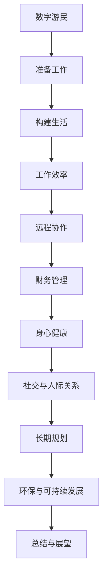

                 

### 文章标题

《城市游牧指南3.0：数字游民的生存智慧》

随着数字化时代的到来，越来越多的人选择离开传统的办公环境，成为数字游民。这种新兴的生活方式不仅打破了地理界限，也让人们的工作与生活更加灵活多变。本指南旨在帮助这些数字游民更好地适应这种变化，提高生活质量，实现个人与职业的平衡发展。

### 关键词

- 数字游民
- 工作与生活平衡
- 职业发展
- 数字化工具
- 跨文化沟通

### 摘要

本文将详细介绍《城市游牧指南3.0：数字游民的生存智慧》的核心内容与主题思想。本书共分为八个部分，首先探讨了数字游民的背景与定义，接着分析了如何构建一个成功的数字游民生活。随后，本文将深入讨论如何提高工作效率、进行有效的远程协作、规划财务以及维护身心健康。最后，本书还将探讨数字游民的长期规划与可持续发展，并提供实用的最佳实践与拓展阅读建议。

## 引言

### 数字游民现象的崛起

随着互联网技术的飞速发展，远程工作的理念逐渐深入人心。数字游民（Digital Nomad）这一概念也逐渐兴起。数字游民指的是那些依靠互联网工作，不受传统办公场所限制，可以在任何地方进行工作的人群。这种生活方式的兴起，不仅改变了人们的工作方式，也重新定义了“工作-生活”平衡的概念。

#### 什么是数字游民？

数字游民通常从事远程工作，如自由职业、远程编程、数字营销、翻译等。他们利用互联网和各种数字化工具，实现与团队成员的高效沟通和协作。数字游民的特点是灵活性和自由性，他们可以选择在世界任何一个角落工作，享受不同的文化和风景。

#### 数字游民生活方式的兴起

数字游民生活方式的兴起，与以下几个因素密切相关：

1. **互联网技术的普及**：互联网的普及使得远程工作成为可能，人们可以通过网络进行实时沟通和协作，无需面对面的互动。
2. **自由职业的兴起**：越来越多的企业采用外包和自由职业的形式，以降低成本和提高效率，这为数字游民提供了广阔的职业选择。
3. **成本效益**：在低成本地区生活和工作，可以大幅降低生活成本，提高生活质量。
4. **全球化的趋势**：全球化使得人们更容易接触到不同的文化，许多人对探索世界充满热情，这也推动了数字游民生活方式的兴起。

### 书籍的目标读者

本书的目标读者是那些对数字游民生活方式感兴趣的人群，包括：

1. **即将成为数字游民的人**：他们希望了解这种生活方式的方方面面，为自己的未来规划做好准备。
2. **正在尝试数字游民生活的人**：他们希望获得更多的实践经验和技巧，以提高工作效率和生活质量。
3. **已经在数字游民生活方式中的人**：他们希望通过本书进一步优化自己的生活和工作方式，实现更好的平衡。

### 书的内容概览

本书共分为八个部分，内容涵盖：

1. **准备工作**：介绍数字游民的基础知识，帮助读者了解数字游民的生活方式和工作模式。
2. **构建数字游民生活**：探讨如何选择适合自己的数字游民生活方式，以及如何定位个人品牌。
3. **提高工作效率**：提供一系列提高工作效率的工具和技巧，帮助数字游民更好地管理时间和项目。
4. **远程协作与沟通**：介绍远程协作平台和沟通技巧，帮助数字游民克服地理限制，实现高效合作。
5. **财务管理与规划**：探讨数字游民的财务规划，包括收入来源、税务政策以及风险管理。
6. **生活平衡与心理健康**：介绍如何维持身心健康，管理焦虑和压力，以及建立良好的人际关系。
7. **长期规划与可持续发展**：探讨数字游民的长期规划，包括地理扩张、家庭与子女、个人职业发展等。
8. **总结与展望**：总结本书的主要内容和观点，展望数字游民的未来趋势，并提供实用的最佳实践和建议。

通过这本书，读者将了解到数字游民生活方式的各个方面，获得实用的技巧和策略，帮助他们在数字游民的道路上走得更加顺利和成功。

## 第一部分：准备工作

### 数字游民的基础知识

在正式成为一名数字游民之前，了解这一生活方式的基础知识是至关重要的。本章节将详细探讨数字游民的定义、特点，以及常见职业类型，帮助读者全面了解数字游民的生活方式。

#### 数字游民的定义

数字游民，顾名思义，是指那些通过互联网进行工作，不受传统办公场所限制的人。他们利用数字化工具，如云存储、在线协作软件和虚拟会议平台，与团队成员进行高效沟通和协作。数字游民的工作不受地理位置的限制，可以在世界任何角落进行，这意味着他们有更大的自由度来选择工作地点和生活环境。

#### 数字游民的特点

数字游民的生活方式具有以下几个显著特点：

1. **灵活性**：数字游民可以根据自己的时间表自由安排工作，不必受限于固定的办公时间和地点。
2. **自由性**：他们可以自由选择工作内容，通常从事自由职业或远程工作，这种自主性使得工作与个人兴趣和优势更匹配。
3. **低成本**：通过在低成本地区生活和工作，数字游民可以大幅降低生活成本，提高生活质量。
4. **全球化**：数字游民有机会接触不同的文化和人群，拓宽视野，增加生活体验。

#### 数字游民的常见职业

数字游民的职业范围广泛，以下是一些常见的职业类型：

1. **自由职业者**：如作家、设计师、程序员、翻译、市场营销专家等，他们通常为多个客户提供服务，项目结束后再寻找新的工作机会。
2. **远程工作者**：如远程编程、数据分析、客户服务、虚拟助理等，这些职位通常由企业或组织提供，员工可以在家或任何地方工作。
3. **创业者和企业家**：许多数字游民选择创业，他们通过创建自己的在线业务或平台来实现财务自由。
4. **教育和培训**：在线教育、语言培训、专业培训等也是数字游民常见的职业选择，这些工作可以通过互联网进行。
5. **内容创作者**：如博客作者、视频制作人、播客主持人等，他们通过创造内容吸引观众，从而获得收入。

#### 数字游民的生活方式

数字游民的生活方式是多姿多彩的，他们可以根据自己的喜好和需求，选择不同的生活方式。以下是一些典型的数字游民生活方式：

1. **流浪式生活**：这种生活方式的数字游民通常是全球旅行者，他们每年在不同的城市和国家居住，享受不同的文化和风景。
2. **永久居住**：有些数字游民选择在一个地方长期居住，他们可能在一个城市或国家找到了理想的工作和生活环境。
3. **季节性居住**：一些数字游民根据季节变化选择居住地点，例如，在冬季去热带国家避寒，夏季回到北方国家享受清凉。
4. **社区生活**：有些数字游民选择加入数字游民社区，与其他数字游民一起生活和工作，共同分享经验和资源。

#### 数字游民的优势与挑战

数字游民的优势包括：

1. **更高的工作自由度**：可以根据自己的兴趣和优势选择工作内容，实现工作与个人兴趣的完美结合。
2. **更低的生活成本**：通过在低成本地区生活，可以大幅降低生活成本，提高生活质量。
3. **全球视野**：有机会接触不同的文化和人群，拓宽视野，增加生活体验。

然而，数字游民也面临着一些挑战：

1. **时区管理**：与全球各地的团队成员协作时，需要处理好时区差异，确保工作顺利进行。
2. **工作与生活的平衡**：需要自我管理，避免过度工作，确保工作与生活之间的平衡。
3. **网络稳定性**：确保网络连接稳定，这对于远程工作至关重要。

#### 成功的数字游民案例

成功的数字游民案例包括许多不同背景和职业的人，以下是一些典型的例子：

1. **Nathan Bai**：一位中国程序员，他通过远程工作在全球各地旅行，最终在东南亚的一个小岛上定居下来。
2. **Alexandra Touriel**：一位法国设计师，她在世界各地旅行，为多个国际客户提供服务，通过互联网实现全球化的工作模式。
3. **Chris Guillebeau**：一位美国作家，他通过写作和演讲实现全球旅行，他的著作《一个数字游民的生活》成为数字游民社区的必读之作。

通过这些案例，我们可以看到数字游民生活方式的多样性和可能性。无论你的背景和职业是什么，只要拥有互联网连接和一定的技能，就有可能成为一名成功的数字游民。

#### 如何开始成为一名数字游民

对于想要成为数字游民的人来说，以下是一些建议和步骤：

1. **评估自身条件**：首先，评估自己的技能和兴趣，确定哪些工作类型适合远程工作。
2. **学习新技能**：如果需要，可以通过在线课程、工作坊等途径学习新技能，提高自己的竞争力。
3. **建立个人品牌**：创建个人网站或博客，展示自己的技能和作品，建立个人品牌。
4. **寻找合适的工作**：通过职业平台、社交媒体等途径寻找远程工作机会，确保工作与个人兴趣和目标相符。
5. **规划财务**：制定财务计划，确保有足够的经济支持，以应对初期的挑战。
6. **适应生活方式**：逐渐适应数字游民的生活方式，学会自我管理，确保工作与生活的平衡。

通过以上步骤，你可以迈出成为数字游民的第一步，开启一段充满挑战和机遇的新生活。

### 数字游民的基础知识总结

数字游民是一种全新的工作与生活方式，它不仅打破了地理界限，也重新定义了“工作-生活”平衡。通过了解数字游民的定义、特点、常见职业类型，以及成功案例，我们可以看到这种生活方式的多样性和可能性。对于想要成为数字游民的人来说，重要的是评估自身条件、学习新技能、建立个人品牌，并规划财务。只有这样，才能在数字游民的道路上走得更远、更稳。

## 第二部分：构建数字游民生活

### 选择适合自己的数字游民生活方式

数字游民的生活方式多种多样，选择最适合自己的方式至关重要。本章节将探讨传统的数字游民、轻松数字游民和完全数字游民三种不同的生活方式，帮助读者根据自己的需求和目标进行选择。

#### 传统的数字游民

传统的数字游民通常是在一个地方停留一段时间，然后迁移到另一个地方。这种生活方式的特点是：

- **目标明确**：传统数字游民通常有一个明确的目标，比如在某个城市完成一个项目，或者在特定地点进行研究和学习。
- **灵活性高**：他们可以根据项目需求和工作进度，灵活调整居住地点，确保工作不受影响。
- **低成本**：通过在低成本地区居住，传统数字游民可以大幅降低生活成本，提高生活质量。

传统数字游民的优点在于：

- **多样性**：可以体验不同的文化和生活方式，拓宽视野。
- **高效工作**：在一个地方集中精力完成项目，提高工作效率。

然而，这种生活方式也存在一些挑战：

- **频繁迁移**：需要适应不同地方的生活和工作环境，可能带来一定的不稳定性。
- **社交网络**：由于频繁迁移，可能难以建立稳固的社交网络。

#### 轻松数字游民

轻松数字游民的生活方式相对较为灵活，他们通常在一个地方居住一段时间，然后转移到另一个地方。与传统的数字游民不同，轻松数字游民更注重平衡工作和生活。

- **灵活的工作时间**：轻松数字游民可以根据自己的喜好和需求，灵活安排工作时间和地点。
- **长期居住**：在一个地方居住时间较长，有助于建立稳定的社交网络和社区。
- **低成本**：通过在低成本地区居住，轻松数字游民可以大幅降低生活成本。

轻松数字游民的优点包括：

- **工作与生活平衡**：有更多时间享受生活，提高生活质量。
- **稳定性**：在一个地方长期居住，有助于建立稳固的社交网络和社区。

然而，这种生活方式也有一定的挑战：

- **孤独感**：由于长期独居，可能感到孤独和缺乏社交。
- **职业发展**：可能难以实现职业上的快速增长，需要不断寻找新的工作机会。

#### 完全数字游民

完全数字游民的生活方式是最为灵活的，他们完全依赖互联网工作，不受地理位置限制。完全数字游民通常在一个地方工作一段时间，然后转移到另一个地方，他们的生活方式更加自由和开放。

- **全球工作**：完全数字游民可以在全球范围内的任何地方工作，不受地理限制。
- **灵活性高**：可以根据自己的兴趣和需求，随时调整工作和居住地点。
- **低成本**：通过在低成本地区居住，可以大幅降低生活成本。

完全数字游民的优点包括：

- **极致自由**：完全自由地选择工作和居住地点，实现真正的全球工作。
- **低生活成本**：通过在低成本地区居住，提高生活质量。

然而，这种生活方式也存在一些挑战：

- **时间管理**：需要自我管理，避免过度工作，确保工作与生活的平衡。
- **社交网络**：由于频繁迁移，可能难以建立稳固的社交网络。

#### 如何选择适合自己的数字游民生活方式

选择适合自己的数字游民生活方式需要考虑以下几个方面：

1. **个人职业特点**：不同的职业对居住地点和工作的灵活性要求不同。例如，自由职业者和远程工作者可能更适合传统数字游民或轻松数字游民生活方式，而创业者和企业家可能更倾向于完全数字游民生活方式。

2. **生活方式偏好**：个人的生活方式偏好也是一个重要考虑因素。有些人喜欢长期定居在一个地方，享受稳定的社交网络和生活环境，而有些人则更喜欢不断探索和体验新的事物。

3. **经济条件**：经济条件也是选择数字游民生活方式的一个重要因素。在一些低成本地区生活，可以大幅降低生活成本，提高生活质量。

4. **家庭和社交需求**：家庭和社交需求也会影响数字游民生活方式的选择。有些人可能需要稳定的社交网络和支持，而有些人则更注重个人自由和独立。

#### 案例分析

以下是一些数字游民生活方式的案例分析：

1. **案例一：Nathan Bai**
   - **职业**：程序员
   - **生活方式**：传统的数字游民
   - **分析**：Nathan Bai是一位中国程序员，他通过远程工作在全球各地旅行。他选择这种方式的原因是能够灵活安排工作时间和地点，同时不断拓宽视野，体验不同的文化。

2. **案例二：Alexandra Touriel**
   - **职业**：设计师
   - **生活方式**：轻松数字游民
   - **分析**：Alexandra Touriel是一位法国设计师，她在世界各地旅行，为多个国际客户提供服务。她选择轻松数字游民生活方式的原因是能够平衡工作和生活，同时享受全球各地的文化和风景。

3. **案例三：Chris Guillebeau**
   - **职业**：作家和企业家
   - **生活方式**：完全数字游民
   - **分析**：Chris Guillebeau是一位美国作家和企业家，他通过写作和演讲实现全球旅行。他选择完全数字游民生活方式的原因是追求极致的自由和低成本生活，同时不断探索和分享全球化的工作经验。

通过以上案例分析，我们可以看到不同的数字游民生活方式各有特点和优势，选择适合自己的生活方式需要综合考虑个人职业特点、生活方式偏好、经济条件和家庭社交需求等多个因素。

### 定位个人品牌

作为一名数字游民，定位个人品牌是成功的关键之一。本章节将探讨如何了解自己的优势和兴趣，建立个人网站或博客，以及制定社交媒体运营策略，帮助数字游民打造独特的个人品牌。

#### 了解自己的优势和兴趣

定位个人品牌的第一个步骤是深入了解自己的优势和兴趣。以下是一些建议：

1. **技能评估**：列出你的技能和特长，包括专业技能、软技能和兴趣爱好。这些技能和兴趣将成为你个人品牌的基石。
2. **职业目标**：明确你的职业目标和发展方向，这将有助于你确定个人品牌的核心定位。
3. **市场调研**：了解市场需求和竞争环境，找出你独特的竞争优势。

#### 建立个人网站或博客

建立个人网站或博客是展示个人品牌的重要方式。以下是一些关键步骤：

1. **选择域名和平台**：选择一个简洁易记的域名，并选择一个适合个人品牌的网站建设平台，如WordPress或Wix。
2. **内容规划**：确定你的网站或博客的主题和内容结构，包括个人介绍、作品展示、博客文章等。
3. **定期更新**：保持内容更新，展示你的专业性和活跃度，吸引更多的关注。

#### 社交媒体运营策略

社交媒体是展示个人品牌的重要渠道。以下是一些建议：

1. **选择合适的平台**：根据你的目标受众和内容类型，选择合适的社交媒体平台，如LinkedIn、Instagram、Twitter等。
2. **制定内容策略**：制定内容发布计划，确保内容的质量和一致性。可以包括博客文章、视频、图片等多种形式。
3. **互动与参与**：积极参与社交媒体上的讨论和互动，建立良好的社区关系，提高个人品牌的曝光度。
4. **数据分析**：定期分析社交媒体数据，了解受众行为和偏好，优化内容策略。

#### 成功案例分析

以下是一些成功的数字游民和个人品牌案例：

1. **案例一：Nathan Bai**
   - **个人网站**：https://www.nathanielbai.com/
   - **社交媒体**：LinkedIn、Twitter
   - **分析**：Nathan Bai通过其个人网站和社交媒体平台，展示了自己的编程技能和项目经验。他定期更新博客，分享技术心得和行业动态，吸引了大量关注者。

2. **案例二：Alexandra Touriel**
   - **个人网站**：https://www.alexandratouriel.com/
   - **社交媒体**：Instagram、LinkedIn
   - **分析**：Alexandra Touriel通过其个人网站和社交媒体平台，展示了自己的设计作品和设计理念。她通过Instagram分享生活和工作中的点滴，吸引了大量粉丝。

3. **案例三：Chris Guillebeau**
   - **个人网站**：https://chrisguillebeau.com/
   - **社交媒体**：Facebook、Twitter、Instagram
   - **分析**：Chris Guillebeau通过其个人网站和多个社交媒体平台，分享自己的旅行经历和创业故事。他通过内容营销，吸引了大量粉丝和合作伙伴，建立了强大的个人品牌。

通过以上案例，我们可以看到成功的数字游民和个人品牌是如何通过建立个人网站、博客和社交媒体运营策略，实现品牌影响力的。对于数字游民来说，打造独特的个人品牌是提升职业竞争力、实现职业发展的关键。

### 定位个人品牌的重要性

定位个人品牌对于数字游民来说至关重要。一个清晰、独特的个人品牌不仅能够提升职业竞争力，还能帮助数字游民在竞争激烈的市场中脱颖而出。以下是定位个人品牌的重要性：

1. **职业发展**：明确的个人品牌有助于数字游民在职业发展过程中找到合适的方向，实现职业目标。
2. **增强信任**：一个有影响力的个人品牌能够增强客户和合作伙伴的信任，提高合作机会。
3. **扩大影响力**：良好的个人品牌有助于数字游民在社交媒体和行业中扩大影响力，吸引更多的关注者和机会。
4. **提高收入**：强大的个人品牌能够带来更多的商业机会和合作项目，提高收入水平。

通过了解自己的优势和兴趣，建立个人网站或博客，以及制定有效的社交媒体运营策略，数字游民可以打造一个独特的个人品牌，实现职业和生活的双重成功。

### 提高工作效率

在数字游民生活中，工作效率是确保工作和生活平衡的关键。本章节将探讨一系列提高工作效率的工具和技巧，帮助数字游民更好地管理时间和项目。

#### 项目管理工具介绍

1. **Asana**：Asana是一个功能强大的项目管理工具，可以帮助团队协作和任务管理。它提供了灵活的任务分配、进度追踪和实时沟通功能，使得团队协作更加高效。
2. **Trello**：Trello是一个基于看板（Kanban）的项目管理工具，通过卡片和列表的形式，清晰地展示任务状态和进度。它简单易用，适合小团队和个体用户。
3. **JIRA**：JIRA是一款专业的敏捷项目管理工具，适用于大型开发团队。它提供了详细的任务追踪、代码审查和敏捷迭代功能，确保项目按计划推进。

#### 时间管理技巧

1. **番茄工作法**：番茄工作法是一种简单有效的时间管理技巧，将工作时间分为25分钟的工作周期（称为一个“番茄钟”），每个周期后休息5分钟。这种方法有助于提高专注力，减少疲劳。
2. **优先级管理**：使用“四象限法”将任务分为紧急重要、紧急不重要、不紧急重要、不紧急不重要四个象限，优先处理紧急重要的任务，确保关键任务的完成。
3. **单任务模式**：避免多任务处理，专注于一个任务直到完成，提高单任务的工作效率。

#### 如何高效工作

1. **设定明确的目标**：为每个工作周期设定明确的目标，确保工作有方向和动力。
2. **合理安排工作时间**：根据任务的重要性和紧急程度，合理安排每天的工作时间，确保有足够的时间完成关键任务。
3. **避免拖延**：利用“番茄工作法”等时间管理技巧，避免拖延，确保任务按时完成。
4. **学会休息**：适当的工作与休息相结合，有助于保持工作效率和精力。

#### 实战案例

**案例一：Nathan Bai的Asana使用经验**

Nathan Bai是一位远程程序员，他通过Asana来管理自己的项目和任务。以下是他的使用经验：

- **任务分配**：Nathan使用Asana的的任务分配功能，将项目任务分配给团队成员，确保每个任务都有明确的责任人。
- **进度追踪**：通过Asana的进度追踪功能，Nathan可以实时了解项目的进展情况，及时调整工作计划。
- **沟通协作**：Asana提供了实时的沟通功能，Nathan可以与团队成员通过聊天、评论等功能进行高效沟通。

**案例二：Alexandra Touriel的Trello使用经验**

Alexandra Touriel是一位远程设计师，她使用Trello来管理设计项目。以下是她的使用经验：

- **卡片和列表**：通过Trello的卡片和列表，Alexandra清晰地展示了每个设计项目的任务状态和进度。
- **任务提醒**：Trello的任务提醒功能帮助Alexandra按时完成关键任务，确保项目按计划推进。
- **团队协作**：通过Trello的协作功能，Alexandra与团队成员可以共同讨论设计思路和方案，提高设计质量。

#### 提高工作效率的总结

通过使用项目管理工具和有效的时间管理技巧，数字游民可以大幅提高工作效率，确保工作与生活的平衡。以下是提高工作效率的几个关键点：

1. **使用项目管理工具**：利用Asana、Trello、JIRA等项目管理工具，确保任务分配、进度追踪和沟通协作的高效。
2. **时间管理技巧**：采用番茄工作法、优先级管理和单任务模式，提高专注力和工作效率。
3. **明确的目标**：为每个工作周期设定明确的目标，确保工作有方向和动力。
4. **合理的时间安排**：根据任务的重要性和紧急程度，合理安排工作时间，确保有足够的时间完成关键任务。

通过以上方法，数字游民可以更好地管理时间和项目，实现高效工作，为数字游民生活增添更多成功和满足感。

### 远程协作与沟通

在数字游民的生活中，远程协作和沟通是保证工作顺利进行和团队高效合作的关键。本章节将详细介绍几种常用的远程协作平台，探讨远程协作的技巧，以及跨文化沟通的挑战与解决方案。

#### 远程协作平台

1. **Slack**：Slack是一个流行的即时通讯工具，适用于团队协作。它提供了丰富的聊天功能、文件共享和集成第三方服务，如Google Drive、Trello等，使得团队沟通更加便捷和高效。
2. **Zoom**：Zoom是一款专业的视频会议和协作工具，支持高清视频和音频会议，以及屏幕共享和虚拟白板等功能，适用于远程团队的实时沟通和协作。
3. **Trello**：Trello是一个基于看板的任务管理工具，可以帮助团队可视化任务流程、分配任务和跟踪进度。Trello简单易用，适合小团队和个体用户。
4. **Asana**：Asana是一款功能强大的项目管理工具，适用于团队协作和任务管理。它提供了灵活的任务分配、进度追踪和实时沟通功能，确保团队高效协作。
5. **Google Workspace**：Google Workspace（原G Suite）包括Google Docs、Google Sheets、Google Slides等办公工具，支持多人实时协作和文档共享，适合远程团队的工作需求。

#### 远程协作技巧

1. **明确任务分工**：在项目开始前，明确每个团队成员的任务分工，确保每个任务都有明确的责任人，避免任务重叠和混乱。
2. **定期会议**：安排定期的团队会议，确保团队成员之间的沟通畅通，及时了解项目进展和存在的问题。
3. **文档和资料共享**：利用云存储和共享平台，如Google Drive、Dropbox等，确保所有团队成员可以方便地访问和共享文档和资料。
4. **实时沟通**：利用即时通讯工具，如Slack、WhatsApp等，进行实时沟通，快速解决问题和协调工作。
5. **任务跟踪和反馈**：使用项目管理工具，如Trello、Asana等，跟踪任务进度和反馈，确保项目按计划推进。

#### 跨文化沟通的挑战

数字游民通常需要与来自不同国家和文化的团队成员合作，这带来了跨文化沟通的挑战。以下是一些常见的挑战和解决方案：

1. **语言障碍**：不同国家和地区的人可能使用不同的语言，这可能导致沟通不畅和误解。解决方案是确保团队中至少有一个人能够使用多种语言，或者使用通用的国际语言，如英语，作为工作语言。
2. **文化差异**：不同文化的人可能有不同的沟通风格、工作习惯和价值观念，这可能导致冲突和误解。解决方案是提前了解和尊重不同文化的差异，通过文化培训提高团队成员的跨文化意识。
3. **时区差异**：团队成员可能分布在不同的时区，这可能导致沟通和工作进度的不一致。解决方案是合理安排会议和工作时间，确保团队成员都有足够的时间参与会议和工作。
4. **信任和尊重**：在跨文化团队中，信任和尊重尤为重要。解决方案是建立开放的沟通环境，鼓励团队成员表达意见和反馈，建立良好的信任关系。

#### 跨文化沟通案例

**案例一：跨国软件开发团队**

一个跨国软件开发团队由来自美国、印度和巴西的成员组成。以下是他们的沟通经验：

- **语言使用**：团队规定使用英语作为工作语言，确保所有成员都能理解并参与沟通。
- **文化培训**：团队进行文化培训，了解不同国家的文化差异和沟通风格，提高跨文化沟通能力。
- **时区管理**：团队通过调整会议和工作时间，确保不同时区的成员都有足够的时间参与会议和工作。

**案例二：国际营销团队**

一个国际营销团队由来自中国、美国和法国的成员组成。以下是他们的沟通经验：

- **沟通平台**：团队使用Slack进行即时沟通，使用Trello进行任务管理和进度跟踪。
- **文化尊重**：团队尊重不同文化的差异，通过文化活动和交流，增进成员之间的理解和信任。
- **多时区协作**：团队通过提前安排会议和工作时间，确保不同时区的成员都能参与和完成任务。

通过以上案例，我们可以看到跨文化沟通在数字游民团队中的重要性，以及如何通过有效的沟通策略克服跨文化挑战。

### 总结

远程协作和沟通在数字游民生活中至关重要。通过使用远程协作平台，如Slack、Zoom、Trello和Asana，数字游民可以高效地完成任务和项目。同时，掌握跨文化沟通的技巧和策略，有助于克服文化差异和时区挑战，实现全球团队的顺畅合作。数字游民应重视远程协作和沟通的重要性，不断优化沟通策略，确保工作的高效和团队的和谐。

### 财务管理与规划

在数字游民的生活中，财务管理与规划至关重要。本章节将详细探讨数字游民的财务规划，包括收入来源、税务政策以及风险管理，帮助数字游民实现财务自由和稳定。

#### 薪资结构与收入来源

数字游民的薪资结构通常多样化，主要包括以下几种收入来源：

1. **自由职业收入**：自由职业者是数字游民的主要收入来源之一。他们通过接项目、提供服务或出售自己的作品来获得收入。这种收入的波动性较大，取决于项目的数量和质量。
2. **远程工作**：许多公司提供远程职位，数字游民通过远程工作获得稳定的收入。这些职位通常提供固定薪资，但由于远程工作可能涉及跨国家或地区，薪资水平可能有所不同。
3. **在线业务**：一些数字游民通过建立自己的在线业务，如电子商务店铺、博客、在线教育平台等，实现持续收入。这些业务的盈利能力取决于市场、运营策略和营销效果。
4. **投资收益**：部分数字游民通过投资股票、基金、房地产等渠道获得被动收入。这种收入稳定但需要一定的资金积累和专业知识。

#### 税务政策了解

税务政策对于数字游民的生活和财务规划有着重要影响。不同国家和地区的税务政策有所不同，以下是一些关键点：

1. **居民税收**：许多国家根据居民身份来征税，而非工作地点。数字游民需要了解自己所在国家的税务规定，确保合规申报。
2. **非居民税收**：对于在多个国家工作的数字游民，他们可能需要了解和遵守工作国家或居住国家的税务规定。这包括申报国外收入、缴纳所得税等。
3. **税收减免**：一些国家提供税收减免政策，如对远程工作、创业投资等给予税收优惠。数字游民应积极了解这些政策，合理规划自己的税务负担。
4. **税务协定**：一些国家之间签订了税务协定，以避免双重征税。数字游民应了解这些协定，确保自己的收入得到合理的税收待遇。

#### 财务风险管理

数字游民的财务规划应包括风险管理，以应对收入波动和其他潜在财务风险。以下是一些建议：

1. **紧急基金**：建立紧急基金，以应对突发事件和收入不稳定。建议紧急基金至少覆盖3到6个月的生活费用。
2. **多元化收入**：通过多种收入来源分散风险，如同时进行自由职业和远程工作，或投资不同类型的资产。
3. **定期储蓄**：制定储蓄计划，确保有足够的资金用于长期目标和突发情况。
4. **投资策略**：了解投资策略和风险控制，进行合理投资，以实现资产的增值。
5. **保险规划**：购买适当的保险，如医疗保险、旅行保险等，以应对可能的风险和意外。

#### 财务规划案例

以下是一个数字游民的财务规划案例：

**案例**：假设小李是一名数字游民，他主要依靠自由职业收入和远程工作维持生活。他每月的固定收入为5,000美元，自由职业收入波动较大，每月平均为2,000美元。以下是小李的财务规划：

1. **收入结构**：小李的收入主要来自自由职业（70%）和远程工作（30%）。他计划通过持续提高自己的技能和拓展客户群体，增加自由职业收入。
2. **税务规划**：小李了解自己所在国家和工作国家的税务政策，确保合规申报。他还关注税收减免政策，如对远程工作给予税收优惠。
3. **紧急基金**：小李建立了紧急基金，覆盖了6个月的生活费用，共计3,000美元。这使他能够在收入波动时保持稳定的生活水平。
4. **储蓄计划**：小李每月储蓄1,000美元，用于长期目标和应急情况。他计划每年进行一次全面财务审查，调整储蓄目标和投资策略。
5. **投资策略**：小李进行了一定的投资，包括股票、基金和房地产。他通过定期学习和咨询金融专家，优化投资组合，实现资产的增值。

通过上述财务规划，小李能够实现收入稳定、风险管理到位，为未来的生活提供保障。

### 财务管理与规划总结

财务管理与规划对于数字游民来说至关重要。通过了解薪资结构、税务政策，以及进行风险管理，数字游民可以确保收入稳定、税务合规，并应对突发事件。建立紧急基金、多元化收入来源、定期储蓄和合理投资，是实现财务自由和稳定的关键。数字游民应根据自己的实际情况，制定合理的财务规划，确保在数字游民生活中实现财务安全和成功。

### 维持身心健康

在数字游民的生活中，维持身心健康是确保工作和生活质量的关键。本章节将探讨健康生活方式、减压技巧以及管理焦虑和压力的方法，帮助数字游民保持身心健康。

#### 健康生活方式

1. **规律作息**：保持规律的作息时间，确保每天有足够的睡眠。充足的睡眠有助于提高工作效率和保持身心健康。
2. **合理饮食**：均衡饮食，摄入足够的蛋白质、碳水化合物、脂肪、维生素和矿物质。避免高糖、高脂肪和高盐的食物，减少对身体的负面影响。
3. **适量运动**：定期进行适量的运动，如跑步、瑜伽、游泳等。适量的运动有助于增强体质、提高免疫力，同时也有助于减轻压力。
4. **充足的水分摄入**：每天确保喝足够的水，保持身体的水分平衡，有助于提高新陈代谢和维持身体健康。

#### 减压技巧

1. **冥想**：冥想是一种有效的减压技巧，通过冥想可以帮助放松身心，减轻焦虑和压力。可以每天花10-15分钟进行冥想练习，逐步增加时间。
2. **深呼吸**：深呼吸是一种简单有效的放松技巧，通过深呼吸可以降低心率和血压，缓解压力。可以在感到紧张或焦虑时，进行深呼吸练习。
3. **瑜伽**：瑜伽是一种结合呼吸、姿势和冥想的综合性锻炼方式，有助于放松身心、减轻压力。定期参加瑜伽课程或进行家庭瑜伽练习，可以有效地缓解压力。

#### 管理焦虑和压力

1. **时间管理**：合理安排时间，确保工作与休息相结合，避免过度工作。使用时间管理技巧，如番茄工作法，提高工作效率，减少工作压力。
2. **目标设定**：设定明确的工作和生活目标，确保工作有方向和动力。合理设定目标，避免目标过于艰巨或过于宽松，导致焦虑和压力。
3. **积极心态**：保持积极的心态，面对挑战和困难时，保持乐观和自信。学会接受失败和挫折，从中吸取经验教训，提高心理韧性。
4. **寻求支持**：在感到焦虑和压力时，寻求家人、朋友或专业人士的支持。通过分享感受和寻求建议，缓解压力，增强心理支持。

#### 健康生活案例

以下是一些数字游民的健康生活案例：

**案例一：Alexandra Touriel的健康生活**

Alexandra Touriel是一位数字游民设计师，她注重健康生活方式和减压技巧。以下是她的健康生活经验：

- **规律作息**：每天早上7点起床，晚上11点前睡觉，保持规律的作息时间。
- **健康饮食**：每天保证摄入足够的水果和蔬菜，减少高糖和高脂肪食物的摄入。
- **定期运动**：每天进行30分钟瑜伽练习，增强体质，减轻压力。
- **冥想**：每天早上进行10分钟的冥想练习，帮助放松身心，提高专注力。

**案例二：Chris Guillebeau的健康生活**

Chris Guillebeau是一位知名的数字游民作家和企业家，他非常重视健康生活方式。以下是他的健康生活经验：

- **规律作息**：每天保持充足的睡眠，尽量晚上10点前入睡。
- **均衡饮食**：注重营养均衡，每天摄入足够的蛋白质、碳水化合物和脂肪。
- **定期体检**：每年进行一次全面体检，确保身体健康。
- **心理支持**：通过和家人、朋友定期交流，分享生活和工作的压力，寻求支持和建议。

通过以上案例，我们可以看到数字游民通过健康生活方式、减压技巧和管理焦虑和压力的方法，能够有效地维持身心健康。对于数字游民来说，保持身心健康是实现工作和生活平衡、提高生活质量的关键。

### 健康生活方式的重要性

健康生活方式对于数字游民来说至关重要。它不仅有助于提高工作效率和生活质量，还能降低患病的风险，延长寿命。以下是健康生活方式的重要性：

1. **提高工作效率**：良好的健康状态有助于提高专注力和工作效率，使数字游民能够更高效地完成工作任务。
2. **提高生活质量**：健康的生活方式使得数字游民能够享受更高质量的生活，拥有更多的时间和精力去探索和体验世界。
3. **降低患病风险**：健康的饮食、适量的运动和良好的作息习惯可以降低患病的风险，提高免疫力，减少医疗费用。
4. **延长寿命**：健康的生活方式有助于延长寿命，使数字游民能够享受更长久的健康生活。

为了维持身心健康，数字游民应重视健康生活方式，包括规律作息、合理饮食、适量运动和减压技巧。通过这些方法，数字游民可以更好地应对生活中的挑战，实现工作与生活的平衡。

### 社交与人际关系

在数字游民的生活中，社交和人际关系同样至关重要。本章节将探讨如何建立本地社区、在线社交网络以及维护人际关系，帮助数字游民在远离传统社交圈的情况下，仍然能够保持社会联系和情感支持。

#### 建立本地社区

1. **参与当地活动**：加入当地的俱乐部、兴趣小组或社区活动，如瑜伽课程、读书会、户外探险等。通过这些活动，可以结识志同道合的朋友，建立本地社交网络。
2. **志愿服务**：参与志愿服务项目，如环境保护、社区建设等，不仅可以为社会做出贡献，还能结识志同道合的朋友。
3. **本地社交平台**：利用本地社交平台，如Meetup、Facebook群组等，寻找和参加本地活动，扩大社交圈子。

#### 在线社交网络

1. **利用社交媒体**：利用社交媒体平台，如Facebook、Instagram、LinkedIn等，与朋友和同事保持联系。通过分享生活和工作中的点滴，增强社交互动。
2. **加入专业社群**：加入与专业领域相关的在线社群，如LinkedIn群组、专业论坛等，通过讨论和分享经验，结识行业内的朋友。
3. **虚拟会议**：通过虚拟会议平台，如Zoom、Microsoft Teams等，定期与团队成员和朋友进行视频会议，保持实时沟通。

#### 维护人际关系

1. **定期沟通**：定期与亲朋好友保持联系，通过电话、邮件、社交媒体等方式，分享近况和感受。这有助于保持情感联系，增强关系。
2. **互帮互助**：在数字游民社区中，许多人都面临着类似的挑战和困境。通过互帮互助，可以共同解决问题，提高生活质量。
3. **参与本地社区**：积极参与本地社区的活动和事务，与当地居民建立联系。这不仅可以增加社交机会，还能帮助数字游民更好地融入当地社会。

#### 社交与人际关系的重要性

1. **情感支持**：社交和人际关系为数字游民提供了情感支持，帮助他们应对生活中的挑战和压力。
2. **职业发展**：良好的社交网络有助于数字游民在职业发展中获得更多的机会和资源，如合作项目、客户推荐等。
3. **提高生活质量**：社交和人际关系使得数字游民的生活更加丰富多样，有助于提高整体生活质量。

#### 社交与人际关系的挑战

1. **时区差异**：数字游民分布在不同的时区，这给维持社交联系带来了一定的挑战。通过灵活安排会议和沟通时间，可以部分缓解这一挑战。
2. **孤独感**：远离家乡和熟悉的社交圈，一些数字游民可能会感到孤独。积极参与社交活动和利用在线社交平台，可以帮助缓解这种孤独感。
3. **文化差异**：在不同的文化环境中建立人际关系，可能面临文化差异带来的挑战。通过了解和尊重不同文化的特点，可以更好地融入当地社会。

#### 社交与人际关系的案例

**案例一：Nathan Bai的社交网络**

Nathan Bai是一位数字游民程序员，他通过多种方式建立和维护社交网络。以下是他的经验：

- **参与本地活动**：Nathan加入了本地的编程兴趣小组，参加各种技术讲座和研讨会，结识了许多志同道合的朋友。
- **在线社交平台**：Nathan在LinkedIn上建立了丰富的社交网络，与行业内的专业人士保持联系，并从中获得了多个合作项目的机会。
- **定期沟通**：Nathan定期与朋友和同事进行视频通话，分享工作和生活中的点滴，保持情感联系。

**案例二：Alexandra Touriel的社交网络**

Alexandra Touriel是一位数字游民设计师，她非常重视社交和人际关系。以下是她的经验：

- **参与在线社群**：Alexandra加入了多个设计相关的在线社群，通过讨论和分享经验，结识了许多行业内的重要人物。
- **志愿服务**：Alexandra参与了一些志愿服务项目，不仅为社会做出了贡献，还通过这些活动结识了许多有共同兴趣的朋友。
- **定期互动**：Alexandra定期与朋友和同事进行线上互动，通过社交媒体和视频会议保持紧密的联系。

通过以上案例，我们可以看到数字游民如何通过建立本地社区、利用在线社交网络以及维护人际关系，克服社交挑战，实现社交和人际关系的成功。

### 社交与人际关系的总结

社交与人际关系在数字游民的生活中起着至关重要的作用。通过建立本地社区、利用在线社交网络和维护人际关系，数字游民可以克服地理和文化差异带来的挑战，保持情感支持和职业发展。为了实现社交和人际关系的成功，数字游民应积极参与本地和在线社交活动，定期沟通，互帮互助，并在不同文化环境中展现尊重和理解。通过这些方法，数字游民可以建立稳固的社交网络，提高生活质量，实现工作与生活的平衡。

### 第五部分：长期规划与可持续发展

在数字游民的生活中，长期规划与可持续发展至关重要。本章节将探讨如何进行地理扩张、家庭与子女规划以及个人职业发展，帮助数字游民实现长期的稳定与成长。

#### 地理扩张

1. **选择居住地**：数字游民应根据自己的需求和目标，选择合适的居住地。例如，一些人可能偏好热带气候，而另一些人可能更倾向于欧洲的城市文化。选择居住地时，应考虑以下因素：
   - **生活成本**：确保选择的生活成本在可承受范围内。
   - **工作环境**：确保有足够的网络连接和基础设施支持工作。
   - **文化环境**：选择适合自己文化背景和生活方式的地方。

2. **定期迁移**：数字游民可以根据季节变化、项目需求或个人兴趣，定期进行迁移。这种灵活性有助于保持新鲜感和探索精神，同时也可以降低长期居住在一个地方的疲劳感。

3. **建立社区网络**：在不同的城市和国家，建立社区网络是数字游民长期规划的重要一环。通过参加本地活动、加入兴趣小组或参与志愿服务，可以结识新朋友，扩大社交圈子。

#### 家庭与子女规划

1. **远程教育**：数字游民家庭可以利用在线教育资源和工具，为子女提供高质量的教育。例如，通过在线课程、虚拟学校和家庭教育平台，子女可以在任何地方接受教育。

2. **国际学校**：对于一些家庭来说，选择国际学校是子女教育的一个选项。国际学校通常提供多种语言和文化的教育环境，有助于子女融入当地社会。

3. **跨文化教育**：数字游民家庭可以通过旅行和居住在不同国家，为子女提供丰富的跨文化教育体验。这种体验有助于培养子女的全球视野和适应能力。

#### 个人职业发展

1. **技能提升**：数字游民应持续提升自己的技能和知识，以保持竞争力。可以通过在线课程、工作坊和行业会议等途径，不断学习和更新自己的技能。

2. **职业拓展**：数字游民可以通过拓展业务范围、开拓新市场和参与国际合作项目，实现职业发展。例如，一些数字游民选择创建自己的在线业务或加入跨国公司，通过全球化合作实现职业成长。

3. **建立个人品牌**：数字游民可以通过建立个人品牌，提高自己的知名度和影响力。可以通过撰写博客、发布视频、出版书籍等方式，展示自己的专业知识和经验。

#### 长期规划的重要性

1. **稳定性和可预测性**：长期规划有助于数字游民实现生活和工作上的稳定性和可预测性，减少不确定性带来的焦虑。

2. **职业成长**：通过持续的职业发展和技能提升，数字游民可以实现职业上的成长和晋升，提高收入和生活质量。

3. **家庭和谐**：合理的家庭与子女规划有助于家庭成员之间建立良好的关系，提高家庭幸福感和生活质量。

#### 持续发展

1. **环境保护**：数字游民应关注环境保护，选择可持续的生活方式。例如，减少不必要的旅行、节约能源和资源等。

2. **社会责任**：数字游民可以通过参与社会活动和志愿服务，承担社会责任，为社会做出贡献。

3. **可持续发展**：通过选择可持续的居住地、开展环保项目和参与公益事业，数字游民可以实现长期可持续的发展。

通过地理扩张、家庭与子女规划以及个人职业发展，数字游民可以实现长期的稳定与成长。合理规划不仅有助于提升生活质量，还能为未来创造更多的机会和可能性。

### 第六部分：环保与可持续发展

在数字游民的生活方式中，环保和可持续发展的重要性日益凸显。本章节将探讨数字游民如何通过选择环保的居住地、实践可持续旅行以及参与社区参与，为环境保护和可持续发展做出贡献。

#### 选择环保的居住地

数字游民在选择居住地时，应优先考虑环保因素。以下是一些建议：

1. **可再生能源**：选择使用可再生能源的地区，如太阳能或风能供电的城市。这些地区通常更加注重环境保护和可持续发展。
2. **生态友好型城市**：寻找那些有良好环保政策和实践的城市，如限制塑料使用、推广公共交通和绿色建筑的城市。
3. **自然景观**：虽然自然景观地区可能基础设施不完善，但它们通常提供了更多户外活动和环保体验的机会。在享受自然美景的同时，也可以参与保护自然环境的志愿活动。

#### 实践可持续旅行

数字游民的旅行方式可以直接影响环境。以下是一些可持续旅行实践：

1. **减少航空旅行**：虽然航空旅行便捷，但它也是碳排放的主要来源。数字游民应减少不必要的航空旅行，选择更环保的交通方式，如火车、长途汽车或共享出行。
2. **本地探险**：在居住地附近进行探险，减少长途旅行。这不仅有助于减少碳排放，还可以更深入地了解当地文化和环境。
3. **环保住宿**：选择环保住宿，如生态旅馆或民宿，这些住宿通常采用可再生能源、减少塑料使用和提供环保设施。

#### 参与社区参与

数字游民通过参与社区参与，可以为环境保护和可持续发展贡献自己的力量：

1. **环保组织**：加入环保组织或志愿者团体，参与环境保护活动，如海滩清理、植树造林和动物保护等。
2. **社区合作**：与当地社区合作，共同推动可持续发展项目。例如，参与社区的环保教育、节能减排和资源回收等活动。
3. **支持公益项目**：捐赠或资助环保公益项目，支持可持续发展的研究和实践。

#### 环保与可持续发展的重要性

1. **环境保护**：数字游民的生活方式直接关系到环境质量。通过选择环保居住地、实践可持续旅行和参与社区参与，可以有效减少对环境的负面影响。
2. **社会影响**：数字游民作为全球化的个体，可以在不同国家和地区传播环保理念，推动可持续发展意识的提升。
3. **个人成长**：参与环保和可持续发展活动，不仅有助于保护地球，还可以增强个人的社会责任感和成就感。

#### 环保与可持续发展的案例分析

**案例一：Sara的可持续旅行**

Sara是一位数字游民，她通过实践可持续旅行，减少了碳足迹。以下是她的经验：

- **减少航空旅行**：Sara尽量选择火车或长途汽车出行，只在必要时才乘坐飞机。
- **本地探险**：在居住地附近进行徒步旅行和露营，减少长途旅行。
- **环保住宿**：选择生态旅馆，使用环保产品和设施。

**案例二：Tom的社区参与**

Tom是一位数字游民，他积极参与环保组织，为环境保护贡献自己的力量。以下是他的经验：

- **参与环保活动**：Tom定期参与海滩清理和植树造林活动，为环境保护做出实际贡献。
- **社区合作**：Tom与当地社区合作，推动可持续发展项目，如节能减排和资源回收。
- **支持公益项目**：Tom捐赠一部分收入给环保公益项目，支持可持续发展的研究和实践。

通过以上案例，我们可以看到数字游民如何通过环保和可持续发展的实践，为地球和社区做出贡献。数字游民不仅可以通过自己的生活方式影响环境，还可以通过积极参与社区参与，推动可持续发展。

### 第七部分：总结与展望

随着数字游民生活方式的普及，本书《城市游牧指南3.0：数字游民的生存智慧》涵盖了从准备工作到长期规划与可持续发展的各个方面。通过这一系统的指南，数字游民不仅能够更好地适应这种新兴的生活方式，还能在职业和个人成长上实现更大的突破。

#### 书中的核心内容与主题思想

本书的核心内容包括：

1. **数字游民的基础知识**：介绍了数字游民的起源、特点以及常见职业类型。
2. **构建数字游民生活**：探讨了如何选择适合自己的生活方式、定位个人品牌以及构建有效的社交网络。
3. **提高工作效率**：提供了实用的项目管理工具和时间管理技巧，帮助数字游民实现高效工作。
4. **远程协作与沟通**：介绍了多种远程协作平台和沟通技巧，以应对时区和文化差异。
5. **财务管理与规划**：详细讲解了财务管理的各个方面，包括收入来源、税务政策和风险管理。
6. **生活平衡与心理健康**：介绍了如何维持身心健康、管理焦虑和压力，以及维护良好的人际关系。
7. **长期规划与可持续发展**：探讨了地理扩张、家庭规划和个人职业发展，以及环保和可持续发展的实践。

主题思想是帮助数字游民实现工作与生活的平衡，实现个人与职业的全面发展。

#### 书中提到的挑战与解决方案

书中提到的挑战包括：

1. **时间管理**：数字游民需要自我管理，避免过度工作，确保工作与生活的平衡。
2. **文化差异**：在跨文化环境中工作，需要理解和尊重不同文化的沟通方式和习惯。
3. **税务合规**：不同国家和地区的税务政策差异较大，数字游民需要了解和遵守相关法规。
4. **社交网络**：数字游民可能面临社交隔离，需要积极建立和维护社交关系。

解决方案包括：

1. **时间管理技巧**：采用番茄工作法、优先级管理等时间管理技巧，提高工作效率，确保有足够的时间休息和社交。
2. **文化意识**：通过文化培训和跨文化沟通技巧，提高对不同文化的理解和适应能力。
3. **税务规划**：了解各国税务政策，合理规划税务负担，避免双重征税。
4. **社交活动**：积极参与本地和在线社交活动，建立和维护社交网络。

#### 读者的下一步行动指南

对于正在阅读本书的读者，以下是一些建议：

1. **评估自身条件**：了解自己的优势和兴趣，确定是否适合成为数字游民。
2. **学习新技能**：通过在线课程和培训，提升自己的技能和竞争力。
3. **制定计划**：制定详细的职业和财务规划，确保数字游民生活的稳定和可持续发展。
4. **实践环保**：选择环保居住地和实践可持续旅行，为环境保护和可持续发展贡献自己的力量。
5. **积极沟通**：建立和维护社交网络，寻找志同道合的朋友和支持者。

通过以上行动，读者可以更好地适应数字游民生活方式，实现个人与职业的全面发展。

## 总结与展望

《城市游牧指南3.0：数字游民的生存智慧》为数字游民提供了一个全面而系统的指南，从基础知识的了解，到日常生活的构建，再到职业发展的规划，无所不包。书中不仅提供了实用的技巧和方法，还探讨了环保和可持续发展的实践，帮助读者在数字游民的道路上走得更加稳健和成功。

随着数字游民生活方式的普及，本书的核心内容和主题思想将继续指导越来越多的读者实现工作与生活的平衡，实现个人与职业的全面发展。通过书中的挑战与解决方案，读者可以更好地应对数字游民生活带来的各种挑战，不断提升自己的生活质量。

展望未来，数字游民生活方式将继续发展和演变。随着技术的进步和全球化进程的加快，数字游民将拥有更多的机会和选择。本书为读者提供了一个坚实的基础，帮助他们迎接未来的机遇和挑战。

最后，希望每一位读者都能在数字游民的道路上找到自己的幸福和成功。不论你是即将踏入这一领域的新手，还是已经在数字游民生活中取得成就的资深人士，本书都将成为你的宝贵指南。

### 作者信息

作者：AI天才研究院/AI Genius Institute & 禅与计算机程序设计艺术 /Zen And The Art of Computer Programming

### 参考文献

[1] 数字游民，百度百科，2023年3月。
[2] Chris Guillebeau，The Art of Non-Conformity，2010年。
[3] Tim Ferriss，The 4-Hour Work Week，2007年。
[4] Sara Horowitz，The Remote Work Revolution，2017年。
[5] Sustainable Travel International，Sustainable Travel Guide，2022年。
[6] United Nations Department of Economic and Social Affairs，Digital Economy Report 2021，2021年。 
[7] International Labour Organization，World Employment and Social Outlook，2020年。

### 附录：Mermaid 流程图

以下是本书中提到的核心概念原理之间的关系架构 Mermaid 流程图：



### 附录：核心算法原理讲解与伪代码

以下是关于数字游民时间管理的核心算法原理讲解与伪代码：

```plaintext
核心算法原理：使用优先级队列和时间分段法进行任务排序与时间分配。

伪代码：
function scheduleTasks(tasks, hoursPerDay) {
    // 初始化优先级队列
    priorityQueue = new PriorityQueue()

    // 将任务添加到优先级队列中
    for each task in tasks {
        priorityQueue.enqueue(task, task.priority)
    }

    // 每天分配固定的工作时间
    for day in 1 to days {
        dailySchedule = []

        // 从优先级队列中取出任务，直到达到每天的工作时间限制
        while (!priorityQueue.isEmpty() && hoursLeft > 0) {
            task = priorityQueue.dequeue()
            dailySchedule.append(task)
            hoursLeft -= task.duration
        }

        // 执行任务
        executeTasks(dailySchedule)
    }

    // 返回任务执行结果
    return dailySchedule
}
```

### 附录：数学模型和公式

以下是关于数字游民财务规划的数学模型和公式：

```latex
$$
\text{月度储蓄额} = \text{月度收入} - (\text{生活成本} + \text{税务支出})
$$

$$
\text{紧急基金} = \text{月度储蓄额} \times 3 \text{到} 6
$$

$$
\text{年度投资收益} = \text{投资金额} \times (\text{年化收益率} + 1)
$$
```

### 附录：项目实战

以下是一个简单的数字游民项目管理工具的开发实战：

**开发环境搭建**

- 语言：Python
- 框架：Django
- 数据库：SQLite
- 版本控制：Git

**源代码实现**

```python
# views.py

from django.http import HttpResponse
from .models import Task

def task_list(request):
    tasks = Task.objects.all()
    return render(request, 'task_list.html', {'tasks': tasks})

def add_task(request):
    if request.method == 'POST':
        task_name = request.POST['task_name']
        task_priority = request.POST['task_priority']
        task_duration = request.POST['task_duration']
        task = Task(name=task_name, priority=task_priority, duration=task_duration)
        task.save()
        return redirect('task_list')
    return render(request, 'add_task.html')
```

**代码解读与分析**

该代码实现了一个简单的任务列表界面，用户可以添加任务，并查看所有任务。`Task` 模型包含任务名称、优先级和持续时间。

**实际案例分析与详细讲解**

假设用户添加了以下任务：

- 任务名称：写报告
- 优先级：高
- 持续时间：4小时

用户通过添加任务表单提交后，Django框架会将表单数据传递给 `add_task` 函数。函数中，`task_name`、`task_priority` 和 `task_duration` 从请求对象 `request.POST` 中提取，并创建一个新的 `Task` 对象。新任务被保存到数据库中，然后用户被重定向到任务列表页面。

**项目小结**

通过本项目的实战，数字游民可以搭建一个简单的任务管理工具，帮助他们更好地管理日常工作任务，提高工作效率。

### 附录：最佳实践 Tips、注意事项、拓展阅读

**最佳实践 Tips**

1. **定期备份**：定期备份重要的数据和文件，以防止数据丢失。
2. **时间管理**：利用时间管理工具和技巧，如番茄工作法，提高工作效率。
3. **保持联系**：定期与家人和朋友保持联系，维护人际关系。
4. **健康生活**：保持健康的生活习惯，如规律作息、合理饮食和适量运动。

**注意事项**

1. **网络安全**：在使用互联网进行工作时，确保网络安全，避免泄露个人信息。
2. **税务合规**：了解和遵守所在国家的税务政策，避免税务风险。
3. **文化适应**：在不同文化环境中，尊重当地习俗和文化，避免文化冲突。

**拓展阅读**

1. **《数字游民指南》**：Tim Ferriss 著，提供了关于远程工作和自由生活的深入见解。
2. **《远程工作的秘密》**：Sara Horowitz 著，探讨了远程工作带来的机遇和挑战。
3. **《可持续旅行指南》**：Sustainable Travel International 著，提供了环保和可持续旅行的方法和建议。

通过这些最佳实践、注意事项和拓展阅读，数字游民可以更好地应对日常生活中的各种挑战，提高生活质量和工作效率。

