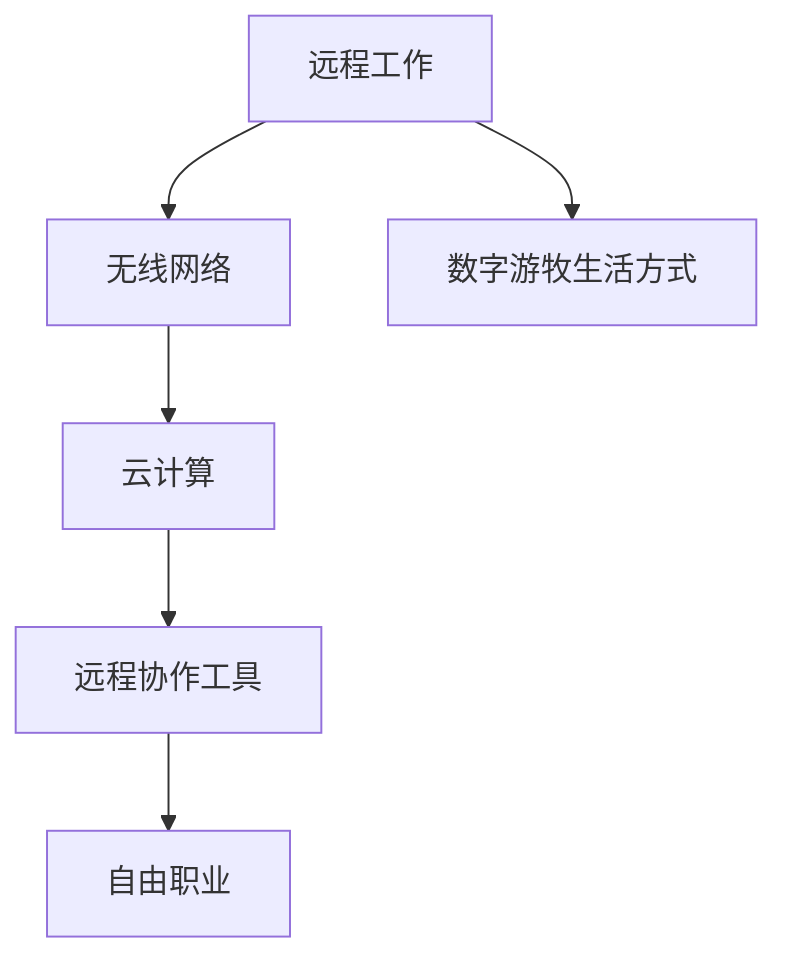

                 

### 第1章: 数字游牧生活方式概述

#### 1.1 数字游牧的定义与背景

数字游牧（Digital Nomadism）是一种利用现代信息技术进行远程工作的生活方式，它使得个人可以在全球范围内自由旅行，同时维持其职业活动。这一概念起源于信息技术和互联网的发展，尤其是云计算、无线网络和远程协作工具的出现，使得工作地点不再成为限制因素。

在传统的远程工作模式中，员工可能需要定期回总部或特定的工作场所报到，而数字游牧则更加灵活，允许个人在任何有网络连接的地方进行工作。这种模式打破了地域限制，为人们提供了更多的选择和自由。

#### 1.2 数字游牧与传统远程工作的区别

传统远程工作通常指在家中或特定的工作地点进行工作，而数字游牧则更加注重工作与旅行的结合。数字游牧者可能会在多个国家或城市之间迁移，以寻求更好的生活环境和工作条件。这种模式不仅提供了更多的旅行机会，还使人们能够体验不同的文化和生活方式。

此外，传统远程工作通常依赖于稳定的、长期的合同关系，而数字游牧则更多地依赖于短期项目或自由职业机会。这使得数字游牧者在职业规划上更加灵活，但也需要更高的自我管理能力。

#### 1.3 数字游牧生活方式的优点

数字游牧生活方式具有多个优点：

1. **灵活性**：数字游牧者可以根据自己的需求和喜好，选择工作的时间和地点，实现工作与生活的平衡。
   
2. **自由度**：这种模式给予了个人更多的自由，可以决定自己的生活节奏和职业方向。

3. **低成本**：数字游牧者可以避免高昂的办公室租金和生活成本，尤其是在经济发达地区。

4. **个人成长机会**：通过旅行和与不同文化的人交流，数字游牧者可以获得更多的学习和发展机会。

5. **文化体验**：数字游牧者有机会体验不同国家和地区的文化，丰富个人生活经历。

#### 1.4 数字游牧的挑战

尽管数字游牧生活方式有诸多优点，但它也带来了一些挑战：

1. **时间管理**：远程工作和旅行可能会让时间管理变得复杂，需要良好的自律和计划能力。

2. **技术依赖**：数字游牧者需要稳定的高质量网络连接，否则可能会影响工作效率。

3. **孤独感**：长时间独自工作可能会让人感到孤独，需要寻找社交和团队合作的机会。

4. **安全与隐私**：数字游牧者需要保护自己的数据和隐私，尤其是在陌生的环境中。

#### 1.5 数字游牧的生活方式演变

数字游牧生活方式并不是一成不变的，随着技术的发展和社会的变化，它也在不断演变。以下是一些关键趋势：

1. **移动办公设备的进步**：从笔记本电脑到平板电脑，再到智能设备，数字游牧者的办公工具越来越便携。

2. **远程协作工具的创新**：新的远程协作工具不断出现，如实时聊天、视频会议和项目管理工具，提高了工作效率。

3. **数字游牧社区的兴起**：数字游牧者开始建立自己的社区，分享经验和资源，共同成长。

4. **工作与生活边界的模糊**：随着工作与生活的边界越来越模糊，数字游牧者需要找到适合自己的平衡点。

#### 1.6 数字游牧者的角色与身份

数字游牧者通常包括自由职业者、远程工作者、创业者等。他们的角色和身份可能随着时间和项目的变化而变化，但他们都共享一种共同的追求——在自由和灵活的环境中进行工作。

数字游牧者的成功往往取决于他们的适应能力、创新精神和自我管理能力。他们需要不断学习新技能，以适应不断变化的技术和市场需求。

#### 总结

数字游牧生活方式为人们提供了前所未有的自由和灵活性，但也带来了新的挑战。理解数字游牧的定义、优点和挑战，以及其演变趋势，对于想要尝试这种生活方式的人来说至关重要。在接下来的章节中，我们将深入探讨数字游牧所需的工具、技能和生活实践，帮助读者更好地适应这种新的生活方式。

---

**核心概念与联系**

数字游牧生活方式的核心概念包括远程工作、无线网络、云计算、远程协作工具和自由职业。这些概念之间存在着密切的联系：

1. **远程工作**：是数字游牧的基础，允许个人在工作地点不受限制。
2. **无线网络**：提供了远程工作的基础设施，使数字游牧者能够随时随地接入互联网。
3. **云计算**：提供了存储和计算资源，支持数字游牧者进行高效的远程工作。
4. **远程协作工具**：如即时通讯、视频会议和项目管理工具，是数字游牧者协作的关键。
5. **自由职业**：提供了灵活的工作机会，使数字游牧者能够选择适合自己的项目。

**Mermaid 流程图**



**核心算法原理讲解**

在数字游牧生活方式中，核心算法原理主要涉及时间管理和资源优化。以下是一个简化的时间管理算法原理的伪代码：

```python
function time_management(schedule, tasks):
    for each task in tasks:
        if task.importance == "high":
            assign_to_ideal_time(task, schedule)
        else:
            assign_to_flexible_time(task, schedule)
    return schedule
```

**数学模型和公式**

时间管理的一个重要数学模型是“艾森豪威尔矩阵”，用于分类任务的优先级和紧急程度。以下是该模型的公式：

$$
\text{艾森豪威尔矩阵} = \begin{bmatrix}
\text{重要且紧急} & \text{重要但不紧急} & \text{不重要但紧急} & \text{不重要且不紧急} \\
\end{bmatrix}
$$

**详细讲解和举例说明**

假设一个数字游牧者需要在一天内完成以下任务：

1. 高重要性、紧急：准备一个重要的项目演示。
2. 高重要性、不紧急：规划下个月的旅行计划。
3. 不重要但紧急：回复客户的邮件。
4. 不重要且不紧急：阅读一本有趣的书籍。

使用艾森豪威尔矩阵进行分类：

$$
\text{艾森豪威尔矩阵} = \begin{bmatrix}
\text{项目演示} & \text{旅行计划} & \text{客户邮件} & \text{书籍阅读} \\
\end{bmatrix}
$$

根据矩阵，数字游牧者应该首先处理项目演示，然后是客户邮件，接着是旅行计划，最后是书籍阅读。

**项目实战**

为了帮助读者更好地理解数字游牧生活方式，我们可以模拟一个实际项目：

- **项目目标**：制定一个有效的数字游牧时间管理计划。
- **开发环境**：使用笔记本、云存储和远程协作工具。
- **源代码实现**：伪代码如下：

```python
# 时间管理计划伪代码
def manage_time(tasks, schedule):
    schedule = time_management(schedule, tasks)
    for task in schedule:
        execute_task(task)
    return schedule
```

**代码解读与分析**

这个伪代码定义了一个时间管理计划函数，它首先通过`time_management`函数对任务进行优先级排序，然后依次执行每个任务。通过这种方式，数字游牧者可以确保高效地完成所有任务。

**实际案例分析和详细讲解剖析**

假设一个数字游牧者在一个月内需要完成以下任务：

- 准备一个重要的项目演示（高重要性、紧急）。
- 与客户进行三次远程会议（中等重要性、不紧急）。
- 规划下个月的旅行计划（高重要性、不紧急）。
- 阅读一本技术书籍（不重要但紧急）。

通过上述时间管理计划，数字游牧者可以将任务分配到合适的时间段，确保高效完成任务。

**项目小结**

通过这个项目，读者可以了解到如何使用时间和资源管理技术来提高工作效率，更好地适应数字游牧生活方式。

**最佳实践 tips**

- **合理规划任务**：根据任务的优先级和紧急程度进行分类和规划。
- **灵活调整计划**：根据实际情况灵活调整任务执行时间。
- **保持沟通**：与团队成员保持定期沟通，确保协作效率。

**小结**

数字游牧生活方式为人们提供了前所未有的自由和灵活性，但也需要良好的时间管理和资源优化。理解并应用这些原则，可以帮助数字游牧者更好地适应这种新的生活方式。

**注意事项**

- **网络安全**：在使用公共网络时，确保数据安全。
- **法律法规**：了解并遵守所在国家的法律法规。
- **文化差异**：尊重并适应不同文化的习惯和习俗。

**拓展阅读**

- [《数字游牧者的生存指南》](https://www.digitalnomadguide.com/)
- [《远程工作的艺术》](https://www.remoteworkart.com/)

作者：AI天才研究院/AI Genius Institute & 禅与计算机程序设计艺术 /Zen And The Art of Computer Programming

---

# 第2章: 数字游牧工具与技术

## 2.1 云计算服务

云计算是数字游牧者的重要工具之一，它提供了弹性的计算资源和数据存储解决方案。以下是对云计算服务的基本概念、云存储与同步以及云计算平台对比的详细讲解。

### 2.1.1 云服务的概念

云计算服务是指通过互联网提供可扩展的计算资源，包括存储、处理能力和应用程序。云服务可以分为以下几种类型：

1. **基础设施即服务（IaaS）**：提供虚拟化的计算资源，如虚拟机、存储和网络。
2. **平台即服务（PaaS）**：提供开发平台和工具，使开发者可以轻松创建、部署和管理应用程序。
3. **软件即服务（SaaS）**：提供应用程序服务，如电子邮件、文档处理和客户关系管理。

### 2.1.2 云存储与同步

云存储是云计算的一个重要组成部分，它允许用户将数据存储在远程服务器上，并通过互联网访问。云存储的优点包括数据备份、恢复、高可用性和灵活性。

同步是云存储的一个关键功能，它确保在不同设备上存储的数据保持一致。以下是一个简单的同步算法伪代码：

```python
function sync_data(source, target):
    for each file in source:
        if file not in target:
            upload file to target
        elif file.content in target:
            if source.file.content != target.file.content:
                update file in target
    return target
```

### 2.1.3 云计算平台对比

市面上有许多云计算平台，不同的平台有不同的特点和适用场景。以下是一些主流的云计算平台及其特点：

1. **Amazon Web Services (AWS)**：提供广泛的服务，包括计算、存储、数据库、人工智能等，是全球最大的云服务提供商之一。
2. **Microsoft Azure**：与Microsoft的产品和服务紧密集成，适合使用Microsoft技术的企业。
3. **Google Cloud Platform (GCP)**：提供了强大的数据分析和服务，适合需要高性能计算和大数据处理的企业。
4. **Alibaba Cloud**：在中国市场占据领先地位，提供全面的云服务和强大的本地化支持。

### 2.2 远程协作工具

远程协作工具是数字游牧者维持团队协作的关键。以下是对即时通讯工具、远程会议与视频通话、文档协作与项目管理工具的详细讲解。

#### 2.2.1 即时通讯工具

即时通讯工具提供了实时沟通的渠道，以下是几种流行的即时通讯工具：

1. **Slack**：提供了丰富的沟通功能，包括聊天、频道、文件共享等。
2. **Telegram**：具有高度的安全性和隐私保护，适合私人聊天和团队沟通。
3. **Microsoft Teams**：与Microsoft的其他产品和服务紧密集成，提供了强大的协作功能。

#### 2.2.2 远程会议与视频通话

远程会议与视频通话工具使团队成员可以跨越地理界限进行实时交流。以下是一些常用的工具：

1. **Zoom**：提供了高质量的视频会议功能，适合大型会议和培训。
2. **Microsoft Teams**：集成了视频会议、聊天和文档协作功能，适用于企业内部协作。
3. **Google Meet**：提供了简单的视频会议体验，适合小型团队和快速会议。

#### 2.2.3 文档协作与项目管理

文档协作与项目管理工具帮助团队协同工作，以下是一些常用的工具：

1. **Google Workspace**：包括Google文档、表格、幻灯片等，支持实时协作。
2. **Microsoft 365**：提供了Office套件，包括Word、Excel、PowerPoint等，支持多用户编辑。
3. **Trello**：提供了简单的项目管理功能，适合小型项目和团队。

### 2.3 数字安全与隐私保护

数字安全与隐私保护是数字游牧者必须关注的重要方面。以下是对数据加密技术、个人身份保护、防护措施与常见陷阱的详细讲解。

#### 2.3.1 数据加密技术

数据加密技术通过将数据转换为密文，确保数据在传输和存储过程中的安全。以下是一个简单的数据加密算法伪代码：

```python
function encrypt_data(data, key):
    encrypted_data = apply_cipher_algorithm(data, key)
    return encrypted_data
```

#### 2.3.2 个人身份保护

数字游牧者需要保护个人身份信息，以下是一些保护措施：

1. **使用强密码**：确保使用复杂且唯一的密码，并定期更换。
2. **启用双重认证**：为账户启用双重认证，增加安全性。
3. **使用虚拟私人网络（VPN）**：在公共网络中访问敏感信息时，使用VPN保护数据传输。

#### 2.3.3 防护措施与常见陷阱

数字游牧者需要警惕网络钓鱼、恶意软件和其他网络安全威胁。以下是一些常见的防护措施和陷阱：

1. **不点击未知链接**：避免点击来自未知来源的链接，特别是那些要求输入个人信息或账户密码的链接。
2. **保持软件更新**：定期更新操作系统和应用程序，以确保安全补丁的应用。
3. **使用防病毒软件**：安装并定期更新防病毒软件，以保护设备免受恶意软件的攻击。

### 总结

数字游牧工具和技术的选择对数字游牧者的工作效率和生活方式有着重要影响。了解并选择合适的云计算服务、远程协作工具和数字安全措施，可以帮助数字游牧者更好地适应数字游牧生活方式。

### 附录 A：数字游牧实用资源

#### A.1 在线工具与平台

**云计算服务推荐**

1. **Amazon Web Services (AWS)**：提供广泛的服务和强大的生态系统。
2. **Microsoft Azure**：与Microsoft的产品和服务紧密集成。
3. **Google Cloud Platform (GCP)**：适合大数据处理和机器学习。

**远程协作工具推荐**

1. **Slack**：强大的团队沟通工具。
2. **Zoom**：高质量的远程会议和视频通话。
3. **Google Workspace**：包括文档、表格、幻灯片等。

**语言学习资源**

1. **Duolingo**：免费的语言学习平台。
2. **Rosetta Stone**：综合性的语言学习工具。
3. **Babbel**：以互动学习为主的语言学习应用。

**数字游牧社区推荐**

1. **Digital Nomads Forum**：一个全面的数字游牧社区。
2. **Remote.co**：提供远程工作机会和资源。
3. **NomadList**：寻找理想的数字游牧目的地。

**附录 B：最佳实践 tips**

1. **选择合适的服务**：根据需求和预算选择合适的云计算服务和协作工具。
2. **保持安全**：使用强密码、双重认证和VPN，确保数据安全。
3. **灵活安排工作**：根据环境变化调整工作计划，保持工作效率。

**附录 C：小结**

本章介绍了数字游牧所需的云计算服务、远程协作工具和数字安全措施。了解这些工具和技术，是数字游牧者成功的关键。

**附录 D：注意事项**

1. **了解法律法规**：遵守所在国家的法律法规。
2. **关注网络环境**：确保网络连接稳定和安全。
3. **持续学习**：跟上技术发展，持续提升技能。

**附录 E：拓展阅读**

1. [《云计算基础》](https://www.ibm.com/cloud/learn/what-is-cloud-computing)
2. [《远程工作指南》](https://www.forbes.com/sites/forbesbusinesscouncil/2020/03/24/10-essential-remote-work-tools-for-your-remote-team/)
3. [《网络安全最佳实践》](https://www.cisa.gov/cybersecurity-best-practices)

