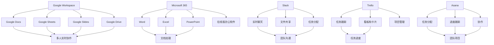
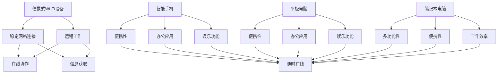
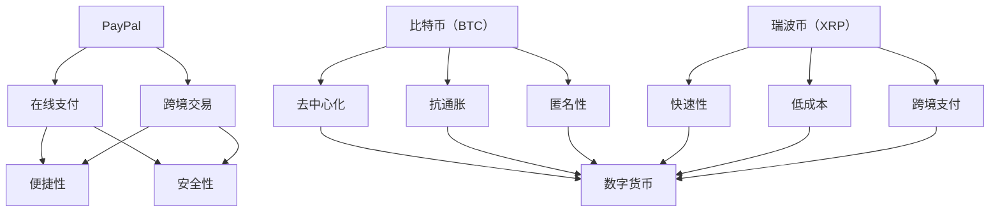

                 

# 文章标题：城市游牧生存指南：数字游民的实用技巧

## 关键词：数字游民、城市游牧、远程工作、技能与工具、财务管理、健康与平衡、未来展望

> **摘要**：本文旨在为数字游民提供一份详尽的城市游牧生存指南，从技能准备、工作方式、财务管理、健康与平衡到未来展望，全面探讨数字游民在现代社会中的生存技巧。通过本文，读者将深入了解如何成为一名成功的数字游民，享受自由与高效的城市游牧生活。

## 引言：数字游民的崛起与城市游牧生活

### 1.1 数字游民的定义与趋势

数字游民（Digital Nomad）是指那些利用互联网技术，以远程工作为主要生活方式的人群。他们不受传统办公室的限制，可以在全球范围内选择居住和工作地点。近年来，随着互联网的普及和远程工作技术的发展，数字游民这一群体迅速崛起，成为现代社会的一种新兴生活方式。

数字游民的优势在于自由度高、工作灵活性大、生活成本相对较低。他们可以根据自己的兴趣和需求，选择在任何一个拥有网络连接的地方工作和生活。这种生活方式不仅能够提高工作效率，还能让人们更好地享受生活，拓宽视野，体验不同的文化和生活方式。

### 1.2 城市游牧生活的优势与挑战

城市游牧生活（Urban Nomadism）是数字游民的一种典型生活方式，它以探索城市文化、享受城市便利设施为核心。城市游牧生活的优势在于：

1. **丰富的资源与机会**：城市拥有更多的就业机会、教育资源和文化活动，为数字游民提供了广阔的发展空间。
2. **便利的交通和通信**：城市交通网络发达，通信设施完善，便于数字游民随时随地进行工作和沟通。
3. **多样的生活方式**：城市生活多姿多彩，数字游民可以体验到不同的文化、美食和娱乐活动。

然而，城市游牧生活也面临着一些挑战，如：

1. **生活成本高**：城市的生活成本通常较高，尤其是在国际大都市，住房、交通、餐饮等方面的费用可能对数字游民构成一定压力。
2. **竞争压力大**：城市竞争激烈，数字游民需要不断提升自己的技能和竞争力，以适应快速变化的市场环境。
3. **孤独感**：长期远离家乡和亲人，数字游民可能会感受到孤独和思乡之情。

### 1.3 本书结构安排与目标

本书将分为七个章节，全面探讨数字游民的生存技巧。具体章节安排如下：

1. **准备就绪**：介绍数字游民必备的技能和工具。
2. **数字游民工作方式**：探讨自由职业、远程工作和个人品牌建设。
3. **城市游牧生活**：分析城市选择、适应策略和生活成本管理。
4. **财务自由**：讨论财务规划、投资和跨境交易。
5. **健康与平衡**：关注数字游民的健康管理和工作与生活的平衡。
6. **未来展望**：预测数字游民的未来趋势和影响。
7. **附录**：提供数字游民资源汇总和法律与税务指南。

通过本书，读者将获得一份全面的城市游牧生存指南，帮助他们在数字游民的道路上走得更加稳健和成功。接下来，我们将一步步深入探讨数字游民的各个生存技巧。<!-- mce-toc -->

## 第1章 引言：数字游民的崛起与城市游牧生活

### 1.1 数字游民的定义与趋势

数字游民（Digital Nomad）是指那些利用互联网技术，以远程工作为主要生活方式的人群。他们不受传统办公室的限制，可以在全球范围内选择居住和工作地点。数字游民的生活模式与传统的9到5工作模式截然不同，他们更加注重灵活性和自由度。这种生活方式不仅能够提高工作效率，还能让人们更好地享受生活，拓宽视野，体验不同的文化和生活方式。

数字游民的兴起与以下几个方面密切相关：

1. **互联网技术的普及**：随着互联网技术的不断发展和普及，远程工作的可行性大大提高。数字游民可以通过各种在线工具和平台，与世界各地的人和公司进行协作和沟通。
   
2. **远程工作平台的兴起**：诸如Upwork、Freelancer、Fiverr等在线自由职业平台，为数字游民提供了丰富的就业机会。这些平台不仅方便了雇主与自由职业者的匹配，还提供了各种服务，如合同管理、支付和税务处理等。

3. **移动设备的普及**：智能手机、平板电脑和笔记本电脑等移动设备的普及，使得数字游民可以随时随地访问网络，处理工作事务。

4. **人们对工作与生活平衡的追求**：现代职场人士越来越意识到，工作与生活的平衡对个人幸福和职业发展的重要性。数字游民的生活方式正满足了这一需求，使他们能够在享受生活的同时，实现职业目标。

### 1.2 城市游牧生活的优势与挑战

城市游牧生活是数字游民的一种典型生活方式，它以探索城市文化、享受城市便利设施为核心。以下是城市游牧生活的几个优势：

1. **丰富的资源与机会**：城市拥有更多的就业机会、教育资源和文化活动，为数字游民提供了广阔的发展空间。例如，硅谷、纽约、伦敦等国际大都市，都是数字游民的理想居住地，因为这里拥有世界领先的公司和丰富的行业资源。

2. **便利的交通和通信**：城市交通网络发达，通信设施完善，便于数字游民随时随地进行工作和沟通。地铁、公交、出租车等交通工具，使得城市游牧生活更加便捷。

3. **多样的生活方式**：城市生活多姿多彩，数字游民可以体验到不同的文化、美食和娱乐活动。无论是参加艺术展览、音乐会，还是品尝当地美食、游览名胜古迹，城市都为数字游民提供了丰富的选择。

然而，城市游牧生活也面临着一些挑战：

1. **生活成本高**：城市的生活成本通常较高，尤其是在国际大都市，住房、交通、餐饮等方面的费用可能对数字游民构成一定压力。例如，纽约、伦敦等大城市的房租和餐饮费用相对较高，这可能会对数字游民的财务状况产生一定影响。

2. **竞争压力大**：城市竞争激烈，数字游民需要不断提升自己的技能和竞争力，以适应快速变化的市场环境。与此同时，城市中众多优秀的竞争者也会对数字游民的职业生涯带来压力。

3. **孤独感**：长期远离家乡和亲人，数字游民可能会感受到孤独和思乡之情。虽然城市提供了丰富的社交活动和文化体验，但对于那些习惯于家庭和朋友陪伴的人来说，这种孤独感可能会成为一大挑战。

### 1.3 本书结构安排与目标

为了帮助数字游民更好地适应城市游牧生活，本书将分为七个章节，每个章节都聚焦于不同的生存技巧。具体章节安排如下：

1. **准备就绪**：介绍数字游民必备的技能和工具，包括编程、数字营销、时间管理等。

2. **数字游民工作方式**：探讨自由职业、远程工作和个人品牌建设，帮助数字游民找到适合自己的工作方式。

3. **城市游牧生活**：分析城市选择、适应策略和生活成本管理，帮助数字游民更好地融入城市生活。

4. **财务自由**：讨论财务规划、投资和跨境交易，帮助数字游民实现经济独立和财务自由。

5. **健康与平衡**：关注数字游民的健康管理和工作与生活的平衡，帮助数字游民保持良好的身心状态。

6. **未来展望**：预测数字游民的未来趋势和影响，为数字游民的长期发展提供指导。

7. **附录**：提供数字游民资源汇总和法律与税务指南，帮助数字游民更好地应对各种实际问题。

通过本书，读者将获得一份全面的城市游牧生存指南，帮助他们在数字游民的道路上走得更加稳健和成功。接下来，我们将一步步深入探讨数字游民的各个生存技巧。<!-- mce-toc -->

## 第2章 准备就绪：数字游民的技能与工具

### 2.1 数字游民的必备技能

成为一名成功的数字游民，首先需要具备一系列必备技能。这些技能不仅能够提高工作效率，还能帮助数字游民在远程工作中保持竞争力。以下是数字游民必备的几个关键技能：

#### 2.1.1 编程与技术开发能力

编程与技术开发能力是数字游民的基本技能之一。无论是从事自由职业、远程开发，还是进行个人项目，编程能力都是必不可少的。数字游民需要熟悉至少一门编程语言，如Python、Java、JavaScript等，并且具备一定的开发经验。此外，了解常见的开发框架和工具，如React、Angular、Django等，也能大大提高工作效率。

**核心概念与联系**：

- **编程语言**：编程语言是数字游民与计算机进行交流的工具。不同的编程语言适用于不同的应用场景，如Python适合数据分析和科学计算，Java适合企业级应用开发，JavaScript适合前端开发等。
- **开发框架**：开发框架提供了现成的代码库和组件，帮助开发者快速构建应用程序。常见的开发框架有React、Angular、Vue.js等。
- **版本控制**：版本控制工具如Git，可以帮助数字游民管理代码的版本，确保代码的稳定性和安全性。

**伪代码示例**：

```python
# 定义一个简单的Python函数
def calculate_sum(a, b):
    return a + b

# 调用函数计算两个数的和
result = calculate_sum(5, 3)
print("结果为：", result)
```

#### 2.1.2 数字营销与社交媒体运用

数字营销与社交媒体运用是数字游民的重要技能之一。在互联网时代，良好的数字营销能力可以帮助数字游民扩大影响力、吸引客户、提升个人品牌。社交媒体平台如LinkedIn、Facebook、Instagram等，是数字游民展示自己、建立联系、分享经验的理想场所。

**核心概念与联系**：

- **内容营销**：通过创造有价值的内容，吸引潜在客户，提高品牌知名度。
- **社交媒体运营**：在社交媒体平台上维护个人品牌，与粉丝互动，扩大影响力。
- **搜索引擎优化（SEO）**：通过优化网站内容和结构，提高在搜索引擎中的排名，吸引更多流量。

**伪代码示例**：

```python
# 定义一个简单的SEO优化函数
def optimize_content(content, keywords):
    optimized_content = content.replace(" ", ", ").join([keyword for keyword in keywords])
    return optimized_content

# 调用函数优化内容
original_content = "这是一个关于数字游民的博客。"
keywords = ["数字游民", "城市游牧生活", "远程工作"]
optimized_content = optimize_content(original_content, keywords)
print("优化后的内容：", optimized_content)
```

#### 2.1.3 时间管理与效率提升

时间管理与效率提升是数字游民成功的关键。远程工作往往没有固定的上下班时间，数字游民需要自己规划和管理时间，确保工作效率。以下是一些有效的时间管理和效率提升技巧：

- **任务管理工具**：如Trello、Asana、JIRA等，可以帮助数字游民规划任务、跟踪进度、提高效率。
- **番茄工作法**：通过将工作时间划分为25分钟的工作周期，每工作25分钟后休息5分钟，提高专注力和工作效率。
- **优先级排序**：根据任务的重要性和紧急程度，合理分配时间和精力，确保关键任务得到优先处理。

**核心概念与联系**：

- **任务管理**：任务管理工具帮助数字游民明确任务目标、分配时间资源，提高工作效率。
- **时间管理**：合理规划工作时间，避免时间浪费，确保任务按时完成。

**伪代码示例**：

```python
# 定义一个简单的任务管理函数
def manage_tasks(tasks):
    sorted_tasks = sorted(tasks, key=lambda x: (x['priority'], x['deadline']))
    return sorted_tasks

# 调用函数管理任务
tasks = [
    {'name': '编写博客', 'priority': 1, 'deadline': '2023-11-01'},
    {'name': '开发新功能', 'priority': 2, 'deadline': '2023-11-10'},
    {'name': '参加在线会议', 'priority': 3, 'deadline': '2023-11-08'}
]
sorted_tasks = manage_tasks(tasks)
print("排序后的任务：", sorted_tasks)
```

通过掌握编程与技术开发能力、数字营销与社交媒体运用以及时间管理与效率提升，数字游民可以更好地应对远程工作中的各种挑战，实现职业和生活的平衡。接下来，我们将探讨数字游民工具集，了解如何利用现代技术提升工作效率和生活质量。<!-- mce-toc -->

### 2.2 数字游民工具集

成为一名成功的数字游民，除了具备必要的技能外，还需要一套高效的工具集来支持工作和生活。以下是一些数字游民常用的工具和平台，它们可以帮助数字游民提高工作效率、管理项目、保持连接和实现财务自由。

#### 2.2.1 云计算与远程工作平台

云计算技术为数字游民提供了强大的支持，使他们能够随时随地访问数据和应用程序。以下是几个常用的云计算和远程工作平台：

- **Google Workspace**：包括Google Docs、 Sheets、Slides、Drive等，提供了强大的在线办公工具，支持多人实时协作。
- **Microsoft 365**：类似于Google Workspace，提供Word、Excel、PowerPoint等办公软件的在线版，适合需要使用Microsoft Office的用户。
- **Slack**：一款流行的团队沟通和协作工具，支持实时聊天、文件共享和任务分配。
- **Trello**：一个简单但功能强大的项目管理工具，通过看板和卡片，帮助数字游民跟踪任务进度和优先级。
- **Asana**：一个综合性的项目管理工具，支持任务分配、进度跟踪和协作，适合团队项目。

**Mermaid 流程图示例**：



通过上述工具，数字游民可以有效地管理远程工作项目，保持与团队成员的沟通，确保任务按时完成。

#### 2.2.2 无线网络与便携设备

无线网络和便携设备是数字游民的核心基础设施。以下是数字游民常用的无线网络和便携设备：

- **便携式Wi-Fi设备**：如MiFi、便携式路由器等，为数字游民提供稳定的网络连接，即使在偏远地区也能保持在线。
- **智能手机和平板电脑**：数字游民常用的便携设备，支持各种办公应用和娱乐功能。
- **笔记本电脑**：数字游民的必备设备，轻便易携，功能强大，适合远程工作。

**Mermaid 流程图示例**：



通过这些设备，数字游民可以随时随地保持在线，处理工作事务，享受数字游牧生活。

#### 2.2.3 电子钱包与数字货币

电子钱包和数字货币为数字游民提供了便捷的支付和财务管理方式。以下是数字游民常用的电子钱包和数字货币：

- **PayPal**：全球领先的在线支付服务，支持跨境交易和多种货币兑换。
- **比特币（BTC）**：一种去中心化的数字货币，具有抗通胀、匿名性等特点，逐渐被数字游民接受。
- **瑞波币（XRP）**：一种快速、低成本的数字货币，适合跨境支付和转移。

**Mermaid 流程图示例**：



通过电子钱包和数字货币，数字游民可以轻松进行跨境支付和财务管理，提高财务灵活性。

综上所述，云计算与远程工作平台、无线网络与便携设备、电子钱包与数字货币是数字游民的三大工具集，它们共同构成了数字游民高效工作和生活的基石。在接下来的章节中，我们将进一步探讨数字游民的工作方式，帮助读者更好地理解如何在远程世界中实现职业目标。<!-- mce-toc -->

### 2.3 数字游民工作方式：灵活与高效的结合

在数字游民的世界中，工作方式的灵活性与高效性是成功的关键。数字游民通常以自由职业者、远程工作者或创业者身份存在，他们利用互联网和现代技术，在全球范围内选择工作地点。以下是数字游民常用的几种工作方式：

#### 2.3.1 自由职业与远程工作机会

自由职业（Freelance）是数字游民最常见的工作方式之一。自由职业者通过在线自由职业平台，如Upwork、Freelancer、Fiverr等，寻找各种短期或长期的项目。这些平台为自由职业者提供了广泛的机会，包括软件开发、网页设计、内容写作、图形设计、数字营销等。

**核心概念与联系**：

- **在线自由职业平台**：这些平台为自由职业者提供了与雇主匹配的机会，简化了项目管理和支付流程。
- **远程工作**：远程工作使自由职业者可以在任何地点工作，不受时间和地点的限制。

**伪代码示例**：

```python
# 定义一个简单的自由职业项目匹配函数
def match_project(skill, projects):
    matched_projects = [project for project in projects if skill in project['skills']]
    return matched_projects

# 调用函数匹配项目
skills = ['软件开发', '网页设计', '内容写作']
projects = [
    {'name': '网站开发', 'skills': ['软件开发', '前端开发'], 'duration': '3个月'},
    {'name': '文案撰写', 'skills': ['内容写作', '市场营销'], 'duration': '2周'},
    {'name': 'UI设计', 'skills': ['图形设计', '用户界面设计'], 'duration': '1周'}
]
matched_projects = match_project('软件开发', projects)
print("匹配的项目：", matched_projects)
```

通过这种方式，数字游民可以找到与自身技能和兴趣相匹配的项目，实现个人价值的最大化。

#### 2.3.2 远程工作招聘渠道

除了在线自由职业平台，数字游民还可以通过其他渠道寻找远程工作机会。以下是一些常见的远程工作招聘渠道：

- **公司官网**：许多公司会在其官方网站上发布远程工作职位，直接与雇主联系，避免中间环节。
- **LinkedIn**：LinkedIn是一个专业的社交网络平台，许多公司会在这里发布招聘信息，数字游民可以通过LinkedIn建立个人品牌，提高曝光率。
- **专业社区和论坛**：如远程工作社区、数字游民论坛等，这些社区提供了丰富的招聘信息和职业机会。

**核心概念与联系**：

- **公司官网**：直接从公司官网获取招聘信息，可以更直接地了解职位要求和工作环境。
- **LinkedIn**：通过LinkedIn建立专业网络，扩大人脉，提高求职成功率。
- **专业社区和论坛**：在这些社区中，数字游民可以获取最新行业动态和招聘信息，与同行交流经验。

**伪代码示例**：

```python
# 定义一个简单的LinkedIn招聘搜索函数
def search_jobs(keyword, jobs):
    searched_jobs = [job for job in jobs if keyword in job['title']]
    return searched_jobs

# 调用函数搜索职位
keyword = '远程工作'
jobs = [
    {'title': '远程软件工程师', 'company': 'Tech Company', 'location': '全球'},
    {'title': '远程市场营销专家', 'company': 'Marketing Agency', 'location': '远程'},
    {'title': '远程内容创作者', 'company': 'Content Platform', 'location': '全球'}
]
searched_jobs = search_jobs('远程工作', jobs)
print("搜索结果：", searched_jobs)
```

#### 2.3.3 个人品牌建设

个人品牌建设是数字游民在远程工作中脱颖而出的重要手段。通过建立强大的个人品牌，数字游民可以吸引更多客户和机会，提高市场竞争力。

**核心概念与联系**：

- **内容创作**：通过博客、社交媒体、在线课程等形式，分享专业知识和经验，展示个人才华。
- **社交媒体运营**：在LinkedIn、Twitter、Instagram等平台上建立专业形象，与潜在客户和同行建立联系。
- **口碑传播**：通过客户推荐和良好评价，建立口碑，提高个人品牌知名度。

**伪代码示例**：

```python
# 定义一个简单的个人品牌建设函数
def build_brand(personal_brand, content):
    brand_content = personal_brand + " " + content
    return brand_content

# 调用函数建设个人品牌
personal_brand = "资深软件开发专家"
content = "分享编程技巧和行业动态"
brand_content = build_brand(personal_brand, content)
print("个人品牌内容：", brand_content)
```

通过上述工作方式，数字游民可以灵活选择适合自己的工作，提高工作效率，实现职业和生活的平衡。在接下来的章节中，我们将探讨数字游民在城市中的生活策略，帮助他们在全球范围内找到理想的生活和工作地点。<!-- mce-toc -->

## 第3章 数字游民工作方式：灵活与高效的结合

### 3.1 自由职业与远程工作机会

自由职业和远程工作为数字游民提供了广泛的机会，使他们能够根据自己的兴趣和技能选择合适的项目。以下是如何利用自由职业和远程工作机会的一些关键点：

#### 3.1.1 在线自由职业平台

在线自由职业平台如Upwork、Freelancer、Fiverr等，为数字游民提供了丰富的项目资源。以下是这些平台的一些特点：

- **Upwork**：Upwork是全球最大的自由职业平台之一，拥有大量的项目和雇主资源。数字游民可以通过Upwork找到各种类型的项目，如编程、设计、写作等。Upwork的优点在于其完善的支付系统和合同管理功能。

- **Freelancer**：Freelancer以其广泛的用户群体和多样化的项目类型而闻名。数字游民可以在Freelancer上找到短期和长期项目，并与雇主直接沟通。Freelancer的缺点在于其竞争较为激烈，项目价格可能较低。

- **Fiverr**：Fiverr是一个专注于小项目的平台，数字游民可以在Fiverr上提供各种服务，如网站设计、文案撰写、视频剪辑等。Fiverr的价格通常较低，但可以吸引大量客户。

**数学模型和公式**：

在选择自由职业平台时，数字游民可以使用以下公式来评估项目的价值：

\[ 价值 = (时间 \times 技能水平) - 成本 \]

其中，时间和技能水平是项目的主要成本，成本包括平台费用、税务费用和基础设施费用等。

**举例说明**：

假设一个数字游民花费10小时完成一个编程项目，他的技能水平为高级，每小时价值100美元。如果项目的成本（包括平台费用和税务）为20美元，则项目的净价值为：

\[ 价值 = (10 \times 100) - 20 = 980美元 \]

#### 3.1.2 远程工作招聘渠道

除了自由职业平台，数字游民还可以通过以下渠道寻找远程工作机会：

- **公司官网**：许多公司会在其官方网站上发布远程工作职位，直接与雇主联系，避免中间环节。

- **LinkedIn**：LinkedIn是一个专业的社交网络平台，许多公司会在这里发布招聘信息。数字游民可以通过LinkedIn建立个人品牌，提高求职成功率。

- **远程工作社区和论坛**：远程工作社区和论坛如Remote.co、Remote Year等，提供了丰富的招聘信息和职业机会。

**数学模型和公式**：

在评估远程工作职位时，数字游民可以使用以下公式来计算年薪：

\[ 年薪 = (\text{时薪} \times \text{每周工作小时数} \times \text{全年工作周数}) \times 12 \]

其中，时薪是数字游民每小时的工作价值，每周工作小时数和全年工作周数取决于具体职位和工作合同。

**举例说明**：

假设一个数字游民的时薪为50美元，每周工作40小时，全年工作50周，则他的年薪为：

\[ 年薪 = (50 \times 40 \times 50) \times 12 = 120,000美元 \]

#### 3.1.3 个人品牌建设

个人品牌建设是数字游民在远程工作中脱颖而出的重要手段。以下是一些有效的个人品牌建设策略：

- **内容创作**：通过博客、社交媒体、在线课程等形式，分享专业知识和经验，展示个人才华。

- **社交媒体运营**：在LinkedIn、Twitter、Instagram等平台上建立专业形象，与潜在客户和同行建立联系。

- **口碑传播**：通过客户推荐和良好评价，建立口碑，提高个人品牌知名度。

**数学模型和公式**：

个人品牌的价值可以通过以下公式计算：

\[ 品牌价值 = (\text{粉丝数量} \times \text{粉丝互动率}) \times \text{每千次互动价值} \]

其中，粉丝数量是个人品牌的关注度，粉丝互动率是指粉丝的参与度，每千次互动价值是指每次互动可能带来的收益。

**举例说明**：

假设一个数字游民的社交媒体粉丝数量为10,000，粉丝互动率为20%，每千次互动价值为100美元，则他的个人品牌价值为：

\[ 品牌价值 = (10,000 \times 0.20) \times 100 = 20,000美元 \]

通过上述策略，数字游民可以提升个人品牌价值，吸引更多客户和机会，从而实现职业和生活的平衡。在接下来的章节中，我们将探讨数字游民在城市中的生活策略，帮助他们更好地适应和融入城市生活。<!-- mce-toc -->

### 3.2 项目管理与团队协作

在数字游民的生活中，项目管理与团队协作是确保工作顺利进行的关键环节。数字游民通常需要独立完成项目，同时也可能参与到跨地域、跨时区的团队合作中。以下是一些有效的项目管理和团队协作技巧：

#### 3.2.1 效率工具与软件

为了提高工作效率，数字游民可以借助一系列效率工具和软件来管理任务、跟踪进度和协作。以下是几个常用的工具：

- **Trello**：Trello是一个直观的任务管理工具，通过看板和卡片，帮助数字游民清晰地规划和跟踪项目进度。每个卡片可以包含任务描述、截止日期、相关文件和注释，方便团队成员之间的沟通。

- **Asana**：Asana是一个功能强大的项目管理工具，支持任务分配、进度跟踪、报告生成等。它提供了丰富的视图选项，如看板、列表、甘特图等，便于团队成员了解项目整体进展。

- **Slack**：Slack是一个团队沟通工具，支持实时聊天、文件共享、任务提醒等功能。通过创建不同的工作频道，团队成员可以高效地交流信息，避免邮件和即时通讯工具的混乱。

**数学模型和公式**：

在项目管理中，关键路径分析（Critical Path Method, CPM）是一个常用的方法，它用于确定项目完成所需的最短时间。关键路径上的任务不能延迟，否则会导致整个项目延误。

\[ CPT = \sum(任务持续时间) \]

其中，任务持续时间是指每个任务所需的时间。通过关键路径分析，数字游民可以识别出项目中的关键任务，并优先处理。

#### 3.2.2 团队协作技巧

有效的团队协作对于远程工作尤为重要。以下是一些团队协作的技巧：

- **明确目标和职责**：在项目开始前，确保所有团队成员对项目目标和各自职责有清晰的认识。通过明确的目标和职责，团队成员可以更好地协同工作，避免重复劳动和责任不清的问题。

- **定期沟通**：定期召开线上会议，讨论项目进展、解决问题和提供反馈。这不仅有助于团队成员之间的沟通，还能确保项目按照计划进行。

- **使用协作工具**：利用协作工具如Google Docs、Notion、Confluence等，实时编辑和共享文档，确保团队成员之间的信息同步。

- **信任与尊重**：建立互信和尊重的团队文化，鼓励团队成员表达意见和建议，促进团队的创新和协作。

**数学模型和公式**：

团队效能可以通过以下公式计算：

\[ 效能 = (\text{团队目标达成率} \times \text{团队成员满意度}) \times \text{工作效率} \]

其中，团队目标达成率是指项目目标完成的程度，团队成员满意度是指团队成员对团队合作的满意程度，工作效率是指团队成员的工作速度和质量。

#### 3.2.3 项目管理方法

为了更好地管理项目，数字游民可以采用以下几种项目管理方法：

- **敏捷开发（Agile Development）**：敏捷开发强调迭代和增量开发，通过快速反馈和持续改进，确保项目能够及时响应变化。这种方法适用于项目需求不明确或经常变化的情况。

- **看板系统（Kanban）**：看板系统是一种基于可视化管理的项目管理方法，通过看板（Kanban板）展示任务状态，帮助团队成员直观地了解项目进展。

- **Scrum框架**：Scrum是一种迭代式增量的项目管理方法，通过短期冲刺（Sprint）来完成任务，并在每次冲刺结束后进行回顾和调整。

**数学模型和公式**：

在敏捷开发中，燃尽图（Burn-down Chart）是一个常用的工具，它用于显示项目剩余工作量随时间的变化。通过燃尽图，项目经理可以实时了解项目进度，并做出相应的调整。

\[ 燃尽图 = \sum(剩余工作量) - \sum(已完成工作量) \]

通过上述项目管理方法和团队协作技巧，数字游民可以更好地管理项目，确保团队高效协作，实现项目目标。在接下来的章节中，我们将探讨数字游民在城市中的生活策略，帮助他们更好地适应和融入城市生活。<!-- mce-toc -->

## 第4章 城市游牧生活：探索世界的同时谋生

### 4.1 城市选择与生存策略

对于数字游民来说，选择适合自己的城市至关重要。不同的城市提供了不同的生活和工作环境，因此在做出选择时需要综合考虑多个因素。以下是选择城市的几个关键点：

#### 4.1.1 适合数字游民的城市特点

1. **网络基础设施良好**：数字游民依赖于网络进行工作，因此选择网络基础设施良好的城市至关重要。高速互联网连接能够确保他们随时随地进行在线工作。

2. **生活成本相对较低**：虽然城市的生活成本较高，但也有一些城市对数字游民来说生活成本相对较低。例如，东南亚的一些城市如巴厘岛、曼谷、清迈等，提供较低的生活成本和较高的生活质量，是数字游民的理想居住地。

3. **文化交流活跃**：文化交流活跃的城市能够提供丰富的文化体验和社交机会。这有助于数字游民拓宽视野，结识新朋友，并融入当地社区。

4. **远程工作友好**：一些城市政府和企业对远程工作持开放态度，甚至提供优惠政策吸引数字游民。例如，墨西哥的蒙特雷、塞尔维亚的贝尔格莱德等，都对数字游民提供了税收优惠和签证便利。

#### 4.1.2 城市适应与融入

1. **了解当地文化**：在新的城市生活，了解当地的文化习俗是非常重要的。尊重当地文化，了解节日和习俗，可以帮助数字游民更好地融入当地社会。

2. **建立社交网络**：通过参加当地的活动、加入社交媒体群组、参加兴趣小组等，数字游民可以迅速建立社交网络，结识新朋友，并获得更多的工作机会。

3. **学习语言**：对于非英语为母语的数字游民，学习当地语言能够更好地融入当地生活，提高沟通效率。例如，在西班牙语国家生活，学习西班牙语会非常有帮助。

#### 4.1.3 租房与生活成本管理

1. **租房策略**：选择合适的租房地点和方式是管理生活成本的关键。例如，租住共享公寓或合租房可以降低住房成本，同时还能结识新朋友。

2. **生活成本预算**：在决定搬迁到一个新城市之前，制定详细的生活成本预算非常重要。包括住房、交通、餐饮、娱乐等方面的费用，确保有足够的经济基础来维持生活。

3. **寻找优惠和折扣**：利用各种优惠和折扣，如学生优惠、会员优惠等，可以节省不少生活成本。

**数学模型和公式**：

为了更好地管理生活成本，数字游民可以使用以下公式来制定预算：

\[ \text{总预算} = (\text{住房成本} + \text{交通成本} + \text{餐饮成本} + \text{娱乐成本} + \text{其他费用}) \times \text{生活周期} \]

其中，生活周期是指数字游民计划在一个城市生活的时间长度。

#### 4.1.4 短期住宿选择

对于计划短期停留的数字游民，以下是一些有效的短期住宿选择：

1. **Airbnb**：Airbnb提供了丰富的短期住宿选择，从温馨的小公寓到豪华的别墅，价格也相对灵活。

2. **胶囊旅馆**：在一些城市，胶囊旅馆提供了经济实惠的短期住宿，适合短期停留的数字游民。

3. **酒店和度假村**：对于更舒适和私密的需求，酒店和度假村是不错的选择，尤其是在旅游旺季。

4. **民宿和客栈**：在一些文化丰富的城市，民宿和客栈提供了独特的文化体验和较低的价格，是数字游民探索城市的理想选择。

通过以上城市选择与生存策略，数字游民可以在全球范围内找到适合自己的城市，实现探索世界和谋生的双赢。在接下来的章节中，我们将探讨数字游民的财务规划与投资，帮助他们在经济上实现独立和自由。<!-- mce-toc -->

### 4.2 移动生活与旅行工作

数字游民的生活方式不仅仅是选择一个城市作为固定居住地，更多的时候是穿梭于全球各地，探索不同的文化和风景。移动生活与旅行工作成为了他们日常生活的重要组成部分。以下是一些旅行工作技巧和策略：

#### 4.2.1 旅行工作技巧

1. **灵活安排行程**：作为数字游民，拥有灵活的行程安排是必不可少的。他们可以根据项目的进度和个人喜好，随时调整行程，延长或缩短在某个城市的停留时间。这种灵活性使得数字游民能够更好地平衡工作与生活。

2. **高效利用碎片时间**：在旅行中，数字游民需要充分利用碎片时间进行工作。例如，在机场候机、乘坐公共交通工具、在咖啡馆休息时，都可以利用这些时间处理一些简单的任务。

3. **云端协作**：通过云端协作工具，如Google Docs、Trello、Slack等，数字游民可以与团队成员实时沟通和协作，确保项目进度不受旅行影响。

4. **随身携带必备工具**：为了确保工作不受旅行影响，数字游民需要随身携带一些必备工具，如笔记本电脑、移动Wi-Fi设备、电源充电器等。这些工具可以帮助他们在任何地方保持在线和工作状态。

**数学模型和公式**：

在旅行工作中，时间管理尤为重要。以下是一个简单的时间管理模型：

\[ \text{有效工作时间} = (\text{可用时间} - \text{休息时间}) \times \text{工作效率} \]

其中，可用时间是指数字游民在旅行中可以用于工作的时间，休息时间是指必要的休息和娱乐时间，工作效率是指数字游民在特定时间内的生产力。

#### 4.2.2 资源整合与社交网络

1. **利用社交网络**：数字游民可以利用LinkedIn、Twitter、Instagram等社交媒体平台，扩大自己的社交网络，结识志同道合的人，获取更多的资源和机会。

2. **参加本地活动和社区**：在旅行目的地参加本地活动、兴趣小组和社区会议，可以帮助数字游民更好地融入当地生活，结识新朋友。

3. **使用共享经济平台**：利用共享经济平台如Airbnb、Uber、Lyft等，可以节省旅行成本，提高生活便利性。

**数学模型和公式**：

在旅行中，成本管理也是一项重要任务。以下是一个简单的成本管理模型：

\[ \text{总成本} = (\text{住宿成本} + \text{交通成本} + \text{餐饮成本} + \text{其他费用}) \times \text{旅行天数} \]

通过合理规划和管理成本，数字游民可以在旅行中保持经济独立。

#### 4.2.3 短期工作与临时住宿

1. **短期工作**：数字游民可以利用在线自由职业平台、本地招聘网站或社交媒体，寻找短期工作机会。这类工作通常包括兼职、实习和短期项目，适合数字游民在旅行期间增加收入。

2. **临时住宿**：对于短期停留，数字游民可以选择Airbnb、胶囊旅馆或短期租赁公寓。这些住宿方式灵活，费用相对较低，适合短期旅行和办公。

通过以上旅行工作技巧和策略，数字游民可以在全球范围内实现工作与旅行的平衡，享受自由与探索并存的美好生活。在接下来的章节中，我们将探讨数字游民的财务规划和投资策略，帮助他们在经济上实现独立和自由。<!-- mce-toc -->

### 4.3 财务规划与投资

对于数字游民而言，财务规划是确保长期稳定生活和职业发展的重要一环。通过合理的财务规划，数字游民可以实现经济独立、积累财富，并为未来的不确定性做好准备。以下是一些关键的财务规划与投资策略：

#### 4.3.1 个人财务规划方法

1. **制定预算**：预算是财务管理的基础。数字游民需要制定详细的月度预算，包括收入、支出、储蓄和投资等。通过预算，数字游民可以清楚地了解自己的财务状况，避免超支和浪费。

2. **储蓄习惯**：培养良好的储蓄习惯，定期将一部分收入存入储蓄账户。即使收入不稳定，也要确保有一定的紧急储备金，以应对突发事件。

3. **投资规划**：除了日常储蓄，数字游民还可以考虑投资规划。投资不仅可以帮助财富增值，还能为未来提供更多的财务保障。投资可以是多样化的，包括股票、债券、房地产、加密货币等。

**数学模型和公式**：

一个简单的预算模型如下：

\[ \text{预算} = (\text{收入} - \text{固定支出}) \times (\text{储蓄比例} + \text{投资比例}) \]

其中，收入是数字游民的月度总收入，固定支出包括房租、饮食、交通等，储蓄比例和投资比例是根据个人财务目标制定的。

#### 4.3.2 税务规划与报税

1. **了解当地税务法规**：数字游民需要了解所在国家的税务法规，包括税务居民身份的认定、税率、税收减免等。不同的国家和地区对税务有不同的规定，数字游民应确保自己符合当地税务要求。

2. **跨国税务问题**：对于居住在多个国家的数字游民，跨国税务问题尤为重要。他们需要了解如何在多个国家之间合理避税，避免双重征税。

3. **聘请专业税务顾问**：为了确保税务合规，数字游民可以聘请专业的税务顾问或会计，帮助自己处理税务问题。

**数学模型和公式**：

一个简单的税务模型如下：

\[ \text{应纳税额} = (\text{总收入} - \text{扣除项}) \times \text{税率} \]

其中，总收入是数字游民的全球收入，扣除项包括免税额、扣除费用等，税率是根据当地税法制定的。

#### 4.3.3 投资策略与风险管理

1. **多元化投资**：数字游民应考虑多元化投资，分散风险。通过投资不同类型的资产，如股票、债券、房地产、加密货币等，可以降低投资组合的整体风险。

2. **定期评估投资组合**：数字游民需要定期评估自己的投资组合，确保其与财务目标相一致。根据市场变化和个人财务状况，适时调整投资策略。

3. **风险管理**：了解和管理投资风险是投资成功的关键。数字游民可以通过购买保险、设置止损点、分散投资等方式来管理风险。

**数学模型和公式**：

一个简单的风险管理模型如下：

\[ \text{风险系数} = \frac{\text{潜在损失}}{\text{投资总额}} \]

通过合理规划和策略，数字游民可以在财务上实现独立和自由，为未来的生活打下坚实的基础。在接下来的章节中，我们将探讨数字游民的健康与平衡，帮助他们保持良好的身心状态，享受数字游牧生活的乐趣。<!-- mce-toc -->

### 6.1 身体健康与心理健康

数字游民的生活方式充满了自由和灵活，但同时也带来了一定的健康挑战。为了保持良好的身心健康，数字游民需要采取一系列健康策略，并关注心理健康问题。

#### 6.1.1 数字游民的健康管理

1. **定期体检**：虽然数字游民可以随时随地工作，但他们也需要定期进行体检，确保身体健康。体检可以帮助发现潜在的健康问题，及时治疗。

2. **合理饮食**：数字游民需要确保饮食健康，避免长期依赖外卖和快餐。合理的饮食包括丰富的蔬菜、水果、蛋白质和全谷物，可以提供所需的营养，保持身体健康。

3. **定期锻炼**：定期锻炼是保持身体健康的重要方式。数字游民可以利用空闲时间进行户外运动，如跑步、骑行、游泳等，或在室内进行健身锻炼，如瑜伽、力量训练等。

**数学模型和公式**：

一个简单的锻炼频率模型如下：

\[ \text{锻炼频率} = \frac{\text{每周可用时间}}{\text{每次锻炼时间}} \]

其中，每周可用时间是指数字游民一周内可用于锻炼的时间，每次锻炼时间是每次锻炼所需的时间。

#### 6.1.2 长期旅行中的健康挑战

1. **时差调整**：长期旅行会导致时差问题，影响睡眠质量。数字游民需要采取一些策略来调整时差，如提前调整作息时间、避免过多夜班等。

2. **旅行疾病**：在旅行过程中，数字游民可能遇到各种旅行疾病，如腹泻、感冒等。他们需要随身携带一些常用药物，并了解如何预防这些疾病。

**数学模型和公式**：

一个简单的时差调整模型如下：

\[ \text{时差适应时间} = \frac{(\text{时差小时数} \times 2)}{3} \]

其中，时差小时数是指旅行目的地与出发地之间的时差。

#### 6.1.3 心理健康与自我调适

1. **社交活动**：数字游民需要保持社交活动，避免孤独和社交隔离。参加社区活动、结交新朋友、加入兴趣小组等，可以帮助他们保持心理健康。

2. **心理调适**：数字游民可能会遇到工作压力和心理问题。他们可以通过冥想、瑜伽、阅读等方式进行心理调适，缓解压力。

**数学模型和公式**：

一个简单的压力管理模型如下：

\[ \text{压力指数} = \frac{\text{工作时长} + \text{任务数量}}{\text{休息时间}} \]

通过合理管理健康和心理，数字游民可以保持良好的身心状态，享受数字游牧生活的乐趣。在接下来的章节中，我们将探讨数字游民的工作与生活平衡，帮助他们更好地处理工作和个人生活的关系。<!-- mce-toc -->

### 6.2 工作与生活的平衡

对于数字游民来说，工作与生活的平衡是实现长期幸福和职业成功的关键。在远程工作和无边界的生活方式中，保持这种平衡并不容易，但以下几个策略可以帮助数字游民实现这一目标：

#### 6.2.1 工作时间与休息时间的安排

1. **固定工作时间**：尽管数字游民的工作时间相对灵活，但设定固定的工作时间有助于提高工作效率和保持生活秩序。制定一个每天的工作计划，确保在工作时间内集中精力完成任务。

2. **休息时间的规划**：除了固定的工作时间，数字游民还需要规划充足的休息时间。这包括午休、周末休息和假期。确保在工作日之间有足够的休息，避免疲劳和压力积累。

**数学模型和公式**：

一个简单的时间管理模型如下：

\[ \text{有效工作时间} = (\text{总工作时间} - \text{休息时间}) \times \text{工作效率} \]

其中，总工作时间是指数字游民每天或每周用于工作的总时间，休息时间是指用于休息和娱乐的时间，工作效率是指在特定时间内的工作质量。

#### 6.2.2 避免工作倦怠与拖延

1. **设定明确的任务目标**：数字游民可以通过设定短期和长期的任务目标来避免工作倦怠。将大任务分解为小步骤，逐步完成，有助于保持动力和成就感。

2. **使用番茄工作法**：番茄工作法是一种简单但有效的提高工作效率的方法。将工作时间分为25分钟的工作周期，每个周期后休息5分钟。这种方法有助于保持专注，避免拖延。

**数学模型和公式**：

一个简单的番茄工作法模型如下：

\[ \text{番茄工作法周期} = (\text{工作周期} + \text{休息周期}) \times \text{工作时长} \]

其中，工作周期是指每个25分钟的工作时间，休息周期是指每个5分钟的休息时间，工作时长是指一天或一周的总工作时间。

#### 6.2.3 家庭与社交生活的重要性

1. **维护家庭关系**：数字游民可能会因为长时间的工作而忽视家庭关系。定期与家人通话、视频聊天或安排家庭聚会，可以保持家庭关系的紧密。

2. **参加社交活动**：参与社交活动和兴趣小组，可以帮助数字游民建立新的社交网络，拓宽社交圈。这些活动不仅可以提供社交支持，还能为数字游民带来新的工作机会。

**数学模型和公式**：

一个简单的社交网络模型如下：

\[ \text{社交网络价值} = (\text{社交活动次数} + \text{社交互动频率}) \times \text{社交参与度} \]

其中，社交活动次数是指数字游民参加的活动数量，社交互动频率是指数字游民在社交媒体上的互动频率，社交参与度是指数字游民在社交活动中的参与程度。

通过以上策略，数字游民可以更好地平衡工作和生活，实现长期的成功和幸福。在接下来的章节中，我们将探讨数字游民的未来展望，了解这一群体的未来发展潜力。<!-- mce-toc -->

## 第7章 未来展望：数字游民的生活模式与趋势

### 7.1 数字游民的未来趋势

数字游民作为一种新兴的生活方式，正逐渐受到全球范围内的关注和接受。以下是一些数字游民未来发展的趋势：

#### 7.1.1 技术发展与生活方式变革

1. **远程工作技术的进步**：随着5G网络的普及、云计算和人工智能技术的发展，远程工作的效率将得到显著提升。数字游民将能够更加便捷地访问高性能计算资源，实现无缝协作。

2. **虚拟现实（VR）与增强现实（AR）**：VR和AR技术的发展将为数字游民提供更加沉浸式的远程工作体验。通过VR和AR设备，数字游民可以“身临其境”地参与虚拟会议、培训和工作坊。

3. **物联网（IoT）**：物联网技术将使数字游民的生活更加智能化和便捷化。智能家居、智能穿戴设备和智能城市基础设施将为数字游民提供更加舒适和高效的生活环境。

#### 7.1.2 全球化背景下的数字游民社区

1. **跨国合作与交流**：全球化背景下，数字游民将更加频繁地跨国合作和交流。他们将在全球范围内建立协作网络，分享经验和资源，共同推动数字游民社区的发展。

2. **数字游民社区平台**：随着数字游民数量的增加，各种数字游民社区平台将应运而生。这些平台将提供从住宿、工作到社交的全方位服务，帮助数字游民更好地适应新的生活方式。

#### 7.1.3 新型工作模式与社会影响

1. **灵活工作制度**：企业将更加重视灵活工作制度，以吸引和保留人才。远程工作、弹性工作时间等新型工作模式将成为常态。

2. **社会影响**：数字游民的兴起将对社会产生深远影响，包括改变传统的就业模式、推动城市发展和促进文化交流等。数字游民将成为全球经济发展的新动力。

### 7.2 数字游民的可持续发展

数字游民的可持续发展不仅关乎个人，还关乎整个社会和环境。以下是一些关键点：

#### 7.2.1 环境保护与可持续发展

1. **环保意识**：数字游民应提高环保意识，采取可持续的生活方式。例如，减少碳排放、节约能源、减少废物产生等。

2. **绿色旅行**：数字游民可以选择环保旅行方式，如使用公共交通工具、骑自行车、徒步旅行等，减少对环境的影响。

#### 7.2.2 社会责任与公益活动

1. **参与公益活动**：数字游民可以积极参与各种公益活动，如捐赠、志愿服务等，为社会贡献自己的力量。

2. **社区建设**：数字游民可以通过建立本地社区、参与社区活动等方式，促进当地社会的和谐发展。

#### 7.2.3 数字游民对经济与文化的贡献

1. **经济增长**：数字游民通过远程工作和技术服务，为所在国家和地区带来了新的经济增长点。他们推动了数字经济的发展，促进了就业机会。

2. **文化交流**：数字游民在全球范围内流动，促进了不同文化之间的交流和理解。他们不仅带来了新的观点和知识，还推动了文化的多元化。

通过以上趋势和策略，数字游民将在未来继续发挥重要作用，为个人和社会创造更多的价值。他们不仅改变了传统的就业模式，还推动了社会和文化的变革。在未来的数字游牧生活中，数字游民将拥有更多的机会和选择，实现个人和职业的双重成功。<!-- mce-toc -->

## 附录

### A.1 数字游民资源汇总

为了帮助数字游民更好地适应城市游牧生活，以下是几个有用的网站、应用程序、社区和论坛：

- **在线自由职业平台**：
  - Upwork（[www.upwork.com](http://www.upwork.com)）
  - Freelancer（[www.freelancer.com](http://www.freelancer.com)）
  - Fiverr（[www.fiverr.com](http://www.fiverr.com)）

- **远程工作招聘渠道**：
  - LinkedIn（[www.linkedin.com](http://www.linkedin.com)）
  - Remote.co（[www.remote.co](http://www.remote.co)）
  - We Work Remotely（[www.weworkremotely.com](http://www.weworkremotely.com)）

- **数字游民社区与论坛**：
  - Nomad List（[www.nomadlist.com](http://www.nomadlist.com)）
  - Digital Nomads Forum（[www.digitalnomadsforum.com](http://www.digitalnomadsforum.com)）
  - Remote Work Community（[www remotework community.com](http://www.remoteworkcommunity.com)）

- **财务与管理工具**：
  - PocketGuard（[www.pocketguard.com](http://www.pocketguard.com)）
  - Toggl（[www.toggl.com](http://www.toggl.com)）

- **健康与心理健康资源**：
  - Headspace（[www.headspace.com](http://www.headspace.com)）
  - Calm（[www.calm.com](http://www.calm.com)）

### A.2 数字游民的法律与税务指南

对于跨国数字游民来说，了解和遵守不同国家的法律和税务规定至关重要。以下是一些基本的法律与税务指南：

- **了解所在国家的税务法规**：数字游民需要了解自己所在国家的税务法规，包括税务居民身份的认定、税率、税收减免等。不同国家对税务居民身份的认定标准不同，数字游民应确保自己符合所在国家的规定。

- **跨国税务问题**：数字游民可能面临跨国税务问题，如双重征税、税务审计等。他们需要了解如何在多个国家之间合理避税，避免双重征税。一些国家提供了避免双重征税的协议，数字游民可以查阅相关文件以了解具体规定。

- **聘请专业税务顾问**：为了确保税务合规，数字游民可以聘请专业的税务顾问或会计师，帮助自己处理税务问题。税务顾问可以提供个性化的税务建议，确保数字游民在全球范围内的税务合规。

- **国际法律事务处理**：数字游民在跨国工作时，可能需要处理一些国际法律事务，如合同签订、知识产权保护等。他们可以咨询国际律师事务所或专业法律顾问，以确保法律事务的顺利进行。

通过以上资源和指南，数字游民可以更好地应对城市游牧生活中的各种实际问题，实现个人和职业的成功。本文的附录部分为数字游民提供了一个全面的资源汇总，帮助他们更好地适应城市游牧生活。<!-- mce-toc -->

## 结语

在这篇文章中，我们详细探讨了数字游民的生存技巧，从技能准备、工作方式、财务管理、健康与平衡到未来展望，全面剖析了城市游牧生活的各个方面。数字游民作为一种新兴的生活方式，不仅带来了职业和生活的自由，还推动了全球化和技术进步。然而，这一生活方式也面临诸多挑战，如高生活成本、竞争压力和心理健康问题。

为了帮助数字游民更好地应对这些挑战，我们提供了丰富的资源汇总和法律税务指南，包括在线自由职业平台、远程工作招聘渠道、数字游民社区和财务与管理工具。同时，我们还强调了健康与平衡的重要性，提出了有效的健康管理策略和心理调适方法。

展望未来，数字游民的生活方式将继续演变，随着技术的进步和全球化的深入，数字游民将在全球范围内发挥更加重要的作用。他们不仅推动了数字经济的发展，还促进了文化交流和社会进步。数字游民将成为全球多元化和社会创新的重要力量。

在此，我们鼓励读者积极尝试数字游民的生活方式，探索新的机遇和可能性。通过本文的指导，希望读者能够在城市游牧生活中找到自己的位置，实现个人和职业的成功。

### 作者信息

**作者：AI天才研究院/AI Genius Institute & 禅与计算机程序设计艺术 /Zen And The Art of Computer Programming**

AI天才研究院致力于推动人工智能和计算机科学的发展，通过深入研究和技术创新，为人类创造更美好的未来。而《禅与计算机程序设计艺术》则是一本经典的技术畅销书，深入探讨了编程的哲学和艺术，为程序员提供了宝贵的思考和启示。这两者的结合，旨在为数字游民提供全面的技术支持和智慧指导。<!-- mce-toc -->

