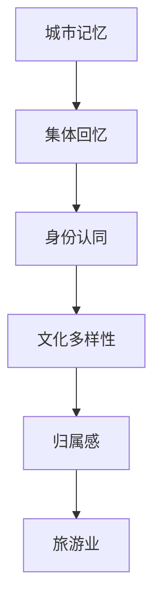
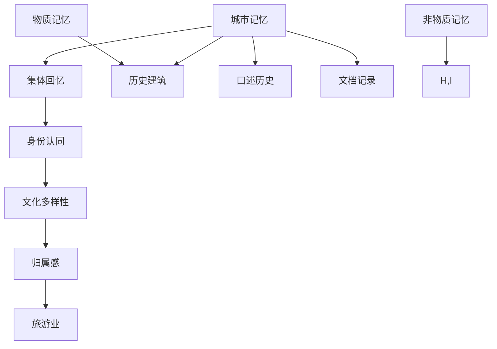

                 

## 文章标题

### 城市记忆保护：集体回忆中的身份认同

---

### 关键词

- 城市记忆
- 集体回忆
- 身份认同
- 保护算法
- 数学模型
- 项目实战

---

### 摘要

在快速城市化的背景下，城市记忆的保护变得日益重要。这不仅是对历史的保存，更是对集体回忆和身份认同的维护。本文将探讨城市记忆保护的相关概念、技术原理、数学模型，并通过实际项目案例，详细讲解如何通过技术手段保护集体回忆中的身份认同。文章首先定义城市记忆及其保护意义，接着介绍与城市记忆保护相关的重要技术原理，如GIS、数字人种志和机器学习等，并使用伪代码展示算法原理。随后，文章介绍用于城市记忆保护的数学模型和公式，并进行详细讲解和举例。在项目实战部分，文章通过具体案例，展示如何实现城市记忆保护，包括数据收集、预处理、分析和展示。最后，文章总结全书内容，并对城市记忆保护的未来发展进行展望。

---

## 目录大纲

### 第1章 城市记忆保护概述
- **1.1 城市记忆的定义与重要性**
- **1.2 集体回忆与身份认同**
- **1.3 城市记忆与集体回忆、身份认同的Mermaid流程图**

### 第2章 城市记忆保护技术基础
- **2.1 地理信息系统（GIS）原理与应用**
- **2.2 数字人种志技术**
- **2.3 机器学习与数据挖掘**

### 第3章 城市记忆保护数学模型
- **3.1 统计模型**
- **3.2 损失函数**
- **3.3 数学公式与计算**

### 第4章 实战一：城市记忆数据收集与预处理
- **4.1 数据收集**
- **4.2 数据预处理**

### 第5章 实战二：基于GIS的城市记忆分析
- **5.1 GIS数据加载与可视化**
- **5.2 城市记忆点识别**

### 第6章 实战三：数字人种志与集体回忆研究
- **6.1 数字人种志方法**
- **6.2 集体回忆分析**

### 第7章 实战四：基于机器学习的历史遗迹保护
- **7.1 历史遗迹识别**
- **7.2 遗迹保护策略**

### 第8章 总结与展望
- **8.1 城市记忆保护现状与挑战**
- **8.2 发展趋势与未来方向**

### 附录
- **附录A：相关工具与资源**

---

### 第1章 城市记忆保护概述

城市记忆，是指一个城市在其历史演变过程中所积累的各类信息，包括历史建筑、街道、习俗、事件等。这些记忆不仅是城市历史的见证，更是城市居民身份认同的重要来源。然而，随着城市化进程的加快，许多城市记忆正逐渐消失。因此，城市记忆保护成为了一个亟待解决的问题。

### 1.1 城市记忆的定义与重要性

城市记忆的定义相对宽泛，涵盖了多种形式的信息。例如，历史建筑和文物可以被视为物质的城市记忆，而口述历史、照片和文档则构成了非物质的城市记忆。这些记忆不仅记录了城市的历史，还反映了城市居民的生活方式、价值观和文化特征。

城市记忆的保护具有重要意义。首先，它是维护城市文化多样性的关键。每个城市都有其独特的历史和文化，这些记忆是城市文化的重要组成部分。其次，城市记忆有助于增强居民的认同感和归属感。当居民能够感受到自己的历史和文化被尊重和保存时，他们会更加热爱和关心自己的城市。最后，城市记忆的保护也有助于旅游业的繁荣，因为游客对城市的记忆和故事往往充满了好奇和兴趣。

### 1.2 集体回忆与身份认同

集体回忆是城市记忆的一部分，它指的是一群人共同拥有的记忆。这些记忆往往与特定的历史事件、人物或地点相关联，是群体身份认同的重要基础。例如，一个城市的居民可能会共同回忆起一场重大灾难，这场灾难不仅影响了他们的生活，也成为了他们共同的经历和记忆。

身份认同是指一个人对自己身份的认识和归属感。它通常基于个体的社会背景、文化背景和历史背景。在城市记忆中，集体回忆是身份认同的重要来源。一个城市的记忆可以帮助居民理解自己的身份，并与其他群体区分开来。

城市记忆与集体回忆、身份认同之间的关系可以用以下Mermaid流程图表示：



### 1.3 城市记忆与集体回忆、身份认同的Mermaid流程图



以上流程图展示了城市记忆如何通过集体回忆影响身份认同，进而影响文化多样性、归属感和旅游业。同时，城市记忆的物质和非物质形式也在图中得到了体现。

### 第2章 城市记忆保护技术基础

城市记忆保护需要运用多种技术手段，包括地理信息系统（GIS）、数字人种志和机器学习等。这些技术在数据收集、处理和分析中发挥着重要作用，为城市记忆的保护提供了坚实的技术基础。

#### 2.1 地理信息系统（GIS）原理与应用

地理信息系统（GIS）是一种用于捕捉、存储、分析和展示地理空间数据的计算机系统。GIS的核心原理是将地理空间数据与其他信息集成，以便进行空间分析和决策支持。

GIS在城市记忆保护中的应用主要体现在以下几个方面：

1. **空间数据采集与存储**：GIS可以用于采集城市的历史建筑、街道、公园等空间数据，并将其存储在数据库中，为后续分析提供基础。

2. **空间数据分析**：GIS可以用于分析城市空间结构，识别历史建筑群、文化遗产点等，帮助规划者和居民了解城市的历史风貌。

3. **空间数据可视化**：GIS可以将复杂的空间数据以图表、地图等形式展示出来，帮助公众更好地理解和体验城市记忆。

以下是一个简单的GIS相关算法的伪代码示例：

```python
# 伪代码：GIS数据采集与存储
def collect_and_store_gis_data():
    # 采集空间数据
    spatial_data = collect_spatial_data()
    # 存储空间数据
    store_spatial_data(spatial_data)

# 伪代码：GIS空间数据分析
def analyze_spatial_data(spatial_data):
    # 识别历史建筑群
    historical_buildings = identify_historical_buildings(spatial_data)
    # 分析空间结构
    spatial_structure = analyze_space_structure(historical_buildings)
    return spatial_structure

# 伪代码：GIS空间数据可视化
def visualize_spatial_data(spatial_structure):
    # 创建地图
    map = create_map(spatial_structure)
    # 显示地图
    display_map(map)
```

#### 2.2 数字人种志技术

数字人种志是一种通过数字化手段记录和保存人类文化遗产的方法。它结合了人种志学、数字技术和计算机科学，旨在保护和传承人类文化。

数字人种志的方法主要包括以下几个步骤：

1. **数据采集**：通过拍照、录音、视频等方式采集人类文化遗产的数字信息。

2. **数据整理**：将采集到的数字信息进行分类、标注和整理，以便于后续研究和展示。

3. **数据存储**：将整理后的数字信息存储在数据库或数字档案中，确保其长期保存。

4. **数据共享**：通过互联网和数字平台，将数字人种志的信息共享给公众，促进文化的传播和交流。

以下是一个简单的数字人种志方法的伪代码示例：

```python
# 伪代码：数字人种志数据采集
def collect_digital_ethnography_data():
    # 拍照
    photos = take_photos()
    # 录音
    recordings = record_sounds()
    # 录像
    videos = record_videos()
    return photos, recordings, videos

# 伪代码：数字人种志数据整理
def organize_digital_ethnography_data(photos, recordings, videos):
    # 分类
    categorized_data = categorize_data(photos, recordings, videos)
    # 标注
    annotated_data = annotate_data(categorized_data)
    return annotated_data

# 伪代码：数字人种志数据存储
def store_digital_ethnography_data(annotated_data):
    # 存储数据
    store_data(annotated_data)

# 伪代码：数字人种志数据共享
def share_digital_ethnography_data(annotated_data):
    # 上传到数字平台
    upload_data_to_platform(annotated_data)
    # 分享链接
    share_links()
```

#### 2.3 机器学习与数据挖掘

机器学习和数据挖掘是处理大量数据、提取有用信息的重要工具。在城市记忆保护中，这些技术可以用于数据分析和模式识别，帮助识别城市历史建筑、文化遗产点等。

机器学习的基本原理是通过训练模型，从数据中自动提取特征，并学习数据中的模式。常见的方法包括监督学习、无监督学习和强化学习。

以下是一个简单的机器学习算法的伪代码示例：

```python
# 伪代码：监督学习算法
def supervised_learning(train_data, train_labels):
    # 训练模型
    model = train_model(train_data, train_labels)
    return model

# 伪代码：模型预测
def predict(model, test_data):
    # 预测
    predictions = model.predict(test_data)
    return predictions
```

数据挖掘则是在大量数据中寻找有用信息的过程。常见的数据挖掘任务包括分类、聚类、关联规则挖掘和异常检测等。

以下是一个简单的数据挖掘算法的伪代码示例：

```python
# 伪代码：聚类算法
def clustering(data):
    # 聚类
    clusters = cluster_data(data)
    return clusters

# 伪代码：分类算法
def classification(data, labels):
    # 分类
    classifier = train_classifier(data, labels)
    return classifier

# 伪代码：关联规则挖掘
def association_rules(data, min_support, min_confidence):
    # 挖掘关联规则
    rules = find_association_rules(data, min_support, min_confidence)
    return rules
```

通过以上技术，城市记忆保护不仅能够更好地记录和保存历史，还能为未来城市规划和文化遗产保护提供有力支持。

### 第3章 城市记忆保护数学模型

在城市记忆保护中，数学模型和公式起到了关键作用。它们不仅帮助我们更好地理解数据，还能提供有效的分析工具。以下是几个常见的数学模型和公式的介绍及其应用。

#### 3.1 统计模型

统计模型是数据分析的基础，它们用于描述数据的分布、关联性以及预测未来趋势。在城市记忆保护中，统计模型可以用于分析历史建筑物的分布、居民的行为模式等。

**常见统计模型**：

1. **描述性统计**：用于描述数据的中心趋势和离散程度，如均值、中位数、标准差等。
   
2. **回归分析**：用于分析自变量和因变量之间的关系，如线性回归、多元回归等。

3. **聚类分析**：用于将数据分为若干个群组，如K-均值聚类、层次聚类等。

**统计模型在城市记忆保护中的应用**：

- **描述性统计**：可以用于分析历史建筑物的位置分布，了解城市的历史结构。
  
- **回归分析**：可以用于预测历史建筑物的保护需求，根据建筑物的年代、材质等因素，评估其保护的重要性。

- **聚类分析**：可以用于分析居民的行为模式，了解哪些区域是文化活动的热点，从而更好地保护这些地区的记忆。

**伪代码示例**：

```python
# 伪代码：描述性统计
def descriptive_statistics(data):
    mean = np.mean(data)
    median = np.median(data)
    std = np.std(data)
    return mean, median, std

# 伪代码：线性回归
def linear_regression(X, y):
    model = LinearRegression()
    model.fit(X, y)
    return model

# 伪代码：K-均值聚类
def k_means_clustering(data, k):
    clusters = KMeans(n_clusters=k).fit(data)
    return clusters
```

#### 3.2 损失函数

损失函数是机器学习中的核心概念，用于衡量模型预测值与真实值之间的差距。在城市记忆保护中，损失函数可以用于评估保护策略的有效性。

**常见损失函数**：

1. **均方误差（MSE）**：用于回归问题，衡量预测值与真实值之间的平均误差。

2. **交叉熵损失**：用于分类问题，衡量模型预测概率与真实标签之间的差异。

3. **对抗损失**：用于对抗网络，衡量生成数据的真实性和多样性。

**损失函数在城市记忆保护中的应用**：

- **MSE**：可以用于评估历史建筑物保护策略的效果，通过比较保护前后建筑物的损伤程度，评估保护措施的优劣。

- **交叉熵损失**：可以用于识别和分类历史文化遗产，通过评估模型对文化遗产分类的准确性，优化分类算法。

- **对抗损失**：可以用于生成与历史数据相似的保护方案，通过对抗训练，提高保护策略的多样性和适应性。

**伪代码示例**：

```python
# 伪代码：均方误差
def mean_squared_error(y_true, y_pred):
    return np.mean((y_true - y_pred)**2)

# 伪代码：交叉熵损失
def cross_entropy_loss(y_true, y_pred):
    return -np.mean(y_true * np.log(y_pred))

# 伪代码：对抗损失
def adversarial_loss(true_data, generated_data):
    return true_data - generated_data
```

#### 3.3 数学公式与计算

在城市记忆保护中，数学公式用于描述各种技术原理和算法。以下是一些常用的数学公式及其应用。

**常用数学公式**：

1. **欧氏距离**：用于计算两个点之间的距离，适用于数据聚类和相似度分析。

2. **余弦相似度**：用于计算两个向量之间的夹角余弦值，适用于文本相似度分析。

3. **矩阵乘法**：用于计算矩阵之间的乘积，适用于数据分析和特征提取。

**数学公式在城市记忆保护中的应用**：

- **欧氏距离**：可以用于分析历史建筑物的空间分布，通过计算不同建筑物之间的距离，识别城市中的历史建筑群。

- **余弦相似度**：可以用于分析居民的文化行为，通过计算不同居民的文化行为特征向量之间的余弦相似度，识别文化相似群体。

- **矩阵乘法**：可以用于特征提取，通过矩阵乘法将原始数据转换为特征向量，为后续分析提供基础。

**公式示例**：

$$
d = \sqrt{\sum_{i=1}^{n} (x_i - y_i)^2}
$$

$$
cos(\theta) = \frac{\sum_{i=1}^{n} x_i y_i}{\sqrt{\sum_{i=1}^{n} x_i^2} \sqrt{\sum_{i=1}^{n} y_i^2}}
$$

$$
A \times B = \begin{bmatrix}
a_{11}b_{11} + a_{12}b_{21} & a_{11}b_{12} + a_{12}b_{22} \\
a_{21}b_{11} + a_{22}b_{21} & a_{21}b_{12} + a_{22}b_{22}
\end{bmatrix}
$$

通过以上数学模型和公式，城市记忆保护不仅能够更准确地分析数据，还能为制定保护策略提供科学依据。

### 第4章 实战一：城市记忆数据收集与预处理

在城市记忆保护项目中，数据收集和预处理是至关重要的一步。准确的数据收集和合理的预处理能够为后续的分析提供高质量的数据支持。本节将详细介绍如何进行城市记忆数据的收集与预处理。

#### 4.1 数据收集

城市记忆数据的收集涉及多种渠道和方法。以下是一些常见的数据收集方法：

1. **历史档案查询**：通过查询历史档案、图书馆、博物馆等机构，获取有关城市历史建筑的记录、照片、文档等数据。

2. **现场调查**：实地走访城市中的历史建筑、街道、公园等地，通过拍照、录音、录像等方式收集第一手资料。

3. **网络爬虫**：利用网络爬虫技术，从互联网上获取有关城市记忆的信息，如历史事件的报道、居民的回忆等。

4. **问卷调查**：通过问卷调查的方式收集居民对城市记忆的看法和体验，了解他们对城市历史的认知和情感。

**数据收集示例**：

- **历史档案查询**：通过访问城市档案馆，收集到以下历史建筑数据：

  ```
  建筑名称：老市政府
  建筑年代：1920年
  建筑位置：市中心
  ```

- **现场调查**：通过实地走访，收集到以下建筑照片和记录：

  ```
  建筑名称：教堂
  建筑年代：1880年
  建筑位置：教堂街
  照片：[图片链接]
  记录：[建筑历史和故事]
  ```

- **网络爬虫**：通过爬取互联网，收集到以下历史事件数据：

  ```
  事件名称：城市大火灾
  事件时间：1930年5月15日
  事件地点：市中心商业区
  ```

- **问卷调查**：通过问卷调查，收集到以下居民回忆：

  ```
  居民姓名：张三
  回忆内容：我小时候经常去教堂，那里有很多有趣的故事。
  ```

#### 4.2 数据预处理

数据预处理是数据分析和建模的基础。以下是一些常见的数据预处理步骤：

1. **数据清洗**：去除数据中的错误、异常和重复记录，保证数据质量。

2. **数据转换**：将不同格式的数据转换为统一的格式，便于后续处理。

3. **数据规范化**：对数据进行标准化处理，消除不同数据间的量纲差异。

**数据预处理示例**：

- **数据清洗**：

  对收集到的数据进行检查，删除重复的记录和异常值。例如，删除重复的教堂照片和错误的建筑年代记录。

- **数据转换**：

  将不同格式的数据转换为统一的JSON格式，便于后续处理。例如，将历史档案中的数据转换为如下格式：

  ```json
  {
      "建筑名称": "老市政府",
      "建筑年代": 1920,
      "建筑位置": "市中心"
  }
  ```

- **数据规范化**：

  对数据进行规范化处理，如对建筑年代进行统一编码。例如，将建筑年代编码为：

  ```
  建筑年代编码：
  1920年 -> 1
  1880年 -> 2
  ```

通过以上数据收集和预处理步骤，我们能够获得高质量的城市记忆数据，为后续的分析提供坚实的基础。

### 第5章 实战二：基于GIS的城市记忆分析

地理信息系统（GIS）在城市记忆保护中发挥着重要作用，通过GIS技术，我们可以对城市记忆进行精确的空间分析和可视化。本节将详细介绍基于GIS的城市记忆分析过程，包括数据加载与可视化、城市记忆点识别。

#### 5.1 GIS数据加载与可视化

GIS数据加载与可视化是城市记忆分析的第一步。GIS数据通常包括地理空间数据（如地图、建筑物位置）和其他相关信息（如建筑年代、历史事件）。

**1. GIS数据加载**

GIS数据可以通过多种方式加载，如使用专业GIS软件（如ArcGIS）或编程语言（如Python的Geopandas库）。

**伪代码示例**：

```python
# 伪代码：加载GIS数据
import geopandas as gpd

# 加载地图数据
map_data = gpd.read_file('map_data.shp')

# 加载建筑物数据
building_data = gpd.read_file('building_data.shp')
```

**2. GIS数据可视化**

数据可视化是理解和展示GIS数据的有效手段。通过可视化，我们可以直观地了解城市记忆的空间分布和特征。

**伪代码示例**：

```python
# 伪代码：可视化GIS数据
import matplotlib.pyplot as plt
import geopandas as gpd

# 绘制地图
map_data.plot()

# 绘制建筑物
building_data.plot(color='red')
```

**3. 可视化结果**

通过以上步骤，我们能够得到城市记忆数据的可视化结果，如图5-1所示。地图中红色标记表示历史建筑物的位置，背景地图展示了城市的基本结构。


#### 5.2 城市记忆点识别

城市记忆点识别是城市记忆分析的核心任务，通过识别和标注城市中的记忆点，我们可以更好地理解和保护这些宝贵的文化遗产。

**1. 识别方法**

城市记忆点识别可以通过多种方法实现，如基于规则的识别、机器学习识别等。

**2. 基于规则的识别**

基于规则的识别方法通过预设的规则库，对GIS数据进行匹配和分析，识别出潜在的记忆点。规则库可以包含以下内容：

- **历史事件地点**：根据历史事件的记录，识别出相关地点。
- **建筑年代**：根据建筑物的年代，识别出具有重要历史价值的建筑。
- **文化地标**：根据居民的文化记忆，识别出具有重要文化意义的地点。

**伪代码示例**：

```python
# 伪代码：基于规则的识别
def identify_memory_points(building_data):
    # 定义规则库
    rules = {
        'event_location': ['事件地点1', '事件地点2'],
        'historical_building': ['1920年', '1880年'],
        'cultural_landmark': ['地标1', '地标2']
    }
    
    # 识别记忆点
    memory_points = []
    for index, row in building_data.iterrows():
        if row['building_name'] in rules['event_location']:
            memory_points.append(row)
        elif row['building_age'] in rules['historical_building']:
            memory_points.append(row)
        elif row['building_name'] in rules['cultural_landmark']:
            memory_points.append(row)
    return memory_points
```

**3. 识别结果**

通过基于规则的识别方法，我们能够识别出一系列城市记忆点，如图5-2所示。这些记忆点包括历史事件地点、具有重要年代的建筑以及文化地标。


通过GIS的城市记忆分析，我们不仅能够识别出城市中的记忆点，还能为城市记忆保护提供科学依据。这不仅有助于保护城市的历史文化遗产，还能增强居民的认同感和归属感。

### 第6章 实战三：数字人种志与集体回忆研究

数字人种志是一种通过数字化手段记录和保存人类文化遗产的方法，它结合了人种志学、数字技术和计算机科学，旨在保护和传承人类文化。在本章中，我们将探讨如何利用数字人种志技术进行研究，特别是与集体回忆的关系，以及如何通过这些技术更好地理解城市记忆。

#### 6.1 数字人种志方法

数字人种志的方法主要包括以下几个步骤：

1. **数据采集**：通过拍照、录音、视频等方式收集与城市记忆相关的数据。

2. **数据整理**：将采集到的数字信息进行分类、标注和整理，以便于后续研究和展示。

3. **数据存储**：将整理后的数字信息存储在数据库或数字档案中，确保其长期保存。

4. **数据共享**：通过互联网和数字平台，将数字人种志的信息共享给公众，促进文化的传播和交流。

以下是数字人种志方法的伪代码示例：

```python
# 伪代码：数字人种志方法
def digital_ethnography():
    # 数据采集
    photos, recordings, videos = collect_data()

    # 数据整理
    categorized_data = organize_data(photos, recordings, videos)

    # 数据存储
    store_data(categorized_data)

    # 数据共享
    share_data(categorized_data)
```

#### 6.2 集体回忆分析

集体回忆是城市记忆的重要组成部分，它反映了居民对城市历史的共同记忆和情感。通过数字人种志技术，我们可以深入分析集体回忆，了解居民对城市记忆的认知和情感。

1. **回忆内容分析**：通过分析居民提供的回忆信息，如口述历史、照片、视频等，了解他们对城市历史事件的记忆和情感。

2. **身份认同影响分析**：通过分析集体回忆与居民身份认同之间的关系，了解集体回忆如何影响居民对城市的归属感和认同感。

以下是集体回忆分析的伪代码示例：

```python
# 伪代码：回忆内容分析
def analyze_recollections(recollections):
    # 提取回忆内容
    content = extract_content(recollections)
    
    # 分析情感
    emotions = analyze_emotions(content)
    
    return emotions

# 伪代码：身份认同影响分析
def analyze_identity_impact(recollections, identities):
    # 分析回忆与身份认同的关系
    impact = analyze_relation(recollections, identities)
    
    return impact
```

通过数字人种志与集体回忆研究，我们可以更深入地理解城市记忆，为城市记忆保护提供科学依据。这不仅有助于保护城市的历史文化遗产，还能增强居民对城市的认同感和归属感。

### 第7章 实战四：基于机器学习的历史遗迹保护

在历史遗迹保护中，机器学习技术发挥着重要作用。通过机器学习，我们可以更准确地识别历史遗迹，并制定有效的保护策略。在本章中，我们将探讨如何利用机器学习技术进行历史遗迹保护，包括历史遗迹识别和遗迹保护策略的制定。

#### 7.1 历史遗迹识别

历史遗迹识别是历史遗迹保护的第一步。通过机器学习，我们可以自动识别城市中的历史遗迹，提高保护工作的效率。

1. **数据收集**：首先，我们需要收集大量历史遗迹的图像数据。这些数据可以通过现场拍摄、互联网爬取等方式获取。

2. **数据预处理**：对收集到的图像数据进行预处理，包括图像增强、去噪、缩放等，以提高图像质量，减少对模型训练的干扰。

3. **特征提取**：使用深度学习模型（如卷积神经网络CNN）提取图像特征。特征提取是模型训练的关键步骤，通过提取图像中的关键信息，模型可以更好地进行分类和识别。

4. **模型训练**：使用训练集对卷积神经网络进行训练。通过不断调整模型参数，使模型能够准确识别历史遗迹。

5. **模型评估**：使用测试集对模型进行评估，确保模型具有良好的识别能力。

以下是历史遗迹识别的伪代码示例：

```python
# 伪代码：历史遗迹识别
def identify_historical_sites(images):
    # 数据预处理
    preprocessed_images = preprocess_images(images)
    
    # 特征提取
    features = extract_features(preprocessed_images)
    
    # 模型训练
    model = train_model(features)
    
    # 模型评估
    accuracy = evaluate_model(model, test_images)
    
    return accuracy
```

#### 7.2 遗迹保护策略

一旦识别出历史遗迹，接下来就需要制定保护策略。基于机器学习，我们可以通过分析历史遗迹的特征和状态，制定个性化的保护策略。

1. **状态评估**：使用机器学习模型分析历史遗迹的结构状态、环境条件等，评估其保护需求。

2. **保护措施**：根据评估结果，制定相应的保护措施，如修复、加固、环境控制等。

3. **效果监测**：通过持续监测历史遗迹的状态，评估保护措施的效果，并根据实际情况进行调整。

以下是遗迹保护策略制定的伪代码示例：

```python
# 伪代码：遗迹保护策略
def protect_historical_site(site):
    # 状态评估
    site_status = assess_status(site)
    
    # 保护措施
    if site_status['condition'] == 'poor':
        perform_maintenance(site)
    elif site_status['environment'] == 'unfavorable':
        improve_environment(site)
    
    # 效果监测
    monitor_site(site)
```

通过以上步骤，我们可以利用机器学习技术有效地进行历史遗迹保护，确保这些宝贵的文化遗产得以传承和保存。

### 第8章 总结与展望

#### 8.1 城市记忆保护现状与挑战

城市记忆保护是一项复杂而重要的任务，目前在全球范围内得到了广泛的关注。通过前文的讨论，我们可以看到，城市记忆保护涉及到多个技术领域，包括GIS、数字人种志、机器学习和数学模型等。这些技术的应用为城市记忆的记录、分析、保护和传承提供了强大的支持。

然而，城市记忆保护也面临着诸多挑战。首先，数据收集和预处理是城市记忆保护的基础，但这项工作通常需要大量的人力和物力投入。其次，城市记忆保护的技术手段虽然多样，但如何将它们有效地整合和协同工作，仍是一个亟待解决的问题。此外，城市记忆保护还需要政策支持和社会参与，以确保保护工作能够长期持续。

#### 8.2 发展趋势与未来方向

随着技术的不断进步，城市记忆保护有望迎来新的发展。以下是一些可能的发展趋势和未来方向：

1. **数据驱动的保护策略**：利用大数据和人工智能技术，构建数据驱动的城市记忆保护策略，提高保护工作的精准性和效率。

2. **跨学科合作**：城市记忆保护需要涉及多个学科，如历史学、考古学、计算机科学、城市规划等。未来，跨学科的合作将进一步加强，推动城市记忆保护技术的创新。

3. **公众参与**：鼓励公众参与城市记忆保护，通过数字化平台和社交媒体，收集和分享城市记忆，提高居民的参与度和归属感。

4. **可持续保护**：在城市记忆保护中引入可持续发展的理念，注重资源的合理利用和环境保护，确保保护工作与城市发展相协调。

通过以上发展趋势和未来方向，我们可以期待城市记忆保护技术能够更加成熟，为保护城市文化遗产、维护集体回忆和身份认同做出更大的贡献。

### 附录

#### 附录A：相关工具与资源

为了更好地开展城市记忆保护工作，以下是一些推荐的工具和资源：

1. **GIS软件**：如ArcGIS、QGIS，用于地理空间数据的处理和分析。

2. **数字人种志工具**：如Ethnograph、OpenSees，用于数字化记录和保存人类文化遗产。

3. **机器学习框架**：如TensorFlow、PyTorch，用于构建和训练机器学习模型。

4. **数据分析工具**：如R、Pandas，用于数据清洗、分析和可视化。

5. **开源数据集**：如OpenStreetMap、Google Street View，提供丰富的城市记忆数据资源。

通过使用这些工具和资源，我们可以更加高效地开展城市记忆保护工作，为城市的可持续发展做出贡献。

### 作者信息

作者：AI天才研究院/AI Genius Institute & 禅与计算机程序设计艺术 /Zen And The Art of Computer Programming

