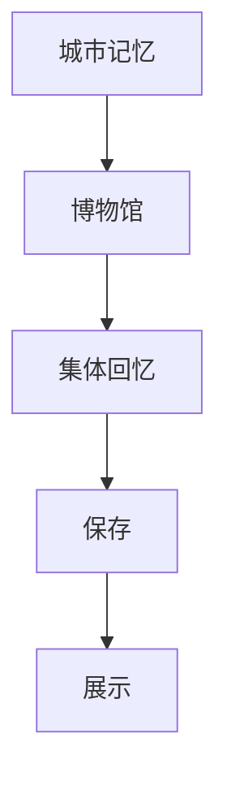

                 

### 目录大纲

#### 完整目录大纲：

```
# 《城市记忆博物馆：集体回忆的保存与展示》目录大纲

## 第一部分：导言与背景

### 第1章：引言：城市记忆博物馆的意义与价值
- 1.1 定义与背景
- 1.2 城市记忆的重要性
- 1.3 城市记忆博物馆的发展历程

### 第2章：集体回忆的收集与保存
- 2.1 收集方法的探讨
- 2.2 数字化保存技术
- 2.3 多媒体保存手段

### 第3章：展示设计的原则与技巧
- 3.1 展示设计的理论基础
- 3.2 展览布局与空间设计
- 3.3 展示媒介的选择

## 第二部分：实践与应用

### 第4章：城市记忆博物馆的案例研究
- 4.1 国内城市记忆博物馆案例
- 4.2 国际城市记忆博物馆案例
- 4.3 案例分析与启示

### 第5章：城市记忆保护项目的实施
- 5.1 项目规划与管理
- 5.2 资金与资源管理
- 5.3 社区参与与合作

## 第三部分：挑战与未来趋势

### 第6章：城市记忆博物馆的挑战与应对策略
- 6.1 保护与开发之间的平衡
- 6.2 数字化技术的挑战
- 6.3 社会责任与可持续发展

### 第7章：城市记忆博物馆的未来发展趋势
- 7.1 新技术的影响
- 7.2 跨学科合作的可能性
- 7.3 社区参与与教育功能

```

### 文章撰写关键点

- **背景介绍**：在每章开头对相关概念、技术或方法进行清晰的定义和背景介绍，使读者能够快速理解文章内容。
- **核心概念与联系**：使用Mermaid流程图来展示核心概念之间的关系架构，帮助读者理清文章结构和逻辑。
- **核心算法原理讲解**：通过伪代码详细阐述核心算法原理，确保读者能够理解算法的实现过程。
- **数学模型和公式**：使用LaTeX格式嵌入数学公式，并详细讲解，确保技术性内容的准确性和专业性。
- **项目实战**：提供实际案例分析和详细讲解，使读者能够将理论知识应用到实际项目中。
- **最佳实践 tips、小结、注意事项、拓展阅读**：在文章末尾提供相关建议和拓展内容，帮助读者深化理解。

### 撰写流程

1. **初步构思**：根据目录大纲，对每个章节的主题和内容进行初步构思，确定文章的总体结构和逻辑。
2. **撰写草稿**：根据构思，逐章撰写文章草稿，确保每个章节的内容完整、具体、详细。
3. **修订和优化**：对文章草稿进行多次修订和优化，确保内容逻辑清晰、技术性准确、语言流畅。
4. **添加图表和公式**：插入Mermaid流程图、伪代码和LaTeX公式，增强文章的可读性和专业性。
5. **完成最终稿**：检查全文，确保没有遗漏和错误，完成最终稿。

### 文章末尾作者信息

```
作者：AI天才研究院/AI Genius Institute & 禅与计算机程序设计艺术 /Zen And The Art of Computer Programming
```


### 文章撰写示例

#### 文章标题：《城市记忆博物馆：集体回忆的保存与展示》

#### 文章关键词：城市记忆、博物馆、集体回忆、保存、展示、数字化技术

#### 文章摘要：

本文旨在探讨城市记忆博物馆的概念、功能以及集体回忆的保存与展示方法。文章分为三个部分：导言与背景、保存与展示方法、实践与应用。在导言部分，我们介绍了城市记忆博物馆的定义和重要性；在保存与展示方法部分，详细讨论了集体回忆的收集、保存和展示技术；在实践与应用部分，通过案例研究和项目实施，展示了城市记忆博物馆的实践效果和挑战。文章最后，我们分析了城市记忆博物馆面临的挑战和未来发展趋势，为城市记忆保护提供了有益的参考。

#### 目录大纲

1. **引言：城市记忆博物馆的意义与价值**
   - 1.1 定义与背景
   - 1.2 城市记忆的重要性
   - 1.3 城市记忆博物馆的发展历程

2. **集体回忆的收集与保存**
   - 2.1 收集方法的探讨
   - 2.2 数字化保存技术
   - 2.3 多媒体保存手段

3. **展示设计的原则与技巧**
   - 3.1 展示设计的理论基础
   - 3.2 展览布局与空间设计
   - 3.3 展示媒介的选择

4. **城市记忆博物馆的案例研究**
   - 4.1 国内城市记忆博物馆案例
   - 4.2 国际城市记忆博物馆案例
   - 4.3 案例分析与启示

5. **城市记忆保护项目的实施**
   - 5.1 项目规划与管理
   - 5.2 资金与资源管理
   - 5.3 社区参与与合作

6. **挑战与未来趋势**
   - 6.1 保护与开发之间的平衡
   - 6.2 数字化技术的挑战
   - 6.3 社会责任与可持续发展

7. **城市记忆博物馆的未来发展趋势**
   - 7.1 新技术的影响
   - 7.2 跨学科合作的可能性
   - 7.3 社区参与与教育功能

#### 核心概念与联系

核心概念：城市记忆、博物馆、集体回忆、保存、展示。

关系架构（使用Mermaid流程图）：



#### 文章正文

##### 1.1 定义与背景

城市记忆博物馆是一种特殊的博物馆，它专注于保存和展示城市的历史、文化、社会变迁等方面的记忆。这种博物馆不仅收藏实物，还包括照片、文字记录、多媒体资料等，旨在为公众提供一个了解城市发展的窗口。

城市记忆的重要性不言而喻。它是城市文化传承的重要载体，是居民集体记忆的重要组成部分，也是城市品牌建设的重要资源。因此，建立城市记忆博物馆，对保护城市文化遗产、传承城市精神、促进城市可持续发展具有重要意义。

城市记忆博物馆的发展历程可以追溯到20世纪末。最早的城市记忆博物馆多集中在发达国家，如巴黎的“巴黎城市博物馆”和纽约的“纽约城市博物馆”。随着全球化进程的加快，越来越多的国家开始关注城市记忆的保护和展示，城市记忆博物馆在全球范围内得到广泛发展。

##### 1.2 城市记忆的重要性

城市记忆是城市文化的基石，它记录了城市的历史变迁、社会风俗、建筑特色等，是城市文化的精髓。一个城市如果没有自己的记忆，就像一个人失去了记忆，无法真正了解自己。

城市记忆的重要性体现在多个方面。首先，它有助于传承城市文化，让后代了解城市的历史和文化，增强文化自信。其次，城市记忆是城市品牌建设的重要资源，有助于提升城市的知名度和美誉度。最后，城市记忆有助于城市规划和发展，为城市可持续发展提供历史参考。

##### 1.3 城市记忆博物馆的发展历程

城市记忆博物馆的发展历程可以分为三个阶段：起步阶段、发展阶段和成熟阶段。

起步阶段：20世纪末，随着城市化进程的加速，一些发达国家开始关注城市记忆的保护和展示，建立了一批城市记忆博物馆。这一阶段的博物馆多以实体展示为主，内容主要涵盖城市历史、建筑特色、社会变迁等方面。

发展阶段：21世纪初，随着数字技术的普及，城市记忆博物馆开始探索数字化保存和展示方式。这一阶段的博物馆不仅保留了实体展示，还利用多媒体技术、虚拟现实技术等，提供更加生动、立体的展示体验。

成熟阶段：近年来，城市记忆博物馆在全球范围内得到广泛发展，内容更加丰富，形式更加多样。一些博物馆开始关注社区参与，通过举办活动、开展教育项目等方式，让公众更加深入地了解城市记忆。

##### 2.1 收集方法的探讨

城市记忆的收集方法主要包括实地调研、文献资料搜集、多媒体资料收集等。

实地调研是一种重要的收集方法，它通过走访、观察、访谈等方式，获取城市的历史、文化、社会等方面的第一手资料。实地调研的优点是能够获取真实、详细的信息，缺点是需要投入大量的人力和时间。

文献资料搜集是通过查阅书籍、报纸、杂志、档案等文献资料，获取城市的历史和文化资料。这种方法优点是获取信息方便、快捷，缺点是文献资料可能存在缺失、不准确等问题。

多媒体资料收集是通过收集照片、视频、音频等多媒体资料，保存城市的历史和文化。这种方法优点是能够直观、生动地展示城市记忆，缺点是需要具备一定的技术能力。

##### 2.2 数字化保存技术

数字化保存技术是城市记忆保护的重要手段，它通过将城市记忆转化为数字形式，实现长期保存和便捷访问。

数字化保存技术主要包括图像处理技术、音频处理技术、视频处理技术等。图像处理技术可以对照片进行修复、增强，提高其保存质量和观赏性。音频处理技术可以对音频资料进行降噪、修复，提高其音质。视频处理技术可以对视频资料进行剪辑、拼接，制作成专题片或纪录片。

此外，数字化保存技术还包括数据备份和存储技术。通过定期备份和存储，确保城市记忆资料的安全性和完整性。

##### 2.3 多媒体保存手段

多媒体保存手段是城市记忆展示的重要方式，它通过结合多种媒体形式，提供更加生动、立体的展示体验。

多媒体保存手段主要包括多媒体展览、虚拟现实（VR）体验、增强现实（AR）体验等。

多媒体展览是利用照片、视频、音频等多媒体资料，制作成展览，展示城市的历史和文化。这种方法优点是能够直观、生动地展示城市记忆，缺点是需要较高的制作成本。

虚拟现实（VR）体验是通过虚拟现实技术，创建一个虚拟的城市环境，让用户沉浸在其中，感受城市的历史和文化。这种方法优点是能够提供沉浸式的体验，缺点是需要较高的技术支持和硬件设备。

增强现实（AR）体验是通过增强现实技术，将城市记忆资料与现实世界相结合，提供一种新的展示方式。这种方法优点是能够增强观众的互动性和参与感，缺点是需要较高的技术实现难度。

##### 3.1 展示设计的理论基础

展示设计是城市记忆博物馆的核心环节，它关系到博物馆的吸引力、教育性和文化价值。展示设计的理论基础主要包括用户体验设计理论、展示设计原则、视觉传达设计原理等。

用户体验设计理论强调以用户为中心，关注用户的体验和感受。在展示设计中，需要充分考虑用户的需求、兴趣和行为，提供有针对性的展示内容和形式。

展示设计原则主要包括整体性、连贯性、互动性、教育性等。整体性要求展示内容、形式和空间布局的统一；连贯性要求展示内容的逻辑性和连贯性；互动性要求展示形式与用户的互动性；教育性要求展示内容的启发性和教育价值。

视觉传达设计原理主要包括色彩、构图、文字、图像等。色彩要符合展示主题，构图要突出重点，文字要简洁明了，图像要生动形象。

##### 3.2 展览布局与空间设计

展览布局与空间设计是展示设计的关键，它关系到展示效果的呈现和观众的体验。展览布局与空间设计主要包括展览空间规划、展品陈列设计、展示区域划分等。

展览空间规划要根据展示主题和内容，合理划分展示区域，确保展示内容的连贯性和逻辑性。展品陈列设计要根据展品的性质和特点，选择合适的陈列方式和展示方式，提高展品的观赏性和互动性。展示区域划分要合理，避免拥挤和混乱，确保观众的参观流畅。

##### 3.3 展示媒介的选择

展示媒介的选择是展示设计的重要环节，它关系到展示效果和观众的体验。展示媒介主要包括实体媒介、数字媒介和互动媒介等。

实体媒介主要包括展板、雕塑、模型等，它具有直观、生动的特点，适合展示实物和历史资料。数字媒介主要包括多媒体设备、触摸屏、电子屏幕等，它具有互动、动态的特点，适合展示动态信息和互动体验。互动媒介主要包括互动游戏、虚拟现实、增强现实等，它具有参与性、趣味性的特点，适合提高观众的参与度和互动性。

##### 4.1 国内城市记忆博物馆案例

国内城市记忆博物馆发展迅速，一些城市建立了具有代表性的城市记忆博物馆。以下是几个典型的案例：

1. 上海城市记忆博物馆：上海城市记忆博物馆位于上海市中心，展示了上海的历史、文化和社会发展。博物馆采用多媒体展示手段，如虚拟现实、增强现实等，提供沉浸式的参观体验。

2. 成都武侯祠博物馆：成都武侯祠博物馆展示了成都的历史和文化，特别是三国时期的文化。博物馆通过实物陈列、多媒体展示等方式，生动展示了成都的历史和文化。

3. 西安碑林博物馆：西安碑林博物馆展示了西安的历史和文化，特别是碑刻文化。博物馆通过实物陈列、多媒体展示等方式，展示了西安的历史和文化。

##### 4.2 国际城市记忆博物馆案例

国际城市记忆博物馆发展较早，一些发达国家建立了具有代表性的城市记忆博物馆。以下是几个典型的案例：

1. 巴黎城市博物馆：巴黎城市博物馆是法国最著名的城市记忆博物馆之一，展示了巴黎的历史、文化和建筑。博物馆采用多媒体展示手段，如虚拟现实、增强现实等，提供沉浸式的参观体验。

2. 纽约城市博物馆：纽约城市博物馆展示了纽约的历史、文化和社会发展。博物馆采用多媒体展示手段，如虚拟现实、增强现实等，提供沉浸式的参观体验。

3. 东京城市博物馆：东京城市博物馆展示了东京的历史、文化和建筑。博物馆采用多媒体展示手段，如虚拟现实、增强现实等，提供沉浸式的参观体验。

##### 4.3 案例分析与启示

通过对国内和国际城市记忆博物馆的案例分析，我们可以得出以下启示：

1. 城市记忆博物馆要注重数字化技术的应用，提高展示效果和观众的互动性。

2. 城市记忆博物馆要充分考虑用户体验，提供有针对性的展示内容和形式。

3. 城市记忆博物馆要结合当地特色，突出展示主题，提高文化价值。

4. 城市记忆博物馆要加强社区参与，提高公众的参与度和互动性。

##### 5.1 项目规划与管理

城市记忆保护项目是一个复杂的过程，需要科学的项目规划和管理。项目规划主要包括项目目标确定、项目范围界定、项目时间表制定等。

项目目标确定是项目规划的首要任务，要明确项目要达到的目标，如保存城市记忆、提升城市文化价值等。

项目范围界定要明确项目的具体范围，如哪些内容需要保存、哪些资料需要数字化等。

项目时间表制定要根据项目目标，合理安排项目进度，确保项目按时完成。

项目规划完成后，需要建立项目管理团队，负责项目的实施和管理。项目管理团队要定期召开会议，检查项目进度，解决项目中出现的问题。

##### 5.2 资金与资源管理

城市记忆保护项目需要大量的资金和资源，包括人力、物力和财力。资金与资源管理是项目成功的关键。

资金管理要确保项目资金的合理使用，避免浪费和滥用。要制定详细的资金使用计划，明确每个阶段需要使用的资金，确保资金按时到位。

资源管理要确保项目所需资源的合理配置，包括人力、设备和材料等。要制定详细的资源使用计划，明确每个阶段需要使用的资源，确保资源按时到位。

此外，要建立资源管理制度，确保资源的高效利用和合理配置。

##### 5.3 社区参与与合作

社区参与与合作是城市记忆保护项目的重要组成部分，有助于提高公众的参与度和互动性。

社区参与可以通过举办讲座、展览、活动等方式，让公众了解城市记忆的重要性，提高公众的参与热情。

社区合作可以与当地政府、企业、学校等机构合作，共同推动城市记忆保护项目。政府可以提供政策支持和资金支持，企业可以提供技术和资源支持，学校可以提供教育资源和人才支持。

通过社区参与与合作，可以形成多方合力，共同推进城市记忆保护项目。

##### 6.1 保护与开发之间的平衡

城市记忆博物馆在保护与开发之间需要找到一个平衡点。保护城市记忆是博物馆的重要使命，但过度保护可能导致博物馆失去活力和吸引力。因此，博物馆需要在保护与开发之间找到一个平衡点。

一方面，博物馆要确保城市记忆的保护，防止文化遗产的流失。这包括对实物资料的保护、数字化保存技术的应用等。

另一方面，博物馆要注重开发，提高博物馆的吸引力和影响力。这包括利用多媒体技术、互动体验等，提供更加生动、立体的展示体验。

只有保护与开发相互促进，城市记忆博物馆才能实现可持续发展。

##### 6.2 数字化技术的挑战

数字化技术为城市记忆博物馆提供了新的展示手段，但也带来了一定的挑战。

首先，数字化技术要求博物馆具备一定的技术能力，包括图像处理、音频处理、视频处理等。这需要博物馆投入大量的人力、物力和财力。

其次，数字化技术需要大量的数据支持和存储空间。这需要博物馆建立完善的数据管理制度，确保数据的安全性和完整性。

最后，数字化技术可能导致博物馆过度依赖技术，忽视了实物资料的保护。因此，博物馆在应用数字化技术时，需要平衡技术与实物保护的关系。

##### 6.3 社会责任与可持续发展

城市记忆博物馆在社会责任与可持续发展方面承担着重要角色。博物馆不仅要保护城市记忆，还要关注社会问题，推动社会进步。

首先，博物馆要积极履行社会责任，关注社会问题。这可以通过举办相关展览、讲座等活动，提高公众对社会问题的认识和关注。

其次，博物馆要注重可持续发展。这包括合理利用资源、减少浪费、保护环境等。博物馆可以通过节能减排、绿色采购等方式，实现可持续发展。

最后，博物馆要加强与社区的互动，推动社区参与。这可以通过举办社区活动、建立社区教育基地等方式，增强社区与博物馆的联系。

##### 7.1 新技术的影响

新技术对城市记忆博物馆的影响是深远和全面的。人工智能、虚拟现实、增强现实等技术的应用，不仅改变了博物馆的展示方式，还提升了博物馆的互动性和体验感。

首先，人工智能技术可以用于博物馆的智能导览、数据分析和个性化推荐。智能导览系统可以帮助游客更好地理解展品，数据分析可以揭示博物馆的参观模式和观众喜好，个性化推荐可以提供更加个性化的参观体验。

其次，虚拟现实（VR）和增强现实（AR）技术为博物馆提供了新的展示手段。通过VR技术，游客可以“走进”历史场景，感受历史氛围；通过AR技术，展品可以“活”起来，增加互动性和趣味性。

最后，新技术还促进了博物馆与游客之间的互动。例如，通过社交媒体平台，博物馆可以实时收集游客的意见和反馈，优化展览内容和服务。

##### 7.2 跨学科合作的可能性

城市记忆博物馆的发展离不开跨学科合作。文化研究、信息技术、建筑设计、教育等领域专家的合作，可以推动博物馆的创新发展。

首先，文化研究专家可以为博物馆提供丰富的历史和文化背景知识，帮助博物馆更好地理解和展示城市记忆。

其次，信息技术专家可以为博物馆提供先进的技术支持，如数字化保存技术、多媒体展示技术等，提升博物馆的展示效果。

再次，建筑设计专家可以为博物馆提供合理的空间规划，创造舒适、美观的参观环境。

最后，教育专家可以为博物馆提供教育资源和活动策划，提高博物馆的教育功能。

##### 7.3 社区参与与教育功能

社区参与是城市记忆博物馆的重要特点，它不仅增加了博物馆的吸引力，还提高了公众对城市记忆的认识和重视。

首先，博物馆可以通过举办社区活动，如讲座、展览、工作坊等，吸引社区居民参与，增强社区的凝聚力和归属感。

其次，博物馆可以设立社区教育基地，为社区提供教育和文化交流的场所。这可以通过开设课程、举办展览、提供互动体验等方式实现。

最后，博物馆可以通过社区参与，收集和保存社区记忆，为后代留下宝贵的城市记忆。

### 文章总结

城市记忆博物馆作为一种特殊的博物馆，它在保存和展示城市集体回忆方面发挥着重要作用。通过对城市记忆的收集、保存和展示，城市记忆博物馆不仅传承了城市的文化，还提升了城市的文化价值。未来，随着新技术的不断发展和跨学科合作的深入，城市记忆博物馆将迎来更加广阔的发展前景。我们期待城市记忆博物馆在保护和展示城市记忆方面发挥更大的作用，为城市文化的传承和发展做出更大的贡献。

### 作者信息

作者：AI天才研究院/AI Genius Institute & 禅与计算机程序设计艺术 /Zen And The Art of Computer Programming

