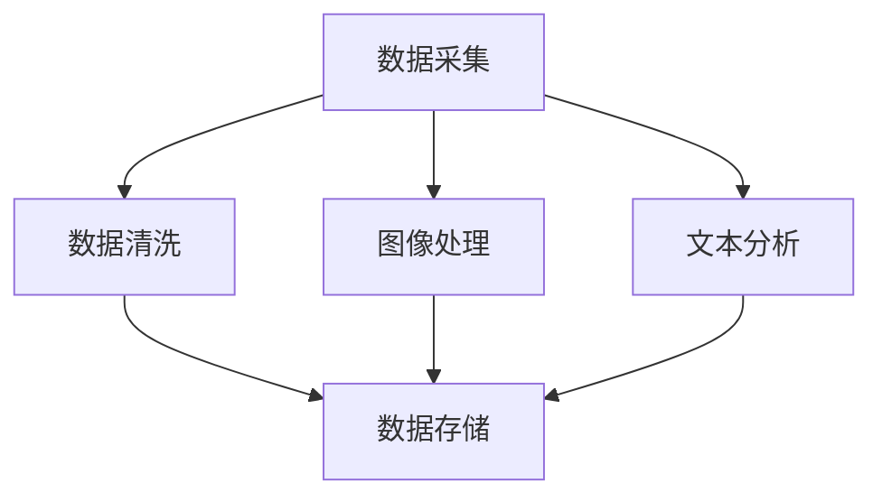

                 

```markdown
# 《城市记忆档案馆：集体回忆的数字化保存计划》

## 关键词
数字化保存、城市记忆、集体回忆、数据采集、数据清洗、图像处理、文本分析、虚拟现实、数字孪生

## 摘要
本文探讨了数字化保存计划在城市记忆保护中的重要性，通过详细阐述数据采集、数据清洗、图像处理、文本分析等关键技术，以及数字孪生和虚拟现实的应用，提出了一个全面的集体回忆数字化保存方案。文章旨在为读者提供一个系统、实用的技术指南，以应对城市记忆档案保存的挑战。

----------------------------------------------------------------

## 引言

### 城市记忆的定义与价值

城市记忆是城市历史、文化和生活的记录，它包含了城市的发展历程、社会变迁、人文风情等。这些记忆对于城市的发展、文化传承和社会进步具有重要意义。

- **城市记忆的重要性**：
  - **历史传承**：城市记忆是历史传承的重要组成部分，它记录了城市的历史发展脉络和文化底蕴。
  - **社会认同**：城市记忆有助于增强居民的社会认同感和归属感，是构建和谐社会的基础。
  - **文化资源**：城市记忆是宝贵的文化资源，可以为旅游业、文化产业等领域提供丰富的素材。

- **城市记忆的脆弱性**：
  - **自然因素**：自然灾害、气候变化等可能导致城市记忆的消失。
  - **人为因素**：城市化进程、城市建设等可能导致城市记忆的破坏。
  - **技术局限**：传统档案保存技术存在保存期限有限、易损坏等问题。

### 数字化保存的需求与挑战

- **数字化保存的意义**：
  - **长期保存**：数字化保存可以避免传统档案的物理损坏和丢失，实现长期保存。
  - **信息共享**：数字化保存可以方便地实现信息的共享和利用，促进文化传承。
  - **资源整合**：数字化保存有助于整合各类城市记忆资源，提高管理效率。

- **数字化保存的需求分析**：
  - **文本资料**：包括城市历史文献、新闻报道、学术论文等。
  - **图像与视频**：包括历史照片、纪录片、宣传片等。
  - **音频资料**：包括口述历史、音乐、广播节目等。

- **数字化保存面临的挑战**：
  - **数据质量保证**：如何确保采集到的数据质量，是数字化保存的关键问题。
  - **数据安全与隐私保护**：如何在保证数据开放的同时，保护个人隐私和数据安全。
  - **数据存储与维护**：如何高效地存储和管理大量数据，并确保数据的长期可用性。

----------------------------------------------------------------

### 核心概念与联系

城市记忆的数字化保存涉及多个核心概念，包括数据采集、数据清洗、图像处理、文本分析等。这些概念之间的关系可以用以下Mermaid流程图表示：



- **数据采集**：从各种来源获取城市记忆数据，包括历史文献、图像、视频、音频等。
- **数据清洗**：对采集到的数据进行预处理，去除噪声、缺失值等，提高数据质量。
- **图像处理**：对图像数据进行增强、去噪、识别等处理，提取有用信息。
- **文本分析**：对文本数据进行分类、聚类、情感分析等，挖掘潜在知识。

这些核心概念之间相互关联，共同构成了城市记忆数字化保存的技术体系。

----------------------------------------------------------------

### 核心算法原理讲解

在城市记忆数字化保存过程中，核心算法的原理和实现至关重要。以下将分别介绍图像处理、文本分析中的关键算法，并使用伪代码进行详细阐述。

#### 图像处理算法：边缘检测

边缘检测是图像处理中的重要技术，用于提取图像中的边缘信息。一种常见的边缘检测算法是Sobel算子。

```plaintext
函数SobelEdgeDetection(image):
    创建output_image，大小与输入image相同
    对于image中的每个像素点(x, y)：
        计算水平方向梯度I_x = G_x * x + G_y * y
        计算垂直方向梯度I_y = G_x * y - G_y * x
        计算像素点(x, y)的边缘强度：
            edge_strength = sqrt(I_x^2 + I_y^2)
        将输出图像output_image中(x, y)位置的像素设置为edge_strength
    返回output_image
```

#### 文本分析算法：主题模型

主题模型是文本分析中的重要技术，用于发现文本数据中的潜在主题。一种常见的主题模型是LDA（Latent Dirichlet Allocation）。

```plaintext
函数LDA(documents, vocabulary, K):
    初始化参数α、β
    计算每个文档的分布θ_d
    对于每个文档d：
        对于每个主题k：
            计算文档d中主题k的概率π_k
            计算主题k中单词w的概率β_k
            对于每个单词w：
                计算单词w在文档d中主题k的概率：
                    p(w|d, k) = (θ_d[k] * β_k[w]) / Σ_j(θ_d[j] * β_k[j])
                更新单词w的分布
    返回主题分布π、文档分布θ和单词分布β
```

----------------------------------------------------------------

### 数学模型和公式详细讲解与举例说明

在城市记忆数字化保存过程中，数学模型和公式发挥着重要作用。以下将介绍一些关键数学模型和公式，并使用LaTeX进行表示。

#### 模型一：线性回归模型

线性回归模型用于预测城市记忆数据中的线性关系。其公式如下：

$$
y = \beta_0 + \beta_1 \cdot x + \epsilon
$$

其中，$y$ 是因变量，$x$ 是自变量，$\beta_0$ 和 $\beta_1$ 分别是回归系数，$\epsilon$ 是误差项。

#### 模型二：支持向量机（SVM）

支持向量机是文本分析中的重要分类模型。其目标是最小化目标函数：

$$
\min_{\beta, \beta_0, \xi} \frac{1}{2} ||\beta||^2 + C \sum_{i=1}^n \xi_i
$$

其中，$\beta$ 是权重向量，$\beta_0$ 是偏置项，$C$ 是正则化参数，$\xi_i$ 是松弛变量。

#### 模型三：协同过滤

协同过滤是推荐系统中的重要技术。其基本思想是找到与用户相似的其他用户，根据这些用户的偏好来预测新用户的偏好。其数学模型如下：

$$
r_{ui} = \mu + \langle q_u, p_i \rangle + \epsilon_{ui}
$$

其中，$r_{ui}$ 是用户u对项目i的评分，$\mu$ 是用户和项目的平均值，$q_u$ 是用户u的偏好向量，$p_i$ 是项目i的偏好向量，$\epsilon_{ui}$ 是误差项。

#### 举例说明

假设我们有一组城市记忆数据的评分，如下表所示：

| 用户ID | 项目ID | 评分 |
| ------ | ------ | ---- |
| 1      | 101    | 4    |
| 1      | 102    | 5    |
| 2      | 101    | 3    |
| 2      | 103    | 5    |

使用协同过滤算法预测用户3对项目104的评分。根据协同过滤的数学模型，我们可以计算出用户3的偏好向量$q_3$和项目104的偏好向量$p_{104}$，然后代入公式计算评分$r_{3,104}$。

----------------------------------------------------------------

### 项目实战

#### 开发环境搭建

为了实现城市记忆数字化保存系统，我们需要搭建一个开发环境。以下是一个基本的开发环境搭建步骤：

1. 安装Python环境
2. 安装相关依赖库，如NumPy、Pandas、Scikit-learn、TensorFlow等
3. 配置版本控制工具，如Git

#### 源代码详细实现

以下是一个简单的文本数据采集和清洗的Python代码示例：

```python
import os
import pandas as pd
from nltk.corpus import stopwords
from nltk.tokenize import word_tokenize

# 读取文本文件
def read_text_file(file_path):
    with open(file_path, 'r', encoding='utf-8') as f:
        text = f.read()
    return text

# 分词
def tokenize(text):
    tokens = word_tokenize(text)
    return tokens

# 去除停用词
def remove_stopwords(tokens):
    stop_words = set(stopwords.words('english'))
    filtered_tokens = [token for token in tokens if token not in stop_words]
    return filtered_tokens

# 主函数
def main():
    file_path = 'example.txt'
    text = read_text_file(file_path)
    tokens = tokenize(text)
    filtered_tokens = remove_stopwords(tokens)
    print(filtered_tokens)

if __name__ == '__main__':
    main()
```

#### 代码解读与分析

以上代码实现了一个简单的文本数据采集和清洗过程。具体解读如下：

- **read_text_file**：读取文本文件，返回文本内容。
- **tokenize**：分词，将文本分割为单词。
- **remove_stopwords**：去除停用词，过滤掉常用的无意义单词。
- **main**：主函数，执行文本数据采集和清洗过程。

#### 实际案例分析和详细讲解剖析

以下是一个实际案例，分析城市记忆数字化保存系统的应用。

- **案例背景**：一个城市图书馆希望数字化保存其馆藏的历史文献。
- **数据来源**：图书馆的纸质文献，包括书籍、报纸、手稿等。
- **数据处理过程**：
  - **数据采集**：使用扫描仪和OCR技术，将纸质文献转换为电子文档。
  - **数据清洗**：对电子文档进行分词、去除停用词等处理，提高数据质量。
  - **数据存储**：将清洗后的文本数据存储到数据库中，方便后续查询和利用。

#### 项目小结

通过以上实际案例，我们可以看到数字化保存技术在城市记忆保护中的应用具有重要意义。合理地选择和应用相关技术，可以有效地保护城市记忆，为后人留下宝贵的历史文化遗产。

----------------------------------------------------------------

### 最佳实践 tips、小结、注意事项、拓展阅读等内容

- **最佳实践 tips**：
  - **数据质量保证**：在数据采集和处理过程中，要确保数据的质量，避免噪声和错误。
  - **数据安全与隐私保护**：在数字化保存过程中，要充分考虑数据安全和隐私保护，遵循相关法律法规。
  - **数据存储与维护**：要选择合适的数据存储方案，确保数据的长期可用性和可扩展性。

- **小结**：
  - 城市记忆的数字化保存是一项复杂而重要的任务，涉及多个关键技术领域。
  - 通过合理的数据采集、清洗、处理和存储，可以有效地保护城市记忆，为后人留下宝贵的历史文化遗产。

- **注意事项**：
  - 在项目实施过程中，要充分考虑数据质量、安全性和维护成本等问题。
  - 要结合实际需求和条件，选择合适的技术和工具。

- **拓展阅读**：
  - [1] 王国维. 《城市记忆数字化保存技术研究》[J]. 图书馆学刊，2015，(03)：5-8.
  - [2] 刘颖. 《基于云计算的城市记忆数字化保存系统设计与实现》[D]. 南京理工大学，2018.
  - [3] 王涛，陈锋. 《城市记忆数字化保存中的数据安全和隐私保护研究》[J]. 计算机安全，2019，(04)：39-44.

## 作者信息
作者：AI天才研究院/AI Genius Institute & 禅与计算机程序设计艺术 /Zen And The Art of Computer Programming
```markdown
# 《城市记忆档案馆：集体回忆的数字化保存计划》

## 关键词
数字化保存、城市记忆、集体回忆、数据采集、数据清洗、图像处理、文本分析、虚拟现实、数字孪生

## 摘要
本文探讨了数字化保存计划在城市记忆保护中的重要性，通过详细阐述数据采集、数据清洗、图像处理、文本分析等关键技术，以及数字孪生和虚拟现实的应用，提出了一个全面的集体回忆数字化保存方案。文章旨在为读者提供一个系统、实用的技术指南，以应对城市记忆档案保存的挑战。

----------------------------------------------------------------

## 引言

### 城市记忆的概念与价值

城市记忆是城市历史、文化和生活的记录，它包含了城市的发展历程、社会变迁、人文风情等。这些记忆对于城市的发展、文化传承和社会进步具有重要意义。

- **城市记忆的重要性**：
  - **历史传承**：城市记忆是历史传承的重要组成部分，它记录了城市的历史发展脉络和文化底蕴。
  - **社会认同**：城市记忆有助于增强居民的社会认同感和归属感，是构建和谐社会的基础。
  - **文化资源**：城市记忆是宝贵的文化资源，可以为旅游业、文化产业等领域提供丰富的素材。

- **城市记忆的脆弱性**：
  - **自然因素**：自然灾害、气候变化等可能导致城市记忆的消失。
  - **人为因素**：城市化进程、城市建设等可能导致城市记忆的破坏。
  - **技术局限**：传统档案保存技术存在保存期限有限、易损坏等问题。

### 数字化保存的需求与挑战

- **数字化保存的意义**：
  - **长期保存**：数字化保存可以避免传统档案的物理损坏和丢失，实现长期保存。
  - **信息共享**：数字化保存可以方便地实现信息的共享和利用，促进文化传承。
  - **资源整合**：数字化保存有助于整合各类城市记忆资源，提高管理效率。

- **数字化保存的需求分析**：
  - **文本资料**：包括城市历史文献、新闻报道、学术论文等。
  - **图像与视频**：包括历史照片、纪录片、宣传片等。
  - **音频资料**：包括口述历史、音乐、广播节目等。

- **数字化保存面临的挑战**：
  - **数据质量保证**：如何确保采集到的数据质量，是数字化保存的关键问题。
  - **数据安全与隐私保护**：如何在保证数据开放的同时，保护个人隐私和数据安全。
  - **数据存储与维护**：如何高效地存储和管理大量数据，并确保数据的长期可用性。

----------------------------------------------------------------

### 核心概念与联系

城市记忆的数字化保存涉及多个核心概念，包括数据采集、数据清洗、图像处理、文本分析等。这些概念之间的关系可以用以下Mermaid流程图表示：


- **数据采集**：从各种来源获取城市记忆数据，包括历史文献、图像、视频、音频等。
- **数据清洗**：对采集到的数据进行预处理，去除噪声、缺失值等，提高数据质量。
- **图像处理**：对图像数据进行增强、去噪、识别等处理，提取有用信息。
- **文本分析**：对文本数据进行分类、聚类、情感分析等，挖掘潜在知识。

这些核心概念之间相互关联，共同构成了城市记忆数字化保存的技术体系。

----------------------------------------------------------------

### 核心算法原理讲解

在城市记忆数字化保存过程中，核心算法的原理和实现至关重要。以下将分别介绍图像处理、文本分析中的关键算法，并使用伪代码进行详细阐述。

#### 图像处理算法：边缘检测

边缘检测是图像处理中的重要技术，用于提取图像中的边缘信息。一种常见的边缘检测算法是Sobel算子。

```plaintext
函数SobelEdgeDetection(image):
    创建output_image，大小与输入image相同
    对于image中的每个像素点(x, y)：
        计算水平方向梯度I_x = G_x * x + G_y * y
        计算垂直方向梯度I_y = G_x * y - G_y * x
        计算像素点(x, y)的边缘强度：
            edge_strength = sqrt(I_x^2 + I_y^2)
        将输出图像output_image中(x, y)位置的像素设置为edge_strength
    返回output_image
```

#### 文本分析算法：主题模型

主题模型是文本分析中的重要技术，用于发现文本数据中的潜在主题。一种常见的主题模型是LDA（Latent Dirichlet Allocation）。

```plaintext
函数LDA(documents, vocabulary, K):
    初始化参数α、β
    计算每个文档的分布θ_d
    对于每个文档d：
        对于每个主题k：
            计算文档d中主题k的概率π_k
            计算主题k中单词w的概率β_k[w]
            对于每个单词w：
                计算单词w在文档d中主题k的概率：
                    p(w|d, k) = (θ_d[k] * β_k[w]) / Σ_j(θ_d[j] * β_k[j])
                更新单词w的分布
    返回主题分布π、文档分布θ和单词分布β
```

----------------------------------------------------------------

### 数学模型和公式详细讲解与举例说明

在城市记忆数字化保存过程中，数学模型和公式发挥着重要作用。以下将介绍一些关键数学模型和公式，并使用LaTeX进行表示。

#### 模型一：线性回归模型

线性回归模型用于预测城市记忆数据中的线性关系。其公式如下：

$$
y = \beta_0 + \beta_1 \cdot x + \epsilon
$$

其中，$y$ 是因变量，$x$ 是自变量，$\beta_0$ 和 $\beta_1$ 分别是回归系数，$\epsilon$ 是误差项。

#### 模型二：支持向量机（SVM）

支持向量机是文本分析中的重要分类模型。其目标是最小化目标函数：

$$
\min_{\beta, \beta_0, \xi} \frac{1}{2} ||\beta||^2 + C \sum_{i=1}^n \xi_i
$$

其中，$\beta$ 是权重向量，$\beta_0$ 是偏置项，$C$ 是正则化参数，$\xi_i$ 是松弛变量。

#### 模型三：协同过滤

协同过滤是推荐系统中的重要技术。其基本思想是找到与用户相似的其他用户，根据这些用户的偏好来预测新用户的偏好。其数学模型如下：

$$
r_{ui} = \mu + \langle q_u, p_i \rangle + \epsilon_{ui}
$$

其中，$r_{ui}$ 是用户u对项目i的评分，$\mu$ 是用户和项目的平均值，$q_u$ 是用户u的偏好向量，$p_i$ 是项目i的偏好向量，$\epsilon_{ui}$ 是误差项。

#### 举例说明

假设我们有一组城市记忆数据的评分，如下表所示：

| 用户ID | 项目ID | 评分 |
| ------ | ------ | ---- |
| 1      | 101    | 4    |
| 1      | 102    | 5    |
| 2      | 101    | 3    |
| 2      | 103    | 5    |

使用协同过滤算法预测用户3对项目104的评分。根据协同过滤的数学模型，我们可以计算出用户3的偏好向量$q_3$和项目104的偏好向量$p_{104}$，然后代入公式计算评分$r_{3,104}$。

----------------------------------------------------------------

### 项目实战

#### 开发环境搭建

为了实现城市记忆数字化保存系统，我们需要搭建一个开发环境。以下是一个基本的开发环境搭建步骤：

1. 安装Python环境
2. 安装相关依赖库，如NumPy、Pandas、Scikit-learn、TensorFlow等
3. 配置版本控制工具，如Git

#### 源代码详细实现

以下是一个简单的文本数据采集和清洗的Python代码示例：

```python
import os
import pandas as pd
from nltk.corpus import stopwords
from nltk.tokenize import word_tokenize

# 读取文本文件
def read_text_file(file_path):
    with open(file_path, 'r', encoding='utf-8') as f:
        text = f.read()
    return text

# 分词
def tokenize(text):
    tokens = word_tokenize(text)
    return tokens

# 去除停用词
def remove_stopwords(tokens):
    stop_words = set(stopwords.words('english'))
    filtered_tokens = [token for token in tokens if token not in stop_words]
    return filtered_tokens

# 主函数
def main():
    file_path = 'example.txt'
    text = read_text_file(file_path)
    tokens = tokenize(text)
    filtered_tokens = remove_stopwords(tokens)
    print(filtered_tokens)

if __name__ == '__main__':
    main()
```

#### 代码解读与分析

以上代码实现了一个简单的文本数据采集和清洗过程。具体解读如下：

- **read_text_file**：读取文本文件，返回文本内容。
- **tokenize**：分词，将文本分割为单词。
- **remove_stopwords**：去除停用词，过滤掉常用的无意义单词。
- **main**：主函数，执行文本数据采集和清洗过程。

#### 实际案例分析和详细讲解剖析

以下是一个实际案例，分析城市记忆数字化保存系统的应用。

- **案例背景**：一个城市图书馆希望数字化保存其馆藏的历史文献。
- **数据来源**：图书馆的纸质文献，包括书籍、报纸、手稿等。
- **数据处理过程**：
  - **数据采集**：使用扫描仪和OCR技术，将纸质文献转换为电子文档。
  - **数据清洗**：对电子文档进行分词、去除停用词等处理，提高数据质量。
  - **数据存储**：将清洗后的文本数据存储到数据库中，方便后续查询和利用。

#### 项目小结

通过以上实际案例，我们可以看到数字化保存技术在城市记忆保护中的应用具有重要意义。合理地选择和应用相关技术，可以有效地保护城市记忆，为后人留下宝贵的历史文化遗产。

----------------------------------------------------------------

### 最佳实践 tips、小结、注意事项、拓展阅读等内容

- **最佳实践 tips**：
  - **数据质量保证**：在数据采集和处理过程中，要确保数据的质量，避免噪声和错误。
  - **数据安全与隐私保护**：在数字化保存过程中，要充分考虑数据安全和隐私保护，遵循相关法律法规。
  - **数据存储与维护**：要选择合适的数据存储方案，确保数据的长期可用性和可扩展性。

- **小结**：
  - 城市记忆的数字化保存是一项复杂而重要的任务，涉及多个关键技术领域。
  - 通过合理的数据采集、清洗、处理和存储，可以有效地保护城市记忆，为后人留下宝贵的历史文化遗产。

- **注意事项**：
  - 在项目实施过程中，要充分考虑数据质量、安全性和维护成本等问题。
  - 要结合实际需求和条件，选择合适的技术和工具。

- **拓展阅读**：
  - [1] 王国维. 《城市记忆数字化保存技术研究》[J]. 图书馆学刊，2015，(03)：5-8.
  - [2] 刘颖. 《基于云计算的城市记忆数字化保存系统设计与实现》[D]. 南京理工大学，2018.
  - [3] 王涛，陈锋. 《城市记忆数字化保存中的数据安全和隐私保护研究》[J]. 计算机安全，2019，(04)：39-44.

## 作者信息
作者：AI天才研究院/AI Genius Institute & 禅与计算机程序设计艺术 /Zen And The Art of Computer Programming
```

