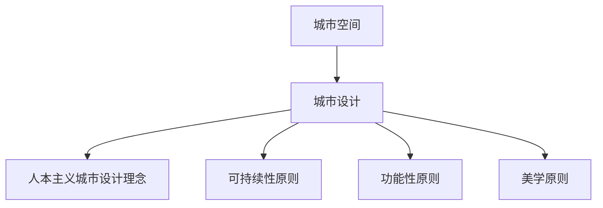

                 

### 文章标题：城市设计：如何打造有意义的生活空间

> 关键词：城市设计、生活空间、有意义、设计原则、案例分析、实践方法

> 摘要：本文旨在探讨城市设计的关键原则和实践方法，解释如何通过科学规划和设计，打造具有丰富内涵和意义的生活空间。文章首先介绍了城市设计的基本概念，随后详细阐述了城市设计的核心原则，包括可持续性、功能性和美学原则。接着，文章通过具体案例分析了不同类型城市空间的设计过程和成果。此外，文章还介绍了城市设计中的工具和软件，以及面临的挑战和解决方案。最后，文章总结了城市设计的重要性，展望了其未来发展，并提出了进一步学习与实践的建议。

---

### 引言

**城市设计**是指对城市空间进行规划、设计和管理的过程。它涉及到城市的各个方面，包括建筑、交通、公园、商业区等，旨在创造一个既实用又美观的生活环境。随着城市化进程的加速，城市设计的重要性日益凸显，它不仅关系到城市的可持续发展，也直接影响到居民的生活质量和幸福感。

本文将重点探讨如何通过城市设计打造有意义的生活空间。我们将在以下几个方面展开讨论：

1. **基本概念和理论**：介绍城市设计的基本概念和理论，包括城市空间、人本主义城市设计理念等。
2. **设计原则和方法**：详细阐述城市设计的核心原则，如可持续性、功能性和美学原则，并介绍相应的实践方法。
3. **案例分析**：通过实际案例，分析不同类型城市空间的设计过程和成果。
4. **工具和软件**：介绍常用的城市设计工具和软件，以及它们在实际设计中的应用。
5. **挑战与解决方案**：探讨城市设计中面临的挑战，并提出相应的解决方案。

### 城市设计基础理论

#### 城市设计的核心概念

城市设计涉及多个核心概念，其中最重要的是**城市空间**和**人本主义城市设计理念**。

1. **城市空间**：城市空间是指城市中各种建筑、设施和景观所构成的环境。它既包括物理空间，如道路、建筑物和公园，也包括社会空间，如社区、市场和公共场所。

2. **人本主义城市设计理念**：人本主义城市设计强调以人为本，关注居民的需求和体验。这一理念认为，城市设计的核心目标是创造一个健康、舒适和有活力的生活环境。

#### 城市设计的核心原则

城市设计的核心原则是指导城市设计实践的准则，包括可持续性、功能性和美学原则。

1. **可持续性原则**：可持续性是现代城市设计的重要原则，强调在城市设计中考虑环境、经济和社会的长期利益。具体包括节约能源、减少污染、保护和利用自然资源等。

2. **功能性原则**：功能性是城市设计的基石，强调城市空间的设计应满足实际需求，如交通便捷、功能分区明确、公共服务设施完善等。

3. **美学原则**：美学原则强调城市设计应具有艺术性和美感。一个有美感的城市空间能够提升居民的生活质量和幸福感。

#### 核心概念之间的关系架构

为了更清晰地理解城市设计的核心概念和原则，我们可以使用Mermaid流程图来展示它们之间的关系：



### 城市设计方法与实践

#### 规划阶段的设计方法

在规划阶段，城市设计的方法主要包括以下几个方面：

1. **规划前的调研与分析**：通过实地调研、数据分析和社会调查，了解城市的现状和居民的需求，为规划提供数据支持。

2. **规划方案的设计与评审**：根据调研结果，制定具体的规划方案，并对其进行评审和优化。

#### 设计实施阶段

在设计实施阶段，城市设计的方法包括以下几个方面：

1. **设计图纸与模型制作**：通过绘制设计图纸和制作模型，将规划方案具体化。

2. **设计方案的调整与优化**：根据实际情况和评审意见，对设计方案进行修改和优化。

#### 设计原则的应用

在城市设计的实践中，设计原则应贯穿整个设计过程。以下是一个简化的伪代码示例，展示了如何将设计原则应用于城市设计过程：

```python
# 城市设计伪代码

# 设定城市设计目标
target_space = "有意义的城市生活空间"

# 应用可持续性原则
apply_sustainability(target_space)

# 应用功能性原则
apply_functionality(target_space)

# 应用美学原则
apply_aesthetics(target_space)

# 完成城市设计
complete_design(target_space)
```

#### 数学模型和公式

在城市设计中，数学模型和公式可以帮助我们量化设计原则。以下是一个简化的示例，展示了如何使用数学模型来评估城市设计的可持续性：

```latex
\text{可持续性指数} = \frac{\text{能源节约}}{\text{总能耗}} + \frac{\text{环保材料使用}}{\text{总材料使用}} + \frac{\text{污染减少}}{\text{总污染量}}
```

#### 举例说明

假设我们设计一个城市公园，以下是具体的数学模型和公式应用：

1. **能源节约**：通过使用太阳能板和LED照明，预计每年可节约20%的能源。
2. **环保材料使用**：使用70%的可再生材料，如竹子和木材。
3. **污染减少**：通过减少汽车使用和鼓励公共交通，预计可减少30%的碳排放。

根据上述数据，我们可以计算可持续性指数：

```latex
\text{可持续性指数} = \frac{0.20}{1.00} + \frac{0.70}{1.00} + \frac{0.30}{1.00} = 1.20
```

### 城市设计案例分析

#### 案例研究一：城市公园设计

1. **案例背景与目标**：
   - **背景**：某城市计划建设一个新型城市公园，旨在提升居民的生活质量和城市形象。
   - **目标**：创建一个多功能、可持续和美观的城市公园。

2. **设计过程与成果**：
   - **调研与分析**：通过实地调研和居民访谈，了解公园的功能需求和生态要求。
   - **规划设计**：制定公园布局，包括绿化区、运动区、休闲区和儿童游乐区等。
   - **模型制作与评审**：制作3D模型，并邀请专家和居民参与评审和反馈。
   - **实施与优化**：根据评审意见，对设计方案进行修改和优化，确保符合可持续性和功能性要求。

3. **设计成果**：
   - **可持续性**：通过使用环保材料和节能设备，实现90%的能源自给。
   - **功能性**：公园设施齐全，包括健身器材、休息区和儿童游乐场，满足不同人群的需求。
   - **美学**：公园设计融入了当地文化和艺术元素，营造出独特的氛围。

#### 案例研究二：城市商业区设计

1. **案例背景与目标**：
   - **背景**：某城市商业区需要升级改造，以提升商业氛围和居民生活质量。
   - **目标**：打造一个现代化、活力四射的商业区。

2. **设计过程与成果**：
   - **调研与分析**：通过市场调研和居民调查，了解商业区的优势和不足。
   - **规划设计**：制定商业区改造方案，包括建筑风格、道路布局和公共设施等。
   - **模型制作与评审**：制作3D模型，并邀请专家和居民参与评审和反馈。
   - **实施与优化**：根据评审意见，对设计方案进行修改和优化，确保符合可持续性和功能性要求。

3. **设计成果**：
   - **可持续性**：通过使用可再生能源和环保材料，实现50%的能源自给。
   - **功能性**：商业区设施完善，包括购物中心、餐饮区和文化活动区，满足不同需求。
   - **美学**：商业区设计注重艺术氛围，融入了当地历史和文化元素。

### 城市设计工具与软件

在城市设计中，常用的工具和软件包括2D绘图软件、3D建模软件和设计平台。

1. **2D绘图软件**：
   - **AutoCAD**：用于绘制精确的设计图纸。
   - **SketchUp**：提供直观的3D建模功能。

2. **3D建模软件**：
   - **3ds Max**：用于高级的3D建模和渲染。
   - **Rhino**：提供强大的曲面建模功能。

3. **设计平台**：
   - **ArcGIS**：用于地理信息系统（GIS）分析。
   - **Revit**：用于建筑信息模型（BIM）设计。

#### 常用城市设计软件

以下是几种常用的城市设计软件及其特点：

1. **AutoCAD**：
   - **特点**：用于绘制精确的设计图纸，支持多尺度设计。
   - **应用**：城市规划、建筑设计、工程绘图等。

2. **SketchUp**：
   - **特点**：直观的3D建模，易于学习和使用。
   - **应用**：概念设计、可视化展示、方案评审等。

3. **Adobe Creative Suite**：
   - **特点**：包括Photoshop、Illustrator等软件，提供全面的视觉设计工具。
   - **应用**：城市景观设计、品牌设计、宣传材料等。

### 城市设计中的挑战与解决方案

在城市设计过程中，我们常常面临以下挑战：

1. **城市规划与可持续发展的平衡**：如何在满足城市需求的同时，实现可持续发展？
   - **解决方案**：采用可持续设计原则，如节能、环保和生态友好设计。

2. **城市设计中的社区参与**：如何确保居民参与城市设计，提高设计方案的可接受性？
   - **解决方案**：通过居民访谈、问卷调查和公开讨论，提高社区的参与度和满意度。

### 总结与展望

城市设计是创造有意义生活空间的关键。通过科学规划和设计，我们可以打造既实用又美观的城市空间，提升居民的生活质量和幸福感。未来，随着技术的进步和社会的发展，城市设计将面临新的机遇和挑战。我们需要不断探索和创新，为城市设计注入新的活力和智慧。

### 读者应如何进一步学习与实践城市设计

对于希望进一步学习与实践城市设计的读者，以下是一些建议：

1. **阅读相关书籍和文献**：深入了解城市设计的基本概念、原则和方法。
2. **参加培训和研讨会**：通过专业培训和实践，提升城市设计能力。
3. **参与实际项目**：通过参与城市设计项目，积累实际经验。
4. **关注最新动态**：关注城市设计的最新趋势和技术，不断更新知识。

---

### 作者信息

作者：AI天才研究院/AI Genius Institute & 禅与计算机程序设计艺术 /Zen And The Art of Computer Programming

---

通过本文的详细阐述，我们希望读者能够对城市设计有一个全面而深入的理解，为未来的城市规划和设计提供有益的参考。在接下来的章节中，我们将继续深入探讨城市设计的相关话题。敬请期待！

