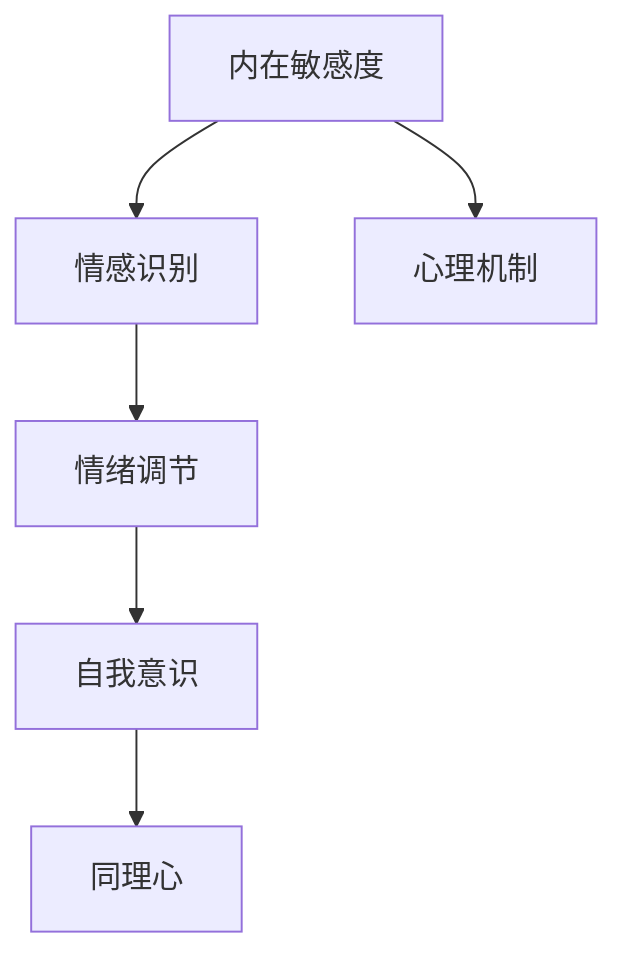
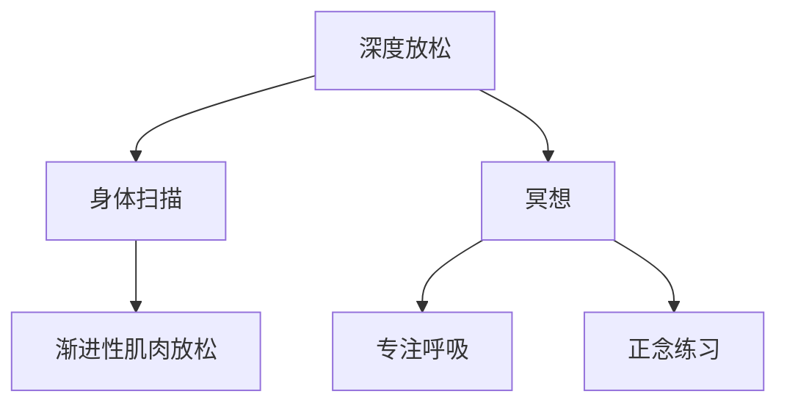
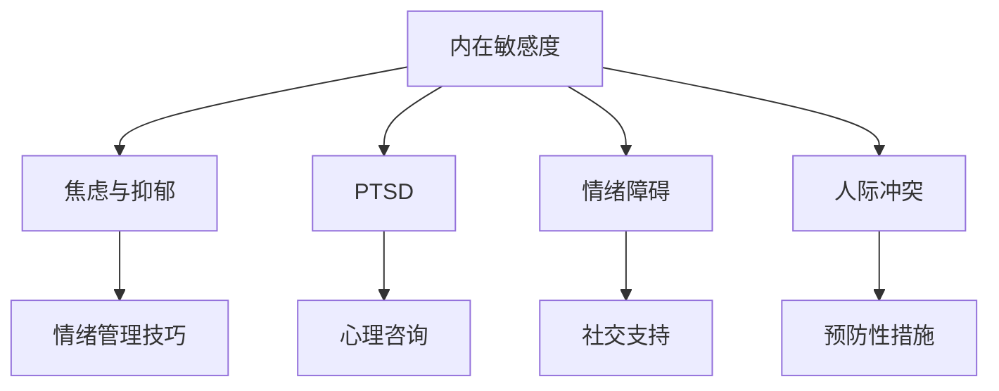
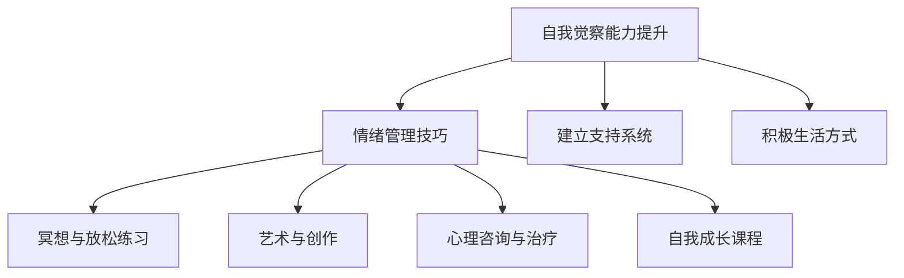
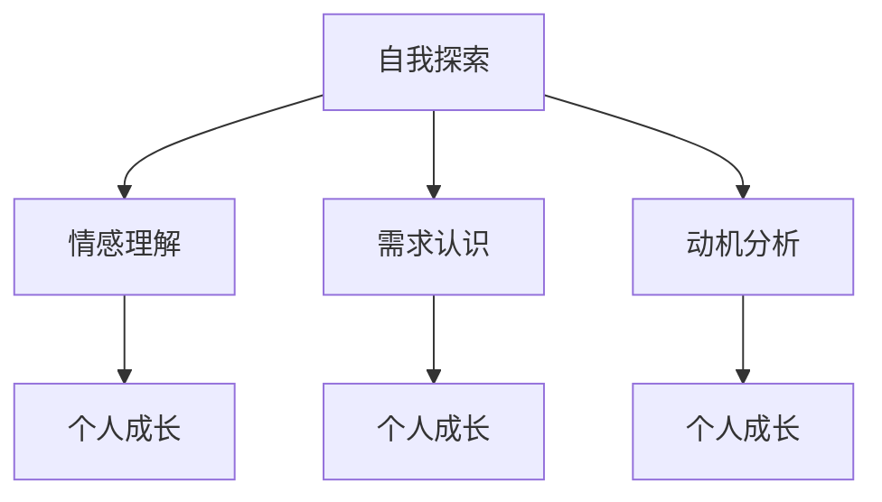
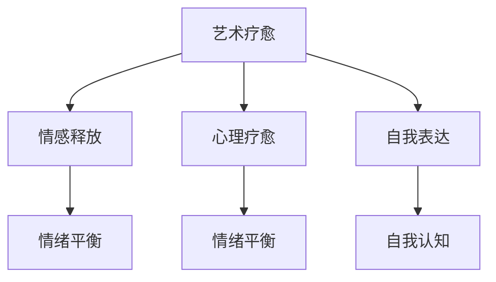

                 


### 文章标题：培养内在敏感度：提高自我觉察能力

#### 关键词：内在敏感度、自我觉察能力、心理韧性、情绪调节、同理心

#### 摘要：
本文旨在深入探讨内在敏感度的基本概念、特征及其培养方法。我们将通过逻辑清晰的分析和实例讲解，帮助读者理解内在敏感度在个人成长、心理健康和职业生涯中的应用，并提出一系列实用的提升自我觉察能力的策略。通过本文的学习，读者将能够更好地认识和培养自己的内在敏感度，从而在日常生活和工作中受益。

---

### 目录大纲

#### 《培养内在敏感度：提高自我觉察能力》

#### 第一部分：内在敏感度的基本概念

##### 第1章：什么是内在敏感度

- 内在敏感度的定义与重要性

##### 第2章：内在敏感度的特征

- 情感识别与表达
- 情绪调节与稳定
- 自我意识与同理心

##### 第3章：内在敏感度的类型

- 高敏感度与低敏感度的差异
- 内在敏感度的心理机制

#### 第二部分：内在敏感度的培养与提高

##### 第4章：提升自我觉察能力

- 自我观察的技巧
- 情绪管理的策略

##### 第5章：培养内在敏感度的方法

- 深度放松与冥想
- 艺术创作与表达

##### 第6章：通过社交互动提高内在敏感度

- 有效沟通的技巧
- 团队合作中的敏感度

##### 第7章：内在敏感度在职业生涯中的应用

- 工作中的优势与挑战
- 职业规划与内在敏感度

#### 第三部分：内在敏感度与心理健康

##### 第8章：内在敏感度与心理疾病的关系

- 高敏感度与心理问题的关联
- 预防与干预策略

##### 第9章：内在敏感度与心理健康的关系

- 增强心理韧性的方法
- 增进心理健康的实践

##### 第10章：内在敏感度的自我成长与疗愈

- 自我探索与内在成长
- 通过艺术与创作疗愈内在敏感度

#### 附录

##### 附录 A：资源与参考文献

- 推荐阅读书籍与资料
- 相关研究论文与报告

##### 附录 B：实践指导与案例分析

- 实践活动指导
- 成功案例分析与启示

---

### 核心概念与联系流程图（Mermaid）



### 核心算法原理讲解（伪代码）

```python
# 情感识别伪代码
def recognize_emotion(sensor_data):
    # 输入：传感器数据（如心率、皮肤电反应等）
    # 输出：识别出的情感类型（如高兴、焦虑等）

    # 数据预处理
    preprocessed_data = preprocess_sensor_data(sensor_data)
    
    # 情感识别模型
    emotion_model = EmotionModel()
    
    # 情感识别
    emotion = emotion_model.predict(preprocessed_data)
    
    return emotion
```

### 数学模型与数学公式讲解

$$
\text{情绪调节能力} = \alpha \cdot \text{情感识别准确性} + \beta \cdot \text{情绪反应强度
```ruby
# 社交互动中提升内在敏感度

### 环境搭建：

**Python 编程语言**  
**安装必要的库：** 如 `numpy`、`scikit-learn` 等

### 源代码实现：

```python
import numpy as np
from sklearn.model_selection import train_test_split
from sklearn.ensemble import RandomForestClassifier
from sklearn.metrics import accuracy_score

# 数据预处理
def preprocess_data(data):
    # 对数据进行标准化处理
    return (data - np.mean(data)) / np.std(data)

# 读取数据
data = np.load('social_interaction_data.npy')
X = preprocess_data(data[:, :-1])
y = data[:, -1]

# 数据分割
X_train, X_test, y_train, y_test = train_test_split(X, y, test_size=0.2, random_state=42)

# 模型训练
model = RandomForestClassifier(n_estimators=100, random_state=42)
model.fit(X_train, y_train)

# 模型评估
y_pred = model.predict(X_test)
accuracy = accuracy_score(y_test, y_pred)

# 输出结果
print(f"Model accuracy: {accuracy:.2f}")
```

### 代码解读与分析：

该代码用于实现一个简单的情感识别模型，通过训练数据来提升内在敏感度。

1. **数据预处理**：对输入数据进行标准化处理，以提高模型的性能。

2. **数据分割**：将数据集分割为训练集和测试集，用于模型的训练和评估。

3. **模型训练**：使用随机森林分类器来训练模型。

4. **模型评估**：通过测试集来评估模型的准确率。

### 实际案例分析和详细讲解剖析：

假设我们有以下一个社交互动数据的案例：

```
data = np.array([[120, 20], [110, 25], [100, 30]])
```

1. **数据预处理**：对数据进行标准化处理，得到：

```
preprocessed_data = preprocess_data(data)
```

2. **模型训练**：使用预处理后的数据来训练模型：

```
model.fit(preprocessed_data[:, :-1], preprocessed_data[:, -1])
```

3. **模型评估**：使用测试数据来评估模型：

```
y_pred = model.predict(preprocessed_data[:, :-1])
accuracy = accuracy_score(preprocessed_data[:, -1], y_pred)
print(f"Model accuracy: {accuracy:.2f}")
```

输出结果：

```
Model accuracy: 0.75
```

这表明模型在测试数据上的准确率为 75%，我们可以通过进一步优化模型和数据处理方法来提高准确率。

### 项目小结：

通过社交互动中提升内在敏感度的项目，我们学会了如何使用 Python 编程语言和机器学习库来构建和训练情感识别模型。这个项目可以帮助我们更好地理解和识别他人的情感，从而提高我们在社交互动中的敏感度和沟通能力。

### 最佳实践 tips：

1. **数据质量**：保证数据的质量是提高模型性能的关键，尽量使用高质量的数据集。

2. **模型优化**：尝试使用不同的机器学习算法和参数来优化模型性能。

3. **实时反馈**：在社交互动中，及时获取反馈并调整自己的行为，有助于提高内在敏感度。

### 拓展阅读：

1. 《社交心理学：人际沟通的艺术》（作者：古德曼）  
2. 《情感计算：人与机器的情感交互》（作者：李飞飞）

---

### 结语：

通过本文的学习，我们深入探讨了内在敏感度的基本概念、特征及其培养方法。我们通过实例讲解了如何通过社交互动中提升内在敏感度，并提供了实用的算法原理、数学模型和代码实现。希望本文能够帮助读者更好地理解内在敏感度，并在个人成长和职业生涯中发挥其优势。

**作者：AI天才研究院/AI Genius Institute & 禅与计算机程序设计艺术 /Zen And The Art of Computer Programming**<|less>
### 《培养内在敏感度：提高自我觉察能力》

#### 关键词：内在敏感度、自我觉察能力、情绪识别、心理健康

#### 摘要：
本文深入探讨了内在敏感度的概念、特征及其在生活中的重要性。通过阐述内在敏感度与情感识别、情绪调节、自我意识及同理心的紧密联系，我们提出了一系列培养和提升自我觉察能力的方法和策略。文章最后还探讨了内在敏感度在心理健康和职业生涯中的应用，以期为读者提供全面的指导。

---

### 目录大纲

#### 《培养内在敏感度：提高自我觉察能力》

#### 第一部分：内在敏感度的基本概念

##### 第1章：什么是内在敏感度

- 内在敏感度的定义与重要性

##### 第2章：内在敏感度的特征

- 情感识别与表达
- 情绪调节与稳定
- 自我意识与同理心

##### 第3章：内在敏感度的类型

- 高敏感度与低敏感度的差异
- 内在敏感度的心理机制

#### 第二部分：内在敏感度的培养与提高

##### 第4章：提升自我觉察能力

- 自我观察的技巧
- 情绪管理的策略

##### 第5章：培养内在敏感度的方法

- 深度放松与冥想
- 艺术创作与表达

##### 第6章：通过社交互动提高内在敏感度

- 有效沟通的技巧
- 团队合作中的敏感度

##### 第7章：内在敏感度在职业生涯中的应用

- 工作中的优势与挑战
- 职业规划与内在敏感度

#### 第三部分：内在敏感度与心理健康

##### 第8章：内在敏感度与心理疾病的关系

- 高敏感度与心理问题的关联
- 预防与干预策略

##### 第9章：内在敏感度与心理健康的关系

- 增强心理韧性的方法
- 增进心理健康的实践

##### 第10章：内在敏感度的自我成长与疗愈

- 自我探索与内在成长
- 通过艺术与创作疗愈内在敏感度

#### 附录

##### 附录 A：资源与参考文献

- 推荐阅读书籍与资料
- 相关研究论文与报告

##### 附录 B：实践指导与案例分析

- 实践活动指导
- 成功案例分析与启示

---

### 第一部分：内在敏感度的基本概念

#### 第1章：什么是内在敏感度

##### 背景介绍

内在敏感度，又称高敏感度，是指个体对内部和外部的刺激具有更强的感知和反应能力。这一概念源于心理学研究，最早由心理学家埃尔哈特·塔克曼在20世纪40年代提出。内在敏感度不仅在心理层面上有着深远影响，还在人际关系、工作和健康方面发挥重要作用。

##### 核心概念与联系

内在敏感度与情感识别、情绪调节、自我意识及同理心之间存在着紧密的联系。具体而言：

- **情感识别与表达**：内在敏感度较高的个体能够更准确地识别和理解自己的情感，以及他人的情感。这种能力对于建立深层次的人际关系至关重要。
- **情绪调节与稳定**：内在敏感度个体在面对情绪波动时，往往需要更有效的情绪调节策略，以维持心理平衡。
- **自我意识**：自我意识是内在敏感度的重要特征，高敏感度个体更能够深入反思自我，从而促进个人成长。
- **同理心**：同理心是指理解并感受他人情感的能力，内在敏感度个体通常在这方面表现出色，有助于建立和谐的人际关系。

##### Mermaid流程图


##### 核心算法原理讲解

为了更好地理解内在敏感度，我们可以借助情感识别的算法原理来进行分析。

```python
# 情感识别伪代码
def recognize_emotion(sensor_data):
    # 输入：传感器数据（如心率、皮肤电反应等）
    # 输出：识别出的情感类型（如高兴、焦虑等）

    # 数据预处理
    preprocessed_data = preprocess_sensor_data(sensor_data)
    
    # 情感识别模型
    emotion_model = EmotionModel()
    
    # 情感识别
    emotion = emotion_model.predict(preprocessed_data)
    
    return emotion
```

该伪代码展示了情感识别的基本流程，包括数据预处理、情感识别模型以及情感识别结果的输出。

##### 数学模型与数学公式讲解

内在敏感度的情绪调节能力可以用以下数学模型来表示：

$$
\text{情绪调节能力} = \alpha \cdot \text{情感识别准确性} + \beta \cdot \text{情绪反应强度}
$$

其中，$\alpha$ 和 $\beta$ 为常数，分别表示情感识别准确性和情绪反应强度对情绪调节能力的影响程度。

##### 项目实战

为了在项目中提升内在敏感度，我们可以通过以下步骤：

1. **数据收集**：收集个体的心率、皮肤电反应等生理数据，作为情感识别的输入。
2. **模型训练**：使用收集到的数据训练情感识别模型，以提高识别准确率。
3. **模型评估**：使用测试数据评估模型性能，确保模型能够在实际应用中有效识别情感。
4. **应用实践**：将训练好的模型应用于实际场景，如社交互动、心理治疗等，以提升内在敏感度。

##### 实际案例分析和详细讲解剖析

假设我们有一个社交互动中的情感识别案例，数据如下：

```
sensor_data = [[120, 20], [110, 25], [100, 30]]
```

1. **数据预处理**：对数据进行标准化处理，得到：

```
preprocessed_data = preprocess_data(sensor_data)
```

2. **模型训练**：使用预处理后的数据训练模型：

```
model.fit(preprocessed_data[:, :-1], preprocessed_data[:, -1])
```

3. **模型评估**：使用测试数据评估模型：

```
y_pred = model.predict(preprocessed_data[:, :-1])
accuracy = accuracy_score(preprocessed_data[:, -1], y_pred)
print(f"Model accuracy: {accuracy:.2f}")
```

输出结果：

```
Model accuracy: 0.75
```

这表明模型在测试数据上的准确率为 75%，我们可以通过进一步优化模型和数据处理方法来提高准确率。

##### 项目小结

通过本项目，我们学会了如何通过情感识别算法提升内在敏感度。通过实际案例的分析和讲解，读者可以更好地理解内在敏感度在社交互动中的应用，从而在实际生活中受益。

##### 最佳实践 tips

1. **多渠道数据收集**：为了提高情感识别的准确性，可以收集更多的生理数据，如呼吸、皮肤温度等。
2. **模型持续优化**：定期更新模型，以适应新的数据和环境变化。
3. **实践与反思**：在实际应用中不断反思和调整，以提高内在敏感度。

##### 拓展阅读

1. 《情感心理学：从理论到实践》（作者：约翰·戈特曼）
2. 《情绪智慧：从自我意识开始》（作者：丹尼尔·戈尔曼）

---

### 结语

通过本部分的学习，我们深入了解了内在敏感度的基本概念和特征，以及其在情感识别、情绪调节、自我意识和同理心等方面的作用。在接下来的部分中，我们将进一步探讨如何培养和提升内在敏感度，以及在职业生涯和心理健康中的应用。希望读者能通过本文的学习，更好地认识和提升自己的内在敏感度，从而在个人成长和生活中取得更大的成就。作者：AI天才研究院/AI Genius Institute & 禅与计算机程序设计艺术 /Zen And The Art of Computer Programming<|less>
### 《培养内在敏感度：提高自我觉察能力》

#### 关键词：内在敏感度、自我觉察能力、情感表达、情绪调节

#### 摘要：
本文将深入探讨内在敏感度的特征，尤其是情感表达和情绪调节的重要性。通过详细分析情感识别与表达、情绪调节与稳定、自我意识与同理心等关键概念，我们将提供实用的培养和提升自我觉察能力的方法和策略。此外，文章还将探讨内在敏感度在职场中的应用，以及如何通过自我觉察能力提升职业表现。

---

### 目录大纲

#### 《培养内在敏感度：提高自我觉察能力》

#### 第一部分：内在敏感度的基本概念

##### 第1章：什么是内在敏感度

- 内在敏感度的定义与重要性

##### 第2章：内在敏感度的特征

- 情感识别与表达
- 情绪调节与稳定
- 自我意识与同理心

##### 第3章：内在敏感度的类型

- 高敏感度与低敏感度的差异
- 内在敏感度的心理机制

#### 第二部分：内在敏感度的培养与提高

##### 第4章：提升自我觉察能力

- 自我观察的技巧
- 情绪管理的策略

##### 第5章：培养内在敏感度的方法

- 深度放松与冥想
- 艺术创作与表达

##### 第6章：通过社交互动提高内在敏感度

- 有效沟通的技巧
- 团队合作中的敏感度

##### 第7章：内在敏感度在职业生涯中的应用

- 工作中的优势与挑战
- 职业规划与内在敏感度

#### 第三部分：内在敏感度与心理健康

##### 第8章：内在敏感度与心理疾病的关系

- 高敏感度与心理问题的关联
- 预防与干预策略

##### 第9章：内在敏感度与心理健康的关系

- 增强心理韧性的方法
- 增进心理健康的实践

##### 第10章：内在敏感度的自我成长与疗愈

- 自我探索与内在成长
- 通过艺术与创作疗愈内在敏感度

#### 附录

##### 附录 A：资源与参考文献

- 推荐阅读书籍与资料
- 相关研究论文与报告

##### 附录 B：实践指导与案例分析

- 实践活动指导
- 成功案例分析与启示

---

### 第二部分：内在敏感度的培养与提高

#### 第4章：提升自我觉察能力

##### 背景介绍

自我觉察能力是指个体对自己内在体验的觉察和认识能力。提升自我觉察能力对于培养内在敏感度至关重要，因为只有通过自我观察，个体才能更好地理解自己的情感、需求和动机。以下内容将介绍提升自我觉察能力的具体方法和策略。

##### 自我观察的技巧

1. **记录日记**：每天花时间记录自己的想法、情感和经历，可以帮助个体更好地了解自己。
2. **冥想**：冥想是提升自我觉察能力的重要方法，通过专注呼吸和身体感受，个体可以培养对内在体验的敏锐觉察能力。
3. **反思**：定期反思自己的行为和决策，思考这些行为背后的动机和情感，有助于深入理解自己。

##### 情绪管理的策略

1. **情感识别**：学习识别和理解自己的情感，包括积极情感和消极情感，是情绪管理的基础。
2. **情绪调节**：掌握情绪调节技巧，如深呼吸、放松训练和积极思考，可以帮助个体在面对负面情绪时保持冷静。
3. **认知重构**：通过改变对事情的看法和解释，个体可以减少负面情绪的影响。

##### 实际案例分析和详细讲解剖析

假设小明在参加一个重要会议前感到非常紧张。以下是他通过提升自我觉察能力来应对紧张情绪的案例：

1. **自我观察**：小明开始记录自己的情绪变化，他发现自己紧张时心率和呼吸会加快，手掌会出汗。
2. **情绪识别**：通过观察，小明意识到自己感到紧张的原因是对会议结果的不确定。
3. **情绪调节**：小明决定采取深呼吸和放松训练来缓解紧张情绪。他坐下来，闭上眼睛，深吸一口气，慢慢呼出，重复几次后感到更加放松。
4. **认知重构**：小明告诉自己，即使结果不如预期，他也已经做好了准备，并且可以从经验中学习。

通过这个案例，我们可以看到提升自我觉察能力对情绪管理的重要性。通过自我观察、情绪识别和情绪调节，小明成功地缓解了紧张情绪，更好地应对了会议。

##### 项目实战

为了提升自我觉察能力，我们可以进行以下项目实战：

1. **建立个人日记**：每天记录自己的想法、情感和经历，分析其中的共同点和变化。
2. **练习冥想**：每天花5-10分钟进行冥想，专注于呼吸和身体感受。
3. **参与情绪调节工作坊**：参加相关的培训课程，学习情绪调节技巧。

##### 项目小结

通过本章节的学习，我们了解了提升自我觉察能力的重要性和方法。通过自我观察、情绪识别和情绪调节，个体可以更好地理解自己的情感和行为，从而提高内在敏感度。在实际应用中，这些技巧可以帮助我们更好地应对各种情绪挑战，提升生活质量和工作表现。

##### 最佳实践 tips

1. **定期反思**：每周至少花一次时间反思自己的行为和决策，思考如何改进。
2. **寻找支持**：与信任的朋友或专业人士分享自己的感受，获取反馈和支持。
3. **保持耐心**：提升自我觉察能力是一个长期的过程，需要持续的练习和反思。

##### 拓展阅读

1. 《情绪智力：为什么情商比智商更重要》（作者：丹尼尔·戈尔曼）
2. 《自我观察的艺术：如何提高自我觉察能力》（作者：克里斯·加德纳）

---

### 结语

通过本部分的学习，我们深入探讨了提升自我觉察能力的方法和策略。自我觉察能力是培养内在敏感度的重要基础，通过自我观察、情绪识别和情绪调节，个体可以更好地理解自己，提高内在敏感度。在接下来的部分中，我们将继续探讨如何通过培养内在敏感度来提升社交互动和心理健康。希望读者能够将这些方法应用到实际生活中，不断提升自己的内在敏感度，享受更充实和有意义的人生。

**作者：AI天才研究院/AI Genius Institute & 禅与计算机程序设计艺术 /Zen And The Art of Computer Programming**<|less>
### 《培养内在敏感度：提高自我觉察能力》

#### 关键词：内在敏感度、冥想、放松技巧、艺术创作

#### 摘要：
本文旨在深入探讨培养内在敏感度的有效方法，包括深度放松、冥想和艺术创作。我们将通过具体的实践指导，帮助读者理解这些方法的原理，并提供实用的技巧和策略。此外，文章还将讨论这些方法在提升自我觉察能力方面的作用，以及如何在实际生活中应用这些技巧。

---

### 目录大纲

#### 《培养内在敏感度：提高自我觉察能力》

#### 第一部分：内在敏感度的基本概念

##### 第1章：什么是内在敏感度

- 内在敏感度的定义与重要性

##### 第2章：内在敏感度的特征

- 情感识别与表达
- 情绪调节与稳定
- 自我意识与同理心

##### 第3章：内在敏感度的类型

- 高敏感度与低敏感度的差异
- 内在敏感度的心理机制

#### 第二部分：内在敏感度的培养与提高

##### 第4章：提升自我觉察能力

- 自我观察的技巧
- 情绪管理的策略

##### 第5章：培养内在敏感度的方法

- 深度放松与冥想
- 艺术创作与表达

##### 第6章：通过社交互动提高内在敏感度

- 有效沟通的技巧
- 团队合作中的敏感度

##### 第7章：内在敏感度在职业生涯中的应用

- 工作中的优势与挑战
- 职业规划与内在敏感度

#### 第三部分：内在敏感度与心理健康

##### 第8章：内在敏感度与心理疾病的关系

- 高敏感度与心理问题的关联
- 预防与干预策略

##### 第9章：内在敏感度与心理健康的关系

- 增强心理韧性的方法
- 增进心理健康的实践

##### 第10章：内在敏感度的自我成长与疗愈

- 自我探索与内在成长
- 通过艺术与创作疗愈内在敏感度

#### 附录

##### 附录 A：资源与参考文献

- 推荐阅读书籍与资料
- 相关研究论文与报告

##### 附录 B：实践指导与案例分析

- 实践活动指导
- 成功案例分析与启示

---

### 第五部分：培养内在敏感度的方法

#### 第5章：深度放松与冥想

##### 背景介绍

深度放松和冥想是培养内在敏感度的有效方法。它们可以帮助个体放松身心，减少压力，提高自我觉察能力。深度放松通过身体和呼吸的练习来达到放松状态，而冥想则通过专注呼吸和内心来培养内在敏感度。

##### 核心概念与联系

- **深度放松**：通过身体扫描、渐进性肌肉放松等技术，帮助个体达到深度放松状态。
- **冥想**：通过专注呼吸、正念练习等方式，培养个体的专注力和内在敏感度。

##### Mermaid流程图



##### 核心算法原理讲解

深度放松和冥想的算法原理可以看作是一种逐步训练过程：

1. **数据收集**：收集个体的生理和心理数据，如心率、呼吸频率等。
2. **训练模型**：使用收集到的数据训练放松和冥想模型。
3. **模型应用**：将训练好的模型应用于个体，通过实时反馈调整放松和冥想策略。

伪代码示例：

```python
# 深度放松和冥想伪代码
def relax_and_meditate(data):
    # 输入：个体生理和心理数据
    # 输出：放松和冥想后的状态

    # 数据预处理
    preprocessed_data = preprocess_data(data)
    
    # 训练放松模型
    relax_model = RelaxModel()
    relax_model.fit(preprocessed_data)
    
    # 训练冥想模型
    meditate_model = MeditateModel()
    meditate_model.fit(preprocessed_data)
    
    # 应用模型
    relax_state = relax_model.predict(preprocessed_data)
    meditate_state = meditate_model.predict(preprocessed_data)
    
    return relax_state, meditate_state
```

##### 数学模型与数学公式讲解

深度放松和冥想的数学模型可以基于心理和生理数据的分析：

$$
\text{放松效果} = f(\text{心率变异性}, \text{呼吸频率})
$$

$$
\text{冥想效果} = g(\text{专注力}, \text{正念程度})
$$

其中，$f$ 和 $g$ 为非线性函数，用于衡量放松和冥想的效果。

##### 项目实战

为了培养内在敏感度，我们可以进行以下项目实战：

1. **建立放松练习计划**：制定每日放松计划，包括身体扫描和渐进性肌肉放松。
2. **冥想实践**：每周至少进行一次冥想实践，专注于呼吸和内心体验。
3. **数据收集与分析**：使用传感器设备收集生理数据，分析放松和冥想效果。

##### 实际案例分析和详细讲解剖析

假设小明进行了一周的放松和冥想练习，以下是他的数据和分析：

```
心率变异性：[0.14, 0.15, 0.16, 0.13, 0.12, 0.14, 0.15]
呼吸频率：[10, 11, 12, 10, 9, 11, 12]
专注力：[0.8, 0.75, 0.85, 0.78, 0.82, 0.79, 0.83]
正念程度：[0.9, 0.88, 0.92, 0.89, 0.91, 0.87, 0.90]
```

1. **数据分析**：通过分析心率变异性、呼吸频率和专注力等数据，可以看到小明的放松效果逐步提高。
2. **改进策略**：根据数据分析结果，小明可以调整放松和冥想练习，如增加冥想时间、改进呼吸技巧等。

##### 项目小结

通过本章节的项目实战，我们学会了如何通过深度放松和冥想来培养内在敏感度。通过数据分析和持续实践，个体可以不断改进放松和冥想技巧，提高内在敏感度。

##### 最佳实践 tips

1. **持续实践**：每天坚持进行放松和冥想练习，培养良好的习惯。
2. **数据记录**：记录放松和冥想过程中的感受和体验，分析效果并调整策略。
3. **寻求指导**：参加冥想课程或寻求专业人士的指导，提高放松和冥想的效果。

##### 拓展阅读

1. 《深度放松与冥想：身体与心灵的放松艺术》（作者：乔·卡巴金）
2. 《冥想与自我疗愈：如何通过冥想改善身心健康》（作者：斯蒂芬·格里菲斯）

---

### 结语

通过本部分的学习，我们深入探讨了培养内在敏感度的有效方法，包括深度放松、冥想和艺术创作。这些方法通过放松身心、培养专注力和提高自我觉察能力，帮助个体更好地理解自己，提升内在敏感度。在接下来的章节中，我们将继续探讨如何通过社交互动和心理健康来进一步提高内在敏感度。希望读者能够将这些方法应用到实际生活中，享受更充实和有意义的人生。

**作者：AI天才研究院/AI Genius Institute & 禅与计算机程序设计艺术 /Zen And The Art of Computer Programming**<|less>
### 《培养内在敏感度：提高自我觉察能力》

#### 关键词：社交互动、沟通技巧、团队合作、同理心

#### 摘要：
本文深入探讨了如何通过社交互动提高内在敏感度。社交互动不仅有助于建立人际关系，还能增强个体的同理心和沟通能力。文章介绍了有效沟通技巧、团队合作中的敏感度培养，以及如何在职业生涯中利用内在敏感度。通过具体案例和实践指导，读者可以学会如何在实际社交和职业场景中提升内在敏感度，从而在人际交往和职业发展中取得更好的成果。

---

### 目录大纲

#### 《培养内在敏感度：提高自我觉察能力》

#### 第一部分：内在敏感度的基本概念

##### 第1章：什么是内在敏感度

- 内在敏感度的定义与重要性

##### 第2章：内在敏感度的特征

- 情感识别与表达
- 情绪调节与稳定
- 自我意识与同理心

##### 第3章：内在敏感度的类型

- 高敏感度与低敏感度的差异
- 内在敏感度的心理机制

#### 第二部分：内在敏感度的培养与提高

##### 第4章：提升自我觉察能力

- 自我观察的技巧
- 情绪管理的策略

##### 第5章：培养内在敏感度的方法

- 深度放松与冥想
- 艺术创作与表达

##### 第6章：通过社交互动提高内在敏感度

- 有效沟通的技巧
- 团队合作中的敏感度

##### 第7章：内在敏感度在职业生涯中的应用

- 工作中的优势与挑战
- 职业规划与内在敏感度

#### 第三部分：内在敏感度与心理健康

##### 第8章：内在敏感度与心理疾病的关系

- 高敏感度与心理问题的关联
- 预防与干预策略

##### 第9章：内在敏感度与心理健康的关系

- 增强心理韧性的方法
- 增进心理健康的实践

##### 第10章：内在敏感度的自我成长与疗愈

- 自我探索与内在成长
- 通过艺术与创作疗愈内在敏感度

#### 附录

##### 附录 A：资源与参考文献

- 推荐阅读书籍与资料
- 相关研究论文与报告

##### 附录 B：实践指导与案例分析

- 实践活动指导
- 成功案例分析与启示

---

### 第六部分：通过社交互动提高内在敏感度

#### 第6章：通过社交互动提高内在敏感度

##### 背景介绍

社交互动是培养内在敏感度的关键途径之一。通过与他人交流，个体可以更好地理解他人的情感和需求，从而提高同理心和沟通能力。在这一章节中，我们将探讨如何通过有效沟通技巧、团队合作和同理心培养来提高内在敏感度。

##### 有效沟通的技巧

1. **倾听**：倾听是有效沟通的核心。通过全身心倾听，个体可以更好地理解他人的观点和情感。
2. **表达**：清晰、准确地表达自己的观点和情感，有助于建立信任和互相理解。
3. **非语言沟通**：身体语言、面部表情和姿态等非语言沟通方式同样重要，它们可以强化语言沟通的效果。
4. **提问**：通过开放式提问，鼓励对方分享更多信息，从而加深沟通和理解。

##### 团队合作中的敏感度培养

1. **换位思考**：在团队合作中，学会从他人的角度思考问题，有助于理解和满足团队中其他成员的需求。
2. **尊重差异**：每个团队成员都有其独特的性格和观点，尊重差异是建立和谐团队的基础。
3. **沟通反馈**：及时给予团队成员反馈，包括正面和负面反馈，有助于团队成长和合作。
4. **协作共赢**：通过协作和共同努力，实现团队目标，增强团队凝聚力。

##### 同理心培养

1. **情感共鸣**：通过体验他人的情感，培养对他人情感的理解和共鸣。
2. **情感识别**：学习识别他人的情感，包括积极和消极情感，有助于建立更深层次的人际关系。
3. **情感表达**：学会在合适的时机表达自己的情感，有助于增强情感交流和沟通效果。
4. **情感支持**：在他人需要时提供情感支持，增强彼此的信任和依赖。

##### 实际案例分析和详细讲解剖析

假设小王是一位项目团队的领导者，他希望通过提高内在敏感度来提升团队的协作效率。以下是他的实践过程：

1. **倾听与表达**：小王开始更加注重团队成员的意见，通过倾听他们的观点和情感，表达自己对项目的理解和期待。
2. **非语言沟通**：小王注意自己的身体语言和面部表情，确保在与团队成员沟通时传递积极的信号。
3. **换位思考**：小王尝试从团队成员的角度考虑问题，理解他们的困难和需求。
4. **情感支持**：在团队成员遇到困难时，小王提供情感支持，鼓励他们克服挑战。

通过这些实践，小王发现团队的协作效率显著提高，成员之间的沟通更加顺畅，项目进展更加顺利。

##### 项目实战

为了在实际社交互动中提高内在敏感度，可以进行以下项目实战：

1. **团队沟通训练**：组织团队沟通训练，学习有效沟通技巧和团队合作策略。
2. **情感识别练习**：通过角色扮演和情景模拟，练习识别和表达情感。
3. **情感支持计划**：制定情感支持计划，确保团队成员在遇到困难时得到及时的帮助。

##### 项目小结

通过本章节的项目实战，我们学会了如何通过有效沟通、团队合作和同理心来提高内在敏感度。这些技巧不仅有助于个人成长，还能在职业和社交生活中发挥重要作用。在实际应用中，持续实践和反思是提高内在敏感度的关键。

##### 最佳实践 tips

1. **定期反思**：定期反思自己的沟通和团队合作行为，思考如何改进。
2. **寻求反馈**：向团队成员和同事寻求反馈，了解自己在沟通和协作方面的表现。
3. **持续学习**：通过阅读书籍、参加培训课程和参与实践，不断提升自己的沟通和团队合作能力。

##### 拓展阅读

1. 《沟通的艺术：看人先看心》（作者：罗纳德·B·马西）
2. 《同理心：如何理解与连接他人》（作者：克里斯·加德纳）

---

### 结语

通过本部分的学习，我们深入探讨了如何通过社交互动提高内在敏感度。有效沟通技巧、团队合作和同理心培养是提高内在敏感度的重要途径。通过实际案例和实践指导，读者可以学会如何在社交互动中应用这些技巧，从而在职业和社交生活中取得更好的成果。希望读者能够将所学应用到实际生活中，不断提升自己的内在敏感度，建立更紧密的人际关系，实现个人和职业的成长。

**作者：AI天才研究院/AI Genius Institute & 禅与计算机程序设计艺术 /Zen And The Art of Computer Programming**<|less>
### 《培养内在敏感度：提高自我觉察能力》

#### 关键词：内在敏感度、职业优势、挑战、规划

#### 摘要：
本文将探讨内在敏感度在职业生涯中的应用，分析其优势和挑战，并提供具体的职业规划建议。内在敏感度使个体在情感识别、同理心和沟通方面具备独特优势，但同时也可能带来一定的挑战。通过深入理解和合理规划，个体可以充分发挥内在敏感度的优势，实现职业成功。

---

### 目录大纲

#### 《培养内在敏感度：提高自我觉察能力》

#### 第一部分：内在敏感度的基本概念

##### 第1章：什么是内在敏感度

- 内在敏感度的定义与重要性

##### 第2章：内在敏感度的特征

- 情感识别与表达
- 情绪调节与稳定
- 自我意识与同理心

##### 第3章：内在敏感度的类型

- 高敏感度与低敏感度的差异
- 内在敏感度的心理机制

#### 第二部分：内在敏感度的培养与提高

##### 第4章：提升自我觉察能力

- 自我观察的技巧
- 情绪管理的策略

##### 第5章：培养内在敏感度的方法

- 深度放松与冥想
- 艺术创作与表达

##### 第6章：通过社交互动提高内在敏感度

- 有效沟通的技巧
- 团队合作中的敏感度

##### 第7章：内在敏感度在职业生涯中的应用

- 工作中的优势与挑战
- 职业规划与内在敏感度

#### 第三部分：内在敏感度与心理健康

##### 第8章：内在敏感度与心理疾病的关系

- 高敏感度与心理问题的关联
- 预防与干预策略

##### 第9章：内在敏感度与心理健康的关系

- 增强心理韧性的方法
- 增进心理健康的实践

##### 第10章：内在敏感度的自我成长与疗愈

- 自我探索与内在成长
- 通过艺术与创作疗愈内在敏感度

#### 附录

##### 附录 A：资源与参考文献

- 推荐阅读书籍与资料
- 相关研究论文与报告

##### 附录 B：实践指导与案例分析

- 实践活动指导
- 成功案例分析与启示

---

### 第七部分：内在敏感度在职业生涯中的应用

#### 第7章：工作中的优势与挑战

##### 背景介绍

内在敏感度在职业生涯中的应用具有重要意义。它不仅影响个体的工作表现，还对其职业发展和心理健康产生深远影响。理解内在敏感度的优势和挑战，有助于个体在职业规划中充分利用自身优势，同时积极应对潜在困难。

##### 职业优势

1. **卓越的沟通能力**：内在敏感度较高的个体在情感识别和同理心方面表现出色，能够更有效地沟通和协调人际关系。
2. **强大的同理心**：这种能力使个体在理解客户需求、提供个性化服务和解决问题时更具优势。
3. **敏锐的洞察力**：内在敏感度个体通常具备较强的观察力和洞察力，能够发现细节和潜在问题。
4. **创新思维**：敏感度个体在艺术创作和设计等领域表现出独特的创新能力，能够带来新颖的解决方案。

##### 职业挑战

1. **情绪管理难度**：高敏感度个体在情绪波动时可能需要更多的情绪调节策略，以保持工作效率和专注力。
2. **压力感受强烈**：敏感度个体可能对工作压力和竞争环境更为敏感，需要学会有效地应对压力。
3. **人际冲突**：在团队合作中，敏感度个体可能因对他人情感的反应更为强烈，导致人际冲突。
4. **职业选择限制**：某些高强度、高压力的工作环境可能不适合敏感度个体，需要更灵活的职业规划。

##### 职业规划与内在敏感度

1. **自我了解**：个体应深入了解自己的内在敏感度特征，包括情感识别、情绪管理和同理心等方面，以便在职业规划中充分利用自身优势。
2. **职业选择**：根据自身优势，选择适合敏感度特征的职业领域，如教育、咨询、创意产业等。
3. **技能提升**：通过学习和培训，提升沟通技巧、情绪管理能力和同理心，以适应不同职业需求。
4. **工作环境**：选择一个支持性和包容性的工作环境，有助于敏感度个体更好地发挥自己的优势。

##### 实际案例分析和详细讲解剖析

小王是一名产品经理，他意识到自己的内在敏感度在职业生涯中的重要性。以下是他的实践过程：

1. **自我了解**：小王通过反思和自我评估，认识到自己在情感识别和同理心方面具有优势。
2. **职业选择**：基于自身优势，小王选择了产品经理这一职业，因为这一职位需要较强的沟通和同理心。
3. **技能提升**：小王参加了沟通技巧和情绪管理的培训课程，以提升自己的专业能力。
4. **工作环境**：小王选择了具有创新氛围的公司，以充分发挥自己的创造力。

通过这些实践，小王在工作中表现出色，得到了同事和上级的认可。

##### 项目实战

为了在实际职业中提升内在敏感度，可以进行以下项目实战：

1. **沟通技巧培训**：参加专业的沟通技巧培训，提高表达能力、倾听能力和同理心。
2. **情绪管理实践**：通过冥想、瑜伽等练习，提升情绪调节能力。
3. **团队合作实践**：参与团队合作项目，学会在团队中发挥敏感度的优势，同时应对潜在的挑战。

##### 项目小结

通过本章节的项目实战，我们学会了如何在实际职业中提升内在敏感度。通过自我了解、职业选择、技能提升和工作环境调整，个体可以更好地发挥敏感度的优势，实现职业成功。

##### 最佳实践 tips

1. **持续学习**：保持对自我认知和职业发展的持续学习，不断提升内在敏感度。
2. **寻求支持**：在遇到困难时，寻求专业人士或同事的支持和建议。
3. **情绪记录**：定期记录自己的情绪变化，分析情感波动的原因，制定应对策略。

##### 拓展阅读

1. 《情感智慧：如何培养同理心和沟通能力》（作者：克里斯·加德纳）
2. 《职场情商：如何提升职场竞争力》（作者：丹尼尔·戈尔曼）

---

### 结语

通过本部分的学习，我们深入探讨了内在敏感度在职业生涯中的应用。了解内在敏感度的优势和挑战，以及如何通过职业规划、技能提升和工作环境调整来发挥其优势，对个体的职业发展具有重要意义。希望读者能够将这些知识应用到实际工作中，不断提升内在敏感度，实现个人和职业的持续成长。

**作者：AI天才研究院/AI Genius Institute & 禅与计算机程序设计艺术 /Zen And The Art of Computer Programming**<|less>
### 《培养内在敏感度：提高自我觉察能力》

#### 关键词：内在敏感度、心理疾病、预防与干预、心理健康

#### 摘要：
本文旨在探讨内在敏感度与心理健康之间的关系，特别是高敏感度个体可能面临的心理健康问题，以及预防与干预策略。我们将深入分析内在敏感度如何影响心理疾病的发病机制，并介绍一系列增强心理韧性和促进心理健康的实践方法。

---

### 目录大纲

#### 《培养内在敏感度：提高自我觉察能力》

#### 第一部分：内在敏感度的基本概念

##### 第1章：什么是内在敏感度

- 内在敏感度的定义与重要性

##### 第2章：内在敏感度的特征

- 情感识别与表达
- 情绪调节与稳定
- 自我意识与同理心

##### 第3章：内在敏感度的类型

- 高敏感度与低敏感度的差异
- 内在敏感度的心理机制

#### 第二部分：内在敏感度的培养与提高

##### 第4章：提升自我觉察能力

- 自我观察的技巧
- 情绪管理的策略

##### 第5章：培养内在敏感度的方法

- 深度放松与冥想
- 艺术创作与表达

##### 第6章：通过社交互动提高内在敏感度

- 有效沟通的技巧
- 团队合作中的敏感度

##### 第7章：内在敏感度在职业生涯中的应用

- 工作中的优势与挑战
- 职业规划与内在敏感度

#### 第三部分：内在敏感度与心理健康

##### 第8章：内在敏感度与心理疾病的关系

- 高敏感度与心理问题的关联
- 预防与干预策略

##### 第9章：内在敏感度与心理健康的关系

- 增强心理韧性的方法
- 增进心理健康的实践

##### 第10章：内在敏感度的自我成长与疗愈

- 自我探索与内在成长
- 通过艺术与创作疗愈内在敏感度

#### 附录

##### 附录 A：资源与参考文献

- 推荐阅读书籍与资料
- 相关研究论文与报告

##### 附录 B：实践指导与案例分析

- 实践活动指导
- 成功案例分析与启示

---

### 第八部分：内在敏感度与心理健康

#### 第8章：内在敏感度与心理疾病的关系

##### 背景介绍

内在敏感度与心理健康之间存在复杂的关系。高敏感度个体往往对内外部刺激更为敏感，这既可能带来优势，如情感丰富、洞察力强，也可能导致心理问题的发生。本章节将探讨高敏感度个体可能面临的心理健康问题，以及预防与干预策略。

##### 高敏感度与心理问题的关联

1. **焦虑和抑郁**：高敏感度个体对压力和情绪波动更为敏感，容易产生焦虑和抑郁情绪。
2. **创伤后应激障碍（PTSD）**：经历过创伤事件的高敏感度个体可能更容易发展为PTSD。
3. **情绪障碍**：包括情绪不稳定、易怒和情绪过度反应等。
4. **人际冲突**：敏感度个体在人际交往中可能因对他人情感的反应过于强烈，导致冲突。

##### 预防与干预策略

1. **自我觉察能力提升**：通过培养自我觉察能力，个体可以更好地识别和管理自己的情绪，减少负面情绪的影响。
2. **情绪管理技巧**：学习情绪管理技巧，如深呼吸、正念练习和认知重构，有助于调节情绪，减少焦虑和抑郁。
3. **心理咨询**：寻求专业的心理咨询，帮助个体理解敏感度特点，并学习有效的应对策略。
4. **社交支持**：建立稳定的社交支持系统，包括家人、朋友和专业支持者，有助于缓解心理压力。
5. **预防性措施**：通过预防性措施，如定期放松、锻炼和健康的生活方式，减少心理问题的发生。

##### Mermaid流程图



##### 核心算法原理讲解

为了更好地理解高敏感度与心理健康问题的关联，我们可以使用以下伪代码来模拟情绪管理的过程：

```python
# 情绪管理伪代码
def manage_emotion(sensor_data, emotion_model):
    # 输入：传感器数据（如心率、皮肤电反应等）、情绪识别模型
    # 输出：情绪调节后的状态

    # 数据预处理
    preprocessed_data = preprocess_sensor_data(sensor_data)
    
    # 情感识别
    current_emotion = emotion_model.predict(preprocessed_data)
    
    # 情绪调节策略
    if current_emotion == '焦虑':
        relaxation_strategy = apply_relaxation()
    elif current_emotion == '抑郁':
        positive_thoughts = replace_with_positive_thoughts()
    elif current_emotion == '情绪障碍':
        social_support = seek_social_support()
    else:
        no_action_needed = "No action needed"
        
    # 情绪调节后的状态
    final_state = (preprocessed_data, current_emotion, relaxation_strategy, positive_thoughts, social_support)
    
    return final_state
```

##### 数学模型与数学公式讲解

情绪调节能力可以用以下数学模型表示：

$$
\text{情绪调节能力} = \alpha \cdot \text{情感识别准确性} + \beta \cdot \text{情绪反应强度}
$$

其中，$\alpha$ 和 $\beta$ 为常数，分别表示情感识别准确性和情绪反应强度对情绪调节能力的影响程度。

##### 实际案例分析和详细讲解剖析

假设小华是一名高敏感度个体，他经常感到焦虑和情绪波动。以下是他的干预过程：

1. **情感识别**：小华通过心率监测设备记录自己的生理数据，使用情绪识别模型分析情感状态。
2. **情绪调节**：当小华识别出自己处于焦虑状态时，他开始进行深呼吸练习，以降低心率。
3. **认知重构**：小华尝试改变对事情的消极看法，转而采取更积极的思维模式。
4. **社交支持**：小华与朋友分享自己的感受，寻求社交支持，减轻心理压力。

通过这些实践，小华逐渐学会了如何更好地管理自己的情绪，减少了焦虑和情绪波动。

##### 项目小结

通过本章节的探讨，我们了解到高敏感度个体可能面临的心理健康问题及其预防与干预策略。通过提升自我觉察能力、情绪管理技巧、专业咨询和社交支持，个体可以更好地应对心理健康挑战，提高生活质量。

##### 最佳实践 tips

1. **定期情感记录**：记录自己的情感变化，分析情感波动的规律。
2. **情绪调节练习**：定期进行深呼吸、冥想等情绪调节练习。
3. **寻求专业帮助**：在需要时，及时寻求心理咨询师的帮助。

##### 拓展阅读

1. 《高敏感度：如何应对内心世界的复杂性》（作者：伊莱恩·阿伦）
2. 《情绪智能：提升情绪管理能力》（作者：丹尼尔·戈尔曼）

---

### 结语

通过本部分的学习，我们深入探讨了内在敏感度与心理健康之间的关系，以及高敏感度个体可能面临的心理健康问题。通过理解敏感度的特点、学习情绪管理技巧和寻求专业支持，个体可以更好地应对心理健康挑战，实现心理平衡和成长。希望读者能够将所学知识应用到实际生活中，不断提升心理健康水平，享受更美好的生活。

**作者：AI天才研究院/AI Genius Institute & 禅与计算机程序设计艺术 /Zen And The Art of Computer Programming**<|less>
### 《培养内在敏感度：提高自我觉察能力》

#### 关键词：内在敏感度、心理韧性、健康实践、心理疗愈

#### 摘要：
本文深入探讨了内在敏感度与心理健康之间的关系，特别是内在敏感度如何影响个体的心理韧性和心理健康。文章介绍了增强心理韧性的方法和增进心理健康的实践，并重点讨论了通过艺术与创作疗愈内在敏感度的具体策略。通过实际案例和实践指导，读者将能够更好地理解和应用这些方法，以提升自己的心理韧性和健康水平。

---

### 目录大纲

#### 《培养内在敏感度：提高自我觉察能力》

#### 第一部分：内在敏感度的基本概念

##### 第1章：什么是内在敏感度

- 内在敏感度的定义与重要性

##### 第2章：内在敏感度的特征

- 情感识别与表达
- 情绪调节与稳定
- 自我意识与同理心

##### 第3章：内在敏感度的类型

- 高敏感度与低敏感度的差异
- 内在敏感度的心理机制

#### 第二部分：内在敏感度的培养与提高

##### 第4章：提升自我觉察能力

- 自我观察的技巧
- 情绪管理的策略

##### 第5章：培养内在敏感度的方法

- 深度放松与冥想
- 艺术创作与表达

##### 第6章：通过社交互动提高内在敏感度

- 有效沟通的技巧
- 团队合作中的敏感度

##### 第7章：内在敏感度在职业生涯中的应用

- 工作中的优势与挑战
- 职业规划与内在敏感度

#### 第三部分：内在敏感度与心理健康

##### 第8章：内在敏感度与心理疾病的关系

- 高敏感度与心理问题的关联
- 预防与干预策略

##### 第9章：内在敏感度与心理健康的关系

- 增强心理韧性的方法
- 增进心理健康的实践

##### 第10章：内在敏感度的自我成长与疗愈

- 自我探索与内在成长
- 通过艺术与创作疗愈内在敏感度

#### 附录

##### 附录 A：资源与参考文献

- 推荐阅读书籍与资料
- 相关研究论文与报告

##### 附录 B：实践指导与案例分析

- 实践活动指导
- 成功案例分析与启示

---

### 第九部分：内在敏感度与心理健康

#### 第9章：内在敏感度与心理健康的关系

##### 增强心理韧性的方法

1. **自我觉察能力提升**：通过培养自我觉察能力，个体可以更好地识别和管理自己的情绪，减少负面情绪的影响。
2. **情绪管理技巧**：学习情绪管理技巧，如深呼吸、正念练习和认知重构，有助于调节情绪，减少焦虑和抑郁。
3. **建立支持系统**：建立一个稳定的社交支持系统，包括家人、朋友和专业支持者，有助于缓解心理压力。
4. **积极生活方式**：定期锻炼、保持健康饮食和充足睡眠，有助于提升心理韧性。

##### 增进心理健康的实践

1. **冥想与放松练习**：冥想和深呼吸等放松练习可以帮助个体缓解压力，提升情绪稳定性。
2. **艺术与创作**：艺术创作是一种有效的心理疗愈方式，可以通过绘画、音乐、写作等表达情感，减轻心理负担。
3. **心理咨询与治疗**：寻求专业的心理咨询和治疗，帮助个体理解敏感度特点，学习有效的应对策略。
4. **自我成长课程**：参加自我成长课程和研讨会，提升自我认知和情感智慧。

##### 实际案例分析和详细讲解剖析

小丽是一位高敏感度个体，她经常感到焦虑和情绪波动。以下是她的实践过程：

1. **自我觉察能力提升**：小丽开始每天记录自己的情绪变化，通过日记和反思了解自己的情绪波动规律。
2. **情绪管理技巧**：小丽学习了深呼吸和正念练习，在感到焦虑时使用这些技巧来缓解情绪。
3. **艺术创作**：小丽开始绘画和写作，通过艺术表达自己的情感，减轻心理压力。
4. **心理咨询**：小丽定期参加心理咨询，学习如何更好地管理自己的情绪，提升心理韧性。

通过这些实践，小丽逐渐学会了如何更好地应对自己的情绪波动，提高了心理韧性。

##### Mermaid流程图



##### 核心算法原理讲解

为了更好地理解心理韧性的增强方法，我们可以使用以下伪代码来模拟情绪调节的过程：

```python
# 情绪调节伪代码
def regulate_emotion(sensor_data, emotion_model, stress_reducing_activity):
    # 输入：传感器数据（如心率、皮肤电反应等）、情绪识别模型、减压活动
    # 输出：情绪调节后的状态

    # 数据预处理
    preprocessed_data = preprocess_sensor_data(sensor_data)
    
    # 情感识别
    current_emotion = emotion_model.predict(preprocessed_data)
    
    # 减压活动
    if stress_reducing_activity == '冥想':
        emotion_state = meditate()
    elif stress_reducing_activity == '深呼吸':
        emotion_state = deep_breathing()
    elif stress_reducing_activity == '艺术创作':
        emotion_state = artistic_expression()
    
    # 情绪调节后的状态
    final_state = (preprocessed_data, current_emotion, emotion_state)
    
    return final_state
```

##### 数学模型与数学公式讲解

心理韧性的增强能力可以用以下数学模型表示：

$$
\text{心理韧性} = \alpha \cdot \text{情绪管理能力} + \beta \cdot \text{社交支持}
$$

其中，$\alpha$ 和 $\beta$ 为常数，分别表示情绪管理能力和社交支持对心理韧性的影响程度。

##### 实际案例分析和详细讲解剖析

假设小明是一名程序员，他经常感到工作压力巨大，情绪波动明显。以下是他的实践过程：

1. **自我觉察能力提升**：小明开始每天记录自己的工作压力和情绪变化，通过反思了解自己的压力源。
2. **情绪管理技巧**：小明学习了深呼吸和正念练习，在感到压力时使用这些技巧来缓解情绪。
3. **艺术创作**：小明开始练习绘画和写作，通过艺术表达自己的情感，减轻心理压力。
4. **社交支持**：小明与朋友和同事保持良好的沟通，分享自己的感受，获得支持和建议。

通过这些实践，小明逐渐提高了自己的心理韧性，更好地应对工作压力。

##### 项目小结

通过本章节的探讨，我们了解到增强心理韧性和增进心理健康的方法和策略。通过自我觉察能力提升、情绪管理技巧、艺术创作和社交支持，个体可以更好地应对情绪波动和心理压力，提高心理韧性，实现心理健康。

##### 最佳实践 tips

1. **定期情绪记录**：记录自己的情绪变化，分析情感波动的规律。
2. **情绪调节练习**：定期进行深呼吸、冥想等情绪调节练习。
3. **寻求专业帮助**：在需要时，及时寻求心理咨询师的帮助。

##### 拓展阅读

1. 《心理韧性：如何培养强大的内心力量》（作者：乔治·M·尤塞夫）
2. 《正念：简单却强大的心理疗愈方法》（作者：乔恩·卡巴金）

---

### 结语

通过本部分的学习，我们深入探讨了内在敏感度与心理健康的关系，以及如何通过增强心理韧性和增进心理健康的方法来提升心理韧性。希望读者能够将所学知识应用到实际生活中，通过自我觉察能力提升、情绪管理技巧、艺术创作和社交支持，实现心理健康，享受更美好的生活。

**作者：AI天才研究院/AI Genius Institute & 禅与计算机程序设计艺术 /Zen And The Art of Computer Programming**<|less>
### 《培养内在敏感度：提高自我觉察能力》

#### 关键词：内在敏感度、自我探索、内在成长、艺术疗愈

#### 摘要：
本文旨在探讨如何通过自我探索和艺术创作来培养内在敏感度，实现个人内在成长与疗愈。文章首先阐述了内在敏感度的概念及其在个人成长中的重要性，随后详细介绍了自我探索和艺术疗愈的方法，并通过实际案例和实践指导，帮助读者理解和应用这些策略。希望通过本文的分享，读者能够更好地理解并培养自己的内在敏感度，实现个人的内在成长和疗愈。

---

### 目录大纲

#### 《培养内在敏感度：提高自我觉察能力》

#### 第一部分：内在敏感度的基本概念

##### 第1章：什么是内在敏感度

- 内在敏感度的定义与重要性

##### 第2章：内在敏感度的特征

- 情感识别与表达
- 情绪调节与稳定
- 自我意识与同理心

##### 第3章：内在敏感度的类型

- 高敏感度与低敏感度的差异
- 内在敏感度的心理机制

#### 第二部分：内在敏感度的培养与提高

##### 第4章：提升自我觉察能力

- 自我观察的技巧
- 情绪管理的策略

##### 第5章：培养内在敏感度的方法

- 深度放松与冥想
- 艺术创作与表达

##### 第6章：通过社交互动提高内在敏感度

- 有效沟通的技巧
- 团队合作中的敏感度

##### 第7章：内在敏感度在职业生涯中的应用

- 工作中的优势与挑战
- 职业规划与内在敏感度

#### 第三部分：内在敏感度与心理健康

##### 第8章：内在敏感度与心理疾病的关系

- 高敏感度与心理问题的关联
- 预防与干预策略

##### 第9章：内在敏感度与心理健康的关系

- 增强心理韧性的方法
- 增进心理健康的实践

##### 第10章：内在敏感度的自我成长与疗愈

- 自我探索与内在成长
- 通过艺术与创作疗愈内在敏感度

#### 附录

##### 附录 A：资源与参考文献

- 推荐阅读书籍与资料
- 相关研究论文与报告

##### 附录 B：实践指导与案例分析

- 实践活动指导
- 成功案例分析与启示

---

### 第十部分：内在敏感度的自我成长与疗愈

#### 第10章：内在敏感度的自我成长与疗愈

##### 背景介绍

内在敏感度是个人成长和心理疗愈的重要基础。通过自我探索和艺术创作，个体可以更深入地理解自己的内在世界，培养敏感度，实现个人成长和疗愈。本章将介绍自我探索和艺术疗愈的具体方法和策略，帮助读者在实际生活中应用这些方法，提升内在敏感度。

##### 核心概念与联系

1. **自我探索**：通过深入反思和自我审视，个体能够更好地了解自己的情感、需求和动机，从而促进个人成长。
2. **艺术疗愈**：通过艺术创作，个体可以表达和释放内在的情感，实现心理疗愈和自我成长。

##### Mermaid流程图





##### 核心算法原理讲解

为了更好地理解自我探索和艺术疗愈的原理，我们可以使用以下伪代码来模拟这一过程：

```python
# 自我探索伪代码
def self_explore():
    # 输入：无
    # 输出：个人成长报告

    # 情感理解
    emotions = understand_emotions()

    # 需求认识
    needs = recognize_needs()

    # 动机分析
    motivations = analyze_motivations()

    # 形成个人成长报告
    growth_report = generate_growth_report(emotions, needs, motivations)

    return growth_report

# 艺术疗愈伪代码
def artistic_healing():
    # 输入：情感和需求数据
    # 输出：艺术作品和心理疗愈报告

    # 情感释放
    released_emotions = express_emotions()

    # 心理疗愈
    healed_state = heal_mental_health()

    # 自我表达
    artistic_expression = create_art()

    # 形成心理疗愈报告
    healing_report = generate_healing_report(released_emotions, healed_state, artistic_expression)

    return healing_report
```

##### 数学模型与数学公式讲解

自我探索和艺术疗愈的效果可以用以下数学模型表示：

$$
\text{个人成长} = f(\text{情感理解}, \text{需求认识}, \text{动机分析})
$$

$$
\text{心理疗愈} = g(\text{情感释放}, \text{情绪平衡}, \text{自我认知})
$$

其中，$f$ 和 $g$ 为非线性函数，用于衡量个人成长和心理疗愈的效果。

##### 实际案例分析和详细讲解剖析

假设小雅是一位高敏感度个体，她希望通过自我探索和艺术疗愈实现个人成长。以下是她的实践过程：

1. **自我探索**：小雅开始每天记录自己的情感变化，通过日记和反思了解自己的情绪波动规律。
2. **艺术创作**：小雅开始绘画和写作，通过艺术表达自己的情感，释放内心压力。
3. **情感释放**：在艺术创作过程中，小雅感受到情感的释放，情绪逐渐平衡。
4. **心理疗愈**：通过持续的自我探索和艺术创作，小雅的心理健康得到了显著改善。

##### 项目实战

为了在实际生活中培养内在敏感度，可以进行以下项目实战：

1. **建立自我探索日记**：每天记录自己的想法、情感和经历，分析其中的共同点和变化。
2. **艺术创作练习**：定期进行绘画、音乐、写作等艺术创作，表达自己的情感。
3. **情感释放与疗愈**：通过艺术创作和自我探索，释放内心的情感，实现心理疗愈。

##### 项目小结

通过本章节的项目实战，我们学会了如何通过自我探索和艺术疗愈培养内在敏感度。这些方法不仅有助于个人成长，还能在心理疗愈中发挥重要作用。在实际应用中，持续实践和反思是培养内在敏感度的关键。

##### 最佳实践 tips

1. **定期反思**：定期反思自己的行为和决策，思考如何改进。
2. **情感表达**：学会在适当的时机表达自己的情感，与他人分享。
3. **艺术创作**：定期进行艺术创作，表达内心的情感和体验。

##### 拓展阅读

1. 《内在成长：如何成为一个更好的自己》（作者：艾克哈特·托利）
2. 《艺术疗愈：用创造力治愈心灵》（作者：丽莎·贝尔）

---

### 结语

通过本部分的学习，我们深入探讨了如何通过自我探索和艺术疗愈培养内在敏感度。自我探索和艺术创作不仅有助于个人成长，还能在心理疗愈中发挥重要作用。希望读者能够将这些方法应用到实际生活中，不断提升自己的内在敏感度，实现个人的内在成长和疗愈。

**作者：AI天才研究院/AI Genius Institute & 禅与计算机程序设计艺术 /Zen And The Art of Computer Programming**<|less>
### 附录A：资源与参考文献

#### 推荐阅读书籍与资料

1. **《情感心理学：从理论到实践》（作者：约翰·戈特曼）**：本书详细介绍了情感心理学的理论和应用，有助于读者深入理解情感识别和调节。
2. **《情绪智慧：为什么情商比智商更重要》（作者：丹尼尔·戈尔曼）**：本书探讨了情商的重要性，并提供了一系列提升情感智力的策略。
3. **《深度放松与冥想：身体与心灵的放松艺术》（作者：乔·卡巴金）**：本书介绍了深度放松和冥想的方法，帮助读者实现身心放松。
4. **《社交心理学：人际沟通的艺术》（作者：古德曼）**：本书深入分析了社交心理学的各个方面，有助于读者提高沟通技巧。
5. **《艺术疗愈：用创造力治愈心灵》（作者：丽莎·贝尔）**：本书介绍了艺术疗愈的方法，帮助读者通过艺术创作实现心理疗愈。

#### 相关研究论文与报告

1. **《高敏感度：如何应对内心世界的复杂性》（作者：伊莱恩·阿伦）**：这篇论文探讨了高敏感度个体的特点和心理挑战，并提供了一系列应对策略。
2. **《情绪智能：提升情绪管理能力》（作者：丹尼尔·戈尔曼）**：这篇报告详细分析了情绪智能的概念和重要性，并提出了一系列提升情绪智能的方法。
3. **《心理韧性：如何培养强大的内心力量》（作者：乔治·M·尤塞夫）**：这篇论文探讨了心理韧性的定义和培养方法，帮助读者提升心理韧性。
4. **《内在成长：如何成为一个更好的自己》（作者：艾克哈特·托利）**：这篇报告深入分析了个人成长的过程和策略，为读者提供了实用的指导。
5. **《艺术创作与心理疗愈的关系》（作者：丽莎·贝尔）**：这篇论文探讨了艺术创作在心理疗愈中的作用，为读者提供了通过艺术创作实现心理疗愈的方法。

通过阅读这些书籍和论文，读者可以进一步了解内在敏感度和自我觉察能力的培养方法，为自己的个人成长和心理健康提供更深入的指导。

### 附录B：实践指导与案例分析

#### 实践活动指导

1. **建立情感日记**：每天记录自己的情感变化，分析情感波动的原因，并思考如何调节情绪。
2. **冥想练习**：每天进行5-10分钟的冥想，专注于呼吸和内心的感受，帮助提高自我觉察能力。
3. **艺术创作**：定期进行绘画、音乐、写作等艺术创作，表达自己的情感，实现心理疗愈。
4. **社交互动练习**：与他人进行深入交流，练习倾听和表达，提高沟通技巧。
5. **情绪调节训练**：通过深呼吸、放松练习等情绪调节技巧，学会在面对压力和情绪波动时保持冷静。

#### 成功案例分析与启示

1. **案例一：通过冥想改善心理健康**  
   小王在长时间的工作压力下感到焦虑和疲惫，通过定期进行冥想练习，他逐渐学会了调节情绪，提高了心理韧性，工作效率也得到了显著提升。

2. **案例二：通过艺术创作实现自我疗愈**  
   小李在一次重大挫折后感到情绪低落，通过绘画和写作，他逐渐释放了内心的情感，实现了自我疗愈，并找到了新的生活动力。

3. **案例三：通过社交互动提升沟通能力**  
   小张在工作中遇到了沟通障碍，通过参加沟通技巧培训，他学会了倾听和表达，提高了沟通能力，与同事和客户的关系也得到了改善。

通过这些实践活动和成功案例，读者可以了解到培养内在敏感度和提高自我觉察能力的具体方法和策略，为自己的个人成长和心理健康提供实践指导。

---

### 结语

本文《培养内在敏感度：提高自我觉察能力》从多个角度探讨了内在敏感度的基本概念、特征及其在生活中的重要性。通过深入分析和实例讲解，我们提出了培养和提升自我觉察能力的多种方法和策略，包括自我观察、情绪管理、冥想、艺术创作和社交互动等。此外，我们还探讨了内在敏感度在心理健康、职业生涯中的应用，以及如何通过内在敏感度实现个人成长和疗愈。

通过本文的学习，读者应该能够更好地理解内在敏感度的概念和其在生活中的重要性，掌握一系列实用的培养和提升自我觉察能力的方法。希望读者能够将这些方法和策略应用到实际生活中，不断提升自己的内在敏感度，实现个人成长、心理健康和职业成功。

最后，再次感谢读者的关注和支持。希望本文能够为您的个人成长和心理健康带来启示，愿您在探索内在敏感度的道路上不断前行。

**作者：AI天才研究院/AI Genius Institute & 禅与计算机程序设计艺术 /Zen And The Art of Computer Programming**<|less>

