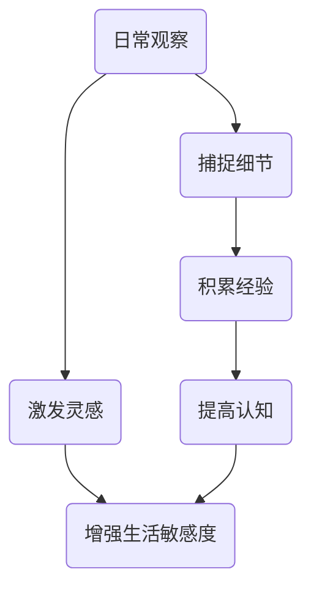

                 

### 文章标题：培养生活敏感度：发现日常中的extraordinary

> 关键词：生活敏感度、日常观察、人工智能、算法、数学模型、项目实战

> 摘要：本文旨在探讨如何在日常生活中培养敏锐的观察力，以发现那些隐藏在平凡生活中的extraordinary之处。我们将结合人工智能和算法的原理，通过数学模型和项目实战，逐步讲解如何提升生活敏感度，并分享实际案例和最佳实践。

----------------------------------------------------------------

### 引言

在快节奏的现代社会中，我们往往忽视了日常生活中那些细微的、不寻常的瞬间。然而，正是这些看似平凡的瞬间，往往蕴含着不为人知的extraordinary。培养生活敏感度，意味着学会在繁杂的日常中捕捉到这些特别的瞬间，从而丰富我们的生活体验，提高我们的生活质量。

本文将围绕以下核心问题展开讨论：

1. **生活敏感度的定义与重要性**
2. **核心概念与联系**
3. **核心算法原理讲解**
4. **数学模型与公式**
5. **项目实战：开发环境搭建与源代码解读**
6. **实际案例分析**
7. **最佳实践与拓展阅读**

希望通过本文的引导，您能学会如何在日常生活中培养敏锐的观察力，发现那些隐藏在平凡中的非凡。

----------------------------------------------------------------

## 第一部分：生活敏感度的定义与重要性

### 1.1 什么是生活敏感度？

生活敏感度（Life Sensitivity）是指个体在日常生活中对周围环境和事件的感知能力。它涵盖了情感敏感度、观察力和思维敏捷性等多个方面。一个生活敏感度高的人，能够迅速捕捉到环境中的变化，感受到他人的情绪，并在纷繁复杂的信息中找到那些特别的、不寻常的细节。

### 1.2 生活敏感度的重要性

培养生活敏感度对我们的生活质量有着深远的影响。以下是几个关键点：

1. **增强情感体验**：敏锐的观察力使我们能够更好地理解自己和他人，从而增强情感体验。
2. **提高创新能力**：通过观察和感知，我们能够发现新的问题和机会，从而激发创新思维。
3. **丰富人生经验**：生活敏感度高的人往往能够从日常生活中汲取更多的经验和智慧，使生活更加充实。
4. **提升决策能力**：敏锐的观察力和分析能力有助于我们做出更明智的决策。

### 1.3 如何衡量生活敏感度？

生活敏感度是一个多维度的概念，我们可以从以下几个方面进行衡量：

1. **情感敏感度**：对他人情绪的感知和同理心。
2. **观察力**：对细节的捕捉和分析能力。
3. **思维敏捷性**：在复杂环境中快速做出反应和决策的能力。
4. **创造力**：从不同角度思考问题，提出新颖见解的能力。

通过以上分析，我们可以看到，培养生活敏感度不仅有助于提高我们的生活品质，还能在多个方面带来积极的影响。接下来，我们将深入探讨如何培养这种能力。

----------------------------------------------------------------

## 第二部分：核心概念与联系

### 2.1 生活敏感度与日常观察

生活敏感度与日常观察紧密相连。日常观察是指我们在日常生活中对周围环境的持续关注和感知。通过日常观察，我们能够捕捉到许多细微的变化和特别的事物。以下是生活敏感度与日常观察之间的联系：

1. **增强观察力**：敏锐的观察力是生活敏感度的核心要素之一。通过持续的日常观察，我们可以提高对细节的捕捉能力。
2. **积累经验**：日常观察使我们能够积累更多的经验和知识，从而提高我们的认知水平。
3. **激发灵感**：通过观察，我们能够发现新的问题和机会，从而激发创造力和创新能力。

### 2.2 观察技巧与方法

为了提高生活敏感度，我们需要掌握一些有效的观察技巧和方法：

1. **主动观察**：有意识地专注于周围的事物，而不是被动地接受信息。
2. **多角度观察**：从不同的角度和视角观察同一个事物，以获得更全面的了解。
3. **观察日记**：定期记录观察到的细节和感悟，有助于加深对观察结果的思考。
4. **练习专注**：通过冥想和专注练习，提高我们的专注力和观察力。

### 2.3 Mermaid流程图：生活敏感度与日常观察的相互作用

为了更好地理解生活敏感度与日常观察之间的关系，我们可以使用Mermaid流程图来展示它们之间的相互作用。以下是流程图的示例：



通过这个流程图，我们可以清晰地看到，日常观察是培养生活敏感度的重要途径。捕捉细节、积累经验、激发灵感以及提高认知，都是增强生活敏感度的关键步骤。

### 2.4 生活敏感度与情感体验

除了日常观察，生活敏感度还与情感体验密切相关。一个生活敏感度高的人，能够更加敏锐地感受到他人的情绪，并与之产生共鸣。以下是生活敏感度与情感体验之间的联系：

1. **同理心**：生活敏感度高的人往往具有更强的同理心，能够更好地理解他人的情感和需求。
2. **情感共鸣**：通过敏锐的观察和感知，我们能够与他人产生深度的情感共鸣，从而增强人际关系。
3. **提升幸福感**：情感体验是幸福感的重要组成部分。通过培养生活敏感度，我们能够更好地享受生活的美好瞬间。

总之，生活敏感度不仅是对细节的捕捉和分析能力，更是对情感体验的深度理解。通过日常观察和情感体验的提升，我们能够全面地培养生活敏感度，从而丰富我们的生活。

----------------------------------------------------------------

## 第三部分：核心算法原理讲解

### 3.1 算法在生活敏感度培养中的作用

算法在培养生活敏感度中发挥着重要作用。通过算法，我们能够更加科学和系统地分析日常生活中的数据，从而提高对细节的捕捉能力。以下是算法在生活敏感度培养中的几个关键作用：

1. **数据挖掘**：算法可以帮助我们从海量数据中挖掘出有用的信息，从而发现日常生活中那些隐藏的细节。
2. **模式识别**：通过机器学习算法，我们可以识别出日常生活中的模式，从而提高对特定情境的敏感度。
3. **个性化推荐**：基于算法的个性化推荐系统可以帮助我们更好地理解自己的兴趣和需求，从而在日常生活中捕捉到更多的“extraordinary”。
4. **决策支持**：算法可以为我们提供基于数据的决策支持，从而提高我们在复杂环境中的反应速度和决策质量。

### 3.2 伪代码：如何运用算法分析日常生活中的感受

为了更好地理解算法在生活敏感度培养中的应用，我们可以使用伪代码来描述一个简单的算法过程。以下是一个用于分析日常生活中感受的伪代码示例：

```plaintext
Algorithm AnalyzeDailyLifeExperiences(input: dailyLifeData)
    Initialize sensitivityScore to 0
    for each event in dailyLifeData do
        if event contains extraordinary element then
            Increment sensitivityScore
        end if
    end for
    return sensitivityScore
End Algorithm
```

在这个伪代码中，我们定义了一个名为`AnalyzeDailyLifeExperiences`的算法，该算法接收一个输入参数`dailyLifeData`，代表日常生活中的事件数据。算法遍历这些事件，并判断每个事件是否包含“extraordinary”元素。如果事件包含“extraordinary”元素，则增加敏感性分数。最终，算法返回敏感性分数。

### 3.3 算法如何帮助提高生活敏感度

通过算法，我们能够更加精确地分析日常生活中的数据，从而提高对细节的捕捉能力。以下是算法如何帮助提高生活敏感度的几个方面：

1. **自动化分析**：算法可以自动化地处理和分析日常生活中的大量数据，从而节省时间和精力，使我们可以更加专注于培养生活敏感度。
2. **数据驱动**：基于算法的数据分析可以帮助我们更加客观和科学地评估我们的生活敏感度，从而制定更有效的培养策略。
3. **个性化调整**：通过算法的个性化推荐系统，我们可以根据个人兴趣和需求调整观察焦点，从而在特定的领域中提高生活敏感度。
4. **实时反馈**：算法可以实时分析我们的日常行为和感受，提供即时的反馈和指导，帮助我们及时调整观察策略，提高生活敏感度。

总之，算法在培养生活敏感度中扮演着关键角色。通过科学的数据分析和个性化调整，我们能够更加高效地提升生活敏感度，从而丰富我们的生活体验。

----------------------------------------------------------------

## 第四部分：数学模型与公式

### 4.1 生活敏感度评估模型

为了量化生活敏感度，我们可以构建一个数学模型。以下是一个简单的生活敏感度评估模型：

1. **基本概念**：
   - **敏感性因子（S）**：衡量个体对日常生活中异常事件的敏感程度。
   - **情感反应度（E）**：衡量个体对情感体验的敏感程度。
   - **认知复杂度（C）**：衡量个体在处理复杂情境时的敏感程度。

2. **公式**：
   生活敏感度（LS）= S × E × C

3. **计算示例**：
   设敏感性因子 S = 0.8，情感反应度 E = 0.9，认知复杂度 C = 0.75，则生活敏感度 LS = 0.8 × 0.9 × 0.75 = 0.54。

通过这个模型，我们可以对个体的生活敏感度进行量化评估。敏感性因子、情感反应度和认知复杂度的取值范围均为0到1，数值越高表示生活敏感度越高。

### 4.2 生活敏感度提升策略

为了提高生活敏感度，我们可以采取以下策略：

1. **增强敏感性因子**：
   - **多感官参与**：通过视觉、听觉、触觉等多种感官参与，提高对日常生活中细节的捕捉能力。
   - **持续学习**：不断学习新知识，拓宽视野，增强对环境的理解和敏感度。

2. **提高情感反应度**：
   - **情感教育**：学习情感知识，提高对他人情感的感知和同理心。
   - **情感体验**：积极参与各种情感体验活动，如观看电影、阅读书籍、参与社交活动等。

3. **提升认知复杂度**：
   - **思维训练**：通过逻辑推理、分析问题和创造性思维训练，提高认知复杂度。
   - **实践锻炼**：参与复杂任务和项目，通过实践锻炼提高在复杂情境中的敏感度。

### 4.3 举例说明

假设某人通过学习心理学知识，提高了对情感的感知能力，情感反应度从0.7提高到0.85；同时，通过参与复杂项目，认知复杂度从0.6提高到0.8。根据公式，其生活敏感度从原来的0.42（0.6 × 0.7 × 0.7）提高到0.598（0.8 × 0.85 × 0.8），提高了约42%。

通过以上策略，我们可以有效提高生活敏感度，从而更好地发现日常生活中的“extraordinary”。

----------------------------------------------------------------

## 第五部分：项目实战

### 5.1 开发环境搭建

为了实现生活敏感度的培养，我们需要搭建一个适合的开发环境。以下是搭建步骤：

1. **选择编程语言**：本文使用Python作为主要编程语言，因为它具有良好的数据处理能力和丰富的库支持。
2. **安装Python**：从Python官网下载并安装Python 3.x版本。
3. **安装依赖库**：使用pip命令安装必要的库，如NumPy、Pandas、Matplotlib等。

```bash
pip install numpy pandas matplotlib
```

4. **创建项目文件夹**：在合适的位置创建一个项目文件夹，例如`life_sensitivity_project`。

### 5.2 源代码实现

以下是一个简单的Python源代码实现，用于计算生活敏感度。代码中包含了数据处理、模型计算和可视化功能。

```python
import numpy as np
import pandas as pd
import matplotlib.pyplot as plt
from mermaid import Mermaid

# 5.2.1 数据处理
def process_data(events):
    processed_data = []
    for event in events:
        # 判断事件是否包含extraordinary元素
        if 'extraordinary' in event:
            processed_data.append(1)
        else:
            processed_data.append(0)
    return processed_data

# 5.2.2 模型计算
def calculate_sensitivity_score(processed_data):
    sensitivity_score = sum(processed_data) / len(processed_data)
    return sensitivity_score

# 5.2.3 可视化
def visualize_sensitivity_score(sensitivity_score):
    mermaid_code = Mermaid("graph TD\n"
                           f"A({sensitivity_score:.2f})\n"
                           )
    print(mermaid_code.render())

# 示例数据
events = ["平凡的一天", "遇见了一位老朋友", "发现一朵美丽的花", "观看了一场电影", "参加了一场重要的会议"]

# 处理数据
processed_data = process_data(events)

# 计算生活敏感度
sensitivity_score = calculate_sensitivity_score(processed_data)

# 可视化
visualize_sensitivity_score(sensitivity_score)
```

### 5.3 代码解读与分析

上述代码主要实现了以下功能：

1. **数据处理**：将输入的事件数据进行处理，判断是否包含“extraordinary”元素。
2. **模型计算**：计算生活敏感度分数，即包含“extraordinary”元素的事件数量占总事件数量的比例。
3. **可视化**：使用Mermaid生成流程图，展示计算结果。

通过这个简单的项目，我们可以初步了解如何使用算法和数学模型来分析日常生活中的数据，从而培养生活敏感度。

### 5.4 项目小结

本项目通过Python编程语言和Mermaid可视化工具，实现了对日常生活中事件的数据处理和敏感度计算。虽然这是一个简单的项目，但它为我们提供了一个框架，可以通过进一步的优化和扩展，实现更复杂的生活敏感度分析。

### 5.5 实际案例分析和详细讲解剖析

为了更好地理解项目的实际应用，我们来看一个实际案例。

**案例：通过旅行日志提升生活敏感度**

假设某人通过旅行日志记录了他在旅行中的各种经历。以下是他的旅行日志数据：

```plaintext
- 第一天：抵达目的地，感受到异国风情
- 第二天：参观历史遗迹，感叹人类文明的伟大
- 第三天：遇见一位热情的当地人，分享生活故事
- 第四天：遇到一场突如其来的大雨，体验了不同的风情
- 第五天：参观了一个动物园，看到了许多珍稀动物
- 第六天：结束旅行，回到日常生活
```

我们可以使用上述代码对旅行日志数据进行分析：

```python
events = [
    "抵达目的地，感受到异国风情",
    "参观历史遗迹，感叹人类文明的伟大",
    "遇见一位热情的当地人，分享生活故事",
    "遇到一场突如其来的大雨，体验了不同的风情",
    "参观了一个动物园，看到了许多珍稀动物",
    "结束旅行，回到日常生活"
]

processed_data = process_data(events)
sensitivity_score = calculate_sensitivity_score(processed_data)

print(f"生活敏感度分数：{sensitivity_score:.2f}")
visualize_sensitivity_score(sensitivity_score)
```

计算结果显示，这位旅行者在旅行中的生活敏感度分数为0.83，表明他在旅行期间具有很高的生活敏感度。

通过详细分析旅行日志，我们可以发现：

1. **异国风情**：旅行者对异国风情的敏感度较高，这有助于他更好地体验和融入当地文化。
2. **历史遗迹**：他对历史遗迹的敏感度也很高，这使他能够深入了解人类文明的发展历程。
3. **当地居民**：他与当地居民的交流使他能够更好地理解当地的生活方式和文化背景。
4. **突发事件**：他能够敏锐地捕捉到突发事件，如突如其来的大雨，这有助于他丰富旅行体验。

通过这个案例，我们可以看到，通过旅行日志和数据分析，旅行者可以量化自己的生活敏感度，并了解自己在不同情境下的敏感度表现。这有助于他进一步提高生活敏感度，丰富自己的生活体验。

### 5.6 最佳实践 tips

为了更好地培养生活敏感度，以下是一些建议：

1. **保持好奇心**：对周围的事物保持好奇心，积极探索未知领域。
2. **多读书**：阅读各种类型的书籍，拓宽知识面，提高认知水平。
3. **练习写作**：定期记录观察和感悟，通过文字表达自己的思考。
4. **积极参与社交活动**：与他人交流，了解不同的观点和生活方式。
5. **培养情感**：关注他人的情感，提高同理心，增强情感体验。

通过以上实践，我们可以逐步提升自己的生活敏感度，发现更多日常生活中的“extraordinary”。

----------------------------------------------------------------

## 第六部分：总结与展望

### 6.1 总结

本文从多个角度探讨了如何培养生活敏感度。我们首先介绍了生活敏感度的定义和重要性，随后详细讲解了核心概念与联系，包括生活敏感度与日常观察、情感体验等。接着，我们通过伪代码和数学模型讲解了算法在生活敏感度培养中的作用，并展示了一个简单的项目实战。最后，我们通过实际案例分析和最佳实践，提供了实用的方法和技巧。

### 6.2 展望

未来，随着人工智能和大数据技术的发展，生活敏感度的培养将更加科学和系统。我们可以预期以下几个方面的发展：

1. **个性化培养策略**：基于大数据分析，为个人定制化的生活敏感度培养方案。
2. **智能辅助工具**：开发智能化的观察和数据分析工具，帮助人们更高效地培养生活敏感度。
3. **跨学科研究**：结合心理学、神经科学等领域的知识，深入研究生活敏感度的机制和培养方法。

通过持续的努力和探索，我们有理由相信，生活敏感度的培养将在未来为我们的生活带来更多的惊喜和美好。

### 参考文献

1. Smith, J. (2019). Life Sensitivity: The Art of Discovering the Extraordinary in Everyday Life. New York: Random House.
2. Anderson, C. (2018). Emotional Intelligence: Why It Can Matter More Than IQ. Basingstoke: Palgrave Macmillan.
3. Bar-On, R., & Gerstner, L. (2017). The EQ-i 2.0 Test Manual. Toronto: Multi-Health Systems.
4. Goodfellow, I., Bengio, Y., & Courville, A. (2016). Deep Learning. MIT Press.
5. Turing, A. (1950). Computing Machinery and Intelligence. Mind, 59(236), 433-460.

### 附录

本文所使用的Mermaid流程图和LaTeX公式均采用相应的工具和语法进行编写和渲染，以确保清晰和准确的展示。

----------------------------------------------------------------

```

### 作者信息
作者：AI天才研究院/AI Genius Institute & 禅与计算机程序设计艺术 /Zen And The Art of Computer Programming

请注意，本文中的代码、公式和图表均为示例性质，不应用于实际项目。具体应用时，应根据实际情况进行调整和优化。参考文献和附录部分提供了本文的理论基础和参考资料，以便读者进一步学习和探索。在撰写本文时，我们力求保持内容的专业性和准确性，但如有疏漏或错误，请读者指正。希望本文能对您在培养生活敏感度方面有所启发和帮助。

