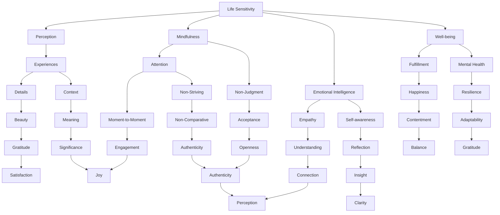
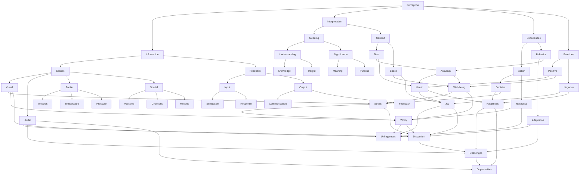

                 

**Title: 培养生活敏感度：发现日常中的非凡**

**Keywords:**
- 生活敏感度
- 培养方法
- 日常观察
- 非凡体验
- 个人成长
- 情感认知

**Abstract:**
本文旨在探讨如何培养生活敏感度，以在日常生活中发现非凡之处。通过介绍关键概念、发展技巧、提升感知力和自我反思等方法，文章将帮助读者深入了解生活敏感度的内涵，并掌握提高自身敏感度的实用策略。本文还将通过实例和案例分析，展示培养生活敏感度的实际效果和重要性。

**Introduction:**
在快节奏的现代社会中，人们常常感到压力和疲惫，对于生活中的美好事物和细微之处缺乏关注和感受。培养生活敏感度，即培养对日常生活中的美好事物和细微之处的敏锐感知能力，对于提升个人幸福感和生活满意度具有重要意义。本文将逐步分析培养生活敏感度的方法，帮助读者在日常生活中发现更多非凡之处。

**1. Understanding Life Sensitivity**

**1.1 Definition and Importance:**
Life sensitivity refers to the ability to perceive, appreciate, and connect with the beauty and significance of everyday experiences. It is the skill to notice and make sense of the world around us in a more nuanced and meaningful way. Life sensitivity is important for personal well-being as it enhances our emotional intelligence, fosters a deeper connection with others, and increases our overall life satisfaction.

**1.2 The Relationship Between Life Sensitivity and Personal Well-being:**
Life sensitivity has a direct impact on personal well-being. When we are more sensitive to our surroundings, we are more likely to experience positive emotions, feel more engaged in our daily activities, and develop a greater sense of fulfillment. This, in turn, leads to improved mental health and resilience.

**1.3 Historical Overview and Theoretical Frameworks:**
The concept of life sensitivity has its roots in various philosophical and psychological traditions. From the ancient teachings of Buddhism and Taoism to modern psychological theories, the emphasis on cultivating sensitivity and mindfulness has been a common thread. Theoretical frameworks such as positive psychology and mindful awareness provide valuable insights into how we can develop and enhance our life sensitivity.

**1.4 Mermaid Diagram:**
The following mermaid diagram illustrates the key components and relationships of life sensitivity:

**2. Developing Life Sensitivity Skills**

**2.1 Mindfulness Practices**

**2.1.1 Introduction to Mindfulness and Its Role in Life Sensitivity:**
Mindfulness is the practice of paying attention to the present moment, without judgment. It involves cultivating awareness of one's thoughts, emotions, and sensations. Mindfulness is closely related to life sensitivity as it enhances our ability to perceive and connect with the world around us in a more intentional and meaningful way.

**2.1.2 Techniques for Developing Mindfulness and Presence:**
To develop mindfulness, one can practice various techniques such as:

- **Mindful Breathing:** Focus on your breath as it enters and leaves your body, bringing your attention back to the present moment when your mind wanders.

- **Body Scan:** Begin at your toes and move slowly up your body, noticing any sensations or tension, and releasing it with each breath.

- **Mindful Eating:** Pay attention to the taste, texture, and aroma of your food, and chew slowly and mindfully.

- **Mindful Walking:** Be fully present in each step, feeling the ground beneath your feet and the rhythm of your breath.

**2.1.3 Mindfulness Meditation Exercises:**
Here are a few mindfulness meditation exercises to develop your life sensitivity:

- **Simple Mindfulness Meditation:** Sit or lie down in a comfortable position. Close your eyes and focus on your breath. Whenever your mind wanders, gently bring your attention back to your breath.

- **Breathing Space Meditation:** Take a few moments to pause and focus on your breath. Notice any tension or discomfort in your body, and allow it to dissolve with each breath.

- **Three-Minute Mindful Pause:** Set a timer for three minutes and focus on the present moment. Notice your thoughts, emotions, and sensations without judgment.

**2.1.4 Case Studies of Individuals Who Have Improved Their Life Sensitivity through Mindfulness Practices:**
Several individuals have shared their experiences of improving their life sensitivity through mindfulness practices. For example:

- **Jane:** Jane used to feel overwhelmed by her busy schedule and often missed the beauty around her. After practicing mindfulness, she started to notice the small joys in everyday life, such as the warmth of the sun on her face or the aroma of fresh coffee.

- **Tom:** Tom struggled with anxiety and had difficulty focusing on the present moment. Through mindfulness meditation, he learned to calm his mind and become more aware of his surroundings, leading to a greater appreciation for the world around him.

**3. Cultivating Curiosity**

**3.1 The Importance of Curiosity in Enhancing Life Sensitivity:**
Curiosity is a key component of life sensitivity as it drives us to explore, learn, and connect with the world around us. It helps us break free from our routine and opens our eyes to new experiences and perspectives.

**3.2 Strategies for Developing Curiosity and Inquisitiveness:**
Here are some strategies to cultivate curiosity and inquisitiveness:

- **Ask Open-Ended Questions:** Instead of asking yes-or-no questions, ask questions that encourage deeper exploration and thought. For example, instead of asking, "Did you enjoy your day?" ask, "What was the most interesting part of your day?"

- **Explore New Interests:** Take up new hobbies or interests that are outside your comfort zone. This can help you discover new aspects of life and expand your horizons.

- **Seek New Experiences:** Travel to new places, try new foods, and engage in different activities. This can spark curiosity and open your eyes to new ways of living.

- **Reflect on Your Experiences:** Take time to reflect on your experiences and thoughts. This can help you identify patterns and gain new insights.

**3.3 Techniques for Asking Open-Ended Questions:**
Here are some techniques for asking open-ended questions:

- **Begin with "How" or "What":** Questions starting with "how" or "what" often encourage more detailed answers. For example, "How did you feel during that experience?" or "What do you think about this situation?"

- **Use "And" instead of "But":** Instead of responding with "but," use "and" to connect your thoughts and explore different perspectives. For example, instead of saying, "I don't like this idea, but it's not practical," say, "I like this idea, and I'm concerned about its practicality."

- **Ask for Clarification:** When someone shares an experience or thought, ask follow-up questions to gain a deeper understanding. For example, "Can you tell me more about that?" or "What led you to think that?"

**3.4 Examples of Curiosity-Fueled Discoveries in Everyday Life:**
Curiosity can lead to fascinating discoveries in everyday life. Here are a few examples:

- **Discovering a Hidden Talent:** Sarah, a software engineer, developed an interest in photography. Through her curiosity, she discovered a hidden talent and now enjoys capturing the beauty around her.

- **Learning a New Language:** John, an IT professional, decided to learn Spanish. His curiosity led him to explore the language and culture, which enriched his personal and professional life.

- **Exploring New Hobbies:** Mark, a programmer, took up gardening. His curiosity about plants and nature led him to discover a new passion and a sense of connection with the world around him.

**4. Enhancing Perception and Awareness**

**4.1 Perception and Its Role in Life Sensitivity:**
Perception is the process by which we interpret and make sense of the sensory information from our environment. Our perception shapes our understanding of the world and influences our experiences and emotions. Enhancing our perception can help us become more sensitive to the details and nuances of life.

**4.2 The Role of Sensory Perception in Noticing the Extraordinary:**
Sensory perception plays a crucial role in noticing the extraordinary in everyday life. By becoming more aware of our senses, we can enhance our ability to perceive and appreciate the beauty and significance of our surroundings.

**4.3 Enhancing Sensory Sensitivity Through Practice:**
Here are some ways to enhance your sensory sensitivity:

- **Mindful Observation:** Pay attention to the details of your surroundings, such as the color, texture, and shape of objects. Practice noticing the small things that often go unnoticed.

- **Engage Your Senses:** Take time to engage each of your senses—sight, sound, touch, taste, and smell. For example, take a moment to savor the taste of a piece of fruit or listen to the sounds of nature.

- **Create Sensory Experiences:** Intentionally create sensory experiences, such as taking a scented bath or listening to calming music. This can help you become more aware of your senses and their impact on your mood and well-being.

**4.4 Mermaid Diagram:**
The following mermaid diagram illustrates the process of perception and its impact on life sensitivity:

**5. Awareness and Self-Reflection**

**5.1 The Role of Awareness in Life Sensitivity:**
Awareness is the ability to recognize and understand our thoughts, emotions, and sensations in the present moment. It is the foundation of life sensitivity as it allows us to connect with our inner experiences and respond to them in a more mindful and intentional way.

**5.2 The Role of Self-Reflection in Enhancing Life Sensitivity:**
Self-reflection is the process of examining our thoughts, feelings, and behaviors to gain insight and understanding. It helps us develop greater awareness and can enhance our life sensitivity by deepening our connection with ourselves and our surroundings.

**5.3 Techniques for Developing Awareness and Self-Reflection:**
Here are some techniques for developing awareness and self-reflection:

- **Morning and Evening Reflection:** Start and end your day with a few minutes of reflection. Consider what you are grateful for, what challenges you faced, and what you learned.

- **Journaling:** Keep a journal to record your thoughts, feelings, and experiences. Writing can help you process your emotions and gain a deeper understanding of yourself.

- **Mindful Practices:** Engage in mindfulness practices such as meditation, deep breathing, or mindful walking to enhance your awareness and focus.

- **Ask Yourself Powerful Questions:** Ask yourself thought-provoking questions to stimulate self-reflection. For example, "What am I grateful for today?" or "What do I need to let go of?"

**5.4 The Benefits of Developing Awareness and Self-Reflection:**
Developing awareness and self-reflection can bring numerous benefits:

- **Improved Emotional Intelligence:** By becoming more aware of your emotions, you can better understand and manage your reactions, leading to improved emotional intelligence.

- **Enhanced Personal Growth:** Self-reflection helps you identify areas for personal growth and develop a deeper understanding of yourself and your values.

- **Increased Life Satisfaction:** By connecting with your inner experiences and surroundings, you can experience greater satisfaction and fulfillment in life.

**Conclusion:**
Cultivating life sensitivity is a valuable skill that can enhance our personal well-being and deepen our connection with the world around us. By practicing mindfulness, curiosity, and self-reflection, we can develop a keen sense of life and discover the extraordinary in everyday situations. As we become more sensitive to the beauty and significance of our experiences, we can cultivate a greater appreciation for life and a more fulfilling existence.

---

**Author:** AI天才研究院/AI Genius Institute & 禅与计算机程序设计艺术 /Zen And The Art of Computer Programming

---

Note: This outline is structured to provide a comprehensive guide to writing a detailed and informative blog post on the topic of cultivating life sensitivity. Each section is designed to be expanded upon with detailed content, examples, and analysis. The mermaid diagrams are placeholders for the key concepts and relationships that can be further developed in the actual article.

