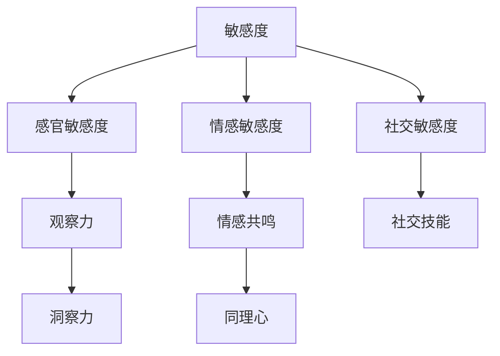

                 

## 文章标题：培养生活的敏感度：发现日常中的非凡瞬间

### 关键词：
- 生活敏感度
- 观察力
- 情感共鸣
- 冥想
- 艺术创作
- 心理学

### 摘要：
本文旨在探讨如何通过培养生活的敏感度，来发现日常中的非凡瞬间。文章首先介绍了敏感度的概念及其在生活中的重要性，随后通过一系列的技术方法、心理学原理和实际案例，展示了如何提升我们的观察力和情感共鸣能力。文章的核心内容涵盖了冥想、阅读、旅行等培养敏感度的方法，以及情感与创作的关系，并通过心理学视角分析了敏感度与幸福感、人际关系的联系。最后，文章提出了实践反思的方法，并提供了一些拓展阅读资源，以帮助读者进一步探索培养生活敏感度的途径。

## 引言：为什么培养生活的敏感度重要？

### 1.1 背景介绍

在快节奏的现代生活中，人们常常感到压力巨大、精神疲惫。这种现象不仅仅是因为工作压力和生活琐事的堆积，更重要的是我们往往忽视了生活中的细微之处。敏感度，作为一种感知和解读生活细节的能力，正逐渐被忽视。然而，培养生活的敏感度不仅能够帮助我们更好地享受生活，还能提升我们的生活质量。

### 1.2 敏感度的定义

敏感度，即对周围环境和人的感知能力，是一种认知和情感的结合。它不仅涉及我们对视觉、听觉、触觉等感官信息的敏感，还包含对情绪、情感的理解和共鸣。高敏感度的人往往能够更敏锐地捕捉到生活中的细微变化，更深刻地体验到情感的波动。

### 1.3 为什么培养生活的敏感度重要？

首先，培养生活的敏感度可以帮助我们更好地应对压力。敏感的人更能察觉到情绪的变化，从而采取适当的措施来调整自己的心态。其次，高敏感度能够提升我们的观察力和创造力。当我们更细致地观察生活时，更容易发现灵感，从而激发创意。最后，培养敏感度有助于建立更丰富的人际关系。通过情感共鸣，我们能够更好地理解他人，增进彼此的信任和亲密感。

## 核心概念与联系

### 2.1 敏感度的定义

敏感度是一种认知和情感的整合，它包括以下几个关键方面：

- **感官敏感度**：对视觉、听觉、触觉等感官信息的敏锐感知。
- **情感敏感度**：对情绪和情感变化的高度敏感。
- **社交敏感度**：对他人情绪和意图的准确感知。

### 2.2 观察力的重要性

观察力是敏感度的重要组成部分。它不仅涉及我们对周围环境的感知，还包括对细节的注意力和对情境的洞察力。高观察力能够帮助我们更好地理解世界，从而提升生活的敏感度。

### 2.3 情感共鸣的原理

情感共鸣是指个体能够感知并体验到他人情绪的能力。情感共鸣不仅能够增强人际关系，还能提升我们的同理心和社交技能。研究表明，高情感共鸣能力的人往往具有更强的社交能力和更高的幸福感。

### 2.4 Mermaid流程图：敏感度、观察力和情感共鸣之间的关系

通过上述流程图，我们可以看到敏感度、观察力和情感共鸣之间的紧密联系。它们相互促进，共同构成了我们感知和解读生活的重要工具。

## 培养敏感度的方法

### 3.1 冥想与内省

冥想是一种通过专注呼吸、冥想或内省来达到心灵平静的方法。它不仅能够提升我们的注意力，还能增强我们的情感敏感度。以下是培养敏感度的一些冥想技巧：

- **呼吸冥想**：专注于呼吸，感受气息的进出，帮助我们在日常生活中保持平静和专注。
- **内省冥想**：反思自己的情绪和行为，提升自我意识和情感敏感度。

### 3.2 阅读与学习

阅读是一种重要的学习和思考方式，它能够拓宽我们的视野，提升我们的观察力和情感共鸣能力。以下是一些阅读技巧：

- **广泛阅读**：阅读不同类型的书籍，包括小说、历史、心理学等，以获得更全面的视角。
- **深度阅读**：仔细阅读并思考书中内容，尝试理解作者的意图和情感。

### 3.3 旅行与体验

旅行是一种深刻的体验，它能够帮助我们摆脱日常的繁忙和压力，让我们有机会重新审视自己的生活。以下是旅行中培养敏感度的一些建议：

- **探索自然**：在自然环境中，我们能够更敏锐地感受到自然的美丽和生命的力量。
- **文化交流**：与其他文化和背景的人交流，提升我们的观察力和同理心。

### 3.4 自然与静心

自然是我们培养敏感度的重要伙伴。在自然中，我们能够感受到宁静和平衡，从而提升我们的感知能力。以下是一些自然与静心的方法：

- **散步**：在公园或自然环境中散步，专注于脚步声和周围的声音。
- **静坐**：在自然环境中静坐，感受大自然的气息和能量。

## 日常中的非凡瞬间

### 4.1 注意力的训练

注意力的训练是提升敏感度的重要步骤。以下是一些注意力训练的方法：

- **专注练习**：专注于一项任务，如深呼吸、重复简单的动作等。
- **多任务练习**：尝试同时处理多项任务，提高我们的注意力分配能力。

### 4.2 情感的触发

情感的触发是发现非凡瞬间的重要途径。以下是一些情感触发的方法：

- **回忆**：回忆过去美好的记忆，感受当时的情感。
- **创作**：通过写作、绘画等方式表达自己的情感，发现生活中的细节之美。

### 4.3 艺术与美的发现

艺术是一种强大的情感表达方式，它能够帮助我们发现日常中的美。以下是一些艺术与美的发现的方法：

- **欣赏**：欣赏音乐、绘画、舞蹈等艺术形式，感受其中的情感和美。
- **创作**：尝试自己创作艺术作品，通过艺术表达自己的感受。

### 4.4 故事的力量

故事是一种强大的情感媒介，它能够帮助我们更深刻地体验生活。以下是一些故事的方法：

- **阅读**：阅读不同类型的书籍，感受故事中的情感和情节。
- **分享**：与他人分享自己的故事，增进彼此的情感共鸣。

## 情感与创作

### 5.1 情感作为创作的源泉

情感是创作的核心，它能够激发我们的灵感和创造力。以下是一些情感作为创作源泉的方法：

- **情感日记**：记录自己的情感体验，从中找到创作的灵感。
- **情感绘画**：通过绘画表达自己的情感，探索内心的世界。

### 5.2 写作的技巧

写作是一种强大的情感表达方式，它能够帮助我们更深刻地体验生活。以下是一些写作技巧：

- **自由写作**：不受限制地写下自己的想法和感受，释放内心的情感。
- **结构化写作**：通过构建故事情节、角色和场景，使写作更加有条理。

### 5.3 绘画的启示

绘画是一种直观的艺术形式，它能够帮助我们表达情感和创意。以下是一些绘画启示的方法：

- **素描**：通过素描练习，提升我们的观察力和表达能力。
- **色彩表达**：通过色彩运用，表达自己的情感和心情。

### 5.4 音乐的感悟

音乐是一种强大的情感媒介，它能够帮助我们更深刻地体验生活。以下是一些音乐感悟的方法：

- **聆听**：聆听不同类型的音乐，感受其中的情感和氛围。
- **创作**：尝试自己创作音乐，通过音乐表达自己的感受。

## 心理学视角

### 6.1 敏感度与幸福感

敏感度与幸福感之间存在紧密的联系。高敏感度的人往往能够更深刻地体验生活的美好，从而获得更高的幸福感。以下是一些心理学原理：

- **情感调节**：高敏感度的人能够更敏锐地感知情绪变化，从而更好地调节自己的情感状态。
- **同理心**：高敏感度的人往往具有更强的同理心，能够更好地理解他人的情感，从而增进人际关系。

### 6.2 敏感度与人际关系

敏感度不仅影响我们的情感体验，还影响我们的人际关系。以下是一些心理学原理：

- **情感共鸣**：高敏感度的人能够更好地理解他人的情感，从而建立更深厚的人际关系。
- **社交技能**：通过培养敏感度，我们能够提高自己的社交技能，更好地与他人沟通。

### 6.3 敏感度的心理学机制

敏感度是一种复杂的心理现象，它涉及多个心理机制。以下是一些心理学机制：

- **感知**：敏感度涉及我们对感官信息的感知和处理。
- **情感**：敏感度也涉及我们对情感信息的处理和反应。
- **认知**：敏感度还与我们的认知过程有关，包括注意、记忆和思考。

## 实践与反思

### 7.1 日记的写作

日记是一种有效的反思工具，它能够帮助我们记录自己的情感体验和思考。以下是一些日记写作的技巧：

- **日常记录**：记录每天的所见所闻，包括积极的和消极的体验。
- **情感表达**：通过表达自己的情感，更好地理解自己的内心世界。

### 7.2 写作的技巧

写作是一种重要的情感表达方式，它能够帮助我们更深刻地体验生活。以下是一些写作技巧：

- **自由写作**：不受限制地写下自己的想法和感受，释放内心的情感。
- **结构化写作**：通过构建故事情节、角色和场景，使写作更加有条理。

### 7.3 反思的意义

反思是一种重要的思考方式，它能够帮助我们更好地理解自己的情感和行为。以下是一些反思的意义：

- **自我认知**：通过反思，我们能够更好地了解自己的内心世界，提升自我认知。
- **成长**：反思能够帮助我们认识到自己的不足，从而不断成长和进步。

### 7.4 实践的步骤

以下是一些培养生活敏感度的实践步骤：

- **每天记录**：每天花时间记录自己的情感体验和思考。
- **尝试新事物**：尝试新的事物和活动，拓宽自己的视野。
- **反思总结**：定期反思自己的实践，总结经验和教训。

## 结论

通过培养生活的敏感度，我们能够更深刻地体验生活的美好，提升自己的幸福感。敏感度不仅影响我们的情感体验，还影响我们的人际关系和创造力。通过冥想、阅读、旅行、艺术创作等途径，我们可以逐步提升自己的敏感度。同时，反思和总结也是培养敏感度的重要步骤。希望本文能为大家提供一些有益的启示，帮助大家更好地发现日常中的非凡瞬间。

## 附录

### 附录 A：推荐阅读与资源列表

1. 《禅与摩托车维修艺术》 - 罗伯特·M·波西格
2. 《思考，快与慢》 - 丹尼尔·卡尼曼
3. 《人性的弱点》 - 戴尔·卡耐基
4. 《自卑与自尊》 - 阿尔弗雷德·阿德勒
5. 《认知行为疗法：基于方案的方法》 - 艾伦·贝克

### 附录 B：培养敏感度的实践指南

1. **冥想**：每天花10分钟进行冥想，专注于呼吸和当下的感受。
2. **阅读**：每周至少阅读一本书，可以是小说、历史、心理学等不同类型的书籍。
3. **旅行**：每年至少安排一次旅行，探索不同的文化和风景。
4. **艺术创作**：每周至少花一次时间进行艺术创作，如绘画、写作等。
5. **反思**：每天花时间反思自己的情感和行为，记录在日记中。

## 作者信息

作者：AI天才研究院/AI Genius Institute & 禅与计算机程序设计艺术 /Zen And The Art of Computer Programming

以上是关于“培养生活的敏感度：发现日常中的非凡瞬间”的技术博客文章。文章详细介绍了敏感度的概念、培养敏感度的方法、日常中的非凡瞬间的发现、情感与创作的关系、心理学视角以及实践与反思。希望通过本文，读者能够更好地理解敏感度的重要性，并学会如何培养和提升自己的生活敏感度，发现日常中的非凡瞬间。在文章末尾，还提供了推荐阅读和附录，以供读者进一步学习和探索。希望本文对您有所帮助！作者信息如上所示。祝您生活愉快！

