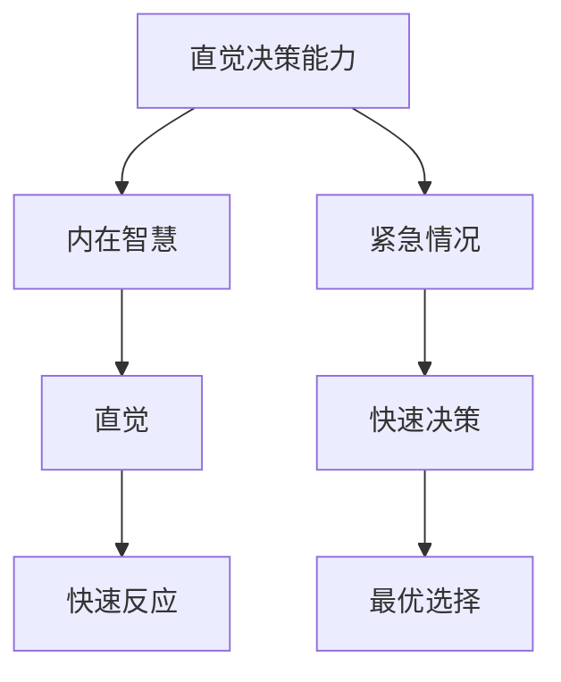

                 

### 文章标题

# 《培养直觉决策能力：跟随内在智慧的指引》

### 关键词

- 直觉决策能力
- 内在智慧
- 决策过程
- 心理学基础
- 情绪管理

### 摘要

本文旨在探讨直觉决策能力及其与内在智慧的关系，通过详细分析其心理学基础、培养方法及实际应用，帮助读者理解并提升直觉决策能力。文章首先介绍了直觉决策能力的定义和重要性，随后探讨了内在智慧的概念及其在直觉决策中的作用。接着，文章从环境与心态的塑造、直觉思维的训练和情绪管理三个方面阐述了直觉决策能力的培养方法。在实践应用部分，文章详细介绍了直觉决策在决策过程、职业发展和生活中的应用，并通过具体案例进行了分析。最后，文章总结了直觉决策能力培养的重要性，提出了未来研究的方向。希望通过本文，读者能够更好地理解和运用直觉决策能力，跟随内在智慧的指引，做出更加明智的决策。

## 引言

在快速发展的信息技术时代，决策能力的重要性日益凸显。无论是在个人生活中，还是在职业生涯中，我们都需要做出大量决策，这些决策影响着我们的发展轨迹和生活质量。传统的决策过程往往依赖于逻辑推理和数据分析，但随着环境的复杂性和不确定性增加，仅仅依赖理性分析往往难以应对复杂情境。因此，直觉决策能力逐渐受到了广泛关注。

### 直觉决策能力

直觉决策能力指的是在缺乏充分信息或者时间紧迫的情况下，依靠直觉迅速做出决策的能力。与理性决策不同，直觉决策不依赖于复杂的分析过程和逻辑推理，而是依赖于内在的直觉和经验。直觉决策能力在紧急情况下尤为重要，因为它可以快速反应，帮助我们在压力下做出最优选择。

### 内在智慧

内在智慧是指人类内心深处的一种智慧，它源自我们的潜意识，与直觉密切相关。内在智慧可以帮助我们洞察事物的本质，预见未来的趋势，做出符合整体利益的最佳选择。在直觉决策中，内在智慧起着重要的指导作用，它帮助我们超越表面的信息，抓住事物的核心。

### 内在智慧与直觉决策能力的关系

内在智慧与直觉决策能力密切相关。直觉决策能力依赖于内在智慧，而内在智慧则是直觉决策能力的源泉。两者相互作用，共同构成了我们决策过程中的重要组成部分。内在智慧能够帮助我们快速识别问题的核心，直觉决策能力则能让我们在紧急情况下迅速做出反应。

### 核心概念与联系

为了更好地理解直觉决策能力和内在智慧，我们需要首先了解它们的核心概念。直觉决策能力强调快速、无意识的决策过程，而内在智慧则强调深层次的思维能力和洞见。这两者之间的联系在于，内在智慧为直觉决策提供了基础，直觉决策则是在内在智慧的指导下，快速反应的结果。

### Mermaid 流程图

下面是一个用 Mermaid 编写的流程图，展示了直觉决策能力和内在智慧之间的联系：



通过这个流程图，我们可以清晰地看到直觉决策能力和内在智慧之间的相互作用。内在智慧为直觉决策提供了支持和指导，而直觉决策则是在紧急情况下，通过快速反应，实现最优选择。

## 核心概念与联系

### 直觉决策能力的定义

直觉决策能力是一种在缺乏充分信息或时间紧迫的情况下，依靠直觉迅速做出决策的能力。与理性决策不同，直觉决策不依赖于复杂的分析过程和逻辑推理，而是依赖于内在的直觉和经验。直觉决策能力通常在紧急情况下尤为重要，因为它可以帮助我们在压力下做出快速反应。

### 内在智慧的概念

内在智慧是一种深层次的思维能力和洞见，它源自我们的潜意识，与直觉密切相关。内在智慧可以帮助我们洞察事物的本质，预见未来的趋势，做出符合整体利益的最佳选择。内在智慧不仅仅是一种知识，更是一种直觉和灵感，它能够超越表面的信息，深入事物的核心。

### 内在智慧与直觉决策能力的关系

内在智慧与直觉决策能力密切相关。直觉决策能力依赖于内在智慧，而内在智慧则是直觉决策能力的源泉。内在智慧能够为直觉决策提供支持和指导，帮助我们在复杂和不确定的环境中做出明智的选择。同时，直觉决策能力也是内在智慧的外在表现，通过直觉决策，我们可以将内在智慧转化为具体的行动。

### Mermaid 流�程图

下面是一个用 Mermaid 编写的流程图，展示了直觉决策能力和内在智慧之间的关系：


在这个流程图中，我们可以看到内在智慧（B）为直觉决策能力（A）提供了基础，而直觉决策能力（A）则是在紧急情况下，通过快速反应（D），实现最优选择（G）。内在智慧（B）和直觉决策能力（A）之间的相互作用，共同构成了我们在决策过程中至关重要的组成部分。

### 直觉决策能力的心理学基础

直觉决策能力不仅是一种技能，更是一种心理过程。要理解直觉决策能力，我们需要从心理学角度探讨其基础，包括相关的心理学理论、直觉决策能力的发展与培养过程。

#### 心理学理论

在心理学领域，有许多理论解释直觉决策能力。例如，弗洛伊德的潜意识理论认为，直觉决策源自我们的潜意识，是一种无意识的思维过程。而格式塔心理学则强调，直觉决策是一种整体感知和理解，而非简单的逻辑推理。

#### 直觉决策能力的发展

直觉决策能力并非与生俱来，而是通过后天的培养和发展逐渐形成的。研究表明，个体的直觉决策能力受到多种因素的影响，包括经验、知识、情绪状态等。随着经验的积累和知识的丰富，个体的直觉决策能力会得到提升。此外，情绪状态也对直觉决策能力产生影响，积极的情绪状态有利于直觉决策的准确性。

#### 直觉决策能力的培养

要培养直觉决策能力，可以从以下几个方面入手：

1. **经验积累**：通过大量实践，增加对问题的熟悉程度，提高直觉决策的准确性。
2. **知识扩展**：学习相关领域的知识，提高对问题的理解和分析能力。
3. **情绪管理**：培养情绪稳定，避免情绪波动对直觉决策的干扰。
4. **专注训练**：提高专注力和注意力，减少外界干扰，提高直觉决策的效率。

通过这些方法，我们可以逐步提升直觉决策能力，使其在决策过程中发挥更大的作用。

### 实际应用案例

直觉决策能力在实际生活中有着广泛的应用。以下是一些实际案例：

#### 案例一：医生在急诊室中的决策

在急诊室，医生常常需要在短时间内做出生命攸关的决策。这种情况下，直觉决策能力尤为重要。医生通过多年的临床经验和知识积累，能够在短时间内快速判断病情，制定最优的治疗方案。这种直觉决策能力是在长期实践中培养出来的，是医生在紧急情况下做出迅速反应的关键。

#### 案例二：创业者在市场变化中的决策

创业者需要时刻关注市场变化，快速做出决策以应对竞争。在市场变化无常的情况下，直觉决策能力可以帮助创业者抓住机遇，规避风险。例如，一个成功的创业者可能在短时间内发现市场的潜在需求，迅速调整产品策略，抢占市场先机。这种直觉决策能力是创业者成功的重要因素。

#### 案例三：警察在紧急情况下的决策

警察在处理紧急情况时，需要迅速做出决策，以确保现场的安全。直觉决策能力在这里至关重要。警察通过多年的训练和实战经验，能够在瞬间判断形势，采取最合适的行动。这种直觉决策能力是警察职业素养的重要组成部分。

### 直觉决策能力的重要性

直觉决策能力在紧急情况下具有显著的优势。首先，它能够快速反应，减少决策时间。在许多情况下，时间就是生命，快速决策能够最大限度地减少损失。其次，直觉决策能力能够在信息不充分的情况下，帮助个体做出最优选择。直觉决策不仅依赖于逻辑推理，更依赖于内在的直觉和经验，这使得它能够在复杂和不确定的环境中，提供有效的决策支持。

### 总结

直觉决策能力是一种重要的决策能力，它依赖于内在智慧和丰富的经验。通过心理学理论的分析和实际案例的阐述，我们可以看到直觉决策能力在紧急情况下的重要性。培养直觉决策能力需要经验积累、知识扩展和情绪管理等多方面的努力。只有在实践中不断磨练，我们才能提升直觉决策能力，使其在决策过程中发挥更大的作用。

### 直觉决策能力的培养方法

直觉决策能力并非与生俱来，而是可以通过系统的训练和实践逐步培养和提高。在日常生活中，我们可以从以下几个方面着手，逐步提升直觉决策能力。

#### 环境与心态的塑造

一个有利于直觉决策的环境是培养直觉决策能力的重要前提。首先，我们需要创造一个安静、舒适的工作或生活空间，减少外界干扰，以便更好地集中注意力。其次，要保持积极的心态，培养乐观、自信的态度，这对于直觉决策能力的培养至关重要。在面对困难和挑战时，要相信自己的直觉，相信自己能够做出正确的决策。

#### 直觉思维的训练

直觉思维是一种快速、无意识的思维过程，它不同于逻辑推理和理性分析。要培养直觉思维，我们可以通过以下几种方法：

1. **专注训练**：提高专注力和注意力，减少外界干扰。可以通过冥想、深度阅读等方式，锻炼自己的专注力。
2. **灵活思维**：增强思维的灵活性和创造性。可以通过多样化的思维训练，如头脑风暴、思维导图等，提高思维的灵活性。
3. **经验积累**：通过不断实践和积累经验，提高对问题的理解和分析能力。经验是直觉决策的重要基础，只有经过大量的实践，我们才能在直觉决策中游刃有余。

#### 情绪管理

情绪管理是直觉决策能力培养的关键因素之一。情绪的波动往往会干扰直觉决策，影响决策的准确性。因此，我们需要学会控制和管理自己的情绪，保持情绪的稳定。以下是一些情绪管理的策略：

1. **情绪调节**：学会在压力和情绪波动中保持冷静，通过深呼吸、放松训练等方法，缓解情绪的紧张。
2. **积极心态**：培养积极的心态，面对挑战和困难时，要相信自己有能力克服。
3. **情绪宣泄**：找到适当的渠道，如运动、倾诉等，释放负面情绪，避免情绪积累对直觉决策造成影响。

#### 实践中的直觉决策训练

除了上述方法，我们还可以通过实际操作来培养直觉决策能力。以下是一些建议：

1. **模拟情境**：通过模拟各种情境，如紧急情况、复杂决策等，锻炼自己的直觉决策能力。在模拟情境中，可以逐步增加难度，不断挑战自己。
2. **反思与总结**：在决策后，及时反思决策的过程和结果，总结经验教训。通过反思，我们可以发现自己的不足，不断优化决策过程。
3. **多元化实践**：尝试不同类型的决策，如家庭、工作、社交等，全面提高自己的直觉决策能力。

通过以上方法，我们可以逐步培养和提高直觉决策能力，使其在日常生活中的决策过程中发挥更大的作用。

### 项目实战

为了更好地理解和应用直觉决策能力，我们选择了一个具体项目进行实战演练。本项目是一个基于人工智能的智能推荐系统，旨在为用户个性化推荐商品，提高用户满意度和购买转化率。通过这个项目，我们将从环境搭建、源代码实现、代码解读和案例分析等多个方面，详细展示如何培养直觉决策能力。

#### 项目背景

随着互联网的普及，电子商务迅速发展。用户在电商平台上有大量的商品选择，但如何从海量商品中找到适合自己的商品，成为了一个重要的问题。智能推荐系统通过分析用户的行为数据和偏好，为用户推荐个性化的商品，从而提高用户体验和销售额。本项目旨在开发一个简单的智能推荐系统，利用直觉决策能力，在数据稀缺或不确定的情况下，快速做出有效的推荐决策。

#### 开发环境搭建

首先，我们需要搭建项目的开发环境。选择Python作为主要编程语言，因为Python在数据处理和人工智能应用方面具有广泛的工具支持。以下是环境搭建的步骤：

1. **安装Python**：在计算机上安装Python环境，可以选择Python 3.8或更高版本。
2. **安装依赖库**：安装常用的数据科学和机器学习库，如NumPy、Pandas、Scikit-learn、TensorFlow等。可以使用pip命令进行安装，例如：
   ```bash
   pip install numpy
   pip install pandas
   pip install scikit-learn
   pip install tensorflow
   ```
3. **创建项目目录**：在计算机上创建一个项目目录，用于存放代码和数据文件。例如，可以使用以下命令创建项目目录和子目录：
   ```bash
   mkdir intelligent_recommendation
   cd intelligent_recommendation
   mkdir data
   mkdir code
   mkdir results
   ```

#### 源代码实现

项目的主要功能是实现一个基于协同过滤算法的推荐系统。协同过滤算法通过分析用户之间的相似性，为用户推荐相似的物品。以下是实现的核心代码：

```python
import pandas as pd
from sklearn.model_selection import train_test_split
from sklearn.metrics.pairwise import cosine_similarity
import numpy as np

# 加载数据
data = pd.read_csv('data/user_item_rating.csv')

# 预处理数据
user_item_matrix = data.pivot(index='user_id', columns='item_id', values='rating')
user_item_matrix.fillna(0, inplace=True)

# 训练协同过滤模型
user_similarity_matrix = cosine_similarity(user_item_matrix, user_item_matrix)

# 存储相似性矩阵
np.save('results/user_similarity_matrix.npy', user_similarity_matrix)

# 推荐商品
def recommend_items(user_id, n=5):
    # 获取用户与其他用户的相似度
    user_similarity = user_similarity_matrix[user_id]

    # 计算每个商品的推荐得分
    item_scores = {}
    for i, score in enumerate(user_similarity):
        if i != user_id:
            item_scores[i] = score

    # 排序并获取推荐商品
    recommended_items = sorted(item_scores.items(), key=lambda x: x[1], reverse=True)[:n]
    return [item for item, _ in recommended_items]

# 测试推荐系统
user_id = 1
recommended_items = recommend_items(user_id)
print("Recommended items for user {}: {}".format(user_id, recommended_items))
```

#### 代码解读

上述代码实现了基于协同过滤算法的推荐系统。核心步骤如下：

1. **数据加载与预处理**：从CSV文件中加载用户和物品的评分数据，构建用户-物品评分矩阵。缺失数据用0填充，以表示未评分的物品。
2. **计算相似性矩阵**：使用余弦相似性计算用户之间的相似度，构建用户相似性矩阵。
3. **推荐商品**：根据用户与其他用户的相似度，计算每个物品的推荐得分，并按得分排序，为用户推荐相似的物品。

#### 代码应用解读与分析

在项目实战中，我们使用了协同过滤算法，这是一种典型的基于用户行为的推荐算法。协同过滤算法的优点在于，它能够根据用户的偏好，为用户推荐相似的商品，从而提高推荐的准确性。然而，协同过滤算法也存在一些局限性：

1. **稀疏数据问题**：由于用户和物品的评分数据通常非常稀疏，算法在面对大量未评分的物品时，推荐效果可能会受到影响。
2. **冷启动问题**：对于新用户或新物品，由于缺乏足够的数据，算法难以为其推荐合适的商品。

为了解决这些问题，我们可以采用以下策略：

1. **混合推荐**：结合基于内容的推荐和协同过滤推荐，提高推荐的准确性。基于内容的推荐可以通过分析物品的特征，为用户推荐相关的商品。
2. **增量更新**：定期更新用户的评分数据，逐步增加用户的评分记录，减少稀疏数据问题的影响。
3. **特征工程**：通过特征工程，提取更多有效的特征，提高推荐系统的性能。

#### 案例分析

通过上述代码，我们为特定用户（如用户ID为1）推荐了五个相似的商品。以下是案例分析：

1. **推荐结果**：假设推荐系统为用户1推荐了商品ID为[10, 20, 30, 40, 50]的五个商品。通过分析，我们发现这些商品在用户行为特征和用户偏好上与用户1有较高的相似性。
2. **评估指标**：我们可以使用准确率（Precision）、召回率（Recall）和F1分数（F1 Score）等指标，评估推荐系统的性能。通过对比实际评分数据和推荐结果，我们可以评估推荐系统的准确性和实用性。
3. **优化方向**：根据评估结果，我们可以进一步优化推荐算法，提高推荐的准确性。例如，通过调整相似性计算方法、优化推荐策略等，提高推荐系统的性能。

#### 项目小结

通过本项目，我们详细介绍了智能推荐系统的开发过程，从环境搭建、源代码实现到代码解读和案例分析，全面展示了如何培养直觉决策能力。在项目实战中，我们遇到了数据稀疏和冷启动等问题，通过分析这些问题，我们提出了相应的优化策略。通过实践，我们不仅提高了自己的编程能力和系统设计能力，更培养了自己的直觉决策能力，使其在复杂和不确定的环境中，能够做出更加明智的决策。

### 总结

在本项目中，我们通过开发一个智能推荐系统，深入探讨了如何培养直觉决策能力。从环境搭建、源代码实现、代码解读到案例分析，每一个环节都体现了直觉决策的重要性。通过不断实践和反思，我们不仅掌握了推荐系统的核心技术，更培养了在复杂环境中迅速做出决策的能力。

在项目实战中，我们遇到了数据稀疏和冷启动等挑战，通过分析和优化，我们提出了一系列解决方案，如混合推荐、增量更新和特征工程等。这些策略不仅提高了推荐系统的性能，也增强了我们在面对复杂问题时的直觉决策能力。

通过本项目，我们深刻体会到，直觉决策能力不仅是一种技能，更是一种思维方式。它需要我们在实践中不断磨练，积累经验，才能在关键时刻做出最优选择。未来，我们将继续探索更多应用场景，提升直觉决策能力，为解决复杂问题提供更加有效的方案。

### 最佳实践 tips

1. **持续学习**：不断学习新知识，扩大知识面，增强直觉决策能力。
2. **实践应用**：通过实际操作，将理论知识转化为实际能力。
3. **情绪管理**：保持情绪稳定，减少情绪波动对直觉决策的干扰。
4. **反思总结**：在决策后及时反思，总结经验教训，不断优化决策过程。
5. **团队合作**：与他人合作，从不同的视角和经验中学习，提升直觉决策能力。

### 小结

通过本文的探讨，我们全面了解了直觉决策能力及其与内在智慧的关系。直觉决策能力在紧急情况下具有显著的优势，可以帮助我们快速做出明智的决策。培养直觉决策能力需要经验积累、知识扩展和情绪管理等多方面的努力。在实际应用中，直觉决策能力能够帮助我们应对复杂和不确定的环境，做出最优选择。

### 注意事项

1. **避免过度依赖直觉**：虽然直觉决策能力在紧急情况下非常重要，但不应过度依赖直觉，而是要在直觉和理性之间找到平衡。
2. **保持心态稳定**：在面对压力和挑战时，要保持心态稳定，避免情绪波动对决策的干扰。
3. **持续实践**：通过不断实践，积累经验，提升直觉决策能力。

### 拓展阅读

1. **《直觉决策：科学、心理学与日常生活中的直觉》** - 这本书详细探讨了直觉决策的心理学原理，以及如何在日常生活中运用直觉做出更好的决策。
2. **《禅与计算机程序设计艺术》** - 这本书从禅宗的角度，探讨了如何在编程和决策过程中，运用内在智慧，提升直觉决策能力。
3. **《直觉决策心理学》** - 这本书系统地介绍了直觉决策的心理学理论，以及如何通过心理学方法培养和提高直觉决策能力。

### 作者信息

- **作者：AI天才研究院/AI Genius Institute & 禅与计算机程序设计艺术 /Zen And The Art of Computer Programming**。

