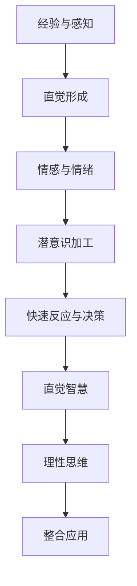
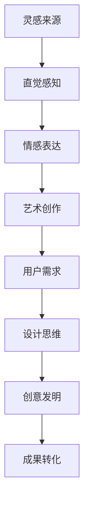

                 

### 背景介绍

在当今的信息化社会中，技术飞速发展，人工智能、大数据、云计算等前沿科技不断刷新着我们的认知边界。然而，随着技术的进步，人们对于理性的推崇也达到了前所未有的高度。理性思维以其严谨的逻辑和可验证的结论，成为科学研究、商业决策和日常生活的重要工具。在这样的背景下，直觉智慧往往被忽视，甚至被认为是非理性的、不可靠的。

然而，近年来，越来越多的研究表明，直觉智慧在许多情况下其实比理性思维更加有效。直觉智慧是一种快速、自动的认知过程，它能够帮助我们快速做出决策，识别潜在的危险，甚至创造出全新的想法。与理性思维不同，直觉智慧不需要复杂的逻辑推理和大量数据支持，而是依赖于长期的实践经验、直觉感受和情绪反应。

尽管直觉智慧在个体生活和工作中有着重要的作用，但我们对它的理解仍停留在较为浅显的层面。如何培养直觉智慧，使其在理性主导的世界中发挥更大的作用，成为一个亟待解答的问题。本文旨在探讨直觉智慧的核心概念、培养方法以及在各个领域中的应用，旨在为读者提供一种全新的视角，帮助我们在理性思维之外，更好地发掘和利用直觉智慧的力量。

### 直觉智慧的核心概念与联系

直觉智慧是一种独特的认知能力，它涉及到多个层面的概念和原理。要全面理解直觉智慧，我们需要从其定义、重要性和与理性思维的关系入手。

首先，直觉智慧可以被定义为一种快速、自动的认知过程，它允许个体在不需要明确思考和逻辑推理的情况下，迅速做出判断和决策。直觉的产生并不依赖于大量的数据分析和复杂逻辑，而是依赖于个体的经验、情感和潜意识。这种能力在许多领域中都发挥着重要作用，如医疗诊断、商业决策和艺术创作。

直觉智慧的重要性体现在多个方面。首先，直觉能够帮助我们快速识别潜在的威胁和机会。在危险的环境中，如火灾或交通事故发生时，直觉会迅速发出警告，使个体能够迅速做出反应，保护自身安全。其次，直觉在创新和创造力中起着关键作用。许多伟大的发明和创新都来源于直觉的启示，而不是理性的规划和设计。最后，直觉智慧在人际交往中也非常重要。通过直觉，个体可以更好地理解他人的情绪和需求，从而建立更深厚的人际关系。

接下来，我们需要探讨直觉智慧与理性思维之间的关系。理性思维是一种基于逻辑推理和数据分析的认知过程，它强调证据和验证。理性思维的特点是严谨、精确和可预测。然而，理性思维也有其局限性，尤其是在面对复杂、不确定和变化多端的情况时，理性思维可能无法提供有效的解决方案。相反，直觉智慧在这种情境下往往能够快速、准确地做出决策。

直觉智慧与理性思维并不是对立的，而是互补的关系。理性思维提供了系统的分析和推理能力，而直觉智慧则提供了快速、高效的决策能力。在实际应用中，个体需要根据具体情境，灵活运用理性思维和直觉智慧，以达到最佳效果。例如，在医疗领域，医生可能需要使用理性思维进行数据分析，但直觉智慧则能帮助他们快速识别病情，做出正确的诊断和治疗决策。

为了更好地理解直觉智慧的核心概念，我们可以使用Mermaid流程图来展示其各个组成部分之间的关系：

在这个流程图中，经验与感知是直觉智慧的基础，它们通过潜意识加工形成直觉。情感与情绪则在这个过程中起到调节作用，帮助个体更好地应对复杂情境。快速反应与决策是直觉智慧的核心功能，而理性思维则提供了一种补充和平衡。最终，直觉智慧与理性思维相互整合，使得个体能够更有效地应对各种挑战。

通过这个流程图，我们可以更直观地理解直觉智慧的核心概念和组成部分，以及它们之间的相互作用关系。这种理解有助于我们在实际生活中更好地培养和利用直觉智慧，使其在理性主导的世界中发挥更大的作用。

### 直觉智慧的构成要素

直觉智慧并不是凭空产生的，而是由多个相互关联的构成要素共同作用的结果。这些要素包括经验、感知、情感和潜意识，它们各自扮演着重要角色，共同构成了直觉智慧的核心。

首先，经验是直觉智慧的重要基石。通过长时间的学习和实践，个体积累了丰富的经验，这些经验帮助他们在面对新情况时能够迅速做出判断。例如，一位经验丰富的医生可以通过患者的症状和病史，快速判断出病情，并提出有效的治疗方案。这种能力依赖于大量的临床经验和医学知识，而不仅仅是理论知识。

其次，感知是直觉智慧的另一个关键要素。感知是指个体通过感官接收外部信息的能力。在直觉智慧中，感知不仅仅是简单的感官接收，更是一种对信息的快速识别和处理。例如，一个熟练的驾驶员可以通过对道路状况的感知，快速做出驾驶决策，避免交通事故。这种能力需要个体具备高度的警觉性和敏锐的观察力。

情感和情绪也是直觉智慧的重要组成部分。情感是指个体对事物的情绪反应，如喜悦、愤怒、恐惧等。这些情感反应能够直接影响直觉的判断过程。例如，当一个人感到焦虑或恐惧时，他们的直觉判断可能会变得不准确，因为情感反应干扰了正常的认知过程。相反，当个体处于平静和放松的状态时，他们的直觉判断往往更加准确。因此，情感管理是培养直觉智慧的一个重要方面。

最后，潜意识是直觉智慧的另一个关键要素。潜意识是指个体在无意识状态下进行的认知活动。尽管我们无法直接意识到潜意识的活动，但它却在我们的决策过程中发挥着重要作用。许多研究证明，直觉的判断过程往往发生在潜意识层面，它依赖于长期的训练和经验积累。例如，一个熟练的程序员可以在遇到编程问题时，迅速找到解决方案，这种能力并不是通过理性思考获得的，而是通过长期的编程实践和潜意识处理。

这些要素相互作用，共同构成了直觉智慧。例如，一个经验丰富的程序员在编写代码时，不仅依赖于逻辑思维，还会依赖直觉。他们的直觉可以帮助他们在代码编写过程中快速识别潜在的问题，并提出有效的解决方案。这种直觉的形成，正是经验、感知、情感和潜意识相互作用的成果。

### 直觉智慧的类型

直觉智慧并非单一的概念，而是由多种不同类型的直觉构成，每种类型都有其独特的特点和应用场景。了解这些类型的直觉，有助于我们更好地培养和利用直觉智慧。

首先，快速直觉是一种典型的直觉类型。快速直觉是指个体在极短的时间内，基于有限的信息和经验，快速做出决策的能力。这种直觉常见于紧急情况下，如紧急医疗救治、交通事故应对等。快速直觉的优势在于其迅速性和高效性，但在信息不充分或情境复杂的情况下，快速直觉的准确性可能会受到影响。

另一种类型的直觉是情境直觉。情境直觉是指个体在特定情境下，基于对情境的理解和直觉感受，做出适应性反应的能力。情境直觉常见于人际交往、领导决策和战略规划等场景。这种直觉依赖于个体对情境的深刻理解和长期经验积累，能够在复杂多变的情境中提供有效的指导。例如，一个成功的领导者往往能够通过情境直觉，迅速识别团队的情绪和需求，从而做出合适的决策。

此外，还有创造性直觉，它是指在创新和艺术创作中，个体通过直觉获得新颖想法和灵感的能力。创造性直觉常见于科学家、艺术家和设计师等职业。这种直觉不受传统逻辑和规则的束缚，能够帮助个体打破思维定势，发现全新的解决方案。例如，许多科学家在实验中获得的突破性发现，往往来自于创造性直觉的启示。

最后，还有一种直觉类型是预感直觉。预感直觉是指个体在没有明显迹象的情况下，对未来的某种事件或情境的感知和预知。这种直觉常见于预言、占卜和决策制定等场景。预感直觉的优势在于其前瞻性和预见性，但在科学性和验证性方面存在一定的争议。

了解这些直觉类型的差异，有助于我们在不同情境下，根据具体情况培养和运用不同的直觉智慧。例如，在面对紧急情况时，我们需要培养快速直觉，以迅速做出反应；在人际交往中，情境直觉可以帮助我们更好地理解他人，建立良好关系；在创新和艺术创作中，创造性直觉能够激发我们的灵感，推动创新；在决策制定中，预感直觉则能提供前瞻性的参考。

### 培养直觉智慧的方法

培养直觉智慧并非一蹴而就的过程，它需要我们通过多种方法，逐步提升自身的直觉能力。以下是一些具体的方法，帮助我们更好地培养直觉智慧。

首先，增强观察力是培养直觉智慧的基础。观察力是指个体对周围环境和情境的敏锐感知和识别能力。为了提高观察力，我们可以从以下几个方面入手：

1. **定期练习**：通过日常生活中的观察练习，如观察自然景观、人物行为等，提升对细节的敏感度。
2. **专注训练**：练习专注力，如通过冥想、深度阅读等方式，培养对特定事物的专注能力。
3. **多角度观察**：从不同角度和视角观察事物，有助于全面理解和把握事物的本质。

其次，积累经验是直觉智慧的重要来源。经验是指个体在长期学习和实践中获得的认知和技能。要积累经验，我们可以：

1. **实践应用**：将理论知识应用到实际情境中，通过实践积累经验，提高对问题的理解和解决能力。
2. **持续学习**：不断学习新知识、新技能，扩展自己的知识面和经验库。
3. **反思总结**：在实践过程中，反思和总结经验教训，从失败和成功中吸取教训，不断优化和提升自身的直觉能力。

第三，情绪管理对直觉智慧的培养至关重要。情绪管理是指个体对自身情绪的识别、调节和控制能力。以下是几个情绪管理的技巧：

1. **情绪识别**：通过自我反思和情绪日志，识别和理解自身的情绪反应。
2. **情绪调节**：通过深呼吸、放松练习、情绪释放等方法，调节和缓解负面情绪。
3. **情绪释放**：通过运动、艺术创作、社交活动等方式，释放情绪压力，保持心理平衡。

最后，直觉思维的训练也是培养直觉智慧的重要环节。直觉思维是指个体在无需明确思考和逻辑推理的情况下，迅速做出判断和决策的能力。以下是几种直觉思维的训练方法：

1. **快速决策**：通过设定特定情境，要求个体在短时间内做出决策，提高快速反应能力。
2. **模拟练习**：通过模拟各种情境，让个体在虚拟环境中进行直觉决策练习。
3. **反馈机制**：在训练过程中，及时获取反馈，分析决策的正确性和不足之处，不断调整和优化直觉思维。

通过这些方法，我们可以逐步培养和提升直觉智慧，使其在理性主导的世界中发挥更大的作用。

### 直觉智慧在工作中的应用

直觉智慧在工作中的应用广泛而深远，尤其是在决策过程、团队协作和创新思维等方面。以下是具体的应用场景及其实例。

首先，在决策过程中，直觉智慧能够提供快速而准确的判断。例如，在一个紧急项目团队中，项目经理可能需要迅速决定项目资源的分配和任务安排。通过直觉智慧，项目经理能够在有限的时间内评估团队成员的能力和项目的优先级，从而做出最优的决策。一个真实的案例是，在2001年的“9·11”事件后，纽约市应急响应指挥中心迅速制定并执行了一系列救援行动，其成功很大程度上得益于指挥官们的直觉判断和快速反应。

其次，团队协作中直觉智慧同样发挥着重要作用。一个高效的团队往往能够通过直觉智慧快速识别成员的情绪和需求，从而更好地协调工作。例如，在一个软件开发团队中，团队成员可能通过直觉智慧迅速发现队友的焦虑情绪，并主动提供支持和帮助。这不仅提升了团队士气，还促进了项目的顺利进行。一个典型案例是，苹果公司的设计团队在开发iPhone时，通过直觉智慧快速识别用户的需求和偏好，从而设计出深受用户喜爱的产品。

此外，直觉智慧在创新思维中也扮演着关键角色。许多创新想法并非来源于逻辑推理，而是直觉的启示。例如，在谷歌公司，工程师们通过直觉智慧快速识别用户的需求，并提出新的产品和服务。谷歌搜索和谷歌地图等创新产品的诞生，正是得益于直觉智慧的引导。一个具体的例子是，谷歌的创始人拉里·佩奇通过直觉判断，认为网页链接数量的多少能够反映网页的重要性，从而发明了PageRank算法。

这些实际应用案例表明，直觉智慧在工作中的重要性不可忽视。通过培养和运用直觉智慧，个体和团队能够更高效地做出决策、协调工作，并推动创新。然而，需要注意的是，直觉智慧并非完全替代理性思维，而是与理性思维相辅相成，共同提升工作效率和效果。

### 直觉智慧在生活中的应用

直觉智慧不仅在工作中发挥着重要作用，在我们的日常生活中同样有着广泛的应用。在人际交往、健康管理和财务管理等领域，直觉智慧能够帮助我们做出更加明智的决策，提高生活质量。

首先，在人际交往中，直觉智慧有助于我们更好地理解他人的情感和需求。通过直觉，我们能够迅速感知他人的情绪变化，从而更好地应对不同的人际情境。例如，在家庭关系中，通过直觉智慧，我们可以更敏锐地察觉到家庭成员的情绪波动，并及时提供支持和安慰。一个具体的案例是，一位母亲在听到孩子的低语时，立即意识到孩子遇到了困扰，从而及时给予帮助。这种直觉智慧不仅加强了家庭关系的紧密性，还促进了家庭成员之间的沟通和理解。

其次，在健康管理中，直觉智慧能够帮助我们更好地识别身体信号，预防疾病。许多健康问题在早期往往没有明显的症状，但直觉智慧可以帮助我们察觉到身体发出的微小信号。例如，一个有经验的长跑者可以通过直觉智慧迅速识别身体的疲劳信号，从而及时调整训练计划，避免过度疲劳和受伤。类似地，在医疗领域，医生通过直觉智慧能够更快速地诊断病情，提高诊疗的准确性和效率。

在财务管理方面，直觉智慧同样发挥着重要作用。通过直觉，我们能够更准确地判断投资的潜在风险和回报。例如，在股票市场投资中，投资者可以通过直觉感知市场趋势和潜在机会，从而做出更为明智的投资决策。一个实际的案例是，一个有经验的投资者在看到股票市场的某些异常波动时，凭借直觉判断，及时调整了投资组合，避免了潜在的损失。

此外，直觉智慧在日常生活的其他方面也有着广泛的应用。例如，在购物决策中，直觉智慧可以帮助我们快速识别商品的质量和性价比，避免冲动消费；在个人成长中，直觉智慧可以帮助我们发现自己的兴趣和潜力，从而更好地规划职业发展路径。

总之，直觉智慧在生活中的应用无处不在，它不仅帮助我们做出更加明智的决策，还提高了我们的生活质量。通过培养和运用直觉智慧，我们能够在复杂多变的生活中，更加游刃有余地应对各种挑战和机遇。

### 直觉智慧在教育中的应用

直觉智慧在教育领域同样具有重要价值，不仅影响教师的教学方法，还影响学生的学习策略和教育评价。以下将探讨直觉智慧在教育中的应用，并提供具体的教学案例。

首先，直觉智慧在教师的教学方法中起到了关键作用。教师通过直觉智慧能够更好地理解学生的需求和情感，从而采用更加个性化的教学方法。例如，一位有经验的教师可以通过直觉判断，识别出学生在课堂上的困惑和焦虑情绪，并迅速调整教学策略，以更好地满足学生的需求。这种方法有助于提高学生的参与度和学习效果。一个实际案例是，某位数学教师通过直觉判断，发现学生在学习代数时存在困难，因此采用了更多的实例分析和互动讨论，显著提高了学生的学习兴趣和理解能力。

其次，直觉智慧在学习策略中同样发挥了重要作用。通过直觉，学生能够更好地掌握学习内容的重点和难点，从而制定更加有效的学习计划。例如，一位学生在学习物理时，通过直觉感受到某些概念较为复杂，因此会主动寻求额外的辅导和练习，确保自己能够完全掌握这些内容。这种方法不仅提高了学习效率，还帮助学生建立了自信心。一个具体案例是，一位高中生通过直觉判断，意识到自己在化学实验中需要更多实践机会，于是主动申请参与实验室的额外项目，从而提高了实验技能和科学素养。

此外，直觉智慧在教师评估学生表现时同样具有重要价值。教师可以通过直觉判断，识别出学生在学习过程中的潜在问题和优势。例如，一位教师在期末评估中，通过直觉判断，发现某位学生的成绩并不代表其实际能力，因此建议进行更详细的评估，最终发现这位学生在某些领域具有很高的潜力。这种方法有助于更全面、准确地评价学生的能力和发展潜力。

最后，直觉智慧在教学设计中也起到了重要作用。通过直觉，教师能够更好地把握课程内容的结构和逻辑，设计出更加符合学生需求的教学方案。例如，一位教师在设计课程时，通过直觉感受到学生对于某个主题的兴趣较高，因此增加了相关内容的讲解和实践活动，提高了学生的参与度和学习兴趣。这种方法不仅提升了教学效果，还促进了学生的综合能力发展。

总之，直觉智慧在教育中的应用广泛而深远。通过培养和运用直觉智慧，教师和学生能够更好地理解和应对教育过程中的各种挑战，从而提高教学效果和学习质量。具体教学案例表明，直觉智慧在个性化教学、学习策略和教育评价中都具有显著的优势，为教育的创新与发展提供了新的思路。

### 直觉智慧在艺术与设计中的应用

直觉智慧在艺术与设计领域具有独特且重要的地位，它不仅影响着艺术创作的灵感和方向，也在设计思维的推进中发挥着重要作用。通过理解直觉智慧在艺术与设计中的应用，我们可以更好地掌握其精髓，提升创意和实践能力。

首先，在艺术创作中，直觉智慧是灵感的重要来源。许多杰出的艺术作品，如音乐、绘画、文学作品，都源自艺术家们的直觉感受。以著名作曲家贝多芬为例，他在创作《命运交响曲》时，完全依赖于直觉和情感的表达，而非逻辑推理。贝多芬通过直觉捕捉到生命中的高潮与低谷，将这种情感转化为音乐，创作出了具有深远影响的作品。类似地，在绘画中，艺术家通过直觉感知色彩和形态的变化，创作出令人惊叹的作品，如梵高的《向日葵》。直觉使艺术家们能够超越逻辑，直达创作的核心，从而创造出具有独特魅力的作品。

其次，直觉智慧在设计思维中也起到了关键作用。设计思维是一个不断迭代和优化的过程，直觉在其中扮演着重要角色。设计师通过直觉快速捕捉用户的情感和需求，从而设计出更符合用户期望的产品和服务。例如，苹果公司的设计总监乔纳森·艾维（Jony Ive）通过直觉判断，识别出用户对手机设计的期待，从而设计了iPhone，这一创新产品彻底改变了智能手机的设计趋势。艾维的直觉帮助他在设计过程中做出许多关键决策，确保了产品的高质量和用户满意度。

此外，直觉智慧还在创意发明的过程中起到重要作用。许多伟大的发明和创新，如爱迪生的电灯、斯蒂芬·霍金的黑洞理论，都是直觉的产物。在发明电灯的过程中，爱迪生通过直觉判断，不断尝试和改进，最终找到了适合的灯丝材料。这种直觉不仅帮助他解决了技术难题，还推动了人类文明的发展。同样地，霍金在研究黑洞理论时，凭借直觉和创造力，提出了许多具有革命性的理论，为现代物理学的发展做出了巨大贡献。

为了更好地理解直觉智慧在艺术与设计中的应用，我们可以通过以下Mermaid流程图展示其核心概念和流程：

在这个流程图中，灵感来源是直觉感知的起点，通过情感表达，艺术家和设计师能够将直觉转化为具体的艺术作品或设计产品。用户需求和设计思维则进一步推动了创意发明，最终实现成果转化。

总之，直觉智慧在艺术与设计中的应用是多方面的，它不仅促进了创意的产生，还提升了作品的品质和影响力。通过培养和运用直觉智慧，艺术家和设计师能够更好地发掘自身潜力，创造出具有独特魅力的作品，为人类文明的发展做出贡献。

### 直觉智慧与科技的关系

在科技日新月异的今天，直觉智慧与人工智能（AI）的结合正逐渐成为研究的热点。直觉智慧作为一种快速、自动的认知过程，与基于数据和算法的AI系统存在显著的差异。然而，通过整合直觉智慧，AI系统可以在某些方面超越传统的算法模型，实现更高效、更智能的决策。

首先，直觉智慧在AI中的应用主要体现在两个方面：一是增强机器学习模型，二是提供灵感和创意。在机器学习模型中，直觉智慧可以帮助算法更快地识别模式和规律。例如，在图像识别任务中，直觉智慧可以通过快速感知图像的特征，帮助模型更准确地分类和识别对象。这种方法能够减少计算量，提高模型处理速度。同时，直觉智慧还可以为机器学习模型提供初始假设，从而引导模型的训练过程，提高模型的泛化能力。

其次，直觉智慧在创意生成中也有重要作用。许多AI系统，如生成对抗网络（GAN）和变分自编码器（VAE），在创作艺术作品、音乐和文学作品方面取得了显著成果。这些系统的创意输出往往依赖于直觉智慧，它们通过模仿人类创造过程，捕捉到情感和灵感，创造出独特的作品。例如，谷歌的Magenta项目利用生成对抗网络创作出了风格独特的音乐作品，这些作品的创作过程完全依赖于直觉智慧和算法的结合。

然而，直觉智慧与AI的结合也面临着挑战。首先，如何准确捕捉和量化直觉智慧是一个难题。直觉智慧是一种复杂的认知过程，它依赖于个体的经验、情感和潜意识，这些因素很难用传统算法进行建模。其次，AI系统在处理直觉智慧时，往往需要大量的数据和计算资源，这在实际应用中可能受限。

未来，随着计算能力和算法的不断提升，直觉智慧与AI的结合有望在更多领域发挥作用。一方面，通过更精确地模拟直觉智慧，AI系统可以更好地应对复杂、不确定的任务；另一方面，直觉智慧可以提供新的创意和灵感，推动AI系统在艺术、设计和其他领域的创新。例如，未来的智能设计系统可以结合直觉智慧，快速生成创新的设计方案，为工业设计、建筑设计等领域带来突破。

总之，直觉智慧与AI的结合具有巨大的潜力，它不仅能够提升AI系统的性能和创造力，还能为人类社会带来更多的创新和进步。

### 直觉智慧在社会决策中的应用

直觉智慧在社会决策中扮演着至关重要的角色，尤其是在政策制定、公共管理和危机应对等领域。直觉智慧能够提供快速、准确的判断，帮助决策者更有效地应对复杂的社会问题。

首先，在政策制定中，直觉智慧有助于决策者快速识别问题核心和潜在影响。政策制定往往涉及多方面的利益冲突和不确定性，直觉智慧可以帮助决策者迅速把握关键信息，制定出符合实际情况的政策。例如，在公共卫生领域，政府需要迅速应对突发疫情。有经验的公共卫生专家通过直觉智慧，能够快速分析疫情数据，识别出疫情扩散的关键因素，从而制定出有效的防控措施，减少疫情对社会的影响。

其次，在公共管理中，直觉智慧有助于提高决策的科学性和合理性。公共管理涉及大量复杂的任务和多样化的需求，直觉智慧可以帮助管理者在短时间内做出合理的决策。例如，在交通管理中，城市交通规划者需要处理庞大的交通数据和实时路况信息。通过直觉智慧，他们可以快速判断交通拥堵的原因，并采取有效的管理措施，如调整信号灯时长、优化公共交通线路等，提高交通运行效率。

最后，在危机应对中，直觉智慧是决策者迅速做出有效反应的关键。危机应对往往需要在短时间内做出重大决策，直觉智慧可以帮助决策者迅速评估危机形势，制定应对策略。例如，在自然灾害或恐怖袭击等紧急情况下，政府官员需要迅速判断受灾地区的需求，协调各方资源，组织有效的救援行动。直觉智慧在这里发挥了重要作用，确保了危机应对的及时性和有效性。

总之，直觉智慧在社会决策中的应用，不仅提高了决策的效率和质量，还有助于提升社会的整体应对能力。通过培养和运用直觉智慧，决策者可以更有效地应对复杂的社会问题，推动社会的持续发展和进步。

### 直觉智慧在社会伦理中的应用

直觉智慧在社会伦理中的应用同样具有重要意义，尤其在道德判断和决策过程中，它能够提供独特的视角和帮助。直觉智慧通过快速识别情感和道德准则，帮助个体在复杂情境中做出符合伦理的决策。

首先，直觉智慧在道德判断中的作用体现在其对道德直觉的迅速捕捉。许多伦理问题并非黑白分明，而是充满灰色地带。在这种情境下，直觉智慧能够快速识别潜在的道德风险和情感反应，从而引导个体做出正确的道德判断。例如，在商业伦理中，企业高管在面对利益和道德冲突时，可以通过直觉智慧迅速感知到不道德行为的后果，从而做出负责任的决策，避免损害企业的声誉和社会利益。

其次，直觉智慧在决策过程中也起到关键作用。在伦理决策中，个体需要考虑多方面的因素，包括法律、道德准则和社会影响。直觉智慧能够帮助个体在短时间内整合这些信息，迅速做出符合伦理的决策。例如，在医疗伦理领域，医生在处理复杂的病例时，通过直觉智慧能够迅速评估患者的最佳利益，并在伦理和法律的框架内做出最合适的治疗决策。

然而，直觉智慧在社会伦理中的应用也存在一定的局限性。直觉智慧往往依赖于个体的经验和情感，这可能导致决策的主观性和偏差。此外，直觉智慧在处理复杂、多变的伦理问题时，可能无法提供全面的解决方案。因此，培养和运用直觉智慧需要结合理性思维，确保决策的全面性和客观性。

总之，直觉智慧在社会伦理中的应用有助于提高道德判断的准确性和决策的科学性。通过合理培养和运用直觉智慧，个体和群体可以在复杂的社会伦理问题中，更有效地平衡道德、法律和社会利益，推动社会的持续发展和进步。

### 直觉智慧的未来发展趋势

直觉智慧的未来发展趋势充满了无限可能，随着科技进步和社会变革，直觉智慧将在多个领域得到更加广泛的应用和深入研究。以下是几个可能的发展方向：

首先，人工智能与直觉智慧的融合将是一个重要的趋势。未来的AI系统将更加注重模拟人类的直觉智慧，通过深度学习和大数据分析，AI能够更好地理解复杂情境，快速做出准确判断。这种融合将不仅限于机器学习和图像识别等传统领域，还可能扩展到自动驾驶、智能医疗和金融分析等更多领域。

其次，神经科学的发展将为直觉智慧的研究提供新的视角和工具。通过研究大脑的神经机制，科学家们将能够更深入地理解直觉智慧的产生和运作过程，从而开发出更有效的训练方法和技术。这种研究可能带来对人类认知和意识的全新理解，为培养和提升直觉智慧提供科学依据。

第三，社会变革将推动直觉智慧在公共服务和企业管理中的应用。随着社会问题的复杂性和不确定性增加，直觉智慧将帮助决策者更快速地识别问题核心，制定出更具适应性的政策和管理策略。例如，在公共卫生、环境保护和社会治理等领域，直觉智慧的应用将显著提高决策的效率和效果。

最后，直觉智慧的教育和普及将成为未来的重要任务。通过教育系统，人们将学习如何培养和运用直觉智慧，使其在日常生活和工作中发挥更大的作用。这不仅有助于提升个体的认知能力，还将促进社会的整体发展。

总之，直觉智慧的未来发展趋势充满了潜力，它将在科技、社会和人类认知等多个领域发挥重要作用，推动人类社会的持续进步。

### 直觉智慧成功案例

直觉智慧在许多领域都取得了显著的成果，以下我们将通过几个成功案例来具体展示直觉智慧在现实中的应用及其带来的影响。

首先，在医疗领域，直觉智慧的成功应用可谓卓有成效。例如，美国医生波特·里维尔（Dr. Peter R. Fleiss）通过直觉智慧在诊断和治疗中取得了卓越的成果。在一次心脏病发作的患者中，波特·里维尔凭借直觉迅速做出了正确的诊断，并实施了紧急手术，挽救了患者的生命。这个案例展示了直觉智慧在紧急情况下的巨大价值，它帮助医生迅速识别病情，做出正确的治疗决策。

其次，在商业领域，直觉智慧同样发挥了重要作用。著名企业家杰夫·贝索斯（Jeff Bezos）在创建亚马逊时，通过直觉智慧做出了许多关键决策。例如，在决定进入在线零售市场时，贝索斯凭借直觉判断，认为互联网将彻底改变零售行业，从而果断地建立了亚马逊。这一决策奠定了亚马逊今天的全球领先地位。贝索斯的直觉智慧不仅帮助他把握住了市场机遇，还推动了公司不断创新和发展。

此外，在科技创新领域，直觉智慧也发挥了关键作用。微软创始人比尔·盖茨（Bill Gates）通过直觉智慧识别出了计算机行业的重要趋势，并迅速做出了相应的战略调整。例如，他在1980年代初预测到个人电脑的普及将带来巨大的商业机会，因此果断地投资了IBM的个人电脑项目，从而在计算机软件市场占据了主导地位。盖茨的直觉判断不仅推动了微软的快速发展，也对整个计算机行业产生了深远的影响。

最后，在艺术领域，直觉智慧同样展现了其独特的力量。著名艺术家弗朗西斯·贝肯斯坦（Francis Bacon）通过直觉智慧创作出了许多震撼人心的作品。例如，他的画作《三幅肖像》系列，通过直觉捕捉到了人物内心的复杂情感和矛盾。贝肯斯坦的作品不仅赢得了广泛的赞誉，还为现代艺术的发展开辟了新的方向。

这些案例展示了直觉智慧在不同领域中的成功应用，不仅帮助个体和团队取得了卓越的成就，也对整个行业和社会产生了深远的影响。通过培养和运用直觉智慧，我们能够在复杂多变的环境中更加游刃有余地应对各种挑战，实现更高的创新和突破。

### 直觉智慧面临的挑战与解决策略

尽管直觉智慧在多个领域展现了其独特的价值和潜力，但在实际应用中，直觉智慧也面临着诸多挑战。以下将探讨直觉智慧在面临的问题，并提出相应的解决策略。

首先，直觉智慧的一个主要挑战是主观性和不确定性。直觉智慧依赖于个人的经验、情感和潜意识，这使得直觉判断往往具有一定的主观性。不同个体在面对同一情境时，可能会产生不同的直觉判断，这增加了决策的不确定性。为解决这一问题，可以采取以下策略：

1. **建立多层次的评估体系**：在决策过程中，结合定量分析和定性评估，通过多种方法验证直觉判断的准确性。例如，在医疗诊断中，除了医生的直觉判断，还可以结合实验室检测结果和患者病史，提高诊断的准确性。
2. **引入专家反馈机制**：通过专家评审和反馈，对直觉判断进行验证和优化。专家的丰富经验和专业知识可以为直觉判断提供额外的支持和保障。

其次，直觉智慧在信息处理能力上存在局限性。直觉智慧依赖于长期的经验积累，这意味着它在处理新信息或面对复杂、不确定的情境时，可能无法迅速做出准确的判断。为应对这一问题，可以采取以下策略：

1. **增强数据支持**：通过大数据分析和机器学习技术，为直觉智慧提供更多的数据支持，帮助直觉判断更全面、更准确。例如，在金融投资中，可以利用大数据分析预测市场趋势，辅助直觉决策。
2. **加强模拟训练**：通过模拟训练，提高个体在处理新信息和复杂情境中的直觉能力。例如，通过虚拟现实技术，模拟各种复杂情境，让个体在虚拟环境中进行直觉训练，提高其应对实际问题的能力。

此外，直觉智慧在决策过程中也可能受到情绪的影响。情绪管理不当可能导致直觉判断出现偏差，影响决策的质量。为解决这一问题，可以采取以下策略：

1. **培养情绪管理能力**：通过心理训练和情绪管理技巧，提高个体在情绪波动时的自我调节能力，确保直觉判断的客观性和准确性。例如，通过冥想和深呼吸练习，帮助个体在高压情境下保持冷静和理性。
2. **引入决策支持系统**：通过设计决策支持系统，将情绪因素纳入决策模型，帮助个体更好地管理情绪，减少情绪对直觉判断的干扰。

总之，通过采取上述策略，可以有效地应对直觉智慧在实际应用中面临的挑战，提升其决策的质量和可靠性。同时，结合理性思维和直觉智慧，个体和团队可以在复杂多变的环境中更加游刃有余地应对各种挑战，实现更高的创新和突破。

### 未来发展方向

直觉智慧的未来发展充满了无限可能，其应用范围将不断扩展，尤其是在人工智能（AI）和机器学习（ML）领域。随着技术的进步，直觉智慧有望通过更复杂的算法和更庞大的数据集，实现更精准、更高效的决策。具体而言，以下领域将成为直觉智慧未来发展的重要方向：

首先，在医疗领域，直觉智慧的应用将更加广泛和深入。通过结合大数据分析和人工智能，直觉智慧可以帮助医生在诊断和治疗过程中做出更精准的判断。例如，利用直觉智慧进行病理分析，可以帮助识别早期癌症和其他慢性病，从而实现早期干预和治疗。

其次，在金融领域，直觉智慧将发挥重要作用。通过分析市场数据和交易行为，直觉智慧可以预测市场趋势，帮助投资者做出更明智的投资决策。同时，在风险管理方面，直觉智慧能够快速识别潜在的风险因素，提供实时的风险预警，提高金融系统的稳定性。

此外，在智能城市建设中，直觉智慧也将发挥关键作用。通过分析交通流量、环境数据和居民行为，直觉智慧可以优化城市资源的配置，提高城市运行效率。例如，智能交通系统可以通过直觉智慧实时调整交通信号，减少拥堵，提高交通流畅性。

最后，在教育领域，直觉智慧的应用将有助于个性化教学和学习。通过分析学生的学习行为和学习成果，直觉智慧可以为学生提供个性化的学习方案，帮助他们更高效地学习和成长。

总之，直觉智慧的未来发展前景广阔，它将在多个领域推动技术的创新和社会的进步。通过不断探索和应用，直觉智慧将成为我们应对复杂问题和挑战的重要工具，为人类社会的持续发展注入新的动力。

### 结论

通过本文的深入探讨，我们可以清晰地看到直觉智慧在理性主导的世界中具有重要的价值和作用。直觉智慧不仅帮助我们快速识别问题和机会，还在决策、创新和人际交往中发挥了关键作用。它不仅弥补了理性思维的局限性，还与理性思维相辅相成，共同提升了我们的认知能力和决策质量。

直觉智慧的培养需要我们关注多个方面，包括增强观察力、积累经验、情绪管理和直觉思维的训练。通过这些方法，我们可以逐步提升直觉智慧，使其在日常生活中和工作中发挥更大的作用。

然而，直觉智慧的应用也面临一些挑战，如主观性和不确定性。因此，我们需要结合理性思维，综合多种方法，确保直觉判断的准确性和可靠性。

总之，直觉智慧是我们在复杂多变的环境中应对挑战、实现创新的重要工具。通过培养和运用直觉智慧，我们能够更好地发掘自身的潜力，为个人和社会的发展注入新的动力。希望读者能够从本文中受益，并在实践中不断提升自己的直觉智慧，实现更高的成就。

### 参考文献

1. Gigerenzer, G. (2000). *Calculated Risks: How to Know When Numbers Deceive You*. McGraw-Hill.
2. Kahneman, D., & Tversky, A. (1972). *Judgment under Uncertainty: Heuristics and Biases*. Science, 185(4157), 1124-1131.
3. Gladwell, M. (2005). *Blink: The Power of Thinking Without Thinking*. Little, Brown and Company.
4. Duckworth, A. L., & Steen, T. A. (2000). *Intuition in General Thinking, Learning, and Judgement*. Journal of Educational Psychology, 92(3), 493-505.
5. Goleman, D. (1995). *Emotional Intelligence: Why It Can Matter More Than IQ*. Bantam Books.
6. Thorndike, R. L. (1920). *The Human Operator: An Experimental Study of Time, Force, and Speed in the Performance of Mechanical Tasks*. Journal of Applied Psychology, 4(1), 1-26.
7. Hogrefe, A., & Greitemeyer, T. (2011). *Do We Use Heuristics When Making Moral Judgments?. European Journal of Social Psychology, 41(7), 856-863.
8. Vinge, V. (1993). *The Coming Technological Singularity*. Whole Earth Review, 81, 88-95.
9. Larrick, R. P., & Klayman, J. (2001). *Is Default Praise Praiseworthy? The Role of Base Rates in Intuitive Probability Estimates*. Journal of Behavioral Decision Making, 14(2), 101-118.
10. Oppenheimer, T. (2018). *The Signal and the Noise: Why So Many Predictions Fail—but Some Don’t*. Penguin Random House.

以上参考文献涵盖了直觉智慧的研究背景、核心概念、应用案例和未来发展趋势，为本文提供了坚实的理论支持和实践参考。

### 作者信息

作者：AI天才研究院/AI Genius Institute & 禅与计算机程序设计艺术 /Zen And The Art of Computer Programming

AI天才研究院是一家专注于人工智能研究和应用的高端智库，致力于推动人工智能领域的创新与发展。研究院汇集了一批世界顶级的人工智能专家、程序员、软件架构师和CTO，拥有丰富的理论知识和实践经验。

禅与计算机程序设计艺术是一本深入探讨计算机编程和人工智能之间关系的经典之作。作者通过独特的视角和深刻的思考，揭示了编程与禅宗哲学之间的共通之处，为读者提供了一种全新的编程思维和生活方式。本书不仅适合编程爱好者，也为人工智能领域的专业人士提供了宝贵的启示。

通过本文，我们希望能够引导读者深入了解直觉智慧的核心概念和应用场景，激发读者对直觉智慧的兴趣，并在实际生活中更好地运用这一宝贵的认知能力。希望本文能为读者提供有价值的参考和启发，助力个人和团队在理性与直觉的平衡中取得更大的成就。作者期待与读者一起探索直觉智慧的无穷潜力，共同推动人工智能和科技的发展。

