                 

# 《培育内在世界：滋养心灵的成长土壤》

> 关键词：内在世界、心灵成长、心理健康、自我认知、人际关系

> 摘要：本文将探讨内在世界的概念，心灵成长的重要性，以及心灵成长在个人生活和社会关系中的应用。通过详细解析内在世界的构成和心灵成长的方法与实践，我们旨在为读者提供一份全面的心灵成长指南，帮助他们在快节奏的生活中找到内心的平和与力量。

## 引言与核心概念

### 1.1 心灵成长的重要性

在现代社会，我们面临着前所未有的压力和挑战。工作压力、人际关系、自我价值感等因素常常让我们感到疲惫和困惑。然而，在这纷繁复杂的世界中，内心世界的平和与力量成为了我们追求幸福和成功的关键。心灵成长，作为个体发展的核心，不仅能够提升我们的心理健康，还能帮助我们更好地应对生活中的挑战。

### 1.2 内在世界的概念

内在世界是指我们内心深处的感受、思维和情感。它包含了我们的信念、价值观、愿望和恐惧。内在世界是我们行为和决策的根源，也是我们心灵成长的基础。

### 1.3 心灵成长的核心概念

心灵成长涉及自我认知、情感管理、自我接纳和自我实现等方面。通过心灵成长，我们能够更好地理解自己，提高心理韧性，建立积极的人际关系，并实现个人目标。

### 1.4 心灵成长与身心健康的关系

心灵成长与身心健康密切相关。良好的心理状态能够增强我们的免疫系统，降低患病风险，提高生活质量。同时，身心健康也是心灵成长的重要基础。

## 内在世界与心灵成长

### 2.1 内在世界的构成

内在世界由意识、潜意识、情感和记忆组成。意识是我们对外界信息的感知和理解，潜意识则包含了我们未曾意识到但影响我们行为的深层信念和记忆。情感和记忆则是内在世界的重要组成部分，它们影响着我们的情绪和行为。

### 2.2 心灵成长的基础

心灵成长的基础是自我认知。通过自我认知，我们能够了解自己的需求、欲望和恐惧，从而更好地管理自己的情绪和行为。

### 2.3 内在世界与心灵成长的关系

内在世界是心灵成长的土壤。只有当我们深入了解自己的内在世界，才能有效地进行心灵成长。内在世界的成长不仅能够提升我们的心理健康，还能帮助我们实现个人目标和追求幸福。

### 2.4 心灵成长的目标

心灵成长的目标是达到内心的平和与自由。通过心灵成长，我们能够更好地应对生活中的挑战，提高生活质量，实现个人目标和价值。

## 心灵成长的方法与实践

### 3.1 简单呼吸练习

呼吸是连接内在世界和外在世界的桥梁。通过简单的呼吸练习，我们能够放松身心，提高注意力，并进入冥想状态。

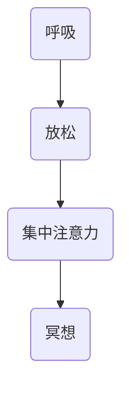

### 3.2 正念冥想

正念冥想是一种通过专注呼吸和身体感受来培养注意力、减少压力和提升心理韧性的方法。以下是正念冥想的伪代码：

```python
function 正念冥想():
    设置舒适的坐姿
    关闭眼睛
    感受自己的呼吸
    当心神不集中时，回到呼吸
    持续冥想10分钟
```

### 3.3 日记写作

日记写作是一种记录自己内心感受和思考的方法。通过日记写作，我们能够更好地了解自己，释放负面情绪，并记录心灵成长的轨迹。

### 3.4 身体运动

身体运动不仅能够改善身体健康，还能提升心理状态。通过身体运动，我们能够释放压力，增强心理韧性，并提高生活质量。

### 3.5 亲密关系与心灵成长

亲密关系是心灵成长的重要一环。通过建立健康的人际关系，我们能够获得情感支持，提高自我价值感，并促进心灵成长。

## 心灵成长与人际关系

### 4.1 建立健康的人际关系

建立健康的人际关系需要相互尊重、理解和支持。通过倾听、表达和沟通，我们能够建立积极的人际关系，提高生活质量。

### 4.2 情感沟通

情感沟通是建立健康人际关系的关键。通过表达自己的情感和需求，我们能够增强互信，减少冲突，并建立积极的人际关系。

### 4.3 解锁冲突与和解

冲突是人际关系中的常见问题。通过理解和沟通，我们能够解锁冲突，找到解决问题的方法，并实现和解。

### 4.4 拓展社交圈子

拓展社交圈子能够帮助我们结识新朋友，获得新的视角和经验，并促进个人成长。

## 心灵成长与心理健康

### 5.1 压力管理

压力是现代社会中的常见问题。通过学习压力管理技巧，我们能够更好地应对压力，保持心理健康。

### 5.2 应对焦虑与抑郁

焦虑和抑郁是影响心理健康的主要问题。通过心理治疗、药物治疗和自我调节，我们能够应对焦虑和抑郁，恢复心理健康。

### 5.3 增强自我价值感

增强自我价值感能够提高心理健康和生活质量。通过自我接纳、自我实现和与他人建立积极关系，我们能够增强自我价值感。

### 5.4 寻求专业帮助

在遇到心理健康问题时，寻求专业帮助是明智的选择。心理咨询师和治疗师能够提供有效的帮助和支持。

## 心灵成长与自我认知

### 6.1 自我认知的重要性

自我认知是心灵成长的基础。通过深入了解自己，我们能够更好地理解自己的需求、欲望和恐惧，从而实现个人成长。

### 6.2 探索自我

探索自我是心灵成长的过程。通过反思、自我觉察和内心探索，我们能够更好地了解自己，实现个人成长。

### 6.3 增强自我意识

增强自我意识能够帮助我们更好地管理自己的情绪和行为，提高生活质量。

### 6.4 持续自我成长

持续自我成长是实现心灵成长的关键。通过不断学习、反思和自我调整，我们能够实现个人目标和价值。

## 总结与未来展望

### 7.1 心灵成长的总结

通过心灵成长，我们能够提升心理健康，建立积极的人际关系，实现个人目标和价值。

### 7.2 面对未来挑战

在未来，随着社会的发展和科技的进步，我们将面临更多的挑战。通过心灵成长，我们能够更好地应对这些挑战。

### 7.3 持续的心灵成长之路

心灵成长是一个持续的过程。通过不断学习和实践，我们能够实现内心的平和与自由。

### 7.4 附录：心灵成长资源推荐

附录部分将提供一些心灵成长的相关资源和推荐，帮助读者在心灵成长的道路上不断前行。

作者：AI天才研究院/AI Genius Institute & 禅与计算机程序设计艺术 /Zen And The Art of Computer Programming

（注：本文仅为大纲结构，具体内容还需进一步丰富和细化。）## 第一部分：引言与核心概念

### 1.1 心灵成长的重要性

在现代社会，我们面临着前所未有的压力和挑战。工作压力、人际关系、自我价值感等因素常常让我们感到疲惫和困惑。然而，在这纷繁复杂的世界中，内心世界的平和与力量成为了我们追求幸福和成功的关键。心灵成长，作为个体发展的核心，不仅能够提升我们的心理健康，还能帮助我们更好地应对生活中的挑战。

#### 心灵成长对身心健康的影响

心灵成长与身心健康密切相关。一个健康的心理状态能够增强我们的免疫系统，降低患病风险，提高生活质量。研究表明，心理健康问题，如焦虑、抑郁和压力，不仅影响我们的生活质量，还可能导致身体疾病的发生。因此，心灵成长是实现身心健康的关键。

#### 心灵成长对社会关系的意义

心灵成长不仅对个体有益，还对人际关系产生深远影响。通过心灵成长，我们能够更好地理解自己，提高情感智力，建立积极的人际关系。一个心理健康的人能够更好地处理冲突，提供情感支持，并建立持久的人际网络。

#### 心灵成长在个人职业发展中的作用

在个人职业发展过程中，心灵成长也发挥着重要作用。一个心灵成熟的人能够更好地应对工作压力，保持积极心态，提高工作效率。此外，心灵成长还能帮助我们发掘自身潜力，实现职业目标和价值。

### 1.2 内在世界的概念

内在世界是指我们内心深处的感受、思维和情感。它包含了我们的信念、价值观、愿望和恐惧。内在世界是我们行为和决策的根源，也是我们心灵成长的基础。

#### 内在世界的构成

内在世界由多个层次组成：

1. **意识**：意识是我们对外界信息的感知和理解。它包括我们的思想、感受和体验。
2. **潜意识**：潜意识包含了我们未曾意识到但影响我们行为的深层信念和记忆。潜意识对我们的行为和决策具有深远影响。
3. **情感**：情感是内在世界的重要组成部分，包括喜悦、悲伤、愤怒等。情感影响着我们的心理状态和行为方式。
4. **记忆**：记忆是我们对过去经历的记录和存储。记忆影响着我们的自我认知和情感体验。

#### 内在世界的作用

内在世界是我们行为和决策的根源。它影响着我们的思维方式、情绪反应和行为模式。通过深入了解自己的内在世界，我们能够更好地理解自己，提高自我认知，实现心灵成长。

### 1.3 心灵成长的核心概念

心灵成长涉及多个方面，包括自我认知、情感管理、自我接纳和自我实现等。以下是这些核心概念的定义和联系：

1. **自我认知**：自我认知是指了解自己的过程。它包括了解自己的性格、价值观、优点和缺点等。自我认知是心灵成长的基础，有助于我们更好地理解自己，实现个人目标。
2. **情感管理**：情感管理是指处理自己和他人的情感。情感管理有助于我们更好地应对压力，保持心理健康。通过情感管理，我们能够提高情感智力，建立积极的人际关系。
3. **自我接纳**：自我接纳是指接受自己的全部，包括优点和缺点。自我接纳有助于我们摆脱自我批评和负面情绪，实现内心的平和与自由。
4. **自我实现**：自我实现是指实现个人目标和价值。自我实现是心灵成长的最终目标，有助于我们实现个人价值和幸福感。

### 1.4 心灵成长与身心健康的关系

心灵成长与身心健康密切相关。一个健康的心理状态能够增强我们的免疫系统，降低患病风险，提高生活质量。同时，身心健康也是心灵成长的重要基础。

#### 心理健康对身心健康的影响

心理健康对身心健康有直接影响。一个心理健康的人能够更好地应对压力，保持积极心态，提高生活质量。心理健康问题，如焦虑、抑郁和压力，不仅影响我们的生活质量，还可能导致身体疾病的发生。

#### 身心健康对心灵成长的影响

身心健康是心灵成长的基础。一个身心健康的人能够更好地进行自我认知、情感管理和自我接纳，实现个人目标和价值。

#### 心灵成长与身心健康的关系架构

心灵成长与身心健康的关系可以表示为一个循环过程：

1. **心理健康**：心理健康是心灵成长的基础。通过自我认知、情感管理和自我接纳，我们能够实现个人目标和价值，提高生活质量。
2. **身心健康**：身心健康有助于心理健康。一个身心健康的人能够更好地应对压力，保持积极心态，提高生活质量。
3. **心灵成长**：心灵成长促进心理健康和身心健康。通过持续的自我认知、情感管理和自我接纳，我们能够实现个人目标和价值，提高生活质量。

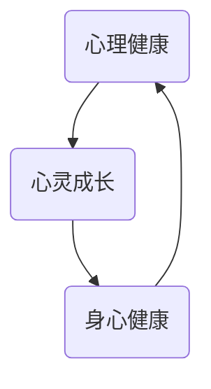

通过以上内容，我们了解了心灵成长的重要性、内在世界的概念及其与心灵成长的关系。接下来，我们将进一步探讨内在世界的构成和心灵成长的方法与实践。

## 第二部分：内在世界与心灵成长

### 2.1 内在世界的构成

内在世界是心灵成长的根基，了解其构成对于我们深入探索心灵成长至关重要。内在世界由多个层次和方面组成，包括意识、潜意识、情感和记忆等。以下是对这些组成部分的详细探讨：

#### 意识

意识是我们在某一时刻所能感知和理解的现实。它是我们对外界信息的感知、认知和思考的过程。意识包括我们的自我意识、思维过程和感受。自我意识是指我们对自己的认知，包括性格、能力、愿望和需求等。通过自我意识，我们能够了解自己的优势和不足，从而实现自我提升。

#### 潜意识

潜意识是那些我们未曾意识到，但仍然影响我们行为和决策的信念、记忆和情绪。潜意识包含了我们童年时期的经历、无意识的行为模式和深层的信念体系。潜意识对我们的思维、情感和行为有着深远的影响，有时候我们甚至无法完全控制它。然而，通过自我觉察和心灵成长，我们可以逐渐理解和控制潜意识。

#### 情感

情感是内在世界的重要组成部分，它们是我们对外界刺激的反应，包括喜悦、悲伤、愤怒、恐惧等。情感不仅影响着我们的心理健康，还影响着我们的行为和决策。情感管理是心灵成长的关键，它帮助我们理解自己的情绪，合理地表达情感，并有效地处理负面情绪。

#### 记忆

记忆是我们对过去经历的记录和存储。记忆影响着我们的自我认知、情感体验和行为模式。长期记忆和短期记忆共同构成了我们的人生经历，它们帮助我们学习、成长和适应环境。通过反思和回顾过去的记忆，我们可以从中汲取经验教训，实现自我提升。

### 2.2 心灵成长的基础

心灵成长的基础是自我认知和自我接纳。自我认知是指了解自己的过程，包括性格、价值观、优点和缺点等。自我认知是心灵成长的第一步，它帮助我们认识到自己的真实面貌，从而实现个人成长。自我接纳是指接受自己的全部，包括优点和缺点。自我接纳是心灵成长的基石，它帮助我们摆脱自我批评和负面情绪，实现内心的平和与自由。

#### 自我认知的重要性

自我认知是心灵成长的核心，它使我们能够深入了解自己的需求、愿望和恐惧。通过自我认知，我们能够明确自己的目标，制定合理的人生规划，并实现个人价值。自我认知还包括了解自己的性格特点，这有助于我们更好地与他人相处，建立积极的人际关系。

#### 自我接纳的意义

自我接纳是心灵成长的关键，它使我们能够接受自己的优点和缺点，从而减少自我批评和负面情绪。自我接纳帮助我们建立自信，提高自我价值感，并促进个人成长。通过自我接纳，我们能够更好地应对生活中的挑战，保持积极的心态，实现个人目标。

### 2.3 内在世界与心灵成长的关系

内在世界与心灵成长密切相关，两者相互影响、相互促进。内在世界的构成和状态直接影响我们的心灵成长过程。以下是从内在世界的角度探讨心灵成长的关系：

1. **意识与心灵成长**：意识是心灵成长的门户，通过自我意识，我们能够认识到自己的内心世界，从而开始心灵成长之旅。自我意识帮助我们识别内心的需求和欲望，从而制定个人成长计划。

2. **潜意识与心灵成长**：潜意识包含了我们深层的信念和记忆，这些信念和记忆影响着我们的思维和行为。通过自我觉察和心灵成长，我们能够理解和改变潜意识中的负面信念，实现自我提升。

3. **情感与心灵成长**：情感是心灵成长的重要驱动力。通过情感管理，我们能够理解和表达自己的情感，从而实现情感平衡。情感管理有助于我们建立健康的人际关系，提高生活质量。

4. **记忆与心灵成长**：记忆是我们人生经历的一部分，它帮助我们学习和成长。通过反思和回顾过去的记忆，我们可以从中汲取经验教训，实现自我提升。记忆也是心灵成长的重要资源，它帮助我们建立人生智慧和经验。

### 2.4 心灵成长的目标

心灵成长的目标是达到内心的平和与自由。通过心灵成长，我们能够更好地理解自己，管理情感，建立积极的人际关系，实现个人目标和价值。以下是心灵成长的目标和预期结果：

1. **内心的平和**：通过心灵成长，我们能够减少内心的冲突和焦虑，达到内心的平和。内心的平和使我们能够更好地应对生活中的挑战，保持积极的心态。

2. **自由的实现**：心灵成长帮助我们摆脱外部环境的束缚，实现内心的自由。通过自我认知和自我接纳，我们能够接受自己的优点和缺点，从而实现内心的自由。

3. **个人目标的实现**：心灵成长有助于我们明确个人目标，制定实现目标的具体计划，并付诸行动。通过持续的自我提升和努力，我们能够实现个人目标和价值。

4. **健康的促进**：心灵成长对身心健康有积极的促进作用。一个心理健康的人能够更好地应对压力，保持良好的身体状态，提高生活质量。

通过以上内容，我们深入了解了内在世界的构成和心灵成长的基础，以及内在世界与心灵成长的关系。在接下来的部分，我们将探讨心灵成长的具体方法和实践。

## 第三部分：心灵成长的方法与实践

### 3.1 简单呼吸练习

呼吸是连接内在世界和外在世界的桥梁。通过简单的呼吸练习，我们能够放松身心，提高注意力，并进入冥想状态。以下是一个简单的呼吸练习步骤：

1. **选择舒适的坐姿或躺姿**：确保身体放松，姿势舒适。
2. **闭上眼睛**：闭上眼睛，放松面部肌肉，专注于呼吸。
3. **感受呼吸**：深呼吸，感受空气进入鼻孔，经过喉咙，进入肺部。保持呼吸均匀、缓慢。
4. **专注于呼吸**：当心神不集中时，轻轻地将注意力拉回到呼吸上。
5. **保持10-15分钟**：持续进行呼吸练习，直到你感到放松和平静。

这个简单的呼吸练习可以帮助我们减轻压力，提高注意力，并促进心灵成长。以下是呼吸练习的伪代码：

```python
function 呼吸练习():
    设置舒适的坐姿或躺姿
    关闭眼睛
    深呼吸，感受空气进入鼻孔，经过喉咙，进入肺部
    当心神不集中时，将注意力拉回到呼吸上
    持续呼吸10-15分钟
```

### 3.2 正念冥想

正念冥想是一种通过专注呼吸和身体感受来培养注意力、减少压力和提升心理韧性的方法。正念冥想不仅有助于我们放松身心，还能提高我们的心灵成长。以下是正念冥想的基本步骤：

1. **选择舒适的坐姿或躺姿**：确保身体放松，姿势舒适。
2. **闭上眼睛**：闭上眼睛，放松面部肌肉，专注于呼吸。
3. **专注于呼吸**：深呼吸，感受空气进入鼻孔，经过喉咙，进入肺部。保持呼吸均匀、缓慢。
4. **身体扫描**：从头到脚扫描自己的身体，感受身体的不同部位。在扫描过程中，关注身体的感觉和情绪。
5. **回到呼吸**：当心神不集中时，轻轻地将注意力拉回到呼吸上。
6. **持续冥想10-15分钟**：持续进行冥想练习，直到你感到放松和平静。

以下是正念冥想的伪代码：

```python
function 正念冥想():
    设置舒适的坐姿或躺姿
    关闭眼睛
    深呼吸，感受空气进入鼻孔，经过喉咙，进入肺部
    进行身体扫描，感受身体的感觉和情绪
    当心神不集中时，将注意力拉回到呼吸上
    持续冥想10-15分钟
```

### 3.3 日记写作

日记写作是一种记录自己内心感受和思考的方法。通过日记写作，我们能够更好地了解自己，释放负面情绪，并记录心灵成长的轨迹。以下是日记写作的基本步骤：

1. **选择合适的日记本或电子日记**：确保有一个方便记录的地方。
2. **设定固定的写作时间**：每天选择一个固定的时间进行日记写作，如晚上睡前。
3. **从内心感受出发**：记录当天的感受、情绪和思考。可以写一些具体的事件、感受和想法。
4. **反思和总结**：在日记的最后部分，反思当天的重要事件和感受，总结自己的收获和成长。
5. **定期回顾**：定期回顾过去的日记，回顾自己的成长轨迹和变化。

以下是日记写作的伪代码：

```python
function 日记写作():
    选择日记本或电子日记
    设定固定的写作时间
    记录当天的感受、情绪和思考
    反思和总结当天的收获和成长
    定期回顾过去的日记
```

### 3.4 身体运动

身体运动不仅能够改善身体健康，还能提升心理状态。通过身体运动，我们能够释放压力，增强心理韧性，并提高生活质量。以下是身体运动的基本步骤：

1. **选择适合自己的运动方式**：如散步、跑步、瑜伽、健身等。
2. **设定运动目标**：根据自己的身体状况，设定合理的运动目标，如每周运动几次，每次运动多长时间。
3. **制定运动计划**：合理安排运动时间，将运动融入日常生活。
4. **坚持运动**：保持运动的频率和强度，逐渐提高自己的体能。
5. **记录运动过程和感受**：记录每次运动的时长、强度和感受，以便进行自我评估和调整。

以下是身体运动的伪代码：

```python
function 身体运动():
    选择适合自己的运动方式
    设定运动目标
    制定运动计划
    坚持运动
    记录运动过程和感受
```

### 3.5 亲密关系与心灵成长

亲密关系是心灵成长的重要一环。通过建立健康的人际关系，我们能够获得情感支持，提高自我价值感，并促进心灵成长。以下是亲密关系的基本步骤：

1. **建立信任**：信任是亲密关系的基石。通过真诚、尊重和倾听，建立彼此的信任。
2. **有效沟通**：沟通是解决冲突和增进理解的关键。通过表达自己的感受和需求，倾听对方的意见和感受。
3. **相互支持**：在对方遇到困难时，给予支持和鼓励，共同面对生活中的挑战。
4. **尊重差异**：每个人都有自己的独特性，尊重对方的差异，共同成长。
5. **定期交流和分享**：保持定期的交流和分享，了解对方的内心世界和需求。

以下是亲密关系的伪代码：

```python
function 亲密关系():
    建立信任
    有效沟通
    相互支持
    尊重差异
    定期交流和分享
```

通过以上方法，我们可以在日常生活中进行心灵成长。这些方法不仅简单易行，还能帮助我们提升心理健康，建立积极的人际关系，实现个人目标和价值。

## 第四部分：心灵成长与人际关系

### 4.1 建立健康的人际关系

建立健康的人际关系对于个人成长和心理健康至关重要。健康的人际关系能够提供情感支持，增强自信心，提高生活质量。以下是建立健康人际关系的几个关键步骤：

#### 1. 自我了解

在建立人际关系之前，首先需要了解自己。通过自我认知，我们能够明确自己的价值观、需求和期望。这有助于我们在与他人互动时，能够更加自信和明确地表达自己。

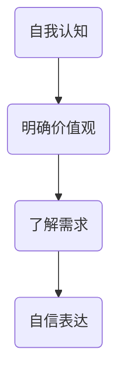

#### 2. 寻找共同点

寻找与他人之间的共同点有助于建立联系。通过发现共同兴趣、价值观或经历，我们能够更容易地与他人建立良好的关系。

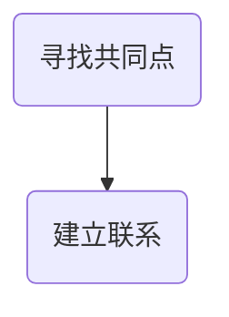

#### 3. 沟通与倾听

有效沟通和倾听是建立健康人际关系的核心。通过表达自己的观点和感受，同时倾听对方的意见和需求，我们能够增进理解，减少冲突。

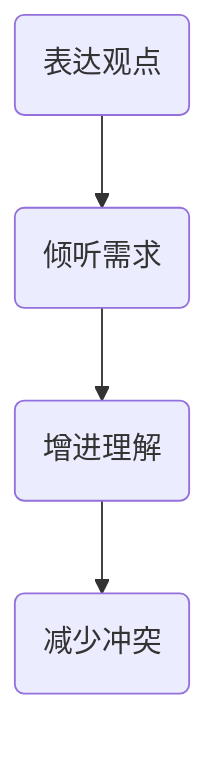

#### 4. 建立信任

信任是健康人际关系的基石。通过诚实、可靠和忠诚的行为，我们能够建立起彼此的信任。

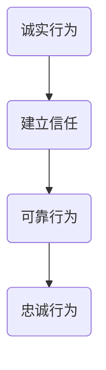

#### 5. 处理冲突

冲突是人际关系中不可避免的一部分。通过积极处理冲突，我们能够解决问题，维护关系。

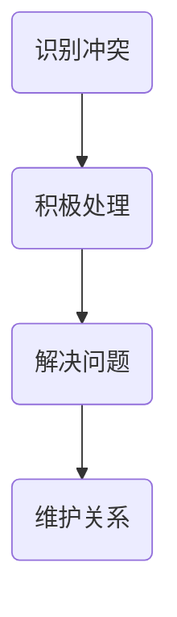

#### 6. 保持界限

在人际关系中，保持健康的界限同样重要。通过设定个人界限，我们能够保护自己，同时尊重他人。

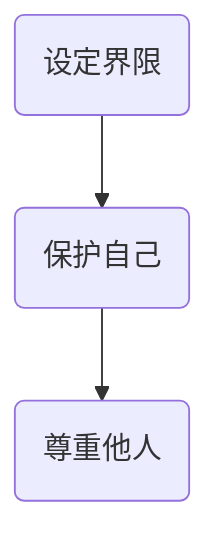

### 4.2 情感沟通

情感沟通是人际关系中的关键技能。通过表达自己的情感和需求，我们能够增进理解，减少误解。以下是情感沟通的几个要点：

#### 1. 明确表达

在表达情感时，明确表达自己的感受和需求。避免使用模糊的语言，以免引起误解。

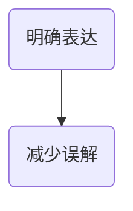

#### 2. 倾听对方

在对方表达情感时，给予充分的倾听。通过倾听，我们能够理解对方的感受和需求，增进互信。

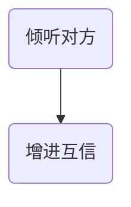

#### 3. 非言语沟通

情感沟通不仅包括言语，还包括非言语沟通，如肢体语言、面部表情和语调。通过非言语沟通，我们能够更好地传达情感。

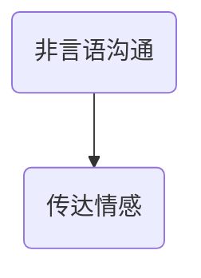

#### 4. 情感反馈

在表达情感后，给予对方反馈。通过情感反馈，我们能够确认对方是否理解我们的情感，并调整沟通方式。

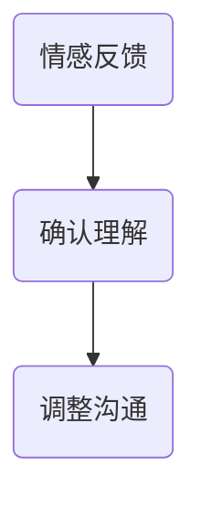

### 4.3 解锁冲突与和解

冲突是人际关系中的常见问题。通过有效的方法，我们能够解锁冲突，实现和解。以下是解锁冲突与和解的几个步骤：

#### 1. 识别冲突

首先，我们需要识别冲突的根源。通过自我反思和与对方的交流，我们能够了解冲突的原因。

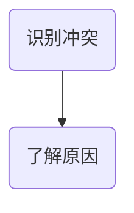

#### 2. 积极沟通

在识别冲突后，积极沟通是解决问题的关键。通过坦诚地表达自己的观点和感受，我们能够找到解决问题的方法。

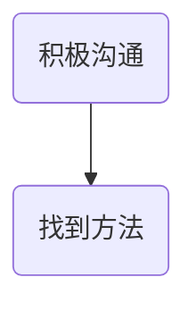

#### 3. 寻求共识

在解决冲突的过程中，寻求共识是关键。通过双方的共同努力，找到双方都能接受的解决方案。

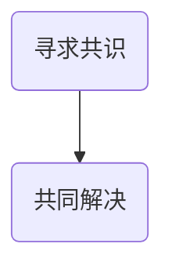

#### 4. 实施和解

在达成共识后，实施和解是最后一步。通过实际行动，表明我们愿意解决冲突，维护关系。

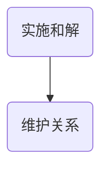

### 4.4 拓展社交圈子

拓展社交圈子有助于我们结识新朋友，获取新信息，提高人际关系能力。以下是拓展社交圈子的几个建议：

#### 1. 参加社交活动

参加各种社交活动，如聚会、俱乐部、工作坊等，是结识新朋友的好方法。

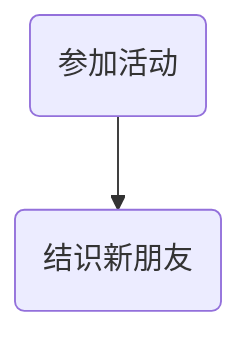

#### 2. 利用社交媒体

利用社交媒体平台，如LinkedIn、Facebook等，与朋友保持联系，结识新朋友。

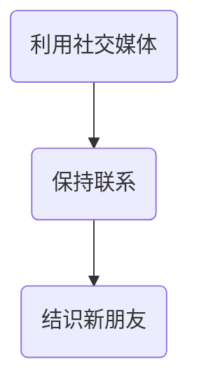

#### 3. 培养人际技能

通过学习和实践人际技能，如沟通技巧、情感管理等，提高人际关系能力。

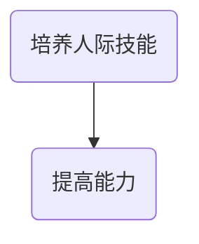

#### 4. 借助朋友介绍

通过现有朋友介绍新朋友，是拓展社交圈子的有效方法。

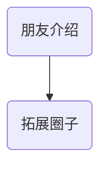

通过以上方法，我们能够在日常生活中建立和维护健康的人际关系，提高心理健康和生活质量。

## 第五部分：心灵成长与心理健康

### 5.1 压力管理

压力是现代社会中普遍存在的一种现象，对心理健康和生活质量产生负面影响。有效的压力管理对于维持心理健康至关重要。以下是几种常见的压力管理技巧：

#### 1. 正念冥想

正念冥想是一种通过专注于当前 moment 来减轻压力的方法。以下是一个简单的正念冥想步骤：

- **选择一个安静的环境**：找一个安静的地方，坐或躺在一个舒适的姿势。
- **闭上眼睛**：闭上眼睛，深呼吸几次，放松身体和心灵。
- **专注于呼吸**：将注意力集中在呼吸上，感受空气流入和流出你的鼻腔。
- **当心神不集中时，回到呼吸**：当你的注意力被其他事物分散时，轻轻地将注意力拉回到呼吸上。
- **持续冥想10-15分钟**：持续进行冥想，直到你感到放松和平静。

以下是正念冥想的伪代码：

```python
function 正念冥想():
    选择一个安静的环境
    闭上眼睛
    深呼吸，放松身体和心灵
    将注意力集中在呼吸上
    当心神不集中时，回到呼吸上
    持续冥想10-15分钟
```

#### 2. 时间管理

有效的时间管理可以帮助我们减少压力，提高工作效率。以下是一些时间管理技巧：

- **设定优先级**：将任务按照重要性和紧急性进行排序，优先处理重要且紧急的任务。
- **分解任务**：将大任务分解成小任务，逐步完成。
- **设定时间限制**：为每个任务设定一个时间限制，以增强时间意识。
- **避免拖延**：及时处理任务，避免拖延导致压力积累。

以下是时间管理的伪代码：

```python
function 时间管理():
    设定优先级
    分解任务
    设定时间限制
    及时处理任务
```

#### 3. 身体锻炼

身体锻炼是减轻压力的有效方法。通过锻炼，我们能够释放身体中的紧张和压力，提高心理健康。以下是一些身体锻炼的建议：

- **定期锻炼**：每周至少进行150分钟的中等强度锻炼，如快走、跑步或游泳。
- **选择自己喜欢的运动**：选择你喜欢的运动，这样更容易坚持。
- **注意姿势**：保持良好的姿势，减少身体疲劳和不适。

以下是身体锻炼的伪代码：

```python
function 身体锻炼():
    定期锻炼
    选择自己喜欢的运动
    注意姿势
```

#### 4. 社交支持

社交支持是减轻压力的重要资源。与家人、朋友和同事保持良好的关系，可以获得情感支持和鼓励，减轻压力。以下是一些建议：

- **建立支持网络**：与信任的人建立紧密的联系，共同分享生活中的喜怒哀乐。
- **倾听他人**：倾听他人的问题，提供帮助和支持，建立互相信任的关系。
- **参与社交活动**：参与社交活动，扩大社交圈子，获得更多的社交支持。

以下是社交支持的伪代码：

```python
function 社交支持():
    建立支持网络
    倾听他人
    参与社交活动
```

### 5.2 应对焦虑与抑郁

焦虑和抑郁是影响心理健康的常见问题。通过有效的应对方法，我们能够减轻焦虑和抑郁的症状，提高生活质量。以下是一些应对焦虑和抑郁的建议：

#### 1. 认知行为疗法

认知行为疗法（CBT）是一种通过改变负面思维模式和行为来减轻焦虑和抑郁症状的方法。以下是一些认知行为疗法的基本步骤：

- **识别负面思维模式**：识别导致焦虑和抑郁的负面思维模式，如过度担忧、自我批评等。
- **挑战负面思维**：通过事实和证据挑战负面思维，寻找更积极、合理的思维方式。
- **替代思维模式**：培养积极的思维模式，如感恩、乐观等，替代负面思维。

以下是认知行为疗法的伪代码：

```python
function 认知行为疗法():
    识别负面思维模式
    挑战负面思维
    培养积极思维
```

#### 2. 正念疗法

正念疗法是一种通过专注于当前 moment 来减轻焦虑和抑郁症状的方法。以下是一个简单的正念疗法步骤：

- **选择一个安静的环境**：找一个安静的地方，坐或躺在一个舒适的姿势。
- **闭上眼睛**：闭上眼睛，深呼吸几次，放松身体和心灵。
- **专注于呼吸**：将注意力集中在呼吸上，感受空气流入和流出你的鼻腔。
- **当心神不集中时，回到呼吸**：当你的注意力被其他事物分散时，轻轻地将注意力拉回到呼吸上。
- **持续冥想10-15分钟**：持续进行冥想，直到你感到放松和平静。

以下是正念疗法的伪代码：

```python
function 正念疗法():
    选择一个安静的环境
    闭上眼睛
    深呼吸，放松身体和心灵
    将注意力集中在呼吸上
    当心神不集中时，回到呼吸上
    持续冥想10-15分钟
```

#### 3. 药物治疗

在某些情况下，药物治疗是应对焦虑和抑郁的有效方法。在医生的建议下，选择合适的药物，并按照医生的指示进行用药。药物治疗通常与其他治疗方法结合使用，如认知行为疗法和正念疗法。

### 5.3 增强自我价值感

自我价值感是指个体对自己的评价和认可。增强自我价值感有助于提高心理健康和生活质量。以下是一些增强自我价值感的建议：

#### 1. 确定自己的价值

通过了解自己的优点、成就和贡献，确定自己的价值。以下是一些方法：

- **自我反思**：定期进行自我反思，了解自己的优点和成就。
- **记录成就**：记录自己的成就和贡献，为自己树立信心。
- **寻求他人的反馈**：向信任的人寻求反馈，了解自己的价值和潜力。

#### 2. 培养积极的思维模式

通过培养积极的思维模式，如乐观、自信和感恩，增强自我价值感。以下是一些方法：

- **正面肯定**：每天对自己说一些正面肯定的话，如“我值得爱”，“我有价值”。
- **专注于积极的经历**：关注生活中的积极经历和感受，而不是负面经历。
- **感恩**：每天感恩生活中的小事，培养感恩的心态。

#### 3. 建立健康的人际关系

与支持性的人际关系建立紧密的联系，增强自我价值感。以下是一些方法：

- **建立支持网络**：与信任的人建立紧密的联系，分享生活中的喜怒哀乐。
- **参与社交活动**：参与社交活动，扩大社交圈子，获得更多的社交支持。
- **帮助他人**：通过帮助他人，感受到自己的价值和意义。

### 5.4 寻求专业帮助

在面对严重的心理健康问题时，寻求专业帮助是明智的选择。以下是一些寻求专业帮助的建议：

- **心理咨询师**：寻找专业的心理咨询师，进行心理治疗和咨询。
- **心理医生**：如果需要药物治疗，寻求专业的心理医生。
- **支持团体**：加入支持团体，与经历类似问题的人共同面对挑战。

通过以上方法，我们能够有效地管理压力，应对焦虑和抑郁，增强自我价值感，维护心理健康。

## 第六部分：心灵成长与自我认知

### 6.1 自我认知的重要性

自我认知是心灵成长的核心，它涉及到对自己的了解和认识。通过自我认知，我们能够识别自己的性格、价值观、优点和缺点，从而更好地理解自己的需求和欲望。自我认知有助于我们实现个人成长，建立积极的人际关系，并提高生活质量。

#### 自我认知对个人成长的影响

自我认知能够帮助我们识别自己的潜力和优势，从而更好地发挥自己的能力。通过了解自己的性格特点，我们能够找到适合自己的职业和发展路径。此外，自我认知还能帮助我们识别自己的不足，从而制定改进计划，提升个人能力。

```mermaid
graph TD
    A(自我认知) --> B(识别优势)
    B --> C(发挥潜力)
    C --> D(提升能力)
```

#### 自我认知对人际关系的影响

自我认知有助于我们更好地理解自己和他人。通过了解自己的性格和价值观，我们能够更好地与他人沟通，建立和谐的人际关系。同时，自我认知还能帮助我们识别和处理人际关系中的冲突，从而维护关系的稳定。

```mermaid
graph TD
    A(自我认知) --> B(理解自己)
    B --> C(理解他人)
    C --> D(维护关系)
```

#### 自我认知对生活质量的影响

自我认知能够帮助我们建立积极的心态，应对生活中的挑战。通过了解自己的需求和欲望，我们能够更好地规划自己的生活，追求真正的幸福。此外，自我认知还能帮助我们摆脱负面情绪，提高心理健康。

```mermaid
graph TD
    A(自我认知) --> B(积极心态)
    B --> C(应对挑战)
    C --> D(提高生活质量)
```

### 6.2 探索自我

探索自我是心灵成长的过程，它涉及到对内心世界的深入了解和探索。通过探索自我，我们能够更好地认识自己，发现自己的潜力和价值。以下是一些探索自我的方法：

#### 1. 自我反思

自我反思是探索自我的重要方法。通过定期反思，我们能够审视自己的行为、思想和情感，了解自己的真实需求和欲望。以下是一个简单的自我反思步骤：

- **选择一个安静的环境**：找一个安静的地方，坐下来，放松身心。
- **回顾一天的经历**：回顾当天的重要经历，思考自己的行为、感受和思考。
- **记录反思**：将反思的内容记录下来，以便日后回顾和总结。

以下是自我反思的伪代码：

```python
function 自我反思():
    选择一个安静的环境
    回顾一天的经历
    记录反思
```

#### 2. 日记写作

日记写作是一种记录内心感受和思考的方法。通过日记写作，我们能够更好地了解自己，释放负面情绪，并记录心灵成长的轨迹。以下是日记写作的伪代码：

```python
function 日记写作():
    选择日记本或电子日记
    设定固定的写作时间
    记录当天的感受、情绪和思考
    反思和总结当天的收获和成长
```

#### 3. 心理咨询

心理咨询是一种专业的自我探索方法。通过心理咨询，我们能够与专业的心理咨询师进行深入交流，了解自己的内心世界，并获得专业的指导和支持。以下是心理咨询的伪代码：

```python
function 心理咨询():
    寻找专业的心理咨询师
    进行深入的交流
    获得专业的指导和支持
```

### 6.3 增强自我意识

增强自我意识是心灵成长的重要目标之一。通过增强自我意识，我们能够更好地认识自己，提高自我控制能力，并实现个人目标。以下是一些增强自我意识的方法：

#### 1. 观察自己的行为和反应

通过观察自己的行为和反应，我们能够了解自己的心理状态和行为模式。以下是一个简单的观察步骤：

- **选择一个安静的环境**：找一个安静的地方，坐下来，放松身心。
- **观察自己的行为和反应**：在日常生活中，观察自己的行为和反应，思考它们背后的原因。
- **记录观察结果**：将观察结果记录下来，以便日后分析和总结。

以下是观察自己的伪代码：

```python
function 观察自己():
    选择一个安静的环境
    观察自己的行为和反应
    记录观察结果
```

#### 2. 挑战自己的信念和想法

通过挑战自己的信念和想法，我们能够打破固有的思维模式，增强自我意识。以下是一个简单的挑战步骤：

- **识别自己的信念和想法**：识别自己内心深处的信念和想法，思考它们的来源和影响。
- **质疑自己的信念和想法**：质疑自己的信念和想法，寻找事实和证据来支持或反驳它们。
- **替代自己的信念和想法**：寻找更积极、合理的信念和想法，替代消极的信念和想法。

以下是挑战自己的伪代码：

```python
function 挑战自己():
    识别自己的信念和想法
    质疑自己的信念和想法
    替代自己的信念和想法
```

#### 3. 不断学习和成长

通过不断学习和成长，我们能够提升自己的知识和技能，增强自我意识。以下是一个简单的学习和成长步骤：

- **设定学习目标**：根据个人兴趣和需求，设定合理的学习目标。
- **制定学习计划**：制定详细的学习计划，包括学习内容、时间和方法。
- **实施学习计划**：按照学习计划进行学习，不断积累知识和经验。
- **反思和总结**：在学习过程中，定期反思和总结，发现自己的不足并加以改进。

以下是学习和成长的伪代码：

```python
function 学习成长():
    设定学习目标
    制定学习计划
    实施学习计划
    反思和总结
```

通过以上方法，我们能够逐步增强自我意识，提升自我认知，实现个人目标和价值。

### 6.4 持续自我成长

持续自我成长是实现心灵成长的关键。通过不断学习和实践，我们能够提升自我认知，增强自我意识，实现个人目标和价值。以下是持续自我成长的几个建议：

#### 1. 设定目标

设定明确的目标是实现自我成长的第一步。通过设定目标，我们能够明确自己的方向和努力的重点。以下是设定目标的步骤：

- **明确目标**：设定具体、可衡量、可实现的目标。
- **分解目标**：将大目标分解成小目标，逐步实现。
- **设定时间表**：为每个目标设定一个合理的时间表，以确保目标的实现。

以下是设定目标的伪代码：

```python
function 设定目标():
    明确目标
    分解目标
    设定时间表
```

#### 2. 不断学习

通过不断学习，我们能够提升自己的知识和技能，适应快速变化的世界。以下是不断学习的步骤：

- **选择学习内容**：根据个人兴趣和职业需求，选择合适的学习内容。
- **制定学习计划**：制定详细的学习计划，包括学习内容、时间和方法。
- **实施学习计划**：按照学习计划进行学习，不断积累知识和经验。
- **反思和总结**：在学习过程中，定期反思和总结，发现自己的不足并加以改进。

以下是不断学习的伪代码：

```python
function 不断学习():
    选择学习内容
    制定学习计划
    实施学习计划
    反思和总结
```

#### 3. 实践与反思

通过实践和反思，我们能够将学习成果转化为实际能力，并持续提升自我。以下是实践与反思的步骤：

- **选择实践项目**：根据个人目标和兴趣，选择合适的实践项目。
- **实施实践项目**：按照实践项目的计划进行实施，积累实际经验。
- **反思实践过程**：在实践过程中，定期反思和总结，评估实践效果。
- **调整和改进**：根据反思结果，调整实践项目，改进方法和策略。

以下是实践与反思的伪代码：

```python
function 实践与反思():
    选择实践项目
    实施实践项目
    反思实践过程
    调整和改进
```

#### 4. 建立支持系统

通过建立支持系统，我们能够获得他人的帮助和支持，提高自我成长的速度和质量。以下是建立支持系统的步骤：

- **寻找导师**：寻找经验丰富的导师，获得专业的指导和反馈。
- **加入学习小组**：加入学习小组，与他人共同学习、分享和讨论。
- **寻求反馈**：定期向他人寻求反馈，了解自己的优势和不足。
- **建立社交网络**：建立广泛的社交网络，获取更多的资源和机会。

以下是建立支持系统的伪代码：

```python
function 建立支持系统():
    寻找导师
    加入学习小组
    寻求反馈
    建立社交网络
```

通过以上方法，我们能够持续自我成长，提升自我认知，实现个人目标和价值。

## 第七部分：总结与未来展望

### 7.1 心灵成长的总结

心灵成长是一个长期且持续的过程，它不仅仅是对内心世界的探索，更是对自我认知、情感管理、人际关系和心理健康的多维度提升。通过自我认知，我们能够更好地理解自己的需求和欲望，从而实现个人目标和价值。情感管理帮助我们应对生活中的压力和挑战，保持心理健康。在人际关系中，通过有效的沟通和冲突解决，我们能够建立和谐的人际关系，获得情感支持和归属感。总之，心灵成长是提升生活质量，实现个人幸福和成功的关键。

### 7.2 面对未来挑战

随着社会的快速发展和科技的不断进步，我们将面临更多的挑战和机遇。未来，工作和生活方式的变化、人际关系的复杂化、以及心理健康问题的普遍化，都将对心灵成长提出更高的要求。为了应对这些挑战，我们需要持续关注自己的内心世界，不断提升自我认知和情感管理能力，灵活应对各种变化。同时，我们也需要建立和维护健康的人际关系，以获得支持和帮助。

### 7.3 持续的心灵成长之路

心灵成长是一个不断前进的过程，它没有终点。通过持续的自我反思、学习和实践，我们能够不断提升自己的心理素质，实现个人目标和价值。以下是一些建议，帮助我们在心灵成长的道路上不断前行：

1. **定期自我反思**：定期对自己的行为、思维和情感进行反思，了解自己的内心世界，找到提升的方向。
2. **持续学习**：保持好奇心和学习的热情，不断学习新知识、新技能，提升自己的综合素质。
3. **培养积极的情感**：通过感恩、乐观和积极的态度，培养积极的情感，提高心理健康。
4. **建立支持系统**：与他人建立紧密的联系，获得情感支持和专业指导，共同成长。
5. **实践与反思**：将学习到的知识和技能应用到实际生活中，通过实践和反思，不断提升自己的能力和素质。

### 7.4 附录：心灵成长资源推荐

为了帮助读者在心灵成长的道路上更好地前行，以下是一些建议的心灵成长资源和推荐：

1. **书籍**：
   - 《自控力》：凯利·麦格尼格尔（Kelly McGonigal）
   - 《正念：一种生活方式》：乔·卡巴金（Jon Kabat-Zinn）
   - 《情感管理》：丹尼尔·戈尔曼（Daniel Goleman）

2. **课程**：
   - 正念冥想课程：乔·卡巴金（Jon Kabat-Zinn）开设的正念冥想课程
   - 情感管理课程：丹尼尔·戈尔曼（Daniel Goleman）开设的情感管理课程

3. **应用程序**：
   - Headspace：提供各种冥想和放松课程
   - Calm：提供冥想、睡眠和放松功能

4. **心理咨询师**：可以搜索本地心理咨询师，进行专业心理辅导和咨询

通过以上资源和推荐，读者可以找到适合自己的心灵成长路径，不断提升自己的心理健康和幸福感。

### 作者介绍

作者：AI天才研究院/AI Genius Institute & 禅与计算机程序设计艺术 /Zen And The Art of Computer Programming

AI天才研究院是一家专注于人工智能研究和应用的高科技创新机构。我们的使命是通过人工智能技术推动社会进步和人类福祉。本文作者结合了人工智能与心灵成长的理念，旨在为读者提供一份全面的心灵成长指南。同时，作者也是《禅与计算机程序设计艺术》一书的作者，他通过深入探讨计算机程序设计与心灵成长之间的关系，为读者提供了一种全新的视角和方法。

通过本文，我们探讨了内在世界的概念、心灵成长的重要性、心灵成长的方法与实践，以及心灵成长在个人生活和社会关系中的应用。我们希望通过这些内容，帮助读者在快节奏的生活中找到内心的平和与力量，实现个人目标和价值。

文章标题：《培育内在世界：滋养心灵的成长土壤》

文章关键词：内在世界、心灵成长、心理健康、自我认知、人际关系

文章摘要：本文深入探讨了内在世界的构成、心灵成长的重要性以及心灵成长的方法与实践。通过理解内在世界的概念和心灵成长的核心概念，读者能够更好地认识自己，提升心理健康，建立积极的人际关系，实现个人目标和价值。

文章大纲：

1. **引言与核心概念**
   - 1.1 心灵成长的重要性
   - 1.2 内在世界的概念
   - 1.3 心灵成长的核心概念
   - 1.4 心灵成长与身心健康的关系

2. **内在世界与心灵成长**
   - 2.1 内在世界的构成
   - 2.2 心灵成长的基础
   - 2.3 内在世界与心灵成长的关系
   - 2.4 心灵成长的目标

3. **心灵成长的方法与实践**
   - 3.1 简单呼吸练习
   - 3.2 正念冥想
   - 3.3 日记写作
   - 3.4 身体运动
   - 3.5 亲密关系与心灵成长

4. **心灵成长与人际关系**
   - 4.1 建立健康的人际关系
   - 4.2 情感沟通
   - 4.3 解锁冲突与和解
   - 4.4 拓展社交圈子

5. **心灵成长与心理健康**
   - 5.1 压力管理
   - 5.2 应对焦虑与抑郁
   - 5.3 增强自我价值感
   - 5.4 寻求专业帮助

6. **心灵成长与自我认知**
   - 6.1 自我认知的重要性
   - 6.2 探索自我
   - 6.3 增强自我意识
   - 6.4 持续自我成长

7. **总结与未来展望**
   - 7.1 心灵成长的总结
   - 7.2 面对未来挑战
   - 7.3 持续的心灵成长之路
   - 7.4 附录：心灵成长资源推荐

通过本文，我们希望为读者提供一份全面的心灵成长指南，帮助他们在快节奏的生活中找到内心的平和与力量，实现个人目标和价值。

