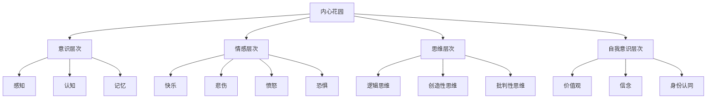

                 

### 文章标题：培育内心花园：构建丰富的精神世界

#### 文章关键词
- 内心花园
- 精神世界
- 情绪管理
- 成长心态
- 人际关系
- 心灵成长

#### 摘要
本文旨在探讨如何通过培育内心花园来构建一个丰富的精神世界。我们将深入分析内心花园的构成、维护策略和扩展方法，结合心理学、哲学和计算机科学的视角，提供一系列实用技巧和理论框架，帮助读者理解内心的本质，培养积极的心态，拓展人际关系，实现心灵成长。通过这篇技术博客，我们希望读者能够意识到内心花园的重要性，学会如何在自己的生活中培养和维护这个精神家园。

### 第一部分：内心的探索与理解

#### 第1章：内心的秘密花园

**1.1 内心的定义与特点**

内心花园是一个比喻，用于描述个体的内在心理世界。这个花园包括意识、情感、思维和自我意识等多个层次，每个层次都有其独特的特点和功能。在心理学中，内心花园通常被视为个体的精神内核，它是我们感知、理解、反应和体验世界的基础。

- **意识层次**：意识层次是内心花园的最表层，它包括我们对现实世界的感知和认知。这个层次决定了我们如何理解和解释周围的环境。
- **情感层次**：情感层次涵盖了我们的情绪体验，包括快乐、悲伤、愤怒、恐惧等。情感对个体的内心花园有着深远的影响，它们可以增强或削弱我们的心理韧性。
- **思维层次**：思维层次涉及我们的思考过程，包括逻辑推理、创造性思维和批判性思维。思维层次帮助我们构建对世界的理解和解释。
- **自我意识层次**：自我意识层次是最深层的，它关乎我们的身份认同和自我感知。自我意识层次决定了我们的价值观、信念和行为准则。

**1.2 内心的层次结构**

为了更好地理解内心花园，我们需要了解其层次结构。内心花园可以分为以下四个层次：

- **意识层次**：意识层次包括我们的感知、认知和记忆。它是我们与外界互动的窗口，也是我们理解自我和他人的基础。
- **情感层次**：情感层次是我们对事件的情感反应，它直接影响我们的情绪状态。情感的多样性使我们的内心花园更加丰富和复杂。
- **思维层次**：思维层次是我们对信息的处理和解释，它包括逻辑思维、创造性思维和批判性思维。思维层次决定了我们如何理解和解决问题。
- **自我意识层次**：自我意识层次是我们对自己存在的感知和理解，它包括我们的价值观、信念和身份认同。自我意识层次是内心花园的核心，它决定了我们的行为和决策。

**1.3 内心花园的维护**

维护内心花园是保持心理健康的重要步骤。以下是一些关键策略：

- **自我观察**：通过自我观察，我们可以更好地了解自己的内心状态。这包括记录情绪、反思思维过程和识别自我模式。
- **心态调整**：心态调整是一种积极的思考方式，它帮助我们应对挑战和压力。通过积极的心态，我们可以更好地处理负面情绪。
- **日常护理**：日常护理包括保持健康的生活方式，如充足的睡眠、均衡的饮食、适度的运动和放松技巧。

### 第二部分：内心花园的培育与扩展

#### 第3章：个人成长与内心花园

**3.1 自我认知**

自我认知是个人成长的基础。它包括了解自己的优点和缺点、价值观和信念。自我认知可以帮助我们建立更清晰的自我形象，从而更好地规划未来和实现目标。

**3.2 成长心态**

成长心态是一种相信自己的能力可以通过努力和学习不断提升的心态。与固定心态相反，成长心态使我们更加开放和灵活，能够更好地应对挑战和变化。

**3.3 心灵成长**

心灵成长是一个不断探索和扩展内心花园的过程。它包括自我反思、情感管理、人际关系和心灵实践。通过心灵成长，我们可以提高心理韧性，实现更深层次的自我认知和自我实现。

### 第三部分：内心花园的维护与保护

#### 第6章：内心花园的维护策略

**6.1 内心的自我修复**

内心的自我修复是一种内在的能力，它使我们能够在面对压力和挑战时保持心理健康。这种能力包括情绪调节、心理韧性和自我安慰。

**6.2 应对压力与挑战**

压力和挑战是生活中不可避免的一部分。学会应对压力和挑战是维护内心花园的关键。这包括情绪管理、时间管理和寻求支持。

**6.3 保持内心的平衡**

保持内心的平衡是实现心理健康和幸福的关键。这包括情感平衡、思维平衡和自我平衡。通过保持内心的平衡，我们可以更好地应对生活中的各种挑战。

### 结论

内心花园是一个比喻，用于描述个体的内在心理世界。通过培育和维护内心花园，我们可以实现个人成长、心理健康和心灵成长。本文提供了一系列实用技巧和理论框架，帮助读者理解内心的本质，培养积极的心态，拓展人际关系，实现心灵成长。希望读者能够意识到内心花园的重要性，学会如何在生活中培育和维护这个精神家园。

### 作者信息

作者：AI天才研究院/AI Genius Institute & 禅与计算机程序设计艺术 /Zen And The Art of Computer Programming

----------------------------------------------------------------

### 文章正文

#### 第一部分：内心的探索与理解

**第1章：内心的秘密花园**

**1.1 内心的定义与特点**

内心花园是一个比喻，用于描述个体的内在心理世界。这个花园包括意识、情感、思维和自我意识等多个层次，每个层次都有其独特的特点和功能。在心理学中，内心花园通常被视为个体的精神内核，它是我们感知、理解、反应和体验世界的基础。

意识层次是内心花园的最表层，它包括我们对现实世界的感知和认知。这个层次决定了我们如何理解和解释周围的环境。例如，当我们看到一只小鸟飞过时，我们的意识层次会让我们意识到这是一只小鸟，并可能产生欣赏或好奇的情感。

情感层次涵盖了我们的情绪体验，包括快乐、悲伤、愤怒、恐惧等。情感对个体的内心花园有着深远的影响，它们可以增强或削弱我们的心理韧性。例如，当我们经历快乐时，我们可能会感到幸福和满足，而当我们经历悲伤时，我们可能会感到沮丧和无助。

思维层次涉及我们的思考过程，包括逻辑推理、创造性思维和批判性思维。思维层次帮助我们构建对世界的理解和解释。例如，当我们遇到一个难题时，我们会运用逻辑思维来解决问题，或者运用创造性思维来找到新的解决方案。

自我意识层次是最深层的，它关乎我们的身份认同和自我感知。自我意识层次决定了我们的价值观、信念和行为准则。例如，我们的自我意识可能使我们相信诚实和善良是重要的价值观，并据此指导我们的行为。

**1.2 内心的层次结构**

为了更好地理解内心花园，我们需要了解其层次结构。内心花园可以分为以下四个层次：

**意识层次**：意识层次包括我们的感知、认知和记忆。它是我们与外界互动的窗口，也是我们理解自我和他人的基础。意识层次使我们能够识别和理解外部刺激，并做出相应的反应。

**情感层次**：情感层次是我们对事件的情感反应，它直接影响我们的情绪状态。情感的多样性使我们的内心花园更加丰富和复杂。例如，我们可能会对一部电影中的感人场景产生共鸣，或者对工作中的挑战感到焦虑。

**思维层次**：思维层次是我们对信息的处理和解释，它包括逻辑思维、创造性思维和批判性思维。思维层次决定了我们如何理解和解决问题。例如，我们可能会运用逻辑思维来分析一个商业机会，或者运用创造性思维来开发一个新的产品。

**自我意识层次**：自我意识层次是我们对自己存在的感知和理解，它包括我们的价值观、信念和身份认同。自我意识层次是内心花园的核心，它决定了我们的行为和决策。例如，我们的自我意识可能使我们相信终身学习是重要的，并据此制定学习计划。

**1.3 内心花园的维护**

维护内心花园是保持心理健康的重要步骤。以下是一些关键策略：

**自我观察**：通过自我观察，我们可以更好地了解自己的内心状态。这包括记录情绪、反思思维过程和识别自我模式。自我观察使我们能够认识到自己的内心变化，并及时调整心态。

**心态调整**：心态调整是一种积极的思考方式，它帮助我们应对挑战和压力。通过积极的心态，我们可以更好地处理负面情绪。例如，当我们面对失败时，积极的心态可能使我们从失败中学习，而不是陷入沮丧。

**日常护理**：日常护理包括保持健康的生活方式，如充足的睡眠、均衡的饮食、适度的运动和放松技巧。这些习惯有助于维持我们的心理和身体健康，从而保持内心花园的健康。

#### 第二部分：内心花园的培育与扩展

**第3章：个人成长与内心花园**

**3.1 自我认知**

自我认知是个人成长的基础。它包括了解自己的优点和缺点、价值观和信念。自我认知可以帮助我们建立更清晰的自我形象，从而更好地规划未来和实现目标。

自我认知的第一步是识别自己的优点和缺点。这可以通过自我反思和寻求他人的反馈来实现。例如，我们可以写下自己的优点和缺点，或者与朋友、家人讨论我们的性格特点。

自我认知的第二步是了解自己的价值观和信念。价值观和信念决定了我们的行为和决策。通过识别我们的价值观和信念，我们可以更好地理解自己，并在生活中做出一致的行为。

**3.2 成长心态**

成长心态是一种相信自己的能力可以通过努力和学习不断提升的心态。与固定心态相反，成长心态使我们更加开放和灵活，能够更好地应对挑战和变化。

成长心态的第一步是接受挑战。当我们面对困难时，成长心态使我们相信这些挑战是成长的机会，而不是障碍。通过接受挑战，我们可以学会新的技能和知识，从而提高自己的能力。

成长心态的第二步是持续学习。持续学习是一种积极的态度，它使我们不断追求进步。通过不断学习，我们可以不断扩展自己的知识领域，提高解决问题的能力。

**3.3 心灵成长**

心灵成长是一个不断探索和扩展内心花园的过程。它包括自我反思、情感管理、人际关系和心灵实践。通过心灵成长，我们可以提高心理韧性，实现更深层次的自我认知和自我实现。

自我反思是心灵成长的重要部分。通过反思，我们可以深入了解自己的内心世界，识别自己的情绪和行为模式。自我反思有助于我们发现自己的潜在问题和挑战，并找到解决方案。

情感管理是心灵成长的另一个关键方面。通过情感管理，我们可以更好地理解自己的情绪，并学会如何应对负面情绪。情感管理使我们能够保持情绪平衡，提高生活质量。

人际关系是心灵成长的重要组成部分。通过建立健康的人际关系，我们可以获得支持、鼓励和反馈。健康的人际关系有助于我们在心灵成长的道路上前进。

心灵实践是心灵成长的具体行动。这包括冥想、瑜伽、阅读和艺术创作等。这些实践可以帮助我们放松身心，提高自我意识和情感管理能力。

#### 第三部分：内心花园的维护与保护

**第6章：内心花园的维护策略**

**6.1 内心的自我修复**

内心的自我修复是一种内在的能力，它使我们能够在面对压力和挑战时保持心理健康。这种能力包括情绪调节、心理韧性和自我安慰。

情绪调节是自我修复的重要方面。通过情绪调节，我们可以识别和理解自己的情绪，并学会如何以健康的方式表达和处理这些情绪。例如，当我们感到愤怒时，我们可以通过深呼吸和放松技巧来调节情绪，而不是通过冲动行为来表达愤怒。

心理韧性是内心花园的另一个重要特征。心理韧性使我们能够在面对逆境时保持坚韧和适应能力。通过培养心理韧性，我们可以更好地应对生活中的挑战，并从中成长。

自我安慰是自我修复的一种技巧。通过自我安慰，我们可以帮助自己缓解压力和焦虑。例如，当我们感到焦虑时，我们可以通过听音乐、散步或做一些喜欢的事情来安慰自己。

**6.2 应对压力与挑战**

压力和挑战是生活中不可避免的一部分。学会应对压力和挑战是维护内心花园的关键。这包括情绪管理、时间管理和寻求支持。

情绪管理是应对压力的重要方面。通过情绪管理，我们可以识别和理解自己的情绪，并学会如何以健康的方式表达和处理这些情绪。例如，当我们感到愤怒时，我们可以通过深呼吸和放松技巧来调节情绪，而不是通过冲动行为来表达愤怒。

时间管理是应对压力的另一个关键方面。通过合理规划时间，我们可以减少压力，提高工作效率和生活质量。例如，我们可以使用日程表、待办事项列表和时间管理应用来管理我们的时间。

寻求支持是应对压力的有效方法。通过寻求支持，我们可以获得他人的帮助和鼓励。这包括与家人、朋友或专业人士交流，分享我们的压力和挑战。寻求支持可以帮助我们获得新的视角和建议，从而更好地应对压力。

**6.3 保持内心的平衡**

保持内心的平衡是实现心理健康和幸福的关键。这包括情感平衡、思维平衡和自我平衡。通过保持内心的平衡，我们可以更好地应对生活中的各种挑战。

情感平衡是保持内心平衡的重要方面。通过情感平衡，我们可以学会如何处理和管理不同的情绪。例如，当我们感到快乐时，我们可以通过分享喜悦来保持情感的平衡，当我们感到悲伤时，我们可以通过寻求安慰和支持来平衡情感。

思维平衡是保持内心平衡的另一个关键方面。通过思维平衡，我们可以学会如何以健康的方式思考和处理信息。例如，当我们遇到挑战时，我们可以通过积极的思考和解决问题的方法来平衡思维。

自我平衡是保持内心平衡的最后一步。通过自我平衡，我们可以学会如何与自己和谐相处。例如，我们可以通过自我反思和自我接纳来平衡自我，从而更好地理解自己的需求和价值观。

### 结论

内心花园是一个比喻，用于描述个体的内在心理世界。通过培育和维护内心花园，我们可以实现个人成长、心理健康和心灵成长。本文提供了一系列实用技巧和理论框架，帮助读者理解内心的本质，培养积极的心态，拓展人际关系，实现心灵成长。希望读者能够意识到内心花园的重要性，学会如何在生活中培育和维护这个精神家园。

### 作者信息

作者：AI天才研究院/AI Genius Institute & 禅与计算机程序设计艺术 /Zen And The Art of Computer Programming

----------------------------------------------------------------

**附录：心灵成长资源推荐**

**A.1 心灵成长书籍推荐**

- 《积极心理学：探索人类的幸福与成长》（Martin Seligman）
- 《影响力：说服心理学》（Robert B. Cialdini）
- 《生命的智慧：冥想与心灵成长》（Eckhart Tolle）

**A.2 心灵成长音乐推荐**

- 贝多芬的《月光奏鸣曲》
- 德彪西的《月光》
- 约翰·列侬的《想象》

**A.3 心灵成长电影推荐**

- 《肖申克的救赎》
- 《阿甘正传》
- 《美丽心灵》

通过阅读这些书籍、聆听这些音乐和观看这些电影，读者可以进一步探索内心的世界，促进心灵成长。

### 结语

培育内心花园，构建丰富的精神世界，是每个人成长道路上的重要任务。本文通过深入探讨内心花园的构成、维护和扩展，为读者提供了一系列实用的技巧和理论框架。希望读者能够将这些知识应用到日常生活中，培养积极的心态，拓展人际关系，实现心灵成长。让我们共同努力，为自己和他人创造一个更加美好的精神世界。作者：AI天才研究院/AI Genius Institute & 禅与计算机程序设计艺术 /Zen And The Art of Computer Programming

----------------------------------------------------------------

### 梅里迪亚姆流程图

以下是一个简单的梅里迪亚姆流程图，用于描述内心花园的结构：

这个流程图展示了内心花园的四个主要层次：意识层次、情感层次、思维层次和自我意识层次，以及它们各自的子类别。通过这个流程图，读者可以更直观地了解内心花园的构成和工作原理。

