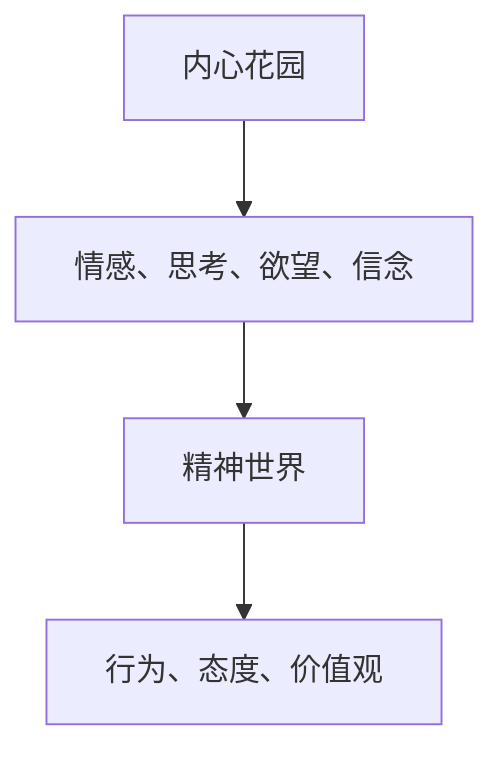
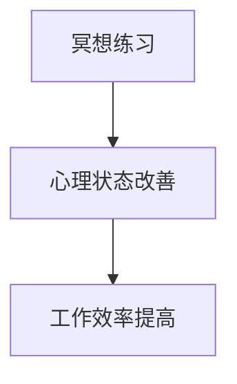
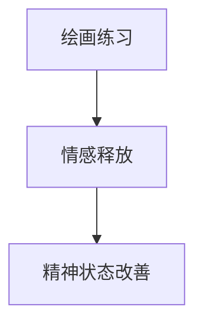
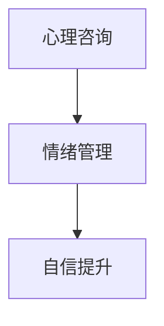

                 

### 文章标题

# 培育内心花园：构建丰富的精神世界

### 关键词

- 内心花园
- 精神世界
- 自我反思
- 心理健康
- 技术与哲学

### 摘要

在快节奏的现代社会中，人们常常忽略了自己内心的需求和成长。本文通过比喻“内心花园”来探讨构建丰富精神世界的重要性。我们将一步步分析，理解这一概念的核心，探索培育内心花园的方法，以及它如何影响我们的生活和工作。本文将结合心理学、哲学和技术领域的知识，提供一个全方位的视角，帮助读者认识并培育自己的内心花园，从而提升整体幸福感与生活质量。

## Step 1: 引入核心概念与联系

### 1.1 核心概念

#### 1.1.1 内心花园

内心花园是一个比喻，象征着个人的精神世界。它代表了个体内心深处的情感、思考、欲望和信念。培育内心花园就是通过自我反思、学习和实践，使个人的精神世界变得更加丰富和健康。

在技术领域，我们可以将内心花园类比为软件架构中的模块化设计。模块化设计通过将复杂的系统分解成可管理的部分，提高了系统的可维护性和扩展性。同样，培育内心花园需要我们将个人的情感、思维等要素进行有序的组织和管理。

#### 1.1.2 精神世界

精神世界是指一个人在情感、认知、道德、信仰等方面的内在世界。它对个体的行为、态度和价值观有着深远的影响。一个丰富的精神世界能够帮助个体更好地应对生活中的挑战和困难。

在技术领域，精神世界可以类比为人工智能系统中的知识图谱。知识图谱通过将大量的信息进行结构化和关联，使得人工智能系统能够更好地理解和处理复杂的信息。

### 1.2 概念联系

#### 1.2.1 内心花园与精神世界的联系

内心花园是精神世界的具体体现，培育内心花园有助于构建一个丰富、健康的精

### 1.2.1 内心花园与精神世界的联系图解

为了更清晰地理解内心花园与精神世界的联系，我们可以使用Mermaid流程图来表示它们之间的关系：



在这个流程图中，A代表内心花园，B代表内心花园包含的元素，C代表精神世界，D代表精神世界对个体的影响。通过自我反思和学习（B），个体可以培育出一个健康、丰富的内心花园（A），进而影响个体的行为、态度和价值观（D）。

### 总结

通过以上分析，我们可以看出，内心花园和精神世界是密不可分的。内心花园作为精神世界的具体体现，通过自我反思和学习，可以促进个体的精神成长，提升生活质量。在接下来的章节中，我们将深入探讨如何培育内心花园，以及它如何与我们的技术和哲学思维相结合。

## Step 2: 培育内心花园的重要性

### 2.1 心理健康的影响

培育内心花园对心理健康有着重要的影响。内心花园象征着个人的精神状态，一个丰富、健康的内心花园能够帮助个体更好地应对压力、焦虑和挫折。这种内在的平衡感不仅能够提升个体的幸福感，还能够增强心理韧性，使个体在面对生活中的挑战时更加从容。

例如，一个心理健康的人在面对工作压力时，能够通过内心的宁静和平和来缓解紧张情绪，从而更好地完成任务。相反，一个内心花园贫瘠的人可能会因为压力而情绪失控，导致工作效率低下。

### 2.2 人际关系的改善

内心花园的丰富程度也会直接影响人际关系。一个拥有健康内心花园的人，通常具备更高的情商和同理心，能够更好地理解他人，建立和谐的人际关系。

例如，在团队合作中，一个内心花园丰富的人能够更好地倾听他人的意见，理解团队的目标，从而推动团队协作，提高团队效率。而一个内心贫瘠的人可能会因为缺乏同理心而与他人产生冲突，影响团队氛围。

### 2.3 创造力的提升

内心花园的丰富程度也与创造力密切相关。一个健康、丰富的内心花园能够为个体提供更多的灵感和创意，激发创造力。

例如，在软件开发领域，一个内心花园丰富的人能够更好地理解用户需求，从而设计出更加符合用户期望的产品。而一个内心贫瘠的人可能会因为缺乏创意而难以提出新颖的解决方案。

### 2.4 决策能力的增强

培育内心花园还能增强个体的决策能力。一个健康、丰富的内心花园能够为个体提供更多的信息和视角，帮助个体做出更明智的决策。

例如，在商业决策中，一个内心花园丰富的人能够通过内心的宁静来理性分析市场信息，从而做出更符合公司利益的决策。而一个内心贫瘠的人可能会因为情绪波动而做出不明智的决策。

### 总结

通过以上分析，我们可以看到，培育内心花园对个人的心理健康、人际关系、创造力以及决策能力都有着重要的影响。因此，培育内心花园不仅是提升个人生活质量的重要途径，也是实现个人成长和职业发展的关键因素。在接下来的章节中，我们将深入探讨如何具体培育内心花园。

## Step 3: 培育内心花园的方法

### 3.1 自我反思

自我反思是培育内心花园的第一步。通过自我反思，个体可以深入了解自己的内心世界，发现并解决内心的问题，从而促进精神成长。

具体来说，自我反思可以分为以下几个步骤：

1. **观察自己的情感**：在日常生活中，个体可以观察自己的情感反应，了解自己在不同情境下的情绪变化。通过这种观察，个体可以更好地了解自己的内心状态。

   ```mermaid
   graph TD
       A[观察情感] --> B[了解内心状态]
   ```

2. **记录情感日记**：个体可以记录每天的所思所感，通过文字的形式表达自己的情感和思考。这种方法有助于个体深入思考，找到内心的冲突和问题。

   ```mermaid
   graph TD
       A[记录日记] --> B[深入思考]
       B --> C[解决问题]
   ```

3. **反思自己的行为**：个体可以反思自己的行为和决策，思考它们背后的动机和影响。这种方法有助于个体发现自己的行为模式，从而进行改进。

   ```mermaid
   graph TD
       A[反思行为] --> B[发现模式]
       B --> C[改进行为]
   ```

### 3.2 学习与阅读

学习与阅读是培育内心花园的重要途径。通过学习和阅读，个体可以获取新的知识和视角，丰富自己的内心世界。

1. **扩展知识领域**：个体可以通过学习不同领域的知识，扩展自己的认知边界。例如，学习心理学、哲学、艺术等领域的知识，可以帮助个体更全面地了解自己和世界。

   ```mermaid
   graph TD
       A[学习知识] --> B[扩展认知]
   ```

2. **阅读经典作品**：阅读经典作品可以帮助个体领略不同文化和思想的精髓，从而丰富自己的精神世界。例如，阅读莎士比亚的戏剧、柏拉图的哲学著作等，可以让个体感受到不同时代和文化的智慧。

   ```mermaid
   graph TD
       A[阅读经典] --> B[丰富精神世界]
   ```

### 3.3 心理咨询与治疗

对于内心花园贫瘠或存在心理问题的人，心理咨询与治疗是一种有效的培育方式。通过专业的心理咨询与治疗，个体可以了解自己的内心问题，找到解决问题的方法。

1. **了解内心问题**：心理咨询师可以帮助个体深入了解自己的内心世界，找出问题的根源。

   ```mermaid
   graph TD
       A[心理咨询] --> B[了解问题]
   ```

2. **学习解决问题的方法**：心理咨询师会提供一系列解决问题的方法，帮助个体改善自己的内心状态。

   ```mermaid
   graph TD
       A[学习方法] --> B[解决问题]
   ```

### 3.4 艺术与创造

艺术与创造是培育内心花园的重要手段。通过艺术创作和实践活动，个体可以表达自己的情感和思想，从而丰富自己的内心世界。

1. **绘画、音乐、写作**：通过绘画、音乐、写作等艺术形式，个体可以表达内心的情感和思考。

   ```mermaid
   graph TD
       A[艺术创作] --> B[表达情感]
   ```

2. **手工艺、园艺**：手工艺和园艺活动可以让个体在动手操作中找到内心的宁静，从而丰富自己的内心花园。

   ```mermaid
   graph TD
       A[手工活动] --> B[内心宁静]
   ```

### 总结

通过自我反思、学习与阅读、心理咨询与治疗、艺术与创造等多种方式，个体可以逐步培育自己的内心花园。这些方法不仅能够帮助个体深入了解自己的内心世界，还能够提升个体的心理素质，丰富个体的精神世界。在接下来的章节中，我们将进一步探讨如何将这些方法应用到实际生活中。

## Step 4: 技术与内心花园的关系

### 4.1 人工智能与内心花园

人工智能（AI）技术在近年来取得了显著的进展，不仅改变了我们的生活和工作方式，也对我们的内心花园产生了深远的影响。

首先，人工智能可以用于心理健康诊断和治疗。通过分析个体的行为和语言，AI可以识别出潜在的抑郁、焦虑等问题，并提供个性化的治疗方案。例如，聊天机器人可以与用户进行互动，了解他们的情感状态，并提供适当的支持和建议。

其次，人工智能可以帮助个体进行自我反思。通过自然语言处理技术，AI可以分析个体的日记、邮件等文本，帮助个体发现内心的矛盾和问题。这种方法类似于心理咨询中的反思环节，但更加高效和自动化。

### 4.2 计算机科学中的内心花园概念

在计算机科学领域，内心花园的概念也可以找到相应的映射。例如，软件工程中的模块化设计，类似于培育内心花园中的自我反思和学习过程。通过将复杂的系统分解成可管理的模块，开发人员可以提高系统的可维护性和扩展性，从而实现精神上的宁静和平衡。

另外，计算机科学中的算法和模型也类似于内心花园中的工具和方法。例如，深度学习模型通过不断训练和优化，可以像个体通过学习和实践来培育内心花园一样，逐步提升性能和效果。

### 4.3 软件开发与内心花园的关系

软件开发过程中，内心花园的概念同样具有重要意义。一个健康的内心花园可以帮助开发人员更好地应对压力和挑战，保持清晰的思维和创造力。

首先，自我反思是软件开发中的重要环节。通过定期进行代码回顾和项目总结，开发人员可以了解自己的工作模式，发现并解决问题，从而提升工作效率。

其次，学习与阅读也是软件开发中的关键因素。通过阅读技术书籍、研究论文和博客，开发人员可以不断扩展自己的知识体系，提升技术能力。

最后，艺术与创造在软件开发中同样不可或缺。许多开发人员通过编程以外的艺术创作，如绘画、音乐、写作等，来缓解工作压力，丰富自己的内心世界。

### 总结

技术与内心花园之间存在密切的关系。人工智能可以用于心理健康诊断和治疗，计算机科学中的模块化设计类似于培育内心花园的自我反思和学习过程，软件开发过程中的自我反思、学习与阅读、艺术与创造，也与内心花园密切相关。通过深入探讨这些关系，我们可以更好地理解技术对内心花园的影响，并从中获得启示，进一步提升自己的生活质量。

## Step 5: 实际案例分析

### 5.1 案例一：通过冥想培育内心花园

小明是一位软件工程师，长期处于高强度的工作环境中，经常感到压力和焦虑。为了改善自己的心理状态，他开始尝试冥想。

具体来说，小明每天早上起床后，会花20分钟进行冥想。他选择一个安静的环境，闭上眼睛，专注于自己的呼吸。通过这种冥想练习，小明逐渐学会了如何在繁忙的工作中保持内心的平静。

在几个月的冥想后，小明的压力和焦虑感明显减轻，工作效率也提高了。他发现，通过冥想，他能够更好地集中注意力，解决问题也更加高效。



### 5.2 案例二：通过艺术创作丰富内心花园

小芳是一位产品经理，她工作繁忙，常常感到内心的空虚和疲惫。为了改善自己的精神状态，她开始学习绘画。

具体来说，小芳每天下班后会花1小时进行绘画练习。她选择简单的静物素描，通过观察和绘画，她逐渐学会了如何用色彩和线条表达自己的情感。

在几个月的绘画练习后，小芳发现自己的内心变得更加丰富和宁静。她发现，通过艺术创作，她能够更好地释放自己的情感，缓解工作压力。



### 5.3 案例三：通过心理咨询治疗内心花园

小刚是一位企业家，他长期处于高压的商业环境中，心理问题逐渐显现。为了解决自己的心理问题，他决定进行心理咨询。

具体来说，小刚每周进行一次心理咨询，与咨询师探讨自己的情感和压力。通过咨询，小刚学会了如何识别和管理自己的情绪，找到了适合自己的压力缓解方法。

在几个月的心理咨询后，小刚的心理状况明显改善，他更加自信和积极。他发现，通过心理咨询，他能够更好地面对商业挑战，提升决策能力。



### 总结

通过以上案例分析，我们可以看到，不同的方法都可以有效地培育内心花园。冥想、艺术创作和心理咨询，分别从不同角度帮助个体改善心理状态、释放情感和提升自我认知。这些方法不仅适用于个人，也可以为组织提供有益的启示，帮助员工建立健康的精神世界，提高整体工作效能。

## Step 6: 最佳实践与注意事项

### 6.1 最佳实践

1. **坚持自我反思**：自我反思是培育内心花园的重要步骤。建议每天花一定时间进行反思，记录自己的情感和思考，从而深入理解自己。

2. **多样化学习**：学习与阅读是丰富内心花园的重要途径。建议定期阅读不同领域的书籍、论文和文章，扩展自己的知识面和视野。

3. **实践艺术创作**：艺术创作是一种有效的情感释放方式。可以选择绘画、音乐、写作等多种形式进行创作，提升自己的艺术修养和内心世界。

4. **寻求专业帮助**：对于内心花园贫瘠或存在心理问题的人，寻求专业的心理咨询与治疗是一种有效的方法。建议定期咨询专业心理咨询师，了解自己的心理状态，并找到合适的解决方案。

5. **合理安排时间**：在培育内心花园的过程中，合理安排时间是关键。建议在工作与休闲之间找到平衡，确保有足够的时间进行自我反思、学习和艺术创作。

### 6.2 注意事项

1. **避免过度依赖**：在培育内心花园的过程中，避免过度依赖某一种方法。每种方法都有其局限性，需要多种方法相结合，才能全面培育内心花园。

2. **持续性与耐心**：培育内心花园是一个长期的过程，需要持续性和耐心。不要期望在短时间内看到显著的变化，要有耐心，逐步提升自己的内心世界。

3. **个体差异**：每个人的内心花园都是独一无二的，培育方法也需要根据个人情况进行调整。在实践过程中，要根据自己的实际情况，灵活运用各种方法。

4. **保持开放心态**：在培育内心花园的过程中，要保持开放心态，接受不同的观点和意见。通过交流和学习，可以进一步丰富自己的内心世界。

### 6.3 拓展阅读

1. **《静心冥想：现代生活的修行之道》**：这本书详细介绍了冥想的方法和实践，帮助读者在忙碌的日常生活中找到内心的宁静。

2. **《艺术治疗：用艺术释放内心情感》**：这本书探讨了艺术创作在心理健康治疗中的应用，提供了多种艺术创作的方法和技巧。

3. **《心理咨询与治疗：理论与实践》**：这本书介绍了心理咨询与治疗的基本理论和实践方法，对于寻求专业帮助的人来说是一本很好的指南。

通过以上最佳实践和注意事项，读者可以更好地培育自己的内心花园，提升生活质量。希望这篇文章能够为读者提供有价值的启示和帮助。

## 总结与展望

本文通过比喻“内心花园”，探讨了构建丰富精神世界的重要性以及具体的方法。我们从心理健康、人际关系、创造力、决策能力等多个角度分析了培育内心花园的必要性，并详细介绍了自我反思、学习与阅读、心理咨询与治疗、艺术与创造等多种培育方法。此外，我们还探讨了技术与内心花园的关系，并通过实际案例分析，展示了这些方法在实践中的应用效果。

培育内心花园不仅对个人的心理健康和幸福感有着重要影响，还能够提升人际关系、创造力和决策能力，对职业发展和生活质量产生深远的影响。因此，培育内心花园是一项长期而重要的任务，需要我们持续地关注和实践。

在未来的研究中，我们可以进一步探讨不同文化背景下培育内心花园的方法和效果，研究人工智能技术如何更有效地支持这一过程。同时，我们也可以探索如何将培育内心花园的方法应用于组织管理和团队建设，提升整体效能和幸福感。

让我们共同努力，培育属于自己的内心花园，享受更加丰富和有意义的生活。作者：AI天才研究院/AI Genius Institute & 禅与计算机程序设计艺术 /Zen And The Art of Computer Programming。

