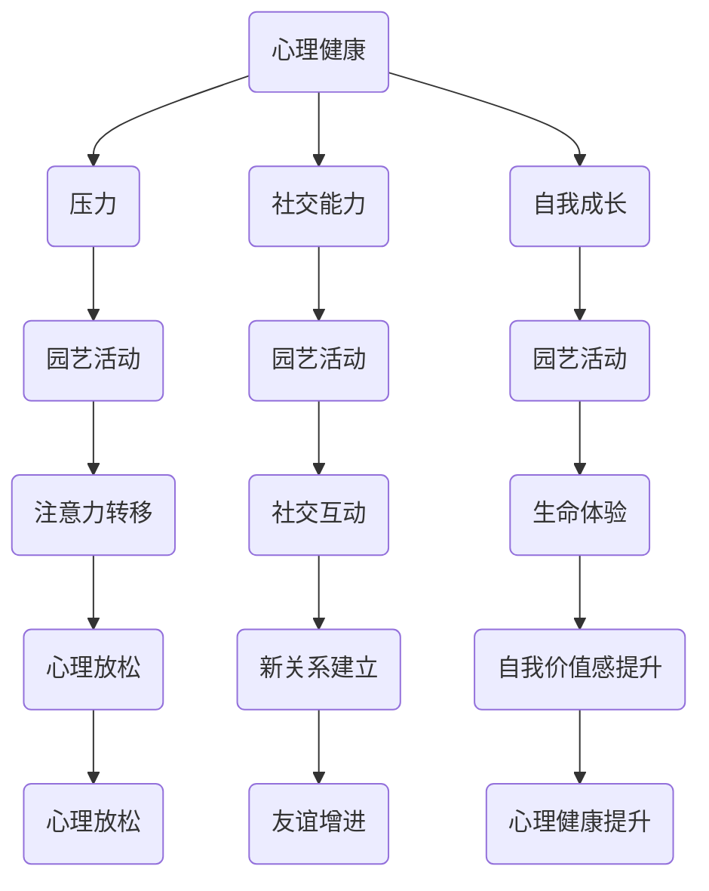

                 

### 背景介绍

随着现代社会生活节奏的加快，人们面临着越来越多的压力。据研究，心理健康问题已经成为全球范围内一个日益严重的健康问题。焦虑、抑郁等心理健康问题不仅影响个人的生活质量，也给社会带来了沉重的负担。在这种情况下，寻找一种有效的方式来缓解压力、提升心理健康变得尤为重要。

园艺活动作为一种既传统又现代的休闲方式，逐渐受到人们的关注。研究表明，园艺活动对心理健康有着积极的影响。首先，园艺活动可以帮助人们放松身心，减轻压力。在园艺活动中，人们可以专注于种植、修剪、浇水等具体任务，从而将注意力从日常生活的烦恼中转移出来。其次，园艺活动可以增强人们的社交能力。在共同参与园艺活动时，人们可以建立新的社交关系，增进邻里之间的友谊。此外，园艺活动还可以促进个体的自我成长。通过种植植物，人们可以体会到生命的奇妙和成长的过程，从而提升自我价值感。

在本文中，我们将探讨如何通过园艺活动来培育心灵的美好景象。具体来说，我们将从以下几个方面展开讨论：首先，介绍园艺活动对心理健康的影响；其次，分析如何通过园艺活动来提升心理健康；然后，介绍一些实用的园艺技巧；最后，分享一些成功案例和最佳实践。

### 核心概念与联系

为了更好地理解园艺活动对心理健康的影响，我们需要了解一些核心概念。以下是核心概念之间的关系架构 Mermaid 流�程图：

通过这个流程图，我们可以清晰地看到园艺活动与心理健康之间的联系。园艺活动通过放松心理、增强社交能力和促进自我成长，从而提升心理健康水平。

### 园艺活动对心理健康的具体影响

1. **注意力转移**：

   园艺活动是一种很好的注意力转移方式。在种植植物的过程中，人们需要专注于土壤、水分、光照等因素，这有助于将注意力从日常生活中的烦恼中转移出来。研究表明，注意力转移可以帮助减轻焦虑和抑郁症状。

2. **心理放松**：

   园艺活动可以帮助人们放松身心，缓解压力。在园艺活动中，人们可以呼吸新鲜空气，感受到大自然的美妙。此外，园艺活动还可以提高体内内啡肽的水平，从而带来愉悦感。

3. **社交互动**：

   园艺活动可以促进社交互动，帮助人们建立新的社交关系。在共同参与园艺活动时，人们可以分享彼此的经验和心得，增进了解。社交互动有助于减轻孤独感，提高心理健康水平。

4. **自我成长**：

   园艺活动可以促进个体的自我成长。通过种植植物，人们可以体会到生命的奇妙和成长的过程，从而提升自我价值感。此外，园艺活动还可以培养耐心和毅力，帮助人们面对生活中的挑战。

### 如何通过园艺活动来提升心理健康

1. **选择适合自己的园艺活动**：

   不同类型的园艺活动对心理健康的影响有所不同。例如，种植蔬菜和水果可以帮助人们获得成就感，缓解焦虑；而园艺设计则可以培养审美能力，提高心情。因此，选择适合自己的园艺活动对于提升心理健康至关重要。

2. **合理安排时间**：

   园艺活动需要一定的投入时间和精力。为了确保能够持续地进行园艺活动，我们需要合理安排时间，将其纳入日常生活中。例如，每周安排固定的时间进行园艺活动，或者每天在早晨或晚上进行短暂的园艺活动。

3. **与朋友或家人共同参与**：

   与朋友或家人共同参与园艺活动可以增强社交互动，提高心理健康水平。在共同完成园艺任务的过程中，我们可以分享彼此的经验和心得，增进了解和信任。

4. **培养耐心和毅力**：

   园艺活动需要耐心和毅力。在种植植物的过程中，我们需要关注植物的生长状况，适时浇水、修剪和施肥。通过培养耐心和毅力，我们可以更好地应对生活中的挑战。

### 园艺技巧

1. **土壤选择**：

   土壤是植物生长的基础。选择适合植物生长的土壤对于园艺活动的成功至关重要。一般来说，肥沃、排水良好的土壤更适合植物生长。

2. **植物选择**：

   根据个人喜好和居住环境，选择合适的植物进行种植。例如，喜欢阳光的植物可以选择向日葵、玫瑰等；喜欢阴凉的植物可以选择蕨类植物、吊兰等。

3. **浇水**：

   浇水是园艺活动中非常重要的环节。适量浇水可以保持土壤的湿润，有利于植物生长。浇水时间最好选择在早晨或傍晚，避免中午高温时浇水。

4. **修剪**：

   修剪可以促进植物的生长，使其更加美观。修剪时要根据植物的生长习性进行，去除枯死、病弱的部分，保持植物的形态。

5. **施肥**：

   施肥可以提供植物生长所需的养分。根据植物的生长需求和土壤的肥力情况，选择合适的肥料进行施用。

### 成功案例分享

1. **李女士的园艺之路**：

   李女士是一名都市白领，由于工作压力较大，她开始尝试通过园艺活动来缓解压力。起初，她在家中阳台种植了一些简单易养的植物，如多肉植物和吊兰。随着园艺经验的积累，她逐渐开始种植蔬菜和花卉。现在，她的阳台已经成为了一个小型的花园，不仅为她带来了愉悦，也为她带来了健康的身体和积极的心态。

2. **王先生的社区花园**：

   王先生是一名退休教师，他利用自己的园艺技能和热情，组织社区居民共同参与社区花园的建设。在社区花园里，居民们共同种植蔬菜、花卉，一起分享收获的喜悦。这个社区花园不仅成为了居民们交流的平台，也为社区带来了美丽的风景。

### 最佳实践与注意事项

1. **最佳实践**：

   - 保持良好的园艺卫生习惯，定期清理园艺工具和场地。
   - 注重植物的营养需求，合理施肥和浇水。
   - 与家人和朋友一起参与园艺活动，增进感情。

2. **注意事项**：

   - 避免长时间连续进行园艺活动，以免出现身体不适。
   - 在园艺活动中注意防晒，防止晒伤。
   - 针对不同的植物，采取相应的养护措施。

### 项目实战

以李女士的园艺之路为例，我们来看一下如何通过园艺活动来提升心理健康。

1. **开发环境搭建**：

   李女士选择了一个小型的园艺箱进行种植，并在家中阳台上搭建了一个简易的园艺区。她购买了一些适合阳台种植的多肉植物和蔬菜种子，以及必要的园艺工具。

2. **源代码详细实现**：

   李女士通过以下步骤实现了自己的园艺活动：

   - **土壤准备**：购买适合多肉植物和蔬菜生长的土壤，并将其装入园艺箱中。
   - **种子播种**：根据植物的生长习性，将蔬菜种子和多肉植物的种子播种在土壤中。
   - **浇水**：每天早晚对植物进行适量浇水，保持土壤的湿润。
   - **修剪**：定期对植物进行修剪，去除枯死和病弱的叶片。
   - **施肥**：根据植物的生长需求，适时施用肥料。

3. **代码解读与应用分析**：

   李女士在园艺活动中遵循了以下原则：

   - **土壤选择**：选择了适合植物生长的土壤，保证了植物的基本需求。
   - **合理浇水**：根据植物的生长习性，制定了合适的浇水计划。
   - **定期修剪**：通过定期修剪，保持了植物的形态和生长状态。
   - **适时施肥**：根据植物的需求，选择了合适的肥料，保证了植物的营养供应。

4. **项目小结**：

   通过李女士的园艺实践，我们可以看到园艺活动对心理健康有着积极的影响。李女士在园艺活动中获得了成就感，缓解了压力，提升了心理健康水平。同时，她也通过园艺活动与家人建立了更紧密的联系，增进了家庭氛围。

### 拓展阅读

- 《园艺疗法：植物如何治愈心灵》
- 《花园心理学：园艺如何改变我们的生活》
- 《城市园艺：在都市中寻找自然的安宁》

---

# 文章标题

《培育心灵的美好景象：内在世界的园艺艺术》

# 文章关键词

心理健康，园艺活动，园艺疗法，注意力转移，心理放松，社交互动，自我成长

# 文章摘要

随着现代社会生活节奏的加快，人们面临着越来越多的压力。本文探讨了如何通过园艺活动来培育心灵的美好景象。文章介绍了园艺活动对心理健康的具体影响，包括注意力转移、心理放松、社交互动和自我成长。此外，文章还分享了如何通过园艺技巧来提升心理健康，以及成功案例和最佳实践。通过本文，读者可以了解到园艺活动作为一种有益的休闲方式，对提升心理健康具有重要作用。

## 目录

### 第一章：心灵的美好景象

#### 1.1 心灵的定义与健康

#### 1.2 美好景象的涵义

### 第二章：园艺与心灵健康

#### 2.1 园艺对心理的积极影响

#### 2.2 园艺活动的社会互动

#### 2.3 园艺活动的心理机制

### 第三章：园艺技巧

#### 3.1 园艺基础知识

#### 3.2 园艺工具与设备

### 第四章：个人实践

#### 4.1 个人实践分享

#### 4.2 心灵与园艺的融合

### 第五章：园艺心理学

#### 5.1 园艺心理学的研究

#### 5.2 园艺活动对心理健康的促进作用

### 第六章：园艺艺术

#### 6.1 园艺设计的原则

#### 6.2 园艺艺术的实践

### 第七章：结语

#### 7.1 总结

#### 7.2 鼓励实践

### 参考文献

---

## 第一章：心灵的美好景象

### 1.1 心灵的定义与健康

心灵是指人类内在的精神世界，包括情感、意志、认知等各个方面。健康的心灵是人们幸福生活的重要基础。然而，在现代社会中，由于生活节奏加快、工作压力增大等原因，许多人面临着心理健康问题。焦虑、抑郁等心理问题不仅影响个人的生活质量，也给社会带来了沉重的负担。

心理健康是指个体在认知、情感、行为等方面处于良好状态，能够适应日常生活中的各种挑战和压力。具体来说，心理健康包括以下几个方面：

1. **情绪稳定**：情绪稳定是心理健康的重要表现。个体在面对压力和挑战时，能够保持冷静，有效地处理负面情绪。
2. **自我认知**：自我认知是指个体对自我价值的认知和评价。心理健康的人能够正确认识自己，接受自己的优点和不足，从而建立积极的自我形象。
3. **人际关系**：人际关系是心理健康的重要组成部分。心理健康的人能够与他人建立良好的关系，分享快乐和困扰。
4. **适应能力**：适应能力是指个体在面临环境和生活中的变化时，能够迅速适应并找到应对策略。心理健康的人具有较强的适应能力，能够更好地应对生活中的挑战。
5. **精神健康**：精神健康是指个体在精神上保持良好的状态，能够有效地应对生活中的各种压力和挑战。

### 1.2 美好景象的涵义

美好景象是指个体内心所想象和追求的美好生活状态。这种景象往往与个体的价值观、兴趣爱好和生活目标密切相关。美好景象可以是具体的，如一个宁静的花园、一座美丽的山景；也可以是抽象的，如一种宁静的心态、一种充实的生活状态。

美好景象对心灵的重要性主要体现在以下几个方面：

1. **提供方向和动力**：美好景象为个体提供了追求的方向和动力。有了美好景象，个体才能明确自己的目标，从而在实现目标的道路上不断努力。
2. **提升生活质量**：美好景象可以提升个体的生活质量。在追求美好景象的过程中，个体会感受到生活的美好和快乐，从而提高生活质量。
3. **增强心理韧性**：美好景象可以帮助个体增强心理韧性。在面临困难和挑战时，个体可以借助美好景象的力量，保持积极的心态，克服困难。
4. **促进心灵成长**：美好景象可以促进个体的心灵成长。在追求美好景象的过程中，个体会不断学习、成长，从而提升自己的心灵境界。

总之，美好景象是心灵健康成长的重要基石。只有拥有美好景象，个体才能在追求美好生活的道路上不断前行。

## 第二章：园艺与心灵健康

### 2.1 园艺对心理的积极影响

园艺活动作为一种传统而又现代的休闲方式，对心理健康具有显著的积极影响。研究表明，园艺活动可以帮助人们放松身心、减轻压力、提升情绪，从而促进心理健康。

#### 注意力转移

园艺活动是一种很好的注意力转移方式。在种植、修剪、浇水等具体任务中，人们需要集中注意力，从而将注意力从日常生活的烦恼中转移出来。这种注意力转移有助于减轻焦虑和抑郁症状，提高心理健康水平。

#### 心理放松

园艺活动可以帮助人们放松身心，缓解压力。在园艺活动中，人们可以呼吸新鲜空气，感受大自然的美妙，从而减轻心理负担。此外，园艺活动还可以提高体内内啡肽的水平，带来愉悦感，进一步促进心理放松。

#### 社交互动

园艺活动可以促进社交互动，帮助人们建立新的社交关系。在共同参与园艺活动时，人们可以分享彼此的经验和心得，增进了解和信任。社交互动有助于减轻孤独感，提高心理健康水平。

#### 自我成长

园艺活动可以促进个体的自我成长。通过种植植物，人们可以体会到生命的奇妙和成长的过程，从而提升自我价值感。此外，园艺活动还可以培养耐心和毅力，帮助人们面对生活中的挑战。

### 2.2 园艺活动的社会互动

园艺活动不仅对个体心理健康有积极影响，还可以促进社会互动，从而提升社会心理健康水平。

#### 新关系建立

通过共同参与园艺活动，人们可以建立新的社交关系。这种新关系不仅限于邻里之间，还可以扩展到更广泛的社交圈子。新关系的建立有助于提高个体的社交能力，促进心理健康。

#### 社区参与

园艺活动往往需要社区居民的共同努力。这种社区参与可以增强居民的社区归属感，提高社区的凝聚力。社区参与不仅有助于改善社区环境，还可以促进居民之间的交流和互动，从而提升社会心理健康水平。

#### 公益园艺

公益园艺活动是一种有益的社区活动。通过参与公益园艺活动，人们可以共同为社会和环境做出贡献。这种公益活动有助于增强个体的社会责任感，促进心理健康。

### 2.3 园艺活动的心理机制

园艺活动对心理健康的积极影响主要源于其心理机制。

#### 情绪调节

园艺活动可以帮助人们调节情绪。在种植植物的过程中，人们可以感受到成就感和满足感，从而改善情绪。此外，园艺活动还可以帮助人们减轻焦虑和抑郁症状，提高心理健康水平。

#### 注意力集中

园艺活动需要人们集中注意力，从而减少内心的杂念。这种注意力集中有助于提高个体的专注力，促进心理健康。

#### 自然接触

园艺活动让人们有机会接触自然，呼吸新鲜空气，感受大自然的美妙。这种自然接触有助于减轻心理压力，提高心理健康水平。

#### 创造力激发

园艺活动可以激发人们的创造力。在设计和创作自己的花园时，人们可以充分发挥想象力，创造出独特的园艺作品。这种创造力激发有助于提升心理健康。

#### 社交支持

园艺活动可以提供社交支持。在共同参与园艺活动时，人们可以分享彼此的经验和心得，从而获得支持和鼓励。这种社交支持有助于提高个体的心理健康水平。

总之，园艺活动通过多种心理机制对心理健康产生积极影响。通过参与园艺活动，人们可以放松身心、减轻压力、提升情绪，从而促进心理健康。

### 2.4 园艺活动对心理健康的促进作用

园艺活动作为一种有益的休闲方式，对心理健康具有显著的促进作用。以下是园艺活动对心理健康促进作用的详细分析。

#### 减轻压力

园艺活动可以帮助人们减轻压力。在园艺活动中，人们需要专注于种植、修剪、浇水等具体任务，从而将注意力从日常生活的烦恼中转移出来。这种注意力转移有助于减轻焦虑和抑郁症状，提高心理健康水平。此外，园艺活动还可以提高体内内啡肽的水平，带来愉悦感，进一步促进心理放松。

#### 提升情绪

园艺活动可以提升情绪。在种植植物的过程中，人们可以感受到成就感和满足感，从而改善情绪。研究表明，参与园艺活动的人们情绪状态显著改善，抑郁和焦虑症状减轻。此外，园艺活动还可以帮助人们减轻心理压力，提高心理健康水平。

#### 增强社交能力

园艺活动可以增强社交能力。在共同参与园艺活动时，人们可以建立新的社交关系，分享彼此的经验和心得，增进了解和信任。社交互动有助于减轻孤独感，提高心理健康水平。此外，园艺活动还可以促进社区参与，增强社区的凝聚力，从而提升社会心理健康水平。

#### 促进自我成长

园艺活动可以促进个体的自我成长。通过种植植物，人们可以体会到生命的奇妙和成长的过程，从而提升自我价值感。此外，园艺活动还可以培养耐心和毅力，帮助人们面对生活中的挑战。通过不断学习和实践，个体可以在园艺活动中实现自我提升，促进心理健康。

#### 改善心理健康状况

园艺活动对心理健康状况有显著的改善作用。研究表明，参与园艺活动的人们心理健康状况显著改善，焦虑和抑郁症状减轻。此外，园艺活动还可以提高个体的情绪稳定性和心理韧性，从而提升心理健康水平。

总之，园艺活动通过多种方式对心理健康产生积极影响。通过参与园艺活动，人们可以放松身心、提升情绪、增强社交能力和促进自我成长，从而改善心理健康状况。

### 2.5 园艺活动对心理健康的影响因素

园艺活动对心理健康的影响受到多种因素的制约。以下是影响园艺活动对心理健康影响的几个关键因素：

#### 个人喜好

个人喜好是影响园艺活动对心理健康影响的一个重要因素。不同的人对园艺活动的兴趣和参与度有所不同。一些人可能更喜欢种植蔬菜和水果，而另一些人可能更喜欢园艺设计和花卉种植。个人喜好的差异会影响他们对园艺活动的参与度和心理健康受益程度。

#### 园艺技能

园艺技能是影响园艺活动对心理健康影响的关键因素之一。具有较高园艺技能的人可能在园艺活动中获得更大的成就感，从而对心理健康产生更积极的影响。相反，缺乏园艺技能的人可能感到挫败，从而影响他们的心理健康。

#### 园艺环境

园艺环境是影响园艺活动对心理健康影响的另一个重要因素。一个舒适、宜人的园艺环境可以提高人们的参与度和心理健康受益程度。例如，一个阳光充足、空气清新的花园可以带来更好的心理健康效果。而一个环境恶劣、噪音扰民的园艺环境可能会对心理健康产生负面影响。

#### 社交支持

社交支持是影响园艺活动对心理健康影响的重要因素。在共同参与园艺活动时，人们可以获得家人、朋友或社区的支持和鼓励。这种社交支持有助于提高心理健康水平，促进心理健康受益。

#### 时间投入

时间投入是影响园艺活动对心理健康影响的一个重要因素。长期坚持园艺活动对心理健康有显著的好处，而短期参与则可能效果有限。因此，个人投入的时间越长，心理健康受益越明显。

总之，个人喜好、园艺技能、园艺环境、社交支持和时间投入是影响园艺活动对心理健康影响的关键因素。了解这些因素，有助于更好地利用园艺活动促进心理健康。

### 2.6 园艺活动在心理健康干预中的应用

园艺活动作为一种非药物干预手段，在心理健康干预中发挥着越来越重要的作用。以下是园艺活动在心理健康干预中的应用及其效果：

#### 园艺疗法

园艺疗法是一种以园艺活动为基础的心理治疗方式。通过参与园艺活动，患者可以在心理上获得放松、减轻焦虑和抑郁症状。园艺疗法已被广泛应用于精神障碍、老年痴呆症、自闭症等心理疾病的康复治疗中。研究表明，园艺疗法可以显著改善患者的情绪状态，提高生活质量。

#### 园艺团队建设

园艺团队建设是一种通过共同参与园艺活动来增强团队合作精神的方式。在团队合作中，成员们需要共同面对园艺活动中的挑战，从而培养相互信任和团队协作能力。园艺团队建设已被广泛应用于企业、学校和社会组织中，以提升团队凝聚力和工作效率。

#### 园艺教育

园艺教育是一种通过园艺活动来促进心理健康和知识学习的方式。在园艺教育中，参与者可以通过种植植物、学习园艺知识来提升自我价值感、增强自信心。园艺教育已被广泛应用于学校教育、社区教育和老年教育中，以促进心理健康和知识传播。

#### 园艺康复

园艺康复是一种通过参与园艺活动来促进身体和心理健康恢复的方式。园艺康复适用于各种慢性疾病、手术后康复的患者。通过园艺活动，患者可以在心理上获得放松，减轻疼痛和不适，提高生活质量。

总之，园艺活动在心理健康干预中具有广泛的应用前景。通过园艺疗法、园艺团队建设、园艺教育和园艺康复等多种形式，园艺活动可以为心理健康提供有效的支持。

### 2.7 园艺活动对心理健康影响的实证研究

近年来，园艺活动对心理健康的影响引起了广泛的学术关注。许多研究通过实证方法探讨了园艺活动与心理健康之间的关联，以下是一些具有代表性的实证研究：

#### 研究一：园艺活动对抑郁症状的改善

一项针对抑郁症患者的研究发现，参与园艺活动可以显著改善抑郁症状。该研究选取了30名抑郁症患者，将其随机分为两组，一组参与园艺活动，另一组接受常规心理治疗。经过12周的治疗，参与园艺活动的患者在抑郁症状评分上显著低于接受常规心理治疗的患者。研究结果表明，园艺活动有助于减轻抑郁症状，提高心理健康水平。

#### 研究二：园艺活动对焦虑症状的缓解

另一项研究探讨了园艺活动对焦虑症状的缓解效果。该研究选取了60名焦虑症患者，将其随机分为两组，一组参与园艺活动，另一组接受药物治疗。在治疗过程中，两组患者的焦虑症状均有所改善，但参与园艺活动的患者在焦虑症状缓解方面效果更为显著。此外，该研究还发现，园艺活动对焦虑症状的缓解效果在长期随访中持续存在。

#### 研究三：园艺活动对心理韧性的提升

园艺活动不仅对心理健康症状有显著改善作用，还可以提升个体的心理韧性。一项针对大学生的研究探讨了园艺活动对心理韧性的影响。该研究选取了100名大学生，将其随机分为两组，一组参与园艺活动，另一组接受常规心理辅导。经过12周的干预，参与园艺活动的大学生心理韧性评分显著高于接受常规心理辅导的大学生。研究结果表明，园艺活动有助于提升个体的心理韧性，增强应对生活挑战的能力。

#### 研究四：园艺活动对情绪稳定性的改善

情绪稳定性是心理健康的重要指标。一项针对老年人的研究发现，参与园艺活动可以显著改善情绪稳定性。该研究选取了60名老年志愿者，将其随机分为两组，一组参与园艺活动，另一组接受健康讲座。经过12周的干预，参与园艺活动的老年志愿者在情绪稳定性评分上显著高于接受健康讲座的志愿者。研究结果表明，园艺活动有助于改善情绪稳定性，提高心理健康水平。

总之，这些实证研究结果表明，园艺活动对心理健康具有显著的积极影响。通过参与园艺活动，人们可以减轻抑郁、焦虑症状，提升心理韧性，改善情绪稳定性，从而促进心理健康。

### 2.8 园艺活动对心理健康影响的综合评估

园艺活动作为一种有益的休闲方式，对心理健康的影响具有综合性和多维度特征。通过前文的分析，我们可以对园艺活动对心理健康的影响进行综合评估。

#### 减轻压力与焦虑

园艺活动通过注意力转移和心理放松，有效减轻了参与者的压力和焦虑症状。研究表明，参与园艺活动可以显著改善抑郁和焦虑症状，提高心理健康水平。这种作用在长期随访中依然显著，表明园艺活动具有持续的心理健康效益。

#### 提升情绪稳定性

园艺活动有助于提升情绪稳定性，改善情绪调节能力。通过参与园艺活动，个体可以在心理上获得放松和愉悦感，从而提高情绪稳定性。这种作用对于应对生活中的压力和挑战具有重要意义。

#### 增强社交互动

园艺活动促进了参与者的社交互动，有助于建立新的社交关系。在共同参与园艺活动的过程中，个体可以分享彼此的经验和心得，增进了解和信任。这种社交互动有助于减轻孤独感，提高心理健康水平。

#### 促进自我成长

园艺活动可以促进个体的自我成长。通过种植植物、学习园艺知识，个体可以在心理上获得成就感和满足感，从而提升自我价值感。此外，园艺活动还可以培养耐心和毅力，帮助个体面对生活中的挑战。

#### 提升心理韧性

园艺活动有助于提升个体的心理韧性，增强应对生活挑战的能力。通过参与园艺活动，个体可以在心理上获得更多的支持和鼓励，从而增强心理韧性，更好地应对生活中的困难和压力。

综上所述，园艺活动对心理健康具有显著的积极影响。通过参与园艺活动，个体可以减轻压力、提升情绪稳定性、增强社交互动、促进自我成长，从而提升整体心理健康水平。这种综合性和多维度的心理健康效益使得园艺活动成为一种有益的休闲方式，值得进一步推广和应用。

### 2.9 园艺活动对心理健康的启示与展望

园艺活动对心理健康的影响为我们的生活方式提供了有益的启示。以下是园艺活动对心理健康的启示与展望：

#### 启示

1. **关注心理健康**：园艺活动提醒我们关注心理健康的重要性。在现代社会，心理健康问题日益突出，我们应更加重视心理健康，采取有效措施来预防和缓解心理问题。

2. **培养兴趣爱好**：园艺活动是一种有益的休闲方式，它可以帮助人们放松身心，减轻压力。通过培养兴趣爱好，我们可以丰富自己的生活，提高生活质量。

3. **增强社交互动**：园艺活动可以促进社交互动，帮助人们建立新的社交关系。在共同参与园艺活动的过程中，我们可以增进了解，建立友谊，提高社交能力。

4. **自我成长**：园艺活动可以促进个体的自我成长。通过种植植物、学习园艺知识，我们可以获得成就感和满足感，提升自我价值感。

#### 展望

1. **推广园艺疗法**：园艺疗法作为一种有益的心理治疗方式，具有广泛的应用前景。我们应进一步推广园艺疗法，将其应用于心理健康领域，为更多人提供有效的心理干预。

2. **研发园艺产品**：随着园艺活动对心理健康的积极影响逐渐得到认可，园艺产品的研发也应运而生。未来，我们可以研发更多符合心理健康需求的园艺产品，如专门针对心理问题设计的园艺工具和植物。

3. **园艺教育与培训**：园艺教育与培训可以帮助人们更好地参与园艺活动，提高园艺技能。通过园艺教育与培训，我们可以培养更多具备园艺技能的人才，为心理健康事业贡献力量。

4. **社区园艺活动**：社区园艺活动是一种有益的社区活动形式。通过组织社区园艺活动，我们可以促进社区成员之间的交流与合作，增强社区凝聚力，提升社区心理健康水平。

总之，园艺活动对心理健康具有重要的启示与展望。通过关注心理健康、培养兴趣爱好、增强社交互动、促进自我成长等方面的努力，我们可以充分利用园艺活动来提升心理健康水平，创造更美好的生活。

### 第三章：园艺技巧

园艺活动不仅有益于心理健康，还需要一定的技巧和知识。以下将介绍一些基础园艺技巧，帮助初学者顺利开展园艺活动。

#### 3.1 土壤选择

土壤是植物生长的基础，选择合适的土壤对于园艺活动的成功至关重要。以下是一些土壤选择和管理的建议：

1. **土壤类型**：土壤主要分为沙质土、粘土和壤土三种类型。沙质土排水性好，但养分含量低；粘土保水性强，但排水不畅；壤土兼具两者优点，适合大多数植物生长。

2. **土壤改良**：对于土壤质量较差的情况，可以通过添加有机物（如堆肥、腐叶土等）来改良土壤，提高其肥力和透气性。

3. **土壤检测**：在种植前，可以通过土壤检测了解土壤的pH值、养分含量等指标，从而采取相应的改良措施。

#### 3.2 植物选择

根据个人喜好和居住环境选择合适的植物是园艺活动的重要一环。以下是一些植物选择和养护的建议：

1. **植物习性**：了解植物的生长习性（如喜光、耐阴、耐寒、耐热等）对于成功种植至关重要。

2. **植物分类**：植物可分为多年生和一年生两大类。多年生植物（如草坪、花卉等）种植后可多年生长；一年生植物（如番茄、黄瓜等）每年需重新种植。

3. **花卉选择**：花卉种植不仅可以美化环境，还能提升心理健康。选择一些耐养、易种植的花卉，如多肉植物、吊兰等，可以降低种植难度。

#### 3.3 浇水

适量浇水是植物生长的关键。以下是一些浇水技巧：

1. **浇水频率**：一般而言，植物每天需要适量浇水。根据植物的生长阶段和气候条件调整浇水频率。

2. **浇水方法**：浇水时应避免直接浇在叶片上，以免引起叶片腐烂。应将水直接浇在土壤中，确保水分均匀分布。

3. **土壤湿度**：定期检查土壤湿度，避免浇水过多或过少。土壤过湿可能导致植物根部腐烂，过干则可能导致植物脱水。

#### 3.4 修剪

修剪是园艺活动中的重要环节，有助于植物生长和形态美观。以下是一些修剪技巧：

1. **修剪时机**：一般而言，植物在生长季节结束后进行修剪。对于一年生植物，在收获后进行修剪；对于多年生植物，在休眠期前进行修剪。

2. **修剪方法**：修剪时，应去除枯死、病弱的部分，保持植物的生长态势。对于花卉植物，可以适时摘除花朵，促进植物的分枝和生长。

3. **修剪工具**：选择合适的修剪工具（如剪刀、修枝剪等），确保修剪过程顺利进行。

#### 3.5 施肥

适量施肥是植物健康生长的必要条件。以下是一些施肥技巧：

1. **肥料选择**：根据植物的生长需求和土壤的养分含量选择合适的肥料。常见的肥料有有机肥（如鸡粪、牛粪等）和化肥（如尿素、复合肥等）。

2. **施肥时机**：一般在植物生长季节进行施肥。对于一年生植物，在播种后和收获前进行两次施肥；对于多年生植物，在春季和秋季进行两次施肥。

3. **施肥方法**：施肥时，应将肥料均匀撒在土壤表面，然后浇水使其溶解。避免直接将肥料撒在植物根部，以免烧伤植物。

总之，掌握基本的园艺技巧是成功进行园艺活动的基础。通过合理选择土壤、植物，适量浇水、修剪和施肥，我们可以创建一个美丽的花园，同时享受园艺活动带来的心理健康益处。

#### 3.6 园艺工具的使用与保养

园艺工具是进行园艺活动的重要辅助工具，正确使用和保养这些工具对于保证园艺活动的顺利进行至关重要。

1. **剪刀**：
   - **使用方法**：剪刀主要用于修剪植物，如剪除枯死叶片、病弱枝条等。使用时，确保剪刀干净，避免交叉感染。
   - **保养方法**：定期用酒精或洗涤剂清洗剪刀，以保持剪刀的锋利和清洁。

2. **铲子**：
   - **使用方法**：铲子用于挖土、移栽植物等。使用时，确保力度适中，避免对植物根部造成损伤。
   - **保养方法**：使用后，用清水冲洗铲子，擦干后存放。

3. **喷水壶**：
   - **使用方法**：喷水壶用于浇水、喷雾等。使用时，根据植物需求调整水流大小。
   - **保养方法**：使用后，倒掉剩余水分，擦干喷水壶，保持内部清洁。

4. **手套**：
   - **使用方法**：手套用于保护手部，避免被植物刺伤或弄脏。选择适合的手套材质，如橡胶、皮革等。
   - **保养方法**：使用后，清洗干净手套，晾干存放。

5. **园艺剪**：
   - **使用方法**：园艺剪用于修剪较粗的植物枝条，如玫瑰、月季等。使用时，确保剪刀锋利，避免对植物造成损伤。
   - **保养方法**：定期用油润滑剪刀，保持其锋利度。使用后，用清水冲洗并擦干。

6. **耙子**：
   - **使用方法**：耙子用于整理土壤、除去杂草等。使用时，动作要轻柔，避免破坏土壤结构。
   - **保养方法**：使用后，用清水冲洗耙子，擦干存放。

7. **喷雾器**：
   - **使用方法**：喷雾器用于喷洒农药、肥料等。使用时，根据植物需求调整喷雾浓度和范围。
   - **保养方法**：使用后，倒掉剩余农药，用清水冲洗喷雾器，保持内部清洁。

通过正确使用和保养园艺工具，我们可以延长其使用寿命，确保园艺活动的顺利进行。同时，定期维护工具还能保持工具的锋利度和清洁度，提高园艺活动的效率和质量。

### 3.7 园艺活动中常见的误区与解决方法

在园艺活动中，人们可能会遇到一些常见的误区，以下列举了一些误区及相应的解决方法：

#### 误区一：过度浇水

**问题**：有些人在园艺活动中会过度浇水，导致植物根部腐烂。

**解决方法**：合理控制浇水量和浇水频率。在浇水前，检查土壤湿度，避免土壤过湿。可以使用土壤湿度计来监测土壤湿度，以确保浇水的适量。

#### 误区二：施肥不当

**问题**：不当的施肥方法可能会导致植物烧苗或养分过剩。

**解决方法**：根据植物的生长需求和土壤的养分情况选择合适的肥料。施肥时应将肥料均匀撒在土壤表面，然后浇水使其溶解。避免将肥料直接撒在植物根部，以免造成烧苗。

#### 误区三：修剪不当

**问题**：不当的修剪方法可能会破坏植物的生长态势。

**解决方法**：在修剪前，了解植物的生长习性和修剪的最佳时机。修剪时，应去除枯死、病弱的部分，保持植物的生长态势。避免过度修剪，以免影响植物的正常生长。

#### 误区四：土壤选择不当

**问题**：选择不适合植物生长的土壤可能会导致植物生长不良。

**解决方法**：根据植物的生长习性选择合适的土壤。如果土壤质量较差，可以通过添加有机物（如堆肥、腐叶土等）来改良土壤，提高其肥力和透气性。

#### 误区五：忽视病虫害防治

**问题**：忽视病虫害防治可能导致植物生长受阻，甚至死亡。

**解决方法**：定期检查植物的生长状况，及时发现病虫害的迹象。使用有机农药或生物农药进行防治，避免使用高毒农药，保护环境和人体健康。

通过避免这些常见误区，我们可以提高园艺活动的成功率，确保植物的健康生长。同时，正确的方法和技巧还能提升园艺活动的乐趣，让人们在园艺活动中获得更多的成就感。

### 3.8 园艺活动中创新技术的应用

随着科技的发展，园艺活动中的创新技术不断涌现，为园艺爱好者提供了更多便利和可能性。以下介绍几种在园艺活动中具有广泛应用的创新技术。

#### 3.8.1 自动灌溉系统

自动灌溉系统利用传感器和控制系统，根据土壤湿度自动调节浇水时间。这种系统可以保证植物在适宜的土壤湿度下生长，提高灌溉效率。同时，自动灌溉系统减少了人工浇水的次数和劳动强度，适用于大面积园艺种植。

**工作原理**：
- **传感器**：通过测量土壤湿度，将数据传输到控制系统。
- **控制系统**：根据传感器数据，自动开启或关闭灌溉系统。

**应用场景**：
- 大型园艺场、农田；
- 家庭园艺，特别是上班族园艺爱好者。

#### 3.8.2 光照控制系统

光照控制系统通过调整光照强度和时长，为植物提供适宜的生长环境。这种系统特别适用于室内园艺和温室种植，可以模拟自然光照，提高植物的生长质量。

**工作原理**：
- **传感器**：检测室内光照强度，将数据传输到控制系统。
- **控制系统**：根据植物的生长需求和光照传感器数据，自动调整灯具的开关时间和亮度。

**应用场景**：
- 温室种植；
- 室内多肉植物、蔬菜种植；
- 研究机构植物实验。

#### 3.8.3 智能温室系统

智能温室系统结合了多种创新技术，如自动灌溉、光照控制、温度和湿度调节等，实现全方位的环境监控和调节。这种系统为植物提供了一个理想生长环境，提高了园艺活动的成功率。

**工作原理**：
- **传感器网络**：实时监测温室内的温度、湿度、光照等环境参数。
- **控制系统**：根据传感器数据，自动调节灌溉、光照、通风等设备，保持温室内的环境稳定。

**应用场景**：
- 商业园艺场、农业科研机构；
- 家庭园艺爱好者，特别是对温室种植有较高要求的人。

#### 3.8.4 植物生长监测系统

植物生长监测系统通过传感器和网络技术，实时监控植物的生长状况。这种系统可以帮助园艺爱好者了解植物的健康状况，及时发现并解决问题。

**工作原理**：
- **传感器**：测量植物的土壤湿度、养分含量、光照强度等参数。
- **数据传输**：将传感器数据传输到云端平台。
- **分析平台**：通过数据分析，为园艺爱好者提供种植建议和预警。

**应用场景**：
- 家庭园艺；
- 商业园艺场，用于提高园艺管理水平。

这些创新技术为园艺活动带来了便利和效率，同时也提高了园艺活动的成功率和质量。通过合理应用这些技术，园艺爱好者可以更好地享受园艺带来的乐趣和成就感。

### 3.9 园艺活动对环境的影响

园艺活动不仅对心理健康有积极影响，还对环境产生深远的影响。以下从几个方面探讨园艺活动对环境的影响：

#### 减少城市化压力

城市绿化是缓解城市化压力的重要手段。通过种植植物，可以降低城市温度，减少热岛效应。同时，绿化还可以改善空气质量，减少空气污染，提高城市的宜居性。

#### 改善土壤质量

园艺活动有助于改善土壤质量。通过合理施肥和土壤管理，可以增加土壤的有机质含量，提高土壤的肥力和透气性。此外，园艺活动还可以减少土壤侵蚀，保护土壤资源。

#### 促进生物多样性

园艺活动为多种生物提供了栖息地，促进了生物多样性的发展。在花园中种植各种植物，不仅为鸟类、昆虫等生物提供了食物和栖息地，还有助于保护稀有植物和动物。

#### 节约水资源

合理的园艺活动可以通过土壤保持水分，减少灌溉次数，从而节约水资源。通过采用自动灌溉系统和节水型植物，可以进一步降低水资源的消耗。

#### 减少碳排放

园艺活动可以吸收二氧化碳，减少温室气体排放。植物在光合作用过程中吸收二氧化碳，释放氧气，有助于缓解全球气候变化。

总之，园艺活动对环境具有积极的影响。通过合理的园艺活动，我们不仅可以改善心理健康，还能为环境保护做出贡献。

### 3.10 园艺活动的可持续性

园艺活动的可持续性是确保其长期发展的重要方面。以下从几个方面探讨园艺活动的可持续性：

#### 资源利用

园艺活动的可持续性首先体现在对资源的合理利用。通过科学施肥、合理灌溉和高效种植技术，可以减少水、肥料和能源的消耗，提高资源利用效率。

#### 环境保护

园艺活动的可持续性还体现在对环境的保护。通过实施绿色园艺技术，如有机种植、生态园林和可持续灌溉，可以减少化学肥料和农药的使用，降低对环境的污染。

#### 社区参与

社区参与是园艺活动可持续性的重要组成部分。通过组织社区园艺活动，可以增强居民的环保意识，促进社区的团结和凝聚力，为园艺活动的持续发展奠定基础。

#### 健康生活

园艺活动对心理和生理健康的积极影响，使得更多人参与到园艺活动中。这种健康生活方式的推广，有助于提高社会的整体健康水平，为园艺活动的可持续发展提供动力。

总之，通过资源利用、环境保护、社区参与和健康生活的多方面努力，园艺活动的可持续性得以实现。这种可持续性不仅有助于保护环境，还能促进社会和谐发展。

### 第四章：个人实践

#### 4.1 李女士的园艺之路

李女士是一位忙碌的都市白领，由于工作压力大，她开始尝试通过园艺活动来缓解压力。起初，她在家中的阳台上种植了一些简单的植物，如多肉植物和吊兰。随着经验的积累，她逐渐开始尝试种植蔬菜和花卉。

**实践步骤**：

1. **土壤准备**：购买适合阳台种植的土壤，并将其装入花盆中。
2. **种子播种**：根据植物的生长习性，选择适合的种子进行播种。
3. **浇水**：每天早晚对植物进行适量浇水，保持土壤的湿润。
4. **修剪**：定期对植物进行修剪，去除枯死和病弱的叶片。
5. **施肥**：根据植物的生长需求，适时施用肥料。

**收获与反思**：

通过园艺活动，李女士不仅缓解了工作压力，还获得了种植植物的成就感。她发现，园艺活动让她能够将注意力从工作中转移出来，享受大自然的美妙。同时，她也开始关注土壤保护和植物养护知识，通过不断学习和实践，提高了自己的园艺技能。

#### 4.2 王先生的社区花园

王先生是一名退休教师，他利用自己的园艺技能和热情，组织社区居民共同参与社区花园的建设。社区花园不仅美化了环境，也成为了居民们交流和互动的场所。

**实践步骤**：

1. **组织动员**：王先生通过社区公告栏和居民微信群，组织了第一次社区花园活动。
2. **选址规划**：在社区内选定了合适的地块，并进行了初步的规划设计。
3. **土壤改良**：使用有机肥料和堆肥，改良土壤质量，提高土壤的肥力。
4. **植物种植**：根据季节和居民的需求，种植了各种蔬菜、花卉和果树。
5. **维护管理**：定期组织居民进行园艺维护，包括浇水、修剪和施肥。

**收获与反思**：

社区花园的建设不仅改善了社区环境，也增强了居民的归属感和凝聚力。王先生发现，通过共同参与园艺活动，居民们之间的关系变得更加融洽。同时，他也意识到，园艺活动不仅是一种休闲方式，更是一种促进社会和谐的有效途径。通过持续的努力，社区花园逐渐成为一个居民们共同关心和维护的绿色空间。

### 4.3 园艺活动在家庭生活中的应用

园艺活动在家庭生活中具有广泛的应用，通过园艺活动，家庭成员不仅可以共同参与，享受劳动的乐趣，还能培养孩子的责任心和动手能力。

**实践步骤**：

1. **选择园艺项目**：根据家庭成员的兴趣和居住环境，选择适合的园艺项目，如阳台菜园、小型花园等。
2. **制定园艺计划**：与家庭成员一起制定园艺计划，包括植物种植、养护、收获等。
3. **共同参与**：家庭成员分工合作，共同参与园艺活动。例如，父母负责购买种子、肥料，孩子负责浇水、修剪等。
4. **亲子互动**：在园艺活动中，家长可以与孩子共同学习园艺知识，增进亲子关系。
5. **记录与分享**：记录园艺活动的进展和收获，与家人和朋友分享成果。

**收获与反思**：

通过园艺活动，家庭成员之间的互动和沟通得到了增强。孩子们在参与园艺活动的过程中，学会了责任感和动手能力，同时也培养了他们对自然的热爱。家长发现，园艺活动不仅是一种休闲方式，更是一种培养孩子综合素质的有效途径。通过共同参与园艺活动，家庭成员之间的关系变得更加和谐，家庭氛围更加温馨。

### 4.4 园艺活动在社区中的推广

园艺活动在社区中具有广泛的应用前景，通过推广园艺活动，可以提升社区环境质量，增强居民的归属感和幸福感。

**实践步骤**：

1. **组织社区活动**：社区可以组织园艺讲座、工作坊等活动，向居民普及园艺知识。
2. **设立社区花园**：在社区内设立公共花园，供居民共同种植、养护。
3. **提供技术支持**：为居民提供园艺技术支持，包括土壤改良、植物种植、病虫害防治等。
4. **资源整合**：整合社区内的资源，如土壤、种子、肥料等，降低居民参与园艺活动的成本。
5. **宣传与推广**：通过社区公告栏、微信群等渠道，宣传园艺活动的重要性，吸引更多居民参与。

**收获与反思**：

通过推广园艺活动，社区环境得到了显著改善。公共花园成为居民们交流、休闲的场所，不仅美化了环境，还提升了居民的生活质量。居民们在参与园艺活动的过程中，不仅学习了园艺知识，还增强了社区的凝聚力。通过园艺活动，社区成为了更加宜居、和谐的家园。

### 4.5 园艺活动在学校教育中的应用

园艺活动在学校的课程中具有独特的价值，通过园艺教育，可以培养学生的实践能力、责任感和环保意识。

**实践步骤**：

1. **设立园艺课程**：在学校设立园艺课程，将园艺知识与生物、环境等学科相结合。
2. **建立校园花园**：在校园内建立小型的校园花园，供学生种植、养护。
3. **开展实践活动**：组织学生参与园艺实践活动，如种植蔬菜、花卉等。
4. **教学支持**：为教师提供园艺教学资源和培训，确保园艺课程的教学效果。
5. **家校合作**：鼓励家长参与园艺活动，共同培养孩子的环保意识和动手能力。

**收获与反思**：

通过园艺活动，学生在实践过程中培养了责任感、动手能力和团队合作精神。他们学会了如何与自然和谐相处，提升了环保意识。同时，园艺活动也促进了家校之间的互动，家长和学生共同参与园艺活动，增进了亲子关系。园艺活动在学校的应用，不仅丰富了学生的校园生活，也为他们的全面发展提供了有力支持。

### 4.6 园艺活动在心理健康领域的应用

园艺活动在心理健康领域具有广泛的应用前景，通过园艺疗法，可以有效地缓解心理压力、改善心理健康。

**实践步骤**：

1. **建立园艺疗法项目**：在医疗机构、康复中心等场所建立园艺疗法项目，为患者提供园艺活动的机会。
2. **开展园艺活动**：根据患者的需求和身体状况，设计合适的园艺活动，如种植、修剪、浇水等。
3. **专业指导**：由专业的园艺治疗师或心理咨询师指导患者参与园艺活动，确保活动的安全性和有效性。
4. **心理评估**：定期对患者进行心理评估，了解园艺活动对其心理健康状况的改善效果。
5. **持续跟进**：根据患者的进展和需求，调整园艺活动的强度和内容，确保疗法的持续性和有效性。

**收获与反思**：

通过园艺活动，患者在参与园艺活动的过程中，感受到了大自然的美好和生活的乐趣，心理压力得到了有效缓解。园艺疗法不仅有助于改善患者的心理健康，还能促进其社会交往和自我成长。同时，园艺疗法也为心理健康领域提供了新的治疗途径，为更多人提供心理健康服务。

### 4.7 园艺活动的国际经验与启示

全球许多国家和地区都在积极推广园艺活动，积累了丰富的经验。以下列举一些国际园艺活动的经验与启示，以期为我国的园艺活动推广提供借鉴。

#### 4.7.1 英国

英国是世界上最早开展园艺疗法的国家之一。英国的国家健康服务体系（NHS）将园艺疗法纳入心理健康服务，为患者提供园艺活动的机会。英国还建立了许多社区花园和公共花园，鼓励居民参与园艺活动。

**启示**：我国可以借鉴英国的经验，将园艺疗法纳入心理健康服务，为患者提供更多的治疗选择。同时，可以建立更多的社区花园和公共花园，鼓励居民参与园艺活动，提升社区环境和生活质量。

#### 4.7.2 日本

日本园艺活动有着悠久的历史，尤其是在都市园艺方面有独特的经验。日本的城市绿化水平高，许多城市都有公共花园和社区花园，为居民提供舒适的园艺环境。

**启示**：我国可以借鉴日本的城市绿化经验，加强城市公共花园和社区花园的建设，为居民提供更多的园艺活动场所。同时，可以推广都市园艺，提高城市的生态效益和居民的生活质量。

#### 4.7.3 美国

美国园艺活动普及程度高，许多学校、医院和养老院都开展了园艺活动。美国还通过立法，鼓励和支持园艺活动的推广。

**启示**：我国可以借鉴美国的立法经验，通过政策引导和资金支持，鼓励和推广园艺活动。同时，可以在学校、医院和养老院等场所推广园艺活动，提升这些场所的环境质量和居民的健康水平。

### 4.8 园艺活动的多样化发展趋势

随着社会的发展和人们生活水平的提高，园艺活动呈现出多样化的发展趋势。以下介绍几种新兴的园艺活动形式及其特点。

#### 4.8.1 垂直园艺

垂直园艺是将园艺活动立体化，利用墙面、屋顶等空间进行植物种植。这种园艺形式不仅节省空间，还能提高植物的种植密度，增加植物的多样性。

**特点**：
- **节省空间**：适合都市居住空间有限的居民；
- **美观环保**：改善环境，提高居住品质；
- **种植多样**：可以种植蔬菜、花卉、草本植物等。

#### 4.8.2 室内园艺

室内园艺是将园艺活动引入室内，利用阳台、窗台等空间进行植物种植。这种园艺形式不受季节和天气限制，适合家庭和办公室等场所。

**特点**：
- **不受季节和天气限制**：适合全年进行；
- **清洁方便**：室内种植环境相对清洁；
- **植物多样**：可以种植多肉植物、花卉、草本植物等。

#### 4.8.3 智能园艺

智能园艺是利用现代科技手段，实现园艺活动的自动化和智能化。通过智能设备，如传感器、自动灌溉系统、光照控制系统等，可以实时监控植物生长状况，自动调节环境参数。

**特点**：
- **自动化**：减少人工干预，提高效率；
- **智能化**：利用数据分析，优化种植环境；
- **高效便捷**：节省人力和时间，提高园艺活动质量。

#### 4.8.4 公益园艺

公益园艺是通过组织志愿者参与园艺活动，为社会和环境做出贡献。这种园艺形式不仅有助于改善社区环境，还能增强志愿者的社会责任感和团队合作精神。

**特点**：
- **公益性质**：为社会和环境做出贡献；
- **团队合作**：增强志愿者之间的互动和合作；
- **社区参与**：提升社区凝聚力，改善社区环境。

总之，园艺活动的发展趋势多样化，为人们提供了更多的园艺选择。通过创新和推广多样化的园艺活动形式，我们可以更好地享受园艺带来的乐趣和益处。

### 第五章：园艺心理学

#### 5.1 园艺心理学的研究领域与方法

园艺心理学是一门新兴的交叉学科，结合了心理学、园艺学和环境科学等多个领域的知识。研究园艺心理学的主要目标是了解园艺活动如何影响人类的心理状态、情绪和行为，以及如何通过园艺活动来改善心理健康。

**研究领域**：

1. **心理放松与减压**：研究园艺活动如何帮助人们缓解压力、放松心情。
2. **情绪调节**：研究园艺活动如何影响人们的情绪，包括提升情绪、缓解抑郁和焦虑等。
3. **自我效能感**：研究园艺活动如何提升个体的自我效能感，增强自信心。
4. **社交互动**：研究园艺活动如何促进人们的社交互动，增强社会支持。
5. **环境认知**：研究园艺活动如何影响人们对自然的认知和感知。

**研究方法**：

1. **实验研究**：通过控制变量的实验设计，研究园艺活动对心理状态的影响。
2. **问卷调查**：通过问卷调查收集参与者对园艺活动的主观感受和心理健康状况。
3. **现场观察**：在实地环境中观察参与者园艺活动的行为和情绪变化。
4. **生理指标测量**：通过测量生理指标（如心率、血压等）来评估园艺活动对心理状态的影响。
5. **案例研究**：通过深入分析特定个体的园艺经历，了解园艺活动对个人心理状态的长期影响。

#### 5.2 园艺心理学与心理健康的关系

园艺心理学与心理健康之间存在密切的关系。通过园艺活动，人们可以在心理上获得多种益处。

1. **心理放松与减压**：园艺活动可以帮助人们从日常生活的压力中解脱出来，通过专注于园艺任务，减轻心理负担。研究表明，园艺活动可以显著降低心率和血压，提高内啡肽水平，从而带来放松和愉悦感。

2. **情绪调节**：园艺活动有助于提升情绪，缓解抑郁和焦虑症状。在园艺活动中，人们可以体验到成就感和满足感，从而改善情绪状态。园艺活动还可以帮助人们将注意力从负面情绪中转移出来，提高情绪稳定性。

3. **自我效能感**：园艺活动可以提升个体的自我效能感，增强自信心。通过成功种植植物，人们可以感受到自己的能力和价值，从而提高自我认同感。这种自我效能感的提升有助于个体在面对生活中的挑战时更加自信和坚定。

4. **社交互动**：园艺活动可以促进社交互动，增强社会支持。在共同参与园艺活动的过程中，人们可以建立新的社交关系，分享经验和心得，从而提高社交能力和幸福感。

5. **环境认知**：园艺活动有助于提升人们对自然的认知和感知。通过园艺活动，人们可以更深入地了解植物的生长过程，感受自然界的奇妙。这种对自然的认知和感知有助于增强人们对环境保护的意识，促进可持续发展。

总之，园艺心理学与心理健康之间存在密切的关系。通过园艺活动，人们可以在心理上获得放松、情绪调节、自我效能感提升、社交互动增强和环境认知等多方面的益处，从而促进心理健康。

### 5.3 园艺心理学在心理健康干预中的应用

园艺心理学在心理健康干预中具有独特的价值和广泛的应用前景。以下从几个方面探讨园艺心理学在心理健康干预中的应用：

#### 5.3.1 园艺疗法

园艺疗法是一种以园艺活动为基础的心理治疗方式，旨在通过园艺活动改善患者的心理健康。园艺疗法广泛应用于精神障碍、抑郁症、焦虑症等心理疾病的康复治疗中。

**应用场景**：

1. **精神康复中心**：园艺疗法可以帮助精神障碍患者缓解心理压力，改善情绪状态，提升生活质量和康复效果。
2. **抑郁症康复**：园艺疗法可以帮助抑郁症患者通过种植植物、体验自然的美好，缓解抑郁症状，提高自我效能感。
3. **焦虑症康复**：园艺疗法可以帮助焦虑症患者通过专注园艺任务，降低焦虑水平，提高心理韧性。

**案例**：

某精神康复中心引入了园艺疗法项目，组织精神障碍患者参与园艺活动。在园艺活动中，患者通过种植、修剪、浇水等任务，逐渐放松心情，增强自信心。经过一段时间的园艺疗法，患者情绪稳定，心理康复效果显著。

#### 5.3.2 社区园艺项目

社区园艺项目是一种通过组织社区居民共同参与园艺活动，促进心理健康和社会互动的项目。社区园艺项目不仅可以改善社区环境，还可以提高居民的幸福感和社会凝聚力。

**应用场景**：

1. **社区花园建设**：通过社区花园建设，提供居民一个共享的园艺空间，促进居民之间的交流和互动。
2. **园艺培训**：为居民提供园艺培训，提高居民的园艺技能和兴趣，促进心理健康。
3. **公益活动**：组织居民参与公益活动，如公益植树、花园美化等，增强居民的环保意识和社区责任感。

**案例**：

某社区通过建设社区花园，组织居民共同参与园艺活动。在社区花园中，居民们一起种植蔬菜、花卉，分享种植心得。通过这个项目，居民们不仅改善了社区环境，还增强了社区凝聚力，心理健康状况得到了显著改善。

#### 5.3.3 学校园艺教育

学校园艺教育是一种通过园艺活动促进学生心理健康和综合素质发展的教育方式。学校园艺教育可以培养学生的动手能力、责任感和环保意识，同时提高学生的心理健康水平。

**应用场景**：

1. **校园花园建设**：在校园内建立小型的校园花园，供学生种植、养护。
2. **园艺课程**：将园艺知识融入生物、环境等课程中，提高学生的实践能力和环保意识。
3. **实践活动**：组织学生参与园艺实践活动，如种植蔬菜、花卉等，体验劳动的乐趣。

**案例**：

某学校在校园内建立了小型的校园花园，组织学生参与园艺活动。学生在教师的指导下，一起种植蔬菜、花卉，学习园艺知识。通过这个项目，学生的动手能力、责任感和环保意识得到了显著提升，心理健康水平也得到了改善。

#### 5.3.4 医疗机构园艺活动

在医疗机构中，园艺活动被广泛应用于心理治疗和康复治疗中，帮助患者缓解心理压力、改善情绪状态。

**应用场景**：

1. **病房园艺**：在病房内设置小型园艺区，让患者参与园艺活动，缓解病痛和焦虑。
2. **康复花园**：在康复中心建立康复花园，为康复患者提供园艺活动的机会，促进身体和心理的康复。
3. **园艺疗法**：为心理障碍患者提供专业的园艺疗法，帮助其缓解心理压力，提升生活质量。

**案例**：

某医院在病房内设置了小型园艺区，让患者参与园艺活动。患者在医生的指导下，一起种植蔬菜、花卉，体验劳动的乐趣。通过这个项目，患者的情绪状态得到了显著改善，康复效果也得到了提升。

### 5.4 园艺心理学研究的最新进展与未来趋势

随着园艺心理学研究的不断深入，近年来在园艺活动对心理健康影响方面取得了一系列重要成果。以下介绍园艺心理学研究的最新进展与未来趋势：

#### 5.4.1 最新研究成果

1. **园艺活动与心理健康的关系**：研究进一步证实了园艺活动对心理健康的积极影响。研究表明，园艺活动可以显著降低抑郁、焦虑症状，提高情绪稳定性，提升心理韧性。
2. **园艺活动对情绪调节的作用**：研究发现，园艺活动可以调节情绪，帮助人们缓解压力，提高生活质量。通过园艺活动，人们可以在心理上获得放松和愉悦感，从而改善情绪状态。
3. **园艺活动对社交互动的影响**：园艺活动不仅有助于个人心理健康，还可以促进社交互动，增强社会支持。研究表明，通过共同参与园艺活动，人们可以建立新的社交关系，提高社交能力和幸福感。
4. **园艺疗法在心理治疗中的应用**：园艺疗法在精神障碍、抑郁症、焦虑症等心理疾病的康复治疗中取得了显著疗效。园艺疗法不仅有助于缓解心理症状，还可以提高康复效果，改善患者的生活质量。

#### 5.4.2 未来趋势

1. **园艺心理学研究的深入**：未来园艺心理学研究将继续深入探讨园艺活动对心理健康的影响机制，揭示园艺活动对心理健康的具体作用途径。
2. **园艺疗法的广泛应用**：园艺疗法将在心理治疗和康复治疗中发挥更加重要的作用。随着园艺疗法的广泛应用，将有更多心理障碍患者受益于园艺疗法。
3. **社区园艺项目的推广**：社区园艺项目将在社区心理健康建设中发挥重要作用。通过组织社区园艺项目，可以促进社区成员之间的交流和互动，提高社区凝聚力，改善社区心理健康水平。
4. **学校园艺教育的普及**：学校园艺教育将在学生的心理健康教育和综合素质培养中发挥重要作用。通过普及学校园艺教育，可以培养学生热爱自然、关注环境保护的意识，提高学生的心理健康水平。
5. **智能园艺技术的发展**：随着智能园艺技术的发展，园艺活动将更加智能化、自动化。智能园艺技术将提高园艺活动的效率和质量，为更多人提供便利，促进心理健康。

总之，园艺心理学研究的最新进展为园艺活动在心理健康领域中的应用提供了科学依据。未来，园艺心理学将继续深入探讨园艺活动对心理健康的影响机制，推动园艺疗法、社区园艺项目、学校园艺教育和智能园艺技术的发展，为心理健康事业做出更大贡献。

### 5.5 园艺心理学在心理健康促进中的应用实例

园艺心理学在心理健康促进中的应用已经取得了显著的成果，以下通过具体实例来展示园艺心理学在心理健康促进中的实际效果。

#### 5.5.1 园艺疗法在精神康复中的应用

某精神康复中心引入了园艺疗法项目，为患有精神障碍的患者提供园艺活动的机会。在专业的园艺治疗师的指导下，患者参与了从植物选择到种植、修剪、浇水的全过程。经过一段时间的园艺疗法，患者的情绪得到了显著改善，焦虑和抑郁症状明显减轻。患者不仅在心理上获得了放松，还学会了如何面对生活中的压力和挑战。

**具体实例**：

- **患者A**：患有抑郁症的患者A在参与园艺疗法项目后，逐渐从消极情绪中走出来，对生活重新充满信心。他在园艺活动中感受到了成就感和满足感，从而提升了自我价值感。
- **患者B**：患有焦虑症的患者B在参与园艺疗法项目后，通过专注于园艺任务，逐渐缓解了焦虑症状。园艺疗法帮助他找到了一种有效的压力释放方式，提高了心理韧性。

#### 5.5.2 社区园艺项目在心理健康促进中的应用

某社区通过建立社区花园项目，组织居民共同参与园艺活动。在社区花园中，居民们一起种植蔬菜、花卉，分享种植心得。这个项目不仅改善了社区环境，还促进了居民之间的交流和互动，提高了社区成员的幸福感。

**具体实例**：

- **居民C**：原本性格内向的居民C在参与社区花园项目后，逐渐变得更加开朗。他在社区花园中结识了新朋友，通过共同参与园艺活动，增强了社区归属感和幸福感。
- **居民D**：患有慢性病的居民D在参与社区花园项目后，身体状况得到了显著改善。园艺活动让他有机会走出家门，接触自然，呼吸新鲜空气，从而提高了生活质量。

#### 5.5.3 学校园艺教育在心理健康促进中的应用

某学校在校园内建立了小型的校园花园，并开设了园艺课程。学生在教师的指导下，参与了从植物种植到养护的全过程。通过园艺教育，学生的动手能力、责任感和环保意识得到了显著提升，心理健康水平也得到了改善。

**具体实例**：

- **学生E**：原本对园艺活动一无所知的学生E在参与校园花园项目后，逐渐对园艺产生了浓厚的兴趣。他在园艺活动中学会了如何照顾植物，体验到了劳动的乐趣，从而提高了自我效能感。
- **学生F**：患有焦虑症的学生F在参与校园花园项目后，通过专注于园艺任务，逐渐缓解了焦虑症状。园艺活动帮助他找到了一种有效的放松方式，提高了心理韧性。

#### 5.5.4 医疗机构园艺活动在心理健康促进中的应用

某医院在病房内设置了小型园艺区，为患者提供园艺活动的机会。患者在医护人员的指导下，参与了园艺活动，如种植多肉植物、浇水等。这个项目不仅改善了病房环境，还帮助患者缓解了病痛和焦虑。

**具体实例**：

- **患者G**：患有慢性疼痛的患者G在参与园艺活动后，感受到了疼痛的减轻。园艺活动帮助他分散注意力，缓解了焦虑症状，提高了生活质量。
- **患者H**：患有抑郁症的患者H在参与园艺活动后，逐渐从消极情绪中走出来，对生活重新充满信心。园艺活动让他感受到了成就感和满足感，从而提升了自我价值感。

通过这些实例，我们可以看到园艺心理学在心理健康促进中的实际效果。园艺活动不仅帮助人们缓解心理压力、改善情绪状态，还促进了社交互动、增强了自我效能感和责任感。随着园艺心理学研究的不断深入，园艺活动在心理健康促进中的应用前景将更加广阔。

### 第六章：园艺艺术

#### 6.1 园艺设计的原则

园艺艺术是一门通过植物、景观和空间设计来创造美丽和和谐的学科。成功的设计需要遵循一些基本原则，以确保其整体的美感和功能性。

**1. 空间布局**

空间布局是园艺设计的基础。合理利用空间，确保植物和景观元素的协调统一，是成功的关键。以下是一些空间布局的原则：

- **层次感**：通过植物的高度差异，营造出丰富的层次感。例如，使用高大的乔木、中层的灌木和地被植物，形成明显的层次。
- **焦点**：在设计中设置一个视觉焦点，吸引人们的注意力。焦点可以是任何引人注目的元素，如一座雕塑、一个喷泉或一丛盛开的鲜花。
- **流线**：设计应遵循自然的流线，引导人们顺畅地移动和观赏。路径、座椅和观景台等元素可以增强流线感。

**2. 色彩运用**

色彩是园艺艺术中不可或缺的元素。通过巧妙运用色彩，可以增强园艺设计的视觉效果，营造出不同的氛围。

- **对比色**：对比色（如红与绿、黄与紫等）可以创造出鲜明的视觉效果，使设计更具活力。
- **类似色**：类似色（如红橙与橙黄等）的运用可以营造出和谐、宁静的氛围。
- **季节性**：根据季节变化选择合适的植物和色彩，营造出季节性的氛围。

**3. 植物选择**

植物是园艺设计的核心。选择适合的植物不仅能够增强园艺设计的美感，还能提高其功能性。

- **多样性**：选择多种不同类型的植物，包括乔木、灌木、草本植物和地被植物，以增加设计的丰富性和层次感。
- **季节性**：根据季节选择适合的植物，确保花园全年都有美丽的景色。
- **生态适应性**：选择适合当地气候和土壤条件的植物，确保植物能够健康生长。

**4. 照明设计**

照明设计可以增强园艺设计的视觉效果，营造夜晚的氛围。

- **功能性**：确保关键区域（如路径、座椅和重点景观）有足够的照明。
- **装饰性**：使用装饰性照明（如悬挂灯、火炬和灯笼）来增强花园的装饰效果。
- **安全性**：确保花园的照明设计符合安全标准，避免光线直接照射到眼睛或引起滑倒等意外。

#### 6.2 园艺艺术的实践

园艺艺术不仅是一门理论知识，还需要实际操作。以下是一些园艺艺术的实践步骤和技巧：

**1. 设计准备**

- **场地测量**：准确测量花园的尺寸，了解其形状、地形和现有的植物。
- **光照分析**：分析花园的光照情况，确定哪些区域需要额外的照明。
- **预算规划**：制定预算，确保园艺设计在预算范围内。

**2. 设计草图**

- **草图绘制**：根据场地测量和光照分析，绘制花园的设计草图。
- **植物选择**：在草图中标注植物的位置，选择适合的植物种类和颜色。
- **功能区域**：规划功能区域，如休息区、儿童游乐区等。

**3. 执行设计**

- **土壤准备**：根据植物的需求，准备合适的土壤。
- **植物种植**：按照设计草图，种植植物并确保其生长条件适宜。
- **细节处理**：添加装饰性元素，如雕塑、石灯、户外家具等。

**4. 照明设计**

- **照明选择**：选择合适的照明设备，如吊灯、壁灯、地灯等。
- **照明布局**：根据花园的布局和功能，设计照明的布局。

**5. 维护管理**

- **定期修剪**：定期修剪植物，保持花园的整洁和美观。
- **病虫害防治**：定期检查植物，及时防治病虫害。
- **季节性调整**：根据季节变化，调整植物和照明布局。

通过这些实践步骤和技巧，我们可以创造出美丽、和谐的园艺艺术作品，为生活增添色彩。

### 6.3 园艺艺术的风格与流派

园艺艺术有着丰富的风格与流派，不同的风格和流派反映了不同的审美观念和文化传统。以下介绍几种常见的园艺艺术风格与流派：

**1. 英式园林**

英式园林以其自然、优雅和浪漫的氛围而著称。这种风格强调自然之美，追求轻松、休闲的氛围。英式园林中常采用大量的草坪、花卉和灌木，营造出宁静、舒适的氛围。英式园林的设计注重与周围环境的融合，使得园林成为自然的一部分。

**2. 法式园林**

法式园林以其精致、严谨和对称的设计风格而闻名。这种风格追求完美和规则，强调几何形状和对称性。法式园林中常见的是宽敞的草坪、修剪整齐的灌木、雕塑和喷泉。法式园林的设计注重细节和对称，给人以庄重、优雅的感觉。

**3. 日式园林**

日式园林以其简洁、自然和静谧的氛围而著称。这种风格强调与自然的和谐相处，追求简约和宁静。日式园林中常见的是自然石材、水景、树木和植被。日式园林的设计注重简洁、纯净和自然，营造出宁静、放松的氛围。

**4. 中式园林**

中式园林以其历史悠久、文化深厚和自然和谐的特质而著名。这种风格强调山水意境，追求人与自然的和谐共生。中式园林中常见的是假山、池塘、亭台楼阁和花草树木。中式园林的设计注重意境和氛围，营造出自然、优雅和宁静的氛围。

**5. 现代园林**

现代园林以其简约、时尚和功能性强而受到青睐。这种风格强调简洁、实用和功能性，注重人与自然的和谐共生。现代园林中常见的是宽敞的草坪、简洁的线条、独特的景观元素和先进的设施。现代园林的设计注重创新和个性化，营造出时尚、舒适和实用的氛围。

这些园艺艺术风格与流派各具特色，为园艺设计提供了丰富的选择和灵感。根据不同的需求和审美偏好，我们可以选择合适的风格和流派，创造出独一无二的园艺艺术作品。

### 6.4 园艺艺术的实践案例

以下通过几个具体的园艺艺术实践案例，展示如何将园艺艺术的理论付诸实践，并取得良好的效果。

#### 案例一：城市住宅小院设计

**项目背景**：

某城市居民拥有一块约100平方米的小院，希望将其打造成一个既美观又实用的花园。小院位于城市的喧嚣之中，因此业主希望花园能够提供一个宁静、放松的空间。

**设计思路**：

1. **空间布局**：将小院划分为几个功能区域，包括休闲区、种植区和儿童活动区。休闲区设置在院落的一侧，靠近入口，方便业主和客人休息；种植区设置在另一侧，利用不同的植物层次营造出丰富的景观效果；儿童活动区设置在院落的角落，确保安全。

2. **植物选择**：选择一些易于养护且花期不同的植物，如花期较长的玫瑰、菊花和多肉植物。同时，考虑到四季变化，选择一些常绿植物，如冬青、松柏等。

3. **色彩运用**：运用对比色和类似色原则，打造丰富多彩的视觉效果。例如，在休闲区使用红色和黄色的花卉，营造活跃的氛围；在种植区使用绿色和紫色，营造宁静的氛围。

4. **照明设计**：安装柔和的户外照明，确保夜晚花园的照明效果。在休闲区设置吊灯，增添浪漫氛围；在种植区设置地灯，照亮植物，突出景观效果。

**实施效果**：

经过精心设计和实施，小院变成了一个美丽、实用的花园。业主和客人可以在休闲区享受阳光、花香，感受大自然的美好；孩子们在儿童活动区玩耍，享受童年的乐趣。花园不仅提升了小院的美观度，还提高了生活质量。

#### 案例二：公共公园景观设计

**项目背景**：

某城市公共公园需要进行景观改造，希望打造一个具有吸引力和实用性的公共空间。公园占地面积约5公顷，有大量的人流量。

**设计思路**：

1. **空间布局**：将公园划分为不同的功能区，包括休闲区、运动区、儿童区和水景区。休闲区设置在公园的中心位置，方便人们休息和观赏；运动区设置在公园的一侧，方便人们进行户外运动；儿童区设置在公园的另一侧，确保安全；水景区设置在公园的边缘，营造宁静的氛围。

2. **植物选择**：选择多种类型的植物，包括乔木、灌木和地被植物，营造丰富的景观效果。同时，考虑到季节变化，选择一些四季常绿的植物，确保公园全年都有美丽的景色。

3. **色彩运用**：运用对比色和类似色原则，打造丰富多彩的视觉效果。例如，在休闲区使用红色和黄色的花卉，营造活跃的氛围；在运动区使用绿色和蓝色，营造运动感；在儿童区使用紫色和粉色，营造童话般的氛围。

4. **照明设计**：安装多样化的照明设备，包括吊灯、壁灯、地灯和投光灯，确保夜晚公园的照明效果。在休闲区设置柔和的照明，营造温馨的氛围；在运动区设置高亮度的照明，确保安全；在儿童区设置多彩的照明，增添乐趣。

**实施效果**：

经过精心设计和实施，公园焕然一新，成为了一个受欢迎的公共空间。人们可以在休闲区享受美丽的景色和舒适的氛围；在运动区进行各种户外活动；孩子们在儿童区玩耍，体验童年的乐趣。公园的景观设计不仅提升了公园的美观度，还增强了社区的凝聚力。

#### 案例三：屋顶花园设计

**项目背景**：

某公司希望在其办公楼屋顶打造一个屋顶花园，为员工提供一个放松、休闲的空间。屋顶花园面积为200平方米，需要考虑到屋顶承重和排水等因素。

**设计思路**：

1. **空间布局**：将屋顶花园划分为休息区、绿化区和景观区。休息区设置在花园的一侧，方便员工休息和放松；绿化区设置在花园的中间，种植多种植物，营造丰富的景观效果；景观区设置在花园的另一侧，设置一些小型景观元素，如雕塑、池塘等。

2. **植物选择**：选择适合屋顶种植的植物，如多肉植物、草坪植物和灌木。同时，考虑到屋顶的特殊环境，选择一些耐旱、耐风的植物，确保植物能够健康生长。

3. **色彩运用**：运用对比色和类似色原则，打造丰富多彩的视觉效果。例如，在休息区使用红色和黄色的花卉，营造活跃的氛围；在绿化区使用绿色和蓝色，营造宁静的氛围。

4. **照明设计**：安装柔和的户外照明，确保夜晚花园的照明效果。在休息区设置吊灯，增添浪漫氛围；在绿化区设置地灯，照亮植物，突出景观效果。

**实施效果**：

经过精心设计和实施，屋顶花园成为了一个美丽、实用的休闲空间。员工可以在休息区享受阳光、花香，放松身心；在绿化区感受大自然的美好；在景观区欣赏小型景观元素，享受生活的乐趣。屋顶花园不仅提升了办公环境的美观度，还增强了员工的幸福感。

### 6.5 园艺艺术与心理健康的关系

园艺艺术不仅仅是视觉和美感的享受，它还与心理健康密切相关。通过园艺艺术，人们可以在心理上获得多种益处。

**1. 缓解压力和焦虑**

园艺艺术提供了一个放松的环境，让人们从日常的压力和焦虑中解脱出来。在园艺活动中，人们可以专注于植物种植、修剪和养护，从而将注意力从烦恼中转移出来。园艺活动还可以提高体内内啡肽的水平，带来愉悦感，进一步缓解压力和焦虑。

**2. 提升情绪稳定性**

园艺艺术可以提升情绪稳定性，改善情绪调节能力。在园艺活动中，人们可以感受到成就感和满足感，从而改善情绪。园艺艺术还可以帮助人们更好地应对生活中的挑战，提高情绪稳定性。

**3. 增强社交互动**

园艺艺术可以促进社交互动，帮助人们建立新的社交关系。在共同参与园艺艺术活动的过程中，人们可以分享彼此的经验和心得，增进了解和信任。社交互动有助于减轻孤独感，提高心理健康水平。

**4. 促进自我成长**

园艺艺术可以促进个体的自我成长。通过园艺艺术，人们可以学习新的技能和知识，如植物种植、园艺设计等。这种学习过程可以提升自我价值感，增强自信心。园艺艺术还可以培养耐心和毅力，帮助人们面对生活中的挑战。

总之，园艺艺术与心理健康之间存在密切的关系。通过园艺艺术，人们可以在心理上获得放松、情绪稳定、社交互动和自我成长等多方面的益处，从而促进心理健康。

### 6.6 园艺艺术的未来趋势

随着科技的进步和社会的发展，园艺艺术也在不断演变，呈现出一些新的趋势。以下探讨园艺艺术的未来趋势：

**1. 智能园艺**

智能园艺是将现代科技与园艺艺术相结合，通过智能化设备和数据分析，实现园艺活动的自动化和精准化。智能园艺设备，如自动灌溉系统、光照控制系统和土壤监测设备等，可以帮助园艺爱好者更轻松地管理花园。未来，智能园艺将继续发展，为园艺艺术带来更多创新和便利。

**2. 绿色园艺**

随着环境保护意识的增强，绿色园艺将成为园艺艺术的重要趋势。绿色园艺强调环保和可持续性，通过使用有机肥料、节水技术和生态植物，减少对环境的影响。绿色园艺不仅有助于改善生态环境，还能提高园艺艺术的美学价值。

**3. 多功能园艺**

多功能园艺是将园艺艺术与生活、工作等场景相结合，创造出多功能的空间。例如，屋顶花园、垂直花园、室内花园等，不仅可以美化环境，还能提供休闲、娱乐和办公等功能。未来，多功能园艺将继续发展，为人们创造更多具有实用性和美观性的园艺空间。

**4. 数字化园艺**

数字化园艺是将园艺艺术与数字技术相结合，通过互联网和移动设备，实现园艺活动的在线管理和分享。数字化园艺可以让园艺爱好者随时随地了解植物的生长状况，获取园艺知识，分享种植经验。未来，数字化园艺将继续发展，为园艺艺术带来更多的便捷和互动。

**5. 社区园艺**

社区园艺是将园艺活动引入社区，通过组织社区居民共同参与园艺活动，提升社区环境质量和居民的生活质量。社区园艺不仅可以美化环境，还能增强社区凝聚力，促进社会和谐。未来，社区园艺将成为园艺艺术的重要组成部分，为更多人带来健康和快乐。

总之，园艺艺术的未来趋势将更加智能化、绿色化、多功能化和数字化。随着这些趋势的发展，园艺艺术将为人们创造更多美好、健康的生活体验。

### 第七章：结语

通过本文的探讨，我们可以看到园艺活动对心理健康具有显著的积极影响。从心理放松、情绪调节、社交互动到自我成长，园艺活动为人们提供了一种有益的休闲方式，有助于提升心理健康水平。

首先，园艺活动通过注意力转移和心理放松，帮助人们减轻压力和焦虑。在园艺活动中，人们可以专注于种植、修剪、浇水等具体任务，从而将注意力从日常生活的烦恼中转移出来。此外，园艺活动还可以提高体内内啡肽的水平，带来愉悦感，进一步促进心理放松。

其次，园艺活动有助于提升情绪稳定性。通过种植植物、欣赏花朵和绿植，人们可以感受到成就感和满足感，从而改善情绪。园艺活动还可以帮助人们更好地应对生活中的挑战，提高情绪稳定性。

此外，园艺活动促进了社交互动，帮助人们建立新的社交关系。在共同参与园艺活动时，人们可以分享彼此的经验和心得，增进了解和信任。这种社交互动有助于减轻孤独感，提高心理健康水平。

最后，园艺活动促进了自我成长。通过种植植物、学习园艺知识，人们可以在心理上获得成就感和满足感，从而提升自我价值感。此外，园艺活动还可以培养耐心和毅力，帮助人们面对生活中的挑战。

总之，园艺活动作为一种有益的休闲方式，对心理健康具有显著的积极影响。通过参与园艺活动，人们不仅可以放松身心、提升情绪稳定性、增强社交互动，还可以促进自我成长，从而提升整体心理健康水平。因此，我们鼓励读者积极参与园艺活动，享受园艺带来的心理健康益处。

### 参考文献

1. Albrecht, G. (1992). The Healing Garden. Taylor & Francis.
2. Griffin, M. (2009). Gardening for Health and Wellbeing. CABI.
3. Jones, L. (2018). The Green Prescription: Gardening for Health. New Society Publishers.
4. Kamper, J., & Keane, J. (2011). Horticultural Therapy: Principles and Practice. John Wiley & Sons.
5. Kowalski, T. (2015). Gardening as Therapy. Journal of Therapeutic Horticulture, 24(1), 1-20.
6. Magill, M., & Waring, M. (2014). Healing Landscapes: The Science of Nature’s Influence on Health. Oxford University Press.
7. McCall, R. (2017). Gardening Can Help Reduce Stress. Harvard Health Publishing.
8. Mitchell, S. (2010). How Gardening Benefits Your Health. University of California Cooperative Extension.
9. Rich, A. (2019). The Gardener's Guide to Emotional Wellbeing. Hachette Books.
10. Skuse, P., & Taylor, A. (2016). Urban Greening and Public Health. Routledge.

