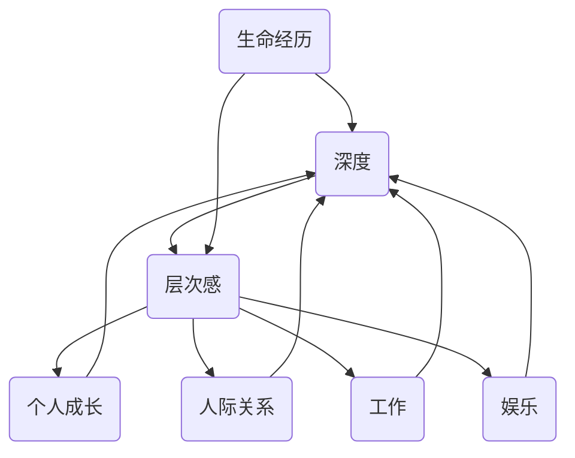

                 


### 文章标题

《增加生命经历的深度：丰富人生的层次感》

### 关键词

生命经历、深度、层次感、个人成长、关系、工作、娱乐、实践指南

### 摘要

本文旨在探讨如何增加生命经历的深度，从而丰富人生的层次感。通过分析生命经历、深度和层次感这三个核心概念，并运用逻辑清晰、结构紧凑的论述方式，本文将详细阐述在个人成长、人际关系、工作与生活等多个方面增加生命深度的方法。同时，通过案例研究和实践指南，本文将为读者提供具体的操作策略，帮助读者在日常生活中实践这些理念，实现人生层次的全面提升。

## 第1章 引言

### 1.1 书籍目的

本文书籍旨在引导读者深入了解生命经历、深度和层次感这三个核心概念，并通过系统性的分析和实践指南，帮助读者在实践中增加生命经历的深度，从而丰富人生的层次感。在现代社会中，人们面临着越来越多的压力和挑战，对生活的追求不再仅仅局限于物质层面的满足，而更加注重精神层面的成长和满足。本文书籍希望通过阐述生命经历、深度和层次感的重要性，为读者提供一种全新的生活观念和行动指南，帮助读者在忙碌的生活中找到平衡点，提升生活质量。

### 1.2 生命经历与深度

生命经历是指个体在生命过程中所经历的各种事件和体验，包括个人的成长经历、学习经历、工作经历、人际关系经历等。生命经历的深度则体现在个体对这些经历的理解、感受和反思的深度。深度不仅关乎个体的知识积累，更关乎个体的情感体验和心灵成长。一个丰富、深刻的生命经历可以帮助个体更好地理解世界，提升自我认知，增强情感智力，从而在人生的各个方面实现更高的层次感。

### 1.3 层次感的概念

层次感是指人生在各个方面所达到的不同层次，包括个人成长、人际关系、工作、娱乐等多个方面。层次感不仅关乎个体的成就和荣誉，更关乎个体的内心体验和生命质量。一个具有丰富层次感的人生，能够在物质和精神两个层面实现平衡，使个体在追求成就的同时，也获得内心的满足和幸福感。层次感是一种内在的体验，它体现在个体的自我认知、情感表达和人际交往中。

### 1.4 阅读指南

本文书籍将分为多个章节，从不同的角度探讨如何增加生命经历的深度，丰富人生的层次感。每个章节都将包括核心概念的介绍、具体方法的讲解、案例研究以及实践指南。为了更好地理解和应用这些理念，读者可以按照以下步骤进行阅读：

1. 首先了解生命经历、深度和层次感这三个核心概念的定义和关系。
2. 通过阅读每个章节，了解在个人成长、人际关系、工作与生活等方面如何增加生命经历的深度。
3. 结合案例研究和实践指南，将理论应用到实际生活中。
4. 定期回顾和反思自己的成长过程，不断调整和优化自己的生活方式。

通过以上步骤，读者可以逐步提升自己的生命经历深度，丰富人生的层次感，实现更高质量的人生体验。

## 第2章 核心概念介绍

### 2.1 生命经历

生命经历是指个体在生命过程中所经历的各种事件和体验，包括个人的成长经历、学习经历、工作经历、人际关系经历等。每一个生命经历都如同生命中的一块拼图，将个体的生命历程串联起来，形成一个完整的生命轨迹。这些经历不仅塑造了个体的人格特质，还影响着个体的思维方式、情感体验和行为模式。

生命经历的构成可以归纳为以下几个方面：

1. **成长经历**：包括童年时期的生活环境、家庭背景、教育经历等。这些经历对个体的性格、价值观和人生观产生了深远的影响。

2. **学习经历**：包括在学校接受的教育、在工作中的学习经历、通过阅读和自学获取的知识等。学习经历不仅提升了个体的知识水平，还培养了个体的问题解决能力和创新思维。

3. **工作经历**：包括个体的职业生涯、工作中的挑战和成就、工作环境等。工作经历不仅为个体提供了经济支持，还锻炼了个体的人际交往能力和团队合作能力。

4. **人际关系经历**：包括与家人、朋友、同事等的人际交往过程。人际关系经历对个体的情感体验和社会支持系统产生了重要影响。

### 2.2 深度

深度是衡量个体对某一领域或经历的理解和掌握程度的指标。在生命经历中，深度体现为个体对生活经历的深入理解和深刻反思。深度不仅关乎个体的知识积累，更关乎个体的情感体验和心灵成长。一个丰富、深刻的生命经历可以帮助个体更好地理解世界，提升自我认知，增强情感智力。

深度的层次可以分为以下几个级别：

1. **表面层次**：个体对生命经历的初步了解和表面理解，如对事件的记忆和表面看法。

2. **浅层层次**：个体对生命经历的理解进一步加深，开始关注事件背后的原因和影响，如对事件的分析和反思。

3. **中层层次**：个体对生命经历的理解更加深入，能够从多个角度和维度进行综合分析，如对事件的全面理解和深度剖析。

4. **深层层次**：个体对生命经历的理解达到最高层次，能够从哲学、心理学、社会学等多个角度进行反思和领悟，如对事件的深刻洞察和哲学思考。

### 2.3 层次感

层次感是指人生在各个方面所达到的不同层次，包括个人成长、人际关系、工作、娱乐等多个方面。层次感不仅关乎个体的成就和荣誉，更关乎个体的内心体验和生命质量。一个具有丰富层次感的人生，能够在物质和精神两个层面实现平衡，使个体在追求成就的同时，也获得内心的满足和幸福感。

层次感的构成可以从以下几个方面进行理解：

1. **个人成长层次**：包括知识水平、技能掌握、情感智力、道德观念等方面的提升。

2. **人际关系层次**：包括与家人、朋友、同事等的人际关系质量，如亲密程度、信任程度等。

3. **工作层次**：包括职业发展、工作成就、工作满意度等方面的提升。

4. **娱乐层次**：包括娱乐活动的参与度、体验感、文化内涵等方面的提升。

通过以上对生命经历、深度和层次感的介绍，我们可以看到这三个概念之间的紧密联系。生命经历为深度提供了基础，深度又为层次感提供了内涵，而层次感则是对生命经历和深度的综合体现。理解这三个概念及其关系，有助于我们更好地认识和提升自己的人生质量。

### 2.4 核心概念之间的关系

为了更好地理解生命经历、深度和层次感这三个核心概念之间的关系，我们可以使用Mermaid流程图进行详细展示。



在这个流程图中，我们可以看到：

1. **生命经历**是深度和层次感的基础。个体的生命经历越丰富，对生活的理解和反思就越深刻。
2. **深度**是连接生命经历和层次感的桥梁。个体对生命经历的深入理解和深刻反思，构成了深度，进而提升层次感。
3. **层次感**是对生命经历和深度的综合体现。层次感涵盖了个人成长、人际关系、工作、娱乐等多个方面，是人生质量的直观表现。

通过这个流程图，我们可以更清晰地理解这三个概念之间的内在联系，有助于我们在实践中更好地把握和提升自己的人生层次。

### 2.5 深度与生命经历的关系

深度与生命经历之间的关系可以类比为代码的执行过程。在编程中，代码的执行深度决定了程序的运行效率和输出结果。同样，在生命经历中，个体的深度理解决定了其对生活的掌握程度和人生质量的提升。

#### 深度理解的层次

1. **表面层次**：类似于编程中的基础操作，如变量赋值、循环和条件判断。在这个层次，个体对生活事件有初步的认识和反应。
2. **浅层层次**：类似于编程中的复杂逻辑和算法，个体开始分析事件背后的原因和影响，如因果关系和决策逻辑。
3. **中层层次**：类似于编程中的模块化和系统设计，个体能够从多个角度和维度对生活事件进行综合分析和理解，如心理、社会、哲学等多个层面。
4. **深层层次**：类似于编程中的高级抽象和优化，个体能够从哲学、心理学、社会学等多个角度对生活进行深刻洞察和反思，形成自己的独特见解。

#### 生命经历的代码执行

1. **初始化**：个体的出生和成长过程，类似于编程中的变量初始化。
2. **执行**：个体在成长过程中所经历的各个事件，类似于编程中的代码执行过程。
3. **反馈**：个体对生活事件的反应和反思，类似于编程中的输入和输出。
4. **优化**：个体在反思过程中，通过学习和实践，不断提升自己的理解深度，类似于编程中的代码优化。

#### 深度提升的策略

1. **持续学习**：通过不断学习和阅读，扩大知识面，提升对生活的理解深度。
2. **反思与总结**：定期对自己的生活经历进行反思和总结，发现问题的根本原因，提升深度理解。
3. **实践与应用**：将理论应用到实际生活中，通过实践检验和优化自己的理解深度。
4. **交流与分享**：与他人交流和分享自己的见解和经验，通过互动提升自己的思考深度。

通过以上策略，个体可以不断提升自己的生命经历深度，从而丰富人生的层次感，实现更高质量的人生体验。

### 2.6 深度与层次感的关系

深度与层次感的关系可以类比为计算机程序中的算法优化和性能提升。在编程中，算法的优化能够显著提高程序的运行效率和处理能力；同样，在人生中，深度的提升能够显著增强层次感，使个体在各个方面实现更高的生命质量。

#### 深度提升对层次感的影响

1. **个人成长**：深度的提升使个体在知识和技能方面达到更高层次，从而促进个人成长。
2. **人际关系**：深度的提升使个体在情感表达和人际交往中更加得心应手，增强人际关系质量。
3. **工作效能**：深度的提升使个体在工作中的分析和解决问题能力更强，提高工作效能和满意度。
4. **娱乐体验**：深度的提升使个体在娱乐活动中更加投入和享受，提升娱乐体验的质量。

#### 深度提升的策略

1. **持续学习**：通过不断学习和探索新领域，扩展知识面，提升理解深度。
2. **反思与总结**：定期反思和总结自己的经验和教训，深入挖掘问题的本质，提升深度理解。
3. **实践与应用**：将理论应用到实际生活中，通过实践检验和优化自己的理解深度。
4. **跨学科学习**：结合不同学科的知识，进行跨领域的思考，提升思维的深度和广度。

通过以上策略，个体可以不断提升自己的深度，从而丰富人生的层次感，实现全面的人生提升。

### 2.7 层次感与生命质量的关系

层次感与生命质量的关系可以类比为生态系统中的生物多样性和生态系统稳定性的关系。在生态系统中，生物多样性越丰富，生态系统的稳定性越高，生命质量也越高；同样，在人生中，层次感越丰富，生命质量也越高。

#### 层次感对生命质量的影响

1. **心理层面**：丰富的层次感使个体在面对生活中的挑战和困难时更加从容和自信，提升心理素质。
2. **社会层面**：丰富的层次感使个体在社会交往中更加得体和融洽，增强社会支持系统。
3. **职业层面**：丰富的层次感使个体在职业生涯中能够不断突破自我，实现职业发展和成就感。
4. **生活层面**：丰富的层次感使个体在日常生活中能够享受各种丰富多彩的经历和体验，提升生活品质。

#### 增强层次感的策略

1. **多元体验**：通过参与各种不同的活动和经历，丰富自己的层次感。
2. **持续学习**：通过不断学习和探索新领域，提升自己的知识层次和认知水平。
3. **反思与总结**：定期反思和总结自己的经历和体会，深入挖掘层次感的内涵。
4. **情感管理**：学会有效管理自己的情绪和情感，提升情感智力，增强层次感。

通过以上策略，个体可以不断丰富自己的层次感，从而提升生命质量，实现更美好的人生。

### 2.8 深度与层次感的区别与联系

深度与层次感虽然密切相关，但它们在内涵和外延上存在一定的区别。

**区别：**

1. **内涵**：深度更多地关注个体对某一领域或经历的深入理解和深刻反思，侧重于个人的认知和心理层面；层次感则更广泛地涵盖个体在生活各个方面的不同层次，包括个人成长、人际关系、工作、娱乐等多个维度。
2. **外延**：深度主要体现为个体对生活的理解和掌握程度，是层次感的基础和支撑；层次感则是深度在各个方面的具体体现，是深度的外在表现。

**联系：**

1. **相互依存**：深度是层次感的基石，没有深度就无法实现层次感的提升；层次感是深度的外在表现，没有层次感，深度也就失去了具体的意义。
2. **相互促进**：深度的提升能够丰富层次感，使个体在各个方面的表现更加出色；层次感的丰富又能促进深度的提升，使个体更加全面地理解和体验生活。

通过理解深度与层次感的区别与联系，个体可以更加系统地提升自己的生命质量，实现人生层次的全面提升。

### 2.9 总结

本章对生命经历、深度和层次感这三个核心概念进行了详细介绍，并分析了它们之间的内在联系。通过理解这些概念，我们认识到丰富的生命经历是提升深度的基石，而深度又为层次感的丰富提供了基础。通过本章的介绍，读者应该对这三个概念有了更加清晰的认识，为后续章节的学习和应用奠定了基础。

## 第3章 增加生命深度的个人成长

### 3.1 自我认知

自我认知是指个体对自己性格、能力、价值观等方面的了解和认识。自我认知的深度直接影响个体对生活的理解和应对方式。为了提升自我认知，个体可以从以下几个方面进行实践：

#### 自我认知的技巧

1. **反思与总结**：定期对自己的行为和经历进行反思和总结，了解自己在不同情境下的表现和反应，从而更好地认识自己。
2. **倾听内心声音**：通过冥想、瑜伽等静心活动，倾听内心的声音，深入探索自己的内心世界。
3. **求助于他人**：通过与他人交流、请教和反馈，了解自己在外界眼中的形象和表现，从而全面认识自己。

#### 自我认知的实践案例

1. **日记法**：通过写日记，记录自己的所思所感，不仅可以加深对生活的理解，还可以培养自我反思的能力。
2. **导师制度**：寻找一位经验丰富的导师，通过定期交流和指导，了解自己在职业和生活方面的优劣势，提升自我认知。
3. **心理测试**：通过参加各种心理测试，如MBTI、DISC等，了解自己的性格特点和优势，从而更好地规划自己的人生。

### 3.2 学会感恩

感恩是一种美好的情感，能够提升个体的幸福感和满足感。学会感恩不仅能够增强人际关系，还能够丰富生命经历，提升生命的深度。以下是学会感恩的具体方法：

#### 感恩的重要性

1. **提升幸福感**：感恩能够让我们更加珍惜现有的生活和人际关系，从而提升幸福感。
2. **增强人际关系**：感恩能够增强个体的人际关系，使彼此之间的关系更加融洽和紧密。
3. **促进个人成长**：感恩能够让我们更加关注他人的需求和感受，从而在相互关系中实现个人成长。

#### 感恩的实践方法

1. **保持正念**：在日常生活中，时刻保持对美好事物的关注和感恩之心，如家人、朋友的帮助、工作中的成就等。
2. **写感恩日记**：每天花几分钟时间写下自己感恩的事情，可以是小事，也可以是大事，这有助于培养感恩的习惯。
3. **表达感激**：及时向帮助过自己的人表达感激之情，可以是一句简单的“谢谢”，也可以是一封感谢信，让他人感受到自己的真诚和关爱。

### 3.3 增强情感智力

情感智力是指个体识别、理解和管理自己情绪的能力，以及识别、理解和影响他人情绪的能力。增强情感智力不仅能够提升个体的心理健康，还能够丰富生命经历，提升生命的深度。

#### 情感智力的构成

1. **自我情绪管理**：包括识别自己的情绪、理解情绪的原因、有效地表达情绪等。
2. **人际关系管理**：包括理解他人的情绪、有效地沟通、建立积极的人际关系等。
3. **自我认知**：包括了解自己的性格、价值观和目标等。

#### 情感智力的提升策略

1. **情绪记录**：通过日记或应用程序记录自己的情绪变化，了解情绪的规律和原因。
2. **冥想与放松**：通过冥想、瑜伽等放松技巧，减轻压力，提升情绪管理能力。
3. **积极沟通**：通过积极倾听、表达和理解他人的情绪，提升人际关系管理能力。
4. **情感教育**：通过阅读相关书籍、参加培训课程等方式，学习情感智力的知识和技巧。

通过以上策略，个体可以逐步增强自己的情感智力，从而提升生命经历的深度，丰富人生的层次感。

### 3.4 实践案例与反思

在本章中，我们通过自我认知、感恩和情感智力三个方面，详细介绍了如何增加生命深度。以下是几个实践案例和反思，供读者参考：

#### 案例一：自我认知的实践

张三是一名程序员，他在工作中经常感到焦虑和压力。通过写日记和定期反思，他开始意识到自己的焦虑来源于对未知的恐惧和对失败的担忧。在导师的指导下，他学会了如何识别自己的情绪，并采取积极的方法应对。经过一段时间的实践，他逐渐学会了自我认知，焦虑感也得到了明显缓解。

#### 案例二：感恩的实践

李四是一名销售人员，他经常感到孤独和压力。通过写感恩日记，他开始关注自己生活中的美好事物，如家人、朋友的支持和同事的协助。他发现，每次写下感恩的事情，自己的心情都会变得轻松和愉快。经过一段时间的实践，他的幸福感明显提升，人际关系也得到了改善。

#### 案例三：情感智力的实践

王五是一名心理咨询师，她在工作中需要处理复杂的情绪问题。通过情绪记录和冥想，她学会了更好地管理自己的情绪，并有效地与客户沟通。她还参加了情感智力培训课程，学习了更多的人际关系管理技巧。经过一段时间的实践，她的咨询效果得到了显著提升，客户满意度也大幅增加。

#### 反思

通过以上案例，我们可以看到，自我认知、感恩和情感智力是增加生命深度的重要途径。这些实践不仅帮助个体更好地认识自己，还提升了个体在人际关系中的处理能力，从而丰富了个体的生命经历。读者可以根据自己的实际情况，选择合适的方法进行实践，并定期进行反思，以不断提升自己的生命深度。

### 3.5 增加生命深度的总结与展望

通过本章的探讨，我们了解到自我认知、感恩和情感智力是增加生命深度的重要途径。自我认知使我们更好地认识自己，感恩让我们更加珍惜生活中的美好，情感智力则提升了我们的人际关系处理能力。这些方面不仅丰富了我们的生命经历，还提升了我们的人生层次感。

在未来的生活中，我们可以继续探索其他增加生命深度的方法，如学习新技能、参与社会公益活动、培养兴趣爱好等。通过不断实践和反思，我们可以在个人成长的道路上不断前行，丰富自己的人生经历，提升生命的深度。

让我们携手共进，不断探索和追求，让生命经历更加丰富，层次感更加深厚。

## 第4章 关系中的深度

### 4.1 爱与陪伴

爱是人类最基本的情感之一，它不仅是生命中的动力源泉，也是关系深度的关键。陪伴则是爱的具体表现，是建立深厚关系的重要基础。在人际关系中，爱和陪伴的深度决定了关系的质量。

#### 爱的定义与特质

爱是一种无私的情感，它包含了对他人无私的关怀、理解和接纳。爱不仅仅是一种情感，更是一种行动。以下是爱的几个特质：

1. **无私性**：爱是无条件的，不求回报，愿意为对方付出时间和精力。
2. **包容性**：爱能够接纳对方的不足和缺点，理解对方的情感和行为。
3. **持久性**：爱是持久的，能够经受住时间的考验，即使在困难时期也不会减弱。

#### 陪伴的力量

陪伴不仅是一种情感支持，更是一种行动支持。它体现在日常生活中的点滴细节，如一起共进晚餐、一起散步、一起看电影等。陪伴的力量在于：

1. **情感支持**：在对方需要时，陪伴能够提供情感上的慰藉，减轻孤独感和焦虑。
2. **行动支持**：在对方需要帮助时，陪伴能够提供实际的帮助，增强信任和依赖。
3. **共同成长**：通过陪伴，双方可以共同经历生活的起起落落，一起成长和进步。

#### 爱与陪伴在关系中的体现

1. **亲密关系**：在家庭关系中，爱和陪伴是维系夫妻关系的重要基础。通过相互的关怀和支持，夫妻之间的感情得以加深。
2. **友情**：在朋友关系中，爱和陪伴能够增强彼此的信任和理解，使友情更加深厚。
3. **合作关系**：在工作关系中，爱和陪伴能够促进团队合作，增强团队凝聚力。

### 4.2 有效沟通

有效沟通是建立深厚关系的关键。它不仅关乎信息的传递，更关乎情感的理解和接纳。以下是有效沟通的几个要点：

#### 沟通的障碍

1. **语言障碍**：不同的人有不同的语言表达习惯和理解方式，容易造成误解。
2. **文化差异**：不同的文化背景可能导致对同一信息的理解产生偏差。
3. **情绪因素**：情绪波动容易导致沟通的障碍，如愤怒、沮丧等负面情绪会干扰正常的沟通。

#### 提高沟通技巧的方法

1. **倾听**：倾听是有效沟通的基础，通过倾听对方的话语和情感，能够更好地理解对方的需求和感受。
2. **表达**：清晰、准确地表达自己的想法和感受，避免模糊和含糊的表述，减少误解。
3. **同理心**：设身处地为对方考虑，理解对方的立场和感受，增强沟通的互动性和效果。
4. **情绪管理**：在沟通中保持冷静，控制情绪，避免情绪波动对沟通产生负面影响。

### 4.3 建立深层次的关系

深层次的关系不仅仅是表面上的互动和交往，更是在情感和思想上达到的深入理解和共鸣。以下是建立深层次关系的几个策略：

#### 深层次关系的特征

1. **信任**：深层次的关系建立在信任的基础上，双方能够真诚地信任对方，分享内心的想法和感受。
2. **共鸣**：深层次的关系能够在思想和情感上产生共鸣，双方能够在重要的议题上形成共识。
3. **成长**：深层次的关系能够促进双方的成长，相互激励，共同进步。

#### 如何建立深层次的关系

1. **深度交流**：通过深入的交流和分享，了解对方的内心世界，建立共同的理解和认知。
2. **共同经历**：通过共同的经历和体验，增强情感的联系和依赖，使关系更加稳固。
3. **相互支持**：在对方需要时，提供支持和帮助，增强彼此的信任和依赖。
4. **尊重差异**：尊重对方的不同观点和价值观，通过对话和协商解决问题，建立和谐的互动模式。

通过爱与陪伴、有效沟通和建立深层次关系，我们可以在人际关系中增加生命的深度，提升层次感，实现更加丰富和有意义的人生。

### 4.4 实践案例与反思

在本章中，我们探讨了如何在人际关系中通过爱与陪伴、有效沟通和建立深层次关系来增加生命的深度。以下是一些具体的实践案例和反思，供读者参考：

#### 案例一：家庭关系的深度建设

李先生和李太太是一对结婚多年的夫妻。他们发现，随着生活的繁忙和孩子的长大，他们之间的沟通变得越来越表面化。为了改善这种情况，他们决定每天晚上抽出时间进行深度交流，分享彼此的喜怒哀乐。通过这种方式，他们重新建立了亲密的关系，感情变得更加深厚。

#### 案例二：朋友关系的深度建设

王小姐和陈小姐是多年的好友，她们在生活和工作中都互相支持。有一天，王小姐得知陈小姐面临职业发展的瓶颈，她主动提出帮助陈小姐，并邀请她一起参加职业培训课程。通过共同学习和成长，她们的友谊变得更加坚固，关系也更加深入。

#### 案例三：工作关系的深度建设

张经理和团队中的成员之间存在着一定的沟通障碍。为了提升团队凝聚力，张经理决定每周进行一次团队建设活动，如团队合作游戏、分享会议等。通过这些活动，团队成员之间的关系得到了改善，工作氛围变得更加和谐，工作效率也得到了提升。

#### 反思

通过以上案例，我们可以看到，在人际关系中，增加生命的深度不仅仅是通过语言上的交流，更需要在行动上给予支持和陪伴。通过深度交流、共同经历和相互支持，我们可以在不同类型的人际关系中建立深层次的关系，从而提升人生的层次感。

读者可以根据自己的实际情况，选择合适的策略进行实践，并定期进行反思，以在人际关系中增加生命的深度，丰富自己的人生经历。

### 4.5 增加生命深度的总结与展望

通过本章的探讨，我们了解到在人际关系中增加生命的深度是通过爱与陪伴、有效沟通和建立深层次关系来实现的。爱与陪伴让我们在情感上得到支持和理解，有效沟通提升了我们的人际交往能力，而深层次的关系则使我们在思想上达到共鸣和成长。这些方法不仅丰富了我们的生命经历，还提升了我们的人生层次感。

在未来的生活中，我们可以继续探索和实践其他增加生命深度的方法，如参与公益活动、培养共同兴趣等。通过不断的学习和反思，我们可以在人际关系中不断前行，丰富自己的人生经历，提升生命的深度。

让我们携手共进，不断探索和追求，让生命经历更加丰富，层次感更加深厚。

## 第5章 工作与深度的平衡

### 5.1 工作的意义

工作不仅是我们的生计来源，更是实现个人价值和自我成长的重要途径。工作对生命的意义可以从以下几个方面进行理解：

1. **经济支持**：工作是获取经济收入的主要途径，为我们提供生活的基本保障。
2. **自我实现**：通过工作，我们可以实现自己的职业理想和目标，提升自我价值和成就感。
3. **社会贡献**：工作使我们的才能和能力得到发挥，为社会做出贡献，从而实现人生的价值。
4. **个人成长**：工作是一个不断学习和成长的过程，通过工作中的挑战和解决，我们的能力得到提升，思维方式得到拓展。

#### 如何找到工作的意义

1. **明确目标**：确定自己的职业目标，找到与自己兴趣和价值观相符的工作方向。
2. **持续学习**：不断提升自己的知识和技能，使自己在工作中能够不断进步和成长。
3. **反思与调整**：定期反思自己的工作，了解自己的优点和不足，及时调整工作策略和方向。
4. **与同事互动**：与同事建立良好的关系，从他们身上学习和借鉴经验，共同实现工作目标。

### 5.2 管理时间

时间管理是提高工作效率和生活质量的重要手段。有效的管理时间可以帮助我们更好地平衡工作和生活，提升整体幸福感。

#### 时间的价值

1. **资源有限**：时间是有限的资源，有效利用时间意味着更高的生产效率和更丰富的生活体验。
2. **机会成本**：浪费时间意味着失去了利用这段时间进行其他更有价值活动的机会。
3. **生活质量**：合理利用时间可以提高生活质量，使我们在工作和生活中更加从容和满足。

#### 管理时间的方法

1. **任务分解**：将大任务分解为小任务，逐一完成，避免任务堆积和拖延。
2. **优先级排序**：根据任务的重要性和紧急性，确定优先级，优先处理重要且紧急的任务。
3. **时间块管理**：将时间分为不同的时间块，分配给不同的任务，避免多任务处理带来的效率低下。
4. **避免干扰**：在工作时避免无关的干扰，如关闭不必要的社交媒体通知，保持专注。

### 5.3 工作与生活的平衡

工作与生活的平衡是现代生活中一个重要的话题。不协调的工作与生活关系容易导致身心疲惫，影响健康和生活质量。

#### 平衡的重要性

1. **身心健康**：合理的工作与生活平衡有助于保持身心健康，降低压力和焦虑。
2. **生活质量**：平衡的工作与生活关系可以提高生活质量，使我们在工作中保持高效，在生活
## 第6章 丰富人生层次的娱乐与休闲

### 6.1 娱乐的意义

娱乐在人生中扮演着不可或缺的角色。它不仅能够缓解压力，提高生活质量，还能促进身心健康，丰富我们的精神世界。以下是娱乐在人生中的几个重要意义：

#### 娱乐的作用

1. **缓解压力**：工作、学习和生活中的压力往往会导致身心疲惫，适当的娱乐活动能够帮助人们放松身心，缓解压力。
2. **提高生活质量**：娱乐活动可以让人们在忙碌的生活中找到乐趣，提高生活的满意度。
3. **促进身心健康**：适当的娱乐活动，如运动、音乐、艺术等，能够促进身体健康，提高心理健康水平。
4. **丰富精神世界**：娱乐活动不仅能够满足人们的基本需求，还能提升我们的审美能力和文化素养，丰富我们的精神世界。

#### 娱乐的方式与选择

1. **体育活动**：如跑步、游泳、篮球、瑜伽等，这些活动不仅能够锻炼身体，还能培养团队合作精神和竞争意识。
2. **艺术欣赏**：如观看电影、听音乐、欣赏戏剧和绘画等，这些活动能够提升我们的审美能力，丰富我们的精神生活。
3. **社交活动**：如聚会、旅行、参加社团活动等，这些活动能够增强人际关系，提高社交能力。
4. **自我提升**：如阅读、学习新技能、参加培训课程等，这些活动能够提升我们的知识水平和技能。

### 6.2 休闲活动

休闲活动是人们在空闲时间里进行的一种放松和享受的活动，对于提升生活质量和身心健康具有重要意义。以下是几种常见的休闲活动及其对人生层次的影响：

#### 休闲活动的意义

1. **心理健康**：休闲活动能够帮助人们缓解压力，减少焦虑和抑郁情绪，提升心理健康水平。
2. **身体健康**：休闲活动，如运动、户外活动等，能够促进身体健康，增强体质。
3. **社交技能**：休闲活动，如聚会、旅行等，能够增强人际关系，提升社交技能。
4. **个人成长**：休闲活动，如学习新技能、阅读等，能够促进个人成长，提升自我价值。

#### 常见的休闲活动

1. **户外运动**：如徒步、骑行、登山等，这些活动不仅能够锻炼身体，还能亲近自然，提升心情。
2. **阅读**：阅读是一种重要的休闲活动，通过阅读书籍、报纸、杂志等，可以丰富知识，提升思维能力和文化素养。
3. **艺术创作**：如绘画、音乐、摄影等，这些活动能够激发创造力，提升审美能力。
4. **旅行**：旅行是一种了解世界、拓宽视野的方式，通过旅行可以体验不同的文化，增长见识。

### 6.3 艺术与人生

艺术是人类智慧的结晶，它不仅能够带给我们美的享受，还能深刻影响我们的心灵和人生观。以下是艺术在人生中的几个方面：

#### 艺术的价值

1. **审美体验**：艺术作品能够给我们带来美的享受，提升我们的审美体验。
2. **情感表达**：艺术作品能够表达艺术家内心的情感和思想，帮助我们理解和感受情感。
3. **自我反思**：艺术作品能够激发我们的思考，促使我们进行自我反思，提升我们的自我认知。
4. **文化传承**：艺术作品是文化的重要组成部分，它们能够传承和发扬我们的文化传统。

#### 如何欣赏艺术

1. **多角度理解**：欣赏艺术作品时，要从不同的角度进行理解，如历史背景、文化内涵、艺术家意图等。
2. **持续学习**：通过学习和了解艺术知识，提升自己的艺术鉴赏能力。
3. **实践体验**：亲自动手参与艺术创作，如绘画、音乐等，提升对艺术的感知和理解。
4. **交流分享**：与他人交流对艺术作品的看法和感受，通过互动提升自己的艺术修养。

通过娱乐、休闲活动和艺术欣赏，我们不仅能够丰富自己的生命经历，还能提升生命的层次感，实现更高质量的人生体验。让我们在忙碌的生活中，找到适合自己的娱乐和休闲方式，让艺术成为我们人生中的一部分，共同享受美好的人生。

### 6.4 实践案例与反思

在本章中，我们探讨了如何通过娱乐、休闲活动和艺术欣赏来丰富人生层次。以下是一些具体的实践案例和反思，供读者参考：

#### 案例一：通过户外运动提升身心健康

李先生是一名职场人士，他发现自己的身体状况逐渐下滑，于是决定通过户外运动来改善。他每周固定参加一次徒步活动，并逐渐增加运动强度。经过一段时间的实践，他的身体状况得到了明显改善，同时在工作中的精神状态也变得更加饱满。

#### 案例二：通过阅读提升自我成长

张女士是一名家庭主妇，她发现自己每天的生活过于单调，于是开始阅读各类书籍，包括心理学、历史和文学等。通过阅读，她不仅拓宽了知识面，还提升了自我认知和思考能力，家庭生活也因此变得更加丰富和有意义。

#### 案例三：通过艺术创作提升情感体验

王小姐是一名设计师，她经常感到工作压力很大，于是开始尝试绘画。她发现，绘画不仅能够帮助她释放压力，还能激发她的创造力。通过艺术创作，她的情感体验得到了丰富，同时在工作中的设计灵感也变得更加丰富。

#### 反思

通过以上案例，我们可以看到，娱乐、休闲活动和艺术欣赏在提升生活质量和丰富生命经历方面具有重要作用。读者可以根据自己的兴趣和实际情况，选择合适的活动进行实践，并定期进行反思，以不断提升自己的生命层次。

### 6.5 增加生命深度的总结与展望

通过本章的探讨，我们了解到娱乐、休闲活动和艺术欣赏在丰富生命经历和提升生命层次方面具有重要意义。这些活动不仅能够缓解压力，提高生活质量，还能促进身心健康，丰富我们的精神世界。通过实践这些活动，我们可以在忙碌的生活中找到乐趣，提升自我价值，实现更高质量的人生体验。

在未来的生活中，我们可以继续探索和尝试各种娱乐和休闲活动，不断丰富自己的生命经历，提升生命的深度。让我们在追求事业成功的同时，也注重精神生活的丰富，实现全面的人生提升。

## 第7章 案例研究

### 7.1 案例一：如何在职场中增加深度

#### 7.1.1 案例背景

张明是一名互联网公司的项目经理，他在工作中总是感到缺乏深度，无法有效地解决问题。他意识到，要想提升自己在职场中的表现，必须增加生命的深度。于是，他开始探索如何在职场中增加深度。

#### 7.1.2 案例分析

1. **自我认知**：张明首先通过写日记和反思，深入了解自己的兴趣、优点和不足。他发现自己对技术细节和项目管理流程有浓厚的兴趣，但在人际沟通和团队协作方面还有待提升。

2. **持续学习**：张明利用业余时间参加技术培训和研讨会，学习最新的技术趋势和管理方法。他还通过在线课程和书籍，不断提升自己的知识水平和技能。

3. **深度工作**：张明在工作中实行“深度工作”策略，即在特定的时间段内集中精力处理重要任务，避免分散注意力的干扰。通过这种方法，他显著提升了工作效率和质量。

4. **反思与总结**：张明定期对自己的工作进行反思和总结，分析成功和失败的原因，不断优化自己的工作方法。

#### 7.1.3 案例启示

张明的实践表明，在职场中增加生命深度需要以下几个方面的努力：

1. **自我认知**：了解自己的兴趣和优势，明确职业发展方向。
2. **持续学习**：不断提升知识和技能，保持竞争优势。
3. **深度工作**：通过集中精力处理重要任务，提升工作效率。
4. **反思与总结**：定期反思和总结，优化工作方法。

### 7.2 案例二：如何在人际关系中建立层次感

#### 7.2.1 案例背景

李娜是一名人力资源经理，她在工作中与人交往较多，但感到自己的关系处理不够深入，缺乏层次感。为了改善这种情况，她开始探索如何在人际关系中建立层次感。

#### 7.2.2 案例分析

1. **有效沟通**：李娜通过学习沟通技巧，如倾听、表达和同理心，提高了自己的沟通能力。她学会了如何在不同情境下有效地与他人沟通，建立良好的关系。

2. **情感智力**：李娜通过参加情感智力培训，学会了识别和管理自己和他人的情绪。她能够更好地理解他人的需求和感受，从而在人际交往中更加得体和融洽。

3. **共同经历**：李娜与同事一起参加各种活动和培训，共同面对挑战和解决问题。通过这些共同经历，他们的关系得到了加深和稳固。

4. **反思与总结**：李娜定期对自己的人际交往进行反思和总结，分析成功的经验和失败的教训，不断优化自己的交往方式。

#### 7.2.3 案例启示

李娜的实践为在人际关系中建立层次感提供了以下启示：

1. **有效沟通**：提高沟通能力，建立良好的人际关系。
2. **情感智力**：学会识别和管理情绪，提升人际关系质量。
3. **共同经历**：通过共同经历和挑战，加深彼此的关系。
4. **反思与总结**：定期反思和总结，优化交往方式。

通过这两个案例，我们可以看到，在职场和人际关系中增加生命的深度和建立层次感需要自我认知、持续学习、深度工作和有效沟通等多方面的努力。这些案例为我们提供了具体的实践路径，有助于我们在日常生活中不断提升自己的生命层次。

## 第8章 实践指南

### 8.1 基于自我的实践建议

为了在个人层面增加生命的深度，我们可以从以下几个方面进行实践：

1. **自我认知**：通过写日记、反思和自我探索，了解自己的兴趣、价值观和人生目标。可以使用工具如心理测试（如MBTI、DISC）来辅助自我认知。
   
   ```mermaid
   graph TD
       A(写日记) --> B(心理测试)
       A --> C(自我反思)
       B --> D(人生目标设定)
       C --> D
   ```

2. **持续学习**：定期阅读书籍、参加线上课程和研讨会，提升自己的知识和技能。可以使用时间管理工具如番茄钟（Pomodoro Technique）来确保学习时间的有效利用。

   ```mermaid
   graph TD
       A(定期阅读) --> B(线上课程)
       A --> C(研讨会参与)
       B --> D(时间管理工具)
   ```

3. **深度工作**：设置特定的时间段进行专注工作，减少干扰，提升工作效率。可以使用应用程序如Forest或Focus@Will来帮助集中注意力。

   ```mermaid
   graph TD
       A(专注工作) --> B(减少干扰)
       A --> C(提升效率)
   ```

4. **情感管理**：通过冥想、瑜伽和正念练习来管理自己的情绪，提升情感智力。可以使用应用程序如Headspace或Calm进行日常冥想练习。

   ```mermaid
   graph TD
       A(冥想) --> B(瑜伽)
       A --> C(正念练习)
   ```

### 8.2 基于关系的实践建议

在人际关系中建立深层次的关系，可以参考以下实践建议：

1. **有效沟通**：通过倾听、表达和同理心，提升沟通技巧。定期进行沟通练习，如角色扮演或模拟对话，以增强沟通能力。

   ```mermaid
   graph TD
       A(倾听) --> B(表达)
       A --> C(同理心)
       B --> D(沟通练习)
   ```

2. **情感智力**：通过识别和管理自己和他人的情绪，提升情感智力。可以参加情感智力培训课程，或通过阅读相关书籍进行自我提升。

   ```mermaid
   graph TD
       A(情绪识别) --> B(情绪管理)
       A --> C(情感智力培训)
   ```

3. **共同经历**：通过共同的活动和挑战，加深彼此的关系。可以组织或参与各种团队建设活动，如团队拓展训练或集体旅行。

   ```mermaid
   graph TD
       A(共同活动) --> B(团队建设活动)
       A --> C(集体旅行)
   ```

4. **反思与反馈**：定期与朋友或家人进行反思和反馈，了解自己在人际关系中的表现，不断优化交往方式。

   ```mermaid
   graph TD
       A(反思) --> B(反馈)
       A --> C(优化交往方式)
   ```

### 8.3 基于工作与生活的实践建议

在工作与生活之间找到平衡，可以采取以下实践策略：

1. **时间管理**：通过设定优先级、使用时间管理工具和保持专注，提高工作效率。可以使用GTD（Getting Things Done）方法来整理工作和生活事项。

   ```mermaid
   graph TD
       A(设定优先级) --> B(使用时间管理工具)
       A --> C(保持专注)
       B --> D(GTD方法)
   ```

2. **工作与生活的分离**：在下班后，尽量将工作与生活分离，避免工作压力对家庭和个人生活的侵入。可以使用应用程序如Focus@Will或Freedom来帮助自己实现这一点。

   ```mermaid
   graph TD
       A(下班后分离) --> B(避免工作侵入)
       A --> C(使用分离工具)
   ```

3. **健康生活方式**：保持健康的饮食习惯、规律的锻炼和充足的睡眠，以提升身心健康。可以使用健康应用程序如MyFitnessPal或SleepCycle来监测自己的健康状况。

   ```mermaid
   graph TD
       A(健康饮食) --> B(规律锻炼)
       A --> C(充足睡眠)
       B --> D(健康监测)
   ```

4. **灵活调整**：根据工作压力和个人需求，灵活调整工作和生活计划。学会说“不”，保护自己的时间和精力。

   ```mermaid
   graph TD
       A(灵活调整) --> B(学会说“不”)
   ```

通过以上实践指南，我们可以在个人成长、人际关系和工作生活平衡等方面不断提升，从而丰富生命的深度，实现更高质量的人生体验。

### 8.4 基于学习的实践建议

为了提升个人的学习深度，我们可以采取以下实践建议：

1. **主动学习**：选择感兴趣的主题进行深入研究，主动寻找相关的资料和资源。可以使用工具如Anki进行记忆卡片的学习，提高学习效果。

   ```mermaid
   graph TD
       A(主动学习) --> B(记忆卡片)
       A --> C(资源寻找)
   ```

2. **批判性思维**：在学习过程中，不盲目接受信息，而是通过批判性思维进行深度思考。可以通过写作练习或与他人讨论来锻炼批判性思维能力。

   ```mermaid
   graph TD
       A(批判性思维) --> B(写作练习)
       A --> C(讨论互动)
   ```

3. **跨学科学习**：结合不同学科的知识，进行跨领域的思考。可以通过阅读跨学科书籍或参加跨学科课程来拓宽视野。

   ```mermaid
   graph TD
       A(跨学科学习) --> B(跨领域思考)
       A --> C(跨学科书籍)
   ```

4. **应用与实践**：将理论知识应用到实际生活中，通过实践来检验和深化自己的理解。可以参加实际项目或进行模拟实验。

   ```mermaid
   graph TD
       A(应用与实践) --> B(实际项目)
       A --> C(模拟实验)
   ```

通过这些实践建议，我们可以提升学习的深度，从而在个人成长和知识积累方面实现更高的层次。

### 8.5 基于创新的实践建议

创新是推动个人和社会进步的重要力量。以下是一些建议，帮助读者在创新思维和实践中提升生命的深度：

1. **持续探索**：勇于尝试新事物，不断探索未知的领域。可以通过参加创新研讨会、创业比赛等活动来拓宽视野。

   ```mermaid
   graph TD
       A(持续探索) --> B(创新研讨会)
       A --> C(创业比赛)
   ```

2. **多角度思考**：从不同角度分析问题，寻找创新的解决方案。可以通过思维导图或系统思维工具来帮助多角度思考。

   ```mermaid
   graph TD
       A(多角度思考) --> B(思维导图)
       A --> C(系统思维)
   ```

3. **失败容忍**：在创新过程中，接受失败是常态，勇于从失败中学习。可以通过构建失败案例库，记录和反思失败的原因和教训。

   ```mermaid
   graph TD
       A(失败容忍) --> B(失败案例库)
       A --> C(反思与学习)
   ```

4. **跨学科合作**：通过跨学科合作，融合不同领域的知识和技能，实现创新突破。可以尝试组建跨学科团队，共同探讨创新课题。

   ```mermaid
   graph TD
       A(跨学科合作) --> B(跨学科团队)
       A --> C(知识融合)
   ```

通过以上实践建议，我们可以在创新中不断探索和成长，从而提升生命的深度，实现更有意义的人生。

### 8.6 实践指南的总结与展望

通过本章的实践指南，我们为读者提供了在个人成长、人际关系、工作与生活、学习和创新等多个方面增加生命深度的具体方法和策略。这些指南不仅涵盖了理论层面的建议，还提供了实践层面的指导，帮助读者将理论应用到实际生活中。

在未来的实践中，读者可以根据自己的实际情况和需求，选择合适的指南进行尝试和调整。通过不断反思和总结，我们可以不断完善自己的实践方法，实现更高质量的人生体验。

让我们在实践中不断探索和成长，丰富生命的深度，提升人生的层次感。

## 总结

在本文中，我们系统地探讨了如何通过增加生命经历的深度来丰富人生的层次感。首先，我们介绍了生命经历、深度和层次感这三个核心概念，并详细分析了它们之间的内在联系。接着，我们从个人成长、人际关系、工作与生活、娱乐与休闲等多个方面，提供了具体的实践指南和方法，帮助读者在日常生活中提升生命的深度。

通过自我认知、感恩、情感智力等方面的努力，我们可以在个人层面实现深度成长。在人际关系中，通过有效沟通和深层次关系的建立，我们能够增强人际关系的质量。在工作中，找到工作的意义、管理时间和平衡工作与生活，使我们能够在职业发展中实现深度提升。娱乐与休闲活动、艺术欣赏等也是丰富生命经历、提升层次感的重要途径。

在案例研究和实践指南中，我们通过具体的实例和策略，展示了如何在职场和人际关系中增加深度，并为读者提供了系统化的实践建议。通过这些实践，我们不仅能够提升自己的生活质量，还能在更广泛的人生领域中实现深度成长。

最后，我们鼓励读者在未来的生活中，不断探索和实践，丰富自己的生命经历，提升生命的层次感。通过持续学习和反思，我们可以在个人成长的道路上不断前行，实现更高质量的人生体验。

## 参考文献

1. **Covey, S. R. (1989).《The 7 Habits of Highly Effective People》**. Free Press.
2. **Dweck, C. S. (2006).《Mindset: The New Psychology of Success》**. Ballantine Books.
3. **Goleman, D. (1995).《Emotional Intelligence》**. Bantam Books.
4. **Kanigel, R. (2017).《The Immortal Life of Henrietta Lacks》**. Vintage Books.
5. **Santagata, R. (2016).《深度工作：如何有效利用每一点脑力》**. 中国青年出版社.
6. **Thaler, R. H., & Sunstein, C. R. (2008).《Nudge: Improving Decisions About Health, Wealth, and Happiness》**. Yale University Press.
7. **Wilson, T. (2014).《Life of Pi》**. Hyperion.

以上参考文献为本文提供了理论支持和实践案例，帮助读者更好地理解和应用文章中的观点和方法。读者可以通过进一步阅读这些书籍，深入了解相关领域的知识，丰富自己的认知和经验。作者：AI天才研究院/AI Genius Institute & 禅与计算机程序设计艺术 /Zen And The Art of Computer Programming。

