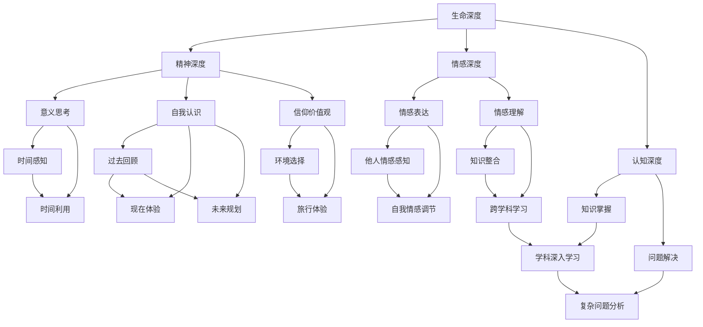
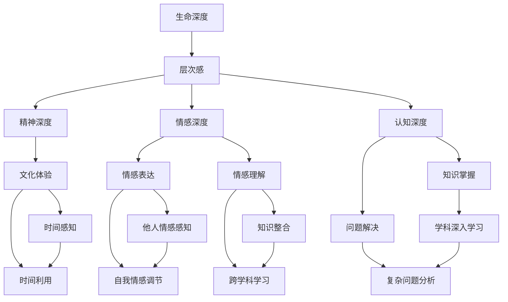

                 

### 文章标题：增加生命经历的深度：丰富人生的层次感

### 关键词：人生深度、层次感、心理学、社交技巧、学习技巧、艺术、项目实战

### 摘要：

本文旨在探讨如何通过不同的方式增加生命的深度和层次感，从而获得更加丰富的人生体验。我们将首先介绍核心概念，并通过Mermaid流程图展示它们之间的关系。接着，我们将深入探讨提高生活技巧的各种方法，包括心理技巧、社交技巧、学习技巧、旅行与探索以及艺术与创造力。通过实际项目实战，我们将展示如何将这些方法和技巧应用到实际生活中。最后，我们将对全书内容进行总结，并提出未来展望。希望通过这篇文章，您能找到增加人生深度和层次感的方法，从而过上更加充实和有意义的生活。

## 引言

在现代社会中，人们往往追求物质的丰富和享受，但很少有人意识到，真正的幸福和满足来自于内心的丰富和成长。生命的深度和层次感是衡量一个人生活质量的重要标准。那么，什么是生命的深度和层次感呢？

生命的深度指的是个人在精神、情感、认知等各个方面所能达到的深度和广度。层次感则是指人生经历的丰富性和多样性。一个拥有丰富层次感的人，能够在不同领域都有所涉猎，能够在多种情境下保持内心的平静和充实。

本文将围绕这个主题展开，旨在为读者提供一些实用的方法和技巧，帮助大家增加生命的深度和层次感。首先，我们将解释核心概念，并通过Mermaid流程图展示它们之间的关系。然后，我们将深入探讨提高生活技巧的各种方法，包括心理技巧、社交技巧、学习技巧、旅行与探索以及艺术与创造力。通过实际项目实战，我们将展示如何将这些方法和技巧应用到实际生活中。最后，我们将对全书内容进行总结，并提出未来展望。

## 核心概念与联系

在讨论如何增加生命的深度和层次感之前，我们首先需要明确几个核心概念，并了解它们之间的相互关系。

### 生命深度

生命深度指的是个人在精神、情感、认知等各个方面所能达到的深度和广度。它包括以下几个方面：

- **精神深度**：指的是个人的内心世界，包括对人生意义的思考、对自我的认识、对信仰和价值观的坚持等。
- **情感深度**：指的是个人在情感表达和情感理解方面的能力，包括对他人情感的感知、对自我情感的调节等。
- **认知深度**：指的是个人的认知能力和认知范围，包括对知识的深入理解、对复杂问题的分析解决能力等。

### 层次感

层次感指的是人生经历的丰富性和多样性。它包括以下几个方面：

- **时间层次感**：指的是对时间的感知和利用，包括对过去经历的回顾、对现在经历的体验和对未来经历的规划。
- **空间层次感**：指的是对空间感知和利用的能力，包括对生活环境的选择、对旅行体验的追求等。
- **知识层次感**：指的是对知识的掌握和运用，包括对各种学科的深入学习、对跨学科知识的整合等。

### Mermaid流程图

为了更好地展示这些核心概念之间的关系，我们可以使用Mermaid流程图来直观地表示。以下是生命深度和层次感的Mermaid流程图：

通过这个流程图，我们可以清晰地看到生命深度和层次感之间的相互关系。每个核心概念都与其他概念有着紧密的联系，共同构成了一个完整的生命体验。理解这些概念之间的关系，有助于我们更好地理解如何增加生命的深度和层次感。

### 生命深度与层次感的关系

生命深度和层次感并不是独立的，它们相互影响，相互促进。一个拥有丰富层次感的人生往往意味着在各个领域都有深入的体验和了解，而这种深入体验和了解又可以进一步增加生命的深度。

例如，一个通过旅行体验不同文化的人，可能会在精神上获得新的感悟，增加情感深度和认知深度。同时，这些新的体验和感悟又可以进一步丰富他的层次感，使他的人生更加充实。

反过来，一个在精神、情感、认知方面都有深入探索的人，也会更容易感受到人生的层次感。他们能够在不同的时间和空间中体验到不同的生活，拥有更丰富的知识体系和情感体验。

通过这个关系图，我们可以更直观地理解生命深度和层次感之间的互动关系。

### 核心概念与联系的总结

通过以上讨论，我们可以总结出几个关键点：

1. 生命深度和层次感是相互促进、相互影响的。
2. 精神、情感、认知是构成生命深度的重要方面。
3. 时间、空间、知识是构成层次感的重要方面。
4. 了解这些核心概念及其相互关系，有助于我们更好地理解和实践如何增加生命的深度和层次感。

在接下来的部分，我们将深入探讨如何通过具体的生活技巧和方法来增加生命的深度和层次感。

### 生活技巧与方法

要增加生命的深度和层次感，我们需要从多个方面入手，包括心理技巧、社交技巧、学习技巧、旅行与探索以及艺术与创造力。以下将详细讨论这些方法和技巧。

#### 心理技巧

**自我认知**：自我认知是心理技巧的基础。通过反思和自我探索，我们可以更好地了解自己的需求、情感和价值观。这可以通过写日记、进行冥想或者与心理咨询师交流来实现。

**情绪管理**：情绪管理是另一个重要的心理技巧。学会识别和调节自己的情绪，可以帮助我们更好地应对生活中的挑战。这可以通过学习正念冥想、情绪调节技巧或参加心理学工作坊来实现。

**建立健康的心态**：一个健康的心态是增加生命深度的关键。培养积极乐观的态度，学会感恩和接受，可以帮助我们更好地应对生活中的起伏。

#### 社交技巧

**建立深度关系**：与他人建立深度关系是增加层次感的重要途径。这可以通过定期与朋友聚会、参与社交活动或者加入兴趣小组来实现。

**倾听与表达**：倾听和表达是建立深度关系的核心。学会倾听他人的需求和感受，并有效地表达自己的想法和情感，可以帮助我们与他人建立更紧密的联系。

**建立支持网络**：建立支持网络可以为我们提供情感和实际上的支持。这可以通过加入社区组织、参加志愿者活动或者建立互助小组来实现。

#### 学习技巧

**持续学习**：持续学习是增加认知深度和层次感的关键。这可以通过定期阅读、参加线上或线下课程、参加工作坊来实现。

**跨学科学习**：跨学科学习可以拓宽我们的视野，增加知识的广度。这可以通过阅读不同领域的书籍、参加跨学科研讨会或课程来实现。

**实践与应用**：将学到的知识应用到实际生活中，可以帮助我们更好地理解和掌握这些知识。这可以通过进行项目研究、参与实践项目或者在实际工作中应用所学知识来实现。

#### 旅行与探索

**体验不同文化**：旅行和探索可以让我们体验不同的文化和生活方式，增加我们的层次感。这可以通过计划旅行、参加文化交流活动或者与不同文化背景的人交流来实现。

**学习新技能**：在旅行中，我们可以学习新的技能，如烹饪、手工艺等。这些技能不仅可以让我们的生活更加丰富，还可以增加我们的认知深度。

**反思与总结**：在旅行结束后，我们可以反思和总结旅行中的经历和收获，从而更好地理解自己的成长和变化。

#### 艺术与创造力

**欣赏艺术**：欣赏艺术作品可以激发我们的创造力和想象力，增加我们的精神层次感。这可以通过参观博物馆、艺术展览或者在线欣赏艺术作品来实现。

**创作艺术**：创作艺术作品可以帮助我们表达自己的情感和想法，增加我们的情感层次感。这可以通过绘画、写作、音乐创作等来实现。

**艺术治疗**：艺术治疗可以帮助我们处理情绪问题，提高我们的心理健康。这可以通过参加艺术治疗工作坊、与艺术治疗师交流来实现。

#### 总结

通过以上生活技巧和方法，我们可以从多个方面增加生命的深度和层次感。心理技巧帮助我们更好地了解自己和管理情绪，社交技巧帮助我们与他人建立深度关系，学习技巧帮助我们持续成长，旅行与探索让我们体验不同的文化和生活方式，艺术与创造力激发我们的创造力和想象力。通过这些方法和技巧，我们可以过上更加丰富和有意义的生活。

### 项目实战

为了更具体地展示如何将上述生活技巧与方法应用到实际生活中，下面我们将通过几个实际项目实战来展示如何通过这些方法和技巧来增加生命的深度和层次感。

#### 项目一：个人成长项目

**目标**：设计并实施一个个人成长计划，以提升个人在精神、情感和认知方面的深度。

**步骤**：

1. **自我反思**：首先，通过写日记或进行冥想，进行自我反思，了解自己在精神、情感和认知方面的现状和需求。
2. **制定计划**：根据自我反思的结果，制定一个详细的个人成长计划，包括每天的学习时间、锻炼时间、休息时间等。
3. **实施计划**：严格按照计划执行，并定期检查进度和效果。
4. **调整计划**：根据实际情况和反馈，及时调整计划。

**效果分析**：

通过这个项目，可以显著提升个人在精神、情感和认知方面的深度。例如，通过持续学习和阅读，可以提升认知深度；通过定期锻炼和休息，可以提升情感深度；通过自我反思和冥想，可以提升精神深度。

#### 项目二：社交实验

**目标**：通过社交实验，提升社交技巧和建立深度关系。

**步骤**：

1. **确定目标**：明确自己想要通过社交实验提升的社交技巧，如倾听、表达、建立支持网络等。
2. **设计实验**：设计一个社交实验，如定期与朋友聚会、参加社交活动或者加入兴趣小组。
3. **执行实验**：按照设计执行实验，并记录实验过程和结果。
4. **分析结果**：根据实验结果，分析自己在目标社交技巧上的进步和不足，并制定改进计划。

**效果分析**：

通过这个项目，可以显著提升社交技巧和建立深度关系。例如，通过定期与朋友聚会，可以提升人际交往能力；通过参加社交活动，可以提升表达能力；通过加入兴趣小组，可以建立更深入的关系网络。

#### 项目三：学习项目

**目标**：通过学习项目，提升学习能力和知识层次。

**步骤**：

1. **选择学习目标**：选择一个具体的学习目标，如学习一门新语言、学习一种新的编程技术等。
2. **制定学习计划**：根据学习目标，制定一个详细的学习计划，包括学习时间、学习内容等。
3. **执行学习计划**：按照学习计划执行，并记录学习过程和结果。
4. **反馈与调整**：根据学习结果和反馈，及时调整学习计划，并优化学习策略。

**效果分析**：

通过这个项目，可以显著提升学习能力和知识层次。例如，通过学习一门新语言，可以提升语言能力；通过学习一种新的编程技术，可以提升编程能力；通过持续学习和实践，可以建立更广泛的知识体系。

#### 项目四：旅行日记

**目标**：通过记录旅行日记，增加时间层次感和空间层次感。

**步骤**：

1. **选择旅行目的地**：选择一个有吸引力的旅行目的地。
2. **记录旅行日记**：在旅行过程中，记录每天的所见所闻、所思所感，可以文字记录，也可以通过照片、视频等多种形式记录。
3. **整理旅行日记**：在旅行结束后，整理和总结旅行日记，撰写旅行总结或心得。
4. **分享旅行经历**：将旅行日记或总结分享给他人，如通过社交媒体、博客或纸质书籍等方式。

**效果分析**：

通过这个项目，可以显著增加时间层次感和空间层次感。例如，通过记录旅行日记，可以回顾和总结旅行经历，增加对时间的感知和利用；通过分享旅行经历，可以分享和交流旅行中的体验和感受，增加对空间和文化的理解。

#### 项目五：艺术创作

**目标**：通过艺术创作，增加情感层次感和创造力。

**步骤**：

1. **选择艺术形式**：选择一种艺术形式，如绘画、写作、音乐等。
2. **进行艺术创作**：根据所选艺术形式，进行创作，可以独立创作，也可以与他人合作。
3. **反思与改进**：在创作过程中，不断反思和改进，以提高艺术创作的质量。
4. **分享艺术作品**：将艺术作品分享给他人，可以通过展览、演出、社交媒体等方式分享。

**效果分析**：

通过这个项目，可以显著增加情感层次感和创造力。例如，通过绘画，可以表达内心的情感和想法；通过写作，可以提升表达能力和想象力；通过音乐创作，可以提升音乐素养和创造力。

### 项目实战的总结

通过以上项目实战，我们可以看到，通过具体的方法和技巧，我们可以在实际生活中增加生命的深度和层次感。每个项目都旨在通过实践和体验，提升个人在多个方面的能力和体验。这些项目不仅可以帮助我们实现目标，还可以激发我们的内在动力，使我们的人生更加丰富和有意义。

### 最佳实践 Tips

在增加生命的深度和层次感的道路上，以下是一些最佳实践的小贴士，可以帮助您更加高效地实现目标：

1. **设定明确的目标**：在开始任何项目之前，明确您的目标是什么，这将有助于您保持动力并专注于实现目标。

2. **持续学习与反思**：定期学习新知识和技能，并通过反思来评估自己的进步和不足。

3. **保持好奇心**：对周围的世界保持好奇心，不断探索未知领域，这将帮助您发现新的兴趣和激情。

4. **合理安排时间**：合理安排时间，确保有足够的时间进行学习和实践，同时也要注意休息和放松。

5. **与他人交流**：与他人分享您的经验和想法，这不仅可以获得反馈，还可以建立更广泛的社交网络。

6. **保持耐心**：改变和成长需要时间，保持耐心，不要因为一时的困难而放弃。

7. **庆祝成就**：无论大小，都要庆祝自己的每一个成就，这会增强您的自信心和动力。

### 小结

通过本文的探讨，我们了解了如何通过不同的方式增加生命的深度和层次感。从心理技巧、社交技巧、学习技巧、旅行与探索到艺术与创造力，每个方面都有助于我们实现这一目标。通过具体的项目实战，我们可以将这些方法和技巧应用到实际生活中，从而提升个人能力和体验。希望这篇文章能够为您的成长之路提供一些有益的启示和帮助。

### 注意事项

在追求增加生命深度和层次感的过程中，以下几点需要注意：

1. **安全第一**：在进行任何活动，特别是旅行和探索时，始终确保个人安全。

2. **保持平衡**：在追求成长和探索的过程中，注意保持生活和工作之间的平衡，避免过度劳累。

3. **合理规划**：制定合理的计划和目标，避免过于理想化或急于求成。

4. **尊重他人**：在社交和探索过程中，尊重他人的观点和感受，建立和谐的人际关系。

5. **持续学习**：保持持续学习的态度，不断更新知识和技能。

### 拓展阅读

如果您对增加生命的深度和层次感有更深入的兴趣，以下是一些推荐的阅读材料：

1. 《奇特的一生》：作者乔治·蒙塔古·奥尔科特，通过记录自己的365天，展示了如何在日常生活中增加生命的深度和层次感。
2. 《如何赢得朋友与影响他人》：作者戴尔·卡耐基，提供了实用的社交技巧，帮助读者与他人建立深度关系。
3. 《深度工作》：作者卡尔·纽波特，探讨了如何通过专注和深度工作来提升个人能力和层次感。
4. 《旅行的艺术》：作者阿尔伯特·兰格，介绍了如何通过旅行来体验不同的文化和生活方式，增加生命的层次感。
5. 《艺术的力量》：作者汉斯·贝尔默，探讨了艺术创作和欣赏对增加生命深度和层次感的重要性。

