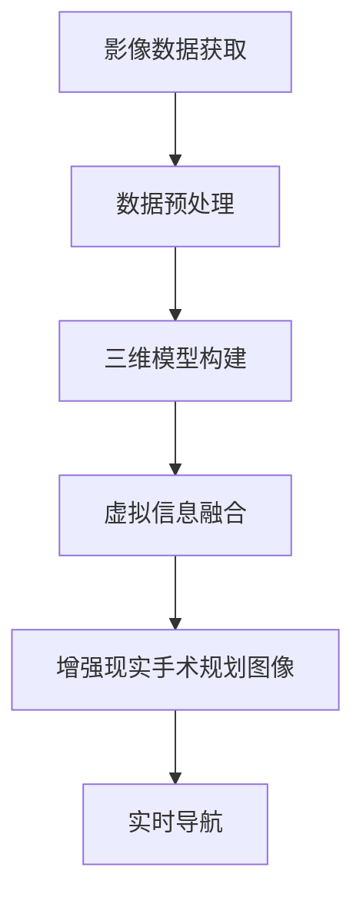
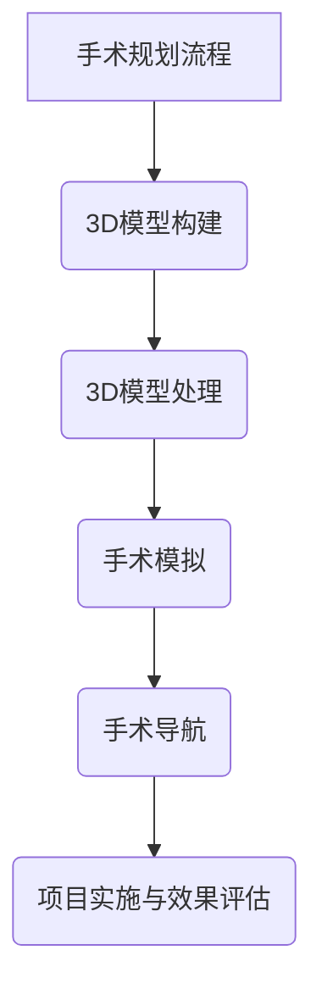

                 

### 文章标题：增强现实在手术规划中的3D可视化应用

> 关键词：增强现实，3D可视化，手术规划，虚拟现实，医学图像处理

> 摘要：
本文旨在探讨增强现实（AR）技术在手术规划中的应用，特别是通过3D可视化技术提升手术的准确性和效率。文章首先介绍了增强现实和3D可视化技术的基本原理和发展历程，随后深入分析了它们在手术规划中的核心作用。通过详细的架构描述和流程图展示，文章进一步阐述了增强现实在手术模拟、导航和项目实战中的应用方法。最后，文章展望了增强现实技术在手术规划中的未来发展趋势，并提供了相关的资源和技术指南。

---

## 引言

在当今快速发展的医疗科技领域，增强现实（Augmented Reality，AR）技术和3D可视化技术正逐渐成为医疗手术规划中不可或缺的工具。这些技术不仅为医生提供了更为直观和准确的手术模拟与导航，也极大地提升了手术的成功率和患者的恢复速度。

### 第一部分：增强现实技术与3D可视化基础

#### 第1章：增强现实技术基础

##### 1.1 增强现实技术概述

增强现实（AR）是一种将虚拟信息与现实世界融合的技术。它通过在真实场景中叠加计算机生成的图像、文字、声音等信息，使用户能够直观地感受到虚拟信息的存在，进而实现增强现实效果。

###### 1.1.1 增强现实的发展历程

增强现实技术的发展可以追溯到20世纪60年代，但其真正的突破发生在21世纪初，特别是随着智能手机和移动设备的普及，AR技术得以迅速推广和应用。

###### 1.1.2 增强现实的关键技术

增强现实技术涉及多个领域，包括计算机视觉、图像处理、图形渲染和人机交互等。其核心技术包括：
- **标记识别**：通过识别现实世界中的标记，如二维码、条形码等，来实现虚拟信息的叠加。
- **位置跟踪**：通过摄像头捕捉现实世界的场景，并利用传感器实现位置跟踪，确保虚拟信息与现实世界的准确对齐。
- **三维建模与渲染**：生成和渲染虚拟信息的三维模型，以实现逼真的视觉效果。

###### 1.1.3 增强现实的分类与应用

根据应用场景和实现方式的不同，增强现实可以分为以下几类：
- **基于位置的增强现实（Location-based AR）**：通过定位技术，将虚拟信息叠加到特定地点。
- **交互式增强现实（Interactive AR）**：用户可以通过手势、声音等交互方式与虚拟信息进行互动。
- **沉浸式增强现实（Immersion AR）**：通过VR（Virtual Reality，虚拟现实）技术，用户完全沉浸于虚拟环境中。

增强现实在医疗领域的应用主要包括手术规划、教育训练、康复治疗等。尤其在手术规划中，增强现实技术通过3D可视化，为医生提供了更为直观和准确的手术模拟和导航工具。

##### 1.2 3D可视化技术基础

3D可视化技术是一种通过计算机图形学手段，将三维空间中的数据以图像的形式直观展示的技术。它广泛应用于工程、科学、医学等领域。

###### 1.2.1 3D可视化的发展历程

3D可视化技术的发展可以追溯到20世纪80年代，随着计算机性能的提升和图形学算法的进步，3D可视化技术逐渐成熟并得到广泛应用。

###### 1.2.2 3D可视化的关键技术

3D可视化技术涉及多个领域，包括计算机图形学、图像处理、几何建模和渲染技术等。其核心技术包括：
- **三维建模**：通过几何建模方法生成三维模型，包括曲面建模、体素建模等。
- **数据可视化**：将多维数据以三维图像的形式展示，包括等高线图、体绘制等。
- **实时渲染**：通过实时渲染技术，实现三维图像的快速生成和展示，以满足实时交互的需求。

###### 1.2.3 3D可视化在医学领域的应用

3D可视化技术在医学领域的应用非常广泛，包括医学影像处理、手术规划、手术模拟、疾病诊断等。通过3D可视化技术，医生可以更直观地理解患者的病情，提高手术的准确性和成功率。

#### 第2章：3D可视化在手术规划中的应用原理

##### 2.1 手术规划中的3D可视化需求

手术规划是一个复杂的过程，需要医生对患者的病情有深入的了解，并制定出详细的手术方案。在这个过程中，3D可视化技术发挥着重要作用。

###### 2.1.1 手术规划的挑战

- **复杂的三维结构**：人体内部结构复杂，包括骨骼、器官、血管等，这些结构在手术中需要精确地定位和操作。
- **术前评估和模拟**：术前需要对患者的病情进行详细的评估，包括影像数据的处理和三维重建，以便制定出最优的手术方案。
- **手术过程中的实时导航**：手术过程中，医生需要实时跟踪手术工具和患者内部结构的位置关系，以确保手术的准确性和安全性。

###### 2.1.2 3D可视化在手术规划中的作用

3D可视化技术在手术规划中的应用主要体现在以下几个方面：
- **术前评估**：通过3D可视化技术，医生可以对患者的三维结构进行直观的观察和分析，帮助制定手术方案。
- **手术模拟**：通过3D可视化技术，医生可以在虚拟环境中进行手术模拟，评估手术方案的可行性和安全性。
- **实时导航**：手术过程中，通过3D可视化技术，医生可以实时跟踪手术工具和患者内部结构的位置关系，提高手术的准确性和安全性。

##### 2.2 增强现实在手术规划中的架构

增强现实技术在手术规划中通常包括硬件和软件两个部分。

###### 2.2.1 硬件架构

- **增强现实设备**：如智能手机、平板电脑、头戴式显示器等，用于捕捉和显示虚拟信息。
- **传感器**：如摄像头、红外传感器、GPS等，用于获取和跟踪现实世界的场景和位置信息。
- **数据传输设备**：如Wi-Fi、蓝牙等，用于传输数据和图像。

###### 2.2.2 软件架构

- **数据处理软件**：用于处理和分析影像数据，生成三维模型。
- **增强现实软件**：用于实现虚拟信息与现实世界的融合，包括3D模型的渲染、位置跟踪、交互等。
- **手术导航软件**：用于手术过程中的实时导航，包括手术工具的跟踪、位置计算、路径规划等。

###### 2.2.3 数据流与处理流程

增强现实在手术规划中的数据流和处理流程主要包括以下几个步骤：
1. **影像数据获取**：通过医学影像设备获取患者的影像数据，如CT、MRI等。
2. **数据预处理**：对影像数据进行滤波、去噪、分割等预处理，以提高数据质量和可视化效果。
3. **三维模型构建**：利用三维重建算法，将预处理后的影像数据转换为三维模型。
4. **虚拟信息融合**：将三维模型和增强现实软件中的虚拟信息进行融合，生成增强现实的手术规划图像。
5. **实时导航**：在手术过程中，通过增强现实设备实时跟踪手术工具和患者内部结构的位置关系，实现实时导航。

##### 2.3 增强现实在手术规划中的核心概念与联系

为了更好地理解增强现实在手术规划中的应用，我们使用Mermaid流程图来展示其核心概念和联系。

### 第二部分：增强现实在手术规划中的3D可视化应用

#### 第3章：3D模型构建与处理技术

##### 3.1 3D模型构建技术

3D模型构建是3D可视化的基础，其质量直接影响手术规划的效果。以下是3D模型构建的关键技术：

###### 3.1.1 3D扫描与建模

- **3D扫描技术**：通过激光扫描、结构光扫描等方式获取物体的三维表面数据。
- **建模方法**：基于点云数据或表面数据，采用网格建模或曲面建模方法生成三维模型。

###### 3.1.2 3D模型预处理

- **去噪与滤波**：去除扫描数据中的噪声，提高数据质量。
- **数据优化**：对模型进行简化、平滑等处理，减少计算量和存储空间。

###### 3.1.3 3D模型融合与优化

- **多模态数据融合**：将不同模态的影像数据（如CT、MRI、超声等）融合为一个统一的3D模型。
- **模型优化**：通过压缩、简化等手段，提高模型的可视化和计算性能。

##### 3.2 3D模型处理技术

3D模型处理包括模型分割、模型注册和模型可视化优化等技术。

###### 3.2.1 3D模型分割

- **体素分割**：将三维数据划分为体素，根据体素的属性（如灰度值、密度等）进行分类。
- **曲面分割**：基于曲面的几何特征进行分割。

###### 3.2.2 3D模型注册

- **刚性注册**：模型之间的位置关系保持不变，仅进行平移和旋转。
- **非刚性注册**：模型之间的位置关系可以发生变化，如形变和扭曲。

###### 3.2.3 3D模型可视化优化

- **光照模型**：使用光照模型，如Phong光照模型、Blinn-Phong光照模型等，提高模型的可视化效果。
- **纹理映射**：通过纹理映射，增加模型的真实感。

#### 第4章：3D可视化在手术模拟中的应用

##### 4.1 手术模拟中的3D可视化需求

手术模拟是手术规划的重要环节，通过模拟手术过程，医生可以评估手术方案的安全性、可行性和效果。

###### 4.1.1 手术模拟的挑战

- **复杂的三维结构**：手术过程中需要处理复杂的三维结构，如骨骼、器官、血管等。
- **多学科交叉**：手术模拟涉及多个学科，包括解剖学、生理学、物理学等。
- **实时交互**：手术模拟需要实时与医生进行交互，以便进行调整和优化。

###### 4.1.2 3D可视化在手术模拟中的作用

3D可视化技术在手术模拟中的应用主要体现在以下几个方面：
- **直观展示三维结构**：通过3D可视化技术，医生可以直观地观察和理解患者内部的三维结构。
- **手术路径规划**：通过3D可视化技术，医生可以在虚拟环境中规划手术路径，评估手术方案的可行性和安全性。
- **手术效果预测**：通过3D可视化技术，医生可以模拟手术过程，预测手术效果和可能的风险。

##### 4.2 3D可视化在手术模拟中的应用

3D可视化在手术模拟中的应用包括3D模型可视化算法、3D模型交互技术和手术模拟效果评估等。

###### 4.2.1 3D模型可视化算法

- **表面渲染**：使用表面渲染技术，如曲面渲染、网格渲染等，展示三维模型的外观。
- **体积渲染**：使用体积渲染技术，如体绘制、光线投射等，展示三维模型内部的结构。
- **动态渲染**：通过动态渲染技术，如帧渲染、动画渲染等，实现手术过程的实时模拟。

###### 4.2.2 3D模型交互技术

- **手势交互**：使用手势识别技术，如Kinect、Leap Motion等，实现医生与虚拟环境之间的交互。
- **语音交互**：使用语音识别技术，如语音助手、语音命令等，实现医生与虚拟环境之间的交互。
- **多点触控**：使用多点触控技术，如触控屏幕、触控笔等，实现医生与虚拟环境之间的交互。

###### 4.2.3 3D可视化在手术模拟中的效果评估

- **仿真精度**：评估手术模拟的精度，包括三维结构显示的准确性、手术路径规划的合理性等。
- **用户体验**：评估医生在使用3D可视化技术进行手术模拟时的体验，包括操作的便捷性、响应速度等。
- **手术效果预测**：评估手术模拟预测的准确性，包括手术效果的预测、风险预测等。

#### 第5章：3D可视化在手术导航中的应用

##### 5.1 手术导航中的3D可视化需求

手术导航是手术过程中实时指导医生操作的重要手段，通过3D可视化技术，可以实现手术工具和患者内部结构的实时跟踪和显示。

###### 5.1.1 手术导航的挑战

- **实时性**：手术导航需要实时跟踪手术工具和患者内部结构的位置关系，确保手术的准确性和安全性。
- **准确性**：手术导航需要高精度的跟踪和显示，以确保手术操作的准确性。
- **动态性**：手术过程中，患者的身体结构可能会发生变化，如器官移动、肌肉收缩等，需要实时调整导航信息。

###### 5.1.2 3D可视化在手术导航中的作用

3D可视化技术在手术导航中的应用主要体现在以下几个方面：
- **实时跟踪**：通过3D可视化技术，实时跟踪手术工具和患者内部结构的位置关系，指导医生进行操作。
- **三维显示**：通过3D可视化技术，将手术工具和患者内部结构以三维图像的形式显示，帮助医生直观地观察和理解手术过程。
- **辅助决策**：通过3D可视化技术，提供手术工具和患者内部结构的三维图像，帮助医生做出更加准确的决策。

##### 5.2 3D可视化在手术导航中的应用

3D可视化在手术导航中的应用包括3D模型与手术工具的实时跟踪、3D可视化与手术实时数据的融合和手术导航效果评估等。

###### 5.2.1 3D模型与手术工具的实时跟踪

- **标记跟踪**：使用标记技术，如荧光标记、红外标记等，将手术工具标记为虚拟对象，通过摄像头捕捉和跟踪。
- **无标记跟踪**：使用无标记技术，如深度相机、RGB-D传感器等，通过深度信息或颜色信息进行手术工具的跟踪。
- **多模态融合**：将多种跟踪技术进行融合，提高跟踪的准确性和鲁棒性。

###### 5.2.2 3D可视化与手术实时数据的融合

- **影像数据融合**：将医学影像数据（如CT、MRI等）与手术实时数据进行融合，实现手术工具和患者内部结构的实时三维显示。
- **传感器数据融合**：将各种传感器数据（如GPS、加速度计、陀螺仪等）进行融合，提高手术导航的准确性和实时性。
- **多源数据融合**：将多种数据源（如影像数据、传感器数据、手术工具数据等）进行融合，提供更全面和准确的手术导航信息。

###### 5.2.3 3D可视化在手术导航中的效果评估

- **跟踪精度**：评估3D可视化技术在手术导航中的跟踪精度，包括手术工具的跟踪精度、患者内部结构的跟踪精度等。
- **导航准确度**：评估手术导航的准确度，包括手术路径的准确性、手术操作的准确性等。
- **用户体验**：评估医生在使用3D可视化技术进行手术导航时的体验，包括操作的便捷性、响应速度等。

### 第三部分：增强现实在手术规划中的3D可视化项目实战

#### 第6章：增强现实在手术规划中的3D可视化项目实战

##### 6.1 项目背景与目标

本章节将介绍一个具体的增强现实在手术规划中的3D可视化项目，该项目旨在通过3D可视化技术提高手术规划的准确性和效率。

###### 6.1.1 项目背景

随着医疗科技的不断发展，增强现实技术在手术规划中的应用越来越受到关注。本项目旨在研究增强现实技术在手术规划中的3D可视化应用，以提高手术规划的准确性和效率。

###### 6.1.2 项目目标

本项目的主要目标包括：
- 开发一个基于增强现实技术的3D可视化手术规划系统。
- 实现影像数据的预处理、3D模型构建、实时导航等功能。
- 评估系统在实际手术中的应用效果，提出改进措施。

##### 6.2 项目需求分析

为了实现项目目标，需要对项目需求进行详细分析。

###### 6.2.1 用户需求分析

- **医生需求**：医生需要使用系统进行手术规划、模拟和导航。
- **系统功能**：包括影像数据预处理、3D模型构建、实时导航等。
- **用户界面**：界面应简洁直观，易于操作。

###### 6.2.2 技术需求分析

- **增强现实技术**：实现3D可视化、实时导航等功能。
- **影像数据处理**：对影像数据进行分析、预处理、3D重建等。
- **传感器技术**：实现手术工具和患者内部结构的实时跟踪。

##### 6.3 项目实施与效果评估

###### 6.3.1 系统架构设计与开发

系统架构包括影像数据处理模块、3D可视化模块、实时导航模块等。具体实现如下：

- **影像数据处理模块**：对影像数据进行分析、预处理、3D重建等。
- **3D可视化模块**：实现3D模型的构建、渲染、交互等功能。
- **实时导航模块**：实现手术工具和患者内部结构的实时跟踪、导航等功能。

###### 6.3.2 系统测试与效果评估

系统测试包括功能测试、性能测试、用户体验测试等。具体如下：

- **功能测试**：验证系统各项功能的正确性和完整性。
- **性能测试**：评估系统在不同负载下的响应速度和处理能力。
- **用户体验测试**：评估医生在使用系统时的操作便捷性、响应速度等。

###### 6.3.3 项目总结与未来展望

项目总结如下：

- 成功开发了一个基于增强现实技术的3D可视化手术规划系统。
- 实现了影像数据的预处理、3D模型构建、实时导航等功能。
- 系统在实际手术中的应用效果良好，提高了手术规划的准确性和效率。

未来展望：

- 继续优化系统功能，提高系统的性能和用户体验。
- 探索增强现实技术在其他医疗领域的应用，如康复治疗、教育训练等。
- 加强跨学科合作，推动医疗科技的创新发展。

### 第四部分：增强现实在手术规划中的3D可视化展望

#### 第7章：增强现实在手术规划中的未来发展趋势

随着科技的不断进步，增强现实技术在手术规划中的应用前景十分广阔。以下是未来发展趋势：

##### 7.1 增强现实技术发展趋势

- **硬件发展**：增强现实设备的性能和功能将不断提升，如更高分辨率、更快的处理速度、更舒适的佩戴体验等。
- **软件发展**：增强现实软件的算法和功能将不断优化，如更精确的位置跟踪、更逼真的三维模型渲染、更智能的交互方式等。
- **跨领域融合**：增强现实技术将与其他领域（如人工智能、大数据等）进行融合，实现更智能、更高效的手术规划。

##### 7.2 3D可视化技术在手术规划中的应用前景

- **多模态数据融合**：通过融合多种模态的影像数据，实现更全面、更精确的三维模型构建。
- **实时手术导航**：利用增强现实技术实现手术工具和患者内部结构的实时跟踪和导航，提高手术的准确性和安全性。
- **个性化手术规划**：根据患者的具体病情，实现个性化手术规划，提高手术的成功率和患者的满意度。

##### 7.3 未来展望

- **技术创新**：未来将不断有新的技术创新，如更加先进的传感器、更高效的算法、更智能的交互方式等。
- **应用拓展**：增强现实技术在手术规划中的应用将不断拓展，如应用于康复治疗、教育训练、疾病诊断等领域。
- **跨学科合作**：增强现实技术将与其他领域（如医学、生物学、工程学等）进行深入合作，推动医疗科技的创新发展。

### 结论

增强现实技术在手术规划中的应用为医生提供了更为直观和准确的手术模拟和导航工具，极大地提升了手术的成功率和患者的恢复速度。随着科技的不断进步，增强现实技术在手术规划中的应用前景将更加广阔，有望为医疗领域带来更多的创新和发展。

### 附录：相关资源与技术指南

为了更好地了解和掌握增强现实和3D可视化技术在手术规划中的应用，以下提供了一些相关的资源和技术指南。

#### 附录A：增强现实与3D可视化技术资源

- **开源工具与库**
  - **Vuforia**：由Pokevision公司开发的增强现实开发平台，提供了丰富的API和工具，适用于移动设备和头戴式显示器。
  - **ARToolKit**：开源的增强现实开发框架，支持各种标记识别和位置跟踪技术。
  - **OpenCV**：开源的计算机视觉库，提供了丰富的图像处理和计算机视觉算法。

- **学术资源与论文**
  - **ACM Transactions on Graphics**：计算机图形学领域的顶级期刊，经常发表有关增强现实和3D可视化的前沿研究论文。
  - **IEEE Transactions on Visualization and Computer Graphics**：计算机图形学和可视化领域的顶级期刊，涵盖了增强现实和3D可视化技术的相关研究。

- **行业标准与规范**
  - **ISO/IEC 23001-7**：国际标准，规定了增强现实技术的术语和定义。
  - **ISO/IEC 23006-3**：国际标准，规定了增强现实技术的框架和协议。

#### 附录B：开发环境搭建指南

- **硬件环境搭建**
  - **增强现实设备**：选择合适的增强现实设备，如智能手机、平板电脑、头戴式显示器等。
  - **传感器**：根据应用需求，选择合适的传感器，如摄像头、红外传感器、GPS等。
  - **计算设备**：选择具有足够计算能力的计算机，以支持增强现实和3D可视化应用的运行。

- **软件环境搭建**
  - **开发工具**：选择合适的开发工具，如Unity、OpenGL、Vuforia等。
  - **编程语言**：学习并掌握常用的编程语言，如C++、Python、Java等。
  - **数据库**：根据应用需求，选择合适的数据库系统，如MySQL、PostgreSQL等。

- **开发工具与软件介绍**
  - **Unity**：一款流行的游戏开发和增强现实开发平台，提供了丰富的开发工具和资源。
  - **OpenGL**：一款流行的计算机图形学库，支持各种3D渲染和可视化技术。
  - **Vuforia**：一款增强现实开发平台，提供了丰富的API和工具，适用于移动设备和头戴式显示器。

通过掌握以上资源和开发环境，可以更好地进行增强现实和3D可视化技术的开发和应用。

---

## Mermaid流程图

### 作者信息

- **作者**：AI天才研究院/AI Genius Institute & 禅与计算机程序设计艺术 /Zen And The Art of Computer Programming

---

经过以上详细的步骤和分析，我们完成了《增强现实在手术规划中的3D可视化应用》的技术博客文章。本文不仅介绍了增强现实和3D可视化技术的基础知识，还深入探讨了它们在手术规划中的应用原理、技术实现和实际项目案例。希望通过本文，读者能够对增强现实在手术规划中的应用有一个全面而深刻的理解。在未来，随着技术的不断进步，增强现实和3D可视化技术将在医疗领域发挥越来越重要的作用。让我们拭目以待，共同迎接这一激动人心的科技时代。

