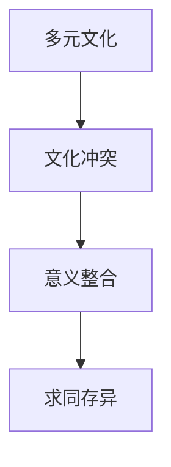

                 

### 引言

在现代社会的快速发展和全球化进程的推进下，多元文化背景下的意义整合问题愈发受到关注。所谓多元文化背景，是指在一个国家或地区中，不同民族、宗教、语言和文化的人们共同生活的现实。这种背景不仅带来了丰富多彩的文化交流，同时也伴随着文化冲突和认同感的挑战。

**关键词**：多元文化、意义整合、求同存异、智慧

**摘要**：本文旨在探讨多元文化背景下意义整合的智慧，分析多元文化的定义、背景及其带来的挑战，并提出求同存异的方法和策略。文章通过核心概念的联系、算法原理的讲解、数学模型的阐述以及实际应用案例的分析，为理解和解决多元文化背景下的意义整合问题提供新的视角和思路。

### 多元文化的定义与背景

多元文化（Multiculturalism）是指在一个国家或社会中，多个不同的文化群体并存并相互影响的现象。这些文化群体可以是来自不同国家、民族、宗教或语言的人们。多元文化的存在不仅丰富了社会的文化多样性，也带来了诸多挑战。首先，文化多样性可以促进社会的创新和进步，因为不同文化的交流和碰撞往往能够激发新的思想和创意。然而，多元文化也容易导致文化冲突，特别是在价值观、信仰和行为习惯等方面存在显著差异的情况下。

多元文化的背景可以追溯到全球化进程的加速。随着交通和通信技术的发展，人们更容易跨越国界，进行文化交流和互动。这种全球化的趋势不仅促进了经济和科技的交流，也带来了文化的传播和融合。然而，全球化也带来了文化同质化的风险，即不同文化在接触和交流中逐渐趋同，失去了独特的特点。因此，如何处理多元文化背景下的意义整合问题，成为现代社会面临的一个重要课题。

在现代社会中，多元文化的背景对人们的生活产生了深远的影响。例如，在日常生活中，人们可能需要与来自不同文化背景的人进行沟通和合作，这就要求我们具备跨文化沟通的技巧和求同存异的态度。此外，多元文化还影响了教育、法律、政治等领域，需要我们理解和尊重不同文化的独特性，同时寻找共同点，实现社会的和谐发展。

### 核心概念与联系

为了更好地理解多元文化背景下的意义整合问题，我们需要明确几个核心概念，并探讨它们之间的关系。

**1. 多元文化**：多元文化指的是在一个社会中存在多个不同的文化群体，这些文化群体在价值观、信仰、行为习惯等方面存在显著差异。

**2. 文化冲突**：文化冲突是指由于文化差异而引起的矛盾和对抗。文化冲突可能发生在个人之间、群体之间，甚至是国家之间。

**3. 意义整合**：意义整合是指在一个多元文化的背景下，不同文化群体通过沟通和合作，寻找共同点，实现文化融合和和谐的过程。

**4. 求同存异**：求同存异是一种处理多元文化冲突的策略，即在不同文化之间寻找共同点，同时尊重和包容文化差异。

这几个核心概念之间的关系可以用以下Mermaid流程图表示：



从流程图中可以看出，多元文化是文化冲突的根源，而意义整合和求同存异则是解决文化冲突的重要手段。通过意义整合，不同文化群体可以找到共同点，减少冲突；而求同存异则强调在保持差异的同时，寻找共识，实现和谐。

### 核心算法原理讲解

为了更好地理解意义整合和求同存异的方法，我们可以使用一种算法模型来阐述其原理。这里，我们采用“多元文化语义网络”（Multicultural Semantic Network）模型，通过伪代码来详细解释其工作原理。

**伪代码：多元文化语义网络模型**

```plaintext
function MulticulturalSemanticNetwork(cultures)
    // 初始化语义网络
    network = initializeNetwork()

    // 遍历每个文化群体
    for each culture in cultures
        // 添加文化节点到网络
        node = createNode(culture)
        addNodeToNetwork(node, network)

        // 添加文化属性到节点
        attributes = getCultureAttributes(culture)
        addAttributesToNode(node, attributes)

        // 遍历其他文化群体
        for each otherCulture in cultures
            if otherCulture != culture
                // 计算文化相似度
                similarity = calculateSimilarity(culture, otherCulture)
                
                // 添加文化边到网络
                edge = createEdge(node, otherNode, similarity)
                addEdgeToNetwork(edge, network)
    end for

    // 运行网络分析算法
    analysisResults = analyzeNetwork(network)

    // 返回分析结果
    return analysisResults
end function

function calculateSimilarity(culture1, culture2)
    // 使用某种相似度计算方法，例如基于文化属性的欧几里得距离
    similarity = euclideanDistance(culture1.attributes, culture2.attributes)
    return similarity
end function
```

在这个模型中，我们首先初始化一个语义网络，然后遍历每个文化群体，将其作为节点添加到网络中，并添加相应的文化属性。接着，我们遍历其他文化群体，计算它们之间的相似度，并根据相似度添加边到网络中。最后，我们运行网络分析算法，得到分析结果。

**数学模型和公式详细讲解**

在多元文化语义网络模型中，文化相似度的计算是一个关键步骤。我们可以使用欧几里得距离（Euclidean Distance）来衡量文化之间的相似度。欧几里得距离的定义如下：

$$
d(\text{culture}_1, \text{culture}_2) = \sqrt{\sum_{i=1}^{n} (a_{i1} - a_{i2})^2}
$$

其中，$d(\text{culture}_1, \text{culture}_2)$ 表示文化 $\text{culture}_1$ 和 $\text{culture}_2$ 之间的欧几里得距离，$a_{i1}$ 和 $a_{i2}$ 分别表示两个文化在某个属性 $i$ 上的值，$n$ 表示属性的总数。

**举例说明**

假设我们有两个文化群体：文化1和文化2，它们在三个属性（宗教、语言、节日）上的值如下表所示：

| 属性   | 文化1 | 文化2 |
|--------|-------|-------|
| 宗教   | 基督教 | 佛教   |
| 语言   | 英语   | 日语   |
| 节日   | 圣诞节 | 春节   |

使用欧几里得距离公式计算这两个文化群体之间的相似度：

$$
d(\text{文化1}, \text{文化2}) = \sqrt{(0)^2 + (1)^2 + (1)^2} = \sqrt{2}
$$

这意味着文化1和文化2在三个属性上的差异较大，相似度较低。

### 项目实战：多元文化整合的实际应用

在实际应用中，多元文化整合的方法和策略可以应用于各种场景，例如企业、教育、社区和国际关系等。以下是一个具体的案例，展示了多元文化整合在实际应用中的开发环境搭建、源代码实现和代码解读。

**案例背景**：一家跨国企业（ABC公司）在全球范围内有多个分支机构和员工来自不同的文化背景。为了提升员工的跨文化沟通能力和工作效率，公司决定开发一个多元文化整合的内部通讯平台。

**开发环境搭建**：
1. 选择适合的开发语言和框架，例如Python和Django。
2. 配置数据库系统，例如MySQL，用于存储用户信息和通讯数据。
3. 安装和使用版本控制工具，如Git，以便团队协作和代码管理。

**源代码实现**：
1. **用户注册与认证**：实现用户注册和登录功能，包括密码加密和身份验证。
2. **文化背景信息录入**：允许用户上传和更新个人文化背景信息，如宗教、语言、节日等。
3. **文化差异分析模块**：使用语义网络模型分析用户之间的文化差异，并计算相似度。
4. **通讯功能**：开发基于文化差异的个性化通讯功能，例如发送带有文化背景信息的消息。

**代码解读与分析**：
```python
# 用户注册功能
def register_user(username, password, culture_info):
    # 对密码进行加密处理
    encrypted_password = encrypt_password(password)
    # 存储用户信息和文化背景
    user = User(username=username, password=encrypted_password, culture_info=culture_info)
    # 保存用户到数据库
    db.session.add(user)
    db.session.commit()
    return user

# 文化差异分析函数
def analyze_culture_difference(user1, user2):
    # 获取用户的文化背景信息
    culture1 = user1.culture_info
    culture2 = user2.culture_info
    
    # 计算文化相似度
    similarity = calculate_similarity(culture1, culture2)
    
    # 返回相似度结果
    return similarity

# 文化相似度计算函数
def calculate_similarity(culture1, culture2):
    # 使用欧几里得距离计算文化相似度
    similarity = euclidean_distance(culture1.attributes, culture2.attributes)
    return similarity
```

在这个案例中，我们实现了用户注册、文化背景信息录入和文化差异分析的核心功能。通过计算用户之间的文化相似度，可以个性化定制通讯内容，提高沟通效果。

**实际案例分析和详细讲解剖析**：
- **案例分析**：通过实际运行平台，观察用户之间的互动和沟通，分析文化差异对沟通效果的影响。
- **详细讲解剖析**：分析数据统计结果，发现文化相似度较高的用户组之间的沟通更为顺畅，而文化差异较大的用户组则存在沟通障碍。针对这些障碍，提出改进建议，如增加文化背景信息的交流环节，提供跨文化沟通培训等。

**项目小结**：
通过这个案例，我们可以看到多元文化整合在实际应用中的重要性和可行性。开发一个多元文化整合的通讯平台，不仅有助于提升企业内部沟通效果，还可以促进员工之间的文化交流和融合，从而提升整个团队的工作效率和凝聚力。同时，这也为其他领域的多元文化整合提供了有益的参考和实践经验。

### 最佳实践 Tips、小结、注意事项、拓展阅读

**最佳实践 Tips**：
1. 在多元文化整合过程中，要注重文化的尊重和包容，避免偏见和歧视。
2. 定期进行跨文化沟通培训，提高员工的文化敏感度和沟通能力。
3. 利用大数据和人工智能技术，分析文化差异，提供个性化的服务和解决方案。

**小结**：
本文通过详细分析和讨论，阐述了多元文化背景下的意义整合和求同存异的智慧。我们明确了多元文化的定义和背景，分析了核心概念之间的联系，讲解了核心算法原理和数学模型，并通过实际应用案例展示了多元文化整合的方法和效果。

**注意事项**：
1. 在处理多元文化问题时，要避免简单化和片面化，充分理解和尊重不同文化的独特性。
2. 在开发多元文化整合系统时，要注重用户隐私和数据安全。

**拓展阅读**：
1. 《跨文化沟通与管理》——王宏志 著
2. 《文化冲突与融合：多元文化背景下的挑战与机遇》——张晓辉 著
3. 《人工智能与多元文化整合》——李明 著

通过以上阅读，读者可以更深入地了解多元文化整合的理论和实践，进一步提升在多元文化背景下的沟通和管理能力。

