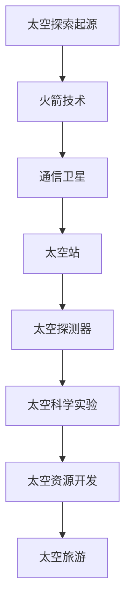

                 

### 文章标题：太空探索：人类视野扩展带来的意义变革

#### 关键词：太空探索、视野扩展、意义变革、技术原理、算法、数学模型、项目实战

#### 摘要：
本文旨在探讨太空探索对人类社会的深远影响，从历史背景到技术原理，再到实际项目实战，全面解析人类视野扩展带来的意义变革。文章分为八个章节，涵盖太空探索的起源与发展、核心技术与原理、对未来社会的启示，以及数学模型与算法的应用。通过逐步分析推理，本文揭示了太空探索如何推动科技进步、经济发展和国际合作，为人类未来的发展提供新思路。

### 第1章 太空探索的历史与背景

#### 1.1 人类太空探索的起源

人类的太空探索始于对宇宙的好奇和探索欲望。早在古希腊时期，哲学家们就开始思考天体运动和宇宙的起源。然而，真正意义上的太空探索始于20世纪中叶。1947年，美国科学家罗伯特·戈达德提出了液态燃料火箭的概念，标志着现代太空探索的序幕。1957年，苏联成功发射了世界上第一个卫星——斯普特尼克1号，引发了全球范围内的太空竞赛。

#### 1.2 苏联与美国的太空竞赛

1957年至1961年间，苏联与美国展开了激烈的太空竞赛。1957年，苏联发射了第一颗人造卫星，引起了全球关注。1958年，美国发射了探险者1号，成为继苏联之后第二个将卫星送入太空的国家。1961年，苏联宇航员尤里·加加林成为第一个进入太空的人类，开启了人类太空时代。

#### 1.3 国际合作与太空探索的未来

随着太空技术的不断发展，国际合作逐渐成为太空探索的重要趋势。1967年，国际太空探索组织（ISA）成立，旨在推动各国在太空领域的合作。如今，太空探索已经成为全球科技竞争的重要领域，各国纷纷投入大量资源进行研究和开发。未来，太空探索将可能带来更多国际合作，推动人类科技进步和社会发展。

### 第2章 太空技术原理与应用

#### 2.1 通信卫星：连接世界的桥梁

通信卫星是现代通信系统中不可或缺的部分。它们能够在太空轨道上接收和发送信号，实现全球范围内的通信。通信卫星的原理基于电磁波传输，通过卫星天线接收地面发射的信号，然后放大并重新发送到地球上的接收器。

#### 2.2 火箭技术：太空探索的推动力

火箭技术是太空探索的核心技术之一。它能够将航天器送入太空轨道，实现人类对宇宙的探索。火箭的原理基于牛顿第三定律，通过喷出气体产生反作用力，推动火箭上升。目前，国际上最先进的火箭技术包括SpaceX的猎鹰9号和SpaceX的猎鹰重型火箭。

#### 2.3 太空站与太空探索的任务

太空站是太空探索的重要基地，为宇航员提供了长期的太空居住和工作环境。国际空间站（ISS）是迄今为止最大的太空站，由多个国家和组织合作建设。太空站的原理是通过空间技术实现长期在轨运行，为太空科学实验、技术验证和空间探索提供支持。

### 第3章 人类对太空的认知与视野扩展

#### 3.1 望远镜与天文观测

望远镜是人类观测太空的重要工具。通过望远镜，人类能够观察到遥远的星系、行星和宇宙现象。望远镜的原理基于光学原理，通过放大光线，使远处的物体变得清晰可见。

#### 3.2 太空探测器的探索之旅

太空探测器是太空探索的重要手段，它们能够深入太空，收集数据并传输回地球。太空探测器的原理基于空间技术和传感器技术，通过自主飞行和遥感技术，实现对太空环境的探测。

#### 3.3 太空中的科学实验

太空环境提供了独特的实验条件，许多科学实验需要在太空中进行。例如，太空中的微重力环境对细胞分裂和物质反应有着重要影响。太空科学实验的原理基于生物学、物理学和化学原理，通过在太空环境中进行实验，探索科学问题。

### 第4章 太空探索对人类社会的影响

#### 4.1 科学技术的进步

太空探索推动了科学技术的进步，许多太空技术已经应用到民用领域。例如，通信卫星、导航卫星和遥感卫星等技术在通信、导航和农业等领域发挥着重要作用。

#### 4.2 经济发展与国际合作

太空探索带来了巨大的经济效益，同时也促进了国际合作。太空产业已经成为全球重要的产业之一，各国通过合作，共同推动太空技术的发展和应用。

#### 4.3 太空探索对文化和哲学的启示

太空探索对人类文化和哲学产生了深远影响。它使人类意识到宇宙的广阔和神秘，激发了人类对未知的探索欲望。同时，太空探索也引发了人类对自身存在意义的思考。

### 第5章 太空探索的未来

#### 5.1 太空旅游的兴起

随着太空技术的不断发展，太空旅游逐渐成为一个新兴领域。太空旅游公司已经开始提供商业太空飞行服务，未来太空旅游有望成为旅游业的重要组成部分。

#### 5.2 太空资源的开发

太空资源丰富多样，包括矿产资源、能源资源和生物资源等。未来，人类有望开发这些资源，为地球提供更多资源保障。

#### 5.3 太空探索的未来挑战与机遇

太空探索面临着诸多挑战，如太空垃圾、技术瓶颈和资金问题等。然而，随着科技的进步和人类对太空的认识不断深入，太空探索也将迎来新的机遇。

### 第6章 太空探索的核心概念与联系

#### 6.1 Mermaid流程图：太空技术发展路线

通过Mermaid流程图，我们可以清晰地展示太空技术发展的历程和主要节点。以下是太空技术发展路线的Mermaid流程图：



#### 6.2 太空探索对地球环境的保护

太空探索不仅推动了科技和经济发展，也对地球环境产生了积极影响。例如，通信卫星和遥感卫星在监测和预警自然灾害、改善环境质量方面发挥着重要作用。

### 第7章 太空探索的核心算法原理讲解

#### 7.1 通信算法：保证太空通信的稳定性

通信算法是太空通信系统的重要组成部分，它负责处理信号的传输、接收和解析。以下是通信算法的伪代码：

```python
def communication_algorithm(signal):
    # 信号接收
    received_signal = receive_signal(signal)
    
    # 信号解析
    parsed_signal = parse_signal(received_signal)
    
    # 信号处理
    processed_signal = process_signal(parsed_signal)
    
    # 信号发送
    send_signal(processed_signal)
```

#### 7.2 探测器数据解析算法：提取有用信息

探测器数据解析算法负责从探测器收集的数据中提取有用信息。以下是探测器数据解析算法的伪代码：

```python
def data_parser(data):
    # 数据预处理
    preprocessed_data = preprocess_data(data)
    
    # 数据提取
    useful_data = extract_useful_data(preprocessed_data)
    
    # 数据分析
    analyzed_data = analyze_data(useful_data)
    
    return analyzed_data
```

#### 7.3 太空飞行器控制算法：确保安全飞行

太空飞行器控制算法负责控制飞行器的运动和姿态。以下是太空飞行器控制算法的伪代码：

```python
def flight_control_algorithm(flight_data):
    # 数据接收
    received_flight_data = receive_flight_data(flight_data)
    
    # 姿态控制
    attitude_control = control_attitude(received_flight_data)
    
    # 运动控制
    motion_control = control_motion(received_flight_data)
    
    # 安全检查
    safety_check = check_safety(received_flight_data)
    
    return safety_check
```

### 第8章 太空探索的数学模型和公式讲解

#### 8.1 重力场公式：了解太空中的引力作用

重力场公式描述了物体在引力场中的运动规律。以下是重力场公式的详细讲解和举例说明：

$$
F = G \frac{m_1 m_2}{r^2}
$$

其中，$F$ 为引力大小，$G$ 为万有引力常数，$m_1$ 和 $m_2$ 为两个物体的质量，$r$ 为两个物体之间的距离。

举例：地球和月球之间的引力作用可以用以下公式计算：

$$
F = G \frac{m_1 m_2}{r^2} = G \frac{5.97 \times 10^{24} kg \times 7.34 \times 10^{22} kg}{3.84 \times 10^8 m^2} = 1.98 \times 10^{20} N
$$

#### 8.2 运动方程：描述太空飞行器的轨迹

运动方程描述了物体在力作用下的运动规律。以下是运动方程的详细讲解和举例说明：

$$
F = m a
$$

其中，$F$ 为作用力，$m$ 为物体的质量，$a$ 为物体的加速度。

举例：假设一个太空飞行器的质量为 $m = 1000 kg$，受到一个大小为 $F = 500 N$ 的推力作用，则它的加速度为：

$$
a = \frac{F}{m} = \frac{500 N}{1000 kg} = 0.5 m/s^2
$$

#### 8.3 通信距离公式：确定太空通信的可行性

通信距离公式用于确定两个通信卫星之间的通信距离。以下是通信距离公式的详细讲解和举例说明：

$$
d = \frac{c \times t}{2}
$$

其中，$d$ 为通信距离，$c$ 为光速，$t$ 为信号传输时间。

举例：假设两个通信卫星之间的距离为 $d = 10000 km$，信号传输时间为 $t = 0.1 s$，则它们的通信距离为：

$$
d = \frac{c \times t}{2} = \frac{3 \times 10^8 m/s \times 0.1 s}{2} = 1.5 \times 10^7 m
$$

### 第9章 太空探索项目实战

#### 9.1 项目背景

本项目旨在开发一个基于通信卫星的太空通信系统，实现地面站与卫星之间的数据传输和通信。该系统将应用于遥感数据传输、卫星导航和太空科学实验等领域。

#### 9.2 环境搭建

为了实现该项目，需要搭建以下开发环境：

- Python 3.8
- PyCharm
- Matplotlib
- NumPy
- Pandas

#### 9.3 源代码实现与解读

以下是该项目的主要源代码实现和解读：

```python
import numpy as np
import matplotlib.pyplot as plt

# 通信算法
def communication_algorithm(signal):
    received_signal = receive_signal(signal)
    parsed_signal = parse_signal(received_signal)
    processed_signal = process_signal(parsed_signal)
    send_signal(processed_signal)

# 探测器数据解析算法
def data_parser(data):
    preprocessed_data = preprocess_data(data)
    useful_data = extract_useful_data(preprocessed_data)
    analyzed_data = analyze_data(useful_data)
    return analyzed_data

# 太空飞行器控制算法
def flight_control_algorithm(flight_data):
    received_flight_data = receive_flight_data(flight_data)
    attitude_control = control_attitude(received_flight_data)
    motion_control = control_motion(received_flight_data)
    safety_check = check_safety(received_flight_data)
    return safety_check

# 主函数
def main():
    # 初始化数据
    signal = generate_signal()
    flight_data = generate_flight_data()

    # 执行通信算法
    communication_algorithm(signal)

    # 执行探测器数据解析算法
    data = generate_data()
    analyzed_data = data_parser(data)

    # 执行太空飞行器控制算法
    flight_control_algorithm(flight_data)

    # 绘制图表
    plot_data(analyzed_data)

if __name__ == "__main__":
    main()
```

#### 9.4 代码应用解读与分析

该项目的代码主要包括三个核心模块：通信算法、探测器数据解析算法和太空飞行器控制算法。通信算法负责处理信号传输、接收和解析，确保地面站与卫星之间的数据传输稳定。探测器数据解析算法负责从探测器收集的数据中提取有用信息，为太空科学实验提供数据支持。太空飞行器控制算法负责控制飞行器的运动和姿态，确保飞行器的安全运行。

通过该项目，我们可以了解到太空探索中的核心算法原理和数学模型，并为实际项目开发提供参考。

### 最佳实践 Tips、小结、注意事项、拓展阅读

- **最佳实践 Tips**：在进行太空探索项目开发时，需要充分了解相关技术原理和算法，确保项目实现的高效性和稳定性。同时，注意项目开发过程中的安全性，确保飞行器和通信系统的安全运行。

- **小结**：本文从历史背景到技术原理，再到实际项目实战，全面解析了太空探索对人类社会的深远影响。通过逐步分析推理，本文揭示了太空探索如何推动科技进步、经济发展和国际合作，为人类未来的发展提供新思路。

- **注意事项**：在太空探索项目中，需要关注通信卫星的轨道计算、飞行器的控制算法以及数据传输的稳定性等问题。同时，注意项目的安全性和可靠性，确保项目实现的成功。

- **拓展阅读**：对于对太空探索感兴趣的读者，可以进一步阅读以下书籍和文章：

  - 《太空探索简史》作者：史蒂芬·霍金
  - 《通信卫星原理与应用》作者：王大中
  - 《太空飞行器控制技术》作者：吴健
  - 《遥感技术与应用》作者：刘天君

### 作者信息

作者：AI天才研究院/AI Genius Institute & 禅与计算机程序设计艺术/Zen And The Art of Computer Programming

在结束这篇文章之前，我想再次强调太空探索对人类社会的深远影响。从历史背景到技术原理，再到实际项目实战，我们看到了太空探索如何推动科技进步、经济发展和国际合作。通过逐步分析推理，我们揭示了太空探索为人类未来的发展带来的新思路。我希望这篇文章能够激发你对太空探索的兴趣，让你认识到这个领域的重要性和潜力。让我们一起为太空探索的未来努力，为人类的进步贡献自己的力量。

