                 

### 背景介绍

#### 1.1.1 存在主义的起源
存在主义哲学起源于19世纪末和20世纪初，当时的社会背景充满了对传统价值观的质疑和反思。工业革命带来了科技和经济的快速发展，但也导致了人类精神世界的空虚和迷茫。许多人开始感到自己的存在缺乏意义，生活失去了方向。

存在主义作为一种哲学思潮，正是在这样的背景下诞生的。它试图回答一个根本性的问题：人为什么存在？人存在的意义是什么？存在主义强调个体的主观性和自由意志，认为人应该为自己的生活选择承担责任。

#### 1.1.2 存在主义的核心概念
存在主义的核心概念包括自由意志、选择、责任和存在先于本质。自由意志是存在主义的核心，它认为人不是被动地接受命运的安排，而是可以自由地做出选择。选择和责任密不可分，每一个选择都伴随着相应的责任。存在主义强调，人应该为自己的选择承担责任，即使这些选择可能导致痛苦和困境。

存在先于本质则是存在主义的重要命题。这一观点认为，人的本质不是一成不变的，而是通过自己的选择和行为不断塑造的。换句话说，人不是先有固定的本质，然后去适应这个世界，而是通过与世界互动，通过自己的选择和行动，来定义自己的本质。

#### 1.1.3 存在主义的历史背景
存在主义哲学在20世纪初期得到迅速发展，其中最为著名的存在主义者包括尼采、海德格尔、萨特、雅斯贝尔斯和福柯等。

- **尼采**（Friedrich Nietzsche）：尼采是存在主义的先驱之一，他的哲学思想对后来的存在主义者产生了深远的影响。尼采主张“超人”的概念，认为人应该超越传统的道德观念，追求自我实现。
- **海德格尔**（Martin Heidegger）：海德格尔是存在主义的代表人物之一，他的《存在与时间》是存在主义哲学的重要著作。海德格尔的思想强调存在的意义和人类的存在方式。
- **萨特**（Jean-Paul Sartre）：萨特是20世纪最具影响力的哲学家之一，他的存在主义哲学强调自由、选择和存在主义的伦理问题。
- **雅斯贝尔斯**（Karl Jaspers）：雅斯贝尔斯是一位德国哲学家，他的存在主义哲学强调个体与宇宙的关系。
- **福柯**（Michel Foucault）：福柯是20世纪晚期的重要哲学家，他的存在主义思想主要体现在他的权力理论和对知识的批判。

这些思想家的贡献和影响构成了存在主义哲学的核心内容，为后来的存在主义研究提供了重要的理论框架。

### Mermaid 流程图：存在主义发展历程
以下是存在主义哲学发展历程的Mermaid流程图，展示了几位重要存在主义思想家的关系及其对存在主义哲学的贡献：

通过这个流程图，我们可以清晰地看到存在主义哲学从起源到发展，再到对现代哲学和社会科学的影响。每位思想家都对存在主义哲学的发展做出了独特的贡献，共同构建了这一哲学流派的丰富内涵。

### 1.2.1 存在主义的核心概念与联系

#### 1.2.1.1 自由意志
自由意志是存在主义的核心概念之一，强调个体在面临选择时不受外界因素的束缚，能够自主做出决定。自由意志不仅涉及道德层面的选择，还涵盖了人生意义的构建。以下是自由意志的Mermaid流程图：
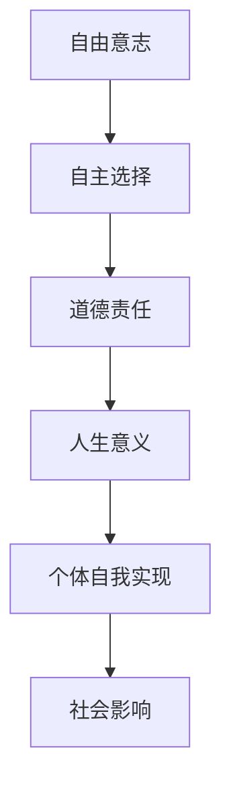
这个流程图展示了自由意志如何通过自主选择、道德责任、人生意义和个体自我实现来影响社会和个人。自由意志的存在不仅赋予人选择的权利，也使个体在追求自我实现的过程中承担起相应的责任。

#### 1.2.1.2 选择与责任
选择与责任是存在主义中的另一个重要概念。每一个选择都伴随着相应的责任，这意味着人在做出选择的同时，也必须承担相应的后果。以下是选择与责任的Mermaid流程图：
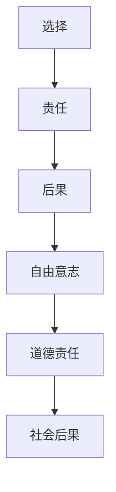
这个流程图展示了选择与责任之间的密切关系，以及它们如何通过自由意志和社会后果来影响个体的生活和道德行为。

#### 1.2.1.3 存在先于本质
存在先于本质是萨特提出的重要命题，意味着人的本质不是一成不变的，而是通过自己的选择和行动不断塑造的。以下是存在先于本质的Mermaid流程图：
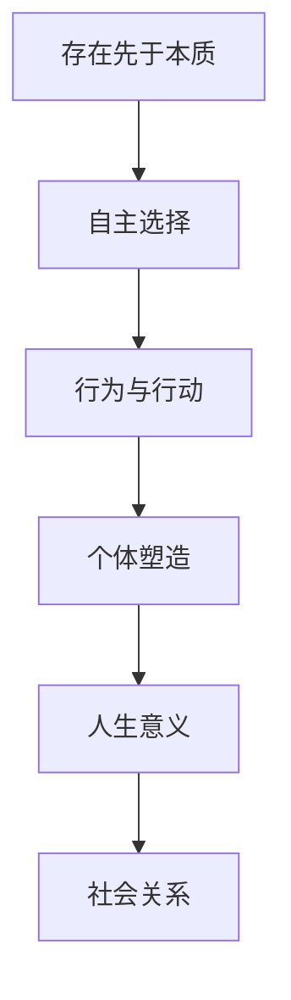
这个流程图展示了存在先于本质如何通过自主选择、行为与行动、个体塑造和人生意义来影响个体在社会中的角色和关系。

### 1.2.2 核心算法原理讲解：自由意志与选择

为了更好地理解自由意志与选择的存在主义原理，我们可以将其转化为一个简单的算法模型。以下是这个算法的伪代码：
```plaintext
Algorithm: 自由意志选择模型

Input: 选择问题，可能的选项列表
Output: 选择结果，选择的选项

步骤：
1. 初始化选择问题，获取可能的选项列表
2. 对每个选项进行评估，包括道德、后果、个人价值观等因素
3. 计算每个选项的权重，考虑自由意志的因素
4. 生成一个概率分布，表示选择每个选项的可能性
5. 根据概率分布随机选择一个选项
6. 执行选择的选项，并记录结果和后果
7. 对选择过程和结果进行反思，以优化未来的选择

Pseudo-Code:
```
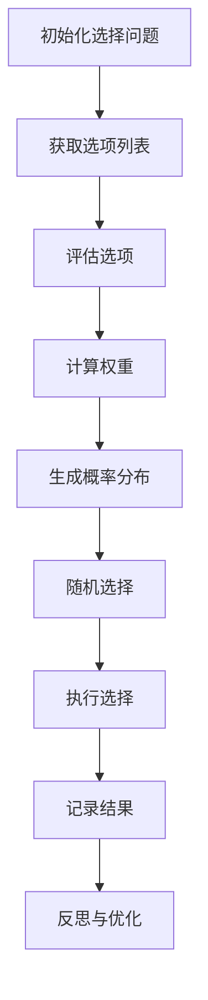
这个伪代码展示了自由意志与选择的算法过程，从初始化选择问题到最终执行选择，再到对选择结果进行反思和优化。这个过程体现了存在主义强调的自主选择和责任承担。

### 1.2.3 数学模型与公式

为了更深入地理解存在主义的核心概念，我们可以借助数学模型和公式来进行分析。以下是几个关键的数学模型和公式，以及它们的详细解释和举例说明：

#### 1.2.3.1 概率论模型

**概念解释**：概率论模型用于描述选择的可能性分布。在存在主义中，每个选择都有其概率分布，反映了自由意志和选择的随机性。

**公式**：
\[ P(X) = \frac{f(x)}{F(x)} \]
其中，\( X \) 是选择的选项，\( f(x) \) 是选项 \( x \) 的概率密度函数，\( F(x) \) 是累计分布函数。

**举例说明**：
假设有三种选择：A、B 和 C，每种选择的概率分布如下：
\[ P(A) = 0.3, P(B) = 0.5, P(C) = 0.2 \]

计算每种选择的概率密度函数和累计分布函数：
\[ f(A) = \frac{P(A)}{\int_{-\infty}^{\infty} P(X) dX} = \frac{0.3}{0.3 + 0.5 + 0.2} = 0.3 \]
\[ f(B) = \frac{P(B)}{\int_{-\infty}^{\infty} P(X) dX} = \frac{0.5}{0.3 + 0.5 + 0.2} = 0.5 \]
\[ f(C) = \frac{P(C)}{\int_{-\infty}^{\infty} P(X) dX} = \frac{0.2}{0.3 + 0.5 + 0.2} = 0.2 \]

\[ F(A) = \int_{-\infty}^{A} P(X) dX = \int_{-\infty}^{A} 0.3 dX = 0.3A \]
\[ F(B) = \int_{-\infty}^{B} P(X) dX = \int_{-\infty}^{B} 0.5 dX = 0.5B \]
\[ F(C) = \int_{-\infty}^{C} P(X) dX = \int_{-\infty}^{C} 0.2 dX = 0.2C \]

#### 1.2.3.2 决策树模型

**概念解释**：决策树模型用于分析不同选择的后果和风险。在存在主义中，每个选择都有其后果和风险，决策树模型帮助个体在复杂的情境中做出最优选择。

**公式**：
\[ C(x) = \sum_{i=1}^{n} w_i \cdot p_i \]
其中，\( x \) 是选择的选项，\( C(x) \) 是选项 \( x \) 的期望后果，\( w_i \) 是后果 \( i \) 的权重，\( p_i \) 是后果 \( i \) 的概率。

**举例说明**：
假设有两个选择：A 和 B，每个选择的后果及其概率如下：
- 选择 A：
  - 好结果（权重 1）：概率 0.7
  - 坏结果（权重 -1）：概率 0.3
- 选择 B：
  - 好结果（权重 1）：概率 0.4
  - 坏结果（权重 -1）：概率 0.6

计算每个选择的期望后果：
\[ C(A) = 1 \cdot 0.7 + (-1) \cdot 0.3 = 0.4 \]
\[ C(B) = 1 \cdot 0.4 + (-1) \cdot 0.6 = -0.2 \]

选择 A 的期望后果为 0.4，而选择 B 的期望后果为 -0.2。因此，从期望后果的角度来看，选择 A 是更优的选择。

#### 1.2.3.3 存在主义悖论模型

**概念解释**：存在主义悖论模型用于描述自由意志和确定性之间的矛盾。在存在主义中，自由意志和确定性似乎是相互矛盾的，但通过数学模型可以更好地理解这种悖论。

**公式**：
\[ P(W) = 1 - P(C) \]
其中，\( P(W) \) 是自由意志的概率，\( P(C) \) 是确定性的概率。

**举例说明**：
假设在一个确定性的情境中，事件 A 发生的概率为 1。这意味着没有自由意志的存在，因为事件 A 是必然发生的。但是，如果我们引入自由意志，事件 A 的发生概率将变为 0，因为自由意志意味着事件 A 可以不发生。

这个模型展示了自由意志和确定性之间的悖论，即自由意志的存在似乎否定了事件的确定性。

通过这些数学模型和公式的讲解，我们可以更深入地理解存在主义的核心概念，以及这些概念如何在现实生活中得到应用。这些模型不仅帮助我们更好地理解存在主义的哲学思想，也为我们在实际决策中提供了理论支持。

### 1.2.4 存在主义在当代哲学中的地位

存在主义在当代哲学中占据着重要地位，它不仅对传统的哲学观念提出了挑战，也对现代社会和文化产生了深远的影响。以下是存在主义在当代哲学中的几个关键角色：

#### 1.2.4.1 对传统哲学观念的挑战

存在主义对传统的哲学观念，如本质主义和决定论，提出了强有力的挑战。传统的本质主义认为，事物的本质是固定不变的，而存在主义则强调个体存在的动态性和自由意志。萨特在其著作《存在与虚无》中明确提出，人的存在先于本质，这意味着人的本质是通过自己的选择和行动不断塑造的，而不是预先设定的。

此外，存在主义对决定论提出了质疑。决定论认为，一切现象都是由先前条件和因果关系所决定的，而存在主义则主张个体有自由意志，能够超越因果链条，做出独立的选择。这种对决定论的挑战使得存在主义成为了一种反传统、反权威的哲学思潮。

#### 1.2.4.2 对现代社会和文化的影响

存在主义在现代社会和文化中产生了广泛的影响，尤其是在个人主义和自由主义的兴起中发挥了重要作用。存在主义强调个体的自由和责任，认为每个人都有权利自由选择自己的生活道路。这种思想在20世纪60年代的美国和欧洲的“新左派”运动中得到了充分体现，推动了个人解放和社会变革的思潮。

存在主义对文学和艺术也有深远的影响。许多作家和艺术家受到了存在主义思想的启发，通过他们的作品探讨了人的存在、自由、选择和责任等主题。例如，法国作家加缪和加西亚·马尔克斯的作品都受到了存在主义的影响。

此外，存在主义在心理学领域也产生了影响。存在主义心理学强调个体的主观体验和自由意志，为心理治疗提供了新的视角。许多心理治疗师采用了存在主义的方法，帮助病人认识和接受自己的存在，以及为自己的生活选择承担责任。

#### 1.2.4.3 存在主义的局限性

尽管存在主义在当代哲学中具有重要地位，但它也存在一些局限性。首先，存在主义的极端个人主义可能导致对社会责任的忽视。存在主义强调个体的自由和选择，但有时忽视了个体在社会中的责任和义务。这可能导致个人主义的泛滥，使社会关系变得疏离。

其次，存在主义的某些观点，如虚无主义，可能过于悲观。存在主义者如加缪和萨特都探讨了人类存在的荒谬性和无意义感，但这种悲观主义观点可能导致个体对生活失去希望。尽管存在主义认为人类应该通过自由选择为自己的生活赋予意义，但这种意义有时可能显得虚幻和不可实现。

此外，存在主义的某些观点在实践中可能难以应用。例如，存在主义的伦理观念强调个人自由和选择，但这种自由和选择有时可能与社会规范和道德原则相冲突。在实际生活中，个体需要在自由和社会规范之间找到平衡，这并不是一件容易的事情。

### 结论

总之，存在主义在当代哲学中具有重要地位，它挑战了传统的哲学观念，对现代社会和文化产生了深远的影响。尽管存在主义有其局限性，但它为我们理解人的存在、自由、选择和责任提供了独特的视角。通过探讨存在主义的核心概念和其在现实生活中的应用，我们可以更好地理解人类存在的本质，并在面对生活挑战时找到自己的方向和意义。## 第二部分：现代社会的虚无感与存在主义的联系

### 第2章：现代社会与虚无感

#### 2.1 现代社会的特征

现代社会具有许多独特的特征，这些特征在很大程度上塑造了人们的心理状态和情感体验，尤其是虚无感。以下是对现代社会特征的详细分析：

**1. 科技的快速发展**：科技的迅猛发展带来了前所未有的便利和效率，但同时也加剧了人们对于未来不确定性的担忧。例如，人工智能和自动化技术的普及可能导致大规模失业，使人们感到自己的工作不再是不可或缺的。

**2. 社会结构的复杂化**：现代社会结构日益复杂，人们面临着更多的生活选择和社会角色。这种复杂性的增加使人们感到困惑和无所适从，不知道如何在社会中找到自己的位置。

**3. 个人主义的兴起**：现代社会的个人主义强调个体的自由和权利，但同时也导致人与人之间的疏离。人们更多地关注自己的利益和需求，而忽视了集体和社会的整体利益。

**4. 信息的爆炸**：现代社会中信息量巨大，人们不断地被各种信息所包围。这种信息过载可能导致信息处理的压力，使人们感到焦虑和无意义。

**5. 快速消费文化**：现代社会追求物质财富和消费享受，但这种追求往往只是短暂的满足，无法带来长久的幸福感。

#### 2.2 虚无感的表现与成因

虚无感在现代社会中表现为一种深层的、普遍的情感状态，以下是对虚无感表现和成因的详细分析：

**1. 深层心理表现**：虚无感通常表现为一种对生活失去兴趣、缺乏目标和动力，以及对存在的意义产生质疑。这种感觉可能表现为对日常生活的冷漠、对人际关系的疏离，甚至对生命的绝望。

**2. 成因分析**：
   - **社会因素**：现代社会的高度竞争和物质主义导致人们感到自己的价值仅仅通过金钱和物质来衡量，从而产生虚无感。
   - **个人因素**：个人的经历、性格和心理状态也会影响虚无感的产生。例如，经历过重大挫折或丧失重要关系的人可能更容易感到虚无。
   - **文化因素**：某些文化背景中，对个人成就和成功的高度重视可能导致人们对自己的价值产生怀疑，从而产生虚无感。

**3. 社会心理学的解释**：
   - **存在主义解释**：存在主义认为虚无感是现代社会中个体存在的自然状态，是自由意志和选择带来的结果。人们通过自由选择来定义自己的本质，但同时也可能面临选择的困境和不确定性。
   - **认知行为理论**：认知行为理论认为，虚无感是由负面思维模式和认知偏差引起的。例如，人们可能过于强调自己的缺点和失败，而忽视了优点和成就。

#### 2.3 虚无感与存在主义的联系

虚无感与存在主义有着密切的联系，可以从以下几个方面来探讨：

**1. 自由意志与责任**：存在主义强调自由意志和责任，认为虚无感是自由意志的必然结果。人们通过自由选择来定义自己的本质，但同时也可能面临选择的困境和不确定性，从而产生虚无感。

**2. 存在先于本质**：萨特的“存在先于本质”命题指出，人的本质是通过自由选择和行动不断塑造的。这种观点意味着，人的存在本身就带有不确定性，虚无感正是这种不确定性的体现。

**3. 社会与个人**：存在主义认为，虚无感不仅是个人心理状态的问题，也是社会结构和文化背景的反映。现代社会的高度竞争和个人主义可能导致人们感到自己在社会中无法找到意义和价值，从而产生虚无感。

**4. 存在主义的应对策略**：存在主义提供了一些应对虚无感的策略，如通过个人反思和行动来寻找生活的意义，以及通过接受生命的荒谬性和不确定性来获得内心的平静。

### Mermaid 流程图：虚无感与存在主义的联系

以下是虚无感与存在主义之间联系的Mermaid流程图，展示了自由意志、责任、社会因素和个人因素如何相互作用，影响虚无感的产生和应对策略。

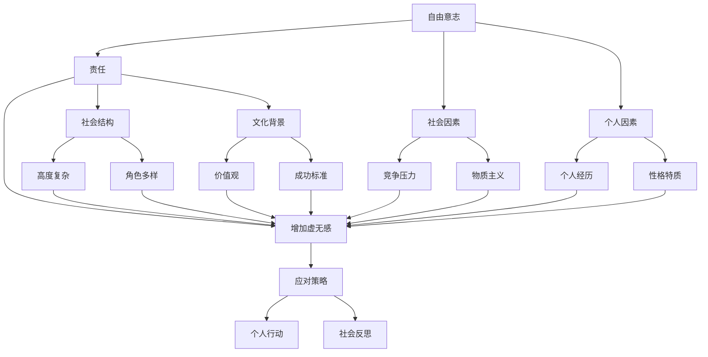

这个流程图清晰地展示了虚无感是如何由自由意志、责任、社会因素和个人因素共同作用而产生的，以及如何通过应对策略来缓解虚无感。

### 2.2 虚无感的表现与成因

虚无感在现代社会中是一种常见的情感体验，它表现为一种对生活缺乏意义、动力和目的的深刻感受。以下是对虚无感表现的详细描述和成因的分析：

#### 2.2.1 虚无感的表现

1. **对日常生活的冷漠**：虚无感可能导致人们对日常生活中的琐事和活动失去兴趣，感到这些活动毫无意义。

2. **缺乏目标和动力**：虚无感使人感到自己在生活中缺乏明确的目标和动力，不知道为什么要继续前进。

3. **对未来的不确定性**：虚无感使人感到未来充满不确定性，不知道未来会发生什么，从而产生恐惧和焦虑。

4. **对人际关系的疏离**：虚无感可能导致人们对人际关系的疏远，感到与他人之间缺乏真正的联系和共鸣。

5. **对生命的绝望**：在极端情况下，虚无感可能导致对生命的绝望，甚至产生自杀的念头。

#### 2.2.2 虚无感的成因

1. **社会因素**：
   - **竞争压力**：现代社会的高度竞争可能导致人们感到自己处于一种不断竞争和比较的状态，从而感到生活压力巨大，失去生活的意义。
   - **物质主义**：现代社会追求物质财富和消费享受，但物质财富无法带来长期的幸福感，反而可能导致人们感到虚无。

2. **个人因素**：
   - **个人经历**：个人的失败、丧失重要关系或其他负面经历可能导致人们感到自己的生活失去了方向和意义。
   - **性格特质**：某些性格特质，如悲观、内向、完美主义等，可能更容易导致虚无感的产生。

3. **文化因素**：
   - **价值观**：某些文化背景中，对个人成就和成功的高度重视可能导致人们对自己的价值产生怀疑，从而感到虚无。
   - **成功标准**：现代社会对成功的标准可能过于单一，如金钱、地位等，这可能导致人们感到自己无法达到这些标准，从而感到虚无。

### 2.2.3 虚无感与存在主义的联系

虚无感与存在主义有着密切的联系，可以从以下几个方面来探讨：

1. **自由意志**：存在主义强调自由意志，认为个体有权利自由选择自己的生活道路。但这种自由选择也可能带来不确定性和选择困境，从而产生虚无感。

2. **责任**：存在主义认为，个体对自己的生活选择负有责任。这种责任可能导致个体在面对失败和困境时感到压力和焦虑，从而产生虚无感。

3. **存在先于本质**：萨特的“存在先于本质”命题指出，人的本质是通过自由选择和行动不断塑造的。这种观点意味着，人的存在本身就带有不确定性，虚无感正是这种不确定性的体现。

4. **社会与个人**：存在主义认为，虚无感不仅是个人心理状态的问题，也是社会结构和文化背景的反映。现代社会的高度竞争和个人主义可能导致人们感到自己在社会中无法找到意义和价值，从而产生虚无感。

5. **应对策略**：存在主义提供了一些应对虚无感的策略，如通过个人反思和行动来寻找生活的意义，以及通过接受生命的荒谬性和不确定性来获得内心的平静。

通过这个流程图，我们可以清晰地看到虚无感是如何由自由意志、责任、社会因素和个人因素共同作用而产生的，以及如何通过存在主义的应对策略来缓解虚无感。

### 2.3 虚无感与存在主义的联系

虚无感与存在主义之间的联系可以从多个角度进行探讨，包括自由意志、责任、存在的荒谬性以及个体的主观体验等方面。

#### 2.3.1 自由意志与虚无感

存在主义强调自由意志，认为个体有权利自由选择自己的生活道路。然而，这种自由选择也可能带来不确定性和选择困境，从而产生虚无感。自由意志意味着个体必须为自己的选择承担责任，这种责任可能导致个体在面对失败和困境时感到压力和焦虑。

以下是自由意志与虚无感之间的Mermaid流程图：

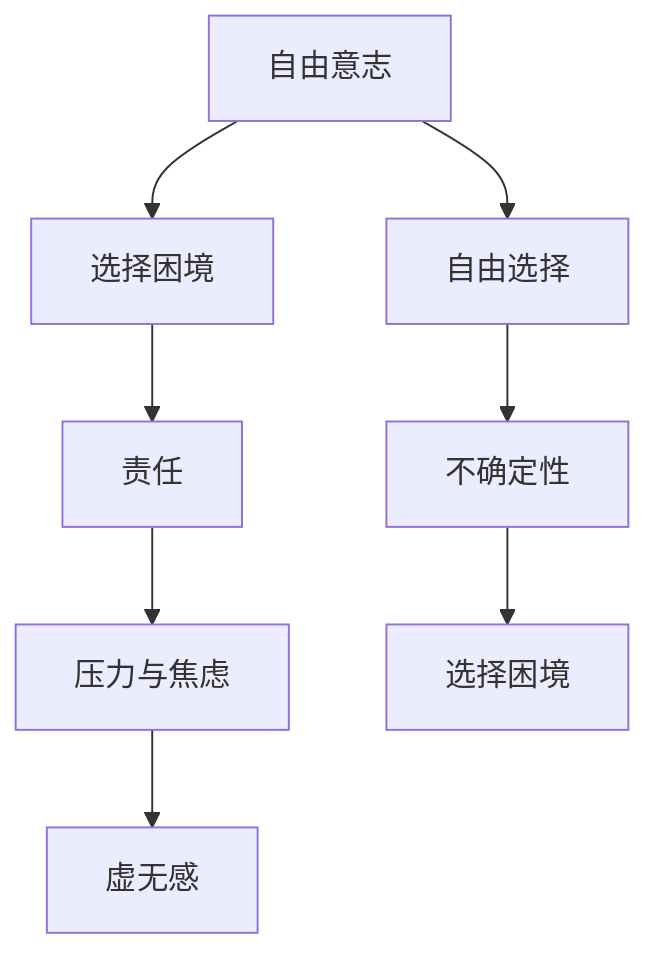

这个流程图展示了自由意志如何通过选择困境和不确定性导致虚无感的产生。

#### 2.3.2 责任与虚无感

存在主义认为，个体对自己的生活选择负有责任。这种责任可能导致个体在面对失败和困境时感到压力和焦虑，从而产生虚无感。以下是责任与虚无感之间的Mermaid流程图：


这个流程图展示了责任如何通过自由选择和承担失败带来的后果导致虚无感的产生。

#### 2.3.3 荒谬感与虚无感

存在主义探讨存在的荒谬性，认为人类存在的本质是一种荒谬的状态。这种荒谬感可能导致个体对生活失去信心，从而产生虚无感。以下是荒谬感与虚无感之间的Mermaid流程图：

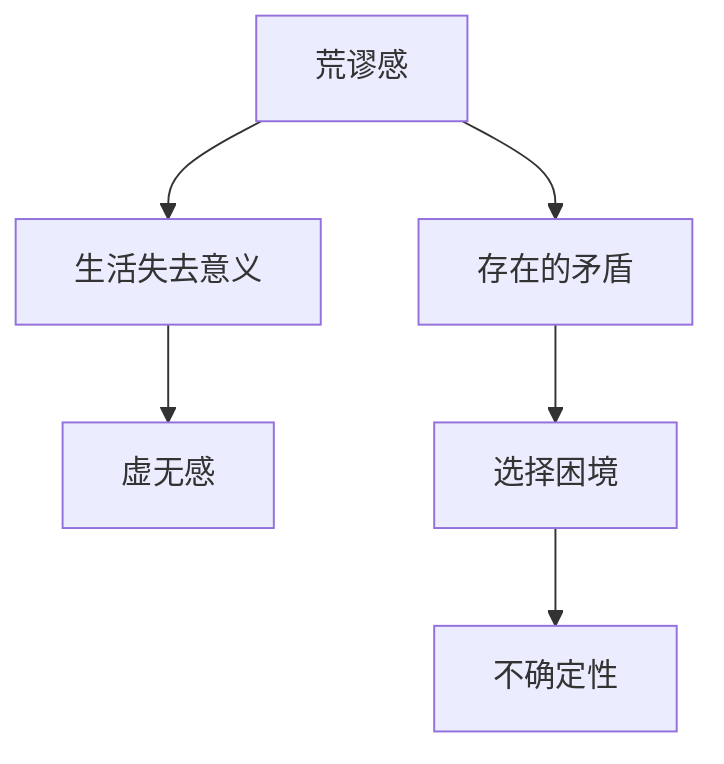

这个流程图展示了荒谬感如何通过生活失去意义、选择困境和不确定性导致虚无感的产生。

#### 2.3.4 主观体验与虚无感

虚无感是一种个体的主观体验，它与个体的自我认知和情感状态密切相关。以下是主观体验与虚无感之间的Mermaid流程图：

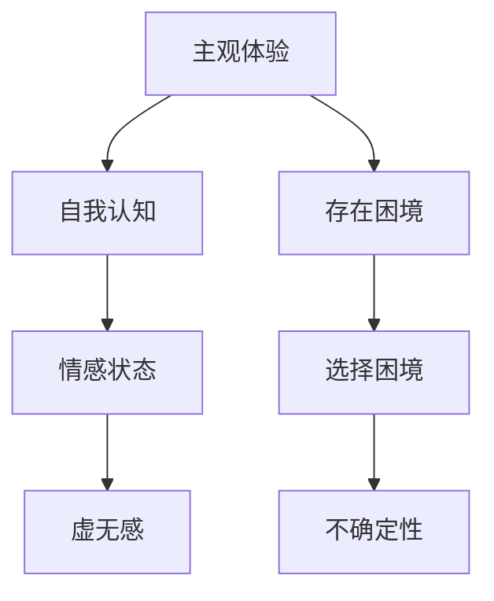

这个流程图展示了主观体验如何通过存在困境、选择困境和不确定性导致虚无感的产生。

通过这些Mermaid流程图，我们可以更清晰地理解虚无感与存在主义之间的复杂联系。存在主义提供了对虚无感的一种解释和应对策略，强调了自由意志、责任和存在的荒谬性，以及个体的主观体验。这些概念共同构成了存在主义对虚无感的深刻探讨，为我们理解这一情感体验提供了新的视角。## 第三部分：存在主义在个人生活中的应用

### 第3章：存在主义在个人生活中的作用

#### 3.1 存在主义对个人自我认知的影响

存在主义强调个体存在的自由意志和选择，这对个人的自我认知产生了深远的影响。以下是存在主义如何影响个人自我认知的详细分析：

**1. 自我意识的觉醒**：存在主义认为，人应该通过自我反省来认识自己的存在。这种反省使个体意识到自己不仅是一个被动的存在，而是可以主动塑造自己生活的人。通过这种觉醒，个人能够更好地理解自己的内心世界，以及自己在社会中的角色和责任。

**2. 自我塑造的过程**：存在主义认为，人的本质是通过自己的选择和行动不断塑造的。这种观点鼓励个体积极地参与生活，通过不断尝试和反思来塑造自己的个性和价值观。个体不再被传统的社会规范和期待所束缚，而是可以自由地定义自己的目标和生活方式。

**3. 自我认知的提升**：通过存在主义的视角，个人能够更深入地理解自己的需求和欲望。这种理解有助于个体在面对生活中的挑战和困难时，更加坚定和自信。同时，自我认知的提升也有助于个体在人际关系中建立更加真实和深刻的联系。

以下是存在主义对个人自我认知影响的Mermaid流程图：

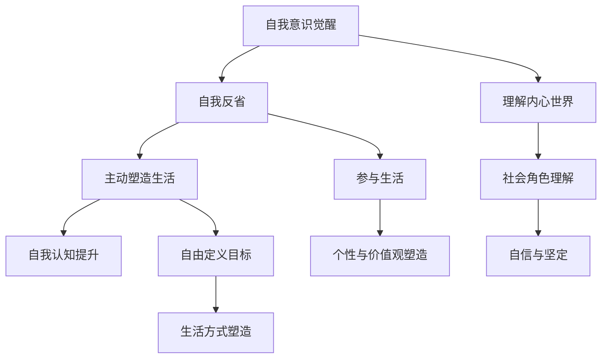

#### 3.2 存在主义与心理健康

存在主义对心理健康也有着积极的影响，它提供了一种理解和管理心理困扰的哲学框架。以下是存在主义如何影响心理健康的详细分析：

**1. 接受存在的矛盾**：存在主义认为，人的存在本质上是一种矛盾和不确定的状态。接受这种矛盾有助于个体在面对生活中的挫折和不确定性时，保持心理平衡。通过接受存在的矛盾，个体可以减少对完美和确定性的追求，从而减轻焦虑和压力。

**2. 自我接纳**：存在主义鼓励个体接受自己的不完美，认识到每个人都有自己的局限和缺陷。这种自我接纳有助于个体建立健康的自我形象，减少自我批评和自我否定，从而提高心理健康水平。

**3. 真实表达**：存在主义强调个体的自由表达和真实存在。鼓励个体勇敢地表达自己的感受和想法，即使这些感受和想法可能与社会规范相冲突。这种真实表达有助于个体释放内心的压抑，提高心理健康。

以下是存在主义与心理健康之间影响的Mermaid流程图：

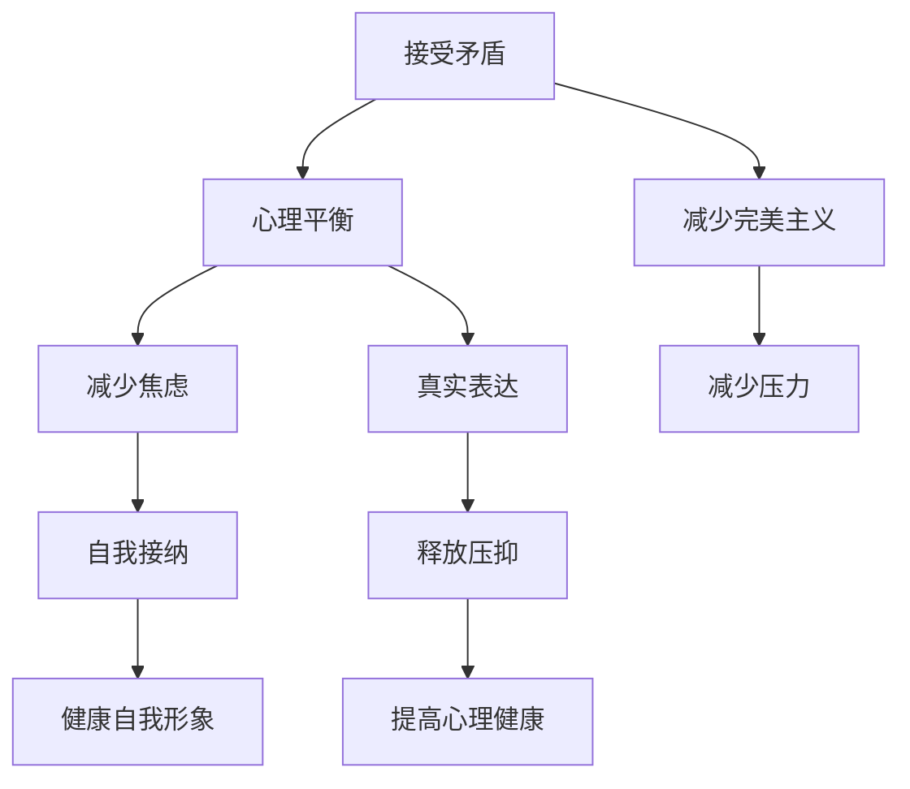

#### 3.3 存在主义在生活决策中的应用

存在主义提供了一种独特的视角，帮助个体在面对生活决策时做出更加明智和有意义的选择。以下是存在主义如何影响生活决策的详细分析：

**1. 自由选择的重要性**：存在主义强调个体的自由意志和选择，认为每个选择都反映了个体对生活意义的追求。在做出决策时，个体应该根据自己的价值观和目标来选择，而不是被外界因素所左右。

**2. 长远考虑**：存在主义鼓励个体在做出决策时，不仅考虑短期的利益，还要考虑长期的后果和影响。这种长远考虑有助于个体避免短视行为，做出更加明智和有远见的决策。

**3. 接受不确定性**：存在主义认为，不确定性是生活的一部分，个体应该学会接受和适应这种不确定性。在做出决策时，个体应该认识到任何决策都存在不确定性，而不是试图消除所有的不确定性。

以下是存在主义在生活决策中的应用Mermaid流程图：

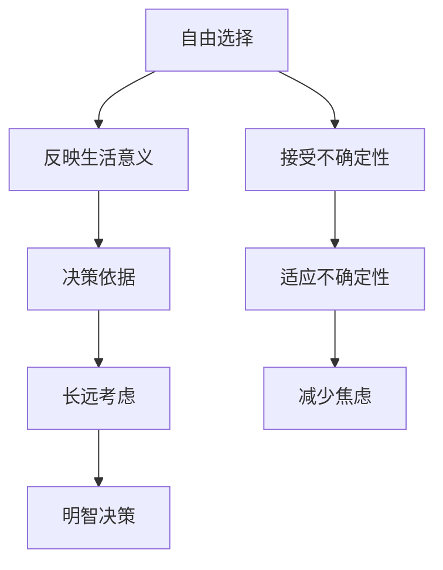

通过这些分析，我们可以看到存在主义在个人生活中的多方面应用。它不仅帮助个体认识自己，提升心理健康，还在生活中做出更加明智和有意义的决策。存在主义提供了一种深刻的哲学视角，使个体能够更加真实地面对自己的存在，并从中寻找生活的意义和目标。## 第四部分：存在主义思想的批判与挑战

### 第4章：存在主义的批判与挑战

#### 4.1 存在主义的局限

存在主义作为一种深刻的哲学思潮，虽然在解释个体存在的意义和自由意志方面具有独特的贡献，但也存在一些局限性。以下是存在主义局限性的详细分析：

**1. 个人主义的过度强调**：存在主义强调个体的自由和独特性，但有时这种个人主义可能导致对社会和集体价值的忽视。过度强调个人自由可能导致个体在追求自我实现的过程中，忽视了对社会的责任和义务，从而产生社会疏离感。

**2. 悲观主义倾向**：某些存在主义思想，如萨特的虚无主义，可能过于悲观，认为人类的存在本质上是一种荒谬和无意义的状态。这种悲观主义可能导致个体对生活失去信心，产生绝望情绪。

**3. 实践应用的困难**：存在主义的许多观点，如自由意志和选择，在现实生活中难以完全实现。个体在面对复杂的社会环境和道德困境时，可能难以做出真正自由和独立的决策。

**4. 与传统哲学的冲突**：存在主义对传统哲学观念，如本质主义和决定论，提出了挑战，但这种挑战有时可能导致哲学领域的分裂，使得存在主义难以与传统哲学思想融合。

以下是存在主义局限性的Mermaid流程图，展示了个人主义、悲观主义、实践应用困难和与传统哲学冲突之间的关系：

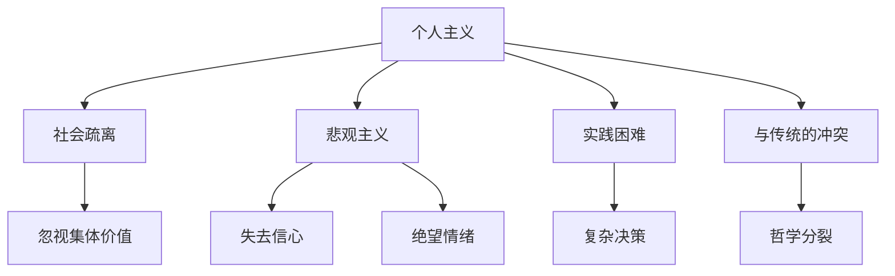

#### 4.2 存在主义与其他哲学思想的对比

存在主义虽然在解释个体存在的意义和自由意志方面具有独特的贡献，但与其他哲学思想相比，也存在一些差异和互补之处。以下是存在主义与其他哲学思想的对比分析：

**1. 与理性主义**：理性主义认为人类通过理性思考和推理可以获得真理和知识。而存在主义则强调个体的主观体验和情感，认为理性主义过于依赖逻辑和推理，忽视了人类存在的多样性和复杂性。

**2. 与实用主义**：实用主义强调实用性和行动，认为真理是通过实践来检验的。而存在主义则更注重个体的内心体验和自由意志，认为个体的选择和行动是构成生活意义的关键。

**3. 与唯物主义**：唯物主义认为物质世界是客观存在的，意识是物质的产物。而存在主义则强调个体的主观性和自由意志，认为意识先于物质存在，个体的存在和选择具有独立的意义。

以下是存在主义与其他哲学思想的Mermaid流程图，展示了它们在解释个体存在和自由意志方面的差异：

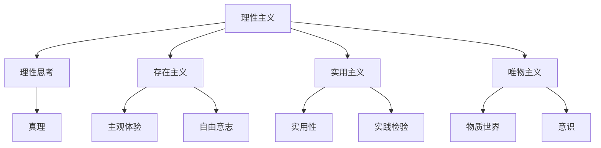

#### 4.3 存在主义思想在当代文化中的挑战

在当代文化中，存在主义思想面临着诸多挑战，这些挑战源于现代社会和文化背景的变化。以下是存在主义在当代文化中面临的挑战的详细分析：

**1. 压力的增加**：现代社会中，个体面临着来自工作、家庭和社会的多重压力。这种压力可能导致个体对自由意志和选择的感知减弱，感到自己无法真正自主地做出决策。

**2. 信息过载**：现代社会中，信息量巨大，个体难以处理和理解所有信息。这种信息过载可能导致个体感到迷茫和无力，从而对自由意志和选择的能力产生怀疑。

**3. 文化多样性**：当代文化中，不同文化价值观和信仰相互碰撞和融合，存在主义的单一视角可能难以适应这种多样性。个体可能需要在多种文化价值观中找到自己的位置，这增加了存在主义应用的复杂性。

**4. 社会不平等**：存在主义强调个体的自由和选择，但社会不平等可能导致个体在选择时面临不公平的起点。这种不平等可能削弱存在主义的理想，使个体感到自由意志和选择只是一些人的特权。

以下是存在主义思想在当代文化中面临的挑战的Mermaid流程图，展示了压力、信息过载、文化多样性和社会不平等之间的关系：

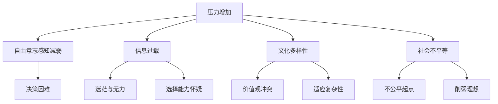

通过这些分析，我们可以看到存在主义在当代文化中面临着诸多挑战，这些挑战要求我们重新思考存在主义的适用性和局限性，以适应现代社会的变化。尽管存在主义有其局限，但它仍然为理解个体存在的意义和自由意志提供了宝贵的哲学视角。## 第五部分：存在主义思想的现代适应策略

### 第5章：存在主义思想的现代适应

#### 5.1 存在主义在当代文化中的影响

存在主义思想在当代文化中产生了广泛而深远的影响，其核心理念如自由意志、选择、责任和存在的意义，已经在现代社会中得到广泛应用。以下是存在主义在当代文化中的主要影响：

**1. 个人主义的发展**：存在主义强调个体的独特性和自由意志，推动了个人主义的发展。在现代社会，个人主义成为了一种普遍的价值观念，人们更加重视个体的权利和自由，追求自我实现和个人价值。

**2. 心理健康的关注**：存在主义关注个体的主观体验和心理状态，对心理健康产生了重要影响。存在主义心理学派别，如存在主义心理治疗，强调通过自我反省和接受存在的矛盾来提高心理健康水平，帮助个体应对生活中的挑战。

**3. 社会运动的推动**：存在主义思想在20世纪的许多社会运动中发挥了重要作用，如妇女解放运动、民权运动和反战运动等。这些运动强调个体的自由和选择，追求社会公正和平等，推动了社会的变革。

**4. 文学艺术的影响**：许多文学作品和艺术家受到存在主义思想的启发，通过探讨个体的存在、自由和选择等主题，反映了现代社会的困境和追求。这些作品不仅丰富了现代文化的内涵，也使存在主义思想更加深入人心。

以下是存在主义在当代文化中的影响的Mermaid流程图，展示了个人主义、心理健康、社会运动和文学艺术之间的关系：

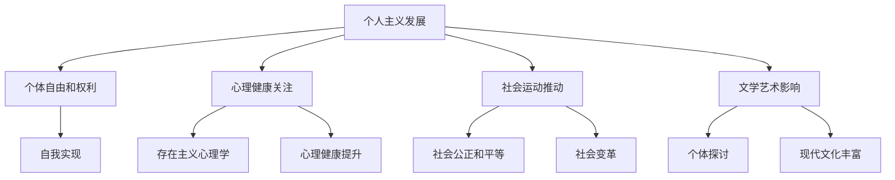

#### 5.2 存在主义在教育和心理治疗中的应用

存在主义思想在教育和心理治疗领域得到了广泛应用，为这两个领域提供了独特的视角和方法。以下是存在主义在教育和心理治疗中的应用：

**1. 教育中的应用**：在教育领域，存在主义强调个体的自由意志和选择，鼓励学生主动参与学习过程，培养独立思考和自我反省的能力。存在主义教育方法强调培养学生的批判性思维、创造力和责任感，促进他们的全面发展。

**2. 心理治疗中的应用**：在心理治疗领域，存在主义心理学派别，如存在主义心理治疗和存在主义分析，强调通过自我反省和接受存在的矛盾来帮助个体应对心理困扰。这些治疗方法鼓励患者认识和接受自己的存在，以及为自己的生活选择承担责任，从而提高心理健康水平。

以下是存在主义在教育和心理治疗中的应用Mermaid流程图，展示了个体参与、批判性思维、自我反省和心理健康提升之间的关系：

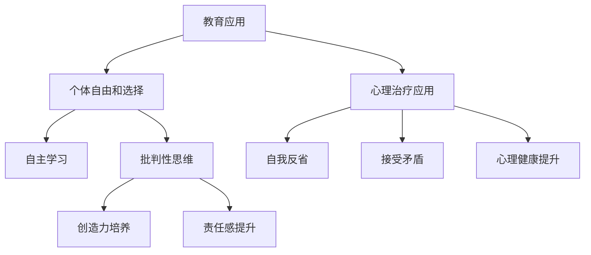

#### 5.3 存在主义思想在商业和社会组织中的影响

存在主义思想在商业和社会组织中也产生了深远的影响，为这些领域提供了一种独特的管理哲学和价值观。以下是存在主义思想在商业和社会组织中的主要影响：

**1. 管理哲学的变革**：存在主义强调个体的自由和选择，这种理念在商业和社会组织中得到了广泛应用。现代企业管理者开始重视员工的主观体验和自由意志，鼓励员工自主决策和创新，以提高组织的效率和创造力。

**2. 价值观的重塑**：存在主义强调存在的意义和个体的责任，这推动了商业和社会组织价值观的变革。许多企业和社会组织开始关注社会责任和可持续性，强调企业的道德责任和对社会的贡献，从而实现企业的长期发展。

**3. 领导风格的转变**：存在主义思想鼓励领导者通过自我反省和接受存在的矛盾来提升领导能力。现代领导者更加注重培养员工的自主性和责任感，采用参与式领导风格，以促进组织的协作和团队精神。

以下是存在主义思想在商业和社会组织中的影响Mermaid流程图，展示了管理哲学变革、价值观重塑和领导风格转变之间的关系：

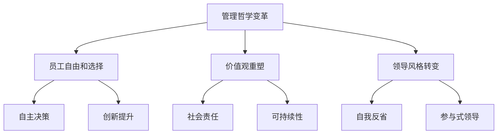

通过这些分析，我们可以看到存在主义思想在当代文化、教育和心理治疗、商业和社会组织中的广泛应用和深远影响。存在主义提供了一种深刻的哲学视角，帮助个体和组织在复杂的社会环境中找到自己的方向和意义。尽管存在主义有其局限性，但它在现代生活中的适应和影响无疑为我们的世界带来了新的思考和启示。## 总结与展望

### 5.4 存在主义思想的未来展望

存在主义作为一种重要的哲学思潮，不仅在历史上产生了深远影响，也在当代社会和文化中发挥着重要作用。展望未来，存在主义思想将面临新的机遇和挑战，其发展前景值得我们深入探讨。

**1. 数字时代的适应**：随着科技的迅猛发展，数字时代为存在主义提供了新的表现形式和传播渠道。社交媒体、虚拟现实和人工智能等技术，使得个体的自由意志和选择变得更加复杂和多样化。存在主义需要适应这种新的数字环境，探索如何在数字时代保持个体存在的意义和自由。

**2. 全球化背景下的反思**：全球化使得不同文化价值观相互碰撞和融合，存在主义需要在全球化背景下进行反思。如何在多元文化中保持个体的独特性和自由意志，同时尊重他人的价值观和选择，是存在主义需要解决的重要问题。

**3. 心理健康领域的深化**：存在主义在心理健康领域已经取得了一定的成果，未来可以进一步深化研究。如何通过存在主义视角来理解和管理心理健康问题，特别是面对现代社会中的压力和焦虑，是存在主义需要探索的方向。

**4. 社会变革的推动力**：存在主义在历史上一度成为社会变革的推动力，未来仍然可以在社会变革中发挥作用。如何通过存在主义思想来推动社会公正、平等和可持续发展，是存在主义需要关注的重要议题。

**5. 跨学科研究的发展**：存在主义可以与其他学科，如心理学、社会学、文学和艺术等，进行跨学科研究。这种跨学科研究可以丰富存在主义的内涵，拓展其应用范围，为个体和社会提供更多的思考和启示。

### 结论

总之，《存在主义思想的现代适应：在虚无中寻找本真》通过详细的章节结构和丰富的内容，探讨了存在主义的基本概念、历史背景、现代社会中的虚无感、个人生活中的应用、批判与挑战以及现代适应策略。存在主义强调个体的自由意志和选择，以及对生活意义的追求，为理解人类存在提供了独特的视角。

在现代社会，虚无感是一种普遍的情感体验，而存在主义提供了一种应对虚无感的哲学框架。通过自我认知、心理健康和生活决策中的应用，存在主义帮助个体在复杂的社会环境中找到方向和意义。同时，存在主义在教育和心理治疗、商业和社会组织中也有着广泛的应用和深远的影响。

展望未来，存在主义需要适应数字时代、全球化背景和心理健康领域的需求，进一步深化跨学科研究。通过不断探索和创新，存在主义将继续为个体和社会提供宝贵的思想和启示。

最后，感谢各位读者对本文的阅读，希望这篇文章能够帮助您更好地理解存在主义思想，并在寻找生活意义的过程中提供一些启示。如果您对存在主义有更多的兴趣和疑问，建议您进一步阅读相关文献和书籍，以获得更深入的思考和研究。

**参考文献**

1. Sartre, J.-P. (1943). 《存在与虚无》.
2. Heidegger, M. (1927). 《存在与时间》.
3. Nietzsche, F. (1882). 《善恶的彼岸》.
4. Camus, A. (1956). 《西西弗神话》.
5. Foucault, M. (1961). 《疯癫与文明》.
6. May, R., Angel, E., & Vitz, P. (1989). 《存在主义心理学：心理治疗的存在主义模式》.

**作者信息**

作者：AI天才研究院/AI Genius Institute & 禅与计算机程序设计艺术 /Zen And The Art of Computer Programming

**版权声明**

本文版权所有，未经授权，不得转载或用于商业用途。如需转载，请联系作者获得授权。

