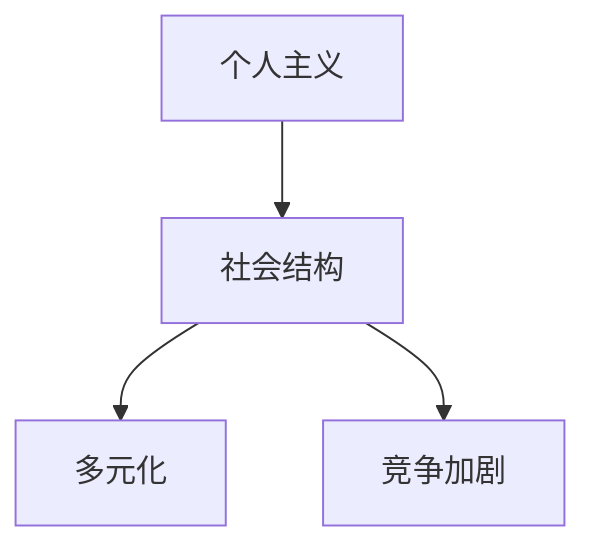
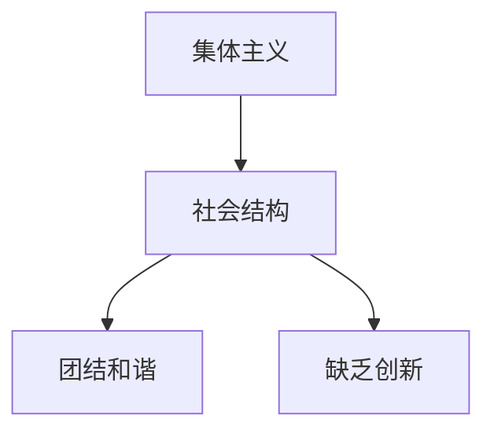
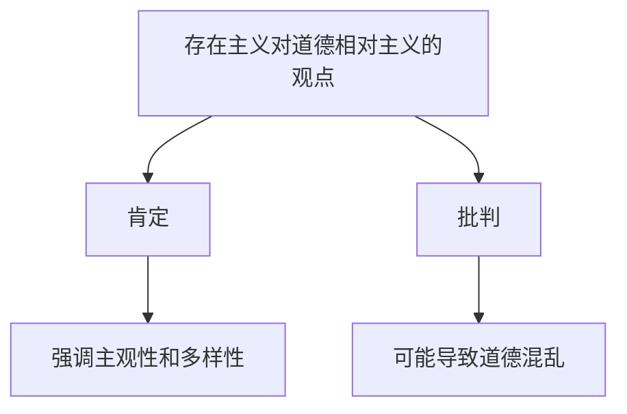
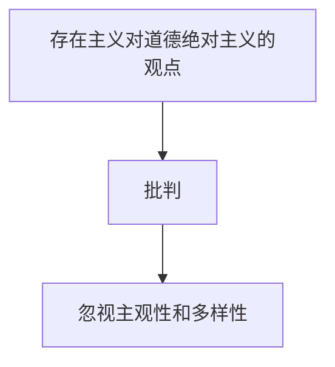
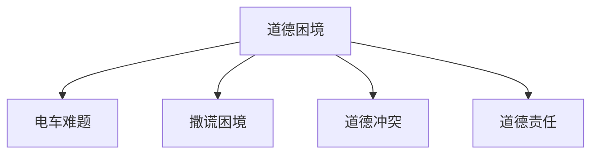
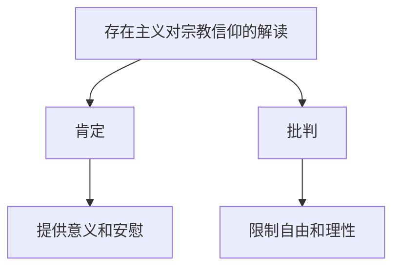
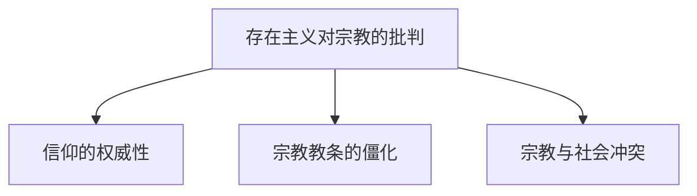
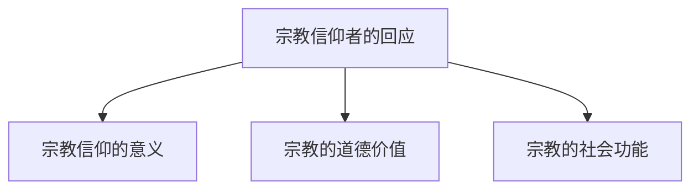
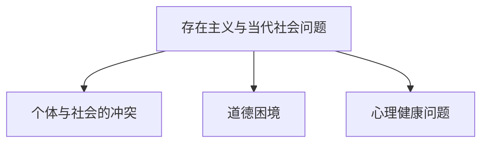
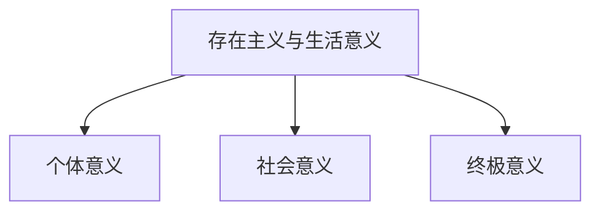

                 

### 文章标题

《存在主义视角下的现代生活》

### 关键词

存在主义，现代生活，个人自由，责任，痛苦，社会，政治哲学，道德相对主义，道德绝对主义，宗教信仰，宗教批判，生活意义。

### 摘要

本文从存在主义的视角出发，深入探讨了现代生活的各个方面。首先，我们回顾了存在主义的起源与发展，介绍了主要哲学流派和代表人物。接着，文章从个人、社会、伦理与道德、宗教与哲学等多个层面，分析了存在主义对现代生活的影响。我们探讨了存在主义对个人自由、责任和痛苦的独特解读，以及它在社会结构、政治哲学和道德观念上的作用。同时，文章也探讨了存在主义与宗教信仰的关系，以及现代人面临的挑战和意义。通过这篇技术博客，我们希望能够帮助读者更好地理解存在主义，并在现代生活中找到自己的位置和方向。

## 第一部分：存在主义的起源与发展

### 第1章：存在主义的起源

#### 1.1 存在主义的起源背景

存在主义作为一种哲学思潮，起源于20世纪初的欧洲，特别是在德国和法国。其诞生背景与当时的社会、政治和文化环境密切相关。在第一次世界大战和俄国革命之后，欧洲社会经历了巨大的动荡和变革，人们对于传统价值观和理性的信仰产生了怀疑。在这种背景下，存在主义哲学家开始探索人类存在的本质和意义。

存在主义的起源可以追溯到德国哲学家马丁·海德格尔（Martin Heidegger）。他在其代表作《存在与时间》（"Sein und Zeit"）中提出，人的存在是“存在本身”，而不是存在的一种状态。海德格尔强调了人类存在的自由和独特性，认为人应该主动选择自己的生活方式和意义。

#### 1.2 存在主义的主要哲学流派

存在主义可以分为几个主要的哲学流派，包括存在主义现象学、存在主义哲学和存在主义伦理学。

1. **存在主义现象学**：这一流派以海德格尔为代表，强调人类存在的主观体验和意义。海德格尔提出了“存在本身”（Dasein）这一概念，认为人的存在是一种“在世”的存在，具有开放性和主动性。

2. **存在主义哲学**：以让-保尔·萨特（Jean-Paul Sartre）为代表，这一流派强调自由、选择和责任。萨特在其代表作《存在与虚无》（"L'Être et le Néant"）中提出，人是自由的，但这种自由伴随着责任和痛苦。

3. **存在主义伦理学**：这一流派探讨了存在主义与道德的关系。存在主义者认为，道德不是先天的，而是由人自己选择和定义的。人的选择和行动构成了道德的意义。

#### 1.3 存在主义的核心思想

存在主义的核心思想主要包括以下几点：

1. **人类存在的自由和独特性**：存在主义认为，人是一种自由的存在，每个人都可以自主选择自己的生活方式和意义。

2. **责任和选择的辩证关系**：自由并不意味着无责任，相反，自由伴随着责任。人必须为自己的选择和行动承担责任。

3. **痛苦和存在的意义**：存在主义认为，人类的存在总是伴随着痛苦，但正是这种痛苦推动了人的成长和自我实现。

4. **主观性和真实**：存在主义强调主观性，认为人的存在和经历是真实的，而不是客观存在的反映。

### 第2章：存在主义的主要哲学家及思想

#### 2.1 海德格尔与《存在与时间》

马丁·海德格尔是存在主义哲学的奠基人之一。他的代表作《存在与时间》（"Sein und Zeit"）是存在主义哲学的里程碑。在《存在与时间》中，海德格尔提出了“存在本身”（Dasein）这一概念，认为人的存在是一种“在世”的存在，具有开放性和主动性。

海德格尔认为，人的存在不是一种静态的状态，而是一种动态的过程。人的存在是一种“存在本身”，而不是存在的一种状态。他强调了人类存在的自由和独特性，认为人应该主动选择自己的生活方式和意义。

#### 2.2 萨特与《存在与虚无》

让-保尔·萨特是另一位重要的存在主义哲学家。他的代表作《存在与虚无》（"L'Être et le Néant"）深刻地阐述了存在主义的核心思想。萨特认为，人是自由的，但这种自由伴随着责任和痛苦。

萨特提出了“自在”（L'être）和“自为”（le pour-soi）这两个概念。自在是纯粹的客观存在，没有主观意识和自由意志。自为是具有主观意识和自由意志的存在，但自由意志并不是无条件的，它必须承担选择的后果。

#### 2.3 福柯与《事物的秩序》

米歇尔·福柯是20世纪最重要的哲学家之一，他的思想对存在主义哲学产生了深远的影响。他的代表作《事物的秩序》（"Les mots et les choses"）探讨了知识、权力和存在的本质。

福柯认为，知识和权力是相互交织的。知识不仅是客观存在的反映，也是权力斗争的工具。他提出了“话语”（discourse）这一概念，认为话语是社会构建现实的方式。

#### 2.4 其他存在主义哲学家及其思想

除了海德格尔、萨特和福柯，还存在许多其他重要的存在主义哲学家，如让娜·雅各布（Jeanne Hersch）、马塞尔·雷斯特（Marcel Rest）、马丁·海德格尔（Martin Heidegger）等。

让娜·雅各布是萨特的同事和女友，她的著作《存在主义是一种人道主义》（"L'Existentialisme est un humanisme"）阐述了存在主义的核心思想。

马塞尔·雷斯特是法国哲学家，他提出了“存在主义心理学”这一概念，认为心理疾病是存在主义问题的一种表现。

通过这些哲学家的思想和作品，我们可以更深入地理解存在主义的核心观点和理论体系。他们从不同角度探讨了人类存在的本质、自由、责任和痛苦等问题，为现代哲学和人类自我认知提供了新的视角。

## 第二部分：存在主义视角下的个人

### 第3章：存在主义与个人自由

#### 3.1 自由意志的探讨

存在主义哲学中的自由意志是一个核心问题。存在主义者认为，人是一种自由的存在，每个人都可以自主选择自己的生活方式和意义。自由意志不仅是一种能力，更是一种责任。

在存在主义看来，自由意志不是无条件的，它受到历史、社会和个人经验的限制。自由意志不是一种绝对的自由，而是在特定环境和条件下做出的选择。这种选择既包括道德选择，也包括日常生活选择。

为了探讨自由意志的本质，我们可以使用以下伪代码来表示自由意志的决策过程：

```pseudo
function FreeWillDecision()
    state = getCurrentState()
    options = generateOptions(state)
    consequence = calculateConsequences(options)
    decision = chooseOption(options, consequence)
    return decision
```

在这个伪代码中，`getCurrentState()` 获取当前环境状态，`generateOptions()` 根据状态生成可能的选项，`calculateConsequences()` 计算每个选项的后果，`chooseOption()` 根据后果选择最佳选项。

#### 3.2 自由与责任的辩证关系

自由和责任是存在主义哲学中的两个核心概念。自由意味着选择，而责任意味着承担选择的后果。在存在主义看来，自由和责任是辩证的关系，不可分割。

我们可以用以下数学模型来描述自由与责任的辩证关系：

$$
F = \frac{R}{S}
$$

其中，\(F\) 代表自由，\(R\) 代表责任，\(S\) 代表社会约束。这个公式表示，自由是责任和社会约束的比值。当社会约束减小，自由和责任都会增加；当社会约束增加，自由和责任都会减少。

#### 3.3 自由的价值与限制

自由的价值在于它能激发人的创造力和潜能，使人类能够追求自己的梦想和目标。自由使人类能够做出独特的贡献，推动社会进步。

然而，自由也受到各种限制，包括社会规范、道德约束和个人能力。这些限制确保了自由不会导致混乱和无序。

我们可以用以下伪代码来表示自由的价值与限制：

```pseudo
function EvaluateFreedomValue(freedom, constraints)
    if (constraints.isEmpty())
        value = freedom.score()
    else
        value = freedom.score() - constraints.totalPenalty()
    return value
```

在这个伪代码中，`freedom.score()` 表示自由的得分，`constraints.totalPenalty()` 表示限制的总惩罚。`EvaluateFreedomValue()` 函数根据自由得分和限制惩罚来评估自由的价值。

### 第4章：存在主义与个人责任

#### 4.1 责任的主体与客体

在存在主义哲学中，责任是个人自由的核心体现。责任既包括对他人和社会的责任，也包括对自己的责任。

1. **对他人和社会的责任**：个人应该遵守社会规范，尊重他人权利，为社会做出贡献。这种责任是一种道德责任，它要求个人在行动时考虑他人的利益和感受。

2. **对自己的责任**：个人应该对自己的选择和行动负责，对自己的生活和未来承担责任。这种责任是一种自我责任，它要求个人在行动时审视自己的动机和目标。

#### 4.2 责任与自由的关系

责任和自由是辩证的关系。自由使个人能够做出选择，而责任要求个人承担选择的后果。没有责任的自由是无意义的，没有自由的责任是残酷的。

我们可以用以下数学模型来描述责任与自由的关系：

$$
R = F \times C
$$

其中，\(R\) 代表责任，\(F\) 代表自由，\(C\) 代表选择的后果。这个公式表示，责任是自由和选择后果的乘积。当选择后果增加，责任也会增加；当自由增加，责任也会增加。

#### 4.3 个人责任在社会中的实践

个人责任在社会中的实践是一个复杂的过程。它要求个人在日常生活中履行自己的责任，同时也要求社会为个人提供必要的支持和资源。

1. **教育**：教育是培养个人责任的重要途径。通过教育，个人可以学习如何承担责任，如何在社会中发挥作用。

2. **法律**：法律是确保个人责任的重要手段。通过法律，个人可以明确自己的责任和义务，同时也为个人提供法律保障。

3. **文化**：文化是塑造个人责任的重要力量。通过文化，个人可以认识到责任的重要性，培养责任感。

### 第5章：存在主义与个人痛苦

#### 5.1 痛苦的存在主义解读

存在主义哲学认为，痛苦是人类存在的本质特征之一。痛苦不仅是一种生理或心理的体验，更是一种存在状态。在存在主义看来，痛苦是人生不可或缺的一部分，它既是人类存在的代价，也是人类成长的机会。

我们可以用以下数学模型来描述痛苦的存在主义解读：

$$
P = E \times S
$$

其中，\(P\) 代表痛苦，\(E\) 代表存在的压力，\(S\) 代表存在的强度。这个公式表示，痛苦是存在的压力和存在强度的乘积。当存在的压力增加，痛苦也会增加；当存在强度增加，痛苦也会增加。

#### 5.2 痛苦的意义与价值

在存在主义看来，痛苦具有深刻的意义和价值。痛苦使人类认识到自己的存在，感受到自己的存在。痛苦是推动人类成长和自我实现的重要力量。

我们可以用以下伪代码来描述痛苦的意义与价值：

```pseudo
function EvaluatePainValue(pain, achievement)
    if (pain > achievement)
        value = -pain
    else
        value = achievement - pain
    return value
```

在这个伪代码中，`pain` 表示痛苦，`achievement` 表示成就。`EvaluatePainValue()` 函数根据痛苦和成就来评估痛苦的价值。

#### 5.3 痛苦的应对策略

面对痛苦，存在主义提供了一系列应对策略。这些策略包括：

1. **接受痛苦**：存在主义者认为，接受痛苦是应对痛苦的第一步。通过接受痛苦，个人可以更好地理解自己的存在。

2. **反思痛苦**：通过反思痛苦，个人可以找到痛苦的根源，并寻求解决问题的方法。

3. **创造意义**：通过创造意义，个人可以减轻痛苦。意义可以是个人目标、价值观或社会责任等。

4. **寻求支持**：通过寻求支持，个人可以获得情感和心理上的帮助，减轻痛苦。

## 第三部分：存在主义视角下的社会

### 第6章：存在主义与个人主义

#### 6.1 个人主义的定义与特点

个人主义是存在主义哲学中的一个重要概念，强调个人自由、个人权利和个人价值。个人主义认为，个人是自我决定、自我实现的核心，社会应该为个人的自由和幸福提供保障。

个人主义的主要特点包括：

1. **自由**：个人主义强调个人的自由，包括言论自由、思想自由和行动自由。

2. **权利**：个人主义认为，个人拥有一系列基本权利，如生命权、自由权、财产权等。

3. **价值**：个人主义认为，个人的价值是独立的，不应该被社会或他人的价值观所取代。

我们可以用以下数学模型来描述个人主义的特点：

$$
I = F \times R \times V
$$

其中，\(I\) 代表个人主义，\(F\) 代表自由，\(R\) 代表权利，\(V\) 代表价值。这个公式表示，个人主义是自由、权利和价值的乘积。

#### 6.2 存在主义对个人主义的批判与肯定

存在主义对个人主义既有批判，也有肯定。

**批判**：存在主义者认为，个人主义可能导致个人孤立、自私和社会冷漠。过于强调个人自由和权利，可能会忽视社会合作和共同利益。

**肯定**：另一方面，存在主义者也认为，个人主义是推动社会进步和个人成长的动力。个人自由和权利是个人实现自我价值和创造力的基础。

我们可以用以下伪代码来描述存在主义对个人主义的批判与肯定：

```pseudo
function EvaluateIndividualism(individualism, society)
    if (individualism > society.support)
        criticism = "Individualism is too strong and leads to social isolation."
    else
        criticism = "Individualism is necessary for personal growth and societal progress."
    return criticism
```

在这个伪代码中，`individualism` 表示个人主义，`society.support` 表示社会的支持。`EvaluateIndividualism()` 函数根据个人主义和 社会支持来评估个人主义对社会的影响。

#### 6.3 个人主义的社会影响

个人主义对社会结构和人际关系有深远的影响。

1. **社会结构**：个人主义可能导致社会更加多元化，强调个体差异和多样性。但同时，也可能导致社会分裂和竞争加剧。

2. **人际关系**：个人主义强调个人独立和自由，可能导致人际关系更加复杂和紧张。个人之间的信任和合作可能会受到挑战。

我们可以用以下流程图来描述个人主义对社会结构的影响：



### 第7章：存在主义与集体主义

#### 7.1 集体主义的定义与特点

集体主义是与个人主义相对立的概念，强调集体、共同体和整体利益。集体主义认为，个人的价值和权利应该服从于集体的利益和目标。

集体主义的主要特点包括：

1. **共同体**：集体主义强调共同体的重要性，认为个人的幸福和成就依赖于集体的和谐与繁荣。

2. **整体利益**：集体主义认为，整体利益高于个人利益，个人的行为和决策应该符合集体的利益。

3. **社会责任**：集体主义认为，个人应该承担对社会的责任，为社会的发展和进步做出贡献。

我们可以用以下数学模型来描述集体主义的特点：

$$
C = S \times T \times R
$$

其中，\(C\) 代表集体主义，\(S\) 代表共同体，\(T\) 代表整体利益，\(R\) 代表社会责任。这个公式表示，集体主义是共同体、整体利益和社会责任的乘积。

#### 7.2 存在主义对集体主义的批判与肯定

存在主义对集体主义既有批判，也有肯定。

**批判**：存在主义者认为，集体主义可能导致个人被集体所吞噬，失去个性和自由。集体主义可能会忽视个体的独特性和创造力，导致社会僵化和缺乏活力。

**肯定**：另一方面，存在主义者也认为，集体主义是维护社会稳定和共同繁荣的重要力量。集体主义能够促进社会合作和共同目标的实现，有助于解决社会问题。

我们可以用以下伪代码来描述存在主义对集体主义的批判与肯定：

```pseudo
function EvaluateCollectivism(collectivism, individual)
    if (collectivism > individual.freedoms)
        criticism = "Collectivism suppresses individual freedoms."
    else
        criticism = "Collectivism is necessary for social stability and cooperation."
    return criticism
```

在这个伪代码中，`collectivism` 表示集体主义，`individual.freedoms` 表示个人的自由。`EvaluateCollectivism()` 函数根据集体主义和个人的自由来评估集体主义对个人自由的影响。

#### 7.3 集体主义的社会影响

集体主义对社会结构和人际关系有深远的影响。

1. **社会结构**：集体主义可能导致社会更加团结和和谐，增强社会凝聚力。但同时，也可能导致社会缺乏创新和活力。

2. **人际关系**：集体主义强调个人对集体的责任和义务，可能导致人际关系更加紧密和相互支持。但同时也可能增加个人压力和责任感。

我们可以用以下流程图来描述集体主义对社会结构的影响：



### 第8章：存在主义与政治哲学

#### 8.1 存在主义对政治权力的批判

存在主义哲学对政治权力持有批判的态度。存在主义者认为，政治权力往往导致个体自由的丧失和社会的不平等。政治权力可能被滥用，成为控制、压迫和剥削的工具。

我们可以用以下数学模型来描述存在主义对政治权力的批判：

$$
P = \frac{P_{politics}}{P_{individual}}
$$

其中，\(P\) 代表政治权力，\(P_{politics}\) 代表政治权力的实际表现，\(P_{individual}\) 代表个体的自由。这个公式表示，政治权力的实际表现与个体的自由成反比。当政治权力的实际表现增加，个体的自由会减少。

#### 8.2 存在主义与政治自由

存在主义强调政治自由的重要性。政治自由是指个人在政治领域拥有选择和表达的权利，包括言论自由、选举自由和参与政治决策的自由。

我们可以用以下数学模型来描述政治自由：

$$
F_{politics} = \frac{F_{individual}}{C}
$$

其中，\(F_{politics}\) 代表政治自由，\(F_{individual}\) 代表个人自由，\(C\) 代表社会约束。这个公式表示，政治自由是个人自由与社会约束的比值。当社会约束减少，政治自由会增加。

#### 8.3 存在主义与政治责任

存在主义认为，政治责任是政治自由的核心。政治责任意味着个人在享受政治自由的同时，也要对政治决策和公共事务承担责任。

我们可以用以下数学模型来描述政治责任：

$$
R_{politics} = \frac{R_{individual}}{C}
$$

其中，\(R_{politics}\) 代表政治责任，\(R_{individual}\) 代表个人责任，\(C\) 代表社会约束。这个公式表示，政治责任是个人责任与社会约束的比值。当社会约束增加，政治责任会增加。

## 第四部分：存在主义视角下的伦理与道德

### 第9章：存在主义与道德相对主义

#### 9.1 道德相对主义的定义与特点

道德相对主义是一种道德哲学观点，认为道德原则和价值观是相对的，而不是绝对的。道德相对主义强调文化、社会和个人背景对道德判断的影响。

道德相对主义的主要特点包括：

1. **文化相对性**：道德相对主义认为，不同文化有不同的道德规范和价值观，没有一种文化可以宣称其道德原则是普遍适用的。

2. **社会相对性**：道德相对主义认为，社会环境和社会结构对道德判断有重要影响。在不同的社会环境中，道德原则可能会有所不同。

3. **个人相对性**：道德相对主义认为，个人的价值观和道德判断受到个人经验、信仰和情感的影响，每个人的道德判断都是独特的。

我们可以用以下数学模型来描述道德相对主义的特点：

$$
M_r = C \times S \times I
$$

其中，\(M_r\) 代表道德相对主义，\(C\) 代表文化，\(S\) 代表社会，\(I\) 代表个人。这个公式表示，道德相对主义是文化、社会和个人的乘积。

#### 9.2 存在主义对道德相对主义的观点

存在主义哲学家对道德相对主义持有不同的观点。一些存在主义者认为，道德相对主义是合理的，因为它强调了道德判断的多样性和主观性。另一些存在主义者则认为，道德相对主义可能导致道德混乱和无序。

我们可以用以下流程图来描述存在主义对道德相对主义的观点：



#### 9.3 道德相对主义在社会中的应用

道德相对主义在社会中的应用体现在多个方面，包括文化多样性、社会变革和全球伦理。

1. **文化多样性**：道德相对主义强调不同文化的道德规范和价值观，有助于理解和尊重其他文化的多样性。

2. **社会变革**：道德相对主义鼓励社会对传统道德观念进行批判和反思，推动社会变革和进步。

3. **全球伦理**：道德相对主义在处理全球伦理问题时提供了新的视角，强调不同文化在伦理问题上的共同点和差异。

### 第10章：存在主义与道德绝对主义

#### 10.1 道德绝对主义的定义与特点

道德绝对主义是一种道德哲学观点，认为道德原则和价值观是绝对的，不受文化、社会和个人背景的影响。道德绝对主义强调道德法则的普遍性和客观性。

道德绝对主义的主要特点包括：

1. **普遍性**：道德绝对主义认为，道德原则和价值观是普遍适用的，不受文化和社会差异的影响。

2. **客观性**：道德绝对主义认为，道德原则是客观存在的，独立于个人的主观判断和信仰。

3. **命令性**：道德绝对主义认为，道德原则具有命令性，个人必须遵守这些原则，无论其后果如何。

我们可以用以下数学模型来描述道德绝对主义的特点：

$$
M_a = \frac{G}{P \times C}
$$

其中，\(M_a\) 代表道德绝对主义，\(G\) 代表道德原则的普遍性，\(P\) 代表个人的主观判断，\(C\) 代表文化和社会背景。这个公式表示，道德绝对主义是道德原则的普遍性与个人的主观判断和文化的乘积的比值。

#### 10.2 存在主义对道德绝对主义的观点

存在主义哲学家对道德绝对主义持有批判的态度。存在主义者认为，道德绝对主义忽视了道德的主观性和多样性，可能导致道德僵化和教条主义。

我们可以用以下流程图来描述存在主义对道德绝对主义的观点：



#### 10.3 道德绝对主义在社会中的应用

道德绝对主义在社会中的应用体现在法律、道德教育和国际关系中。

1. **法律**：道德绝对主义强调法律的普遍性和客观性，为法律提供道德基础。

2. **道德教育**：道德绝对主义在道德教育中强调道德原则的权威性和规范性，培养个体的道德意识。

3. **国际关系**：道德绝对主义在国际关系中强调道德原则的普遍性，为国际秩序和人权保护提供道德基础。

### 第11章：存在主义与道德实践

#### 11.1 存在主义的道德实践观

存在主义强调道德实践的主观性和多样性。存在主义者认为，道德实践不是一种固定的行为规范，而是一种个体在特定情境中做出的选择和行动。

存在主义的道德实践观主要包括以下几个原则：

1. **自由选择**：存在主义者认为，道德实践始于个人的自由选择。个人应该在道德原则的指导下，自主决定自己的行为。

2. **情境适应**：存在主义者强调，道德实践需要根据具体情境进行适应。不同的情境可能需要不同的道德选择和行动。

3. **责任承担**：存在主义者认为，道德实践意味着个人必须为自己的行为承担责任。个人应该对自己的选择和行动负责，无论其后果如何。

我们可以用以下数学模型来描述存在主义的道德实践观：

$$
MP = F \times A \times R
$$

其中，\(MP\) 代表道德实践，\(F\) 代表自由选择，\(A\) 代表情境适应，\(R\) 代表责任承担。这个公式表示，道德实践是自由选择、情境适应和责任承担的乘积。

#### 11.2 道德实践中的困境与挑战

道德实践并非总是一帆风顺，个体在实践中可能会面临各种困境和挑战。

1. **道德困境**：道德困境是指个体在道德选择中面临的矛盾和冲突。常见的道德困境包括“电车难题”和“撒谎困境”。

2. **道德冲突**：道德冲突是指个体在遵循不同道德原则时产生的矛盾。例如，个人可能需要在忠诚和诚实之间做出选择。

3. **道德责任**：道德责任是道德实践的核心。个体需要在道德责任和社会责任之间找到平衡，确保自己的行为既符合道德规范，又符合社会责任。

我们可以用以下流程图来描述道德实践中的困境与挑战：



#### 11.3 道德实践的实际应用

道德实践在实际生活中体现在个体和群体的行为中。

1. **个体行为**：个体在日常生活中遵循道德规范，做出符合道德的选择和行动。例如，遵守交通规则、尊重他人权利、诚实守信等。

2. **群体行为**：群体在道德实践中需要协调个体之间的行为，确保整个群体的行为符合道德规范。例如，企业在经营中遵守商业道德、社会在处理公共事务中坚持公平和正义等。

我们可以用以下伪代码来描述道德实践的实际应用：

```pseudo
function MoralPractice(action, context)
    if (context.isMoral())
        result = "行为符合道德规范。"
    else
        result = "行为不符合道德规范。"
    return result
```

在这个伪代码中，`action` 表示个体的行为，`context` 表示行为发生的情境。`MoralPractice()` 函数根据情境判断个体的行为是否符合道德规范。

### 第12章：存在主义与宗教信仰

#### 12.1 存在主义对宗教信仰的解读

存在主义哲学家对宗教信仰持有不同的观点。一些存在主义者认为，宗教信仰是人类存在的一种重要方式，可以为个体提供意义和安慰。另一些存在主义者则对宗教信仰持批判态度，认为它限制了人类的自由和理性。

我们可以用以下流程图来描述存在主义对宗教信仰的解读：



#### 12.2 宗教信仰在存在主义视角下的地位

在存在主义视角下，宗教信仰具有双重地位。一方面，宗教信仰可以为个体提供意义和目的，帮助个体应对生活中的困难和痛苦。另一方面，宗教信仰也可能成为个体自由和理性的障碍，限制个体的发展和成长。

我们可以用以下数学模型来描述宗教信仰在存在主义视角下的地位：

$$
R = \frac{M}{F}
$$

其中，\(R\) 代表宗教信仰，\(M\) 代表意义和目的，\(F\) 代表自由和理性。这个公式表示，宗教信仰是意义和目的与自由和理性的比值。

#### 12.3 宗教信仰的困境与挑战

宗教信仰在现代社会中面临一系列困境和挑战。

1. **信仰与现实冲突**：宗教信仰可能与现实生活中的问题和困境发生冲突。例如，宗教信仰可能要求个体放弃某些世俗利益，但个体在现实生活中可能需要这些利益来维持生计。

2. **信仰的多样性**：现代社会中存在多种宗教信仰，不同信仰之间的冲突可能导致社会分裂和紧张。

3. **信仰的世俗化**：随着科学和技术的进步，宗教信仰在现代社会中的地位逐渐受到挑战。一些个体可能选择放弃宗教信仰，转向世俗主义和理性主义。

我们可以用以下流程图来描述宗教信仰的困境与挑战：


### 第13章：存在主义与宗教批判

#### 13.1 存在主义对宗教的批判

存在主义哲学家对宗教持有批判的态度。他们认为，宗教信仰可能会限制人类的自由和理性，导致个体失去自我。

存在主义者对宗教的批判主要包括以下几个方面：

1. **信仰的权威性**：存在主义者认为，宗教信仰的权威性可能导致个体丧失自主性和自由意志。宗教权威可能会压制个体的思想，使个体沦为信仰的奴隶。

2. **宗教教条的僵化**：存在主义者认为，宗教教条可能会使宗教信仰变得僵化和教条主义，阻碍宗教的发展和进步。

3. **宗教与社会冲突**：存在主义者认为，宗教与社会之间的冲突可能导致社会分裂和不稳定。宗教信仰可能会使个体与社会产生隔阂，阻碍社会的和谐与进步。

我们可以用以下流程图来描述存在主义对宗教的批判：



#### 13.2 宗教的反驳与回应

面对存在主义的批判，宗教信仰者通常会提出反驳和回应。他们认为，宗教信仰不仅可以提供意义和安慰，还可以促进个体的道德修养和社会和谐。

宗教信仰者对存在主义批判的回应主要包括以下几个方面：

1. **宗教信仰的意义**：宗教信仰者认为，宗教信仰为个体提供了生命意义和终极关怀，帮助个体在困难时刻找到力量和希望。

2. **宗教的道德价值**：宗教信仰者认为，宗教教义和道德规范有助于个体培养良好的品德和行为习惯，促进社会和谐与稳定。

3. **宗教的社会功能**：宗教信仰者认为，宗教在社会中发挥着重要的社会功能，如教育、医疗、慈善等，有助于解决社会问题。

我们可以用以下流程图来描述宗教信仰者的回应：



### 第14章：存在主义视角下的现代生活挑战

#### 14.1 存在主义与当代社会问题

存在主义视角下，现代人面临一系列社会问题，这些问题的根源可以追溯到存在主义的核心理念。

1. **个体与社会的冲突**：存在主义强调个体的自由和独特性，但现代社会中，个体往往感受到来自社会的压力和束缚。个体与社会的冲突导致个体感到迷茫和无助。

2. **道德困境**：现代社会中，个体在道德选择上面临更多的困境和挑战。道德相对主义和道德绝对主义的冲突使得个体难以找到明确的道德指南。

3. **心理健康问题**：存在主义认为，痛苦是人类存在的本质特征。现代社会中，个体面临着巨大的压力和焦虑，心理健康问题日益突出。

我们可以用以下流程图来描述存在主义与当代社会问题之间的关系：



#### 14.2 存在主义与心理健康

存在主义对心理健康有深刻的影响。一方面，存在主义强调个体的自由和选择，鼓励个体勇敢面对生活中的困难和挑战。另一方面，存在主义也指出，个体的自由和选择可能导致痛苦和焦虑。

存在主义与心理健康的关系可以用以下数学模型来描述：

$$
MentalHealth = F \times R \times S
$$

其中，\(MentalHealth\) 代表心理健康，\(F\) 代表自由，\(R\) 代表责任，\(S\) 代表社会支持。这个公式表示，心理健康是自由、责任和社会支持的乘积。

#### 14.3 存在主义与生活意义

存在主义强调生活意义的重要性。在存在主义视角下，生活意义不仅是个体的目标，也是个体存在的理由。

1. **个体意义**：每个个体都应该找到自己的生命意义。这种意义可以是职业成就、家庭幸福、社会责任等。

2. **社会意义**：个体的生命意义也应该与社会意义相结合。个体应该在追求个人意义的同时，为社会的进步和繁荣做出贡献。

3. **终极意义**：存在主义认为，生命的终极意义在于个体的自我实现和人类的存在意义。

我们可以用以下流程图来描述存在主义与生活意义之间的关系：



### 结论

本文从存在主义的视角出发，深入探讨了现代生活的各个方面。我们回顾了存在主义的起源与发展，介绍了主要哲学流派和代表人物。接着，我们从个人、社会、伦理与道德、宗教与哲学等多个层面，分析了存在主义对现代生活的影响。我们探讨了存在主义对个人自由、责任和痛苦的独特解读，以及它在社会结构、政治哲学和道德观念上的作用。同时，我们也探讨了存在主义与宗教信仰的关系，以及现代人面临的挑战和意义。

通过本文，我们希望能够帮助读者更好地理解存在主义，并在现代生活中找到自己的位置和方向。存在主义虽然充满挑战，但正是这种挑战激发了人类的创造力和潜能，推动了社会的进步和发展。

### 最佳实践 tips

1. **积极面对自由**：自由是一种宝贵的财富，但也是责任的源泉。积极面对自由，为自己的选择和行动承担责任。

2. **培养道德意识**：道德实践是生活的重要组成部分。培养道德意识，遵循道德规范，为社会的和谐与进步做出贡献。

3. **寻求平衡**：在个人主义与集体主义之间寻求平衡，既尊重个体的自由和独特性，也关注集体的利益和共同目标。

4. **理解宗教**：尊重宗教信仰，理解宗教在个人和社会生活中的意义。同时，批判地看待宗教教条和权威，保持理性和独立思考。

### 小结

本文通过存在主义的视角，深入探讨了现代生活的各个方面。我们分析了存在主义的核心思想，以及它在个人、社会、伦理和道德等方面的应用。存在主义为我们提供了一种理解人类存在和现代生活的独特视角，虽然充满挑战，但也充满了机遇。

### 注意事项

1. **个体差异**：每个人对存在主义的理解和实践都是独特的。尊重个体差异，寻找适合自己的存在主义路径。

2. **持续学习**：存在主义是一个不断发展的哲学体系。持续学习和探索，以更深入地理解存在主义的真谛。

3. **现实与理想**：存在主义强调理想与现实的平衡。在追求理想的同时，也要面对现实生活中的挑战和困境。

### 拓展阅读

1. **海德格尔**：《存在与时间》，马丁·海德格尔著，深入探讨存在主义的核心思想。

2. **萨特**：《存在与虚无》，让-保尔·萨特著，详细阐述自由、选择和责任的存在主义观念。

3. **福柯**：《事物的秩序》，米歇尔·福柯著，探讨知识、权力和存在的本质。

4. **雅各布**：《存在主义是一种人道主义》，让娜·雅各布著，阐述存在主义的核心思想。

5. **雷斯特**：《存在主义心理学》，马塞尔·雷斯特著，探讨心理疾病与存在主义问题之间的关系。

通过这些拓展阅读，读者可以更深入地理解存在主义的哲学思想，并在实践中应用这些理念，以应对现代生活中的各种挑战。

