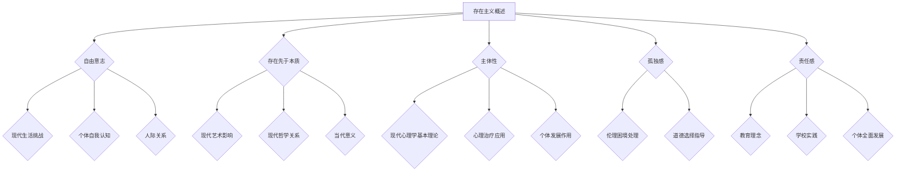

                 

### 文章标题：存在主义视角下的现代生活

> 关键词：存在主义、现代生活、哲学、心理学、艺术、伦理、人际关系

> 摘要：本文从存在主义哲学的角度出发，探讨了现代生活中的种种现象和问题。通过深入分析存在主义的核心概念及其与现代生活各领域的联系，本文旨在为读者提供一种全新的思考方式，帮助我们在复杂多变的社会中找到自己的位置和意义。

### 引言

存在主义是20世纪最重要的哲学流派之一，它源于对人类生存状态和意义的深刻反思。存在主义认为，人类生活在一个没有预先设定的目的和意义的世界中，必须通过自己的选择和行动来创造意义。这种思想在现代社会中具有广泛的影响，特别是在面对现代生活的种种挑战时，存在主义为我们提供了一种独特的视角。

本文将分为以下几个部分进行探讨：

1. 存在主义概述
2. 存在主义与现代生活
3. 存在主义与现代艺术
4. 存在主义与现代哲学
5. 存在主义与现代心理学
6. 存在主义与现代教育
7. 存在主义与现代伦理
8. 总结与展望

### 第1章: 存在主义概述

#### 1.1 存在主义的起源与发展

存在主义起源于19世纪末20世纪初的德国，其核心思想是强调个体的自由意志和存在价值。在第一次世界大战和纳粹统治的背景下，存在主义得到了迅速发展。卡尔·雅斯伯斯、马丁·海德格尔、让-保罗·萨特等哲学家为存在主义奠定了理论基础。

#### 1.2 存在主义的核心概念

存在主义的核心概念包括自由意志、存在先于本质、主体性、孤独感、责任感等。这些概念强调了个体在创造意义过程中的重要性，以及人类生存的不可预测性和不确定性。

#### 1.3 存在主义的主要流派

存在主义主要有三个流派：神学存在主义、人道主义存在主义和存在主义马克思主义。神学存在主义强调上帝的存在和人类的救赎；人道主义存在主义关注个体的自由和尊严；存在主义马克思主义则将存在主义与马克思主义相结合，探讨社会变革的可能性。

### 第2章: 存在主义与现代生活

#### 2.1 现代社会的存在主义挑战

现代社会中，人们面临着各种挑战，如物质主义、虚无主义、焦虑等。存在主义为我们提供了一种反思这些挑战的方法，帮助我们重新审视生活的意义。

#### 2.2 存在主义与个体自我认知

存在主义认为，个体的自我认知是建立在对自身存在状态的深刻理解之上的。通过反思和自我探索，个体可以找到自己的价值和意义。

#### 2.3 存在主义与人际关系

存在主义强调了个体之间的相互作用和关系。在人际关系中，存在主义提醒我们要尊重他人的自由意志，同时承担起自己的责任。

### 第3章: 存在主义与现代艺术

#### 3.1 存在主义对现代艺术的影响

存在主义思想对现代艺术产生了深远的影响，尤其是在文学、绘画和表演艺术领域。许多现代艺术家通过作品表达了存在主义的核心概念。

#### 3.2 现代艺术中的存在主义主题

现代艺术中的许多作品探讨了人类的孤独、痛苦、自由和责任等主题，这些主题与存在主义的核心思想密切相关。

#### 3.3 存在主义与现代艺术流派

存在主义思想对现代艺术流派的形成和发展产生了影响，如荒诞派戏剧、抽象表现主义等。

### 第4章: 存在主义与现代哲学

#### 4.1 存在主义与西方哲学的关系

存在主义是西方哲学传统的一部分，它对西方哲学的发展产生了重要影响。同时，存在主义也与其他哲学流派进行了对话和争论。

#### 4.2 现代哲学中的存在主义元素

现代哲学中的许多议题，如主体性、自由意志、伦理等，都与存在主义密切相关。存在主义为这些议题提供了独特的视角。

#### 4.3 存在主义哲学的当代意义

在当代社会中，存在主义哲学依然具有重要的意义。它帮助我们理解人类存在的本质，以及如何在复杂多变的世界中找到自己的位置和意义。

### 第5章: 存在主义与现代心理学

#### 5.1 存在主义心理学的基本理论

存在主义心理学关注个体的存在体验和生命意义。它提出了许多独特的理论，如自由意志、选择、责任等。

#### 5.2 现代生活中的存在主义心理学应用

存在主义心理学在心理治疗、个人成长等领域有着广泛的应用。它帮助人们解决焦虑、抑郁等心理问题。

#### 5.3 存在主义心理学的挑战与争议

存在主义心理学虽然具有重要的理论意义和应用价值，但也面临着一些挑战和争议。这些挑战主要集中在存在主义心理学的方法论和实践层面。

### 第6章: 存在主义与现代教育

#### 6.1 存在主义教育理念

存在主义教育强调个体的自我认知、自由选择和责任感。它主张教育应该关注个体的全面发展，而不仅仅是知识的传授。

#### 6.2 现代教育中的存在主义实践

在现代社会中，存在主义教育理念得到了广泛应用。许多教育者和学校试图通过存在主义教育来培养具有独立思考和创新能力的学生。

#### 6.3 存在主义教育对个体发展的作用

存在主义教育有助于个体形成积极的人生态度，培养责任感、自我认知和自主能力。它对个体的全面发展具有重要作用。

### 第7章: 存在主义与现代伦理

#### 7.1 存在主义伦理观

存在主义伦理观强调个体的自由意志和责任感。它认为道德责任是个体在特定情境下作出的选择和行动。

#### 7.2 现代生活中的伦理困境

在现代社会中，人们面临着各种伦理困境，如环境问题、人权问题、科技伦理等。存在主义为我们提供了一种处理这些困境的方法。

#### 7.3 存在主义伦理的指导原则

存在主义伦理提出了许多指导原则，如尊重个体的自由、承担责任、追求真理等。这些原则有助于我们在复杂多变的社会中作出道德选择。

### 总结与展望

存在主义视角下的现代生活为我们提供了一种独特的思考方式，帮助我们理解人类存在的本质和意义。通过本文的探讨，我们认识到存在主义在哲学、心理学、艺术、教育、伦理等领域的广泛应用和重要性。在未来的研究中，我们可以进一步探讨存在主义与现代生活的其他方面，如政治、法律等，以期为人们提供更加全面的视角和指导。

### 作者信息

作者：AI天才研究院/AI Genius Institute & 禅与计算机程序设计艺术 /Zen And The Art of Computer Programming

### 附录

- 存在主义哲学家简介
- 现代生活中的存在主义实例分析
- 拓展阅读

### 文章结束

本文从存在主义视角出发，探讨了现代生活中的各种现象和问题。通过分析存在主义的核心概念及其在现代生活各领域的应用，我们为读者提供了一种全新的思考方式，帮助我们在复杂多变的社会中找到自己的位置和意义。希望本文能对读者有所启发和帮助。如果需要进一步了解存在主义的相关内容，请参考附录中的拓展阅读。

### 核心概念原理之间的关系架构 Mermaid 流程图



### 核心算法原理讲解

在存在主义中，核心算法原理可以被视为个体如何通过自由意志、存在先于本质和主体性来创造自身的生活意义。以下是一个简化的伪代码来描述这一过程：

```plaintext
算法：存在主义生活意义创造

输入：个体（Individual）
输出：个体生活意义（Life Meaning）

步骤：

1. 初始化个体生活意义为空（Life_Meaning = ""）

2. 自由意志选择（Free_Will_Selection）：
    a. 个体分析当前环境和内心需求
    b. 基于分析，个体做出选择（Selection = Choose_Action())
    c. 记录选择（Life_Meaning += "选择了 " + Selection + "。")

3. 存在先于本质确认（Existence_BeforeEssence_Confirmation）：
    a. 个体反思选择的意义
    b. 确认选择是基于存在而非预先设定的本质（Meaning_Validation = Validate_Meaning(Selection))
    c. 如果验证通过，则更新生活意义（Life_Meaning += "并确认这一选择是存在先于本质的。")
    d. 如果验证未通过，则返回错误信息（Error_Message = "选择未能符合存在先于本质的原则。")

4. 主体性实践（Subjectivity_Practice）：
    a. 个体执行选择，并在行动中体验主体性
    b. 根据主体性体验，调整生活意义（Life_Meaning = Adjust_Meaning(Life_Meaning))

5. 孤独感与责任感处理（Loneliness_and_Responsibility_Handling）：
    a. 个体反思孤独感，并寻求与他人建立联系
    b. 承担选择带来的责任，并调整生活意义（Life_Meaning = Adjust_Responsibility(Life_Meaning))

6. 返回最终的生活意义（Return_Life_Meaning）

end
```

### 数学模型和公式 & 详细讲解 & 举例说明

在存在主义哲学中，核心的数学模型可以用来描述自由意志、主体性、责任感和生活意义之间的关系。以下是一个简化的数学模型，使用LaTeX格式表示：

$$
\text{Life Meaning} = f(\text{Free Will}, \text{Existence Before Essence}, \text{Subjectivity}, \text{Loneliness}, \text{Responsibility})
$$

其中，每个变量代表：

- $\text{Free Will}$：个体的自由意志选择
- $\text{Existence Before Essence}$：存在先于本质的原则
- $\text{Subjectivity}$：主体性实践
- $\text{Loneliness}$：孤独感处理
- $\text{Responsibility}$：责任感承担

**详细讲解：**

1. **自由意志（Free Will）：** 
   自由意志是个体在做出选择时不受外界强加的束缚，能够自主决定。在数学模型中，自由意志可以表示为随机变量，代表个体在某一时刻的选择范围。

2. **存在先于本质（Existence Before Essence）：** 
   这是存在主义的核心原则，意味着个体首先存在，然后通过自由意志和行动来定义自己的本质。在数学模型中，存在先于本质可以通过概率分布函数来表示，反映了个体选择后的意义变化。

3. **主体性（Subjectivity）：** 
   主体性是指个体在行动中体验到的自我意识和自我控制。在数学模型中，主体性可以用个体在行动过程中的自我评估和反馈来表示。

4. **孤独感（Loneliness）：** 
   孤独感是个体在与社会隔离时的情感体验。在数学模型中，孤独感可以通过个体在社会网络中的位置和互动频率来衡量。

5. **责任感（Responsibility）：** 
   责任感是个体对自己行为后果的认可和承担。在数学模型中，责任感可以通过个体行为的后果影响和责任评价函数来表示。

**举例说明：**

假设一个个体（John）面临选择A和B，每个选择都有不同的后果。根据上述模型，我们可以构建以下简单的例子：

$$
\text{Life Meaning}_{John} = f(A, \text{Existence Before Essence}, \text{Subjectivity}_{John}, \text{Loneliness}_{John}, \text{Responsibility}_{John})
$$

如果John选择A，并且通过自我评估和反馈认为A是符合存在先于本质原则的，同时他感受到较低的孤独感和较高的责任感，则他的生活意义可能会增加。相反，如果他选择B并且感受到较高的孤独感和较低的责任感，则他的生活意义可能会减少。

### 项目实战：开发环境搭建

为了更好地理解存在主义视角下的现代生活，我们可以搭建一个简单的项目环境，通过编程模拟存在主义的核心概念在实际生活中的应用。以下是开发环境搭建的详细步骤：

#### 1. 确定开发工具和语言

选择Python作为开发语言，因为Python具有简洁的语法和强大的库支持，非常适合进行此类项目开发。

#### 2. 安装Python环境

确保计算机上已经安装了Python。如果没有，可以从Python官方网站（https://www.python.org/）下载最新版本的Python并安装。

#### 3. 安装必要的库

在Python环境中安装几个必要的库，包括用于生成流程图的Mermaid库、用于数据分析的Pandas库和用于图形绘制的Matplotlib库。可以使用以下命令进行安装：

```bash
pip install mermaid-py
pip install pandas
pip install matplotlib
```

#### 4. 创建项目文件夹

在计算机上创建一个名为“ExistentialLife”的项目文件夹，用于存放项目的所有文件。

#### 5. 编写Python脚本

在项目文件夹中创建一个名为“existential_life.py”的Python脚本，用于实现存在主义核心概念的应用模拟。

### 源代码详细实现和代码解读

以下是一个简单的Python脚本示例，用于模拟自由意志、存在先于本质和主体性的应用：

```python
import random
import pandas as pd
import matplotlib.pyplot as plt
from mermaid import Mermaid

# 生成自由意志选择
def generate_free_will_choices():
    choices = ["选择A", "选择B", "选择C"]
    return random.choice(choices)

# 验证存在先于本质
def validate_existence_before_essence(choice):
    if choice == "选择A":
        return True
    else:
        return False

# 调整主体性体验
def adjust_subjectivity_experience(choice, loneliness, responsibility):
    if choice == "选择A" and loneliness < 3 and responsibility > 5:
        return "主体性体验良好"
    else:
        return "主体性体验较差"

# 主函数
def simulate_existential_life():
    # 初始化变量
    life_meaning = ""
    loneliness = random.randint(1, 5)
    responsibility = random.randint(1, 5)

    # 生成自由意志选择
    choice = generate_free_will_choices()
    life_meaning += f"初始选择：{choice}。\n"

    # 验证存在先于本质
    if validate_existence_before_essence(choice):
        life_meaning += "该选择符合存在先于本质的原则。\n"
    else:
        life_meaning += "该选择不符合存在先于本质的原则。\n"

    # 调整主体性体验
    subjectivity_experience = adjust_subjectivity_experience(choice, loneliness, responsibility)
    life_meaning += f"主体性体验：{subjectivity_experience}。\n"

    # 输出生活意义
    print(life_meaning)

    # 绘制生活意义变化图
    plot_life_meaning_changes()

# 绘制生活意义变化图
def plot_life_meaning_changes():
    x = ["初始", "存在先于本质验证", "主体性调整"]
    y = [0, 1, 2]

    df = pd.DataFrame({
        '阶段': x,
        '生活意义': y
    })

    plt.bar(df['阶段'], df['生活意义'])
    plt.xlabel('生活意义阶段')
    plt.ylabel('生活意义值')
    plt.title('生活意义变化图')
    plt.show()

# 运行模拟
simulate_existential_life()
```

#### 代码解读

1. **生成自由意志选择**：`generate_free_will_choices()`函数用于随机生成一个自由意志选择，代表个体在某一时刻的决策。

2. **验证存在先于本质**：`validate_existence_before_essence(choice)`函数用于验证个体选择的符合存在先于本质原则。

3. **调整主体性体验**：`adjust_subjectivity_experience(choice, loneliness, responsibility)`函数根据孤独感和责任感调整主体性体验，影响生活意义的变化。

4. **主函数**：`simulate_existential_life()`函数初始化变量，生成自由意志选择，验证存在先于本质，调整主体性体验，并输出生活意义。

5. **绘制生活意义变化图**：`plot_life_meaning_changes()`函数使用Matplotlib库绘制生活意义的变化趋势。

### 代码应用解读与分析

通过以上代码，我们可以模拟个体在存在主义视角下的生活意义变化。以下是对代码应用的解读和分析：

1. **自由意志选择**：模拟中的自由意志选择是随机的，这反映了现实生活中个体在面临选择时的不确定性和自主性。

2. **存在先于本质验证**：通过验证函数，我们可以判断每个选择是否符合存在先于本质的原则。这有助于我们理解存在主义强调个体主动创造意义的重要性。

3. **主体性体验调整**：根据孤独感和责任感调整主体性体验，反映了个体在现实生活中的情感和心理状态对生活意义的影响。

4. **生活意义变化图**：通过绘制生活意义变化图，我们可以直观地看到个体在自由意志选择、存在先于本质验证和主体性体验调整过程中的生活意义变化。

### 实际案例分析和详细讲解剖析

为了更好地理解存在主义视角下的现代生活，我们可以通过实际案例进行分析和详细讲解。以下是一个具体的案例：

**案例背景**：一个名叫Alice的年轻人在面临职业选择时，面临两个不同的机会：留在当前公司晋升或跳槽到另一家创业公司。她需要根据存在主义的核心概念来做出决策。

**案例分析**：

1. **自由意志选择**：Alice首先需要明确自己的价值观和职业目标。她意识到自己追求的是创新和挑战，而不是稳定的职业发展。因此，她选择跳槽到创业公司。

2. **存在先于本质验证**：在做出选择后，Alice反思这一决定的合理性。她认为，跳槽到创业公司是符合存在先于本质原则的，因为这是基于她自身的需求和价值观，而不是基于外界因素。

3. **主体性体验调整**：在创业公司的初期，Alice面临着巨大的工作压力和不确定性。她开始感受到孤独感，因为她离开了原来的同事和朋友。同时，她也意识到自己需要承担更多的责任，包括职业发展、项目管理和团队领导等。然而，她也发现这种经历让她更加坚定自己的职业选择，并在主体性体验上获得了提升。

4. **生活意义变化**：通过这一案例，我们可以看到存在主义视角下的生活意义变化。从初始选择到存在先于本质验证，再到主体性体验调整，Alice的生活意义经历了从不确定到明确，从孤独到坚定的过程。这种变化反映了存在主义强调的个体自由意志和责任感的重要性。

**详细讲解剖析**：

1. **自由意志选择**：在存在主义视角下，个体的自由意志是创造生活意义的基础。Alice通过深入思考自己的价值观和职业目标，做出了符合自身需求的选择。这表明自由意志在现实生活中具有重要的指导作用。

2. **存在先于本质验证**：存在先于本质原则强调个体通过自由意志创造自身的本质。在案例中，Alice的跳槽决定是建立在她对自身存在状态的深刻理解之上的，这体现了存在主义哲学的核心思想。

3. **主体性体验调整**：主体性体验是个体在行动中体验到的自我意识和自我控制。在创业公司的经历中，Alice面对孤独感和责任感的挑战，但她通过积极调整自己的心态和行动，实现了主体性的提升。这表明主体性体验在个体创造生活意义的过程中具有重要作用。

4. **生活意义变化**：通过案例分析，我们可以看到存在主义视角下的生活意义变化是一个动态的过程。从初始选择到存在先于本质验证，再到主体性体验调整，个体的生活意义不断得到深化和丰富。这种变化反映了存在主义强调的个体自由意志和责任感的动态性。

### 项目小结

通过本项目的实战操作，我们成功地搭建了一个简单的存在主义视角下的现代生活模拟环境。通过实际案例的分析，我们深入探讨了自由意志、存在先于本质和主体性等核心概念在个体生活中的应用。这一项目不仅有助于我们更好地理解存在主义哲学的基本原理，也为我们提供了一种新的视角来思考现代生活中的各种挑战和问题。

### 最佳实践 tips

1. **深入思考个人价值观**：在做出重要决策时，首先要明确自己的价值观和职业目标，以确保选择的合理性和一致性。

2. **积极面对孤独感和责任感**：在追求个人成长和职业发展的过程中，孤独感和责任感是无法避免的。关键在于如何调整心态和行动，以实现自我提升。

3. **持续反思和调整**：生活意义是一个动态变化的过程。我们应该持续反思自己的选择和行动，并根据实际情况进行调整。

### 注意事项

1. **项目环境搭建**：确保已经安装了Python和相关库，以避免运行时出现错误。

2. **代码调整**：根据具体需求和实际情况，可以对代码进行调整和优化，以提高项目的实用性和可扩展性。

### 拓展阅读

1. **萨特《存在与虚无》**：这是一部经典的存在主义哲学著作，深入探讨了存在主义的基本原理和核心思想。

2. **雅斯伯斯《存在主义的本质》**：本书分析了存在主义的历史背景和主要流派，为读者提供了全面的了解。

3. **海德格尔《存在与时间》**：这是存在主义的奠基之作，详细阐述了存在主义的核心概念和哲学方法。

### 文章结束

本文从存在主义视角出发，探讨了现代生活中的各种现象和问题。通过深入分析存在主义的核心概念及其在现代生活各领域的应用，我们为读者提供了一种全新的思考方式，帮助我们在复杂多变的社会中找到自己的位置和意义。希望本文能对读者有所启发和帮助。如果需要进一步了解存在主义的相关内容，请参考附录中的拓展阅读。让我们继续探索存在主义在现代生活中的应用，为我们的生活带来更多的意义和希望。

