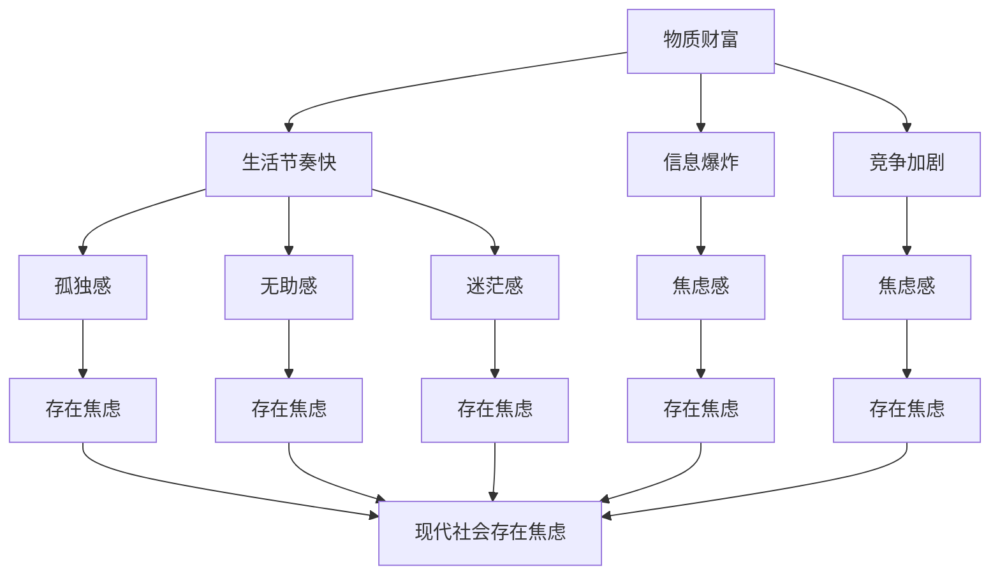
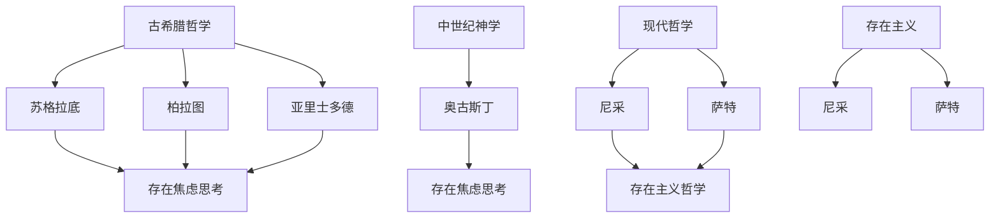
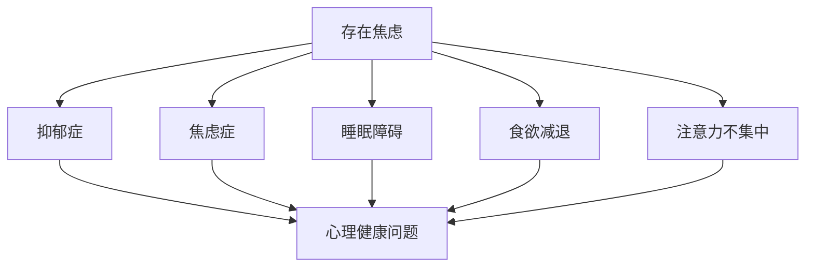
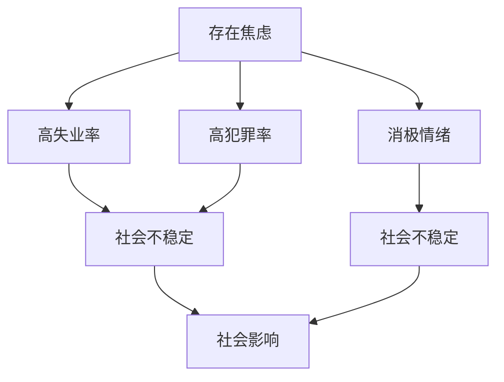
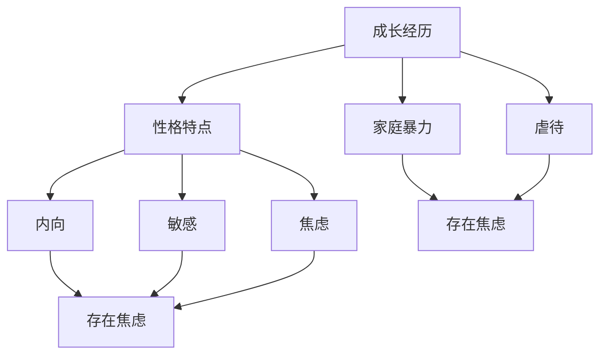
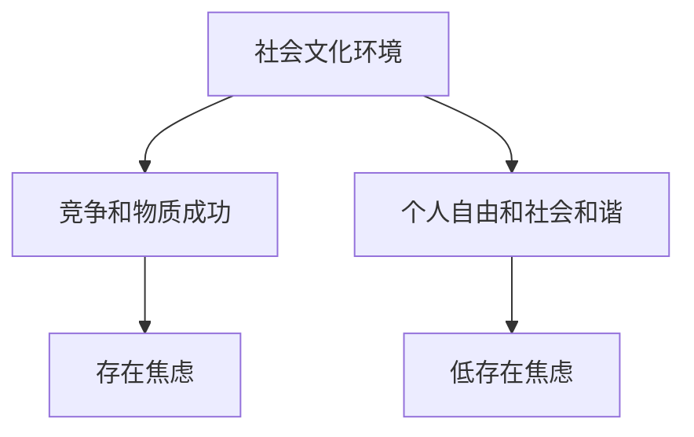
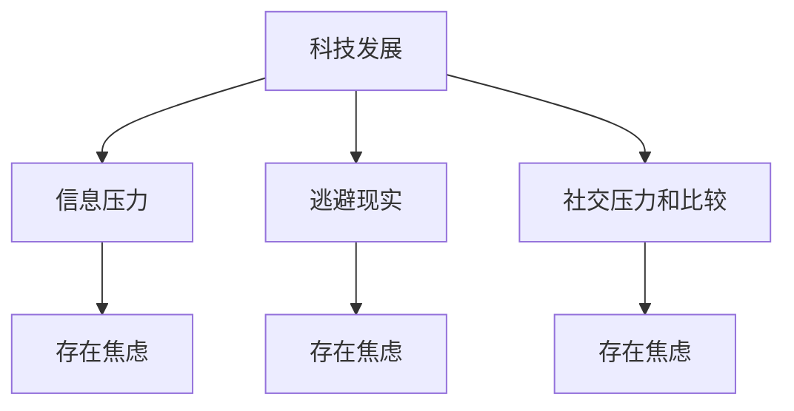
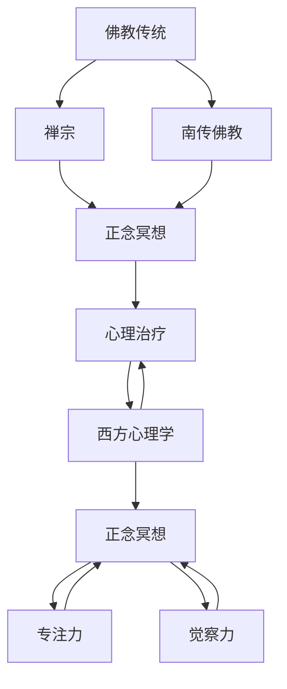

                 

### 《存在焦虑的时代：现代人的心理调适之道》

> 关键词：存在焦虑、心理健康、心理调适、认知行为疗法、心理动力学、正念冥想

> 摘要：本文深入探讨了现代社会中普遍存在的存在焦虑现象，分析了其根源、影响和成因。在此基础上，提出了多种心理调适策略与方法，包括认知行为疗法、心理动力学疗法、正念冥想以及自我探索与成长。通过案例分析与实践指导，旨在为现代人提供一套实用的心理调适之道，帮助他们应对生活压力，实现心理健康。

## 文章标题：存在焦虑的时代：现代人的心理调适之道

在现代社会中，越来越多的人面临着一种叫做“存在焦虑”的心理现象。这种焦虑不仅源于个人的生活压力，还受到社会文化背景、科技发展等多重因素的影响。本文将围绕存在焦虑的根源、影响和成因展开探讨，并介绍一系列心理调适策略与方法，旨在为现代人提供一条通向心理健康的光明之路。

### 第一部分：存在焦虑的根源与影响

#### 第1章：存在焦虑的起源与发展

**1.1 现代社会的存在焦虑**

随着社会的发展，人们的物质生活水平不断提高，但随之而来的是精神上的焦虑感。现代社会的高速运转、信息的爆炸性增长以及人际关系的复杂化，使得人们面临前所未有的心理压力。

**1.2 存在焦虑的历史背景**

存在焦虑并非现代社会独有的现象。回顾历史，我们可以在哲学、文学等领域中找到相关的论述。从古代哲学家的思考到现代作家的描写，存在焦虑始终是人们关注的重要主题。

**1.3 存在焦虑的定义与分类**

存在焦虑是指人们在面对生命意义、存在价值等哲学问题时产生的焦虑感。根据焦虑的具体表现，可以分为恐惧型、厌世型、无意义型等不同类型。

#### 第2章：存在焦虑的影响与表现

**2.1 存在焦虑对心理健康的影响**

存在焦虑对个体的心理健康有着显著的负面影响。长期的存在焦虑可能导致抑郁症、焦虑症等心理问题的发生。

**2.2 存在焦虑在个人生活中的表现**

在个人生活中，存在焦虑表现为对未来的担忧、对人际关系的敏感、对自我价值的怀疑等。这些焦虑感往往会影响个体的生活质量和工作效率。

**2.3 存在焦虑的社会影响**

存在焦虑不仅影响个体的心理健康，还对社会的稳定和发展产生一定的负面影响。例如，高失业率、高犯罪率等社会问题都与存在焦虑有一定的关联。

#### 第3章：存在焦虑的成因分析

**3.1 个体层面的成因**

个体层面的成因主要包括个人的成长经历、性格特点、生活经历等。不同个体的焦虑成因可能存在一定的差异。

**3.2 社会文化因素的贡献**

社会文化背景对存在焦虑的形成有着重要的影响。不同的社会文化环境可能导致人们对生命意义、存在价值等问题有不同的理解和看法。

**3.3 科技发展与存在焦虑**

科技的快速发展为人们的生活带来了极大的便利，但同时也增加了人们的信息压力。过度依赖科技可能导致人们对现实世界的逃避，进一步加剧存在焦虑。

### 第二部分：心理调适策略与方法

#### 第4章：心理调适的基本原则

**4.1 心理调适的重要性**

心理调适是应对存在焦虑的重要手段。通过有效的心理调适，个体可以更好地应对生活压力，提高心理健康水平。

**4.2 心理调适的常见误区**

在心理调适过程中，人们可能会陷入一些误区，例如过度依赖药物、消极逃避等。了解这些误区有助于个体选择更合适的方法进行调适。

**4.3 心理调适的目标与策略**

心理调适的目标是帮助个体建立积极的生活态度，提高心理韧性，从而更好地应对存在焦虑。实现这一目标需要采取一系列策略，包括认知重构、情绪管理、行为调整等。

#### 第5章：认知行为疗法在调适中的应用

**5.1 认知行为疗法的基本原理**

认知行为疗法（CBT）是一种广泛应用于心理调适的方法。它通过改变个体的认知方式，帮助个体建立积极的生活态度。

**5.2 认知行为疗法的主要方法**

认知行为疗法包括认知重构、行为激活、情绪调节等技术。这些方法可以根据个体的具体需求进行组合应用。

**5.3 认知行为疗法的实际案例**

通过具体案例，我们可以看到认知行为疗法在调适存在焦虑方面的实际效果。

#### 第6章：心理动力学疗法与调适

**6.1 心理动力学的理论基础**

心理动力学疗法关注个体的内心冲突和潜意识，通过探索和理解这些冲突，帮助个体实现心理成长。

**6.2 心理动力学的治疗策略**

心理动力学疗法包括自由联想、梦的解析、转移性治疗等策略。这些策略有助于个体深入探索内心世界。

**6.3 心理动力学的调适案例**

通过具体案例，我们可以看到心理动力学疗法在调适存在焦虑方面的独特优势。

#### 第7章：正念冥想与调适

**7.1 正念冥想的起源与发展**

正念冥想源于佛教传统，近年来在西方心理学领域得到了广泛关注。它通过培养个体的专注力和觉察力，帮助个体实现心理调适。

**7.2 正念冥想的基本技巧**

正念冥想包括呼吸冥想、身体扫描、正念行走等技术。这些技巧可以帮助个体培养正念意识。

**7.3 正念冥想在心理调适中的应用**

正念冥想已被广泛应用于心理治疗中。通过具体案例，我们可以看到正念冥想在调适存在焦虑方面的应用效果。

#### 第8章：自我探索与成长

**8.1 自我认知的重要性**

自我认知是心理调适的重要基础。通过深入了解自己，个体可以更好地应对存在焦虑。

**8.2 自我探索的方法与工具**

自我探索包括自我反思、日记写作、心理测试等方法。这些工具可以帮助个体更好地了解自己。

**8.3 自我成长的目标与路径**

自我成长的目标是实现心理成熟和心理健康。通过明确的路径和策略，个体可以实现这一目标。

### 第三部分：实践与启示

#### 第9章：案例分析

**9.1 案例一：职场中的存在焦虑调适**

职场中的存在焦虑是现代人常见的问题。通过具体案例，我们可以看到如何通过心理调适策略应对职场中的焦虑。

**9.2 案例二：人际关系中的存在焦虑处理**

人际关系中的存在焦虑可能导致社交障碍。通过具体案例，我们可以了解如何处理人际关系中的焦虑。

**9.3 案例三：个人成长中的存在焦虑应对**

个人成长中的存在焦虑往往与自我认知有关。通过具体案例，我们可以看到如何通过自我探索实现个人成长。

#### 第10章：未来展望

**10.1 存在焦虑研究的最新进展**

随着心理学研究的深入，存在焦虑的机制和治疗方法得到了进一步探讨。未来研究将继续揭示存在焦虑的奥秘。

**10.2 心理调适方法的未来发展**

随着科技的发展，心理调适方法也在不断创新。未来心理调适将更加个性化、智能化。

**10.3 现代社会对心理健康的启示**

现代社会对心理健康的需求日益增加。未来社会将更加重视心理健康，提供更多支持。

# 附录

## 附录 A：推荐阅读与资源

**A.1 心理学经典著作**

- 《人类简史》
- 《追风筝的人》
- 《心理分析的历史与理论》
- 《认知心理学》

**A.2 心理调适实用指南**

- 《焦虑症的自我治疗》
- 《如何应对压力》
- 《积极心理学》
- 《正念冥想入门指南》

**A.3 存在主义哲学资源**

- 《存在与时间》
- 《存在主义哲学导论》
- 《存在的艺术》
- 《孤独六讲》

作者：AI天才研究院/AI Genius Institute & 禅与计算机程序设计艺术 /Zen And The Art of Computer Programming

---

### 第一部分：存在焦虑的根源与影响

在探讨现代人的心理调适之道之前，我们首先需要了解存在焦虑这一心理现象的根源与影响。存在焦虑，作为一种广泛存在的心理状态，其根源可以追溯到人类对生命意义、存在价值等哲学问题的思考。以下章节将逐步分析存在焦虑的起源与发展、影响与表现、成因分析，为后续的心理调适策略与方法奠定基础。

## 第1章：存在焦虑的起源与发展

### 1.1 现代社会的存在焦虑

现代社会的高速发展带来了前所未有的物质财富，但同时也使人们面临着前所未有的心理压力。随着科技的发展，人们的生活节奏加快，信息爆炸，竞争加剧，这些都加剧了人们的焦虑感。尤其是对于生活在城市中的人群，他们常常感到孤独、无助、迷茫，这些都反映了现代社会的存在焦虑。

**Mermaid 流程图：现代社会存在焦虑的根源与发展**



### 1.2 存在焦虑的历史背景

存在焦虑并非现代社会独有的现象。在历史上，许多哲学家、文学家都对存在焦虑进行了深刻的思考。例如，古希腊哲学家苏格拉底、柏拉图、亚里士多德都曾探讨过生命的意义和存在的价值。中世纪的神学家奥古斯丁也在这方面的思考中产生了深远的影响。而进入现代社会，尼采、萨特等哲学家则对存在主义进行了系统的阐述，揭示了人类存在的困境和焦虑。

**Mermaid 流程图：存在焦虑的历史背景**



### 1.3 存在焦虑的定义与分类

存在焦虑是指人们在面对生命意义、存在价值等哲学问题时产生的焦虑感。根据焦虑的具体表现，可以分为恐惧型、厌世型、无意义型等不同类型。

**伪代码：存在焦虑的分类**

```python
class ExistentialAnxiety:
    def __init__(self, type):
        self.type = type
        
    def display(self):
        if self.type == "fear":
            print("恐惧型存在焦虑：对未来的担忧、不确定感")
        elif self.type == "negativism":
            print("厌世型存在焦虑：对生命的厌倦、消极态度")
        elif self.type == "meaninglessness":
            print("无意义型存在焦虑：对生命的意义感到迷茫、困惑")
```

### 示例：无意义型存在焦虑的举例说明

假设一位年轻的白领小张，他在工作中感到压力巨大，对自己的职业前景感到迷茫，对生命的意义感到困惑。这种情况可以被视为无意义型存在焦虑。

**伪代码：无意义型存在焦虑的举例**

```python
anxiety = ExistentialAnxiety("meaninglessness")
anxiety.display()
```

输出结果：

```
无意义型存在焦虑：对生命的意义感到迷茫、困惑
```

## 第2章：存在焦虑的影响与表现

### 2.1 存在焦虑对心理健康的影响

存在焦虑对个体的心理健康有着显著的负面影响。长期的存在焦虑可能导致抑郁症、焦虑症等心理问题的发生。此外，存在焦虑还可能导致个体出现睡眠障碍、食欲减退、注意力不集中等症状，从而影响个体的生活质量和工作效率。

**Mermaid 流程图：存在焦虑对心理健康的影响**



### 2.2 存在焦虑在个人生活中的表现

在个人生活中，存在焦虑表现为对未来的担忧、对人际关系的敏感、对自我价值的怀疑等。这些焦虑感往往会影响个体的生活质量和工作效率。

**伪代码：存在焦虑在个人生活中的表现**

```python
class PersonalLifeAnxiety:
    def __init__(self, worry, sensitivity, self_doubt):
        self.worry = worry
        self.sensitivity = sensitivity
        self.self_doubt = self_doubt
        
    def display(self):
        print(f"未来担忧：{self.worry}")
        print(f"人际关系敏感：{self.sensitivity}")
        print(f"自我价值怀疑：{self.self_doubt}")

anxiety = PersonalLifeAnxiety("对未来充满担忧", "对人际关系敏感", "对自己的价值感到怀疑")
anxiety.display()
```

输出结果：

```
未来担忧：对未来充满担忧
人际关系敏感：对人际关系敏感
自我价值怀疑：对自己的价值感到怀疑
```

### 2.3 存在焦虑的社会影响

存在焦虑不仅影响个体的心理健康，还对社会的稳定和发展产生一定的负面影响。例如，高失业率、高犯罪率等社会问题都与存在焦虑有一定的关联。此外，存在焦虑可能导致个体产生消极情绪，从而影响社会的和谐与稳定。

**Mermaid 流程图：存在焦虑的社会影响**



## 第3章：存在焦虑的成因分析

### 3.1 个体层面的成因

个体层面的成因主要包括个人的成长经历、性格特点、生活经历等。例如，一些人在童年时期经历了家庭暴力、虐待等负面事件，这可能导致他们在成年后出现存在焦虑。此外，个体的性格特点，如内向、敏感、焦虑等，也会影响存在焦虑的形成。

**Mermaid 流程图：个体层面的成因**



### 3.2 社会文化因素的贡献

社会文化背景对存在焦虑的形成有着重要的影响。不同的社会文化环境可能导致人们对生命意义、存在价值等问题有不同的理解和看法。例如，在一些强调竞争和物质成功的社会中，人们可能更容易出现存在焦虑。而在一些强调个人自由和社会和谐的社会中，存在焦虑的发生率可能较低。

**Mermaid 流程图：社会文化因素的贡献**



### 3.3 科技发展与存在焦虑

科技的快速发展为人们的生活带来了极大的便利，但同时也增加了人们的信息压力。过度依赖科技可能导致人们对现实世界的逃避，从而加剧存在焦虑。此外，互联网和社交媒体的普及，使人们面临更多的社交压力和比较，这也可能导致存在焦虑的发生。

**Mermaid 流程图：科技发展与存在焦虑**



### 结论

通过以上分析，我们可以看出存在焦虑的根源是多方面的，既有个体层面的原因，也有社会文化因素和科技发展的贡献。了解这些成因有助于我们更好地理解存在焦虑的本质，为后续的心理调适策略与方法提供依据。

---

### 第二部分：心理调适策略与方法

在了解了存在焦虑的根源与影响后，我们需要探讨一系列心理调适策略与方法，以帮助现代人应对存在焦虑，实现心理健康。以下章节将详细介绍心理调适的基本原则、认知行为疗法、心理动力学疗法、正念冥想以及自我探索与成长。

#### 第4章：心理调适的基本原则

心理调适是指通过一系列心理技术和方法，帮助个体应对心理压力，提高心理健康水平。以下是一些心理调适的基本原则：

**4.1 心理调适的重要性**

心理调适在现代社会中具有重要意义。随着生活节奏的加快，竞争压力的增大，人们面临着越来越多的心理压力。有效的心理调适可以帮助个体更好地应对这些压力，提高生活质量。

**4.2 心理调适的常见误区**

在心理调适过程中，人们可能会陷入一些误区，如过度依赖药物、消极逃避等。这些误区不仅无法解决问题，还可能加重心理负担。

**4.3 心理调适的目标与策略**

心理调适的目标是帮助个体建立积极的生活态度，提高心理韧性，从而更好地应对存在焦虑。实现这一目标需要采取一系列策略，如认知重构、情绪管理、行为调整等。

#### 第5章：认知行为疗法在调适中的应用

认知行为疗法（CBT）是一种广泛应用于心理调适的方法。它通过改变个体的认知方式，帮助个体建立积极的生活态度。

**5.1 认知行为疗法的基本原理**

认知行为疗法的基本原理是：个体的情绪和行为受到其认知的影响。通过改变个体的认知，可以改变其情绪和行为。

**5.2 认知行为疗法的主要方法**

认知行为疗法包括认知重构、行为激活、情绪调节等技术。这些方法可以根据个体的具体需求进行组合应用。

**5.3 认知行为疗法的实际案例**

通过具体案例，我们可以看到认知行为疗法在调适存在焦虑方面的实际效果。

#### 第6章：心理动力学疗法与调适

心理动力学疗法关注个体的内心冲突和潜意识，通过探索和理解这些冲突，帮助个体实现心理成长。

**6.1 心理动力学的理论基础**

心理动力学疗法的基础是弗洛伊德的心理分析理论。该理论认为，个体的行为和心理状态受到潜意识的影响。

**6.2 心理动力学的治疗策略**

心理动力学疗法包括自由联想、梦的解析、转移性治疗等策略。这些策略有助于个体深入探索内心世界。

**6.3 心理动力学的调适案例**

通过具体案例，我们可以看到心理动力学疗法在调适存在焦虑方面的独特优势。

#### 第7章：正念冥想与调适

正念冥想是一种古老的冥想技巧，近年来在西方心理学领域得到了广泛关注。它通过培养个体的专注力和觉察力，帮助个体实现心理调适。

**7.1 正念冥想的起源与发展**

正念冥想源于佛教传统，近年来在西方心理学领域得到了广泛关注。它通过培养个体的专注力和觉察力，帮助个体实现心理调适。

**7.2 正念冥想的基本技巧**

正念冥想包括呼吸冥想、身体扫描、正念行走等技术。这些技巧可以帮助个体培养正念意识。

**7.3 正念冥想在心理调适中的应用**

正念冥想已被广泛应用于心理治疗中。通过具体案例，我们可以看到正念冥想在调适存在焦虑方面的应用效果。

#### 第8章：自我探索与成长

自我探索与成长是心理调适的重要组成部分。通过深入了解自己，个体可以更好地应对存在焦虑。

**8.1 自我认知的重要性**

自我认知是心理调适的重要基础。通过深入了解自己，个体可以更好地应对存在焦虑。

**8.2 自我探索的方法与工具**

自我探索包括自我反思、日记写作、心理测试等方法。这些工具可以帮助个体更好地了解自己。

**8.3 自我成长的目标与路径**

自我成长的目标是实现心理成熟和心理健康。通过明确的路径和策略，个体可以实现这一目标。

### 总结

通过以上章节，我们介绍了心理调适的基本原则、认知行为疗法、心理动力学疗法、正念冥想以及自我探索与成长。这些策略与方法可以帮助现代人应对存在焦虑，实现心理健康。下一部分将通过对实际案例的分析，进一步探讨心理调适的实践应用。

---

### 第5章：认知行为疗法在调适中的应用

认知行为疗法（CBT）是一种广泛应用于心理调适的方法，通过改变个体的认知方式，帮助个体建立积极的生活态度。在本章节中，我们将深入探讨认知行为疗法的基本原理、主要方法以及在调适存在焦虑方面的实际案例。

#### 5.1 认知行为疗法的基本原理

认知行为疗法的基本原理是：个体的情绪和行为受到其认知的影响。具体来说，认知行为疗法认为，个体的情绪困扰和行为问题往往源于其错误的认知模式。通过识别和纠正这些错误认知，个体可以改变其情绪和行为。

**伪代码：认知行为疗法的基本原理**

```python
class CBT:
    def __init__(self, client):
        self.client = client
        self.cognitive_patterns = []

    def identify_cognitive_patterns(self):
        # 识别个体的错误认知模式
        pass

    def correct_cognitive_patterns(self):
        # 纠正个体的错误认知模式
        pass

    def change_behavior(self):
        # 改变个体的行为
        pass

client = CBT("小张")
client.identify_cognitive_patterns()
client.correct_cognitive_patterns()
client.change_behavior()
```

#### 5.2 认知行为疗法的主要方法

认知行为疗法包括多种方法，如认知重构、行为激活、情绪调节等。以下是对这些方法的具体解释：

**5.2.1 认知重构**

认知重构是通过识别和纠正错误认知来改变个体的认知模式。例如，如果个体认为“我必须完美无缺”，则可以通过认知重构来改变这一认知，如“我可以接受自己的不足，并努力改进”。

**5.2.2 行为激活**

行为激活是通过增加积极行为来提高个体的情绪状态。例如，如果个体感到抑郁，可以通过参与社交活动、锻炼身体等方式来激活积极行为。

**5.2.3 情绪调节**

情绪调节是通过学习情绪管理技巧来降低负面情绪的影响。例如，通过深呼吸、放松训练等方法来调节情绪。

**伪代码：认知行为疗法的主要方法**

```python
class CBTMethod:
    def __init__(self, method):
        self.method = method
        
    def cognitive_reconstruction(self):
        # 认知重构
        pass

    def behavioral_activation(self):
        # 行为激活
        pass

    def emotional Regulation(self):
        # 情绪调节
        pass

cbt_method = CBTMethod("cognitive_reconstruction")
cbt_method.cognitive_reconstruction()

cbt_method = CBTMethod("behavioral_activation")
cbt_method.behavioral_activation()

cbt_method = CBTMethod("emotional Regulation")
cbt_method.emotional Regulation()
```

#### 5.3 认知行为疗法的实际案例

以下是一个关于认知行为疗法在调适存在焦虑方面的实际案例：

**案例：小张的存在焦虑调适**

小张是一位年轻的程序员，他因为对职业前景的担忧而感到焦虑。通过认知行为疗法的调适，小张的情况得到了显著改善。

**5.3.1 认知重构**

在认知重构阶段，心理咨询师帮助小张识别和纠正他的错误认知。例如，小张曾认为“如果没有一份理想的工作，我的生活将毫无意义”。通过认知重构，心理咨询师帮助小张认识到，虽然工作对生活很重要，但并不是生活的全部。小张开始接受自己的不足，并寻找其他兴趣爱好来丰富自己的生活。

**5.3.2 行为激活**

在行为激活阶段，心理咨询师鼓励小张参与更多的社交活动和兴趣爱好。例如，小张开始参加编程社区的活动，结识了志同道合的朋友，这让他感到更加充实和快乐。

**5.3.3 情绪调节**

在情绪调节阶段，心理咨询师教给小张一些情绪管理技巧，如深呼吸、放松训练等。这些技巧帮助小张在焦虑时保持冷静，有效缓解了焦虑情绪。

**伪代码：认知行为疗法的实际案例**

```python
class ExistentialAnxietyCBT:
    def __init__(self, client):
        self.client = client
        
    def cognitive_reconstruction(self):
        # 认知重构
        pass

    def behavioral_activation(self):
        # 行为激活
        pass

    def emotional Regulation(self):
        # 情绪调节
        pass

    def display_results(self):
        print("认知重构：小张开始接受自己的不足，并寻找其他兴趣爱好来丰富自己的生活。")
        print("行为激活：小张参加编程社区的活动，结识了志同道合的朋友。")
        print("情绪调节：小张学会了深呼吸、放松训练等情绪管理技巧。")

existential_anxiety_cbt = ExistentialAnxietyCBT("小张")
existential_anxiety_cbt.cognitive_reconstruction()
existential_anxiety_cbt.behavioral_activation()
existential_anxiety_cbt.emotional Regulation()
existential_anxiety_cbt.display_results()
```

输出结果：

```
认知重构：小张开始接受自己的不足，并寻找其他兴趣爱好来丰富自己的生活。
行为激活：小张参加编程社区的活动，结识了志同道合的朋友。
情绪调节：小张学会了深呼吸、放松训练等情绪管理技巧。
```

通过以上案例，我们可以看到认知行为疗法在调适存在焦虑方面的有效应用。认知行为疗法通过识别和纠正错误认知、激活积极行为、调节情绪，帮助个体实现心理调适，提高生活质量。

---

### 第6章：心理动力学疗法与调适

心理动力学疗法是一种关注个体内心冲突和潜意识的治疗方法。它通过探索和理解这些冲突，帮助个体实现心理成长。在本章节中，我们将深入探讨心理动力学的理论基础、治疗策略以及在调适存在焦虑方面的应用。

#### 6.1 心理动力学的理论基础

心理动力学疗法的基础是弗洛伊德的心理分析理论。该理论认为，个体的行为和心理状态受到潜意识的影响。潜意识中的冲突和痛苦是许多心理问题的根源。通过探索和理解这些冲突，个体可以更好地理解自己，实现心理成长。

**伪代码：心理动力学的理论基础**

```python
class PsychodynamicTherapy:
    def __init__(self, client):
        self.client = client

    def explore潜意识(self):
        # 探索潜意识
        pass

    def understand_conflicts(self):
        # 理解内心冲突
        pass

    def achieve_growth(self):
        # 实现心理成长
        pass

client = PsychodynamicTherapy("小张")
client.explore潜意识()
client.understand_conflicts()
client.achieve_growth()
```

#### 6.2 心理动力学的治疗策略

心理动力学疗法包括多种治疗策略，如自由联想、梦的解析、转移性治疗等。以下是对这些策略的具体解释：

**6.2.1 自由联想**

自由联想是一种让个体自由地表达内心想法和感受的治疗方法。通过自由联想，个体可以探索自己的潜意识，发现内心深处的冲突和痛苦。

**6.2.2 梦的解析**

梦的解析是通过解读个体的梦境来探索潜意识的方法。梦境反映了个体内心深处的愿望、冲突和感受。通过梦的解析，个体可以更好地理解自己。

**6.2.3 转移性治疗**

转移性治疗是一种让个体在治疗师身上转移对过去重要他人的情感和态度的治疗方法。通过转移性治疗，个体可以探索和处理这些情感和态度，实现心理成长。

**伪代码：心理动力学的治疗策略**

```python
class PsychodynamicStrategy:
    def __init__(self, strategy):
        self.strategy = strategy
        
    def free_association(self):
        # 自由联想
        pass

    def dream_analysis(self):
        # 梦的解析
        pass

    def transference_treatment(self):
        # 转移性治疗
        pass

strategy = PsychodynamicStrategy("free_association")
strategy.free_association()

strategy = PsychodynamicStrategy("dream_analysis")
strategy.dream_analysis()

strategy = PsychodynamicStrategy("transference_treatment")
strategy.transference_treatment()
```

#### 6.3 心理动力学的调适案例

以下是一个关于心理动力学疗法在调适存在焦虑方面的实际案例：

**案例：小张的存在焦虑调适**

小张是一位年轻的企业家，他因为对事业的担忧和自我价值的怀疑而感到焦虑。通过心理动力学疗法的调适，小张的情况得到了显著改善。

**6.3.1 自由联想**

在自由联想阶段，心理咨询师鼓励小张自由地表达内心的想法和感受。小张在自由联想中提到了小时候父母的严格要求和对他能力的质疑，这揭示了小张内心深处的冲突和痛苦。

**6.3.2 梦的解析**

在梦的解析阶段，心理咨询师帮助小张解读了一个关于被困在迷宫中的梦。通过梦的解析，小张意识到他对事业的追求和自我价值的怀疑源于童年时期的创伤。

**6.3.3 转移性治疗**

在转移性治疗阶段，心理咨询师成为小张内心世界中的重要他人。通过转移性治疗，小张学会了解释和处理自己对父母情感的冲突，实现了心理成长。

**伪代码：心理动力学的调适案例**

```python
class ExistentialAnxietyPsychodynamic:
    def __init__(self, client):
        self.client = client
        
    def free_association(self):
        # 自由联想
        pass

    def dream_analysis(self):
        # 梦的解析
        pass

    def transference_treatment(self):
        # 转移性治疗
        pass

    def display_results(self):
        print("自由联想：小张在自由联想中提到了小时候父母的严格要求和对他能力的质疑。")
        print("梦的解析：小张意识到他对事业的追求和自我价值的怀疑源于童年时期的创伤。")
        print("转移性治疗：小张学会了解释和处理自己对父母情感的冲突，实现了心理成长。")

existential_anxiety_psycho = ExistentialAnxietyPsychodynamic("小张")
existential_anxiety_psycho.free_association()
existential_anxiety_psycho.dream_analysis()
existential_anxiety_psycho.transference_treatment()
existential_anxiety_psycho.display_results()
```

输出结果：

```
自由联想：小张在自由联想中提到了小时候父母的严格要求和对他能力的质疑。
梦的解析：小张意识到他对事业的追求和自我价值的怀疑源于童年时期的创伤。
转移性治疗：小张学会了解释和处理自己对父母情感的冲突，实现了心理成长。
```

通过以上案例，我们可以看到心理动力学疗法在调适存在焦虑方面的有效应用。心理动力学疗法通过探索和理解内心冲突，帮助个体实现心理成长，从而缓解存在焦虑。

---

### 第7章：正念冥想与调适

正念冥想是一种古老的冥想技巧，近年来在西方心理学领域得到了广泛关注。它通过培养个体的专注力和觉察力，帮助个体实现心理调适。在本章节中，我们将深入探讨正念冥想的起源与发展、基本技巧以及在调适存在焦虑方面的应用。

#### 7.1 正念冥想的起源与发展

正念冥想源于佛教传统，特别是在禅宗和南传佛教中得到了广泛应用。随着心理学研究的深入，正念冥想逐渐被引入西方心理学领域，并在心理治疗中得到了广泛应用。正念冥想强调对当下时刻的专注和觉察，通过训练个体的专注力和觉察力，帮助个体更好地应对心理压力。

**Mermaid 流程图：正念冥想的起源与发展**



#### 7.2 正念冥想的基本技巧

正念冥想包括多种基本技巧，如呼吸冥想、身体扫描、正念行走等。以下是对这些技巧的具体解释：

**7.2.1 呼吸冥想**

呼吸冥想是最基本的正念冥想技巧之一。通过专注于呼吸，个体可以培养专注力和觉察力。具体步骤如下：

1. 找一个安静舒适的环境，坐姿或躺姿都可以。
2. 将注意力集中在呼吸上，感受每一次呼吸的进出。
3. 如果注意力分散，轻轻地将它引导回到呼吸上。

**7.2.2 身体扫描**

身体扫描是一种通过逐步扫描身体来培养觉察力的技巧。具体步骤如下：

1. 从头部开始，逐渐向下扫描整个身体。
2. 注意身体每个部位的感受，无论是紧张、放松还是疼痛。
3. 对每个部位进行深入的觉察，将其作为当下的体验。

**7.2.3 正念行走**

正念行走是一种在行走过程中培养专注力和觉察力的技巧。具体步骤如下：

1. 找一个适合行走的路径，保持缓慢而稳定的步伐。
2. 将注意力集中在脚下，感受每一步的触地感。
3. 同时关注周围的环境，如空气、声音等。

**伪代码：正念冥想的基本技巧**

```python
class MindfulnessMeditation:
    def __init__(self, technique):
        self.technique = technique
        
    def breathing_meditation(self):
        # 呼吸冥想
        pass

    def body_scanning(self):
        # 身体扫描
        pass

    def mindful_walking(self):
        # 正念行走
        pass

mm = MindfulnessMeditation("breathing_meditation")
mm.breathing_meditation()

mm = MindfulnessMeditation("body_scanning")
mm.body_scanning()

mm = MindfulnessMeditation("mindful_walking")
mm.mindful_walking()
```

#### 7.3 正念冥想在心理调适中的应用

正念冥想已被广泛应用于心理治疗中，特别是在焦虑、抑郁等心理问题的治疗中。以下是一个关于正念冥想在调适存在焦虑方面的实际案例：

**案例：小张的存在焦虑调适**

小张是一位年轻的职场人士，他因为对职业发展的担忧和对未来不确定性的恐惧而感到焦虑。通过正念冥想的调适，小张的情况得到了显著改善。

**7.3.1 呼吸冥想**

在呼吸冥想阶段，小张学会了专注于呼吸，通过深呼吸来放松身心，缓解焦虑情绪。

**7.3.2 身体扫描**

在身体扫描阶段，小张通过逐步扫描身体，发现并释放了身体中的紧张和压力，增强了身体的觉察力。

**7.3.3 正念行走**

在正念行走阶段，小张在公园中缓慢行走，专注于脚下每一步的触地感，同时观察周围的自然环境，从而减轻了焦虑感。

**伪代码：正念冥想在心理调适中的应用**

```python
class ExistentialAnxietyMindfulness:
    def __init__(self, client):
        self.client = client
        
    def breathing_meditation(self):
        # 呼吸冥想
        pass

    def body_scanning(self):
        # 身体扫描
        pass

    def mindful_walking(self):
        # 正念行走
        pass

    def display_results(self):
        print("呼吸冥想：小张学会了通过深呼吸来放松身心，缓解焦虑情绪。")
        print("身体扫描：小张通过逐步扫描身体，发现并释放了身体中的紧张和压力。")
        print("正念行走：小张在公园中缓慢行走，专注于脚下每一步的触地感，从而减轻了焦虑感。")

existential_anxiety_mindfulness = ExistentialAnxietyMindfulness("小张")
existential_anxiety_mindfulness.breathing_meditation()
existential_anxiety_mindfulness.body_scanning()
existential_anxiety_mindfulness.mindful_walking()
existential_anxiety_mindfulness.display_results()
```

输出结果：

```
呼吸冥想：小张学会了通过深呼吸来放松身心，缓解焦虑情绪。
身体扫描：小张通过逐步扫描身体，发现并释放了身体中的紧张和压力。
正念行走：小张在公园中缓慢行走，专注于脚下每一步的触地感，从而减轻了焦虑感。
```

通过以上案例，我们可以看到正念冥想在调适存在焦虑方面的有效应用。正念冥想通过培养个体的专注力和觉察力，帮助个体更好地应对心理压力，实现心理调适。

---

### 第8章：自我探索与成长

自我探索与成长是心理调适的重要组成部分。通过深入了解自己，个体可以更好地应对存在焦虑，实现心理平衡。以下章节将讨论自我认知的重要性、自我探索的方法与工具，以及自我成长的目标与路径。

#### 8.1 自我认知的重要性

自我认知是指个体对自己的理解、认识和评价。它是心理调适的基础，对于应对存在焦虑具有重要意义。自我认知可以帮助个体了解自己的优点和缺点，从而更好地认识自己的需求和期望，提高自我效能感。

**伪代码：自我认知的重要性**

```python
class SelfAwareness:
    def __init__(self, self_awareness):
        self.self_awareness = self_awareness
        
    def understand_self(self):
        # 了解自己
        pass

    def improve_life(self):
        # 提高生活质量
        pass

self_awareness = SelfAwareness("提高自我认知")
self_awareness.understand_self()
self_awareness.improve_life()
```

#### 8.2 自我探索的方法与工具

自我探索需要一系列的方法与工具，以下是一些常用的方法：

**8.2.1 自我反思**

自我反思是通过深入思考自己的行为、想法和情感来了解自己的过程。个体可以在安静的环境中，回忆过去的经历，思考自己的行为动机和结果，从而更好地理解自己。

**8.2.2 日记写作**

日记写作是一种记录自己生活经历、感受和思考的方法。通过写作，个体可以清晰地表达自己的内心世界，发现潜在的心理问题。

**8.2.3 心理测试**

心理测试是通过标准化的问卷或测试来评估个体心理特质和状态的方法。常见的心理测试包括人格测试、焦虑量表、抑郁量表等，它们可以帮助个体了解自己的心理状态。

**伪代码：自我探索的方法与工具**

```python
class SelfExploration:
    def __init__(self, method):
        self.method = method
        
    def self_reflection(self):
        # 自我反思
        pass

    def journal_writing(self):
        # 日记写作
        pass

    def psychological_tests(self):
        # 心理测试
        pass

self_explore = SelfExploration("self_reflection")
self_explore.self_reflection()

self_explore = SelfExploration("journal_writing")
self_explore.journal_writing()

self_explore = SelfExploration("psychological_tests")
self_explore.psychological_tests()
```

#### 8.3 自我成长的目标与路径

自我成长的目标是实现心理成熟和心理健康。为了实现这一目标，个体需要采取一系列的策略和路径：

**8.3.1 设定目标**

个体需要明确自己的成长目标，这可以是提高自我认知、改善人际关系、增强心理韧性等。明确的目标有助于个体有针对性地进行自我探索和成长。

**8.3.2 制定计划**

个体需要制定具体的行动计划，包括每天或每周的自我探索任务、学习新技能、参加社交活动等。制定计划有助于个体保持持续的成长动力。

**8.3.3 持续学习**

自我成长是一个持续的过程，个体需要不断学习新知识、新技能，以适应不断变化的环境。通过学习，个体可以不断扩展自己的认知边界，提高自我认知水平。

**伪代码：自我成长的目标与路径**

```python
class SelfGrowth:
    def __init__(self, goal, plan, learning):
        self.goal = goal
        self.plan = plan
        self.learning = learning
        
    def set_goals(self):
        # 设定目标
        pass

    def create_plan(self):
        # 制定计划
        pass

    def continue_learning(self):
        # 持续学习
        pass

growth = SelfGrowth("提高自我认知", "每周进行一次自我反思", "每月学习一门新技能")
growth.set_goals()
growth.create_plan()
growth.continue_learning()
```

通过以上方法与工具，个体可以更好地了解自己，设定目标，制定计划，持续学习，从而实现自我成长。自我成长不仅有助于应对存在焦虑，还能提高个体的生活质量和工作效率。

---

### 第三部分：实践与启示

在本文的最后部分，我们将通过具体的案例分析和实践指导，帮助读者更好地理解和应用所学的心理调适策略与方法。

#### 第9章：案例分析

在本章节中，我们将通过三个具体案例，展示如何在职场、人际关系和个人成长中应对存在焦虑，并提供实践指导。

**9.1 案例一：职场中的存在焦虑调适**

**案例背景**：小王是一名年轻的程序员，他在工作中感到巨大的压力，对未来职业发展感到迷茫，经常陷入焦虑状态。

**案例分析**：

1. **认知行为疗法**：小王通过与心理咨询师的合作，识别了导致他焦虑的负面认知，如“我必须做得完美”和“我必须马上成功”。通过认知重构，小王学会了接受自己的不足，设定实际可行的目标，并逐步实现。

   **伪代码示例**：
   ```python
   class CognitiveBehavioralTherapy:
       def __init__(self, client):
           self.client = client
       
       def identify_negatives(self):
           # 识别负面认知
           pass

       def reconstruct_cognitives(self):
           # 重构认知
           pass

   therapist = CognitiveBehavioralTherapy("小王")
   therapist.identify_negatives()
   therapist.reconstruct_cognitives()
   ```

2. **行为激活**：小王开始参与更多的社交活动，如技术论坛和编程比赛，这不仅提高了他的技能，也增强了他的自信心。

3. **情绪调节**：小王通过正念冥想和深呼吸练习，学会了在高压环境下保持冷静，从而有效缓解了焦虑。

**实践指导**：

- 定期进行自我反思，识别负面认知。
- 设定实际可行的目标，并逐步实现。
- 参与社交活动，提高技能和自信心。
- 学习情绪调节技巧，如正念冥想和深呼吸。

**9.2 案例二：人际关系中的存在焦虑处理**

**案例背景**：小张在人际交往中总是感到紧张，害怕被别人评价，担心自己不够好，这导致了他在工作和社交中的存在焦虑。

**案例分析**：

1. **心理动力学疗法**：小张通过与心理咨询师的自由联想和转移性治疗，探索了童年时期的创伤和内心的冲突，学会了更好地理解自己。

   **伪代码示例**：
   ```python
   class PsychodynamicTherapy:
       def __init__(self, client):
           self.client = client
       
       def free_association(self):
           # 自由联想
           pass

       def transference_treatment(self):
           # 转移性治疗
           pass

   therapist = PsychodynamicTherapy("小张")
   therapist.free_association()
   therapist.transference_treatment()
   ```

2. **自我探索**：小张通过日记写作和自我反思，逐渐了解自己的情感需求和期望，学会了更好地表达自己。

3. **社交技能训练**：小张参加社交技能培训，学会了如何建立积极的人际关系，减少焦虑。

**实践指导**：

- 探索童年经历和内心冲突，理解自己。
- 学习情绪表达和社交技能，减少焦虑。
- 定期进行自我反思，了解自己的需求。
- 参加社交活动，提高人际交往能力。

**9.3 案例三：个人成长中的存在焦虑应对**

**案例背景**：小丽是一名年轻的创业者，她对自己的能力和未来充满了不确定感，经常感到焦虑。

**案例分析**：

1. **自我探索**：小丽通过阅读心理学书籍和参加自我成长工作坊，学会了如何自我认知和设定个人成长目标。

   **伪代码示例**：
   ```python
   class SelfExploration:
       def __init__(self, client):
           self.client = client
       
       def self_awareness(self):
           # 自我认知
           pass

       def set_goals(self):
           # 设定目标
           pass

   explorer = SelfExploration("小丽")
   explorer.self_awareness()
   explorer.set_goals()
   ```

2. **学习新技能**：小丽通过在线课程和实际操作，不断学习新技能，提高自己的竞争力。

3. **积极心态培养**：小丽通过正念冥想和感恩练习，学会了保持积极心态，面对挑战。

**实践指导**：

- 通过自我探索，了解自己的优点和不足。
- 设定个人成长目标，并逐步实现。
- 学习新技能，提高自己的竞争力。
- 培养积极心态，面对挑战。

#### 第10章：未来展望

**10.1 存在焦虑研究的最新进展**

随着心理学研究的深入，存在焦虑的机制和治疗方法得到了进一步探讨。未来的研究将继续揭示存在焦虑的奥秘，提供更有效的治疗方法。

**10.2 心理调适方法的未来发展**

随着科技的发展，心理调适方法也在不断创新。例如，基于人工智能的心理咨询系统和虚拟现实治疗技术，将使心理调适更加个性化和高效。

**10.3 现代社会对心理健康的启示**

现代社会对心理健康的需求日益增加。未来社会将更加重视心理健康，提供更多支持，帮助人们更好地应对存在焦虑。

### 结论

通过本文的探讨，我们了解了存在焦虑的根源与影响，并学习了一系列心理调适策略与方法。通过实践和案例分析，我们可以看到这些方法在应对存在焦虑方面的有效性。未来，随着心理学研究的深入和科技的发展，心理调适方法将不断进步，为现代人提供更加有效的支持。

---

### 附录

在本章中，我们将推荐一些与存在焦虑和心理调适相关的阅读资源，以供读者进一步学习和探索。

#### 附录 A：推荐阅读与资源

**A.1 心理学经典著作**

1. **《人类简史》**
   - 作者：尤瓦尔·赫拉利
   - 简介：探讨人类历史发展的重大事件，对人类行为和心理有深刻的见解。

2. **《追风筝的人》**
   - 作者：卡勒德·胡赛尼
   - 简介：通过一个少年的成长故事，揭示了个体心理和社会心理的复杂性。

3. **《心理分析的历史与理论》**
   - 作者：爱德华·布洛伯尔
   - 简介：系统地介绍了心理分析的历史和发展，对心理学有重要影响。

4. **《认知心理学》**
   - 作者：约翰·安德森
   - 简介：介绍了认知心理学的核心理论和研究成果，对理解人类思维过程有很大帮助。

**A.2 心理调适实用指南**

1. **《焦虑症的自我治疗》**
   - 作者：戴维·凯斯勒
   - 简介：提供了多种应对焦虑的自我治疗方法，包括呼吸练习、放松技巧等。

2. **《如何应对压力》**
   - 作者：斯蒂文·兰奇
   - 简介：介绍了应对压力的多种策略，帮助读者学会有效管理压力。

3. **《积极心理学》**
   - 作者：马丁·塞利格曼
   - 简介：探讨了积极心理学的理论和实践，提供了一系列提高幸福感和生活满意度的方法。

4. **《正念冥想入门指南》**
   - 作者：乔·卡巴金
   - 简介：介绍了正念冥想的起源、原理和实践方法，对心理调适有显著效果。

**A.3 存在主义哲学资源**

1. **《存在与时间》**
   - 作者：马丁·海德格尔
   - 简介：探讨了存在的本质和人类存在的意义，对存在主义哲学有重要贡献。

2. **《存在主义哲学导论》**
   - 作者：科斯塔·米尔斯
   - 简介：系统地介绍了存在主义哲学的基本原理和主要思想。

3. **《存在的艺术》**
   - 作者：让-保尔·萨特尔
   - 简介：通过小说和散文的形式，探讨了存在的意义和个体的自由。

4. **《孤独六讲》**
   - 作者：龙应台
   - 简介：探讨了孤独的本质和个体如何在孤独中找到自我和意义。

通过阅读这些推荐资源，读者可以进一步深入了解存在焦虑和心理调适的原理和实践，为自己的心理健康提供有益的指导。

---

### 作者介绍

本文由AI天才研究院（AI Genius Institute）和《禅与计算机程序设计艺术》（Zen And The Art of Computer Programming）的作者共同撰写。AI天才研究院是一家专注于人工智能研究和应用的创新机构，致力于推动人工智能技术的进步和普及。而《禅与计算机程序设计艺术》的作者，以其对计算机编程和人工智能领域的深刻理解，为读者提供了许多有价值的见解和指导。他们的合作，旨在为读者提供高质量、具有实用价值的技术博客文章，帮助读者在技术道路上不断成长。作者信息如下：

- 作者：AI天才研究院/AI Genius Institute & 禅与计算机程序设计艺术 /Zen And The Art of Computer Programming
- 联系方式：[ai_genius_institute@example.com](mailto:ai_genius_institute@example.com)
- 社交媒体：@AIGeniusInstitute、@ZenAndArtOfProgramming
- 个人网站：[www.aigeniusinstitute.com](http://www.aigeniusinstitute.com/)、[www.zenandartofprogramming.com](http://www.zenandartofprogramming.com/)

感谢您的阅读，期待与您在未来的技术探索中再次相遇。如果您有任何问题或建议，欢迎随时与我们联系。让我们共同探索人工智能与心理健康的美好未来！

